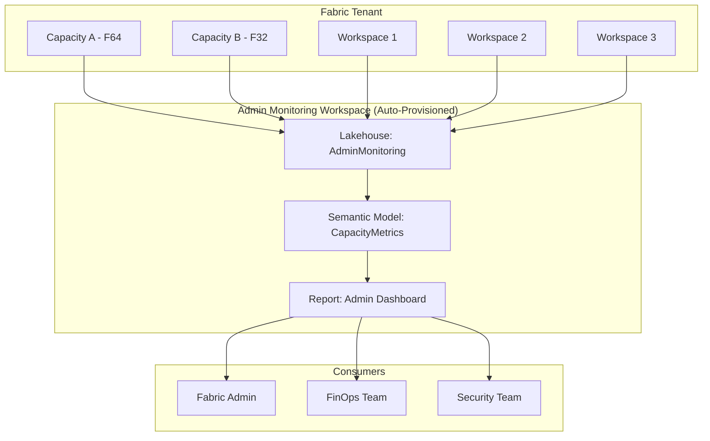
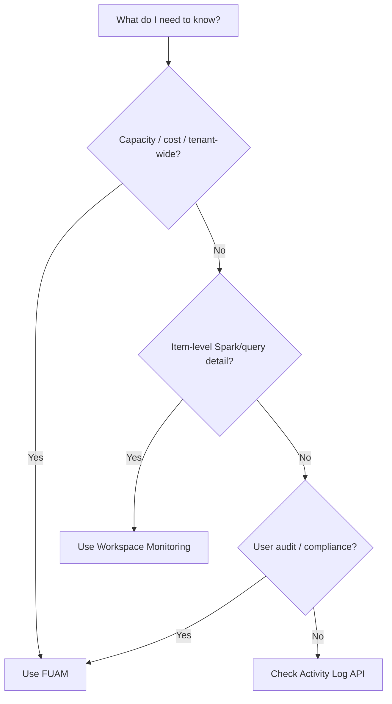

[Home](../index.md) > [Docs](../) > [Features](./) > Fabric Unified Admin Monitoring

# 📊 Fabric Unified Admin Monitoring (FUAM) - Tenant-Wide Observability

<div align="center" markdown>

**Cross-Workspace Capacity Analytics and Operational Intelligence**


</div>

---

**Last Updated:** `2026-04-27` | **Version:** 1.0.0

---

## Table of Contents

- [Overview](#-overview)
- [Architecture](#-architecture)
- [Admin Monitoring Workspace](#-admin-monitoring-workspace)
- [Key Metrics and Tables](#-key-metrics-and-tables)
- [KQL Queries for Capacity Analytics](#-kql-queries-for-capacity-analytics)
- [Custom Admin Dashboards](#-custom-admin-dashboards)
- [Alerting on Capacity Anomalies](#-alerting-on-capacity-anomalies)
- [Comparison: FUAM vs Workspace Monitoring](#-comparison-fuam-vs-workspace-monitoring)
- [RBAC for Admin Monitoring](#-rbac-for-admin-monitoring)
- [Casino Implementation](#-casino-implementation)
- [Federal Agency Implementation](#-federal-agency-implementation)
- [Limitations](#-limitations)
- [References](#-references)

---

## Overview

Fabric Unified Admin Monitoring (FUAM) is a tenant-level observability solution that auto-provisions a dedicated monitoring workspace containing a semantic model, a Lakehouse, and pre-built reports. It gives Fabric administrators visibility into capacity utilization, throttling, item execution, user activity, and cost allocation across every workspace in the tenant.

Unlike Workspace Monitoring (which focuses on individual item-level telemetry within a single workspace), FUAM provides the **platform-wide view** that capacity admins and FinOps teams need to manage costs, enforce governance, and plan capacity.

### FUAM vs Capacity Metrics App (Legacy)

| Aspect | FUAM | Capacity Metrics App (Legacy) |
|--------|------|-------------------------------|
| Data storage | Lakehouse (queryable, extensible) | Pre-built app (fixed) |
| Retention | Configurable (30-365 days) | 30 days fixed |
| Customization | Full Power BI + KQL | Limited |
| Cross-capacity | Yes | Per-capacity only |
| API access | REST + SQL endpoint | None |
| Status | GA (2025+) | Deprecated path |

---

## Architecture



### Data Flow

1. **Telemetry collection**: Fabric platform emits CU consumption, operation logs, and user activity events
2. **Lakehouse ingestion**: Events land in the Admin Monitoring Lakehouse as Delta tables
3. **Semantic model**: Auto-provisioned model with pre-built measures and relationships
4. **Reports**: Pre-built dashboards surface key metrics; you can build custom ones

---

## Admin Monitoring Workspace

### Enabling FUAM

1. Navigate to **Admin Portal** > **Tenant Settings** > **Admin Monitoring**
2. Enable **Admin Monitoring Workspace**
3. Select the capacity to host the monitoring workspace
4. Wait ~15 minutes for auto-provisioning

### Auto-Provisioned Assets

| Asset | Type | Description |
|-------|------|-------------|
| `AdminMonitoring` | Lakehouse | Delta tables with raw telemetry |
| `CapacityMetrics` | Semantic Model | Pre-built star schema for analytics |
| `Capacity Usage Report` | Power BI Report | CU consumption and throttling dashboard |
| `User Activity Report` | Power BI Report | Audit log visualization |

---

## Key Metrics and Tables

### Core Tables in the Lakehouse

| Table | Description | Key Columns |
|-------|-------------|-------------|
| `capacity_operations` | Every CU-consuming operation | `OperationId`, `WorkspaceId`, `ItemId`, `ItemType`, `CUSeconds`, `StartTime`, `EndTime`, `Status` |
| `capacity_metrics_hourly` | Aggregated CU usage per hour | `CapacityId`, `Hour`, `CUConsumed`, `CULimit`, `ThrottlingPercent`, `OverageSeconds` |
| `user_activities` | Audit log events | `UserId`, `Activity`, `ItemName`, `WorkspaceId`, `Timestamp` |
| `item_inventory` | All Fabric items in tenant | `ItemId`, `ItemType`, `WorkspaceName`, `CapacityId`, `CreatedDate`, `LastModified` |
| `throttling_events` | Capacity throttling incidents | `CapacityId`, `StartTime`, `Duration`, `SeverityLevel`, `ThrottlePercent` |

### Key DAX Measures (Pre-Built)

```dax
// Total CU consumption for selected period
Total CU Consumed =
SUM(capacity_operations[CUSeconds]) / 3600

// Throttling rate
Throttling Rate =
DIVIDE(
    COUNTROWS(FILTER(capacity_metrics_hourly, [ThrottlingPercent] > 0)),
    COUNTROWS(capacity_metrics_hourly),
    0
)

// Top consumer workspace
Top Workspace =
TOPN(
    1,
    SUMMARIZE(
        capacity_operations,
        capacity_operations[WorkspaceName],
        "TotalCU", SUM(capacity_operations[CUSeconds])
    ),
    [TotalCU], DESC
)

// Cost allocation per workspace (assuming $0.36/CU-hour for F64)
Workspace Cost =
SUMX(
    capacity_operations,
    capacity_operations[CUSeconds] / 3600 * 0.36
)
```

---

## KQL Queries for Capacity Analytics

When FUAM data is also routed to an Eventhouse (for real-time capacity analytics), use KQL:

```kql
// Top 10 most expensive operations in the last 24 hours
capacity_operations
| where StartTime > ago(24h)
| summarize TotalCU = sum(CUSeconds) by ItemType, ItemName, WorkspaceName
| top 10 by TotalCU desc
| extend TotalCUHours = round(TotalCU / 3600.0, 2)
| project WorkspaceName, ItemType, ItemName, TotalCUHours
```

```kql
// Hourly CU consumption trend with throttling overlay
capacity_metrics_hourly
| where Hour > ago(7d)
| summarize
    AvgCU = avg(CUConsumed),
    MaxCU = max(CUConsumed),
    ThrottleEvents = countif(ThrottlingPercent > 0)
    by bin(Hour, 1h), CapacityId
| render timechart
```

```kql
// Detect capacity spike anomalies (>2 std dev above mean)
let baseline = capacity_metrics_hourly
    | where Hour between(ago(30d) .. ago(1d))
    | summarize AvgCU = avg(CUConsumed), StdCU = stdev(CUConsumed) by CapacityId;
capacity_metrics_hourly
| where Hour > ago(1d)
| join kind=inner baseline on CapacityId
| where CUConsumed > AvgCU + 2 * StdCU
| project Hour, CapacityId, CUConsumed, Threshold = AvgCU + 2 * StdCU
| order by CUConsumed desc
```

```kql
// User activity audit: who ran what, when
user_activities
| where Timestamp > ago(7d)
| where Activity in ("RunNotebook", "RunPipeline", "RefreshDataset", "RunQuery")
| summarize OperationCount = count() by UserId, Activity, WorkspaceName
| top 20 by OperationCount desc
```

```kql
// Throttling frequency by day of week and hour
throttling_events
| where StartTime > ago(30d)
| extend DayOfWeek = dayofweek(StartTime), HourOfDay = hourofday(StartTime)
| summarize ThrottleCount = count() by DayOfWeek, HourOfDay
| render heatmap
```

---

## Custom Admin Dashboards

### Building a FinOps Dashboard

Connect Power BI to the Admin Monitoring Lakehouse SQL endpoint and build custom measures:

```dax
// Monthly cost by workspace (F64 at $0.36/CU-hour)
Monthly Workspace Cost =
CALCULATE(
    [Total CU Consumed] * 0.36,
    DATESINPERIOD(
        'Calendar'[Date],
        MAX('Calendar'[Date]),
        -1,
        MONTH
    )
)

// Cost trend MoM
Cost MoM Change =
VAR CurrentMonth = [Monthly Workspace Cost]
VAR PriorMonth =
    CALCULATE(
        [Monthly Workspace Cost],
        DATEADD('Calendar'[Date], -1, MONTH)
    )
RETURN
    DIVIDE(CurrentMonth - PriorMonth, PriorMonth, 0)

// Capacity utilization percentage
Capacity Utilization % =
VAR CUConsumed = [Total CU Consumed]
VAR CUAvailable = 64 * 24 * DISTINCTCOUNT('Calendar'[Date])  -- F64 = 64 CU * hours
RETURN
    DIVIDE(CUConsumed, CUAvailable, 0)
```

### Recommended Dashboard Pages

| Page | Key Visuals | Audience |
|------|-------------|----------|
| **Capacity Overview** | CU trend line, utilization gauge, throttle events | Capacity Admin |
| **Workspace Breakdown** | Treemap by CU, table by workspace | FinOps |
| **Item-Level Detail** | Top items by CU, execution duration histogram | Data Engineers |
| **User Activity** | Activity heatmap, top users, anomaly flags | Security/Compliance |
| **Cost Allocation** | Monthly cost by workspace/department, MoM trend | Finance |

---

## Alerting on Capacity Anomalies

### Data Activator (Reflex) Alerts

```json
{
    "trigger": {
        "type": "Reflex",
        "source": "capacity_metrics_hourly",
        "condition": {
            "measure": "ThrottlingPercent",
            "operator": "GreaterThan",
            "threshold": 10,
            "windowMinutes": 60
        },
        "actions": [
            {
                "type": "Email",
                "recipients": ["fabric-admins@contoso.com"],
                "subject": "Fabric Capacity Throttling Alert",
                "body": "Capacity {{CapacityId}} is throttling at {{ThrottlingPercent}}%"
            },
            {
                "type": "Teams",
                "channel": "Fabric-Ops",
                "message": "⚠️ Capacity throttling detected: {{ThrottlingPercent}}%"
            }
        ]
    }
}
```

### Recommended Alert Rules

| Alert | Condition | Severity | Action |
|-------|-----------|----------|--------|
| **High throttling** | ThrottlingPercent > 10% for 1h | Critical | Email + Teams |
| **CU spike** | CU > 2x daily average | Warning | Email |
| **Capacity near limit** | Utilization > 85% | Warning | Email + ticket |
| **Unusual user activity** | Single user > 100 operations/hour | Info | Log only |
| **Failed operations spike** | Error rate > 5% | Critical | Email + PagerDuty |

---

## Comparison: FUAM vs Workspace Monitoring

| Dimension | FUAM | Workspace Monitoring |
|-----------|------|---------------------|
| **Scope** | Entire tenant (all capacities/workspaces) | Single workspace |
| **Focus** | Capacity consumption, cost, throttling | Item execution details (Spark logs, query plans) |
| **Audience** | Fabric admins, FinOps, security | Data engineers, workspace owners |
| **Data granularity** | Operation-level CU, hourly aggregates | Spark stage/task level, query execution plans |
| **Provisioning** | Auto-provisioned at tenant level | Per-workspace enablement |
| **Customization** | Full Power BI + KQL | Full Power BI + KQL |
| **Retention** | 30-365 days (configurable) | 30 days default |
| **Complementary?** | Yes -- use FUAM for "which workspace costs most" | Yes -- use WM for "why is this notebook slow" |

### When to Use Each



---

## RBAC for Admin Monitoring

| Role | Access Level | Can See |
|------|-------------|---------|
| **Fabric Administrator** | Full access | All capacities, all workspaces, all users |
| **Capacity Administrator** | Capacity-scoped | Only their assigned capacity/capacities |
| **Workspace Admin** | Via shared reports | Only if FUAM report is shared with them |
| **FinOps Reader** | Custom role via RLS | Cost data for assigned cost centers |
| **Security Auditor** | Custom role via RLS | User activity data, no CU details |

### Implementing RLS on FUAM Reports

```dax
// Row-Level Security for cost center scoping
[CostCenterFilter] =
VAR UserEmail = USERPRINCIPALNAME()
VAR UserCostCenters =
    CALCULATETABLE(
        VALUES(CostCenterMapping[CostCenter]),
        CostCenterMapping[UserEmail] = UserEmail
    )
RETURN
    capacity_operations[CostCenter] IN UserCostCenters
```

---

## Casino Implementation

### Casino Capacity Monitoring Queries

```kql
// Casino real-time pipeline CU consumption
capacity_operations
| where WorkspaceName == "Casino-POC-Prod"
| where ItemType in ("Notebook", "Pipeline", "Eventstream")
| where StartTime > ago(24h)
| summarize
    TotalCUHours = round(sum(CUSeconds) / 3600.0, 2),
    OperationCount = count(),
    AvgDuration = avg(datetime_diff('second', EndTime, StartTime))
    by ItemType, ItemName
| order by TotalCUHours desc
```

```kql
// Detect if real-time slot telemetry is consuming disproportionate CU
capacity_operations
| where WorkspaceName == "Casino-POC-Prod"
| where ItemName has "slot_telemetry" or ItemName has "eventstream"
| where StartTime > ago(7d)
| summarize DailyCU = sum(CUSeconds) / 3600.0 by bin(StartTime, 1d)
| render columnchart with (title="Slot Telemetry CU Consumption (7d)")
```

---

## Federal Agency Implementation

### Cross-Agency Cost Allocation

```dax
// Cost per federal agency workspace
Agency Cost =
CALCULATE(
    [Total CU Consumed] * 0.36,
    FILTER(
        ALL(capacity_operations),
        capacity_operations[WorkspaceName] IN {
            "Federal-USDA-Prod",
            "Federal-SBA-Prod",
            "Federal-NOAA-Prod",
            "Federal-EPA-Prod",
            "Federal-DOI-Prod",
            "Federal-DOJ-Prod"
        }
    )
)
```

```kql
// Federal agency usage comparison
capacity_operations
| where WorkspaceName startswith "Federal-"
| where StartTime > ago(30d)
| extend Agency = extract("Federal-([A-Z]+)-", 1, WorkspaceName)
| summarize
    TotalCUHours = round(sum(CUSeconds) / 3600.0, 2),
    ItemCount = dcount(ItemId),
    UserCount = dcount(UserId)
    by Agency
| order by TotalCUHours desc
```

---

## Limitations

| Limitation | Details | Workaround |
|------------|---------|------------|
| **Tenant admin required** | Only Fabric admins can enable FUAM | Delegate via capacity admin role |
| **Provisioning delay** | 15-30 minutes after enablement | Plan ahead of go-live |
| **Data freshness** | ~15-minute lag for telemetry | Use Workspace Monitoring for real-time Spark logs |
| **Cross-tenant** | No visibility into other tenants | Export to shared Lakehouse via APIs |
| **Custom tables** | Cannot add custom tables to the auto-provisioned Lakehouse | Create a separate Lakehouse with shortcuts |
| **Historical backfill** | No data before enablement date | Enable early in POC lifecycle |

---

## References

- [Fabric Admin Monitoring overview](https://learn.microsoft.com/en-us/fabric/admin/monitoring-overview)
- [Capacity Metrics in Microsoft Fabric](https://learn.microsoft.com/en-us/fabric/enterprise/metrics-app)
- [Workspace Monitoring documentation](https://learn.microsoft.com/en-us/fabric/admin/workspace-monitoring-overview)
- [Data Activator alerting](https://learn.microsoft.com/en-us/fabric/data-activator/data-activator-introduction)
- [Fabric REST API - Admin](https://learn.microsoft.com/en-us/rest/api/fabric/admin)
