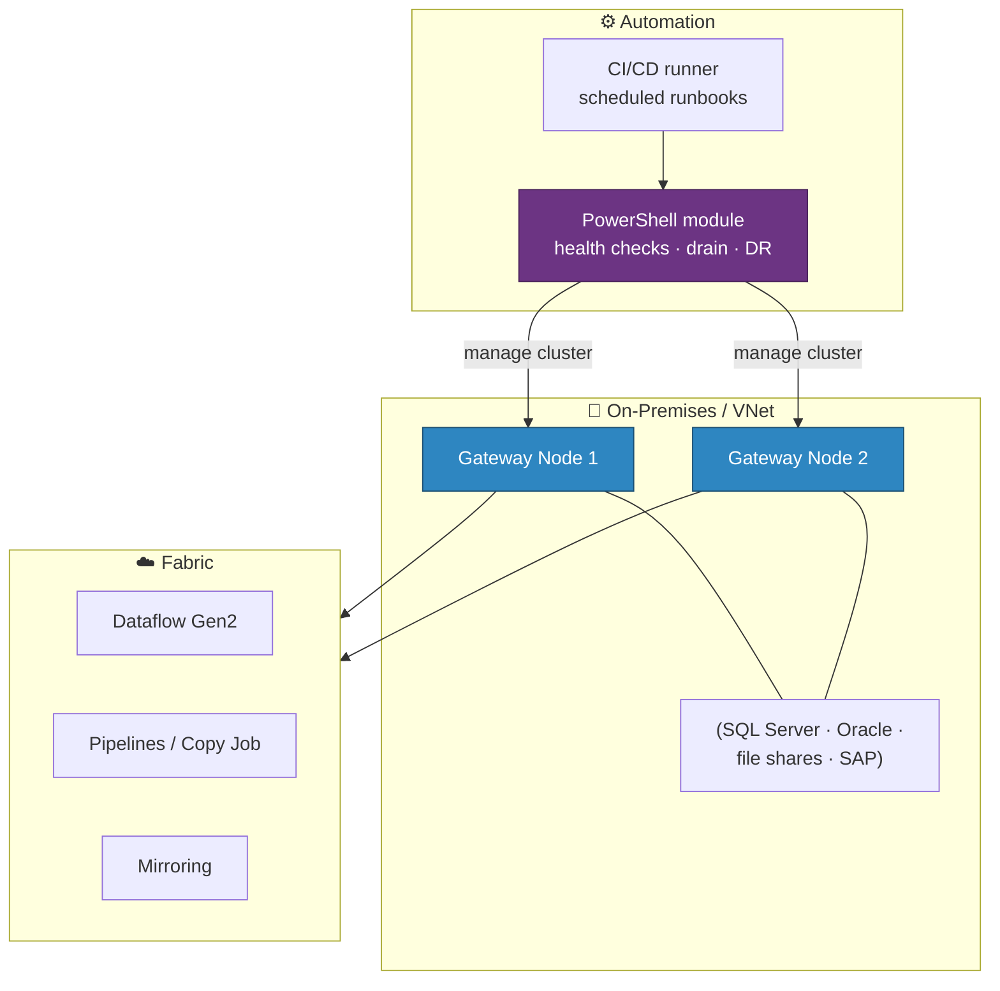

# ⚙️ PowerShell Gateway Management — Automate On-Premises Data Gateways

<div align="center" markdown>

**Script Gateway Cluster Lifecycle, Health Checks, and DR with the Gateway PowerShell Module**


</div>

---

**Last Updated:** `2026-08-22` | **Version:** 1.0.0

---

## 🎯 Overview

The **on-premises data gateway PowerShell module** (GA March 2026) brings gateway cluster management into the same automation model as the rest of your Fabric estate. Instead of clicking through the portal to check cluster health, drain a node, or add a gateway member, you script it — enabling repeatable provisioning, health monitoring, and disaster-recovery runbooks.

This closes a long-standing gap: gateways were the one piece of the connectivity story that resisted infrastructure-as-code. Now cluster inventory, member status, enable/disable operations, and deletion are all scriptable.

### What You Can Automate

| Operation | Use Case |
|-----------|----------|
| **List gateway clusters** | Inventory across the tenant; audit drift |
| **List cluster members + online/offline status** | Health dashboards, alerting on degraded clusters |
| **Enable/disable a gateway instance** | Drain a node before patching; blue/green gateway upgrades |
| **Modify gateway properties** | Standardize configuration across environments |
| **Delete a gateway** | Decommission cleanly in teardown runbooks |

---

## 🚀 Getting Started

### Install the Module

```powershell
# Elevated session
Install-Module -Name OnPremisesDataGatewayHAMgmt

# List available cmdlets
Get-Command -Module OnPremisesDataGateway*

# Built-in help with examples
Get-Help <cmdlet-name> -Examples
```

!!! note "PowerShell versions"
    The original scripts target **PowerShell 5**. On **PowerShell 7**, use the [PowerShell cmdlets for on-premises data gateway management](https://learn.microsoft.com/powershell/gateway/overview) instead.

### Example: Cluster Health Check

```powershell
# Authenticate
Connect-OnPremisesDataGatewayServiceAccount

# Inventory all clusters and member status
$clusters = Get-OnPremisesDataGatewayCluster
foreach ($cluster in $clusters) {
    $members = Get-OnPremisesDataGatewayClusterMember -ClusterId $cluster.Id
    $offline = $members | Where-Object { $_.Status -ne 'Online' }
    if ($offline) {
        Write-Warning "Cluster $($cluster.Name): $($offline.Count) member(s) offline"
        # → pipe to alerting (Teams webhook, Event Grid, Activator)
    }
}
```

### Example: Drain a Node for Patching

```powershell
# Disable the instance (stops new work routing to it)
Set-OnPremisesDataGatewayClusterMember `
    -ClusterId $clusterId `
    -MemberId $memberId `
    -Enabled $false

# ... patch, reboot, verify ...

# Re-enable
Set-OnPremisesDataGatewayClusterMember `
    -ClusterId $clusterId `
    -MemberId $memberId `
    -Enabled $true
```

---

## 🏗️ Where It Fits



For cloud-native VNet-isolated sources without on-prem infrastructure, see [VNet Data Gateway](vnet-data-gateway.md) — the PowerShell module manages the **on-premises** gateway; VNet gateways are managed via ARM/REST.

---

## 🎰 Casino POC Use Cases

1. **Migration runbooks** — the Teradata/SAS migration tutorials assume on-prem sources; scripted gateway provisioning makes the connectivity step reproducible across dev/test/prod.
2. **Patching without downtime** — drain one cluster member, patch, re-enable, repeat. Scripted instead of manual portal clicks.
3. **DR drills** — the [BCDR best-practice doc](../best-practices/disaster-recovery-bcdr.md) calls for tested recovery; a scripted "stand up replacement gateway cluster" runbook turns a manual checklist into an executable.
4. **Compliance evidence** — scheduled inventory scripts produce an auditable record of gateway topology over time.

---

## ⚠️ Considerations

| Consideration | Detail |
|---------------|--------|
| **Two modules** | PowerShell 5 scripts (`OnPremisesDataGatewayHAMgmt`) vs. PowerShell 7 cmdlets — pick per your runner environment |
| **Permissions** | Cmdlets act as the signed-in gateway administrator; use a dedicated service account for automation |
| **Scope** | Manages **on-premises data gateway** clusters only — VNet gateways and personal-mode gateways have different management surfaces |
| **Secrets** | Never hardcode credentials in runbooks; pull from Key Vault (see [Security guidelines](../security.md)) |

---

## 🔗 Related Documents

- [VNet Data Gateway](vnet-data-gateway.md) — Cloud-native gateway for VNet-isolated sources
- [Dataflow Gen2](dataflow-gen2.md) — Low-code ETL that routes through gateways for on-prem sources
- [Mirroring](mirroring.md) — Database replication, including on-prem sources via gateway
- [Network Security](../best-practices/network-security.md) — Firewall, private endpoints, and gateway placement
- [Disaster Recovery & BCDR](../best-practices/disaster-recovery-bcdr.md) — Gateway recovery runbooks

---

> 📝 **Document Metadata**
> - **Author**: Documentation Team
> - **Reviewers**: Platform Engineering, Networking
> - **Classification**: Internal
> - **Next Review**: 2026-11-22
