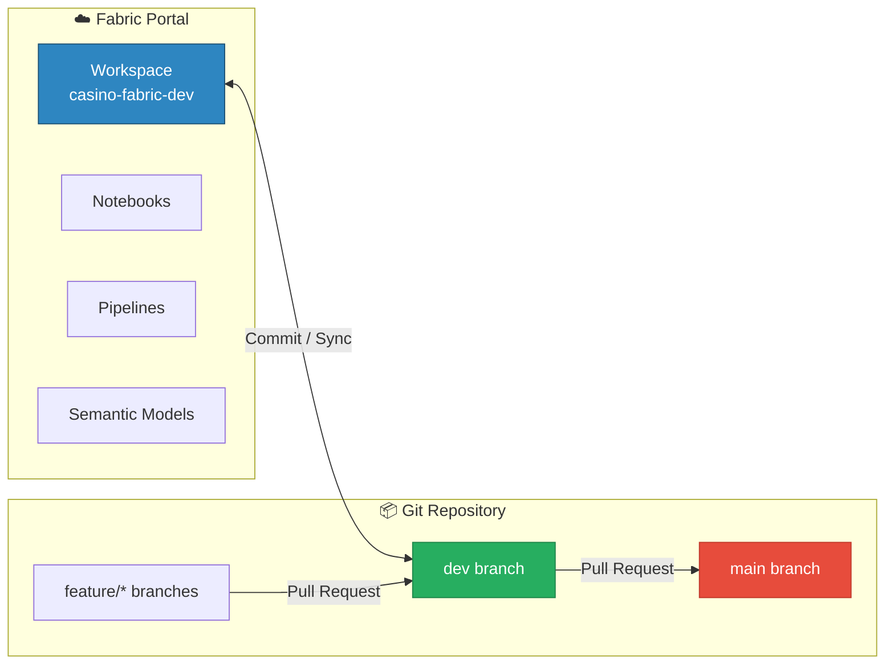
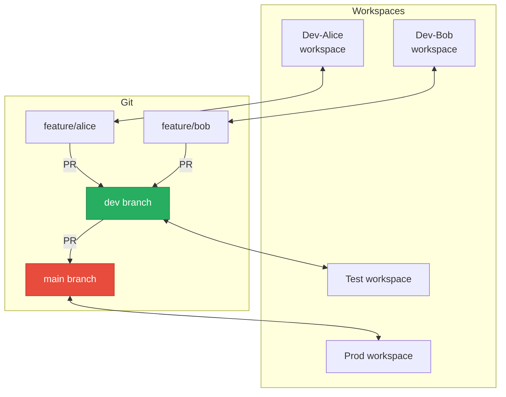

# 🔀 Git Integration for Fabric

<div align="center" markdown>

**Source Control and Multi-Developer Collaboration**


</div>

---

**Last Updated:** `2026-04-21` | **Version:** 1.0.0

---

## 🎯 Overview

Fabric Git Integration connects a workspace to a **Git repository** (Azure DevOps or GitHub), enabling source control for Fabric items. Changes made in the Fabric portal are committed to Git, and changes pushed to Git are synced back to the workspace. This provides version history, branching, pull requests, and code review for notebooks, pipelines, semantic models, and other Fabric items.

### Key Capabilities

| Capability | Description |
|-----------|-------------|
| **Bi-Directional Sync** | Workspace ↔ Git in both directions |
| **Azure DevOps + GitHub** | Supports both Git providers |
| **Branch-Per-Developer** | Each developer works in their own feature branch |
| **Selective Sync** | Choose which items to include in Git |
| **Conflict Detection** | Identifies conflicting changes between workspace and Git |
| **Supported Items** | Notebooks, Pipelines, Semantic Models, Reports, Lakehouses, Warehouses, Environments, and more |
| **Item Serialization** | Fabric items are serialized as JSON/YAML/source files in Git |

### Git Integration vs. Deployment Pipelines vs. fabric-cicd

| Aspect | Git Integration | Deployment Pipelines | fabric-cicd |
|--------|---------------|---------------------|-------------|
| **Purpose** | Source control | Stage promotion | Programmatic deployment |
| **Direction** | Workspace ↔ Git repo | Workspace → Workspace | Git repo → Workspace |
| **Branching** | ✅ Full branching | ❌ | ✅ Branch-based |
| **Code Review** | ✅ PR-based | ❌ | ✅ PR-based |
| **Conflict Resolution** | ✅ Git merge | ❌ (overwrite) | ✅ Git merge |
| **Best For** | Development collaboration | Visual promotion | CI/CD automation |

---

## 🏗️ Architecture

### Sync Architecture



### Repository Structure

When Git Integration is enabled, Fabric items are serialized into the repo:

```
casino-fabric/
├── casino-fabric-dev.Workspace/
│   ├── 01_bronze_slot_telemetry.Notebook/
│   │   ├── notebook-content.py
│   │   └── .platform
│   ├── 01_silver_slot_cleansed.Notebook/
│   │   ├── notebook-content.py
│   │   └── .platform
│   ├── daily_revenue_pipeline.DataPipeline/
│   │   ├── pipeline-content.json
│   │   └── .platform
│   ├── slot_analytics.SemanticModel/
│   │   ├── definition/
│   │   │   ├── model.bim
│   │   │   └── diagramLayout.json
│   │   └── .platform
│   ├── lh_bronze.Lakehouse/
│   │   └── .platform
│   └── env-casino-analytics.Environment/
│       ├── Setting/
│       │   └── Sparkcompute.yml
│       ├── PublicLibraries/
│       │   └── requirements.yml
│       └── .platform
```

### The `.platform` File

Every Fabric item includes a `.platform` metadata file:

```json
{
    "$schema": "https://developer.microsoft.com/json-schemas/fabric/gitIntegration/platformProperties/2.0.0/schema.json",
    "metadata": {
        "type": "Notebook",
        "displayName": "01_bronze_slot_telemetry"
    },
    "config": {
        "version": "2.0",
        "logicalId": "a1b2c3d4-e5f6-7890-abcd-ef1234567890"
    }
}
```

---

## ⚙️ Configuration

### Connecting a Workspace to Git

1. Open the workspace → **Workspace settings** → **Git integration**
2. Select provider: **Azure DevOps** or **GitHub**
3. Authenticate and select:
   - **Organization / Account**
   - **Repository**
   - **Branch** (typically `dev` or `main`)
   - **Folder** (root or subfolder)
4. Click **Connect and sync**

### Azure DevOps Setup

```
Workspace Settings → Git Integration
  Provider: Azure DevOps
  Organization: contoso-gaming
  Project: casino-analytics
  Repository: fabric-items
  Branch: dev
  Git folder: /casino-fabric-dev
```

### GitHub Setup

```
Workspace Settings → Git Integration
  Provider: GitHub
  Account: contoso-gaming
  Repository: fabric-items
  Branch: dev
  Git folder: /casino-fabric-dev
```

> 💡 **Tip**: Use a dedicated branch per workspace. Map `dev` branch to the Dev workspace, and use PRs to promote to `main` (which maps to the Prod workspace or deploys via fabric-cicd).

### Branch Policies (Recommended)

Configure in Azure DevOps or GitHub:

| Policy | Setting | Purpose |
|--------|---------|---------|
| **Require PR** | Require pull request for `main` | Prevent direct pushes to production branch |
| **Reviewers** | Minimum 1 reviewer | Code review before merge |
| **Build Validation** | Run Bicep/pytest on PR | Automated quality gates |
| **Comment Resolution** | Require all comments resolved | Ensure feedback is addressed |
| **Branch Naming** | `feature/*`, `bugfix/*` | Consistent naming |

---

## 🔄 Sync Workflows

### Commit from Workspace to Git

When you modify items in the Fabric portal:

1. **Source Control** panel shows uncommitted changes
2. Review changed items (diff view)
3. Enter commit message
4. Click **Commit**

```
Source Control Panel:
  Modified items:
    ✅ 01_bronze_slot_telemetry.Notebook    (2 cells modified)
    ✅ daily_revenue_pipeline.DataPipeline  (new activity added)
    ☐  slot_analytics.SemanticModel         (no changes)

  Commit message: "feat: add compliance filter to bronze ingestion"
  [Commit]
```

### Sync from Git to Workspace

When changes are pushed to the connected branch:

1. **Source Control** panel shows incoming changes
2. Review what will be updated
3. Click **Update All**

### Conflict Resolution

When both workspace and Git have changes to the same item:

```
Conflict detected:
  01_bronze_slot_telemetry.Notebook
    Workspace version: Modified cell 3 (add filter)
    Git version: Modified cell 5 (add column)

  Options:
    [Accept workspace version]
    [Accept Git version]
    [Keep both changes (manual merge)]
```

> ⚠️ Fabric conflict resolution is item-level, not line-level. For complex merges, resolve in your Git client (VS Code, etc.) and then sync.

---

## 👥 Multi-Developer Patterns

### Pattern 1: Branch-Per-Workspace



**How it works:**
1. Each developer has their own workspace connected to a feature branch
2. Developer commits changes from workspace to their branch
3. Developer opens a PR from feature branch → `dev`
4. After review and merge, Test workspace syncs from `dev`
5. After QA, PR from `dev` → `main`, Prod workspace syncs

### Pattern 2: Shared Dev Workspace

```
Shared workspace: casino-fabric-dev
  Connected to: dev branch
  
  Developer workflow:
  1. Work in shared workspace
  2. Commit changes to dev branch
  3. Create PR from dev → main for production
```

Simpler but riskier — changes are immediate in the shared workspace. Best for small teams (2-3 developers).

---

## 🎰 Casino Implementation

### Repository Structure

```
casino-fabric/
├── casino-fabric-dev.Workspace/
│   ├── Bronze Notebooks (17)/
│   ├── Silver Notebooks (16)/
│   ├── Gold Notebooks (18)/
│   ├── Pipelines (4)/
│   ├── Semantic Models (2)/
│   ├── Reports (5)/
│   ├── Lakehouses (3)/
│   └── Environments (1)/
├── .github/
│   └── workflows/
│       └── deploy-fabric.yml
├── validation/
│   └── unit_tests/
└── README.md
```

### Branching Strategy

| Branch | Purpose | Workspace |
|--------|---------|-----------|
| `main` | Production-ready items | `casino-fabric-prod` |
| `dev` | Integration branch | `casino-fabric-test` |
| `feature/*` | Individual features | Developer personal workspace |
| `hotfix/*` | Production fixes | Dedicated hotfix workspace |

---

## 🏛️ Federal Implementation

### Compliance Considerations

| Requirement | Implementation |
|-------------|---------------|
| **Audit Trail** | Git commit history provides full change log |
| **Access Control** | Branch policies restrict who can merge to production |
| **Segregation of Duties** | Different approvers for dev → test vs. test → prod PRs |
| **Change Documentation** | PR descriptions document the what and why |

### Multi-Agency Repository Options

| Strategy | Structure | Best For |
|----------|-----------|----------|
| **Monorepo** | All agencies in one repo, folders per workspace | Small team, shared standards |
| **Repo per Agency** | Separate repos | Independent agency teams |
| **Shared + Agency** | Shared repo for common, per-agency repos for specific | Federated teams |

---

## ⚠️ Limitations

| Limitation | Details | Workaround |
|-----------|---------|-----------|
| **Not All Items** | Some items not yet supported (Dataflow Gen2, Reflex) | Track manually or use fabric-cicd |
| **Item-Level Diff** | No line-level diff in Fabric portal | Use Git client for detailed diffs |
| **One Branch** | Workspace connects to one branch at a time | Use Branch-Per-Workspace pattern |
| **No Partial Sync** | Cannot sync individual items (all or nothing) | Use selective commit instead |
| **Serialization Format** | Item format may change between Fabric versions | Pin to API version in `.platform` |
| **Large Semantic Models** | `.bim` files can be large and hard to diff | Use TMDL format when available |

---

## 📚 References

| Resource | URL |
|----------|-----|
| Git Integration Overview | https://learn.microsoft.com/fabric/cicd/git-integration/intro-to-git-integration |
| Connect to Azure DevOps | https://learn.microsoft.com/fabric/cicd/git-integration/git-get-started |
| Connect to GitHub | https://learn.microsoft.com/fabric/cicd/git-integration/git-integration-with-github |
| Supported Items | https://learn.microsoft.com/fabric/cicd/git-integration/git-integration-process |
| Conflict Resolution | https://learn.microsoft.com/fabric/cicd/git-integration/conflict-resolution |
| Best Practices | https://learn.microsoft.com/fabric/cicd/git-integration/git-best-practices |

---

## 🔗 Related Documents

- [Deployment Pipelines](deployment-pipelines.md) — Stage-based promotion
- [Fabric CI/CD Deployment](../best-practices/fabric-cicd-deployment.md) — Programmatic deployment with fabric-cicd
- [Identity & RBAC Patterns](../best-practices/identity-rbac-patterns.md) — Access control
- [Architecture](../ARCHITECTURE.md) — System architecture

---

> 📝 **Document Metadata**
> - **Author**: Documentation Team
> - **Reviewers**: Platform Engineering, DevOps
> - **Classification**: Internal
> - **Next Review**: 2026-07-21
