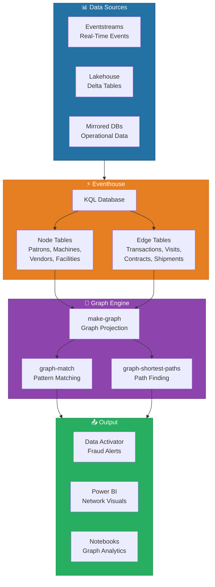

# 🔗 Graph in Fabric — Relationship Modeling and Graph Analytics

<div align="center" markdown>

**Native Graph Querying for Fraud Detection, Network Analysis, and Recommendations**


</div>

---

**Last Updated:** `2026-04-22` | **Version:** 1.0.0

---

## 🎯 Overview

Graph in Fabric is a generally available capability announced at FabCon Atlanta in March 2026 that brings native entity-relationship modeling and graph querying to Microsoft Fabric. Built on top of Eventhouse and KQL databases, Graph in Fabric lets organizations model complex relationships between entities -- patrons, transactions, machines, employees, vendors, facilities -- and query those relationships using graph semantics directly within KQL.

Traditional relational queries struggle with multi-hop relationship traversal. Finding whether two patrons share a common intermediary who also transacts at a specific machine requires complex self-joins that become exponentially expensive as hop depth increases. Graph in Fabric solves this by representing entities as **nodes** and relationships as **edges** in a property graph model, then exposing graph traversal operators (`make-graph`, `graph-match`, `graph-shortest-paths`) as first-class KQL constructs.

### Key Capabilities

| Capability | Description |
|-----------|-------------|
| **Node/Edge Modeling** | Define entities as nodes and relationships as edges with typed properties |
| **Graph Match Patterns** | Declarative pattern matching using ASCII-art syntax within KQL |
| **Shortest Path** | Find shortest paths between nodes with optional filters and constraints |
| **Variable-Length Paths** | Traverse 1..N hops to discover indirect relationships |
| **Property Filters** | Filter nodes and edges by property values during traversal |
| **Graph Projection** | Create named graph projections from existing KQL tables |
| **Integration** | Results flow into Data Activator alerts, Power BI visuals, and downstream KQL queries |

### Where Graph in Fabric Fits

Graph in Fabric is not a standalone graph database -- it is a **query-time graph projection** layer on top of Eventhouse KQL databases. Existing tables are projected into a graph model using `make-graph`, and graph queries run on that projection. This means no data duplication, no separate graph infrastructure, and full KQL interoperability.

---

## 🏗️ Architecture Overview



### Data Flow

1. **Ingestion**: Raw events flow from Eventstreams, Lakehouses, or Mirrored databases into Eventhouse KQL tables
2. **Node/Edge Tables**: Data is organized into node tables (entities) and edge tables (relationships)
3. **Graph Projection**: `make-graph` creates an in-memory graph from node and edge tables at query time
4. **Pattern Matching**: `graph-match` and `graph-shortest-paths` traverse the graph to find patterns
5. **Output**: Results feed into Data Activator (alerts), Power BI (visualization), or notebooks (analysis)

---

## ⚙️ Setup and Configuration

### Step 1: Create or Use an Existing Eventhouse

Graph in Fabric operates on KQL databases within an Eventhouse. If you already have an Eventhouse for real-time analytics, you can add graph capabilities to the same database.

```
Fabric Portal → + New → Eventhouse
  Name: evh-graph-analytics
  Workspace: ws-gaming-analytics
```

### Step 2: Define Node Tables

Create tables representing entities (nodes) in your graph. Each node table must have a unique identifier column.

```kql
// Patron node table
.create table Patrons (
    PatronId: string,
    Name: string,
    TierLevel: string,
    JoinDate: datetime,
    RiskScore: int
)

// Machine node table
.create table Machines (
    MachineId: string,
    MachineType: string,
    FloorLocation: string,
    Denomination: decimal
)

// Employee node table
.create table Employees (
    EmployeeId: string,
    Name: string,
    Role: string,
    Department: string
)
```

### Step 3: Define Edge Tables

Create tables representing relationships (edges) between entities. Each edge table must have source and target columns that reference node identifiers.

```kql
// Transaction edges: Patron → Machine
.create table Transactions (
    TransactionId: string,
    PatronId: string,      // Source node
    MachineId: string,     // Target node
    Timestamp: datetime,
    Amount: decimal,
    TransactionType: string
)

// Patron-to-Patron edges (shared sessions, referrals)
.create table PatronRelationships (
    RelationshipId: string,
    PatronId1: string,     // Source node
    PatronId2: string,     // Target node
    RelationshipType: string,
    FirstObserved: datetime
)
```

### Step 4: Ingest Data

Use Eventstreams or batch ingestion to populate node and edge tables:

```kql
// Batch ingest from Lakehouse (one-time or scheduled)
.set-or-append Patrons <|
    external_table('lh_gold.gold_player_profiles')
    | project PatronId = player_id, Name = player_name,
              TierLevel = tier_level, JoinDate = registration_date,
              RiskScore = risk_score

// Continuous ingestion via Eventstream mapping
// Configure Eventstream → Eventhouse destination with table mapping
```

### Step 5: Query the Graph

Use `make-graph` to project tables into a graph and `graph-match` to traverse:

```kql
// Basic graph query: Find all patrons who transacted on the same machine
Transactions
| make-graph PatronId --> MachineId with Patrons on PatronId, Machines on MachineId
| graph-match (patron1)-[tx1]->(machine)<-[tx2]-(patron2)
    where patron1.PatronId != patron2.PatronId
    and tx1.Amount > 5000
    and tx2.Amount > 5000
| project patron1.PatronId, patron2.PatronId, machine.MachineId,
          tx1.Amount, tx2.Amount, tx1.Timestamp
```

---

## 🔍 Graph Query Patterns

### Pattern 1: Direct Relationship Query

Find all machines a specific patron has used:

```kql
Transactions
| make-graph PatronId --> MachineId with Patrons on PatronId, Machines on MachineId
| graph-match (patron)-[tx]->(machine)
    where patron.PatronId == "P-12345"
| project machine.MachineId, machine.FloorLocation,
          tx.Amount, tx.Timestamp
| order by tx.Timestamp desc
```

### Pattern 2: Two-Hop Traversal

Find patrons connected through a shared machine (co-location pattern):

```kql
Transactions
| make-graph PatronId --> MachineId with Patrons on PatronId, Machines on MachineId
| graph-match (p1)-[tx1]->(machine)<-[tx2]-(p2)
    where p1.PatronId != p2.PatronId
    and abs(datetime_diff('minute', tx1.Timestamp, tx2.Timestamp)) < 30
| summarize SharedMachines = dcount(machine.MachineId),
            CoLocationCount = count()
    by p1.PatronId, p2.PatronId
| where CoLocationCount >= 3
| order by CoLocationCount desc
```

### Pattern 3: Shortest Path

Find the shortest connection between two patrons:

```kql
Transactions
| make-graph PatronId --> MachineId with Patrons on PatronId, Machines on MachineId
| graph-shortest-paths (source)-[e*1..5]->(target)
    where source.PatronId == "P-12345"
    and target.PatronId == "P-67890"
| project PathLength = array_length(e),
          PathNodes = e
```

### Pattern 4: Aggregated Graph Metrics

Calculate node degree (number of connections) for risk scoring:

```kql
Transactions
| make-graph PatronId --> MachineId with Patrons on PatronId, Machines on MachineId
| graph-match (patron)-[tx]->(machine)
| summarize UniqueMachines = dcount(machine.MachineId),
            TotalTransactions = count(),
            TotalAmount = sum(tx.Amount)
    by patron.PatronId, patron.TierLevel, patron.RiskScore
| extend ConnectionDensity = TotalTransactions / UniqueMachines
| order by ConnectionDensity desc
```

### Pattern 5: Temporal Graph Pattern

Find patrons with rapid machine-hopping (structuring indicator):

```kql
Transactions
| where Timestamp > ago(24h)
| make-graph PatronId --> MachineId with Patrons on PatronId, Machines on MachineId
| graph-match (patron)-[tx]->(machine)
| summarize Machines = make_set(machine.MachineId),
            Timestamps = make_list(tx.Timestamp),
            Amounts = make_list(tx.Amount)
    by patron.PatronId
| where array_length(Machines) >= 5
| extend AvgTimeBetween = datetime_diff('minute',
    Timestamps[array_length(Timestamps)-1], Timestamps[0]) / array_length(Timestamps)
| where AvgTimeBetween < 15
| project patron.PatronId, MachineCount = array_length(Machines),
          AvgTimeBetween, TotalAmount = array_sum(Amounts)
```

---

## 🎰 Casino Fraud Detection Use Case

Casino compliance teams face a critical challenge: identifying structuring patterns where patrons split transactions across multiple machines or time periods to stay below the $10,000 CTR threshold. Graph queries excel at detecting these multi-entity, multi-hop patterns that are nearly impossible to find with traditional SQL.

### Structuring Detection via Graph Traversal

```kql
// Detect structuring: patrons with multiple transactions $8K-$9.9K within 24 hours
Transactions
| where Timestamp > ago(24h)
| where Amount between (8000.0 .. 9999.99)
| make-graph PatronId --> MachineId with Patrons on PatronId, Machines on MachineId
| graph-match (patron)-[tx]->(machine)
| summarize
    TransactionCount = count(),
    TotalAmount = sum(tx.Amount),
    MachinesUsed = dcount(machine.MachineId),
    Transactions = make_list(pack(
        "machine", machine.MachineId,
        "amount", tx.Amount,
        "time", tx.Timestamp
    ))
    by patron.PatronId, patron.Name, patron.RiskScore
| where TransactionCount >= 3 and TotalAmount >= 20000
| extend StructuringRisk = case(
    TotalAmount >= 30000 and MachinesUsed >= 4, "Critical",
    TotalAmount >= 25000 and MachinesUsed >= 3, "High",
    "Medium")
| order by TotalAmount desc
```

### Money Laundering Network Detection

```kql
// Find patron clusters: groups of patrons who share machines and have
// correlated transaction timing (potential coordinated activity)
Transactions
| where Timestamp > ago(7d)
| make-graph PatronId --> MachineId with Patrons on PatronId, Machines on MachineId
| graph-match (p1)-[tx1]->(machine)<-[tx2]-(p2)
    where p1.PatronId != p2.PatronId
    and abs(datetime_diff('minute', tx1.Timestamp, tx2.Timestamp)) < 60
    and tx1.Amount > 2000
    and tx2.Amount > 2000
| summarize
    SharedMachines = dcount(machine.MachineId),
    Interactions = count(),
    CombinedAmount = sum(tx1.Amount) + sum(tx2.Amount)
    by p1.PatronId, p2.PatronId
| where Interactions >= 5
| order by CombinedAmount desc
```

### Employee-Patron Collusion Detection

```kql
// Detect suspicious employee-patron relationships
// Employees who authorize payouts for the same patron repeatedly
let PayoutAuthorizations = datatable(
    AuthId: string, EmployeeId: string, PatronId: string,
    PayoutAmount: decimal, Timestamp: datetime
) [/* populated from Eventstream */];
PayoutAuthorizations
| make-graph EmployeeId --> PatronId
    with Employees on EmployeeId, Patrons on PatronId
| graph-match (employee)-[auth]->(patron)
| summarize
    AuthorizationCount = count(),
    TotalPayout = sum(auth.PayoutAmount),
    AvgPayout = avg(auth.PayoutAmount)
    by employee.EmployeeId, employee.Name, employee.Role,
       patron.PatronId, patron.Name
| where AuthorizationCount >= 10
| extend SuspicionLevel = case(
    AuthorizationCount >= 20 and TotalPayout >= 50000, "Critical",
    AuthorizationCount >= 15, "High",
    "Medium")
| order by TotalPayout desc
```

### W-2G Jackpot Network Analysis

```kql
// Identify patrons with frequent high-value jackpots across multiple machines
// W-2G threshold: $1,200 (slots), $600 (table games), $5,000 (poker)
Transactions
| where Amount >= 1200 and TransactionType == "jackpot"
| where Timestamp > ago(30d)
| make-graph PatronId --> MachineId with Patrons on PatronId, Machines on MachineId
| graph-match (patron)-[tx]->(machine)
| summarize
    JackpotCount = count(),
    TotalWinnings = sum(tx.Amount),
    MachinesHit = dcount(machine.MachineId),
    Locations = make_set(machine.FloorLocation)
    by patron.PatronId, patron.Name
| where JackpotCount >= 5
| extend AnomalyScore = JackpotCount * MachinesHit
| order by AnomalyScore desc
```

---

## 🏛️ Federal Use Cases

### DOI/SBA — Procurement Fraud Detection

Detect vendor collusion in government contracts by modeling vendors, contracts, and agencies as a graph:

```kql
// Node tables: Vendors, Agencies, Contracts
// Edge table: ContractAwards (Agency → Vendor)
ContractAwards
| make-graph AgencyId --> VendorId
    with Agencies on AgencyId, Vendors on VendorId
| graph-match (agency)-[c1]->(vendor1)-[sub]->(vendor2)<-[c2]-(agency)
    where vendor1.VendorId != vendor2.VendorId
    and c1.AwardAmount > 100000
| summarize
    SharedContracts = count(),
    TotalValue = sum(c1.AwardAmount)
    by vendor1.VendorName, vendor2.VendorName, agency.AgencyName
| where SharedContracts >= 3
| order by TotalValue desc
```

### USDA — Supply Chain Traceability

Model the food supply chain from farm to table, enabling rapid tracing during contamination events:

```kql
// Supply chain graph: Farm → Processor → Distributor → Retailer
SupplyChainShipments
| make-graph SourceFacilityId --> DestFacilityId
    with Facilities on FacilityId
| graph-shortest-paths (source)-[shipment*1..6]->(destination)
    where source.FacilityId == "FARM-12345"
    and source.FacilityType == "Farm"
| project
    PathLength = array_length(shipment),
    SourceFarm = source.FacilityName,
    Destination = destination.FacilityName,
    DestType = destination.FacilityType,
    Products = shipment[0].ProductType
| order by PathLength asc
```

### EPA — Facility Emission Relationship Mapping

```kql
// Map relationships between parent companies, facilities, and chemical releases
FacilityOwnership
| make-graph ParentCompanyId --> FacilityId
    with Companies on CompanyId, Facilities on FacilityId
| graph-match (company)-[owns]->(facility)
| summarize
    FacilityCount = dcount(facility.FacilityId),
    TotalReleases = sum(facility.AnnualReleaseLbs),
    States = make_set(facility.State)
    by company.CompanyName
| order by TotalReleases desc
```

---

## 🔌 Integration Points

### Data Activator — Alert on Graph Pattern Matches

Configure Data Activator to trigger alerts when graph queries detect suspicious patterns:

```kql
// Create a KQL queryset that runs every 15 minutes
// Data Activator monitors the output and triggers when StructuringRisk == "Critical"
Transactions
| where Timestamp > ago(1h)
| where Amount between (8000.0 .. 9999.99)
| make-graph PatronId --> MachineId with Patrons on PatronId, Machines on MachineId
| graph-match (patron)-[tx]->(machine)
| summarize TransactionCount = count(), TotalAmount = sum(tx.Amount)
    by patron.PatronId
| where TransactionCount >= 3 and TotalAmount >= 25000
```

### Power BI — Network Visualization

Graph query results can be rendered in Power BI using the **Force-Directed Graph** custom visual or the native **Decomposition Tree**:

1. Create a KQL queryset with your graph query
2. Pin the queryset as a data source in a Power BI report
3. Map node and edge columns to the Force-Directed Graph visual
4. Use slicers for time range, risk level, and entity type filters

### Notebooks — Advanced Graph Analytics

For complex analytics (community detection, PageRank, centrality), export graph results to a Spark notebook:

```python
# In a Fabric notebook
df_graph_results = spark.sql("""
    SELECT * FROM eventhouse_graph_output
    WHERE pattern_type = 'structuring'
""")

# Use NetworkX or GraphFrames for advanced algorithms
import networkx as nx
G = nx.from_pandas_edgelist(df_graph_results.toPandas(),
    source='patron1', target='patron2', edge_attr='shared_machines')
centrality = nx.betweenness_centrality(G)
```

---

## ⚡ Performance Considerations

| Consideration | Recommendation |
|--------------|----------------|
| **Graph Size** | Keep projected graphs under 10M edges for interactive query performance |
| **Time Window** | Filter edge tables to a specific time window before `make-graph` to reduce projection size |
| **Hop Depth** | Limit variable-length paths to 5 hops maximum; deeper traversals degrade exponentially |
| **Materialized Views** | Use KQL materialized views to pre-aggregate edge tables for common graph patterns |
| **Caching** | Graph projections are not cached between queries; each `make-graph` rebuilds the projection |
| **Partitioning** | Partition edge tables by time to enable efficient pruning during graph construction |
| **Concurrent Queries** | Graph queries consume significant memory; limit concurrent graph queries per KQL database |

### Query Optimization Example

```kql
// ❌ Unoptimized: Projects entire transaction history into graph
Transactions
| make-graph PatronId --> MachineId with Patrons on PatronId, Machines on MachineId
| graph-match (p1)-[tx]->(m)
| where tx.Timestamp > ago(24h) and tx.Amount > 5000

// ✅ Optimized: Filter BEFORE graph projection
Transactions
| where Timestamp > ago(24h) and Amount > 5000
| make-graph PatronId --> MachineId with Patrons on PatronId, Machines on MachineId
| graph-match (p1)-[tx]->(m)
```

---

## ⚠️ Limitations

| Limitation | Details | Workaround |
|-----------|---------|-----------|
| **Query-Time Projection** | Graphs are projected at query time from KQL tables; no persistent graph store | Use materialized views to speed up repeated projections |
| **KQL Only** | Graph semantics are available only in KQL; no SQL graph syntax in Lakehouse/Warehouse | Export graph results to Lakehouse for SQL-based consumers |
| **No Graph Mutations** | Cannot add/remove nodes or edges via graph operators; modify underlying tables instead | Use standard KQL `.set-or-append` or Eventstream ingestion |
| **Visual Tooling** | No native graph visualization in Fabric portal; requires Power BI custom visuals | Use Force-Directed Graph visual or export to third-party tools |
| **Max Path Length** | Variable-length paths limited to 10 hops by default | Adjust via query hint if needed; consider performance impact |
| **Property Types** | Edge and node properties must be scalar types; no nested objects | Flatten complex properties before ingestion |

---

## 📚 References

| Resource | URL |
|----------|-----|
| Graph in Fabric Overview | https://learn.microsoft.com/fabric/real-time-intelligence/graph-overview |
| KQL graph-match Operator | https://learn.microsoft.com/kusto/query/graph-match-operator |
| KQL make-graph Operator | https://learn.microsoft.com/kusto/query/make-graph-operator |
| KQL graph-shortest-paths | https://learn.microsoft.com/kusto/query/graph-shortest-paths-operator |
| Eventhouse Documentation | https://learn.microsoft.com/fabric/real-time-intelligence/eventhouse |
| FabCon Atlanta 2026 Announcements | https://blog.fabric.microsoft.com/blog/fabcon-atlanta-2026 |
| Data Activator Overview | https://learn.microsoft.com/fabric/data-activator/data-activator-introduction |

---

## 🔗 Related Documents

- [Real-Time Intelligence](real-time-intelligence.md) -- Eventhouse and KQL databases that power graph queries
- [Digital Twin Builder](digital-twin-builder.md) -- Entity-relationship modeling with real-time state tracking
- [Data Agents](data-agents.md) -- AI agents that can execute graph queries via MCP
- [Fabric MCP](fabric-mcp.md) -- MCP Server for programmatic graph query execution
- [OneLake Security](onelake-security.md) -- Security controls on graph data
- [Monitoring & Observability](../best-practices/monitoring-observability.md) -- Monitoring graph query performance
- [Architecture](../ARCHITECTURE.md) -- System architecture overview

---

> 📝 **Document Metadata**
> - **Author**: Documentation Team
> - **Reviewers**: Data Engineering, Real-Time Intelligence, Security, Compliance
> - **Classification**: Internal
> - **Next Review**: 2026-07-22
