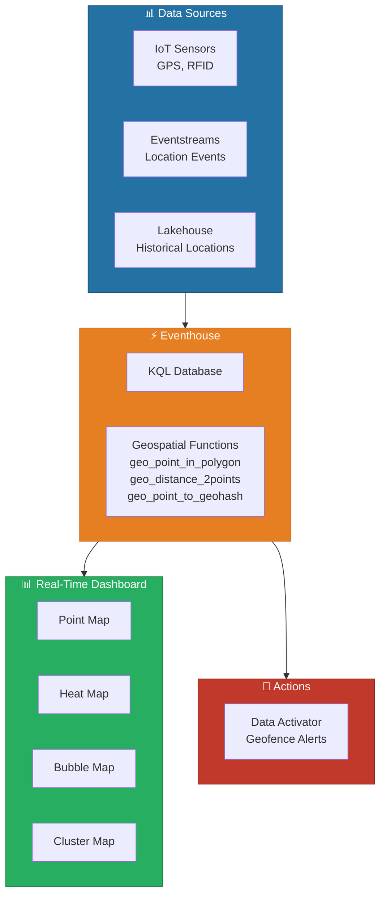

# 🗺️ Maps in Fabric — Native Geospatial Visualization

<div align="center" markdown>

**Geospatial Analytics and Map Visuals in Real-Time Dashboards**


</div>

---

**Last Updated:** `2026-04-22` | **Version:** 1.0.0

---

## 🎯 Overview

Maps in Fabric is a generally available native geospatial visualization capability within Real-Time Dashboards. Unlike external mapping integrations (such as ArcGIS in Tutorial 21), Maps in Fabric is built directly into the RTI dashboard experience, requiring no additional licensing or external service connections.

Maps in Fabric renders geospatial data from Eventhouse KQL databases as interactive map visuals -- point maps, heat maps, bubble maps, and cluster maps -- with real-time data refresh. Combined with KQL's geospatial functions (`geo_point_in_polygon`, `geo_distance_2points`, `geo_point_to_geohash`), analysts can build location-aware dashboards that update as events stream in.

### Key Capabilities

| Capability | Description |
|-----------|-------------|
| **Point Maps** | Plot individual data points by latitude/longitude with color and size encoding |
| **Heat Maps** | Visualize density of events across a geographic area with intensity gradients |
| **Bubble Maps** | Size-encoded bubbles representing aggregate metrics at geographic locations |
| **Cluster Maps** | Automatic clustering of nearby points at zoom levels for large datasets |
| **Real-Time Refresh** | Map visuals auto-refresh with configurable intervals (minimum 30 seconds) |
| **KQL Geospatial Functions** | 25+ native KQL functions for distance, containment, intersection, and geohash operations |
| **Polygon Overlay** | Define custom geographic boundaries (casino floors, federal regions, EPA zones) |

### Maps in Fabric vs. External Mapping Solutions

| Feature | Maps in Fabric | ArcGIS (Tutorial 21) | Power BI Map Visual |
|---------|---------------|---------------------|---------------------|
| **Licensing** | Included with Fabric | Requires ArcGIS license | Included with Power BI |
| **Real-Time Refresh** | Yes (30s minimum) | Manual refresh | Limited (Direct Query) |
| **Data Source** | Eventhouse KQL | REST API / Feature Service | Any Power BI source |
| **Geospatial Functions** | KQL native (25+) | ArcGIS Arcade | DAX (limited) |
| **Custom Polygons** | KQL polygon definitions | Shapefile import | None |
| **Use Case** | Operational real-time | Advanced GIS analysis | Static BI reporting |

---

## 🏗️ Architecture Overview



---

## ⚙️ Setup and Configuration

### Step 1: Prepare Geospatial Data in Eventhouse

Ensure your KQL tables include latitude and longitude columns (or a `dynamic` column with GeoJSON):

```kql
// Machine locations table
.create table MachineLocations (
    MachineId: string,
    FloorSection: string,
    Latitude: real,
    Longitude: real,
    MachineType: string,
    InstallDate: datetime
)

// Real-time position events
.create table PositionEvents (
    EventId: string,
    EntityId: string,
    EntityType: string,
    Latitude: real,
    Longitude: real,
    Timestamp: datetime,
    Metadata: dynamic
)
```

### Step 2: Create a Real-Time Dashboard

```
Fabric Portal → Workspace → + New → Real-Time Dashboard
  Name: Casino Floor Map Dashboard
  Data Source: evh-casino-operations (KQL database)
```

### Step 3: Add a Map Tile

1. Click **+ Add tile** in the dashboard editor
2. Select **Map** as the visual type
3. Write a KQL query that returns latitude, longitude, and metric columns
4. Configure the map visual settings:
   - **Latitude column**: Select the latitude field
   - **Longitude column**: Select the longitude field
   - **Size column** (optional): Metric for bubble size
   - **Color column** (optional): Categorical or numeric for color encoding
   - **Map type**: Point, Heat, Bubble, or Cluster

### Step 4: Configure Auto-Refresh

Set the dashboard refresh interval for real-time updates:

```
Dashboard Settings → Auto Refresh
  Interval: 30 seconds (minimum)
  Enable: On
```

---

## 🗺️ Map Visual Types

### Point Map

Individual markers at exact locations. Best for sparse datasets or when individual entity identification matters.

```kql
// Show all slot machines with color-coded status
MachineLocations
| join kind=leftouter (
    SlotTelemetry
    | where Timestamp > ago(5m)
    | summarize CurrentStatus = arg_max(Timestamp, Status) by MachineId
) on MachineId
| project MachineId, Latitude, Longitude, FloorSection,
          Status = coalesce(CurrentStatus, "offline")
```

### Heat Map

Density gradient showing concentration of events. Best for identifying hotspots and high-activity areas.

```kql
// Transaction heat map: where is the most money flowing?
Transactions
| where Timestamp > ago(1h)
| join kind=inner MachineLocations on MachineId
| project Latitude, Longitude, Amount
```

### Bubble Map

Size-encoded circles at geographic locations. Best for comparing aggregate metrics across locations.

```kql
// Revenue by floor section (bubble size = total revenue)
Transactions
| where Timestamp > ago(24h)
| join kind=inner MachineLocations on MachineId
| summarize TotalRevenue = sum(Amount), TransactionCount = count()
    by FloorSection, Latitude = avg(Latitude), Longitude = avg(Longitude)
```

### Cluster Map

Automatic grouping of nearby points that expand on zoom. Best for large datasets with many overlapping points.

```kql
// All patron check-in events (thousands of points, auto-clustered)
PositionEvents
| where Timestamp > ago(1h) and EntityType == "patron"
| project Latitude, Longitude, EntityId
```

---

## 🔍 Geospatial KQL Functions

### Distance Calculations

```kql
// Find all machines within 50 meters of a specific location
let targetLat = 36.1147;
let targetLon = -115.1728;
MachineLocations
| extend DistanceMeters = geo_distance_2points(Longitude, Latitude, targetLon, targetLat)
| where DistanceMeters <= 50
| project MachineId, FloorSection, DistanceMeters
| order by DistanceMeters asc
```

### Polygon Containment (Geofencing)

```kql
// Define casino floor sections as polygons and check containment
let highLimitArea = dynamic({
    "type": "Polygon",
    "coordinates": [[
        [-115.1730, 36.1150], [-115.1720, 36.1150],
        [-115.1720, 36.1140], [-115.1730, 36.1140],
        [-115.1730, 36.1150]
    ]]
});
PositionEvents
| where Timestamp > ago(15m)
| where geo_point_in_polygon(Longitude, Latitude, highLimitArea)
| summarize PatronCount = dcount(EntityId), EventCount = count()
```

### Geohash Aggregation

```kql
// Aggregate events by geohash for grid-based analysis
PositionEvents
| where Timestamp > ago(1h)
| extend GeoHash = geo_point_to_geohash(Longitude, Latitude, 6)
| summarize EventCount = count(), UniqueEntities = dcount(EntityId) by GeoHash
| extend CenterPoint = geo_geohash_to_central_point(GeoHash)
| extend Lat = toreal(CenterPoint.coordinates[1]),
         Lon = toreal(CenterPoint.coordinates[0])
```

### Line Distance (Path Length)

```kql
// Calculate total distance traveled by a patron (movement analysis)
PositionEvents
| where EntityId == "P-12345" and Timestamp > ago(2h)
| order by Timestamp asc
| extend PrevLat = prev(Latitude), PrevLon = prev(Longitude)
| where isnotnull(PrevLat)
| extend SegmentDistance = geo_distance_2points(Longitude, Latitude, PrevLon, PrevLat)
| summarize TotalDistanceMeters = sum(SegmentDistance),
            Stops = count(),
            Duration = max(Timestamp) - min(Timestamp)
```

---

## 🎰 Casino Floor Use Cases

### Machine Performance Heat Map

Visualize which areas of the casino floor generate the most revenue in real time:

```kql
// Revenue heat map with 5-minute refresh
Transactions
| where Timestamp > ago(4h)
| join kind=inner MachineLocations on MachineId
| summarize
    Revenue = sum(Amount),
    HoldPct = round(100.0 * sum(Amount - PayoutAmount) / sum(Amount), 1)
    by MachineId, Latitude, Longitude, FloorSection
| project Latitude, Longitude, Revenue, HoldPct, FloorSection
```

### Patron Movement Tracking

Track patron movement patterns across the floor to optimize machine placement:

```kql
// Patron density by floor section over time
PositionEvents
| where EntityType == "patron" and Timestamp > ago(1h)
| extend TimeSlot = bin(Timestamp, 10m)
| join kind=inner (
    MachineLocations | summarize Lat = avg(Latitude), Lon = avg(Longitude) by FloorSection
) on $left.FloorSection == $right.FloorSection
| summarize PatronCount = dcount(EntityId) by TimeSlot, FloorSection, Lat, Lon
```

### Emergency Response — Evacuation Monitoring

```kql
// Real-time occupancy by zone during emergency
PositionEvents
| where Timestamp > ago(2m)
| extend Zone = case(
    geo_point_in_polygon(Longitude, Latitude, zone_main_floor), "Main Floor",
    geo_point_in_polygon(Longitude, Latitude, zone_high_limit), "High Limit",
    geo_point_in_polygon(Longitude, Latitude, zone_restaurant), "Restaurant",
    "Other")
| summarize OccupantCount = dcount(EntityId) by Zone
```

---

## 🏛️ Federal Use Cases

### NOAA — Weather Station Network Map

```kql
// Map all active weather stations with latest readings
WeatherStations
| join kind=leftouter (
    WeatherObservations
    | where Timestamp > ago(1h)
    | summarize arg_max(Timestamp, *) by StationId
) on StationId
| project StationId, Latitude, Longitude, StationName,
          Temperature, WindSpeed, Precipitation,
          Status = iff(isnull(Timestamp), "Offline", "Active")
```

### EPA — Facility Location and Release Mapping

```kql
// Map TRI facilities with bubble size = total annual release
TRIFacilities
| where ReportingYear == 2025
| summarize TotalReleaseLbs = sum(ReleaseAmountLbs),
            ChemicalCount = dcount(ChemicalName)
    by FacilityId, FacilityName, Latitude, Longitude, State
| project Latitude, Longitude, FacilityName,
          TotalReleaseLbs, ChemicalCount, State
```

### DOI — Federal Land Management

```kql
// Map federal land parcels with wildfire risk overlay
FederalLandParcels
| extend InFireZone = geo_point_in_polygon(Longitude, Latitude, activeFirePerimeter)
| project ParcelId, Latitude, Longitude, LandType, Acreage,
          FireRisk = iff(InFireZone, "Active Fire Zone", "Normal")
```

---

## 🔌 Integration Points

| Integration | How | Use Case |
|------------|-----|----------|
| **Data Activator** | Geofence triggers via `geo_point_in_polygon` | Alert when patron enters restricted area |
| **Power BI** | Pin RTI dashboard tiles to Power BI reports | Executive-level geographic reporting |
| **Notebooks** | Export KQL geospatial results to PySpark for advanced spatial analysis | Clustering, route optimization |
| **Eventstreams** | Stream GPS/RFID events into Eventhouse for real-time map updates | Live tracking dashboards |
| **Graph in Fabric** | Combine location data with relationship graphs | Geospatial fraud pattern visualization |

---

## ⚡ Performance Considerations

| Consideration | Recommendation |
|--------------|----------------|
| **Point Count** | Use cluster maps for datasets exceeding 10,000 points |
| **Refresh Interval** | 30-second minimum; use 1-5 minute intervals for non-critical dashboards |
| **Geohash Aggregation** | Pre-aggregate dense point data into geohash buckets for heat maps |
| **Polygon Complexity** | Keep polygon definitions under 1,000 vertices for performant containment checks |
| **Time Windowing** | Always filter to a time window before geospatial operations |
| **Materialized Views** | Create materialized views for frequently queried geospatial aggregations |

---

## ⚠️ Limitations

| Limitation | Details | Workaround |
|-----------|---------|-----------|
| **RTI Dashboards Only** | Map visuals are native to Real-Time Dashboards, not Power BI reports | Pin RTI tiles to Power BI or use Power BI's built-in map visuals |
| **2D Maps Only** | No 3D terrain, building extrusion, or elevation support | Use ArcGIS integration for 3D requirements |
| **No Custom Basemaps** | Limited to the default Bing Maps basemap tiles | N/A |
| **Maximum Points** | Rendering degrades above 50,000 points per tile | Use cluster or heat map modes |
| **Offline Maps** | Requires internet connectivity for basemap tile rendering | Not supported in air-gapped environments |
| **No Route Rendering** | Cannot draw routes or paths natively on the map | Calculate path in KQL, render as ordered points |

---

## 📚 References

| Resource | URL |
|----------|-----|
| Maps in Real-Time Dashboards | https://learn.microsoft.com/fabric/real-time-intelligence/dashboard-map-visual |
| KQL Geospatial Functions | https://learn.microsoft.com/kusto/query/geospatial-grid-systems |
| geo_point_in_polygon | https://learn.microsoft.com/kusto/query/geo-point-in-polygon-function |
| geo_distance_2points | https://learn.microsoft.com/kusto/query/geo-distance-2points-function |
| Real-Time Dashboards Overview | https://learn.microsoft.com/fabric/real-time-intelligence/dashboard-real-time-create |
| Eventhouse Documentation | https://learn.microsoft.com/fabric/real-time-intelligence/eventhouse |

---

## 🔗 Related Documents

- [Real-Time Intelligence](real-time-intelligence.md) -- RTI dashboards and Eventhouse that power map visuals
- [Graph in Fabric](graph-in-fabric.md) -- Combine graph analytics with geospatial visualization
- [Digital Twin Builder](digital-twin-builder.md) -- Entity modeling with location-aware properties
- [Workspace Monitoring](workspace-monitoring.md) -- Monitor RTI dashboard performance
- [Architecture](../ARCHITECTURE.md) -- System architecture overview

---

> 📝 **Document Metadata**
> - **Author**: Documentation Team
> - **Reviewers**: Data Engineering, Real-Time Intelligence, GIS, Federal Operations
> - **Classification**: Internal
> - **Next Review**: 2026-07-22
