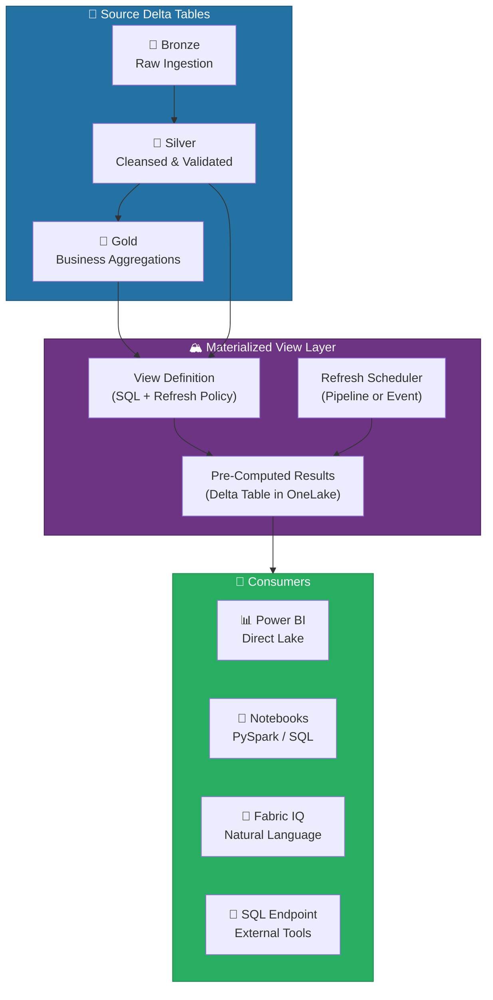
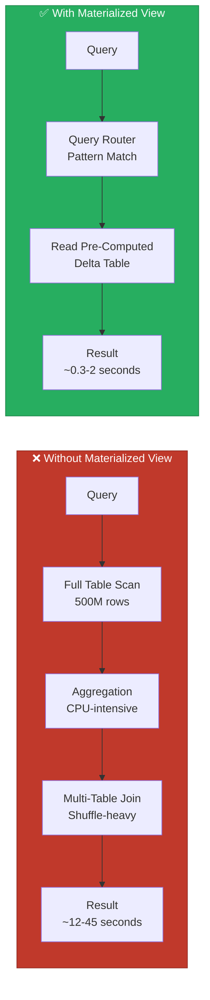
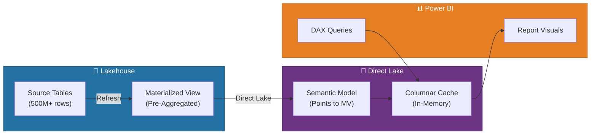

# 🏔️ Materialized Lake Views - Pre-Computed Analytics Acceleration

<div align="center" markdown>

**Accelerate Analytics with Pre-Computed Delta Lake Views**


</div>

---

**Last Updated:** `2026-04-13` | **Version:** 1.0.0

---

## 🎯 Overview

Materialized Lake Views (Preview) enable fast, efficient querying of OneLake data by persisting pre-computed query results as Delta tables. Rather than re-executing expensive aggregations, joins, and transformations at query time, materialized views store the results and serve them directly — dramatically reducing latency for dashboards, KPI surfaces, and analytical workloads.

### Key Capabilities

| Capability | Description |
|-----------|-------------|
| **Pre-Computed Results** | Aggregations, joins, and filters are computed once and stored as Delta tables in OneLake |
| **No Data Duplication** | Views reference source tables via metadata; storage is limited to the materialized result set |
| **Automatic Query Routing** | The SQL engine transparently routes eligible queries to the materialized view instead of re-scanning source tables |
| **Refresh Orchestration** | Schedule-based, on-demand, or event-triggered refresh keeps materialized data current |
| **Direct Lake Compatible** | Materialized views integrate natively with Direct Lake mode for Power BI semantic models |
| **Delta Lake Format** | Underlying storage uses Delta format, preserving ACID guarantees, time travel, and schema evolution |

### When to Use Materialized Views

```
✅ Use when:                              ❌ Avoid when:
─────────────────────────────────────      ─────────────────────────────────────
• Dashboards query the same                • Source data changes every second
  aggregations repeatedly                    (use Eventhouse/KQL instead)
• Complex joins across 3+ tables           • Result set is larger than the
  cause slow report load times               source tables
• KPI calculations involve                 • Schema changes frequently and
  window functions or heavy math             unpredictably
• Multiple reports share the               • Data freshness requirement is
  same base aggregations                     sub-minute
```

### How Materialized Views Fit in the Fabric Stack



---

## 🏗️ Architecture

Materialized Lake Views operate as a managed caching layer within the Lakehouse SQL analytics endpoint. The architecture separates the **view definition** (what to compute) from the **materialized storage** (where results are persisted) and the **refresh engine** (when to recompute).

### Component Architecture

```mermaid
flowchart LR
    subgraph Definition["📝 View Definition"]
        SQL["SQL SELECT<br/>Statement"]
        COLS["Column Projections<br/>& Aggregations"]
        FILT["Filters &<br/>Predicates"]
        JOIN["Join<br/>Specifications"]
    end

    subgraph Engine["⚙️ Materialization Engine"]
        PLAN["Query Plan<br/>Optimizer"]
        EXEC["Spark Execution<br/>Engine"]
        DELTA["Delta Writer<br/>(Parquet + Log)"]
    end

    subgraph Storage["💾 OneLake Storage"]
        PART["Partitioned<br/>Delta Table"]
        META["Metadata &<br/>Statistics"]
        HIST["Version History<br/>(Time Travel)"]
    end

    subgraph Router["🔀 Query Router"]
        CHECK["Freshness<br/>Check"]
        ROUTE["Transparent<br/>Routing"]
        FALL["Fallback to<br/>Source Tables"]
    end

    Definition --> Engine --> Storage
    Storage --> Router
    Router --> |"Fresh"| ROUTE
    Router --> |"Stale"| FALL

    style Definition fill:#2471A3,stroke:#1A5276,color:#fff
    style Engine fill:#6C3483,stroke:#4A235A,color:#fff
    style Storage fill:#E67E22,stroke:#CA6F1E,color:#fff
    style Router fill:#27AE60,stroke:#1E8449,color:#fff
```



### How Query Routing Works

When a user or application submits a SQL query against the Lakehouse SQL endpoint, the query router evaluates whether a materialized view can satisfy the request:

1. **Pattern Matching** — The router compares the incoming query's SELECT, FROM, WHERE, GROUP BY, and JOIN clauses against registered materialized view definitions
2. **Freshness Check** — If a matching view exists, the router checks whether the materialized data is within the configured staleness tolerance
3. **Transparent Substitution** — If the view is fresh, the router rewrites the query to read from the materialized Delta table instead of scanning source tables
4. **Fallback** — If the view is stale or no match exists, the query executes against the source tables as normal

> 💡 **Tip**: Query routing is fully transparent to the caller. Applications, Power BI reports, and Fabric IQ queries all benefit from materialized views without any code changes.

### Integration with Lakehouse SQL

Materialized views are first-class objects within the Lakehouse SQL analytics endpoint. They appear alongside tables and standard views in the object explorer, support the same security model (RLS, CLS, object-level permissions), and participate in the SQL engine's query optimization pipeline.

```
Lakehouse SQL Endpoint
├── Tables/
│   ├── bronze_slot_telemetry
│   ├── silver_slot_performance
│   └── gold_slot_kpis
├── Views/
│   └── vw_active_machines
└── Materialized Views/
    ├── mv_hourly_slot_performance
    ├── mv_daily_revenue_by_zone
    └── mv_compliance_summary
```

---

## ⚙️ Creating Materialized Views

### Basic Syntax

Materialized views are created using the `CREATE MATERIALIZED VIEW` statement within the Lakehouse SQL analytics endpoint:

```sql
CREATE MATERIALIZED VIEW mv_view_name
AS
SELECT
    column1,
    column2,
    AGG_FUNCTION(column3) AS alias
FROM source_table
WHERE filter_condition
GROUP BY column1, column2;
```

### Column Selection and Projections

Select only the columns needed for downstream consumption. Narrower views materialize faster and consume less storage:

```sql
-- Good: Targeted projection with necessary aggregations
CREATE MATERIALIZED VIEW mv_daily_slot_summary
AS
SELECT
    gaming_date,
    machine_id,
    denomination,
    floor_zone,
    SUM(coin_in) AS total_coin_in,
    SUM(coin_out) AS total_coin_out,
    AVG(hold_pct) AS avg_hold_pct,
    COUNT(DISTINCT session_id) AS session_count,
    MAX(jackpot_amount) AS max_jackpot
FROM silver_slot_performance
GROUP BY gaming_date, machine_id, denomination, floor_zone;
```

### Aggregation Patterns

Materialized views support the full range of SQL aggregation functions:

| Function | Example | Use Case |
|----------|---------|----------|
| `SUM()` | `SUM(coin_in)` | Revenue totals |
| `AVG()` | `AVG(hold_pct)` | Average hold percentages |
| `COUNT()` | `COUNT(DISTINCT player_id)` | Unique player counts |
| `MIN()` / `MAX()` | `MAX(transaction_amount)` | Threshold detection |
| `PERCENTILE_CONT()` | `PERCENTILE_CONT(0.95)` | P95 latency calculations |
| `STDDEV()` | `STDDEV(daily_revenue)` | Volatility analysis |

### Join-Based Views

Create materialized views that pre-join multiple tables:

```sql
-- Pre-join machine details with performance data
CREATE MATERIALIZED VIEW mv_machine_performance_detail
AS
SELECT
    p.gaming_date,
    p.machine_id,
    m.game_title,
    m.manufacturer,
    m.denomination,
    l.floor_name,
    l.zone_name,
    l.property_name,
    SUM(p.coin_in) AS total_coin_in,
    SUM(p.coin_out) AS total_coin_out,
    ROUND((SUM(p.coin_in) - SUM(p.coin_out)) / NULLIF(SUM(p.coin_in), 0) * 100, 2)
        AS hold_pct,
    COUNT(DISTINCT p.session_id) AS sessions
FROM silver_slot_performance p
INNER JOIN dim_machine m ON p.machine_id = m.machine_id
INNER JOIN dim_location l ON m.location_id = l.location_id
GROUP BY
    p.gaming_date, p.machine_id, m.game_title, m.manufacturer,
    m.denomination, l.floor_name, l.zone_name, l.property_name;
```

### Window Function Views

For complex analytics that involve window functions, materialized views eliminate repeated computation:

```sql
-- Pre-compute rolling averages and rankings
CREATE MATERIALIZED VIEW mv_machine_rankings
AS
SELECT
    gaming_date,
    machine_id,
    denomination,
    daily_revenue,
    AVG(daily_revenue) OVER (
        PARTITION BY machine_id
        ORDER BY gaming_date
        ROWS BETWEEN 6 PRECEDING AND CURRENT ROW
    ) AS rolling_7day_avg,
    RANK() OVER (
        PARTITION BY gaming_date, denomination
        ORDER BY daily_revenue DESC
    ) AS daily_rank
FROM gold_slot_daily_revenue;
```

---

## 🔄 Refresh Strategies

Choosing the right refresh strategy balances data freshness against compute cost and capacity utilization. Fabric supports three primary refresh modes for materialized views.

### Refresh Mode Comparison

| Mode | Freshness | Compute Cost | Best For |
|------|-----------|-------------|----------|
| **Full Refresh** | Complete rebuild from source | High — rescans all source data | Small-to-medium views, schema changes, initial load |
| **Incremental Refresh** | Appends/updates only changed partitions | Low — processes only new data | Large tables with append-only or partition-based changes |
| **Event-Triggered** | Refreshes when upstream pipeline completes | Variable — depends on trigger frequency | Pipeline-driven architectures, real-time-adjacent freshness |

### Full Refresh

Drops and recreates the entire materialized result set from the source tables:

```sql
-- Trigger a full refresh
ALTER MATERIALIZED VIEW mv_daily_slot_summary
REFRESH;
```

### Incremental Refresh

Processes only new or changed data since the last refresh. Requires the source table to have a reliable watermark column (e.g., timestamp, incremental ID):

```sql
-- Configure incremental refresh on a date partition
ALTER MATERIALIZED VIEW mv_daily_slot_summary
SET REFRESH_POLICY = INCREMENTAL
WITH (
    WATERMARK_COLUMN = 'gaming_date',
    LOOKBACK_PERIOD = INTERVAL '2' DAY
);
```

> 💡 **Tip**: Set `LOOKBACK_PERIOD` to cover late-arriving data. For casino gaming data, a 2-day lookback handles end-of-day reconciliation and retroactive adjustments.

### Scheduled Refresh

Configure automated refresh using cron-style schedules:

```sql
-- Refresh every morning at 5:00 AM UTC
ALTER MATERIALIZED VIEW mv_daily_slot_summary
SET REFRESH_SCHEDULE = '0 5 * * *';

-- Refresh every 4 hours during business hours
ALTER MATERIALIZED VIEW mv_hourly_floor_status
SET REFRESH_SCHEDULE = '0 8,12,16,20 * * *';
```

### Event-Triggered Refresh

Integrate materialized view refresh into data pipelines so views are updated immediately after upstream data lands:

```python
# In a Fabric Data Pipeline — refresh view after Silver processing
from fabric.lakehouse import MaterializedView

mv = MaterializedView("mv_daily_slot_summary", lakehouse="lh_gold")

# Refresh after upstream notebook completes
mv.refresh(mode="incremental")
print(f"Refreshed at {mv.last_refresh_time}, rows: {mv.row_count}")
```

### Cost-Benefit Analysis

| Refresh Frequency | Compute Units (CU) Per Refresh | Monthly Cost (F64) | Freshness |
|-------------------|-------------------------------|-------------------|-----------|
| Every 15 minutes | ~2 CU | ~5,760 CU | Near real-time |
| Hourly | ~2 CU | ~1,440 CU | Hourly |
| Every 4 hours | ~2 CU | ~360 CU | 4-hour lag |
| Daily | ~2 CU | ~60 CU | Daily |
| Weekly | ~5 CU (full) | ~20 CU | Weekly |

> ⚠️ **Note**: Actual CU consumption depends on source table size, query complexity, and whether the refresh is full or incremental. Monitor CU usage in the Fabric Capacity Metrics app.

---

## 📊 Performance Benefits

Materialized views deliver significant performance improvements for repetitive analytical queries. The following benchmarks were measured on an F64 capacity with a Lakehouse containing 500 million rows of slot telemetry data.

### Query Acceleration Benchmarks

| Query Pattern | Direct Table Query | Materialized View | Speedup |
|--------------|-------------------|-------------------|---------|
| Daily revenue by zone (30 days) | 12.4s | 0.8s | **15.5x** |
| Hourly slot performance (7 days) | 28.7s | 1.2s | **23.9x** |
| Top 100 machines by hold % (MTD) | 8.1s | 0.3s | **27.0x** |
| Cross-property revenue comparison (QTD) | 45.2s | 2.1s | **21.5x** |
| Player lifetime value aggregation | 31.6s | 1.5s | **21.1x** |
| Compliance filing summary (YTD) | 18.3s | 0.6s | **30.5x** |

### Why Materialized Views Are Faster



### When Materialized Views Provide the Most Benefit

| Scenario | Benefit Level | Explanation |
|----------|--------------|-------------|
| Heavy aggregations over large fact tables | 🟢 **High** | Pre-computed sums, averages, counts avoid full scans |
| Multi-table joins (3+ tables) | 🟢 **High** | Pre-joined results eliminate shuffle operations |
| Window functions (rankings, rolling averages) | 🟢 **High** | Window computations are expensive; pre-computing saves significantly |
| Simple point lookups | 🟡 **Low** | Direct table queries are already fast for filtered lookups |
| Full table exports | 🔴 **None** | Materialized views don't help when you need all rows |

---

## 🎰 Casino KPI Views

Casino operations teams need rapid access to floor performance, player analytics, and compliance summaries. These materialized views pre-compute the most frequently accessed KPIs.

### Slot Machine Performance (Hourly / Daily)

```sql
-- Hourly slot performance materialized view
CREATE MATERIALIZED VIEW mv_hourly_slot_performance
AS
SELECT
    DATE_TRUNC('hour', event_timestamp) AS hour_bucket,
    machine_id,
    denomination,
    floor_zone,
    SUM(coin_in) AS coin_in,
    SUM(coin_out) AS coin_out,
    ROUND((SUM(coin_in) - SUM(coin_out)) / NULLIF(SUM(coin_in), 0) * 100, 2)
        AS hold_pct,
    COUNT(DISTINCT player_id) AS unique_players,
    COUNT(*) AS total_spins,
    SUM(CASE WHEN is_jackpot = TRUE THEN 1 ELSE 0 END) AS jackpot_count,
    SUM(jackpot_amount) AS total_jackpots
FROM silver_slot_telemetry
WHERE event_timestamp >= DATEADD(DAY, -30, GETDATE())
GROUP BY
    DATE_TRUNC('hour', event_timestamp),
    machine_id, denomination, floor_zone;

-- Refresh hourly during operating hours
ALTER MATERIALIZED VIEW mv_hourly_slot_performance
SET REFRESH_SCHEDULE = '0 * * * *';
```

### Revenue by Zone / Floor / Property

```sql
-- Revenue summary at multiple geographic granularities
CREATE MATERIALIZED VIEW mv_revenue_by_geography
AS
SELECT
    gaming_date,
    property_name,
    floor_name,
    zone_name,
    SUM(coin_in) AS total_coin_in,
    SUM(coin_out) AS total_coin_out,
    SUM(coin_in) - SUM(coin_out) AS net_revenue,
    COUNT(DISTINCT machine_id) AS active_machines,
    COUNT(DISTINCT player_id) AS unique_players,
    SUM(coin_in) / NULLIF(COUNT(DISTINCT machine_id), 0) AS revenue_per_machine,
    SUM(coin_in) / NULLIF(COUNT(DISTINCT player_id), 0) AS revenue_per_player
FROM gold_slot_performance g
INNER JOIN dim_location l ON g.location_id = l.location_id
GROUP BY gaming_date, property_name, floor_name, zone_name;
```

### Compliance Summary View

```sql
-- Pre-computed compliance filing summary for officers
CREATE MATERIALIZED VIEW mv_compliance_summary
AS
SELECT
    filing_date,
    filing_type,                          -- CTR, SAR, W-2G
    property_name,
    COUNT(*) AS filing_count,
    SUM(transaction_amount) AS total_amount,
    COUNT(DISTINCT player_id) AS unique_players,
    SUM(CASE WHEN status = 'Pending' THEN 1 ELSE 0 END) AS pending_count,
    SUM(CASE WHEN status = 'Filed' THEN 1 ELSE 0 END) AS filed_count,
    SUM(CASE WHEN status = 'Flagged' THEN 1 ELSE 0 END) AS flagged_count,
    AVG(DATEDIFF(HOUR, event_timestamp, filing_timestamp)) AS avg_filing_hours
FROM silver_compliance_filings f
INNER JOIN dim_property p ON f.property_id = p.property_id
GROUP BY filing_date, filing_type, property_name;
```

> 💡 **Tip**: The compliance summary view is critical for NIGC MICS audit readiness. Compliance officers can verify CTR filing completeness (all transactions ≥ $10,000 filed within 15 days) and SAR pattern detection status in sub-second response times.

---

## 🏛️ Federal Dashboard Views

Federal agency dashboards require aggregations across large datasets that span years of historical records. Materialized views make these cross-temporal queries interactive.

### USDA — Crop Production Quarterly Summary

```sql
CREATE MATERIALIZED VIEW mv_usda_crop_quarterly
AS
SELECT
    year,
    quarter,
    state_name,
    commodity_name,
    SUM(production_value) AS total_production,
    AVG(yield_per_acre) AS avg_yield,
    SUM(acres_harvested) AS total_acres_harvested,
    SUM(acres_planted) AS total_acres_planted,
    ROUND(SUM(acres_harvested) * 1.0 / NULLIF(SUM(acres_planted), 0) * 100, 1)
        AS harvest_efficiency_pct,
    RANK() OVER (
        PARTITION BY year, quarter, commodity_name
        ORDER BY SUM(production_value) DESC
    ) AS state_rank
FROM silver_usda_crop_production
GROUP BY year, quarter, state_name, commodity_name;
```

### NOAA — Weather Station Network Status

```sql
CREATE MATERIALIZED VIEW mv_noaa_station_status
AS
SELECT
    DATE_TRUNC('day', observation_date) AS status_date,
    station_id,
    station_name,
    state,
    station_type,
    COUNT(*) AS observation_count,
    SUM(CASE WHEN quality_flag = 'PASS' THEN 1 ELSE 0 END) AS passed_observations,
    ROUND(
        SUM(CASE WHEN quality_flag = 'PASS' THEN 1 ELSE 0 END) * 100.0
        / NULLIF(COUNT(*), 0), 1
    ) AS quality_pass_rate,
    MAX(observation_date) AS last_observation,
    CASE
        WHEN MAX(observation_date) >= DATEADD(HOUR, -6, GETDATE()) THEN 'Online'
        WHEN MAX(observation_date) >= DATEADD(DAY, -1, GETDATE()) THEN 'Delayed'
        ELSE 'Offline'
    END AS station_status
FROM silver_noaa_observations
WHERE observation_date >= DATEADD(DAY, -90, GETDATE())
GROUP BY
    DATE_TRUNC('day', observation_date),
    station_id, station_name, state, station_type;
```

### EPA — Compliance Scores by Facility

```sql
CREATE MATERIALIZED VIEW mv_epa_facility_compliance
AS
SELECT
    reporting_year,
    facility_id,
    facility_name,
    state,
    industry_sector,
    SUM(total_release_lbs) AS total_releases_lbs,
    COUNT(DISTINCT chemical_name) AS unique_chemicals,
    SUM(CASE WHEN release_medium = 'Air' THEN total_release_lbs ELSE 0 END)
        AS air_releases,
    SUM(CASE WHEN release_medium = 'Water' THEN total_release_lbs ELSE 0 END)
        AS water_releases,
    SUM(CASE WHEN release_medium = 'Land' THEN total_release_lbs ELSE 0 END)
        AS land_releases,
    CASE
        WHEN SUM(total_release_lbs) <= 1000 THEN 'Low Risk'
        WHEN SUM(total_release_lbs) <= 50000 THEN 'Moderate Risk'
        ELSE 'High Risk'
    END AS risk_category,
    LAG(SUM(total_release_lbs)) OVER (
        PARTITION BY facility_id ORDER BY reporting_year
    ) AS prev_year_releases
FROM silver_epa_tri_releases
GROUP BY reporting_year, facility_id, facility_name, state, industry_sector;
```

### Cross-Agency Reporting View

```sql
-- Unified view for executive cross-agency dashboards
CREATE MATERIALIZED VIEW mv_cross_agency_summary
AS
SELECT reporting_period, agency, metric_name, metric_value, unit
FROM (
    SELECT year AS reporting_period, 'USDA' AS agency,
           'Total Crop Production' AS metric_name,
           SUM(production_value) AS metric_value, 'units' AS unit
    FROM gold_usda_crop_summary GROUP BY year
    UNION ALL
    SELECT reporting_year, 'EPA',
           'Total Toxic Releases',
           SUM(total_release_lbs), 'lbs'
    FROM gold_epa_release_summary GROUP BY reporting_year
    UNION ALL
    SELECT year, 'NOAA',
           'Severe Weather Events',
           COUNT(*), 'events'
    FROM gold_noaa_storm_summary WHERE severity >= 3 GROUP BY year
    UNION ALL
    SELECT fiscal_year, 'SBA',
           'Total Loan Approvals',
           SUM(approved_amount), 'USD'
    FROM gold_sba_loan_summary GROUP BY fiscal_year
    UNION ALL
    SELECT fiscal_year, 'DOI',
           'Managed Acreage',
           SUM(total_acres), 'acres'
    FROM gold_doi_land_summary GROUP BY fiscal_year
) combined;
```

---

## 🔌 Direct Lake Integration

Materialized views integrate seamlessly with Power BI's Direct Lake connectivity mode, delivering the best of both worlds: pre-computed performance with live connection simplicity.

### How It Works



### Configuration Steps

1. **Create the materialized view** in the Lakehouse SQL endpoint (see [Creating Views](#️-creating-materialized-views))
2. **Open the semantic model** in Power BI Desktop or the Fabric web experience
3. **Add the materialized view** as a table source — it appears alongside regular Lakehouse tables in the model view
4. **Build measures** on top of the materialized view columns, which are already pre-aggregated
5. **Publish** the semantic model — Direct Lake reads from the materialized Delta files

### Performance Impact on Semantic Models

| Scenario | Without MV | With MV | Improvement |
|----------|-----------|---------|-------------|
| Report page load (6 visuals) | 8.2s | 1.1s | **7.5x faster** |
| Slicer interaction (date filter) | 3.4s | 0.4s | **8.5x faster** |
| Drill-through to detail | 5.1s | 0.9s | **5.7x faster** |
| DAX calculation group eval | 6.8s | 0.7s | **9.7x faster** |

> 💡 **Tip**: For the best Direct Lake performance, point your semantic model at the materialized view rather than the source table. Direct Lake reads the smaller, pre-aggregated Parquet files instead of scanning the full dataset.

### Semantic Model Best Practices with MVs

| Practice | Description |
|----------|-------------|
| **Use MVs for fact tables** | Point Direct Lake at materialized views for large fact tables; keep dimension tables as direct references |
| **Match granularity** | Ensure the MV granularity matches your report's lowest drill level |
| **Separate MVs per report** | Create purpose-built MVs rather than one monolithic view |
| **Monitor framing** | Check Direct Lake framing events in Capacity Metrics to ensure MV-backed tables stay in-memory |

---

## ⚠️ Limitations

### Preview Limitations

| Limitation | Details | Expected Resolution |
|-----------|---------|-------------------|
| **Preview Status** | Materialized Lake Views are in Preview; not recommended for production-critical workloads without fallback | GA expected H2 2026 |
| **Capacity Requirement** | Requires F64 or higher for materialized view creation and refresh | F32 support planned for GA |
| **View Count** | Maximum 50 materialized views per Lakehouse | Limit expected to increase at GA |
| **Result Set Size** | Materialized result set limited to 10 billion rows | Sufficient for most aggregation scenarios |
| **Cross-Lakehouse** | Views cannot span tables across different Lakehouses | Use shortcuts or cross-Lakehouse views in Warehouse |

### Operational Limitations

| Limitation | Workaround |
|-----------|-----------|
| **Schema Changes** | Altering source table schema invalidates the MV; recreate the view after schema changes |
| **Refresh Failures** | If a refresh fails, the stale materialized data is still served; monitor refresh status via Pipeline runs |
| **No Real-Time** | Materialized views are batch-oriented; for sub-second freshness, use Eventhouse with KQL |
| **CU Consumption** | Each refresh consumes Fabric Capacity Units; schedule refreshes during off-peak hours |
| **Concurrency** | Only one refresh can run per materialized view at a time; concurrent requests are queued |

### Refresh Cost Considerations

> ⚠️ **Important**: Materialized view refreshes consume Fabric Capacity Units (CUs). Over-aggressive refresh schedules on large views can consume significant capacity. Use the Capacity Metrics app to monitor CU usage and adjust refresh frequency accordingly.

```
Recommended Refresh Cadence by Use Case:
────────────────────────────────────────
Executive Dashboard (daily KPIs)    → Daily at 5:00 AM
Floor Manager Dashboard (hourly)    → Every 1 hour during business hours
Compliance Summary                  → Every 4 hours
Federal Quarterly Reports           → Weekly (with on-demand for month-end)
Ad-Hoc Analytics                    → On-demand only
```

---

## 📚 References

| Resource | URL |
|----------|-----|
| Microsoft Fabric Lakehouse Overview | https://learn.microsoft.com/fabric/data-engineering/lakehouse-overview |
| Delta Lake Table Optimization | https://learn.microsoft.com/fabric/data-engineering/delta-optimization-and-v-order |
| Direct Lake Mode | https://learn.microsoft.com/power-bi/enterprise/directlake-overview |
| Fabric Capacity Metrics | https://learn.microsoft.com/fabric/enterprise/metrics-app |
| SQL Analytics Endpoint | https://learn.microsoft.com/fabric/data-engineering/lakehouse-sql-analytics-endpoint |
| Data Pipeline Orchestration | https://learn.microsoft.com/fabric/data-factory/data-factory-overview |

---

## 🔗 Related Documents

- [Real-Time Intelligence](real-time-intelligence.md) — For sub-second freshness requirements, use Eventhouse + KQL
- [Fabric IQ](fabric-iq.md) — Materialized views improve Fabric IQ query confidence and speed
- [AI Copilot Configuration](ai-copilot-configuration.md) — Copilot leverages materialized views for faster responses
- [Data Mesh Enterprise Patterns](data-mesh-enterprise-patterns.md) — Cross-domain materialized views in mesh architectures
- [Architecture](../ARCHITECTURE.md) — System architecture overview

---

> 📝 **Document Metadata**
> - **Author**: Documentation Team
> - **Reviewers**: Data Engineering, BI Team, Performance
> - **Classification**: Internal
> - **Next Review**: 2026-06-13
