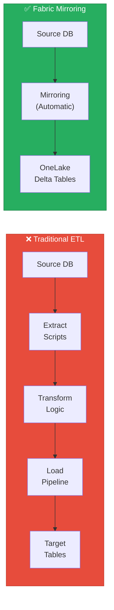
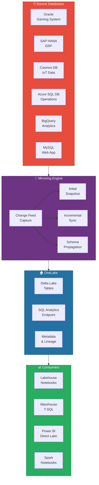
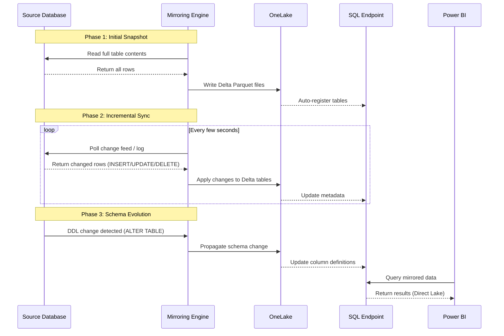
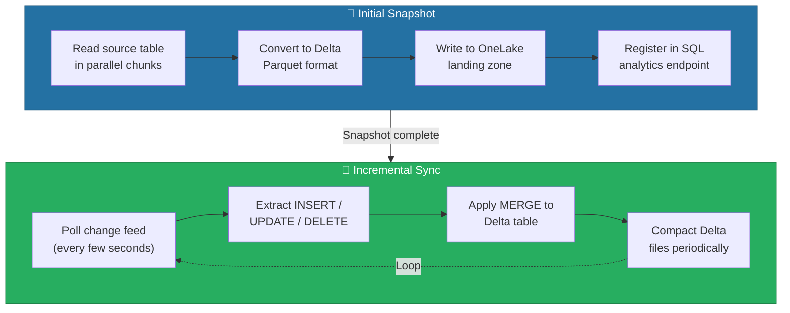
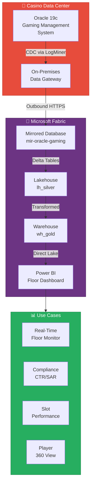
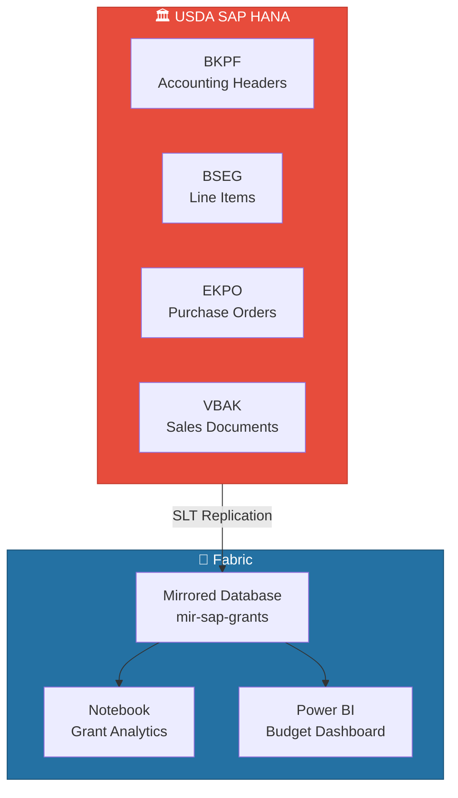

# 🔄 Mirroring - Near-Real-Time Database Replication


<div align="center" markdown>

**Replicate External Databases into OneLake Delta Tables — No ETL Pipelines Required**


</div>

---

**Last Updated:** `2026-04-13` | **Version:** 1.0.0

---

## 🎯 Overview

Mirroring in Microsoft Fabric provides near-real-time replication of external databases into OneLake as Delta Lake tables. Instead of building complex ETL pipelines to extract, transform, and load data from operational systems, Mirroring captures changes at the source database level and continuously applies them to a mirrored Lakehouse or Warehouse in Fabric.

This fundamentally simplifies the data integration pattern: operational databases remain untouched while their data becomes instantly available for analytics, reporting, and AI workloads across the Fabric platform.

### Key Capabilities

| Capability | Description |
|-----------|-------------|
| **Near-Real-Time Sync** | Changes replicate within seconds to minutes, not hours or days |
| **No ETL Required** | Direct database-to-OneLake replication without pipeline code |
| **Delta Lake Output** | All mirrored data lands as Delta tables in OneLake |
| **Schema Propagation** | DDL changes (new columns, type changes) propagate automatically |
| **Initial Snapshot** | Full table snapshot on first sync, then incremental changes |
| **Multiple Sources** | Single Fabric workspace can mirror from multiple database engines |
| **SQL Analytics Endpoint** | Mirrored data is immediately queryable via SQL analytics endpoint |
| **Governance Integration** | Purview lineage, sensitivity labels, and RLS apply to mirrored data |

### Why Mirroring Matters

Traditional data integration requires teams to build and maintain ETL pipelines for every source system. Each pipeline needs error handling, retry logic, schema evolution, monitoring, and testing. Mirroring eliminates this entire category of work for supported databases.



> 📝 **Note**: Mirroring is not a replacement for all ETL. It replicates source data as-is (bronze layer). You still need Silver and Gold layer transformations for business logic, deduplication, and aggregation. Mirroring replaces only the ingestion pipeline.

---

## 🏗️ Architecture

### Replication Architecture

Mirroring operates through a change feed mechanism that varies by source database type. At a high level, the architecture follows this pattern:



### Replication Process



### Component Responsibilities

| Component | Role | Details |
|-----------|------|---------|
| **Change Feed** | Captures changes from source | Uses CDC, transaction logs, or change tracking depending on source |
| **Snapshot Engine** | Performs initial full load | Reads entire tables in parallel chunks for fast initial sync |
| **Incremental Engine** | Applies ongoing changes | Processes inserts, updates, and deletes in near-real-time |
| **Schema Manager** | Handles DDL propagation | Detects column additions, type changes, and table drops |
| **Landing Zone** | Temporary staging | Buffers changes before committing to Delta tables |
| **Delta Writer** | Writes to OneLake | Converts changes to Delta Lake format with proper partitioning |
| **SQL Endpoint** | Provides query access | Auto-generates views over mirrored Delta tables |

---

## 🔌 Supported Sources

### Source Database Matrix

| Source | Status | CDC Method | Initial Snapshot | Incremental | Schema Evolution | Max Tables |
|--------|--------|-----------|-----------------|-------------|-----------------|------------|
| **Azure SQL Database** |  | Change Tracking | ✅ Parallel | ✅ Sub-minute | ✅ Auto | 500 |
| **Azure SQL Managed Instance** |  | Change Tracking | ✅ Parallel | ✅ Sub-minute | ✅ Auto | 500 |
| **Azure Cosmos DB** |  | Change Feed | ✅ Full | ✅ Sub-minute | ✅ Auto | 500 |
| **Snowflake** |  | Streams | ✅ Parallel | ✅ Minutes | ✅ Auto | 500 |
| **Azure Databricks Unity** |  | Delta CDF | ✅ Delta read | ✅ Minutes | ✅ Auto | 500 |
| **Oracle** |  | LogMiner | ✅ Parallel | ✅ Minutes | ⚠️ Limited | 500 |
| **SAP HANA** |  | SLT/Trigger | ✅ Full | ✅ Minutes | ⚠️ Limited | 200 |
| **Google BigQuery** |  | CDC Stream | ✅ Full | ✅ Minutes | ✅ Auto | 500 |
| **MySQL** |  | Binlog | ✅ Parallel | ✅ Minutes | ⚠️ Limited | 500 |
| **PostgreSQL** |  | WAL | ✅ Parallel | ✅ Minutes | ⚠️ Limited | 500 |
| **SharePoint Lists** |  | Change Notifications | ✅ Full | ✅ Minutes | ⚠️ Limited | 100 |
| **Azure MySQL** |  | Binlog | ✅ Parallel | ✅ Minutes | ⚠️ Limited | 500 |
| **Open Mirroring SDK** |  | Custom | Depends on implementation | Depends on implementation | Custom | Unlimited |

### Open Mirroring

Open Mirroring is an SDK-based approach that allows any application to write data into a mirrored database item in Fabric. This enables:

- **Custom connectors** for databases not natively supported
- **ISV integration** where software vendors push data directly to Fabric
- **Legacy systems** that cannot support standard CDC mechanisms
- **Streaming sources** that produce Delta-compatible change records

```python
# Open Mirroring SDK — Conceptual Example
from fabric_mirroring import OpenMirrorClient

client = OpenMirrorClient(
    workspace_id="your-workspace-id",
    mirrored_db="mir-custom-source",
    credential=DefaultAzureCredential()
)

# Write a batch of changes
client.write_changes(
    table="transactions",
    changes=[
        {"operation": "INSERT", "data": {"id": 1, "amount": 100.50}},
        {"operation": "UPDATE", "data": {"id": 2, "amount": 200.00}},
        {"operation": "DELETE", "key": {"id": 3}}
    ]
)
```

> 💡 **Tip**: Open Mirroring is the recommended approach for on-premises databases that cannot be reached via managed VNet. Install the Open Mirroring agent behind your firewall, and it pushes changes outbound to Fabric — no inbound connectivity required.

---

## ⚙️ Configuration & Setup

### Prerequisites

| Requirement | Details |
|------------|---------|
| **Fabric Capacity** | F64 or higher recommended for production mirroring workloads |
| **Fabric Workspace** | Workspace with Contributor or higher permissions |
| **Source Access** | Read access to source database with CDC/change tracking enabled |
| **Network** | Source database accessible from Fabric (public endpoint, managed VNet, or on-premises gateway) |
| **Mirroring Enabled** | Tenant admin must enable Mirroring in Fabric admin portal |

### Setup: Oracle Database Mirroring

Oracle mirroring (GA March 2026) uses Oracle LogMiner to capture changes from the redo logs.

**Step 1: Prepare Oracle Source**

```sql
-- Enable supplemental logging (Oracle DBA)
ALTER DATABASE ADD SUPPLEMENTAL LOG DATA;
ALTER DATABASE ADD SUPPLEMENTAL LOG DATA (ALL) COLUMNS;

-- Create a dedicated mirroring user
CREATE USER fabric_mirror IDENTIFIED BY "<strong-password>";
GRANT CREATE SESSION TO fabric_mirror;
GRANT SELECT ANY TABLE TO fabric_mirror;
GRANT SELECT_CATALOG_ROLE TO fabric_mirror;
GRANT EXECUTE_CATALOG_ROLE TO fabric_mirror;
GRANT SELECT ON V_$LOGMNR_CONTENTS TO fabric_mirror;
GRANT SELECT ON V_$LOG TO fabric_mirror;
GRANT SELECT ON V_$ARCHIVED_LOG TO fabric_mirror;
GRANT LOGMINING TO fabric_mirror;  -- Oracle 12c+
```

**Step 2: Create Mirrored Database in Fabric**

```
Workspace → + New → Mirrored Database
  Name: mir-oracle-gaming
  Description: Mirror of Oracle gaming management system
  Source Type: Oracle Database
```

**Step 3: Configure Connection**

```
Connection Settings:
  Server: <oracle-host>
  Port: 1521
  Service Name: GAMINGDB
  Authentication: Basic (username/password)
  Username: fabric_mirror
  Password: (from Key Vault)

Network:
  ☑ Use on-premises data gateway
  Gateway: gw-casino-datacenter
```

**Step 4: Select Tables**

```
Available Tables:
  ☑ GAMING.SLOT_MACHINES        (125,000 rows)
  ☑ GAMING.PLAYER_ACCOUNTS      (2,500,000 rows)
  ☑ GAMING.TRANSACTIONS         (50,000,000 rows)
  ☑ GAMING.COMPLIANCE_EVENTS    (500,000 rows)
  ☑ GAMING.TABLE_GAME_SESSIONS  (10,000,000 rows)
  ☐ GAMING.AUDIT_LOG            (excluded — too large for initial sync)
  ☐ SYS.%                       (system tables — not available)

Table Selection: 5 of 7 tables selected
Estimated Initial Snapshot: ~45 minutes
```

**Step 5: Start Mirroring**

```
Review Configuration:
  Source: Oracle 19c — <oracle-host>:1521/GAMINGDB
  Tables: 5 selected
  Target: mir-oracle-gaming (Mirrored Database)
  Replication Mode: Continuous (initial snapshot + incremental)
  
  [Start Mirroring]
```

### Setup: Azure Cosmos DB Mirroring

Cosmos DB mirroring uses the native Cosmos DB change feed, which provides a built-in ordered log of all changes.

**Step 1: Enable Change Feed on Cosmos DB**

```json
// Cosmos DB container must have change feed enabled (default for new containers)
// For existing containers, verify:
{
    "id": "sensor-readings",
    "changeFeedPolicy": {
        "retentionDuration": "P7D",
        "logRetentionDuration": 10080
    }
}
```

**Step 2: Create Mirrored Database**

```
Workspace → + New → Mirrored Database
  Name: mir-cosmos-iot
  Description: Mirror of Cosmos DB IoT sensor data
  Source Type: Azure Cosmos DB

Connection:
  Account: cosmos-epa-sensors.documents.azure.com
  Authentication: Account Key or Managed Identity
  Database: iot-telemetry

Containers:
  ☑ sensor-readings      (50M documents)
  ☑ device-registry      (10K documents)
  ☑ alert-history        (500K documents)

Options:
  ☑ Include nested properties as columns
  ☑ Flatten arrays (max depth: 3)
```

> 📝 **Note**: Cosmos DB mirroring flattens the JSON document structure into tabular columns. Deeply nested objects may require post-processing in a notebook or Warehouse view to fully normalize.

### Setup: SAP HANA Mirroring

SAP HANA mirroring (GA March 2026) uses SAP Landscape Transformation (SLT) or trigger-based capture for change detection.

**Step 1: Prepare SAP HANA Source**

```sql
-- Create a technical user for mirroring
CREATE USER FABRIC_MIRROR PASSWORD "<strong-password>" NO FORCE_FIRST_PASSWORD_CHANGE;
GRANT SELECT ON SCHEMA SAPABAP1 TO FABRIC_MIRROR;
GRANT SELECT ON _SYS_STATISTICS TO FABRIC_MIRROR;
GRANT CATALOG READ TO FABRIC_MIRROR;
```

**Step 2: Configure Mirroring**

```
Source Type: SAP HANA
Server: sap-hana.agency.internal
Port: 30015
Instance: 00
Authentication: Basic
Schema: SAPABAP1

Tables:
  ☑ BKPF  (Accounting Document Header)
  ☑ BSEG  (Accounting Document Segment)
  ☑ EKPO  (Purchasing Document Item)
  ☑ VBAK  (Sales Document Header)
  ☑ MARA  (Material Master)
```

---

## 🔄 Change Data Capture Mechanics

### CDC Methods by Source

Each source database uses a different mechanism to capture changes. Understanding these differences is critical for capacity planning and latency expectations.

| Source | CDC Method | How It Works | Latency | Impact on Source |
|--------|-----------|-------------|---------|-----------------|
| **Azure SQL DB** | Change Tracking | SQL Server tracks row-level changes in internal tables | Seconds | Minimal (built-in feature) |
| **Oracle** | LogMiner | Reads Oracle redo logs to extract DML operations | Minutes | Moderate (log reading CPU) |
| **Cosmos DB** | Change Feed | Built-in ordered log of all document changes | Seconds | None (native feature) |
| **SAP HANA** | SLT/Triggers | SAP replication server or database triggers | Minutes | Moderate (trigger overhead) |
| **Snowflake** | Streams | Snowflake Streams track table changes | Minutes | Minimal (metadata-only) |
| **MySQL** | Binary Log | Reads MySQL binlog for row-level changes | Minutes | Minimal (binlog always on) |
| **BigQuery** | CDC Stream | BigQuery change data capture streaming | Minutes | Minimal |
| **Databricks Unity** | Delta CDF | Delta Lake Change Data Feed | Minutes | None (read-only) |

### Initial Snapshot vs. Incremental Sync



### How Changes Are Applied

Mirroring uses Delta Lake MERGE operations to apply incremental changes:

```sql
-- Conceptual MERGE operation (executed internally by Mirroring engine)
MERGE INTO onelake.gaming_transactions AS target
USING staging.gaming_transactions_changes AS source
ON target.transaction_id = source.transaction_id
WHEN MATCHED AND source._operation = 'UPDATE' THEN
    UPDATE SET
        target.amount = source.amount,
        target.status = source.status,
        target._mirror_updated_at = source._change_timestamp
WHEN MATCHED AND source._operation = 'DELETE' THEN
    DELETE
WHEN NOT MATCHED AND source._operation = 'INSERT' THEN
    INSERT (transaction_id, amount, status, _mirror_updated_at)
    VALUES (source.transaction_id, source.amount, source.status, source._change_timestamp);
```

### System Columns Added by Mirroring

Every mirrored table includes system columns for tracking replication state:

| Column | Type | Description |
|--------|------|-------------|
| `_mirror_created_at` | datetime2 | When the row was first replicated |
| `_mirror_updated_at` | datetime2 | When the row was last updated by mirroring |
| `_mirror_operation` | varchar | Last operation type (INSERT, UPDATE, DELETE) |
| `_mirror_sequence` | bigint | Monotonically increasing sequence number |

> ⚠️ **Warning**: Do not use `_mirror_*` columns in your business logic. These are internal tracking columns that may change format between Fabric updates. Use source-side timestamps for business time-based queries.

---

## 📊 Monitoring Mirroring

### Replication Status Dashboard

Fabric provides a built-in monitoring dashboard for each mirrored database item:

```
Mirrored Database → Monitor Tab

Status Overview:
  ┌─────────────────────────────────────────────┐
  │ Overall Status: ● Running                    │
  │ Last Sync:      2026-04-13 14:30:22 UTC      │
  │ Replication Lag: 12 seconds                   │
  │ Tables:         5 / 5 syncing                 │
  │ Rows Replicated: 63,125,000                   │
  │ Data Size:       24.8 GB (Delta compressed)   │
  └─────────────────────────────────────────────┘
```

### Per-Table Metrics

| Metric | Description | Alert Threshold |
|--------|-------------|-----------------|
| **Replication Lag** | Time between source change and OneLake commit | > 5 minutes |
| **Rows Pending** | Changes captured but not yet applied | > 100,000 |
| **Snapshot Progress** | Percentage of initial snapshot completed | Stalled > 1 hour |
| **Error Count** | Replication errors in last 24 hours | > 0 |
| **Throughput (rows/sec)** | Current replication throughput | < 100 sustained |
| **Delta File Count** | Number of Delta files (compaction indicator) | > 1,000 per table |

### Monitoring KQL Queries

If you forward mirroring metrics to an Eventhouse or Log Analytics workspace:

```kql
// Replication lag trend over last 24 hours
MirroringMetrics
| where TimeGenerated > ago(24h)
| where MetricName == "ReplicationLagSeconds"
| summarize AvgLag = avg(MetricValue), MaxLag = max(MetricValue) by bin(TimeGenerated, 15m), TableName
| render timechart
```

```kql
// Tables with replication errors
MirroringMetrics
| where TimeGenerated > ago(24h)
| where MetricName == "ErrorCount" and MetricValue > 0
| summarize TotalErrors = sum(MetricValue), LastError = max(TimeGenerated) by TableName
| order by TotalErrors desc
```

### Alerting Configuration

| Alert | Condition | Severity | Action |
|-------|-----------|----------|--------|
| **High Replication Lag** | Lag > 5 min for 10+ min | Warning | Notify data engineering team |
| **Replication Stopped** | No sync activity for 30+ min | Critical | Page on-call + investigate source |
| **Snapshot Failure** | Initial snapshot fails or stalls | Critical | Review source connectivity |
| **Schema Conflict** | DDL change cannot be propagated | Warning | Manual schema review required |
| **Capacity Throttling** | CU exhaustion throttling mirroring | Critical | Scale capacity or pause non-critical workloads |

---

## 🎰 Casino Implementation

### Scenario: Mirror Oracle Gaming Management System

A casino operates an Oracle 19c database as its core gaming management system (GMS). This system tracks slot machine configurations, player accounts, financial transactions, and compliance events. The goal is to mirror this data into Fabric for real-time analytics without impacting the production GMS.

### Architecture



### Mirrored Tables

| Oracle Table | Rows | Sync Frequency | Fabric Table | Use Case |
|-------------|------|----------------|-------------|----------|
| `GAMING.SLOT_MACHINES` | 125,000 | Minutes | `mir_slot_machines` | Asset tracking, utilization |
| `GAMING.PLAYER_ACCOUNTS` | 2,500,000 | Minutes | `mir_player_accounts` | Player 360, loyalty analytics |
| `GAMING.TRANSACTIONS` | 50,000,000 | Minutes | `mir_transactions` | Revenue analytics, CTR detection |
| `GAMING.COMPLIANCE_EVENTS` | 500,000 | Minutes | `mir_compliance_events` | SAR/CTR filing, audit trail |
| `GAMING.TABLE_GAME_SESSIONS` | 10,000,000 | Minutes | `mir_table_sessions` | Table game performance |

### Casino Analytics on Mirrored Data

```sql
-- Revenue by slot denomination (last 24 hours) — runs on SQL analytics endpoint
SELECT
    sm.denomination,
    sm.manufacturer,
    COUNT(DISTINCT t.machine_id) AS active_machines,
    SUM(t.wager_amount) AS total_coin_in,
    SUM(t.payout_amount) AS total_coin_out,
    ROUND((SUM(t.wager_amount) - SUM(t.payout_amount)) / NULLIF(SUM(t.wager_amount), 0) * 100, 2) AS hold_pct
FROM mir_transactions t
    INNER JOIN mir_slot_machines sm ON t.machine_id = sm.machine_id
WHERE t._mirror_updated_at >= DATEADD(hour, -24, GETUTCDATE())
GROUP BY sm.denomination, sm.manufacturer
ORDER BY total_coin_in DESC;
```

```sql
-- CTR threshold detection (transactions >= $10,000)
SELECT
    pa.player_id,
    pa.first_name,
    pa.last_name,
    t.transaction_type,
    t.amount,
    t.transaction_time,
    ce.filing_status
FROM mir_transactions t
    INNER JOIN mir_player_accounts pa ON t.player_id = pa.player_id
    LEFT JOIN mir_compliance_events ce ON t.transaction_id = ce.source_transaction_id
WHERE t.amount >= 10000
    AND t.transaction_type IN ('cash_in', 'cash_out', 'chip_purchase')
    AND t.transaction_time >= DATEADD(day, -1, GETUTCDATE())
ORDER BY t.amount DESC;
```

### Compliance Benefits

| Requirement | Traditional Approach | With Mirroring |
|------------|---------------------|----------------|
| **CTR Filing** | Nightly batch extract, next-day detection | Near-real-time detection within minutes |
| **SAR Pattern Detection** | Weekly batch analysis of structuring | Continuous monitoring of transaction patterns |
| **Audit Trail** | Separate audit database with lag | Mirrored audit events with replication lineage |
| **Regulatory Reporting** | Manual export from Oracle | Automated Power BI reports on mirrored data |

---

## 🏛️ Federal Agency Implementation

### 🌾 USDA: Mirror SAP for Grant Disbursement

The USDA uses SAP for managing agricultural grant programs. Mirroring SAP HANA tables into Fabric enables analytics teams to track grant disbursement, vendor payments, and budget utilization without accessing the production SAP system.



**Key analytics on mirrored SAP data:**

```sql
-- Grant disbursement tracking by program
SELECT
    bkpf.BUKRS AS company_code,
    bseg.HKONT AS gl_account,
    bseg.ZUONR AS grant_program,
    COUNT(*) AS document_count,
    SUM(bseg.DMBTR) AS total_disbursed,
    MIN(bkpf.BUDAT) AS earliest_posting,
    MAX(bkpf.BUDAT) AS latest_posting
FROM mir_bkpf bkpf
    INNER JOIN mir_bseg bseg ON bkpf.BELNR = bseg.BELNR AND bkpf.BUKRS = bseg.BUKRS
WHERE bkpf.BLART = 'KZ'  -- Payment document type
    AND bkpf.GJAHR = 2026
GROUP BY bkpf.BUKRS, bseg.HKONT, bseg.ZUONR
ORDER BY total_disbursed DESC;
```

### 🌊 EPA: Mirror Cosmos DB for IoT Sensors

The EPA uses Azure Cosmos DB to store real-time water quality sensor readings from treatment plants nationwide. Mirroring enables analytics and compliance reporting without impacting the operational IoT pipeline.

**Mirrored containers:**

| Cosmos Container | Documents | Partition Key | Fabric Table | Purpose |
|-----------------|-----------|--------------|-------------|---------|
| `sensor-readings` | 50M | `/station_id` | `mir_sensor_readings` | Water quality time-series |
| `device-registry` | 10K | `/region` | `mir_device_registry` | Sensor metadata |
| `alert-history` | 500K | `/facility_id` | `mir_alert_history` | Compliance alerts |

```sql
-- EPA compliance: Stations exceeding Safe Drinking Water Act MCLs
SELECT
    dr.station_name,
    dr.facility_name,
    dr.region,
    sr.parameter_name,
    AVG(sr.value) AS avg_reading,
    MAX(sr.value) AS max_reading,
    CASE
        WHEN sr.parameter_name = 'turbidity' AND MAX(sr.value) > 4.0 THEN 'VIOLATION'
        WHEN sr.parameter_name = 'lead' AND MAX(sr.value) > 0.015 THEN 'VIOLATION'
        WHEN sr.parameter_name = 'ph' AND (MIN(sr.value) < 6.5 OR MAX(sr.value) > 8.5) THEN 'VIOLATION'
        ELSE 'COMPLIANT'
    END AS compliance_status
FROM mir_sensor_readings sr
    INNER JOIN mir_device_registry dr ON sr.station_id = dr.station_id
WHERE sr._mirror_updated_at >= DATEADD(day, -7, GETUTCDATE())
GROUP BY dr.station_name, dr.facility_name, dr.region, sr.parameter_name
HAVING compliance_status = 'VIOLATION'
ORDER BY max_reading DESC;
```

### 🏔️ DOI: Mirror for Park Visitor Analytics

The Department of Interior mirrors its park management database to analyze visitor patterns, resource allocation, and environmental impact across the National Park System.

### ✈️ DOT/FAA: Mirror for Flight Operations

The DOT/FAA mirrors its operational databases to provide near-real-time flight delay analytics and runway utilization reporting, supporting both operational decisions and public transparency requirements.

> 💡 **Tip**: Federal agencies should enable Managed VNet for mirroring connections to ensure all data flows through Azure backbone network and meets FedRAMP boundary requirements. See [Network Security Best Practices](../best-practices/network-security.md) for configuration details.

---

## 🔐 Security & Governance

### Network Security

| Connectivity Option | Use Case | Configuration |
|--------------------|----------|---------------|
| **Public Endpoint** | Cloud-hosted sources (Azure SQL, Cosmos DB) | Firewall rules to allow Fabric service IPs |
| **Managed VNet** | Cloud sources requiring private connectivity | Private endpoints within Fabric managed VNet |
| **On-Premises Gateway** | On-prem databases (Oracle, SAP) | Self-hosted integration runtime behind firewall |
| **ExpressRoute** | High-throughput, low-latency replication | Dedicated circuit from data center to Azure |

### Authentication

| Source | Supported Auth | Recommended |
|--------|---------------|-------------|
| **Azure SQL DB** | SQL Auth, AAD, MI | Managed Identity (MI) |
| **Oracle** | Basic (username/password) | Dedicated service account + Key Vault |
| **Cosmos DB** | Account Key, AAD, MI | Managed Identity (MI) |
| **SAP HANA** | Basic, Kerberos | Kerberos with service principal |
| **Snowflake** | Basic, Key Pair | Key Pair authentication |
| **MySQL** | Basic | Dedicated service account + Key Vault |

### Data Governance

| Governance Feature | Support | Details |
|-------------------|---------|---------|
| **Purview Lineage** | ✅ Automatic | Source-to-mirrored-table lineage tracked automatically |
| **Sensitivity Labels** | ✅ Inherited | Labels from source propagate to mirrored tables |
| **Row-Level Security** | ✅ On mirrored data | RLS policies defined on SQL analytics endpoint |
| **Column-Level Security** | ✅ On mirrored data | CLS restricts column access on SQL endpoint |
| **Data Masking** | ✅ DDM on SQL endpoint | Dynamic data masking on mirrored columns |
| **Audit Logs** | ✅ Full | All access to mirrored data logged in audit trail |

### Compliance Considerations

| Standard | Requirement | How Mirroring Addresses |
|----------|-------------|------------------------|
| **NIGC MICS** | Gaming data integrity | Full audit trail via `_mirror_*` columns |
| **FinCEN BSA** | Transaction monitoring | Near-real-time CTR/SAR detection on mirrored data |
| **FedRAMP** | Data residency & encryption | Managed VNet + CMK encryption on OneLake |
| **HIPAA** | PHI protection | CLS/DDM on mirrored health data columns |
| **PCI-DSS** | Cardholder data | DDM on card number columns in mirrored tables |

> ⚠️ **Warning**: Mirroring replicates data as-is from the source. If the source contains PII, PHI, or regulated data, ensure appropriate security controls (RLS, CLS, DDM, sensitivity labels) are configured on the mirrored database item BEFORE granting user access.

---

## ⚠️ Limitations

### Current Limitations

| Limitation | Details | Workaround |
|-----------|---------|------------|
| **Table Count** | Maximum 500 tables per mirrored database (200 for SAP) | Create multiple mirrored database items |
| **Row Size** | Maximum 4 MB per row after serialization | Split large LOB columns into separate tables |
| **Column Types** | Spatial, XML, and certain LOB types not supported | Extract as text/JSON before mirroring |
| **DDL Scope** | Only ADD COLUMN propagated for some sources | Manual schema sync for DROP/RENAME |
| **Delete Handling** | Soft deletes may not propagate for all sources | Use change tracking columns at source |
| **Initial Snapshot** | Large tables (100M+ rows) may take hours | Schedule during maintenance window |
| **Replication Lag** | Varies by source: seconds (Azure SQL) to minutes (Oracle) | Design for eventual consistency |
| **Single Region** | Mirrored database must be in same region as capacity | Use shortcuts for cross-region access |
| **No Write-Back** | Mirroring is read-only into Fabric | Use Translytical Task Flows for write-back |
| **Source Impact** | Oracle LogMiner and SAP SLT consume source CPU | Size source servers for CDC overhead |
| **Schema Conflicts** | Column name collisions with system columns | Rename source columns before mirroring |

### What Mirroring Is Not

| Expectation | Reality |
|------------|---------|
| **Bi-directional sync** | Mirroring is one-way: source → Fabric only |
| **Real-time (sub-second)** | Near-real-time (seconds to minutes depending on source) |
| **ETL replacement** | Replaces ingestion only; Silver/Gold transformations still needed |
| **Database migration** | Not a migration tool; the source database continues to operate |
| **Streaming** | For true streaming, use Eventstream; Mirroring is change-based batch |

---

## 📚 References

| Resource | URL |
|----------|-----|
| Mirroring Overview | https://learn.microsoft.com/fabric/database/mirrored-database/overview |
| Mirror Azure SQL Database | https://learn.microsoft.com/fabric/database/mirrored-database/azure-sql-database |
| Mirror Cosmos DB | https://learn.microsoft.com/fabric/database/mirrored-database/azure-cosmos-db |
| Mirror Oracle | https://learn.microsoft.com/fabric/database/mirrored-database/oracle |
| Mirror SAP HANA | https://learn.microsoft.com/fabric/database/mirrored-database/sap-hana |
| Mirror Snowflake | https://learn.microsoft.com/fabric/database/mirrored-database/snowflake |
| Mirror Azure Databricks | https://learn.microsoft.com/fabric/database/mirrored-database/azure-databricks |
| Open Mirroring | https://learn.microsoft.com/fabric/database/mirrored-database/open-mirroring |
| Mirroring Monitoring | https://learn.microsoft.com/fabric/database/mirrored-database/monitor |
| Mirroring Troubleshooting | https://learn.microsoft.com/fabric/database/mirrored-database/troubleshoot |
| Mirroring Security | https://learn.microsoft.com/fabric/database/mirrored-database/security |
| On-Premises Data Gateway | https://learn.microsoft.com/data-integration/gateway/service-gateway-onprem |
| Delta Lake MERGE | https://docs.delta.io/latest/delta-update.html#upsert-into-a-table-using-merge |

---

### SharePoint Lists Mirroring (Preview)

Announced at FabCon Atlanta March 2026, **SharePoint Lists Mirroring** brings operational list data into OneLake for analytics — bridging the gap between collaborative list management and enterprise analytics.

SharePoint Lists are widely used for lightweight data tracking across organizations. Mirroring enables continuous replication of list data into Delta tables in OneLake, making it queryable via SQL, PySpark, and Power BI without impacting SharePoint performance.

**How It Works:**
- Uses Microsoft Graph **Change Notifications** to detect list item changes in near real-time
- Mirrors list columns as Delta table columns with automatic type mapping
- Supports lists with up to **100 columns** and millions of rows
- Handles list item creation, updates, and soft deletes
- Metadata columns (Created By, Modified, Version) are preserved for auditing

**Configuration:**
1. Create a new Mirrored Database item in a Fabric workspace
2. Select **SharePoint Lists** as the source
3. Authenticate via organizational account or service principal
4. Select one or more lists from the target SharePoint site
5. Configure sync frequency (minimum: 5 minutes)

**Casino Use Case:** Casino operations teams frequently manage shift schedules, equipment maintenance logs, and vendor contact lists in SharePoint. Mirroring these lists into OneLake enables cross-referencing maintenance schedules with slot machine downtime telemetry, identifying patterns between equipment servicing and revenue impact — all without requiring operations staff to change their familiar SharePoint workflows.

**Federal Use Case:** Federal agencies commonly track project milestones, procurement status, and inter-agency coordination tasks in SharePoint Lists. Mirroring enables program managers to build Power BI dashboards that combine project tracking data with budget actuals from financial systems, providing a unified view of program health without duplicating data entry across systems.

---

## 🔗 Related Documents

- [Direct Lake](direct-lake.md) — Power BI reads mirrored Delta tables directly
- [Copy Job CDC](copy-job-cdc.md) — Alternative low-code ingestion with CDC
- [OneLake Iceberg Interoperability](onelake-iceberg-interop.md) — Cross-platform access to mirrored data
- [OneLake Security](onelake-security.md) — Workspace Identity and managed VNet for mirroring
- [Fabric SQL Database](fabric-sql-database.md) — OLTP database with built-in OneLake replication
- [Data Sharing & Federation](../best-practices/data-sharing-federation.md) — Shortcuts and federation over mirrored data
- [Network Security](../best-practices/network-security.md) — Private endpoints and gateway configuration
- [Incremental Refresh & CDC](../best-practices/incremental-refresh-cdc.md) — Delta MERGE patterns used by mirroring
- [Real-Time Intelligence](real-time-intelligence.md) — Streaming complement to mirroring
- [Architecture](../ARCHITECTURE.md) — System architecture overview

---

> 📝 **Document Metadata**
> - **Author**: Documentation Team
> - **Reviewers**: Data Engineering, Database Administration, Security, Compliance
> - **Classification**: Internal
> - **Next Review**: 2026-07-13
