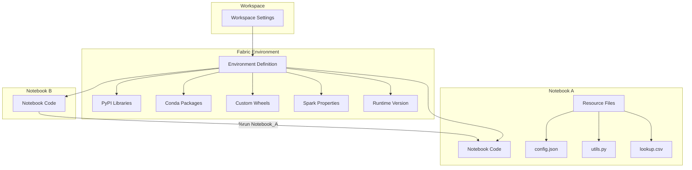
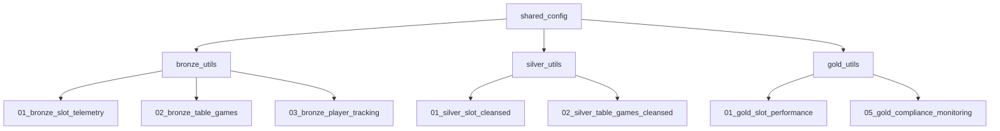
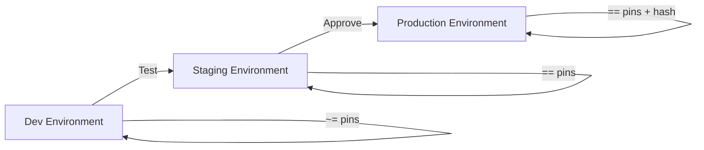

# 📦 Notebook Resources & Environments - Dependency Management in Fabric

<div align="center" markdown>

**Manage Libraries, Resource Files, and Shared Environments Across Workspaces**


</div>

---

**Last Updated:** `2026-04-27` | **Version:** 1.0.0

---

## Overview

Microsoft Fabric notebooks support two complementary mechanisms for managing dependencies and shared code:

1. **Notebook Resource Files** -- data files, configuration files, images, and small Python modules attached directly to a notebook
2. **Fabric Environments** -- workspace-level or shared compute configurations that define Python/R libraries, Spark properties, and runtime settings

Together, these enable reproducible, maintainable notebook workflows where dependencies are explicit, versioned, and consistent across team members.

### Key Concepts

| Concept | Scope | Purpose |
|---------|-------|---------|
| **Resource files** | Per-notebook | Attach data, configs, utility scripts to a notebook |
| **%run magic** | Cross-notebook | Chain notebooks, share functions and variables |
| **Environment** | Workspace or shared | Define libraries, Spark config, runtime version |
| **Inline %pip** | Per-session | Install packages ad hoc (not recommended for production) |

---

## Architecture



---

## Notebook Resource Files

### What Are Resource Files?

Resource files are files attached to a notebook that become available on the Spark driver during execution. They support any file type: Python scripts, JSON configs, CSV lookups, images, certificates, and more.

### Adding Resource Files

**Via the Fabric Portal:**

1. Open a notebook
2. Click the **Explorer** panel (left sidebar)
3. Select **Resources**
4. Click **+ Add** to upload files
5. Files appear under `builtin/` in the resource tree

**Via the Notebook File System:**

```python
# Resource files are accessible at a well-known path
import os

# List all resource files
resource_path = "/lakehouse/default/Files/notebook-resources/"
for f in os.listdir(resource_path):
    print(f)
```

### Reading Resource Files

```python
# Read a JSON configuration file
import json

with open("builtin/config.json") as f:
    config = json.load(f)

print(f"Environment: {config['env']}")
print(f"CTR Threshold: {config['ctr_threshold']}")
```

```python
# Read a CSV lookup table
import pandas as pd

zones_df = pd.read_csv("builtin/casino_zones.csv")
# Convert to Spark DataFrame for joins
zones_spark = spark.createDataFrame(zones_df)
```

```python
# Import a Python utility module
import importlib.util

spec = importlib.util.spec_from_file_location("utils", "builtin/utils.py")
utils = importlib.util.module_from_spec(spec)
spec.loader.exec_module(utils)

# Now use functions from the module
result = utils.hash_pii("123-45-6789", salt=config["hash_salt"])
```

### Resource File Types and Use Cases

| File Type | Use Case | Size Guidance |
|-----------|----------|---------------|
| `.py` | Shared utility functions | < 1 MB |
| `.json` | Configuration, schemas | < 1 MB |
| `.yaml` | Environment config, DAG definitions | < 1 MB |
| `.csv` | Small lookup/reference tables | < 50 MB |
| `.parquet` | Compact reference data | < 100 MB |
| `.pem` / `.cer` | TLS certificates for external connections | < 1 MB |
| `.png` / `.jpg` | Documentation images, logos | < 10 MB |
| `.whl` | Custom Python packages | < 100 MB |

### Size Limits

| Limit | Value |
|-------|-------|
| Single file max | 500 MB |
| Total resources per notebook | 1 GB |
| Recommended max for performance | < 200 MB total |

---

## Notebook Chaining with %run

### Basic %run Usage

The `%run` magic command executes another notebook inline, making all its defined functions, variables, and imports available in the calling notebook.

```python
# In Notebook: 01_bronze_slot_telemetry
# =====================================

# Run the shared utilities notebook first
%run bronze_utils

# Now functions from bronze_utils are available
df = read_source_data(spark, "slot_telemetry", processing_date)
df = add_metadata_columns(df)
validate_bronze(df)
write_bronze(df, "slot_telemetry")
```

### The Shared Utilities Pattern

```python
# Notebook: bronze_utils
# =======================
# This notebook is %run'd by all bronze layer notebooks.
# It defines shared functions and constants.

from pyspark.sql import functions as F
from datetime import datetime

# ---- CONSTANTS ----
BRONZE_PATH = "abfss://bronze@onelake.dfs.fabric.microsoft.com/lh_bronze.Lakehouse/Tables"
CHECKPOINT_BASE = "abfss://bronze@onelake.dfs.fabric.microsoft.com/lh_bronze.Lakehouse/Files/_checkpoints"

# ---- SHARED FUNCTIONS ----

def read_source_data(spark, table_name, date=None):
    """Read source data from the landing zone."""
    path = f"{BRONZE_PATH}/_landing/{table_name}"
    df = spark.read.format("parquet").load(path)
    if date:
        df = df.filter(F.col("date") == date)
    return df

def add_metadata_columns(df):
    """Add standard metadata columns to bronze DataFrames."""
    return df.withColumns({
        "_ingestion_timestamp": F.current_timestamp(),
        "_source_file": F.input_file_name(),
        "_record_hash": F.sha2(F.concat_ws("|", *df.columns), 256),
    })

def validate_bronze(df, min_rows=1, max_null_rate=0.05):
    """Run standard bronze validations."""
    total = df.count()
    if total < min_rows:
        raise ValueError(f"Expected >= {min_rows} rows, got {total}")
    
    for col_name in df.columns:
        if not col_name.startswith("_"):
            null_count = df.filter(F.col(col_name).isNull()).count()
            if null_count / total > max_null_rate:
                print(f"WARNING: {col_name} has {null_count/total:.1%} nulls")

def write_bronze(df, table_name, mode="append"):
    """Write DataFrame to bronze Delta table."""
    path = f"{BRONZE_PATH}/{table_name}"
    df.write.format("delta").mode(mode).save(path)
    print(f"Wrote {df.count()} records to {table_name}")
```

### %run with Parameters

```python
# Pass parameters to the called notebook
%run shared_config {"env": "prod", "agency": "USDA"}

# In shared_config notebook, access via:
env = spark.conf.get("spark.notebook.param.env", "dev")
agency = spark.conf.get("spark.notebook.param.agency", "")
```

### %run Dependency Graph



### %run Best Practices

| Do | Do Not |
|----|--------|
| Use %run for shared utility functions | Use %run for orchestration (use Pipelines/Airflow instead) |
| Keep %run targets small and focused | Create chains > 3 levels deep |
| Document what %run provides | Rely on side effects from %run notebooks |
| Place %run at the top of the notebook | Mix %run and data processing in the same cell |

---

## Fabric Environments

### What Is a Fabric Environment?

A Fabric Environment is a workspace-level item that defines the compute configuration for notebooks and Spark Job Definitions:

- Python and R library versions
- Custom packages (wheels, tarballs)
- Spark configuration properties
- Runtime version (Spark 3.4, 3.5, etc.)

### Creating an Environment

**Via the Portal:**

1. Navigate to workspace > **+ New** > **Environment**
2. Name it (e.g., `casino-poc-env`)
3. Configure libraries, Spark properties, and runtime

**Via YAML Definition:**

```yaml
# environment.yml
name: casino-poc-env
description: Casino POC compute environment for all medallion notebooks
runtime: 
  spark_version: "3.5"
  python_version: "3.11"

libraries:
  pypi:
    - great-expectations==0.18.0
    - delta-spark==3.1.0
    - pydantic==2.5.0
    - requests==2.31.0
    - tenacity==8.2.0
    - python-dateutil==2.8.2
  
  conda:
    - numpy=1.26.0
    - pandas=2.1.0
    - pyarrow=14.0.0
  
  custom_wheels:
    - path: libs/casino_utils-1.0.0-py3-none-any.whl
    - path: libs/fabric_helpers-0.5.0-py3-none-any.whl

spark_properties:
  spark.sql.adaptive.enabled: "true"
  spark.sql.adaptive.coalescePartitions.enabled: "true"
  spark.sql.shuffle.partitions: "200"
  spark.serializer: "org.apache.spark.serializer.KryoSerializer"
  spark.sql.parquet.compression.codec: "snappy"
  spark.fabric.lakehouse.default: "lh_bronze"
```

### Attaching an Environment to a Notebook

```python
# In notebook settings (gear icon):
# Environment: casino-poc-env

# Or programmatically via metadata:
# The notebook JSON includes:
{
    "environment": {
        "environmentId": "env-id-here",
        "workspaceId": "workspace-id"
    }
}
```

---

## Library Management

### Installation Methods Comparison

| Method | Scope | Persistence | Best For |
|--------|-------|-------------|----------|
| **Environment (PyPI)** | All notebooks using env | Permanent | Production dependencies |
| **Environment (conda)** | All notebooks using env | Permanent | Scientific packages |
| **Environment (wheel)** | All notebooks using env | Permanent | Internal packages |
| **%pip install** | Current session only | Ephemeral | Quick testing |
| **Resource file (.whl)** | Single notebook | Per-notebook | Notebook-specific libs |

### %pip install (Development Only)

```python
# Only use for quick testing -- NOT for production
%pip install great-expectations==0.18.0

# For production, add to the Fabric Environment instead
```

### Custom Wheel Deployment

```bash
# Build your custom library
cd casino_utils/
python -m build --wheel
# Produces: dist/casino_utils-1.0.0-py3-none-any.whl

# Upload to Fabric Environment:
# 1. Open Environment > Libraries > Custom Libraries
# 2. Upload casino_utils-1.0.0-py3-none-any.whl
# 3. Publish the environment
```

### Dependency Conflict Resolution

```yaml
# If two packages conflict, pin explicitly in environment.yml
libraries:
  pypi:
    - package-a==1.0.0
    - package-b==2.0.0
    # Pin shared dependency to compatible version
    - shared-dep==3.5.2
```

---

## Environment Pinning and Versioning

### Version Strategy

| Strategy | Example | When to Use |
|----------|---------|-------------|
| **Exact pin** | `great-expectations==0.18.0` | Production environments |
| **Compatible release** | `great-expectations~=0.18.0` | Staging (allow patches) |
| **Range** | `great-expectations>=0.17,<0.19` | Development (more flexibility) |
| **Unpinned** | `great-expectations` | Never in production |

### Environment Promotion



### Locking Dependencies

```python
# Generate a lock file from your environment
# (Run in your dev environment)
pip freeze > requirements-lock.txt

# Use the lock file for production environment
# This ensures exact reproducibility
```

---

## Shared Environments Across Workspaces

### Cross-Workspace Sharing

1. Create an Environment in a central "Platform" workspace
2. Share the Environment with target workspaces via RBAC
3. Notebooks in target workspaces reference the shared Environment

### When to Share vs Duplicate

| Scenario | Approach |
|----------|----------|
| All workspaces need same libraries | Share from central workspace |
| Different teams need different versions | Duplicate and customize |
| Dev/staging/prod isolation | Separate environments per workspace |
| Central governance required | Share from governed workspace |

---

## Casino Implementation

### Casino Environment Configuration

```yaml
# casino-poc-env.yml
name: casino-poc-env
runtime:
  spark_version: "3.5"
  python_version: "3.11"

libraries:
  pypi:
    - great-expectations==0.18.0
    - delta-spark==3.1.0
    - pydantic==2.5.0
    - cryptography==41.0.0  # For PII hashing

spark_properties:
  spark.sql.adaptive.enabled: "true"
  spark.fabric.lakehouse.default: "lh_bronze"
  spark.sql.shuffle.partitions: "200"
```

### Casino %run Hierarchy

```python
# All casino bronze notebooks start with:
%run bronze_utils

# bronze_utils provides:
# - read_source_data(spark, table, date)
# - add_metadata_columns(df)
# - validate_bronze(df)
# - write_bronze(df, table)
# - hash_pii(value, salt)  # For SSN, card numbers

# Casino-specific resource files:
# - builtin/compliance_thresholds.json
# - builtin/casino_zones.csv
# - builtin/game_type_mappings.json
```

---

## Federal Agency Implementation

### Federal Environment Configuration

```yaml
# federal-poc-env.yml
name: federal-poc-env
runtime:
  spark_version: "3.5"
  python_version: "3.11"

libraries:
  pypi:
    - great-expectations==0.18.0
    - delta-spark==3.1.0
    - requests==2.31.0    # For API calls to federal data sources
    - sodapy==2.2.0       # For Socrata API (open data portals)
    - geopandas==0.14.0   # For DOI geospatial data

spark_properties:
  spark.sql.adaptive.enabled: "true"
  spark.fabric.lakehouse.default: "lh_bronze"
```

### Per-Agency Resource Files

```python
# Each federal agency notebook includes agency-specific config:

# USDA notebook resources:
# - builtin/usda_api_config.json
# - builtin/crop_categories.csv
# - builtin/state_fips_codes.csv

# NOAA notebook resources:
# - builtin/noaa_station_list.csv
# - builtin/weather_variable_codes.json

# EPA notebook resources:
# - builtin/aqi_breakpoints.json
# - builtin/pollutant_standards.csv
```

---

## Best Practices

### Resource Files

| Practice | Reason |
|----------|--------|
| Keep resources < 50 MB each | Large files slow notebook startup |
| Use `.json` or `.yaml` for config | Human-readable, Git-friendly |
| Never store secrets in resource files | Use Key Vault or Variable Libraries |
| Version config files alongside notebooks | Ensures reproducibility |
| Prefer Delta tables over CSV resources for large lookups | Better performance at scale |

### Environments

| Practice | Reason |
|----------|--------|
| Pin all versions in production | Avoid surprise breakages |
| Test environment changes in dev first | Catch conflicts early |
| Use separate environments per domain | Avoid dependency bloat |
| Document environment purpose in description | Team discoverability |
| Publish environment changes during low-traffic windows | Avoid disrupting running notebooks |

### %run

| Practice | Reason |
|----------|--------|
| Limit %run depth to 2 levels | Deeper chains are hard to debug |
| Use %run only for shared functions | Not for orchestration |
| Test %run targets independently | Ensure they work standalone |
| Document what each %run notebook provides | Help new team members |

---

## Limitations

| Limitation | Details | Workaround |
|------------|---------|------------|
| **Resource file count** | Max 100 files per notebook | Combine small files into archives |
| **%run cross-workspace** | Cannot %run notebooks in other workspaces | Copy shared notebooks or use Environments |
| **Environment publish time** | 5-15 minutes for library installation | Plan changes in advance |
| **No conda + pip mixing** | Some packages only available in one channel | Prefer pip; use conda only when needed |
| **Environment rollback** | No built-in version history | Store environment YAML in Git |
| **Session restart required** | Library changes need session restart | Restart session after environment publish |

---

## References

- [Notebook resource files](https://learn.microsoft.com/en-us/fabric/data-engineering/notebook-resource)
- [%run magic command](https://learn.microsoft.com/en-us/fabric/data-engineering/notebook-run-magic)
- [Fabric Environments overview](https://learn.microsoft.com/en-us/fabric/data-engineering/environment-manage-library)
- [Library management best practices](https://learn.microsoft.com/en-us/fabric/data-engineering/environment-manage-library)
- [Spark configuration in Fabric](https://learn.microsoft.com/en-us/fabric/data-engineering/spark-configuration)
