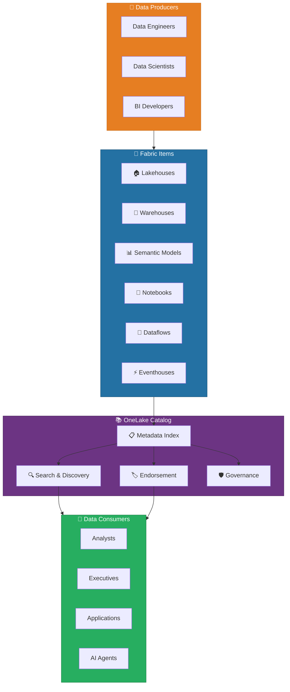
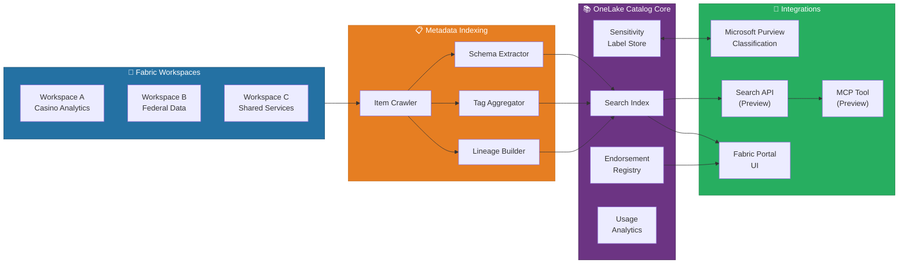
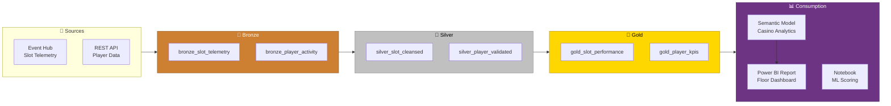
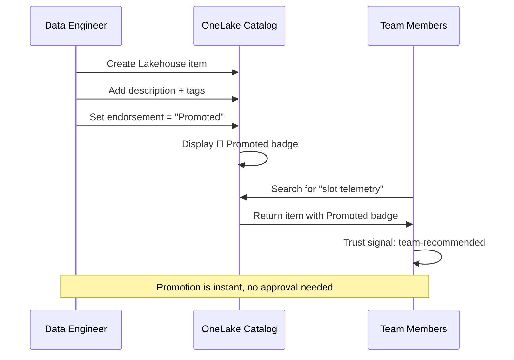
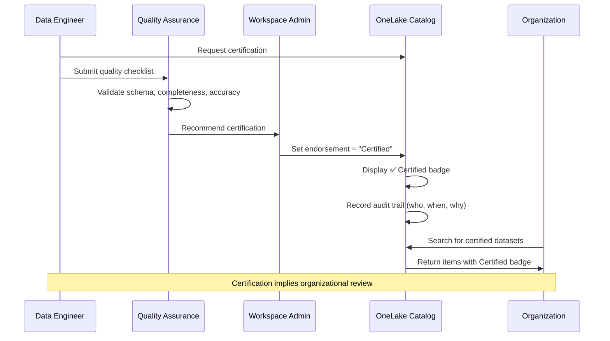
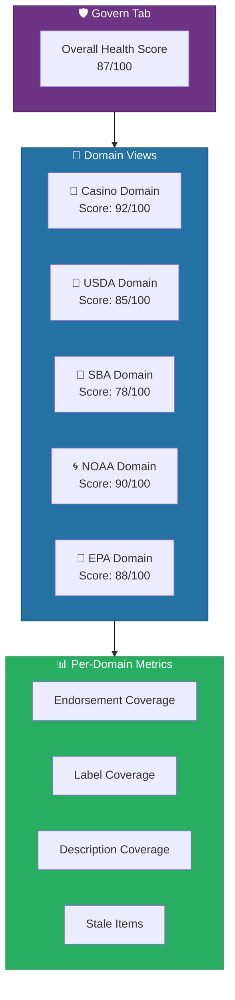
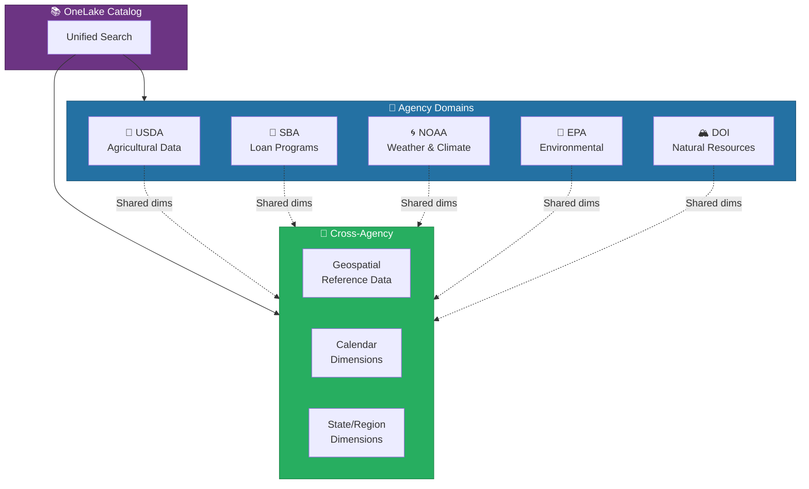

# 📚 OneLake Catalog - Unified Data Discovery & Governance Hub

<div align="center" markdown>

**Discover, Endorse, and Govern All Fabric Items from a Single Pane**


</div>

---

**Last Updated:** `2026-04-13` | **Version:** 1.0.0

---

## 🎯 Overview

OneLake Catalog is Microsoft Fabric's unified data discovery hub that provides a centralized experience for browsing, searching, tagging, endorsing, and governing all items across your Fabric estate. Available as a **Generally Available** feature, OneLake Catalog replaces the fragmented experience of navigating between workspaces, Lakehouses, Warehouses, and semantic models to find the right dataset -- instead offering a single searchable catalog that spans the entire organization's Fabric footprint.

OneLake Catalog sits at the intersection of data discovery and data governance. While data engineers create and curate assets in workspaces, OneLake Catalog makes those assets findable and trustworthy for consumers across the organization. It integrates with Microsoft Purview for sensitivity labeling and classification, supports endorsement workflows for data quality certification, and provides a governance dashboard that gives domain owners visibility into label coverage, endorsement status, and usage patterns.

### Key Capabilities

| Capability | Description |
|-----------|-------------|
| **Full-Text Search** | Search across item names, descriptions, tags, column names, and metadata across all accessible workspaces |
| **Faceted Filtering** | Filter by item type (Lakehouse, Warehouse, Semantic Model, etc.), endorsement status, domain, workspace, and sensitivity label |
| **Endorsement Badges** | Promote items as recommended or certify them as authoritative through approval workflows |
| **Sensitivity Labels** | View and apply Microsoft Purview Information Protection labels to classify data sensitivity |
| **Govern Tab** | Dashboard for domain owners showing label coverage, endorsement gaps, and governance health |
| **Recently Accessed** | Quick access to items you recently opened or queried |
| **Trending Items** | Discover popular items based on workspace-wide usage signals |
| **Lineage Integration** | View upstream and downstream dependencies for any catalog item |
| **Tags and Descriptions** | Add custom tags and rich descriptions to improve discoverability |
| **Search API (Preview)** | Programmatic access to catalog search for automation and AI agent integration |

### Why OneLake Catalog Matters

| Challenge | OneLake Catalog Solution |
|-----------|------------------------|
| Analysts can't find the right dataset | Full-text search with faceted filtering across all workspaces |
| Duplicate or untrusted copies of data | Endorsement badges distinguish authoritative sources |
| No visibility into data sensitivity | Purview sensitivity labels visible on every item |
| Domain owners lack governance overview | Govern tab with coverage metrics and compliance dashboards |
| Hard to discover related items | Lineage view shows upstream/downstream dependencies |
| Manual data asset documentation | Tags, descriptions, and column-level annotations |

### Where OneLake Catalog Fits



---

## 🏗️ Architecture

OneLake Catalog is a metadata service that indexes all Fabric items across workspaces and domains, providing a queryable discovery layer without duplicating the underlying data. The catalog ingests metadata from each workspace, builds a search index, and exposes it through both the Fabric portal UI and a REST API.

### Component Architecture



### Metadata Flow

1. **Item Crawler** continuously monitors Fabric workspaces for new, modified, or deleted items
2. **Schema Extractor** reads table schemas, column names, data types, and descriptions from Lakehouses, Warehouses, and Semantic Models
3. **Tag Aggregator** collects user-defined tags, endorsement status, and sensitivity labels
4. **Lineage Builder** traces data flow relationships from source (Bronze) through transformations (Silver) to consumption (Gold/Reports)
5. **Search Index** consolidates all metadata into a queryable index supporting full-text search and faceted filtering
6. **Endorsement Registry** tracks promotion and certification status with approval audit trails
7. **Usage Analytics** aggregates access patterns for trending items and popularity signals

### Access Control Model

OneLake Catalog respects Fabric workspace permissions. Users only see items in the catalog that they have at least **Viewer** access to in the source workspace.

| Role | Catalog Capability |
|------|-------------------|
| **Viewer** | Search, browse, view descriptions and tags, see endorsement badges |
| **Contributor** | All Viewer capabilities + add/edit tags, descriptions, request endorsement |
| **Member** | All Contributor capabilities + promote items (Promoted badge) |
| **Admin** | All Member capabilities + certify items (Certified badge), manage govern tab |
| **Domain Admin** | Cross-workspace governance dashboard, domain-level endorsement policies |

> 💡 **Tip**: OneLake Catalog does not grant data access. Discovering an item in the catalog does not mean you can query its data. Users must have appropriate permissions on the underlying workspace item (Lakehouse, Warehouse, etc.) to access the actual data.

---

## ⚙️ Discovery Features

### Full-Text Search

OneLake Catalog search covers all indexed metadata including item names, descriptions, tags, table names, column names, and measure definitions.

**Search scope:**

| Metadata Field | Example Search | Indexed |
|---------------|---------------|---------|
| Item name | `slot telemetry` | ✅ |
| Description | `casino floor monitoring` | ✅ |
| Tags | `compliance` | ✅ |
| Table names | `bronze_slot_telemetry` | ✅ |
| Column names | `machine_id` | ✅ |
| Measure names | `Net Win` | ✅ |
| Workspace name | `Casino Analytics` | ✅ |
| Owner/creator | `jdoe@contoso.com` | ✅ |
| Sensitivity label | `Confidential` | ✅ |

**Search operators:**

```
# Basic keyword search
slot telemetry

# Exact phrase
"bronze slot telemetry"

# Filter by item type
slot telemetry type:Lakehouse

# Filter by endorsement
revenue type:SemanticModel endorsed:certified

# Filter by domain
crop production domain:USDA

# Combine filters
compliance type:Lakehouse domain:Casino endorsed:promoted
```

### Faceted Filtering

The catalog UI provides faceted filters on the left panel for interactive refinement:

| Facet | Values |
|-------|--------|
| **Item Type** | Lakehouse, Warehouse, Semantic Model, Notebook, Dataflow, Pipeline, Eventhouse, Report, Dashboard |
| **Endorsement** | None, Promoted, Certified |
| **Sensitivity Label** | Public, General, Confidential, Highly Confidential |
| **Domain** | User-defined domains (e.g., Casino, USDA, SBA, NOAA, EPA, DOI) |
| **Workspace** | All accessible workspaces |
| **Owner** | Item creator or assigned owner |
| **Modified Date** | Last 7 days, 30 days, 90 days, custom range |

### Recently Accessed

The "Recently Accessed" section on the catalog home page shows the last 20 items you opened, queried, or modified. This provides a personal favorites-like experience without requiring explicit bookmarking.

### Trending Items

"Trending Items" surfaces the most-viewed items across workspaces you have access to, based on aggregated usage signals over the past 7 days. This helps new team members discover important datasets organically.

### Lineage View

From any catalog item, click the **Lineage** button to see the full upstream and downstream dependency graph. The lineage view shows:

- **Upstream**: Source systems, ingestion pipelines, Bronze tables, transformations
- **Current item**: Highlighted in the graph
- **Downstream**: Dependent reports, dashboards, notebooks, and derived datasets



---

## 🏷️ Endorsement & Certification

Endorsement is OneLake Catalog's mechanism for signaling data quality and trustworthiness. It replaces ad-hoc naming conventions (e.g., "final_v2_approved") with formal badges that are visible across the entire catalog.

### Endorsement Levels

| Level | Badge | Who Can Apply | Meaning |
|-------|-------|--------------|---------|
| **None** | — | N/A | Default state; item has not been reviewed |
| **Promoted** | 🔵 | Workspace Members | Item is recommended for use by the team; informal endorsement |
| **Certified** | ✅ | Workspace Admins / Domain Admins | Item meets organizational quality standards; formal certification |

### Promotion Workflow

Promotion is a lightweight endorsement that any workspace **Member** can apply. It signals "I recommend this item" without requiring a formal approval process.



### Certification Workflow

Certification is a formal endorsement that requires **Admin** privileges and implies organizational review. It is the highest trust signal in the catalog.



### Endorsement Best Practices

| Practice | Description |
|----------|-------------|
| **Gold layer = Certified** | Only certify Gold-layer items that have passed quality validation |
| **Silver layer = Promoted** | Promote Silver-layer items for team use but reserve certification for production |
| **Bronze layer = None** | Leave Bronze items unendorsed; they are raw and not curated |
| **Add descriptions** | Always add a description before endorsing -- explain what the data contains and its refresh schedule |
| **Document quality criteria** | Define what "certified" means for your organization (e.g., passes all Great Expectations suites) |
| **Review quarterly** | Schedule quarterly reviews to ensure certified items still meet quality standards |

### Endorsement Configuration (Admin)

Tenant admins can control endorsement policies at the tenant and domain level:

```
Fabric Admin Portal > Tenant Settings > Content Certification

- Enable certification: ✅
- Certification allowed for: "Specific security groups"
- Security groups: "Data Stewards", "Domain Admins"
- Documentation link: "https://wiki.contoso.com/data-certification-policy"
```

---

## 🛡️ Govern Tab

The Govern tab provides domain owners and workspace admins with a governance dashboard that surfaces compliance gaps, endorsement coverage, and sensitivity label status across all items in their scope.

### Governance Dashboard Metrics

| Metric | Description | Target |
|--------|-------------|--------|
| **Items with Endorsement** | Percentage of items that are Promoted or Certified | >80% for Gold layer |
| **Items with Sensitivity Labels** | Percentage of items with a Purview sensitivity label applied | 100% for regulated data |
| **Items with Descriptions** | Percentage of items with a non-empty description | >90% |
| **Stale Items** | Items not accessed in 90+ days | Investigate and archive |
| **Orphan Items** | Items with no owner or whose owner has left the organization | Reassign immediately |
| **Lineage Coverage** | Percentage of items with documented upstream lineage | >95% |

### Governance by Domain

The Govern tab supports domain-scoped views. When domains are configured (see Data Mesh patterns), domain admins see governance metrics only for items within their domain:



### Sensitivity Label Integration

OneLake Catalog integrates with Microsoft Purview Information Protection to display and manage sensitivity labels:

| Label | Meaning | Auto-Applied When |
|-------|---------|-------------------|
| **Public** | Data can be shared externally | Open data datasets (NOAA weather, DOI visitation) |
| **General** | Internal use, no restrictions | Internal aggregations, non-PII data |
| **Confidential** | Restricted to authorized users | Player PII, financial records, compliance reports |
| **Highly Confidential** | Strictest controls, encryption required | SSN data, SAR reports, CTR filings, healthcare (HIPAA) |

> 💡 **Tip**: Use Purview auto-labeling policies to automatically classify new Lakehouse tables based on column names (e.g., any table with an `ssn` or `social_security_number` column gets labeled "Highly Confidential" automatically).

### Quality Score Calculation

The governance health score (0-100) is calculated as a weighted average:

| Component | Weight | Calculation |
|-----------|--------|-------------|
| Endorsement coverage | 25% | % of Gold items with Promoted or Certified status |
| Sensitivity label coverage | 30% | % of items with a label (weighted by data sensitivity) |
| Description coverage | 15% | % of items with non-empty descriptions |
| Freshness | 15% | % of items refreshed within expected SLA |
| Ownership | 15% | % of items with an assigned, active owner |

---

## 🔍 Search API & MCP

### OneLake Catalog Search API (Preview)

The Search API provides programmatic access to OneLake Catalog for automation, CI/CD validation, and AI agent integration. As of April 2026, the API is in **Public Preview**.

### API Endpoints

```http
# Search catalog items
POST https://api.fabric.microsoft.com/v1/catalog/search
Content-Type: application/json
Authorization: Bearer {access_token}

{
    "query": "slot telemetry",
    "filters": {
        "itemType": ["Lakehouse", "Warehouse"],
        "endorsement": ["Certified"],
        "domain": ["Casino"]
    },
    "top": 10,
    "skip": 0,
    "orderBy": "relevance"
}
```

**Response:**

```json
{
    "value": [
        {
            "id": "a1b2c3d4-e5f6-7890-abcd-ef1234567890",
            "name": "lh_bronze",
            "itemType": "Lakehouse",
            "workspaceId": "ws-casino-001",
            "workspaceName": "Casino Analytics",
            "description": "Bronze layer Lakehouse for raw casino floor telemetry",
            "endorsement": "Certified",
            "sensitivityLabel": "Confidential",
            "domain": "Casino",
            "owner": "jdoe@contoso.com",
            "lastModified": "2026-04-10T14:30:00Z",
            "tags": ["bronze", "slot-telemetry", "compliance"],
            "tables": [
                {
                    "name": "bronze_slot_telemetry",
                    "columns": ["machine_id", "timestamp", "event_type", "coin_in", "coin_out"]
                }
            ]
        }
    ],
    "totalCount": 3,
    "continuationToken": null
}
```

### Python SDK Integration

```python
import requests
from azure.identity import DefaultAzureCredential

credential = DefaultAzureCredential()
token = credential.get_token("https://api.fabric.microsoft.com/.default")

# Search for certified Lakehouses in the Casino domain
response = requests.post(
    "https://api.fabric.microsoft.com/v1/catalog/search",
    headers={
        "Authorization": f"Bearer {token.token}",
        "Content-Type": "application/json"
    },
    json={
        "query": "slot",
        "filters": {
            "itemType": ["Lakehouse"],
            "endorsement": ["Certified"],
            "domain": ["Casino"]
        },
        "top": 10
    }
)

results = response.json()
for item in results["value"]:
    print(f"  {item['endorsement']}: {item['name']} ({item['workspaceName']})")
    print(f"    {item['description']}")
```

### CI/CD Validation: Ensure Endorsement Before Deployment

```python
# Validate that all Gold-layer items are endorsed before production deployment
def validate_endorsement(workspace_name: str, layer: str = "gold") -> bool:
    """Ensure all items matching the layer pattern are endorsed."""
    response = requests.post(
        "https://api.fabric.microsoft.com/v1/catalog/search",
        headers={"Authorization": f"Bearer {token.token}",
                 "Content-Type": "application/json"},
        json={
            "query": layer,
            "filters": {
                "workspace": [workspace_name],
                "endorsement": ["None"]
            },
            "top": 100
        }
    )

    unendorsed = response.json()["value"]
    if unendorsed:
        print(f"❌ {len(unendorsed)} {layer}-layer items are NOT endorsed:")
        for item in unendorsed:
            print(f"  - {item['name']} ({item['itemType']})")
        return False

    print(f"✅ All {layer}-layer items in {workspace_name} are endorsed")
    return True

# Use in deployment pipeline
assert validate_endorsement("Casino Analytics", "gold"), \
    "Deployment blocked: unendorsed Gold items"
```

### MCP Tool Integration (Preview)

The OneLake Catalog MCP tool enables AI agents (such as Fabric Data Agents or external MCP clients) to search the catalog using natural language, discover relevant datasets, and understand data lineage programmatically.

```python
# MCP tool definition for OneLake Catalog search
# Registered as an MCP server tool
{
    "name": "onelake_catalog_search",
    "description": "Search OneLake Catalog for Fabric items by keyword, type, domain, or endorsement status",
    "parameters": {
        "query": "string - Search keywords",
        "item_type": "string - Filter by item type (optional)",
        "domain": "string - Filter by domain (optional)",
        "endorsed_only": "boolean - Return only endorsed items (optional)"
    }
}
```

**Agent interaction example:**

```
User: "Find the certified slot telemetry dataset"

Agent → MCP Tool → OneLake Catalog API:
  query="slot telemetry", endorsement=["Certified"]

Agent: "I found the certified Bronze Lakehouse 'lh_bronze' in the 
Casino Analytics workspace. It contains the 'bronze_slot_telemetry' 
table with columns: machine_id, timestamp, event_type, coin_in, 
coin_out. Last updated April 10, 2026."
```

> 💡 **Tip**: Combining the OneLake Catalog MCP tool with Fabric Data Agents creates a powerful self-service data discovery experience. Analysts can ask "What certified datasets do we have for EPA compliance?" and the agent uses the catalog API to return relevant, trusted items.

---

## 🎰 Casino Implementation

### Domain Setup for Gaming

Configure the Casino domain to group all gaming-related items in the catalog:

```
Fabric Admin Portal > Domains > New Domain

Name: Casino Gaming
Description: All casino floor analytics, compliance, and player management items
Owners: casino-data-stewards@contoso.com
Workspaces: Casino Analytics, Casino Compliance, Casino Real-Time
```

### Endorsement Strategy for Gaming Items

| Layer | Items | Endorsement | Rationale |
|-------|-------|-------------|-----------|
| **Bronze** | bronze_slot_telemetry, bronze_table_games, bronze_player_activity | None | Raw, unvalidated ingestion |
| **Silver** | silver_slot_cleansed, silver_player_validated, silver_table_games_enriched | Promoted | Team-validated, schema-enforced |
| **Gold** | gold_slot_performance, gold_player_kpis, gold_compliance_ctr, gold_compliance_sar | **Certified** | Production-quality, compliance-approved |
| **Semantic Models** | Casino Floor Analytics, Player 360, Compliance Reporting | **Certified** | Executive-facing, audited |
| **Reports** | Floor Dashboard, Daily Compliance Summary, W-2G Report | **Certified** | Regulatory-facing reports |

### Compliance Dataset Certification Checklist

Before certifying any compliance-related dataset (CTR, SAR, W-2G), the following checks must pass:

| Check | Tool | Criteria |
|-------|------|----------|
| Schema validation | Great Expectations | All required columns present with correct types |
| Completeness | Great Expectations | <0.1% null rate on required fields |
| Threshold accuracy | Unit test | CTR threshold = $10,000 exact; W-2G thresholds by game type |
| PII masking | Manual review | SSN hashed (SHA-256), card numbers masked (last 4 only) |
| Sensitivity label | Purview | "Highly Confidential" label applied |
| Refresh SLA | Data Factory | Updated within 15 minutes of source event |
| Audit trail | Purview | Full lineage from source to Gold documented |

### Casino Catalog Search Examples

```
# Find all compliance-related certified items
compliance type:Lakehouse endorsed:certified domain:Casino

# Find SAR-related notebooks
sar type:Notebook domain:Casino

# Find all items tagged with "regulatory"
tag:regulatory domain:Casino

# Find W-2G reporting datasets
w-2g type:SemanticModel endorsed:certified
```

### Tagging Strategy

Apply consistent tags to improve discoverability:

| Tag | Applied To | Purpose |
|-----|-----------|---------|
| `compliance` | CTR, SAR, W-2G items | Regulatory dataset identification |
| `pii` | Player tables with personal data | Privacy-sensitive data flagging |
| `real-time` | Eventhouse tables, streaming items | Real-time data sources |
| `financial` | Revenue, coin-in/out, jackpot items | Financial data classification |
| `nigc-mics` | Items subject to NIGC MICS standards | Regulatory framework tagging |
| `medallion-bronze` / `silver` / `gold` | Medallion layer items | Architecture layer identification |

---

## 🏛️ Federal Agency Implementation

### Cross-Agency Catalog with Domain Boundaries

Each federal agency operates as a separate domain in OneLake Catalog, providing clear governance boundaries while enabling cross-agency discovery for authorized users.



### Domain Configuration per Agency

| Domain | Workspaces | Domain Admin | Sensitivity Default |
|--------|-----------|-------------|-------------------|
| **USDA** | USDA Bronze, USDA Silver, USDA Gold, USDA Analytics | usda-data-steward@agency.gov | General (open data) |
| **SBA** | SBA Lending, SBA Analytics | sba-data-steward@agency.gov | Confidential (PII in loan data) |
| **NOAA** | NOAA Observations, NOAA Analytics | noaa-data-steward@agency.gov | Public (open weather data) |
| **EPA** | EPA Compliance, EPA Analytics | epa-data-steward@agency.gov | General (public environmental data) |
| **DOI** | DOI Parks, DOI Analytics | doi-data-steward@agency.gov | General (public visitation data) |

### FISMA Labeling for Federal Data

Federal Information Security Modernization Act (FISMA) requires classification of all federal information systems. Map FISMA impact levels to Purview sensitivity labels:

| FISMA Impact Level | Purview Label | Data Examples |
|-------------------|---------------|---------------|
| **Low** | Public | NOAA weather observations, DOI park boundaries, EPA facility locations |
| **Moderate** | Confidential | SBA loan applicant data, USDA farm subsidy recipients, EPA enforcement actions |
| **High** | Highly Confidential | SBA borrower SSNs, USDA personnel records, EPA criminal investigations |

### Federal Endorsement Policy

```
Agency Data Governance Policy:

1. All Bronze-layer items: No endorsement (raw ingestion, not validated)
2. All Silver-layer items: Promoted (schema-validated, team-reviewed)
3. All Gold-layer items: Certified (quality-checked, compliance-approved)
4. Cross-agency shared dimensions: Certified (approved by data governance board)

Certification Requirements (Federal):
- Data quality score > 95% (Great Expectations suite pass)
- Sensitivity label applied
- FISMA classification documented
- Data dictionary complete
- Lineage documented from source API to Gold table
- Section 508 accessibility compliance for reports
```

### Cross-Agency Discovery Examples

```
# Find all certified crop production data
crop production endorsed:certified domain:USDA

# Find weather data that's publicly shareable
weather type:Lakehouse label:Public domain:NOAA

# Find all loan-related items across agencies
loan type:Lakehouse

# Find EPA enforcement data with proper sensitivity
enforcement endorsed:certified label:Confidential domain:EPA

# Discover shared dimension tables
type:Lakehouse tag:shared-dimension

# Find all items modified in the last 7 days across agencies
modified:last7days type:Lakehouse
```

### Cross-Agency Governance Dashboard

The federal governance dashboard aggregates metrics across all agency domains:

| Agency | Items | Endorsed % | Labeled % | Description % | Health Score |
|--------|-------|-----------|----------|---------------|--------------|
| 🌾 USDA | 42 | 88% | 100% | 92% | 85/100 |
| 💼 SBA | 38 | 82% | 100% | 88% | 78/100 |
| 🌀 NOAA | 35 | 91% | 95% | 90% | 90/100 |
| 🌊 EPA | 40 | 85% | 100% | 87% | 88/100 |
| 🏔️ DOI | 32 | 78% | 92% | 85% | 80/100 |
| **Total** | **187** | **85%** | **97%** | **88%** | **84/100** |

> ⚠️ **Warning**: Cross-agency data sharing must comply with each agency's data sharing agreements (DSAs) and Privacy Impact Assessments (PIAs). OneLake Catalog visibility does not imply authorization to access or combine data across agency boundaries. All cross-agency access must be documented and approved through the federal data governance board.

---

## ⚠️ Limitations

### Current Limitations

| Limitation | Details | Workaround |
|-----------|---------|------------|
| **Cross-tenant discovery not supported** | OneLake Catalog only indexes items within the current Fabric tenant; external tenant items are not discoverable | Use Azure Data Share or Purview cross-tenant scanning for multi-tenant scenarios |
| **Search API in Preview** | The REST API for catalog search is in Public Preview and subject to breaking changes | Pin API version in production code; monitor release notes |
| **Column-level endorsement not supported** | Endorsement applies to items (Lakehouse, Semantic Model) not individual tables or columns | Use tags and descriptions to annotate column-level quality |
| **No custom endorsement levels** | Only three levels (None, Promoted, Certified) are supported; cannot add organization-specific levels | Use tags (e.g., "compliance-approved", "privacy-reviewed") to add custom trust signals |
| **Indexing delay** | New or modified items may take up to 15 minutes to appear in catalog search results | Allow indexing latency in CI/CD validation scripts |
| **Limited search operators** | Full-text search supports basic keyword matching but not complex Boolean logic or regex | Use API with multiple filter parameters for precise queries |
| **No API for endorsement management** | Cannot programmatically set endorsement status via API (UI only) | Automate via Power Automate with UI flows, or wait for API GA |
| **Tag limits** | Maximum 50 tags per item; tag names limited to 128 characters | Use hierarchical tag naming (e.g., `compliance/ctr`, `compliance/sar`) |
| **MCP tool in Preview** | MCP integration for AI agents is experimental and may change | Test thoroughly before production AI agent deployments |

### What is Not Supported

| Capability | Alternative |
|-----------|-------------|
| Cross-tenant catalog federation | Microsoft Purview Data Catalog for multi-tenant discovery |
| Data quality scoring (automated) | Great Expectations + custom governance pipeline |
| Automated endorsement workflows | Power Automate approval flows with manual certification |
| Schema change detection alerts | Data Factory monitoring + custom alerts |
| Data access governance (fine-grained) | OneLake Security + workspace RBAC |
| External data source cataloging | Microsoft Purview for non-Fabric data sources |

> ⚠️ **Warning**: OneLake Catalog is not a replacement for Microsoft Purview Data Catalog in multi-cloud or hybrid environments. For organizations that need to catalog data assets across Azure, AWS, GCP, and on-premises systems, use Purview Data Catalog with OneLake Catalog as the Fabric-specific complement.

---

## 📚 References

| Resource | URL |
|----------|-----|
| OneLake Catalog Overview | https://learn.microsoft.com/fabric/governance/onelake-catalog |
| Endorsement and Certification | https://learn.microsoft.com/fabric/governance/endorsement-overview |
| Sensitivity Labels in Fabric | https://learn.microsoft.com/fabric/governance/information-protection |
| Fabric Domains | https://learn.microsoft.com/fabric/governance/domains |
| Microsoft Purview Integration | https://learn.microsoft.com/fabric/governance/use-microsoft-purview-hub |
| OneLake Catalog Search API (Preview) | https://learn.microsoft.com/rest/api/fabric/core/onelake-catalog |
| Fabric Admin Portal Settings | https://learn.microsoft.com/fabric/admin/admin-center |
| Data Governance Best Practices | https://learn.microsoft.com/fabric/governance/governance-compliance-overview |

---

## 🔗 Related Documents

- [OneLake Security](onelake-security.md) -- Fine-grained access control for items discovered in the catalog
- [Data Mesh Enterprise Patterns](data-mesh-enterprise-patterns.md) -- Domain-based organization that drives catalog structure
- [Data Agents](data-agents.md) -- AI agents that use catalog search for data discovery
- [Fabric IQ](fabric-iq.md) -- Natural language querying that can leverage catalog metadata
- [Architecture](../ARCHITECTURE.md) -- System architecture overview

---

> 📝 **Document Metadata**
> - **Author**: Documentation Team
> - **Reviewers**: Data Governance, Security, Compliance, Federal Data Stewards
> - **Classification**: Internal
> - **Next Review**: 2026-07-13
