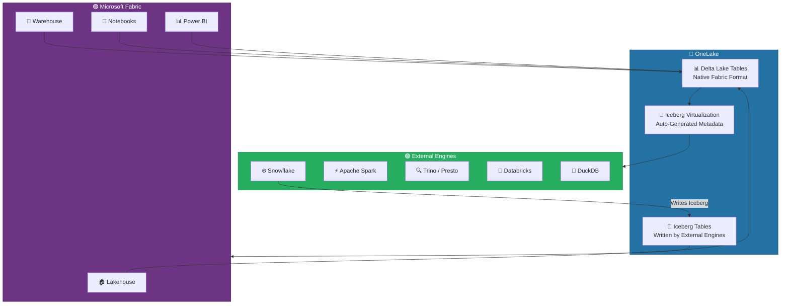
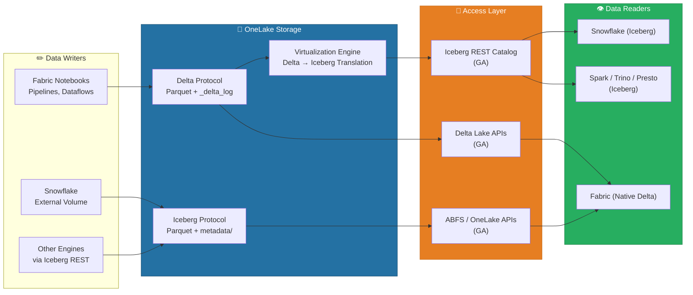
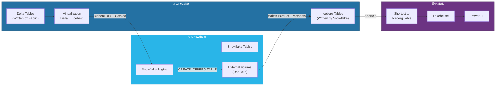
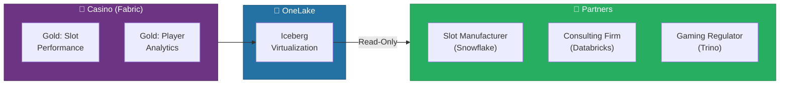
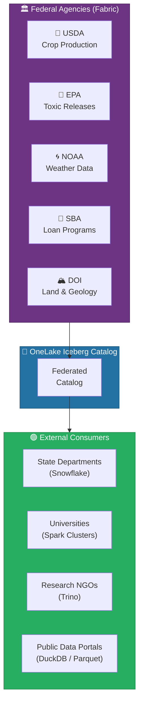
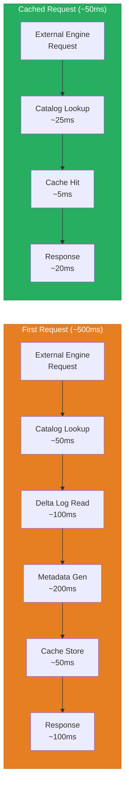

# 🧊 OneLake Iceberg Interoperability

<div align="center" markdown>

**Seamless Multi-Engine Data Access with Delta-Iceberg Virtualization**


</div>

---

**Last Updated:** `2026-04-13` | **Version:** 1.0.0

---

!!! info "Third-party references — publicly sourced, good-faith comparison"
    This page references non-Microsoft products and services. That information is drawn from each vendor's **publicly available documentation** and is offered for honest, good-faith comparison only. This is a personal project written from a Microsoft Fabric and Azure perspective; it does **not** claim expertise in, or authority over, any third-party product, and nothing here is an official statement by, or endorsed by, those vendors. Capabilities, pricing, and features change often — always verify against the vendor's current official documentation. Where a third-party offering is the stronger choice, we say so plainly.

## 🎯 Overview

OneLake now supports **Apache Iceberg format** alongside Delta Lake as a Generally Available feature (February 2026). Delta tables stored in OneLake can be **virtualized as Iceberg** without any data movement or duplication, enabling external compute engines to read Fabric-managed data through the industry-standard Iceberg protocol. Snowflake **bidirectional interoperability** reached GA simultaneously, allowing Snowflake to write Iceberg tables directly into OneLake and Fabric to read Snowflake-managed Iceberg data via shortcuts.

### Key Capabilities

| Capability | Description |
|-----------|-------------|
| **Delta-as-Iceberg Virtualization** | Any Delta table in OneLake is automatically readable as Iceberg -- no ETL, no data copy |
| **Iceberg REST Catalog** | OneLake exposes a standards-compliant Iceberg REST Catalog for external engine discovery |
| **Snowflake Bidirectional** | Snowflake writes Iceberg to OneLake; Fabric reads Snowflake Iceberg via shortcuts |
| **OneLake Table APIs (GA)** | Programmatic table management via REST -- create, read, update, delete across both formats |
| **Multi-Engine Read** | Spark, Trino, Presto, Databricks, DuckDB, and Snowflake all read the same physical data |
| **Zero-Copy Sharing** | Share data with partners and agencies without moving or duplicating files |

### Why Iceberg Interoperability Matters

Organizations rarely operate on a single analytics engine. Gaming operators may use Fabric internally but share data with regulators running Snowflake. Federal agencies need to publish datasets that state departments consume via Spark or Trino. Iceberg interoperability eliminates the data copies and ETL pipelines that traditionally bridge these engine boundaries.



---

## 🏗️ Architecture

### End-to-End Data Flow

The Iceberg interoperability architecture introduces a **virtualization layer** between OneLake's physical Delta storage and external consumers. This layer generates Iceberg-compatible metadata files on the fly, translating Delta's transaction log into Iceberg manifest lists, manifest files, and snapshots.



### Component Responsibilities

| Component | Role | Protocol |
|-----------|------|----------|
| **OneLake Storage** | Single-copy physical Parquet files for both Delta and Iceberg | ABFS, REST |
| **Virtualization Engine** | Translates Delta transaction log to Iceberg metadata on read | Internal |
| **Iceberg REST Catalog** | Exposes OneLake tables as Iceberg catalog entries per the REST spec | HTTPS / REST |
| **Delta Lake APIs** | Provides Delta-native access for Fabric workloads | HTTPS / REST |
| **OneLake Table APIs** | Unified CRUD operations for table management across formats | HTTPS / REST |
| **Shortcuts** | Zero-copy pointers to Iceberg tables written by external engines | ABFS |

### Metadata Architecture

When a Delta table is accessed via the Iceberg protocol, OneLake dynamically generates the required Iceberg metadata hierarchy:

```
onelake://<workspace>/<lakehouse>/Tables/<table_name>/
├── _delta_log/                    # Delta transaction log (source of truth)
│   ├── 00000000000000000000.json
│   ├── 00000000000000000001.json
│   └── ...
├── _iceberg_metadata/             # Auto-generated Iceberg metadata
│   ├── v1.metadata.json           # Table metadata (schema, partitioning, properties)
│   ├── snap-<id>.avro             # Snapshot manifest list
│   └── <manifest-id>.avro         # Manifest file (file-level stats)
└── part-00000-*.parquet           # Shared physical data files (no duplication)
```

> 📝 **Note:** The `_iceberg_metadata/` directory is generated and maintained automatically by OneLake. You do not need to create or manage these files. They are refreshed each time the underlying Delta table is modified.

---

## 🔄 Delta-as-Iceberg Virtualization

### How It Works

Delta-as-Iceberg virtualization is the cornerstone of OneLake's interoperability strategy. When an external engine requests a table through the Iceberg REST Catalog, OneLake performs the following steps:

1. **Catalog Lookup** -- The REST Catalog maps the requested table namespace and name to a OneLake path
2. **Delta Log Read** -- OneLake reads the Delta transaction log (`_delta_log/`) to determine the current table state
3. **Metadata Translation** -- The Delta schema, partitioning, and file statistics are translated into Iceberg metadata format
4. **Metadata Caching** -- Generated Iceberg metadata is cached and invalidated when the Delta log changes
5. **Data File Reference** -- Iceberg metadata points to the same physical Parquet files that Delta uses -- no data copy occurs
6. **Response** -- The external engine receives standard Iceberg metadata and reads Parquet files directly

### Enabling Virtualization

Delta-as-Iceberg is enabled by default for all Lakehouse tables in OneLake. No explicit configuration is required. To verify and manage the feature:

```
Lakehouse Settings → OneLake → Table Format Interoperability
  ├── Delta-as-Iceberg Virtualization → Enabled (default)
  ├── Iceberg REST Catalog Endpoint → https://<workspace>.onelake.fabric.microsoft.com/iceberg
  └── Catalog Authentication → Microsoft Entra ID (OAuth 2.0)
```

### Schema Compatibility

Delta and Iceberg support overlapping but not identical type systems. OneLake handles the mapping automatically:

| Delta Type | Iceberg Type | Notes |
|-----------|-------------|-------|
| `STRING` | `string` | Direct mapping |
| `INT` / `LONG` | `int` / `long` | Direct mapping |
| `FLOAT` / `DOUBLE` | `float` / `double` | Direct mapping |
| `BOOLEAN` | `boolean` | Direct mapping |
| `DATE` | `date` | Direct mapping |
| `TIMESTAMP` | `timestamptz` | Converted to UTC-normalized timestamp |
| `TIMESTAMP_NTZ` | `timestamp` | Direct mapping (no timezone) |
| `DECIMAL(p,s)` | `decimal(p,s)` | Direct mapping |
| `BINARY` | `binary` | Direct mapping |
| `ARRAY<T>` | `list<T>` | Element type recursively mapped |
| `MAP<K,V>` | `map<K,V>` | Key/value types recursively mapped |
| `STRUCT<...>` | `struct<...>` | Field types recursively mapped |

> ⚠️ **Warning:** Delta's `VOID` type and certain complex nested types with column mapping modes may not translate cleanly to Iceberg. Test schema compatibility before exposing complex tables to external consumers.

### Performance Characteristics

| Aspect | Detail |
|--------|--------|
| **First Read Latency** | 200-500ms overhead for initial metadata generation |
| **Subsequent Reads** | Near-zero overhead -- metadata is cached until Delta log changes |
| **Cache Invalidation** | Automatic when new commits appear in `_delta_log/` |
| **Data Scan Performance** | Identical to native Iceberg -- same Parquet files, same column statistics |
| **Concurrent Readers** | No limit -- metadata is read-only for external engines |
| **Write Path** | External engines cannot write through the virtualized Iceberg view (use Iceberg REST Catalog for writes) |

---

## ❄️ Snowflake Bidirectional

Snowflake and Microsoft Fabric now support **bidirectional data sharing** through Iceberg tables stored in OneLake. This eliminates the traditional approach of copying data between platforms via staged files or ETL pipelines.

### How Bidirectional Interop Works



### Direction 1: Snowflake Writes to OneLake

Snowflake can write Iceberg tables directly to OneLake via external volumes. Fabric then reads these tables through shortcuts.

**Step 1: Create an External Volume in Snowflake**

```sql
-- In Snowflake, create an external volume pointing to OneLake
CREATE OR REPLACE EXTERNAL VOLUME onelake_volume
  STORAGE_LOCATIONS = (
    (
      NAME = 'fabric_onelake'
      STORAGE_BASE_URL = 'azure://onelake.dfs.fabric.microsoft.com/<workspace_id>/<lakehouse_id>/Tables/'
      AZURE_TENANT_ID = '<tenant_id>'
    )
  );

-- Grant Snowflake's service principal access to OneLake
-- (Requires Microsoft Entra ID app registration and RBAC assignment)
```

**Step 2: Create an Iceberg Table in Snowflake**

```sql
-- Create a managed Iceberg table that writes to OneLake
CREATE OR REPLACE ICEBERG TABLE gaming_analytics.public.player_summary
  CATALOG = 'SNOWFLAKE'
  EXTERNAL_VOLUME = 'onelake_volume'
  BASE_LOCATION = 'player_summary/'
AS
SELECT
    player_id,
    SUM(total_wagered) AS lifetime_wagered,
    SUM(total_won) AS lifetime_won,
    COUNT(DISTINCT session_date) AS total_visits,
    MAX(session_date) AS last_visit
FROM gaming_analytics.public.player_sessions
GROUP BY player_id;
```

**Step 3: Create a Shortcut in Fabric**

```
Lakehouse → Tables → New Shortcut → OneLake
  Source: <workspace>/<lakehouse>/Tables/player_summary
  Name: snowflake_player_summary
```

> 💡 **Tip:** The shortcut is a zero-copy pointer. When Snowflake updates the Iceberg table, Fabric sees the changes immediately without any sync process.

### Direction 2: Fabric Tables Readable by Snowflake

Snowflake reads Fabric Delta tables through the Iceberg REST Catalog exposed by OneLake.

```sql
-- In Snowflake, create a catalog integration for OneLake
CREATE OR REPLACE CATALOG INTEGRATION onelake_catalog
  CATALOG_SOURCE = REST
  TABLE_FORMAT = ICEBERG
  CATALOG_NAMESPACE = '<workspace_name>.<lakehouse_name>'
  REST_CONFIG = (
    CATALOG_URI = 'https://<workspace>.onelake.fabric.microsoft.com/iceberg'
    WAREHOUSE = '<lakehouse_id>'
  )
  REST_AUTHENTICATION = (
    TYPE = OAUTH
    OAUTH_CLIENT_ID = '<client_id>'
    OAUTH_CLIENT_SECRET = '<client_secret>'
    OAUTH_TOKEN_URI = 'https://login.microsoftonline.com/<tenant_id>/oauth2/v2.0/token'
  );

-- Query a Fabric Delta table as if it were native Snowflake
SELECT *
FROM onelake_catalog.lh_gold.gold_slot_performance
WHERE gaming_date >= DATEADD(DAY, -7, CURRENT_DATE())
ORDER BY hold_pct ASC
LIMIT 100;
```

### Snowflake Item in OneLake

The new **Snowflake item** in OneLake provides a managed connection to a Snowflake account, simplifying bidirectional setup:

```
Workspace → + New → Snowflake (Preview)
  ├── Snowflake Account URL: <account>.snowflakecomputing.com
  ├── Authentication: OAuth (Microsoft Entra ID) or Key Pair
  ├── Default Warehouse: COMPUTE_WH
  ├── Default Database: GAMING_ANALYTICS
  └── Sync Mode: Bidirectional Iceberg
```

### Authentication Setup

| Auth Method | Direction | Setup |
|------------|-----------|-------|
| **OAuth (Entra ID)** | Both | Register app in Microsoft Entra ID, configure Snowflake security integration |
| **Service Principal** | Snowflake → OneLake | Create SPN with Storage Blob Data Contributor on OneLake |
| **Key Pair** | Fabric → Snowflake | Generate RSA key pair, assign public key to Snowflake user |
| **Managed Identity** | Fabric → OneLake | Automatic for Fabric workloads (no configuration needed) |

> 📝 **Note:** For federal workloads, ensure the Snowflake account is deployed in a FedRAMP-authorized region and that OAuth tokens are scoped to the minimum required permissions.

---

## 🔌 OneLake Table APIs

The OneLake Table APIs (GA) provide a unified programmatic interface for managing tables across both Delta and Iceberg formats. These APIs follow the Iceberg REST Catalog specification and extend it with Delta-specific operations.

### API Endpoints

| Operation | Method | Endpoint | Description |
|-----------|--------|----------|-------------|
| **List Namespaces** | `GET` | `/iceberg/v1/namespaces` | List all lakehouses in the workspace |
| **List Tables** | `GET` | `/iceberg/v1/namespaces/{ns}/tables` | List tables in a lakehouse |
| **Get Table Metadata** | `GET` | `/iceberg/v1/namespaces/{ns}/tables/{table}` | Retrieve full table metadata |
| **Create Table** | `POST` | `/iceberg/v1/namespaces/{ns}/tables` | Create a new table |
| **Drop Table** | `DELETE` | `/iceberg/v1/namespaces/{ns}/tables/{table}` | Delete a table |
| **Load Table** | `POST` | `/iceberg/v1/namespaces/{ns}/tables/{table}` | Load table for reading |
| **Rename Table** | `POST` | `/iceberg/v1/tables/rename` | Rename an existing table |

### Python Examples

#### List Tables in a Lakehouse

```python
import requests
from azure.identity import DefaultAzureCredential

credential = DefaultAzureCredential()
token = credential.get_token("https://storage.azure.com/.default")

base_url = "https://<workspace>.onelake.fabric.microsoft.com/iceberg/v1"
headers = {
    "Authorization": f"Bearer {token.token}",
    "Content-Type": "application/json"
}

# List all tables in the lakehouse
response = requests.get(
    f"{base_url}/namespaces/lh_gold/tables",
    headers=headers
)

tables = response.json()
for table in tables["identifiers"]:
    print(f"Table: {table['namespace']}.{table['name']}")
```

#### Get Table Metadata (Schema, Partitioning, Statistics)

```python
# Get full metadata for a specific table
response = requests.get(
    f"{base_url}/namespaces/lh_gold/tables/gold_slot_performance",
    headers=headers
)

metadata = response.json()

# Print schema information
schema = metadata["metadata"]["schemas"][-1]  # Current schema
print(f"Schema ID: {schema['schema-id']}")
for field in schema["fields"]:
    print(f"  {field['name']}: {field['type']} (nullable={field.get('required', True)})")

# Print partition spec
partition_spec = metadata["metadata"].get("partition-specs", [])
for spec in partition_spec:
    for field in spec["fields"]:
        print(f"  Partition: {field['name']} ({field['transform']})")

# Print snapshot summary (row count, file count)
snapshots = metadata["metadata"].get("snapshots", [])
if snapshots:
    latest = snapshots[-1]
    summary = latest.get("summary", {})
    print(f"  Rows: {summary.get('total-records', 'N/A')}")
    print(f"  Files: {summary.get('total-data-files', 'N/A')}")
    print(f"  Size: {summary.get('total-files-size', 'N/A')} bytes")
```

#### Connect with PyIceberg

```python
from pyiceberg.catalog import load_catalog

# Connect to OneLake via the Iceberg REST Catalog
catalog = load_catalog(
    "onelake",
    **{
        "type": "rest",
        "uri": "https://<workspace>.onelake.fabric.microsoft.com/iceberg",
        "credential": "<oauth_token>",
        "warehouse": "<lakehouse_id>",
    }
)

# List namespaces (lakehouses)
namespaces = catalog.list_namespaces()
print(f"Namespaces: {namespaces}")

# Load a table
table = catalog.load_table("lh_gold.gold_slot_performance")
print(f"Schema: {table.schema()}")
print(f"Snapshots: {len(table.history())}")

# Scan the table with filters
scan = table.scan(
    row_filter="gaming_date >= '2026-04-01'",
    selected_fields=("machine_id", "hold_pct", "coin_in", "gaming_date")
)

# Convert to pandas DataFrame
df = scan.to_pandas()
print(f"Rows: {len(df)}")
print(df.head(10))
```

#### Connect with Apache Spark

```python
# PySpark configuration for reading OneLake tables via Iceberg
spark = SparkSession.builder \
    .appName("OneLake-Iceberg-Reader") \
    .config("spark.sql.catalog.onelake", "org.apache.iceberg.spark.SparkCatalog") \
    .config("spark.sql.catalog.onelake.type", "rest") \
    .config("spark.sql.catalog.onelake.uri",
            "https://<workspace>.onelake.fabric.microsoft.com/iceberg") \
    .config("spark.sql.catalog.onelake.credential", "<oauth_token>") \
    .config("spark.sql.catalog.onelake.warehouse", "<lakehouse_id>") \
    .getOrCreate()

# Query a Fabric Delta table through the Iceberg catalog
df = spark.sql("""
    SELECT machine_id, gaming_date, hold_pct, coin_in
    FROM onelake.lh_gold.gold_slot_performance
    WHERE gaming_date >= '2026-04-01'
    ORDER BY hold_pct ASC
""")

df.show(10)
```

---

## 🎰 Casino Use Cases

Iceberg interoperability unlocks several high-value scenarios for casino and gaming operations where data must cross organizational and platform boundaries.

### Use Case 1: Share Analytics with External Partners

Casino operators often work with slot manufacturers, game developers, and consulting firms that run their own analytics platforms -- frequently Snowflake or Databricks.



**Benefits:**
- Slot manufacturers analyze machine performance data without receiving data extracts
- Consulting firms run analytics on the same data Fabric uses -- no stale copies
- Gaming regulators query compliance data directly rather than waiting for file submissions

### Use Case 2: Regulatory Reporting to Iceberg-Based Systems

State gaming commissions increasingly adopt modern data platforms. Iceberg interoperability allows casinos to expose compliance data (CTR, SAR, W-2G) through a standard protocol:

```python
# Gaming regulator queries casino compliance data from their Trino cluster
# Trino configuration: catalog = onelake_casino

# Regulator runs:
trino> SELECT
         filing_type,
         COUNT(*) AS filing_count,
         SUM(transaction_amount) AS total_amount
       FROM onelake_casino.lh_gold.gold_compliance_filings
       WHERE filing_date >= DATE '2026-01-01'
       GROUP BY filing_type
       ORDER BY filing_count DESC;
```

### Use Case 3: Multi-Engine Analytics

Large gaming enterprises may use multiple analytics engines for different workloads. Iceberg interoperability ensures all engines read from the same data:

| Engine | Workload | Access Method |
|--------|----------|---------------|
| **Fabric (PySpark)** | Medallion ETL, data engineering | Native Delta |
| **Power BI** | Executive dashboards, Direct Lake | Native Delta |
| **Snowflake** | Ad-hoc analyst queries, partner sharing | Iceberg REST Catalog |
| **Databricks** | ML model training, feature engineering | Iceberg REST Catalog |
| **DuckDB** | Local development, data exploration | Iceberg REST Catalog |

> 💡 **Tip:** Multi-engine access works best when one engine (Fabric) is the authoritative writer and all others are readers. Avoid concurrent writes from multiple engines to the same table -- use separate tables or namespaces per writer.

---

## 🏛️ Federal Use Cases

Federal agencies that publish open data or share datasets across departments benefit significantly from Iceberg interoperability, as it eliminates the need to produce and distribute data extracts.

### Use Case 1: Cross-Agency Data Sharing



### Use Case 2: USDA Crop Data for State Agriculture Departments

State agriculture departments using Snowflake can query USDA crop production data directly from OneLake:

```sql
-- State Dept of Agriculture (Snowflake) queries USDA data
SELECT
    state,
    commodity,
    year,
    production_value,
    yield_per_acre,
    acres_harvested
FROM onelake_federal.lh_gold.gold_usda_crop_production
WHERE state = 'IOWA'
  AND commodity IN ('CORN', 'SOYBEANS', 'WHEAT')
  AND year >= 2020
ORDER BY year DESC, commodity;
```

### Use Case 3: NOAA Weather Data for Research Systems

University research groups running Spark clusters can connect to NOAA weather data without downloading bulk CSV files:

```python
# University research Spark cluster reads NOAA data via Iceberg
storm_events = spark.sql("""
    SELECT event_type, state, year,
           COUNT(*) AS event_count,
           AVG(damage_property) AS avg_property_damage
    FROM onelake_federal.lh_gold.gold_noaa_storm_summary
    WHERE year >= 2015
      AND event_type IN ('Hurricane', 'Tornado', 'Flood')
    GROUP BY event_type, state, year
    ORDER BY year DESC, event_count DESC
""")

storm_events.write.format("parquet").save("/research/storm_analysis_2026/")
```

### Use Case 4: Interagency Analytics Without Data Movement

Analysts performing cross-agency research can query datasets from multiple agencies through a single Iceberg catalog without any data leaving OneLake:

```sql
-- Cross-agency query: EPA facilities near SBA-funded businesses
-- Executed from any Iceberg-compatible engine
SELECT
    e.facility_name,
    e.chemical_name,
    e.total_releases_lbs,
    s.business_name,
    s.loan_amount,
    s.naics_code
FROM onelake_federal.lh_silver.silver_epa_tri_releases e
JOIN onelake_federal.lh_silver.silver_sba_7a_loans s
  ON e.zip_code = s.zip_code
WHERE e.year = 2025
  AND e.total_releases_lbs > 1000
ORDER BY e.total_releases_lbs DESC
LIMIT 50;
```

> 📝 **Note:** Cross-agency queries through a single Iceberg catalog require all agencies' data to reside within the same OneLake workspace or federated catalog. For data sovereignty requirements, use workspace-level RBAC to control access.

---

## ⚙️ Configuration Guide

### Step 1: Enable Iceberg Virtualization (Workspace Level)

Navigate to workspace settings to confirm Iceberg support is active:

```
Workspace Settings → OneLake → Interoperability
  ├── Delta-as-Iceberg Virtualization → Enabled (default for new workspaces)
  ├── Iceberg REST Catalog → Enabled
  └── External Engine Access → Configure per security requirements
```

### Step 2: Configure the Iceberg REST Catalog Endpoint

Retrieve the catalog endpoint for your workspace:

```python
# Discover the Iceberg REST Catalog endpoint
import requests
from azure.identity import DefaultAzureCredential

credential = DefaultAzureCredential()
token = credential.get_token("https://storage.azure.com/.default")

# Catalog configuration endpoint
workspace_id = "<workspace_guid>"
catalog_url = f"https://onelake.fabric.microsoft.com/{workspace_id}/iceberg/v1/config"

response = requests.get(
    catalog_url,
    headers={"Authorization": f"Bearer {token.token}"}
)

config = response.json()
print(f"Catalog URI: {config['defaults']['uri']}")
print(f"Warehouse: {config['defaults']['warehouse']}")
```

### Step 3: Configure Snowflake External Volume

```sql
-- 1. Create storage integration (admin-level operation)
CREATE OR REPLACE STORAGE INTEGRATION onelake_integration
  TYPE = EXTERNAL_STAGE
  STORAGE_PROVIDER = 'AZURE'
  ENABLED = TRUE
  AZURE_TENANT_ID = '<your_tenant_id>'
  STORAGE_ALLOWED_LOCATIONS = (
    'azure://onelake.dfs.fabric.microsoft.com/<workspace_id>/'
  );

-- 2. Retrieve the Snowflake service principal for RBAC
DESC STORAGE INTEGRATION onelake_integration;
-- Note: AZURE_CONSENT_URL and AZURE_MULTI_TENANT_APP_NAME

-- 3. Create external volume
CREATE OR REPLACE EXTERNAL VOLUME onelake_vol
  STORAGE_LOCATIONS = (
    (
      NAME = 'fabric_lakehouse'
      STORAGE_BASE_URL = 'azure://onelake.dfs.fabric.microsoft.com/<workspace_id>/<lakehouse_id>/Tables/'
      AZURE_TENANT_ID = '<tenant_id>'
      STORAGE_INTEGRATION = onelake_integration
    )
  );
```

### Step 4: Grant OneLake RBAC to External Service Principals

In the Azure portal or via CLI, assign the Snowflake service principal access to OneLake:

```bash
# Assign Storage Blob Data Contributor to the Snowflake SPN
az role assignment create \
  --assignee "<snowflake_service_principal_id>" \
  --role "Storage Blob Data Contributor" \
  --scope "/subscriptions/<sub>/resourceGroups/<rg>/providers/Microsoft.Storage/storageAccounts/onelake/blobServices/default/containers/<workspace_id>"
```

### Step 5: Configure Catalog Federation (Multi-Workspace)

For organizations with multiple workspaces (e.g., one per agency), set up catalog federation:

```python
# Federated catalog configuration
federation_config = {
    "catalogs": [
        {
            "name": "casino_ops",
            "uri": "https://ws-casino.onelake.fabric.microsoft.com/iceberg",
            "warehouse": "<casino_lakehouse_id>"
        },
        {
            "name": "federal_usda",
            "uri": "https://ws-federal.onelake.fabric.microsoft.com/iceberg",
            "warehouse": "<usda_lakehouse_id>"
        },
        {
            "name": "federal_epa",
            "uri": "https://ws-federal.onelake.fabric.microsoft.com/iceberg",
            "warehouse": "<epa_lakehouse_id>"
        }
    ]
}
```

### Step 6: Validate Connectivity

```python
# Validate that external engines can reach the catalog
from pyiceberg.catalog import load_catalog

catalog = load_catalog("onelake", type="rest",
    uri="https://<workspace>.onelake.fabric.microsoft.com/iceberg",
    credential="<oauth_token>",
    warehouse="<lakehouse_id>"
)

# List namespaces
namespaces = catalog.list_namespaces()
print(f"Available namespaces: {namespaces}")

# List tables in each namespace
for ns in namespaces:
    tables = catalog.list_tables(ns)
    print(f"  {ns}: {len(tables)} tables")
    for table_id in tables[:5]:
        table = catalog.load_table(table_id)
        print(f"    - {table_id}: {len(table.schema().fields)} columns, "
              f"{len(table.history())} snapshots")
```

---

## 📊 Performance Considerations

### Iceberg vs Delta Query Performance

When querying the same data through Delta (native) vs Iceberg (virtualized), expect the following characteristics:

| Metric | Native Delta (Fabric) | Virtualized Iceberg (External) | Notes |
|--------|----------------------|-------------------------------|-------|
| **Metadata Overhead** | None (native format) | 200-500ms initial, cached thereafter | One-time per session or log change |
| **File Pruning** | V-Order optimized | Standard Iceberg pruning | Delta V-Order benefits not available via Iceberg |
| **Predicate Pushdown** | Full Delta statistics | Iceberg column-level min/max stats | Both support effective pushdown |
| **Partition Pruning** | Delta partition filters | Iceberg partition spec filters | Equivalent effectiveness |
| **Scan Throughput** | Identical | Identical | Same physical Parquet files |
| **Concurrent Reads** | Unlimited | Unlimited | No locking on read path |

### Metadata Overhead Analysis



### Caching Strategies

| Strategy | Description | Best For |
|----------|-------------|----------|
| **Automatic (Default)** | OneLake caches Iceberg metadata until Delta log changes | Most workloads |
| **Eager Refresh** | Pre-generate Iceberg metadata on Delta commit | High-frequency external reads |
| **Snapshot Pinning** | Pin external reads to a specific snapshot version | Reproducible analytics |
| **TTL Override** | Set max metadata age for time-sensitive workloads | Near-real-time external access |

### When to Use Native Delta vs Iceberg Virtualization

| Scenario | Recommendation | Rationale |
|----------|---------------|-----------|
| Fabric notebooks and pipelines | **Native Delta** | Full V-Order, Z-Order, liquid clustering benefits |
| Power BI Direct Lake | **Native Delta** | Required -- Direct Lake only supports Delta |
| Snowflake analyst queries | **Iceberg Virtualization** | Only way to read from Snowflake without data copy |
| Spark clusters outside Fabric | **Iceberg Virtualization** | Standard Iceberg protocol works universally |
| ML training on Databricks | **Iceberg Virtualization** | Read training data without export |
| Data quality with Great Expectations | **Native Delta** | Runs inside Fabric notebooks |
| Regulatory data submission | **Iceberg Virtualization** | Regulators use their own tools |

> 💡 **Tip:** Use native Delta for all write paths and internal Fabric workloads. Reserve Iceberg virtualization exclusively for cross-engine read scenarios where external tools cannot read Delta natively.

---

## ⚠️ Limitations

### Format Compatibility Gaps

| Area | Limitation | Impact | Workaround |
|------|-----------|--------|-----------|
| **Deletion Vectors** | Iceberg readers cannot process Delta deletion vectors | Reads may include logically deleted rows until compaction | Run `OPTIMIZE` with `VACUUM` to compact before exposing tables |
| **Column Mapping** | Delta column mapping modes (name, id) may not translate cleanly | Column renames in Delta may not reflect in Iceberg metadata | Avoid column renames on tables exposed via Iceberg; recreate if needed |
| **V-Order** | Iceberg readers do not benefit from V-Order optimization | No performance degradation, but no V-Order speedup either | V-Order still benefits native Fabric/Power BI reads |
| **Liquid Clustering** | Iceberg metadata does not expose Delta liquid clustering info | External engines cannot leverage clustering for query optimization | External engines rely on Iceberg partition pruning instead |
| **Change Data Feed** | Delta CDF is not exposed through Iceberg | External engines cannot read incremental changes | Use timestamp-based filtering or Iceberg snapshots for incremental reads |

### Schema Evolution Differences

| Operation | Delta Behavior | Iceberg Behavior | Compatibility |
|-----------|---------------|------------------|---------------|
| **Add Column** | Supported | Supported | ✅ Compatible |
| **Drop Column** | Supported | Supported | ✅ Compatible |
| **Rename Column** | Supported (with column mapping) | Supported | ⚠️ May require metadata refresh |
| **Widen Type** (e.g., INT → LONG) | Supported | Supported | ✅ Compatible |
| **Narrow Type** (e.g., LONG → INT) | Not supported | Not supported | ✅ Both reject |
| **Reorder Columns** | Supported | Supported | ✅ Compatible |
| **Nested Schema Changes** | Supported | Supported | ⚠️ Complex nesting may require testing |

### Transaction Semantics Differences

| Aspect | Delta Lake | Apache Iceberg | Impact |
|--------|-----------|---------------|--------|
| **ACID Transactions** | Full (serializable) | Full (serializable) | No impact for reads |
| **Concurrent Writers** | Optimistic concurrency via Delta log | Optimistic concurrency via metadata commits | Only one engine should write to a given table |
| **Time Travel** | `VERSION AS OF` / `TIMESTAMP AS OF` | Snapshot-based history | Iceberg readers see snapshots, not Delta versions |
| **MERGE / UPSERT** | Native `MERGE INTO` | Copy-on-write or merge-on-read | Different physical implementations |
| **Compaction** | `OPTIMIZE` command | Rewrite manifests / data files | Must compact in the native format |

> ⚠️ **Warning:** Never configure two engines to write concurrently to the same table. Delta and Iceberg use different transaction logs, and concurrent writes will corrupt data. Designate a single authoritative writer per table and use the other engine(s) for reads only.

### Feature Support Matrix

| Feature | Delta (Fabric) | Iceberg (Virtualized) | Iceberg (Native/Snowflake) |
|---------|---------------|----------------------|---------------------------|
| Read | ✅ | ✅ | ✅ |
| Write | ✅ | ❌ (read-only view) | ✅ (via external volume) |
| Schema Evolution | ✅ Full | ✅ Read-only | ✅ Full |
| Partition Pruning | ✅ | ✅ | ✅ |
| Time Travel | ✅ | ✅ (via snapshots) | ✅ |
| Predicate Pushdown | ✅ | ✅ | ✅ |
| Direct Lake (Power BI) | ✅ | ❌ | ❌ |
| Streaming Ingestion | ✅ | ❌ | ❌ |

---

## 📚 References

| Resource | URL |
|----------|-----|
| OneLake Iceberg Support Announcement | https://learn.microsoft.com/fabric/onelake/onelake-iceberg |
| OneLake Table APIs | https://learn.microsoft.com/fabric/onelake/onelake-table-apis |
| Iceberg REST Catalog Spec | https://iceberg.apache.org/spec/#iceberg-rest-catalog |
| Apache Iceberg Format Specification | https://iceberg.apache.org/spec/ |
| Snowflake Iceberg Tables | https://docs.snowflake.com/en/user-guide/tables-iceberg |
| Snowflake External Volumes (Azure) | https://docs.snowflake.com/en/sql-reference/sql/create-external-volume |
| Delta Lake to Iceberg Interop Blog | https://blog.fabric.microsoft.com/blog/delta-iceberg-interoperability |
| PyIceberg Documentation | https://py.iceberg.apache.org/ |
| OneLake Shortcuts | https://learn.microsoft.com/fabric/onelake/onelake-shortcuts |
| Fabric Lakehouse Architecture | https://learn.microsoft.com/fabric/data-engineering/lakehouse-overview |

---

## 🔗 Related Documents

- [Real-Time Intelligence](real-time-intelligence.md) -- RTI streaming data accessible via Iceberg
- [Fabric IQ](fabric-iq.md) -- Natural language queries across Delta and Iceberg tables
- [Data Mesh Enterprise Patterns](data-mesh-enterprise-patterns.md) -- Cross-domain data sharing strategies
- [Mirroring](mirroring.md) -- Database mirroring as alternative to Iceberg for cross-platform data access
- [Data Sharing & Federation](../best-practices/data-sharing-federation.md) -- Shortcut patterns and external federation
- [Direct Lake](direct-lake.md) -- Direct Lake semantic models over Iceberg/Delta tables
- [AI Copilot Configuration](ai-copilot-configuration.md) -- Copilot for multi-format data exploration
- [Architecture](../ARCHITECTURE.md) -- System architecture overview

---

> 📝 **Document Metadata**
> - **Author**: Documentation Team
> - **Reviewers**: Data Engineering, Platform Team, Security
> - **Classification**: Internal
> - **Next Review**: 2026-06-13
