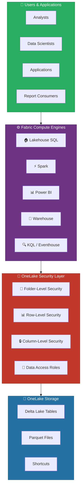
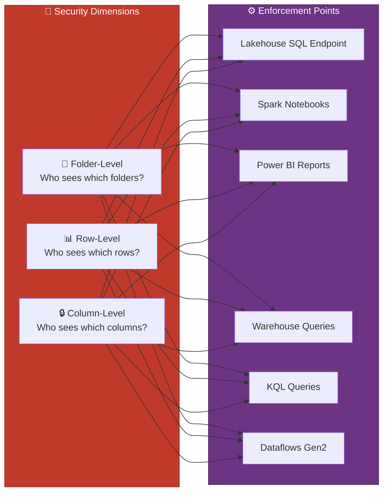
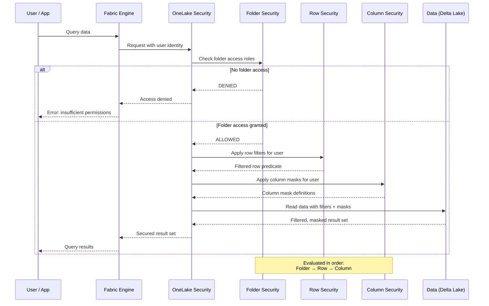
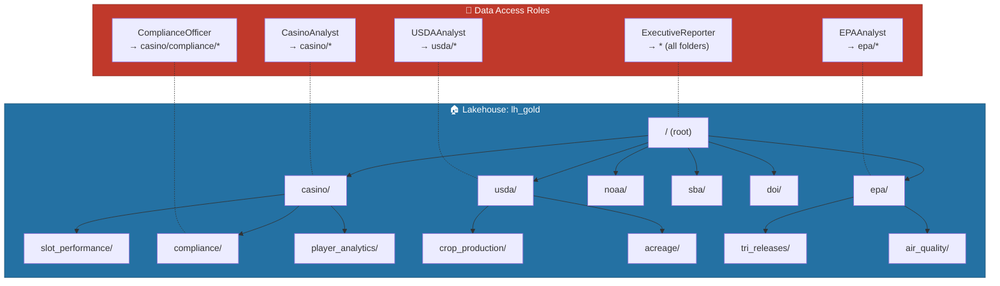
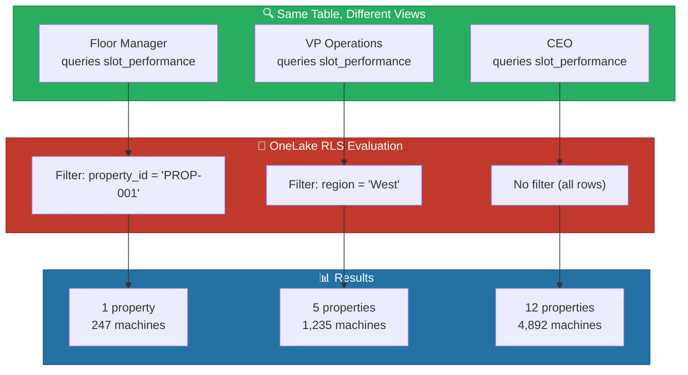
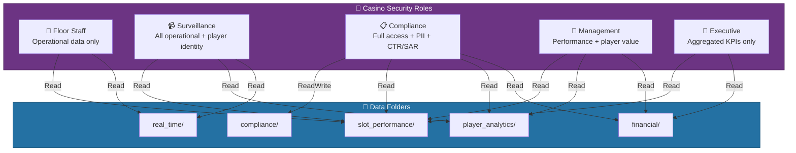
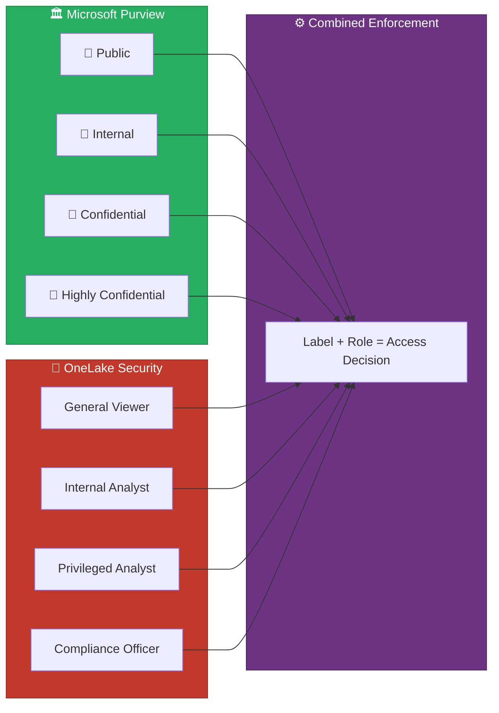
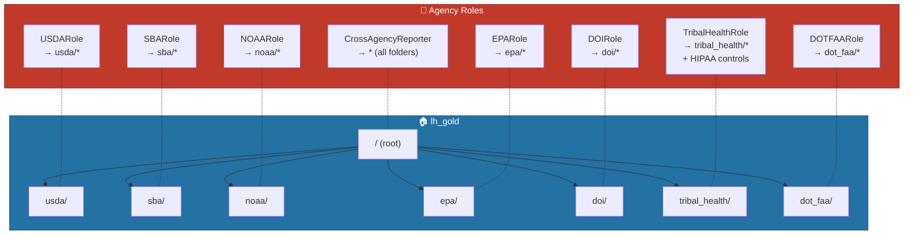
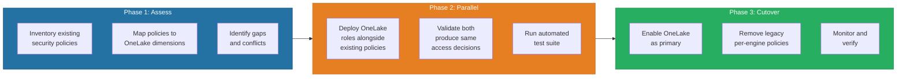

# 🔐 OneLake Security - Unified Data Protection

<div align="center" markdown>

**Define Once, Enforce Everywhere — Security That Lives with the Data**


</div>

---

**Last Updated:** `2026-04-13` | **Version:** 1.0.0

---

## 🎯 Overview

OneLake Security is Microsoft Fabric's unified security model that fundamentally shifts how data protection works across the analytics platform. Rather than configuring security independently in each engine — Row-Level Security in Power BI, access control lists in Lakehouse, Dynamic Data Masking in Warehouse — OneLake Security lets you define security policies once at the data layer and enforces them consistently across every Fabric engine that touches the data.

### The Paradigm Shift

Previously, securing data in Microsoft Fabric required configuring security in each engine independently. A single table might have RLS rules in Power BI, separate ACLs in the Lakehouse SQL endpoint, and DDM policies in the Warehouse — all maintained separately with no guarantee of consistency. OneLake Security eliminates this fragmentation by moving security to the data layer itself.

| Aspect | Old Model (Per-Engine) | New Model (OneLake Security) |
|--------|----------------------|------------------------------|
| **Where security is defined** | Each engine independently | OneLake data layer |
| **Enforcement scope** | Only within the engine where defined | All engines accessing the data |
| **Configuration effort** | N policies for N engines | 1 policy for all engines |
| **Consistency guarantee** | Manual verification required | Automatic — single source of truth |
| **Drift risk** | High — policies can diverge | None — centralized definition |
| **Audit surface** | Multiple audit logs per engine | Unified audit trail in OneLake |
| **Time to secure new data** | Configure in each engine | Inherits from OneLake policy |

### Key Capabilities

| Capability | Description |
|-----------|-------------|
| **Folder-Level Security** | Control who can access specific folders within a Lakehouse using data access roles |
| **Row-Level Security** | Filter rows based on user identity so users see only the data they are authorized to view |
| **Column-Level Security** | Mask or hide sensitive columns based on role assignments |
| **Data Access Roles** | Programmable roles with API support for automation and CI/CD integration |
| **Cross-Engine Enforcement** | Policies defined once apply across Lakehouse SQL, Spark, Power BI, Warehouse, and KQL |
| **Purview Integration** | Leverages Microsoft Purview sensitivity labels and data classification |

### Status and Availability

| Feature | Status | GA Target |
|---------|--------|-----------|
| OneLake data access roles (folder-level) | **Public Preview** | H2 2026 |
| OneLake RLS | **Private Preview** | Late 2026 |
| OneLake Column Security | **Roadmap** | 2027 |
| Data Access Roles REST API | **Public Preview** | H2 2026 |

> ⚠️ **Warning**: OneLake Security features are in preview. Microsoft may change functionality, APIs, and behavior before general availability. Use in production only after evaluating preview limitations documented in the [Limitations section](#️-limitations-and-preview-status).

### How OneLake Security Fits in the Stack



---

## 🏗️ Security Model Architecture

### Three Dimensions of Security

OneLake Security provides protection across three complementary dimensions. Each dimension addresses a different access control concern and together they form a comprehensive defense-in-depth model.



### Security Evaluation Flow

When a user or application accesses data through any Fabric engine, OneLake evaluates security in a deterministic order:



### Comparison: Legacy vs OneLake Security

| Security Concern | Legacy Approach | OneLake Approach |
|-----------------|----------------|------------------|
| **Lakehouse folder access** | Workspace roles (Admin, Member, Contributor, Viewer) | Data access roles with per-folder granularity |
| **SQL row filtering** | Per-engine RLS via `CREATE SECURITY POLICY` | OneLake RLS applied at data layer |
| **Power BI row filtering** | DAX-based RLS via `DEFINE ROLE` | OneLake RLS — no separate DAX roles needed |
| **Spark data filtering** | Manual `WHERE` clauses in notebooks | Automatic row filtering via OneLake RLS |
| **Column masking in Warehouse** | `ALTER COLUMN ... ADD MASKED` per Warehouse | OneLake column security across all engines |
| **Column hiding in Power BI** | `isHidden` property per semantic model | OneLake column security hides from all engines |
| **Audit trail** | Separate logs per engine | Unified OneLake access audit |

> 📝 **Note**: During the preview period, OneLake Security coexists with existing per-engine security mechanisms. When both are configured, the more restrictive policy wins.

---

## 📁 Folder-Level Security

Folder-level security is the first dimension of OneLake Security and the most mature feature currently in public preview. It controls which users, groups, and service principals can access specific folders within a Lakehouse item.

### How OneLake Data Access Roles Work

By default, all users with workspace-level access (Viewer or higher) can read all data in all Lakehouse items in the workspace. Data access roles let you restrict this by granting folder-level permissions only to specific security principals.



### Creating Data Access Roles via UI

1. **Navigate** to your Lakehouse in the Fabric workspace
2. **Select** the Lakehouse item → **Manage OneLake data access** (in the ribbon or context menu)
3. **Click** **New Role** and provide a name (e.g., `CasinoAnalyst`)
4. **Select folders** to grant access to (e.g., `Tables/casino/`)
5. **Set permissions**: Read, Write, or Read + Write
6. **Assign members**: Add users, security groups, or service principals
7. **Save** the role

### Creating Data Access Roles via API

```python
import requests

# Authenticate with Fabric REST API
headers = {
    "Authorization": f"Bearer {access_token}",
    "Content-Type": "application/json"
}

# Create a data access role
role_payload = {
    "name": "CasinoAnalyst",
    "description": "Read access to casino gaming data folders",
    "permissions": [
        {
            "folder": "Tables/casino/slot_performance",
            "access": "Read"
        },
        {
            "folder": "Tables/casino/player_analytics",
            "access": "Read"
        }
    ],
    "members": [
        {
            "principalType": "Group",
            "principalId": "a1b2c3d4-e5f6-7890-abcd-ef1234567890"  # Casino Analytics Team
        }
    ]
}

response = requests.post(
    f"https://api.fabric.microsoft.com/v1/workspaces/{workspace_id}"
    f"/lakehouses/{lakehouse_id}/dataAccessRoles",
    headers=headers,
    json=role_payload
)
print(f"Role created: {response.json()['id']}")
```

### Folder Permission Types

| Permission | Scope | Description |
|-----------|-------|-------------|
| **Read** | Folder + subfolders | View and query data in the specified folder hierarchy |
| **Write** | Folder + subfolders | Insert, update, and delete data within the folder hierarchy |
| **ReadWrite** | Folder + subfolders | Combined read and write access |
| **None** (default) | N/A | No access unless explicitly granted by a role |

### Permission Inheritance

Permissions flow downward through the folder hierarchy:

```
Tables/
├── casino/                  ← CasinoAnalyst: Read
│   ├── slot_performance/    ← Inherits Read from parent
│   ├── compliance/          ← ComplianceOfficer: ReadWrite (overrides)
│   └── player_analytics/    ← Inherits Read from parent
├── usda/                    ← USDAAnalyst: Read
│   ├── crop_production/     ← Inherits Read from parent
│   └── acreage/             ← Inherits Read from parent
└── epa/                     ← EPAAnalyst: Read
    ├── tri_releases/        ← Inherits Read from parent
    └── air_quality/         ← Inherits Read from parent
```

> 💡 **Tip**: Organize your Lakehouse folder structure with security boundaries in mind. Group data by domain or sensitivity level so that folder-level roles align naturally with organizational access patterns.

### Best Practices for Folder Structure

| Pattern | Description | Use When |
|---------|-------------|----------|
| **Domain-Based** | `/casino/`, `/usda/`, `/epa/` | Multi-domain Lakehouses where each domain has a distinct team |
| **Sensitivity-Based** | `/public/`, `/internal/`, `/confidential/`, `/restricted/` | Data classification drives access more than domain |
| **Hybrid** | `/casino/restricted/compliance/`, `/casino/internal/performance/` | Both domain and sensitivity matter |
| **Medallion-Scoped** | One Lakehouse per layer (`lh_bronze`, `lh_silver`, `lh_gold`) with domain folders inside | Access varies by data maturity (raw vs curated) |

> ⚠️ **Warning**: Once data access roles are enabled on a Lakehouse, users with Viewer-level workspace access lose default read access to all folders. You must explicitly grant folder access via roles. Plan your roles before enabling.

---

## 📊 Row-Level Security

Row-Level Security (RLS) at the OneLake layer filters rows based on the identity of the user querying the data. Unlike legacy per-engine RLS, OneLake RLS applies the same filter predicates regardless of whether the data is accessed via Lakehouse SQL, Spark, Power BI, or any other Fabric engine.

### How OneLake RLS Works



### RLS Configuration

OneLake RLS policies are defined using SQL-like filter predicates associated with security roles:

```sql
-- Define an RLS policy for the slot_performance table
-- Floor managers see only their assigned property
CREATE SECURITY POLICY onelake.slot_performance_rls
    ADD FILTER PREDICATE dbo.fn_property_access(property_id)
    ON dbo.gold_slot_performance
    WITH (STATE = ON);

-- The filter function resolves the user's allowed properties
CREATE FUNCTION dbo.fn_property_access(@property_id NVARCHAR(50))
RETURNS TABLE
WITH SCHEMABINDING
AS
RETURN
    SELECT 1 AS access_granted
    FROM dbo.user_property_assignments upa
    WHERE upa.user_email = SESSION_CONTEXT(N'user_email')
      AND upa.property_id = @property_id;
```

### Casino RLS Example: Property-Based Access

| Role | Filter Logic | Data Visible |
|------|-------------|--------------|
| **Floor Manager** | `property_id = assigned_property` | Single casino property |
| **Regional VP** | `region = assigned_region` | All properties in their region |
| **Chief Gaming Officer** | No filter | All properties company-wide |
| **Compliance Officer** | `property_id IN (assigned_properties)` | Properties under their oversight |
| **External Auditor** | `property_id = audit_target AND date BETWEEN audit_start AND audit_end` | Specific property during audit window |

```python
# RLS mapping table: user_property_assignments
# This table drives the OneLake RLS filter predicates
rls_assignments = [
    {"user_email": "jsmith@casino.com", "role": "FloorManager", "property_id": "PROP-001", "region": None},
    {"user_email": "mjones@casino.com", "role": "RegionalVP", "property_id": None, "region": "West"},
    {"user_email": "ceo@casino.com", "role": "CEO", "property_id": None, "region": None},
    {"user_email": "compliance@casino.com", "role": "Compliance", "property_id": "PROP-001,PROP-002,PROP-005", "region": None},
]
```

### Federal RLS Example: Agency-Scoped Access

```sql
-- Federal agency RLS: each agency sees only their own data
CREATE FUNCTION dbo.fn_agency_access(@agency_code NVARCHAR(10))
RETURNS TABLE
WITH SCHEMABINDING
AS
RETURN
    SELECT 1 AS access_granted
    FROM dbo.user_agency_assignments uaa
    WHERE uaa.user_email = SESSION_CONTEXT(N'user_email')
      AND (uaa.agency_code = @agency_code
           OR uaa.role = 'CrossAgencyReporter');

-- Apply to all federal tables
CREATE SECURITY POLICY onelake.federal_rls
    ADD FILTER PREDICATE dbo.fn_agency_access(agency_code)
    ON dbo.gold_usda_crop_rankings,
    ADD FILTER PREDICATE dbo.fn_agency_access(agency_code)
    ON dbo.gold_epa_facility_scores,
    ADD FILTER PREDICATE dbo.fn_agency_access(agency_code)
    ON dbo.gold_noaa_climate_summary,
    ADD FILTER PREDICATE dbo.fn_agency_access(agency_code)
    ON dbo.gold_sba_loan_portfolio,
    ADD FILTER PREDICATE dbo.fn_agency_access(agency_code)
    ON dbo.gold_doi_resource_summary
    WITH (STATE = ON);
```

### Comparison: OneLake RLS vs Legacy DAX-Based RLS

| Feature | DAX-Based RLS (Power BI) | OneLake RLS |
|---------|-------------------------|-------------|
| **Definition language** | DAX expression | SQL filter predicate |
| **Enforcement scope** | Power BI only | All Fabric engines |
| **Performance** | Evaluated by Analysis Services | Evaluated at storage layer |
| **Dynamic membership** | `USERPRINCIPALNAME()` in DAX | `SESSION_CONTEXT()` at OneLake level |
| **Testing** | "View as Role" in Power BI Desktop | Unified test API across engines |
| **Migration path** | Re-create per-model | Define once, retire DAX roles |

> 💡 **Tip**: During the transition period, you can maintain existing DAX-based RLS in Power BI while introducing OneLake RLS. The more restrictive policy takes effect. Once OneLake RLS is validated, remove the redundant DAX roles to simplify maintenance.

---

## 🔒 Column-Level Security

Column-Level Security (CLS) at the OneLake layer allows you to mask or hide sensitive columns based on the role of the user querying the data. This replaces the need to configure Dynamic Data Masking separately in Warehouse, column-level OLS in Power BI semantic models, and manual column exclusion in Spark notebooks.

### Masking Patterns

| Mask Type | Description | Example: Input → Output |
|-----------|-------------|------------------------|
| **Full Mask** | Replaces entire value with a fixed string | `123-45-6789` → `XXX-XX-XXXX` |
| **Partial Mask** | Reveals prefix/suffix, masks middle | `4532-1234-5678-9012` → `4532-XXXX-XXXX-9012` |
| **Hash Mask** | One-way hash for analytical use without exposing raw value | `John Smith` → `a1b2c3d4e5f6` |
| **Null Mask** | Returns NULL for unauthorized users | `1985-03-15` → `NULL` |
| **Range Mask** | Replaces with range bucket | `$125,000` → `$100K-$150K` |
| **Hidden** | Column is completely invisible in query results | Column not returned in `SELECT *` |

### Casino CLS Configuration

Sensitive columns in casino data must be masked for roles that do not have a legitimate need for raw values:

```sql
-- Define column masking policies
-- SSN: Full mask for everyone except Compliance
ALTER TABLE gold_player_value
    ALTER COLUMN ssn ADD MASKED WITH (FUNCTION = 'default()');

-- Credit card: Partial mask showing last 4 digits
ALTER TABLE silver_player_transactions
    ALTER COLUMN card_number ADD MASKED WITH (FUNCTION = 'partial(0,"XXXX-XXXX-XXXX-",4)');

-- Date of birth: Null mask for non-Compliance roles
ALTER TABLE gold_player_value
    ALTER COLUMN date_of_birth ADD MASKED WITH (FUNCTION = 'default()');

-- Phone number: Partial mask showing area code
ALTER TABLE gold_player_value
    ALTER COLUMN phone_number ADD MASKED WITH (FUNCTION = 'partial(4,"XXX-XXXX","")');

-- Grant unmask permission to Compliance role
GRANT UNMASK ON gold_player_value TO ComplianceOfficer;
GRANT UNMASK ON silver_player_transactions TO ComplianceOfficer;
```

### Federal CLS Configuration

Federal agency data frequently contains PII that must be masked for analyst-level roles:

```sql
-- USDA: Mask producer personal information
ALTER TABLE silver_usda_crop_production
    ALTER COLUMN producer_name ADD MASKED WITH (FUNCTION = 'default()');
ALTER TABLE silver_usda_crop_production
    ALTER COLUMN producer_tax_id ADD MASKED WITH (FUNCTION = 'default()');

-- EPA: Mask facility contact information
ALTER TABLE silver_epa_tri_releases
    ALTER COLUMN facility_contact_name ADD MASKED WITH (FUNCTION = 'default()');
ALTER TABLE silver_epa_tri_releases
    ALTER COLUMN facility_contact_phone ADD MASKED WITH (FUNCTION = 'default()');

-- SBA: Mask loan applicant details
ALTER TABLE silver_sba_ppp_loans
    ALTER COLUMN borrower_name ADD MASKED WITH (FUNCTION = 'default()');
ALTER TABLE silver_sba_ppp_loans
    ALTER COLUMN borrower_ein ADD MASKED WITH (FUNCTION = 'default()');

-- Tribal Healthcare: HIPAA-required PHI masking
ALTER TABLE silver_tribal_health_encounters
    ALTER COLUMN patient_name ADD MASKED WITH (FUNCTION = 'default()');
ALTER TABLE silver_tribal_health_encounters
    ALTER COLUMN patient_ssn ADD MASKED WITH (FUNCTION = 'default()');
ALTER TABLE silver_tribal_health_encounters
    ALTER COLUMN patient_dob ADD MASKED WITH (FUNCTION = 'default()');
ALTER TABLE silver_tribal_health_encounters
    ALTER COLUMN diagnosis_code ADD MASKED WITH (FUNCTION = 'default()');
```

### Column Visibility Matrix

| Column | Floor Staff | Surveillance | Compliance | Management | Executive |
|--------|------------|-------------|------------|------------|-----------|
| `player_id` | ✅ Clear | ✅ Clear | ✅ Clear | ✅ Clear | ✅ Clear |
| `player_name` | ❌ Masked | ✅ Clear | ✅ Clear | ✅ Clear | ❌ Masked |
| `ssn` | ❌ Hidden | ❌ Hidden | ✅ Clear | ❌ Hidden | ❌ Hidden |
| `card_number` | ❌ Hidden | ❌ Masked | ✅ Clear | ❌ Masked | ❌ Hidden |
| `date_of_birth` | ❌ Masked | ❌ Masked | ✅ Clear | ❌ Masked | ❌ Masked |
| `total_wagered` | ✅ Clear | ✅ Clear | ✅ Clear | ✅ Clear | ✅ Clear |
| `loyalty_tier` | ✅ Clear | ✅ Clear | ✅ Clear | ✅ Clear | ✅ Clear |
| `phone_number` | ❌ Masked | ✅ Clear | ✅ Clear | ✅ Clear | ❌ Masked |

> 📝 **Note**: Column-Level Security at the OneLake layer is on the roadmap (expected 2027). The SQL examples above use Warehouse-level DDM syntax that will map to OneLake CLS once available. Plan your masking strategy now using current DDM capabilities.

---

## 🔑 Data Access Roles API

The Data Access Roles REST API enables programmatic management of OneLake folder-level security. This is essential for CI/CD pipelines, policy-as-code workflows, and automated drift detection.

### API Endpoints

| Method | Endpoint | Description |
|--------|----------|-------------|
| `GET` | `/v1/workspaces/{wsId}/lakehouses/{lhId}/dataAccessRoles` | List all roles |
| `GET` | `/v1/workspaces/{wsId}/lakehouses/{lhId}/dataAccessRoles/{roleId}` | Get role details |
| `POST` | `/v1/workspaces/{wsId}/lakehouses/{lhId}/dataAccessRoles` | Create a new role |
| `PATCH` | `/v1/workspaces/{wsId}/lakehouses/{lhId}/dataAccessRoles/{roleId}` | Update a role |
| `DELETE` | `/v1/workspaces/{wsId}/lakehouses/{lhId}/dataAccessRoles/{roleId}` | Delete a role |
| `GET` | `/v1/workspaces/{wsId}/lakehouses/{lhId}/dataAccessRoles/{roleId}/members` | List role members |
| `POST` | `/v1/workspaces/{wsId}/lakehouses/{lhId}/dataAccessRoles/{roleId}/members` | Add members to role |
| `DELETE` | `/v1/workspaces/{wsId}/lakehouses/{lhId}/dataAccessRoles/{roleId}/members/{memberId}` | Remove a member |

### Authentication

```python
from azure.identity import ClientSecretCredential

# Service principal authentication for CI/CD pipelines
credential = ClientSecretCredential(
    tenant_id="your-tenant-id",
    client_id="your-sp-client-id",
    client_secret="your-sp-secret"
)

token = credential.get_token("https://api.fabric.microsoft.com/.default")
headers = {
    "Authorization": f"Bearer {token.token}",
    "Content-Type": "application/json"
}
```

### Policy-as-Code Example

Define your security policies in a version-controlled YAML file and apply them via CI/CD:

```yaml
# security-policies/onelake-roles.yaml
workspace: ws-gaming-analytics
lakehouse: lh_gold

roles:
  - name: CasinoAnalyst
    description: "Read access to casino performance data"
    permissions:
      - folder: "Tables/casino/slot_performance"
        access: Read
      - folder: "Tables/casino/player_analytics"
        access: Read
    members:
      - type: Group
        id: "a1b2c3d4-casino-analysts-group"

  - name: ComplianceOfficer
    description: "Read/write access to compliance data"
    permissions:
      - folder: "Tables/casino/compliance"
        access: ReadWrite
      - folder: "Tables/casino/slot_performance"
        access: Read
      - folder: "Tables/casino/player_analytics"
        access: Read
    members:
      - type: Group
        id: "e5f6a7b8-compliance-team-group"

  - name: USDAAnalyst
    description: "Read access to USDA agricultural data"
    permissions:
      - folder: "Tables/usda"
        access: Read
    members:
      - type: Group
        id: "c9d0e1f2-usda-team-group"

  - name: EPAAnalyst
    description: "Read access to EPA environmental data"
    permissions:
      - folder: "Tables/epa"
        access: Read
    members:
      - type: Group
        id: "d3e4f5a6-epa-team-group"
```

```python
# scripts/apply_security_policies.py
import yaml
import requests

def apply_policies(config_path: str, headers: dict) -> None:
    """Apply OneLake security policies from YAML configuration."""
    with open(config_path, "r") as f:
        config = yaml.safe_load(f)

    workspace_id = resolve_workspace_id(config["workspace"])
    lakehouse_id = resolve_lakehouse_id(workspace_id, config["lakehouse"])
    base_url = (
        f"https://api.fabric.microsoft.com/v1/workspaces/{workspace_id}"
        f"/lakehouses/{lakehouse_id}/dataAccessRoles"
    )

    # Get existing roles for drift detection
    existing_roles = requests.get(base_url, headers=headers).json()["value"]
    existing_names = {r["name"]: r["id"] for r in existing_roles}

    for role_def in config["roles"]:
        payload = {
            "name": role_def["name"],
            "description": role_def.get("description", ""),
            "permissions": role_def["permissions"],
            "members": [
                {"principalType": m["type"], "principalId": m["id"]}
                for m in role_def.get("members", [])
            ]
        }

        if role_def["name"] in existing_names:
            # Update existing role
            role_id = existing_names[role_def["name"]]
            resp = requests.patch(
                f"{base_url}/{role_id}",
                headers=headers,
                json=payload
            )
            print(f"Updated role: {role_def['name']} ({resp.status_code})")
        else:
            # Create new role
            resp = requests.post(base_url, headers=headers, json=payload)
            print(f"Created role: {role_def['name']} ({resp.status_code})")

    # Detect drift: roles that exist but are not in config
    config_names = {r["name"] for r in config["roles"]}
    drifted = set(existing_names.keys()) - config_names
    if drifted:
        print(f"WARNING: Roles exist but not in config: {drifted}")
        print("These may be manually created. Review before removing.")
```

### Drift Detection

```python
# scripts/detect_drift.py
def detect_security_drift(config_path: str, headers: dict) -> dict:
    """Compare deployed roles against policy-as-code definitions."""
    with open(config_path, "r") as f:
        config = yaml.safe_load(f)

    workspace_id = resolve_workspace_id(config["workspace"])
    lakehouse_id = resolve_lakehouse_id(workspace_id, config["lakehouse"])
    base_url = (
        f"https://api.fabric.microsoft.com/v1/workspaces/{workspace_id}"
        f"/lakehouses/{lakehouse_id}/dataAccessRoles"
    )

    deployed = requests.get(base_url, headers=headers).json()["value"]
    defined = {r["name"]: r for r in config["roles"]}

    report = {
        "missing_in_deployment": [],   # Defined in config but not deployed
        "missing_in_config": [],       # Deployed but not in config
        "permission_drift": [],        # Different permissions
        "member_drift": [],            # Different members
    }

    deployed_names = {r["name"]: r for r in deployed}

    for name, role_def in defined.items():
        if name not in deployed_names:
            report["missing_in_deployment"].append(name)
        else:
            deployed_role = deployed_names[name]
            if deployed_role["permissions"] != role_def["permissions"]:
                report["permission_drift"].append({
                    "role": name,
                    "expected": role_def["permissions"],
                    "actual": deployed_role["permissions"]
                })

    for name in deployed_names:
        if name not in defined:
            report["missing_in_config"].append(name)

    return report
```

### CI/CD Integration (GitHub Actions)

```yaml
# .github/workflows/security-policy-deploy.yaml
name: Deploy OneLake Security Policies

on:
  push:
    paths:
      - 'security-policies/**'
    branches: [main]
  pull_request:
    paths:
      - 'security-policies/**'

jobs:
  validate:
    runs-on: ubuntu-latest
    steps:
      - uses: actions/checkout@v4
      - name: Validate policy YAML
        run: python scripts/validate_security_policies.py security-policies/

  drift-check:
    runs-on: ubuntu-latest
    needs: validate
    steps:
      - uses: actions/checkout@v4
      - name: Check for drift
        run: python scripts/detect_drift.py security-policies/onelake-roles.yaml
        env:
          AZURE_TENANT_ID: ${{ secrets.AZURE_TENANT_ID }}
          AZURE_CLIENT_ID: ${{ secrets.AZURE_CLIENT_ID }}
          AZURE_CLIENT_SECRET: ${{ secrets.AZURE_CLIENT_SECRET }}

  deploy:
    if: github.ref == 'refs/heads/main'
    runs-on: ubuntu-latest
    needs: [validate, drift-check]
    environment: production
    steps:
      - uses: actions/checkout@v4
      - name: Apply security policies
        run: python scripts/apply_security_policies.py security-policies/onelake-roles.yaml
        env:
          AZURE_TENANT_ID: ${{ secrets.AZURE_TENANT_ID }}
          AZURE_CLIENT_ID: ${{ secrets.AZURE_CLIENT_ID }}
          AZURE_CLIENT_SECRET: ${{ secrets.AZURE_CLIENT_SECRET }}
```

---

## 🎰 Casino Implementation

The casino/gaming domain has the most complex security requirements in this POC due to regulatory compliance (NIGC MICS), multiple operational roles with overlapping but distinct data needs, and PII sensitivity.

### Role Matrix



### Detailed Role Definitions

| Role | Folder Access | Row Filter | Column Masks | Purview Label |
|------|--------------|------------|--------------|---------------|
| **Floor Staff** | `slot_performance/`, `real_time/` | Own floor section only | PII hidden, financials masked | Internal |
| **Surveillance** | `slot_performance/`, `player_analytics/`, `real_time/` | Assigned property | PII visible, SSN masked | Confidential |
| **Compliance Officer** | `compliance/`, `slot_performance/`, `player_analytics/`, `financial/` | Assigned properties | Full PII access (UNMASK) | Highly Confidential |
| **General Manager** | `slot_performance/`, `player_analytics/`, `financial/` | Own property | PII masked except name | Confidential |
| **Regional VP** | `slot_performance/`, `player_analytics/`, `financial/` | All properties in region | PII masked | Confidential |
| **Executive** | `slot_performance/`, `financial/` | All properties (aggregated) | No PII columns visible | Internal |

### Purview Integration

OneLake Security works with Microsoft Purview sensitivity labels to provide classification-aware access control:



> 📝 **Note**: Purview sensitivity labels apply at the item level (Lakehouse, Warehouse, Semantic Model). OneLake data access roles provide sub-item granularity at the folder level. Together they form a layered defense: Purview controls who can discover and access the item; OneLake roles control what they can see within it.

---

## 🏛️ Federal Agency Implementation

Federal agency data requires strict isolation between agencies while supporting cross-agency oversight reporting. OneLake Security provides the mechanisms to enforce both patterns.

### Agency Isolation Pattern

Each federal agency receives a data access role scoped to their specific folder subtree. No agency can see another agency's data unless they are assigned the cross-agency reporting role.



### Cross-Agency Reporting Role

The `CrossAgencyReporter` role enables oversight personnel to query across all agency data. This role still respects row-level and column-level security — cross-agency reporters see all agencies' data but PII remains masked.

```sql
-- Cross-agency reporter can see all folders
-- but PII is still masked via Column-Level Security
-- Role assignment limited to designated oversight personnel
```

### HIPAA Role for Tribal Healthcare

Tribal Healthcare data requires additional safeguards under HIPAA and 42 CFR Part 2:

| Requirement | OneLake Implementation |
|------------|----------------------|
| **Minimum necessary access** | Folder-level role scoped to `tribal_health/` only |
| **PHI column protection** | CLS masks patient name, SSN, DOB, diagnosis codes for non-clinical roles |
| **Break-the-glass access** | Elevated role with full PHI access, requires justification logged to audit |
| **Consent tracking** | 42 CFR Part 2 consent status checked via RLS predicate |
| **Audit trail** | All access to Tribal Healthcare folder logged in OneLake audit events |

```python
# HIPAA role configuration
hipaa_roles = {
    "TribalHealthAnalyst": {
        "folders": ["Tables/tribal_health/"],
        "access": "Read",
        "column_masks": ["patient_name", "patient_ssn", "patient_dob", "diagnosis_code"],
        "rls": "agency_code = 'TRIBAL_HEALTH'"
    },
    "TribalHealthClinician": {
        "folders": ["Tables/tribal_health/"],
        "access": "Read",
        "column_masks": [],  # Full PHI access for clinical staff
        "rls": "facility_id = assigned_facility"
    },
    "TribalHealthAuditor": {
        "folders": ["Tables/tribal_health/"],
        "access": "Read",
        "column_masks": [],  # Full access during audit
        "rls": None,  # All facilities
        "requires_justification": True,
        "max_duration_hours": 24
    }
}
```

### FedRAMP Alignment

| FedRAMP Control | OneLake Security Mapping |
|----------------|--------------------------|
| **AC-3 Access Enforcement** | Data access roles enforce authorization decisions at the data layer |
| **AC-6 Least Privilege** | Folder-level scoping limits access to minimum required data |
| **AU-2 Audit Events** | OneLake audit logs capture all data access events |
| **AU-3 Audit Content** | Logs include user identity, timestamp, data accessed, query executed |
| **SC-28 Protection at Rest** | OneLake encryption + folder-level access roles = defense in depth |
| **IA-2 User Identification** | Azure AD / Entra ID provides user authentication; roles map to authorization |

### Role Hierarchy for Federal Data

```
Executive Oversight (CrossAgencyReporter)
├── USDA Division
│   ├── USDA Analyst (Read: usda/*)
│   ├── USDA Data Steward (ReadWrite: usda/*)
│   └── USDA Admin (ReadWrite: usda/* + manage roles)
├── EPA Division
│   ├── EPA Analyst (Read: epa/*)
│   ├── EPA Data Steward (ReadWrite: epa/*)
│   └── EPA Admin (ReadWrite: epa/* + manage roles)
├── NOAA Division
│   ├── NOAA Analyst (Read: noaa/*)
│   └── NOAA Data Steward (ReadWrite: noaa/*)
├── SBA Division
│   ├── SBA Analyst (Read: sba/*)
│   └── SBA Data Steward (ReadWrite: sba/*)
├── DOI Division
│   ├── DOI Analyst (Read: doi/*)
│   └── DOI Data Steward (ReadWrite: doi/*)
└── Tribal Healthcare (HIPAA-controlled)
    ├── Clinical Staff (Read: tribal_health/* + PHI access)
    ├── Analyst (Read: tribal_health/* + PHI masked)
    └── Auditor (Read: tribal_health/* + PHI access + justification required)
```

---

## 🔄 Migration from Legacy Security

Migrating from per-engine security configurations to OneLake Security should be done incrementally with validation at each step.

### Migration Strategy



### Step 1: Inventory Existing Policies

Create a comprehensive inventory of all security configurations across engines:

```python
# Inventory script: catalog all existing security policies
inventory = {
    "power_bi_rls": [],      # DAX-based RLS roles in semantic models
    "warehouse_ddm": [],     # Dynamic Data Masking policies
    "warehouse_rls": [],     # SQL security policies in Warehouse
    "lakehouse_acls": [],    # Any manual ACL configurations
    "purview_labels": [],    # Sensitivity labels applied to items
    "workspace_roles": [],   # Workspace-level role assignments
}

# Document each policy with:
# - Engine where it is defined
# - Tables/columns it affects
# - Filter predicates or mask functions
# - Users/groups assigned
# - Business justification
```

### Step 2: Map to OneLake Dimensions

| Legacy Policy | OneLake Dimension | Migration Action |
|--------------|-------------------|-----------------|
| Workspace Viewer role | Folder-Level Security | Create data access roles for each distinct access pattern |
| Power BI DAX RLS | Row-Level Security | Translate DAX predicates to SQL filter functions |
| Warehouse DDM | Column-Level Security | Map mask functions to OneLake CLS (when available) |
| Warehouse `CREATE SECURITY POLICY` | Row-Level Security | Reuse filter predicates, change enforcement point |
| Purview sensitivity labels | Retain as-is | Labels complement OneLake Security |
| Notebook manual `WHERE` clauses | Row-Level Security | Replace manual filters with automatic OneLake RLS |

### Step 3: Parallel Validation

```python
# Validation script: compare legacy vs OneLake access decisions
def validate_migration(user_email: str, table: str) -> dict:
    """Compare query results between legacy and OneLake security."""
    # Query via legacy engine-specific security
    legacy_result = query_with_legacy_security(user_email, table)

    # Query via OneLake security
    onelake_result = query_with_onelake_security(user_email, table)

    return {
        "user": user_email,
        "table": table,
        "legacy_row_count": len(legacy_result),
        "onelake_row_count": len(onelake_result),
        "match": legacy_result.equals(onelake_result),
        "legacy_columns": list(legacy_result.columns),
        "onelake_columns": list(onelake_result.columns),
        "columns_match": set(legacy_result.columns) == set(onelake_result.columns),
    }

# Run validation for every user-role combination
test_users = [
    ("floor_manager@casino.com", "gold_slot_performance"),
    ("compliance@casino.com", "gold_slot_performance"),
    ("usda_analyst@agency.gov", "gold_usda_crop_rankings"),
    ("epa_analyst@agency.gov", "gold_epa_facility_scores"),
]

for user, table in test_users:
    result = validate_migration(user, table)
    status = "PASS" if result["match"] else "FAIL"
    print(f"[{status}] {user} → {table}: "
          f"{result['legacy_row_count']} vs {result['onelake_row_count']} rows")
```

### Step 4: Rollback Strategy

```
IF OneLake Security issues detected:
1. Disable OneLake data access roles on affected Lakehouse
   → Reverts to workspace-level permissions immediately
2. Legacy per-engine policies remain in place (they were not removed)
3. Investigate and fix OneLake role configuration
4. Re-enable and re-validate

Rollback is instant because:
- Legacy policies were kept in place during parallel phase
- Disabling OneLake roles restores default workspace access
- No data is modified during security configuration changes
```

> 💡 **Tip**: Keep legacy per-engine security policies in place for at least 30 days after OneLake Security cutover. This provides a safety net while you validate that all access patterns are correctly handled by the new model.

---

## ⚠️ Limitations and Preview Status

### Current Preview Limitations

| Limitation | Impact | Workaround |
|-----------|--------|-----------|
| **Folder-level only (GA scope)** | Row and column security not yet available at OneLake layer | Continue using per-engine RLS/DDM alongside OneLake folder roles |
| **No shortcut support** | Data access roles do not apply to OneLake shortcuts pointing to external storage | Apply security at the shortcut source or use views |
| **Limited Spark enforcement** | Spark jobs running as service principals may bypass folder roles in some preview builds | Test Spark access explicitly; use workspace MSI with role assignments |
| **No nested role inheritance** | Roles cannot inherit from other roles | Duplicate permissions across roles where overlap is needed |
| **Maximum 50 roles per Lakehouse** | Complex organizations may exceed limit | Consolidate granular roles; use security groups to manage membership |
| **API rate limits** | Role management API limited to 100 calls/minute | Batch role operations; use exponential backoff |
| **Audit log delay** | OneLake access events may appear in audit logs with 5-15 minute delay | Not suitable for real-time security monitoring |
| **No cross-workspace roles** | Roles are scoped to a single Lakehouse item | Create consistent roles in each workspace via CI/CD |

### Feature Gaps vs Per-Engine Security

| Capability | Per-Engine Security | OneLake Security (Preview) |
|-----------|--------------------|-----------------------------|
| Row-Level Security | ✅ Available in PBI, Warehouse | ⏳ Private Preview |
| Column-Level Security | ✅ DDM in Warehouse, OLS in PBI | 🗓️ Roadmap (2027) |
| Folder-Level Security | ❌ Only workspace-level | ✅ Public Preview |
| Object-Level Security | ✅ Available in PBI | ⏳ Not yet announced |
| Dynamic membership | ✅ `USERPRINCIPALNAME()` in DAX | ✅ `SESSION_CONTEXT()` |
| Service principal support | ✅ Varies by engine | ⚠️ Limited in preview |
| Conditional access | ✅ Via Microsoft Entra ID policies | ✅ Inherited from Entra ID |

### Performance Considerations

| Concern | Details | Mitigation |
|---------|---------|-----------|
| **Query latency** | Folder access checks add 10-50ms per query | Negligible for interactive queries; batch jobs unaffected |
| **Role evaluation** | More roles increases evaluation time | Keep role count under 20 for optimal performance |
| **Concurrent access** | High concurrency may cause throttling during preview | Stagger large batch operations |
| **Metadata operations** | Role CRUD operations lock Lakehouse metadata briefly | Perform role updates during low-traffic windows |

### What to Expect at GA

Based on the Microsoft Fabric roadmap and public announcements:

- **Folder-Level Security**: Full GA with shortcut support, improved Spark enforcement, and higher role limits
- **Row-Level Security**: OneLake-native RLS with SQL predicate syntax, integrated with Entra ID
- **Column-Level Security**: OneLake-native CLS with masking functions consistent across all engines
- **API maturity**: Versioned API with SDK support for Python, .NET, and PowerShell
- **Audit integration**: Real-time audit events with Microsoft Sentinel integration
- **Purview deep integration**: Automatic role suggestions based on Purview data classification

> 📝 **Note**: GA timelines are estimates based on publicly available Microsoft roadmap information as of April 2026. Features and dates are subject to change. Monitor the [Microsoft Fabric Blog](https://blog.fabric.microsoft.com/) for official announcements.

---

## 📚 References

| Resource | URL |
|----------|-----|
| OneLake Security Overview | https://learn.microsoft.com/fabric/onelake/onelake-security |
| OneLake Data Access Roles | https://learn.microsoft.com/fabric/onelake/onelake-data-access-roles |
| Fabric Security Fundamentals | https://learn.microsoft.com/fabric/security/security-fundamentals |
| Row-Level Security in Fabric | https://learn.microsoft.com/fabric/security/service-admin-row-level-security |
| Dynamic Data Masking | https://learn.microsoft.com/fabric/data-warehouse/dynamic-data-masking |
| Microsoft Purview in Fabric | https://learn.microsoft.com/fabric/governance/use-microsoft-purview-hub |
| Fabric REST API Reference | https://learn.microsoft.com/rest/api/fabric/core |
| OneLake Access Control Model | https://learn.microsoft.com/fabric/onelake/onelake-access-control-model |
| NIGC MICS Standards | https://www.nigc.gov/compliance/minimum-internal-control-standards |
| FedRAMP Security Controls | https://www.fedramp.gov/documents/ |

---

## 🔗 Related Documents

- [Real-Time Intelligence](real-time-intelligence.md) -- RTI security considerations for streaming data
- [Fabric IQ](fabric-iq.md) -- How OneLake Security integrates with natural language queries
- [AI Copilot Configuration](ai-copilot-configuration.md) -- Security boundaries for Copilot access
- [Data Mesh Enterprise Patterns](data-mesh-enterprise-patterns.md) -- Cross-domain security in mesh architectures
- [Network Security Best Practices](../best-practices/network-security.md) -- Private endpoints, managed VNet, IP firewall
- [Identity & RBAC Patterns](../best-practices/identity-rbac-patterns.md) -- Workspace roles, item permissions, RLS/CLS/OLS
- [Customer-Managed Keys](../best-practices/customer-managed-keys.md) -- BYOK encryption for Fabric
- [OneLake Catalog](onelake-catalog.md) -- Data discovery with security-aware access
- [Architecture](../ARCHITECTURE.md) -- System architecture overview
- [Security](../SECURITY.md) -- Security and compliance framework

---

> 📝 **Document Metadata**
> - **Author**: Documentation Team
> - **Reviewers**: Security Engineering, Compliance, Data Engineering
> - **Classification**: Internal
> - **Next Review**: 2026-06-13
