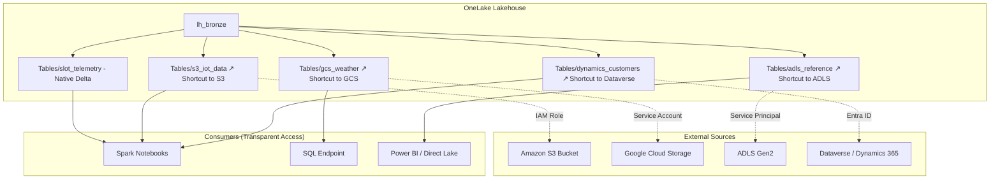
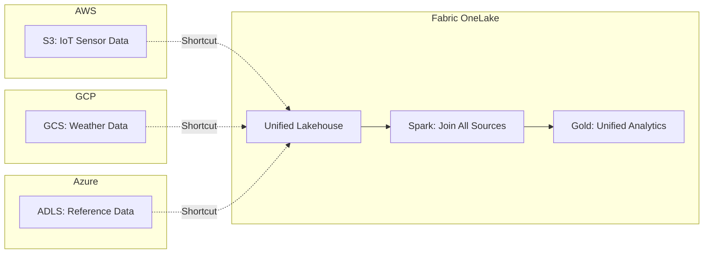
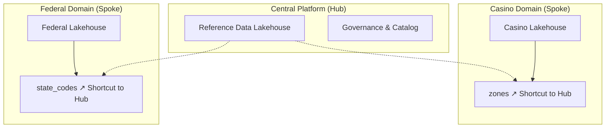
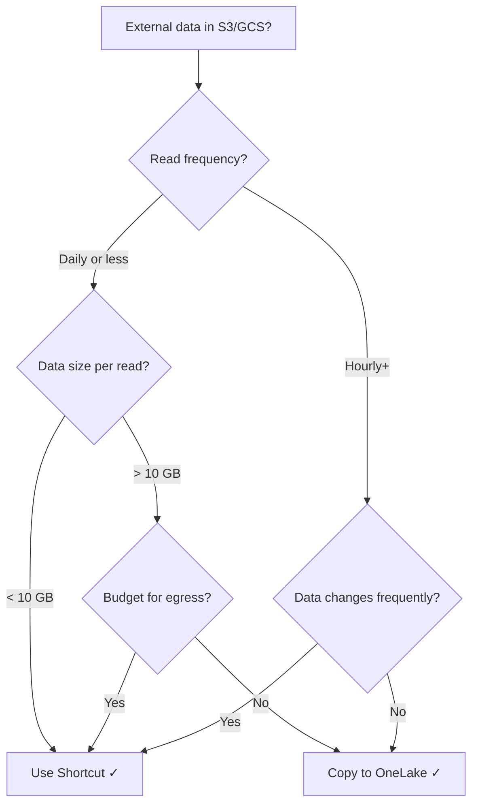
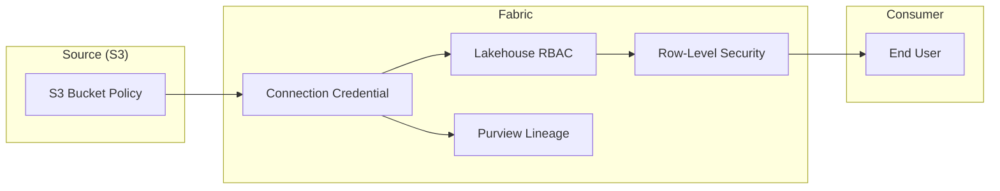
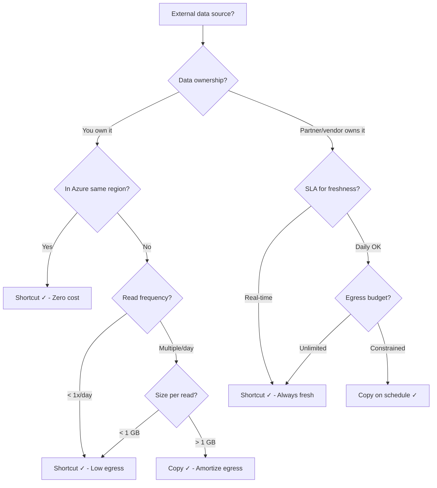

# 🔗 OneLake Shortcuts - Multi-Cloud Data Federation

<div align="center" markdown>

**Access S3, GCS, Dataverse, and ADLS Data Without Copying**


</div>

---

**Last Updated:** `2026-04-27` | **Version:** 1.0.0

---

!!! note "Third-party references — publicly sourced, good-faith comparison"
    This page references non-Microsoft products and services. That information is drawn from each vendor's **publicly available documentation** and is offered for honest, good-faith comparison only. This is a personal project written from a Microsoft Fabric and Azure perspective; it does **not** claim expertise in, or authority over, any third-party product, and nothing here is an official statement by, or endorsed by, those vendors. Capabilities, pricing, and features change often — always verify against the vendor's current official documentation. Where a third-party offering is the stronger choice, we say so plainly.

## Overview

OneLake shortcuts are symbolic links that make data stored in external locations appear as if it lives natively in a Fabric Lakehouse. They enable data federation across cloud providers and storage systems without physically copying data, reducing storage costs and eliminating ETL latency for read-heavy scenarios.

A shortcut is a metadata pointer -- when a Spark notebook, SQL query, or Power BI report reads from a shortcut path, OneLake transparently routes the request to the underlying storage, handles authentication, and returns the data as if it were local.

### Supported Sources

| Source Type | GA Status | Authentication | Use Case |
|-------------|-----------|----------------|----------|
| **OneLake (same tenant)** | GA | Workspace Identity | Cross-workspace federation |
| **ADLS Gen2** | GA | Service Principal, Key, SAS | Azure data lake federation |
| **Amazon S3** | GA | IAM Role, Access Key | Multi-cloud federation |
| **Google Cloud Storage** | GA | Service Account Key | Multi-cloud federation |
| **Dataverse** | GA | Entra ID (automatic) | Dynamics 365 / Power Platform data |
| **On-premises (gateway)** | Preview | Data Gateway | Hybrid cloud scenarios |

---

## Architecture



### How Shortcuts Work

1. **Create** a shortcut via UI or REST API, pointing to an external path
2. **Metadata registration** -- OneLake records the mapping (no data movement)
3. **Read access** -- queries against the shortcut path are transparently routed to the source
4. **Authentication** -- credentials (IAM role, SAS, service principal) are resolved at read time
5. **Caching** -- OneLake caches metadata (file listing) and optionally data blocks for performance

---

## Shortcut Types

### OneLake (Cross-Workspace)

```
Source: Another Lakehouse or Warehouse within the same Fabric tenant
Auth: Workspace Identity (automatic)
Format: Delta, Parquet, CSV
Use case: Shared reference data, cross-domain federation
```

### ADLS Gen2

```
Source: Azure Data Lake Storage Gen2 (any subscription/tenant)
Auth: Service Principal, Account Key, SAS Token
Format: Delta, Parquet, CSV, JSON
Use case: Existing Azure data lakes, partner data sharing
```

### Amazon S3

```
Source: S3 bucket in any AWS account
Auth: IAM Role (cross-account), Access Key + Secret
Format: Delta, Parquet, CSV, JSON
Use case: Multi-cloud analytics, AWS data federation
```

### Google Cloud Storage

```
Source: GCS bucket in any GCP project
Auth: Service Account Key (JSON)
Format: Delta, Parquet, CSV, JSON
Use case: Multi-cloud analytics, GCP data federation
```

### Dataverse

```
Source: Microsoft Dataverse environment (Dynamics 365, Power Platform)
Auth: Entra ID (automatic via org identity)
Format: Dataverse tables (auto-converted to Delta)
Use case: Dynamics 365 analytics, CRM data in Fabric
```

---

## Multi-Cloud Federation Patterns

### Pattern 1: Multi-Cloud Data Lake



### Pattern 2: Dataverse + External Enrichment

```python
# Notebook: Join Dynamics 365 customer data with external analytics

# Dataverse shortcut provides customer records
customers = spark.read.format("delta").load(
    "abfss://bronze@onelake.dfs.fabric.microsoft.com/lh_bronze.Lakehouse/Tables/dynamics_customers"
)

# S3 shortcut provides external behavioral data
behavior = spark.read.format("delta").load(
    "abfss://bronze@onelake.dfs.fabric.microsoft.com/lh_bronze.Lakehouse/Tables/s3_customer_behavior"
)

# Join without any data copying
enriched = customers.join(behavior, "customer_id", "left")
enriched.write.format("delta").mode("overwrite").save(
    "abfss://silver@onelake.dfs.fabric.microsoft.com/lh_silver.Lakehouse/Tables/enriched_customers"
)
```

### Pattern 3: Hub-and-Spoke Data Mesh



---

## Authentication per Source

### S3: IAM Role (Recommended)

```json
{
    "shortcutType": "AmazonS3",
    "source": {
        "location": "https://my-bucket.s3.us-east-1.amazonaws.com",
        "subpath": "/iot-data/2026/",
        "connection": {
            "connectionId": "s3-cross-account-connection"
        }
    }
}
```

IAM Trust Policy (in AWS):

```json
{
    "Version": "2012-10-17",
    "Statement": [
        {
            "Effect": "Allow",
            "Principal": {
                "AWS": "arn:aws:iam::FABRIC_AWS_ACCOUNT:role/OneLakeAccess"
            },
            "Action": "sts:AssumeRole",
            "Condition": {
                "StringEquals": {
                    "sts:ExternalId": "your-fabric-tenant-id"
                }
            }
        }
    ]
}
```

### GCS: Service Account

```json
{
    "shortcutType": "GoogleCloudStorage",
    "source": {
        "location": "https://storage.googleapis.com/my-bucket",
        "subpath": "/weather-data/",
        "connection": {
            "connectionId": "gcs-weather-connection"
        }
    }
}
```

### ADLS Gen2: Service Principal

```json
{
    "shortcutType": "AdlsGen2",
    "source": {
        "location": "https://mystorageaccount.dfs.core.windows.net",
        "subpath": "/container/reference-data/",
        "connection": {
            "connectionId": "adls-reference-connection"
        }
    }
}
```

### Dataverse: Automatic

```json
{
    "shortcutType": "Dataverse",
    "source": {
        "environmentDomain": "org12345.crm.dynamics.com",
        "tableName": "account",
        "deltaTimeTravel": true
    }
}
```

---

## Refresh Behavior and Caching

### Metadata vs Data

| Aspect | Behavior |
|--------|----------|
| **File listing (metadata)** | Cached for ~1 hour, refreshable |
| **File content** | Read-through on every query (no data caching by default) |
| **Delta log** | Cached, refreshed on query or manual refresh |
| **Schema** | Cached, refreshed when shortcut is updated |

### Refresh Triggers

```python
# Force metadata refresh programmatically
from notebookutils import mssparkutils

mssparkutils.lakehouse.refreshShortcut(
    lakehouse="lh_bronze",
    shortcut_name="s3_iot_data"
)
```

### Staleness Considerations

| Source | Typical Freshness | Notes |
|--------|-------------------|-------|
| OneLake shortcut | Near real-time | Same platform, no cross-network |
| ADLS Gen2 | ~1-5 minutes | Delta log polling |
| S3 | ~5-15 minutes | Cross-cloud metadata sync |
| GCS | ~5-15 minutes | Cross-cloud metadata sync |
| Dataverse | ~15-60 minutes | Dataverse sync cadence |

---

## Cost Implications

### Cross-Cloud Egress

| Scenario | Egress Cost | Mitigation |
|----------|-------------|------------|
| S3 → Fabric (Azure) | AWS egress: ~$0.09/GB | Place Fabric in same region as S3 |
| GCS → Fabric (Azure) | GCP egress: ~$0.12/GB | Consider data copy for heavy reads |
| ADLS → Fabric (same region) | Free | Best-case scenario |
| ADLS → Fabric (cross-region) | ~$0.02/GB | Co-locate resources |
| OneLake → OneLake | Free | Always free within tenant |

### Cost Decision Framework



### Monthly Cost Estimator

```python
def estimate_shortcut_cost(
    read_gb_per_day: float,
    source: str,
    days: int = 30
) -> dict:
    """Estimate monthly cost of shortcut vs copy."""
    egress_rates = {
        "s3": 0.09,      # USD per GB
        "gcs": 0.12,
        "adls_cross_region": 0.02,
        "adls_same_region": 0.0,
        "onelake": 0.0,
    }
    
    storage_rate = 0.023  # OneLake per GB/month (if copied)
    
    total_gb = read_gb_per_day * days
    egress_cost = total_gb * egress_rates.get(source, 0)
    copy_storage_cost = (read_gb_per_day * 1.5) * storage_rate  # Assume 1.5x for Delta overhead
    
    return {
        "shortcut_monthly_egress": round(egress_cost, 2),
        "copy_monthly_storage": round(copy_storage_cost, 2),
        "recommendation": "shortcut" if egress_cost < copy_storage_cost else "copy",
        "total_gb_read": total_gb
    }

# Example: 5 GB/day from S3
print(estimate_shortcut_cost(5, "s3"))
# {'shortcut_monthly_egress': 13.5, 'copy_monthly_storage': 0.17, 'recommendation': 'copy'}

# Example: 0.5 GB/day from S3
print(estimate_shortcut_cost(0.5, "s3"))
# {'shortcut_monthly_egress': 1.35, 'copy_monthly_storage': 0.02, 'recommendation': 'copy'}

# Example: 5 GB/day from ADLS same region
print(estimate_shortcut_cost(5, "adls_same_region"))
# {'shortcut_monthly_egress': 0, 'copy_monthly_storage': 0.17, 'recommendation': 'shortcut'}
```

---

## Security

### Row-Level Security Through Shortcuts

RLS defined on the Lakehouse or semantic model applies to shortcut data just as it does to native data. The key consideration: ensure the shortcut's authentication identity has sufficient access, while Fabric-level RLS restricts what end users see.

```python
# RLS is transparent to shortcuts
# If a Direct Lake model has RLS on zone_id,
# queries to shortcut tables are filtered the same way
```

### Credential Management

| Credential Type | Storage | Rotation |
|----------------|---------|----------|
| S3 Access Key | Fabric Connection | Manual (rotate every 90 days) |
| S3 IAM Role | AWS IAM | Automatic (STS tokens) |
| GCS Service Account | Fabric Connection | Manual (rotate key) |
| ADLS SAS Token | Fabric Connection | Set expiry, auto-renew |
| ADLS Service Principal | Entra ID | Certificate rotation |
| Dataverse | Entra ID (automatic) | Managed by platform |

### Governance



---

## Performance

### Query Pushdown

| Source | Predicate Pushdown | Column Pruning | Partition Pruning |
|--------|-------------------|----------------|-------------------|
| OneLake | Full | Full | Full |
| ADLS Gen2 (Delta) | Full | Full | Full |
| ADLS Gen2 (Parquet) | File-level | Full | Directory-based |
| S3 (Delta) | Full | Full | Full |
| S3 (Parquet) | File-level | Full | Directory-based |
| GCS (Delta) | Full | Full | Full |
| Dataverse | Limited | Full | No |

### Optimization Tips

```python
# 1. Always filter on partition columns first
df = spark.read.format("delta").load(shortcut_path) \
    .filter(F.col("date") == "2026-04-27")  # Partition pruning

# 2. Select only needed columns
df = df.select("machine_id", "bet_amount", "win_amount")  # Column pruning

# 3. For cross-cloud joins, broadcast the smaller table
from pyspark.sql.functions import broadcast
local_lookup = spark.read.format("delta").load(local_path)
result = df.join(broadcast(local_lookup), "lookup_key")

# 4. Cache shortcut data if reading multiple times
shortcut_df = spark.read.format("delta").load(shortcut_path).cache()
analysis_1 = shortcut_df.groupBy("zone").agg(F.sum("amount"))
analysis_2 = shortcut_df.groupBy("player").agg(F.avg("amount"))
shortcut_df.unpersist()
```

### Latency Benchmarks

| Source | First Read (Cold) | Subsequent Reads | 1 GB Scan |
|--------|-------------------|-------------------|-----------|
| OneLake native | ~2s | ~1s | ~5s |
| OneLake shortcut (same region) | ~3s | ~1.5s | ~6s |
| ADLS Gen2 shortcut | ~4s | ~2s | ~8s |
| S3 shortcut | ~6s | ~3s | ~15s |
| GCS shortcut | ~7s | ~4s | ~18s |
| Dataverse shortcut | ~8s | ~5s | ~25s |

---

## Decision Tree: Shortcut vs Copy



| Factor | Favor Shortcut | Favor Copy |
|--------|---------------|------------|
| **Freshness** | Need latest data | Daily/weekly OK |
| **Read frequency** | Low (< 5x/day) | High (100x+/day) |
| **Data size** | Small (< 1 GB per read) | Large (> 10 GB) |
| **Egress cost** | Same cloud/region (free) | Cross-cloud (expensive) |
| **Write access** | Read-only is fine | Need to modify data |
| **Governance** | Source manages lifecycle | Need full control |
| **Performance** | Acceptable latency | Need sub-second |

---

## REST API for Shortcuts

### Create a Shortcut

```python
import requests

base_url = "https://api.fabric.microsoft.com/v1"
workspace_id = "your-workspace-id"
lakehouse_id = "your-lakehouse-id"
token = "your-bearer-token"

headers = {
    "Authorization": f"Bearer {token}",
    "Content-Type": "application/json"
}

# Create an S3 shortcut
payload = {
    "name": "s3_iot_sensor_data",
    "path": "Tables",
    "target": {
        "amazonS3": {
            "location": "https://my-iot-bucket.s3.us-east-1.amazonaws.com",
            "subpath": "/sensor-data/2026/",
            "connectionId": "s3-connection-id"
        }
    }
}

response = requests.post(
    f"{base_url}/workspaces/{workspace_id}/lakehouses/{lakehouse_id}/shortcuts",
    headers=headers,
    json=payload
)
print(response.status_code, response.json())
```

### Create ADLS Gen2 Shortcut

```python
payload = {
    "name": "adls_reference_data",
    "path": "Tables",
    "target": {
        "adlsGen2": {
            "location": "https://refdata.dfs.core.windows.net",
            "subpath": "/reference/casino-zones/",
            "connectionId": "adls-connection-id"
        }
    }
}
```

### Create GCS Shortcut

```python
payload = {
    "name": "gcs_weather_observations",
    "path": "Tables",
    "target": {
        "googleCloudStorage": {
            "location": "https://storage.googleapis.com/noaa-weather-public",
            "subpath": "/observations/2026/",
            "connectionId": "gcs-connection-id"
        }
    }
}
```

### Create Dataverse Shortcut

```python
payload = {
    "name": "dynamics_customers",
    "path": "Tables",
    "target": {
        "dataverse": {
            "environmentDomain": "org12345.crm.dynamics.com",
            "tableName": "account"
        }
    }
}
```

### List All Shortcuts

```python
response = requests.get(
    f"{base_url}/workspaces/{workspace_id}/lakehouses/{lakehouse_id}/shortcuts",
    headers=headers
)

for shortcut in response.json()["value"]:
    print(f"  {shortcut['name']} → {shortcut['target']}")
```

### Delete a Shortcut

```python
response = requests.delete(
    f"{base_url}/workspaces/{workspace_id}/lakehouses/{lakehouse_id}/shortcuts/{shortcut_name}",
    headers=headers
)
```

---

## Casino Implementation

### Casino Shortcut Architecture

```python
# Shortcuts for the casino POC:

# 1. Cross-workspace reference data
#    Source: Central reference workspace → Casino workspace
shortcuts = [
    {
        "name": "ref_casino_zones",
        "source": "onelake://ref-workspace/ref-lakehouse/Tables/casino_zones"
    },
    {
        "name": "ref_game_types",
        "source": "onelake://ref-workspace/ref-lakehouse/Tables/game_type_mappings"
    },
]

# 2. Reading shortcut data in notebooks
zones = spark.read.format("delta").load(
    "abfss://bronze@onelake.dfs.fabric.microsoft.com/lh_bronze.Lakehouse/Tables/ref_casino_zones"
)
# Works identically to native tables
```

---

## Federal Agency Implementation

### Multi-Source Federal Shortcuts

```python
# NOAA weather data from GCS (public dataset)
noaa_shortcut = {
    "name": "noaa_ghcn_daily",
    "target": {
        "googleCloudStorage": {
            "location": "https://storage.googleapis.com/gcp-public-data-noaa",
            "subpath": "/ghcn-d/",
            "connectionId": "gcs-noaa-public"
        }
    }
}

# USDA data from S3 (USDA open data)
usda_shortcut = {
    "name": "usda_crop_data",
    "target": {
        "amazonS3": {
            "location": "https://usda-open-data.s3.amazonaws.com",
            "subpath": "/nass/crop-production/",
            "connectionId": "s3-usda-public"
        }
    }
}

# EPA AQS data from ADLS (Azure Open Datasets)
epa_shortcut = {
    "name": "epa_aqs_daily",
    "target": {
        "adlsGen2": {
            "location": "https://azureopendatastorage.dfs.core.windows.net",
            "subpath": "/epaaqsdaily/",
            "connectionId": "adls-azure-open"
        }
    }
}
```

### Reading Federal Shortcuts in Notebooks

```python
# In a federal bronze notebook, shortcut paths are transparent:
noaa_df = spark.read.format("parquet").load(
    "abfss://bronze@onelake.dfs.fabric.microsoft.com/lh_bronze.Lakehouse/Tables/noaa_ghcn_daily"
)

# Filter and process as if data were local
east_coast = noaa_df.filter(
    (F.col("longitude") > -85) & (F.col("longitude") < -65)
)

print(f"East Coast weather observations: {east_coast.count()}")
```

---

## Limitations

| Limitation | Details | Workaround |
|------------|---------|------------|
| **Write-through** | Cannot write to shortcuts (read-only) | Write to native tables, use shortcuts for reads |
| **File format** | Source must be Delta, Parquet, CSV, or JSON | Convert source data before creating shortcut |
| **Cross-tenant** | Cannot shortcut to another Entra tenant's OneLake | Use ADLS shortcut with service principal |
| **Max shortcuts** | ~1000 shortcuts per Lakehouse | Organize into multiple Lakehouses |
| **Nested shortcuts** | Cannot create a shortcut to a shortcut | Shortcut directly to the original source |
| **Delta time travel** | Limited to source's Delta log retention | Set appropriate log retention on source |
| **Direct Lake** | Shortcuts to non-Delta formats may cause Direct Lake fallback | Ensure source data is Delta format |
| **Latency** | Cross-cloud reads add 3-15s latency | Use copy for latency-sensitive workloads |

---

## References

- [OneLake shortcuts overview](https://learn.microsoft.com/en-us/fabric/onelake/onelake-shortcuts)
- [Create S3 shortcuts](https://learn.microsoft.com/en-us/fabric/onelake/create-s3-shortcut)
- [Create GCS shortcuts](https://learn.microsoft.com/en-us/fabric/onelake/create-gcs-shortcut)
- [Create ADLS Gen2 shortcuts](https://learn.microsoft.com/en-us/fabric/onelake/create-adls-shortcut)
- [Dataverse shortcuts](https://learn.microsoft.com/en-us/fabric/onelake/create-dataverse-shortcut)
- [OneLake shortcuts REST API](https://learn.microsoft.com/en-us/rest/api/fabric/core/onelake-shortcuts)
- [Shortcut security model](https://learn.microsoft.com/en-us/fabric/onelake/onelake-shortcuts#security)
