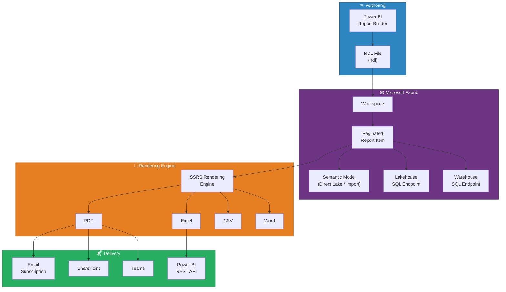
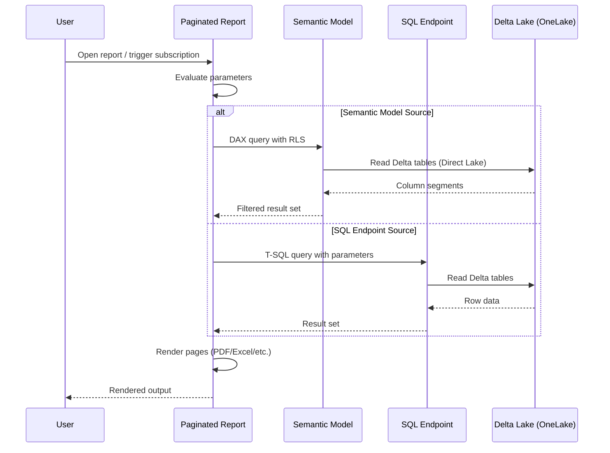
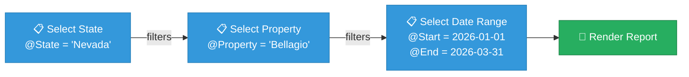
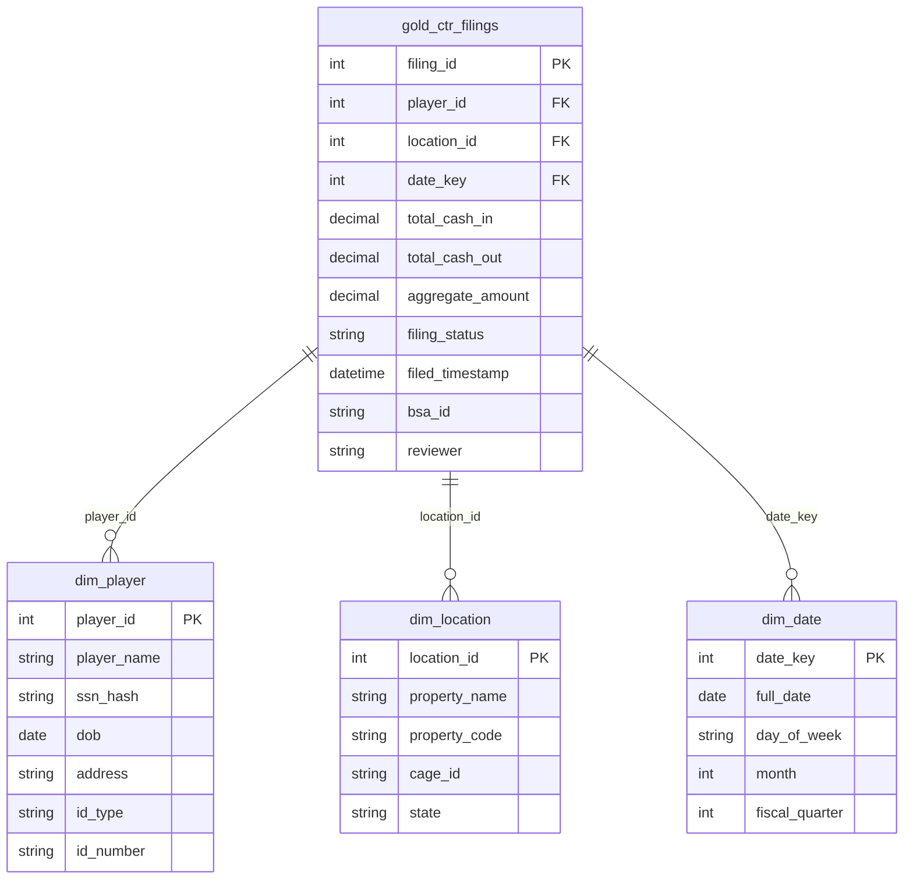
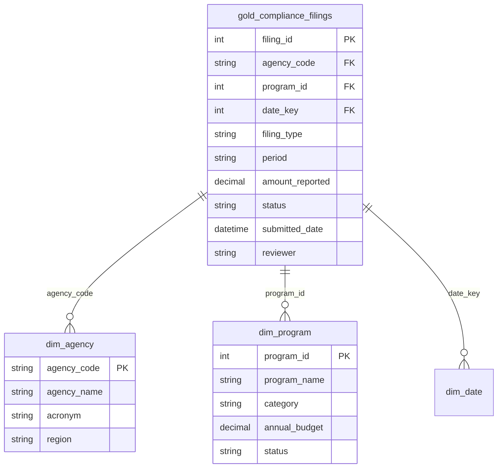
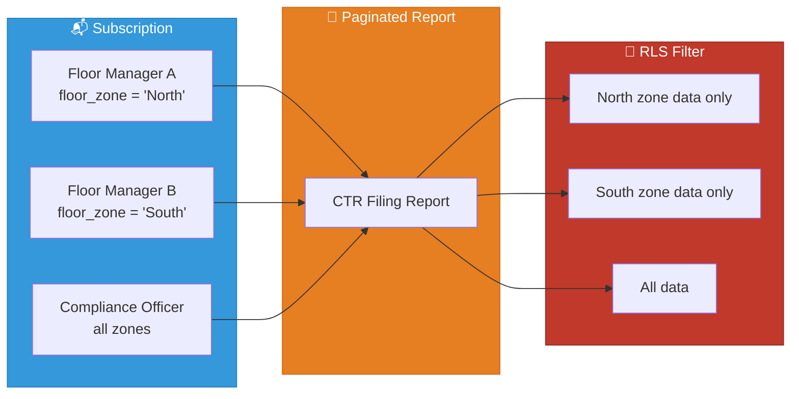

[Home](../index.md) > [Docs](../) > [Features](./) > Paginated Reports

# 🖨️ Paginated Reports - Pixel-Perfect Enterprise Reporting

<div align="center">

**Pixel-Perfect, Print-Ready Reports for Compliance Filings, Regulatory Submissions, and Operational Exports**


</div>

---

**Last Updated:** `2026-04-21` | **Version:** 1.0.0

---

## 📑 Table of Contents

- [🎯 Overview](#-overview)
- [🏗️ Architecture](#️-architecture)
- [⚙️ Authoring with Report Builder](#️-authoring-with-report-builder)
- [🔌 Data Sources in Fabric](#-data-sources-in-fabric)
- [📐 Parameters and Subreports](#-parameters-and-subreports)
- [📤 Export Formats and Subscriptions](#-export-formats-and-subscriptions)
- [🎰 Casino Implementation](#-casino-implementation)
- [🏛️ Federal Agency Implementation](#️-federal-agency-implementation)
- [🔐 Security and RLS](#-security-and-rls)
- [⚠️ Limitations](#️-limitations)
- [📚 References](#-references)
- [🔗 Related Documents](#-related-documents)

---

## 🎯 Overview

Paginated Reports in Microsoft Fabric deliver pixel-perfect, print-optimized reports designed for scenarios where precise layout control, multi-page rendering, and regulatory-compliant formatting are non-negotiable. Unlike interactive Power BI reports that are designed for on-screen exploration, paginated reports are designed for **printing and export** — every header, footer, page break, and table cell renders exactly where the author placed it.

### Why Paginated Reports Matter

Interactive Power BI dashboards excel at exploration but fall short when the output must match a regulatory form, print on letter-size paper, or render a 500-page transaction listing. Paginated reports fill this gap.

### Key Capabilities

| Capability | Description |
|-----------|-------------|
| **Pixel-Perfect Layout** | Fixed-position elements render identically on screen, PDF, and paper |
| **Multi-Page Tables** | Tables flow across pages with repeating headers and footers |
| **Parameters** | User-selectable filters that drive query-time data retrieval |
| **Subreports** | Embed reports within reports for master-detail patterns |
| **Export Formats** | PDF, Excel, Word, CSV, XML, MHTML, TIFF |
| **Subscriptions** | Scheduled delivery to email, SharePoint, or Teams |
| **RDL Standard** | Report Definition Language — open XML format authored in Report Builder |
| **RLS Enforcement** | Row-Level Security from the semantic model is enforced at render time |

### Paginated vs Interactive Reports

| Aspect | Interactive (Power BI) | Paginated (RDL) |
|--------|----------------------|-----------------|
| **Primary Use** | On-screen exploration and drill-down | Print, export, and regulatory filing |
| **Layout** | Responsive, adapts to screen size | Fixed, pixel-perfect at every resolution |
| **Data Volume** | Optimized for summarized aggregates | Handles detail-level, multi-page listings |
| **Interactivity** | Slicers, cross-filtering, drill-through | Parameter-driven; static once rendered |
| **Page Control** | Single scrollable canvas | Explicit page breaks, headers, footers |
| **Best For** | Dashboards, KPIs, ad-hoc analysis | Forms, statements, compliance filings |

---

## 🏗️ Architecture

### How Paginated Reports Work in Fabric



### Data Source Connection Flow



---

## ⚙️ Authoring with Report Builder

### Getting Started

Power BI Report Builder is the desktop application for authoring paginated reports. It produces `.rdl` files (Report Definition Language) that are uploaded to Fabric workspaces.

### RDL Structure

```
Report (.rdl)
├── Data Sources
│   ├── Lakehouse SQL Endpoint
│   ├── Warehouse SQL Endpoint
│   └── Semantic Model (DAX)
├── Datasets
│   ├── Dataset 1 (T-SQL query)
│   ├── Dataset 2 (DAX query)
│   └── Dataset 3 (stored procedure)
├── Parameters
│   ├── @StartDate (Date)
│   ├── @EndDate (Date)
│   └── @PropertyCode (String, multi-value)
├── Report Body
│   ├── Page Header (logo, title, date)
│   ├── Table / Matrix / List regions
│   ├── Subreports
│   ├── Charts
│   └── Page Footer (page number, disclaimer)
└── Properties
    ├── Page Size (Letter / A4 / Legal)
    ├── Margins
    └── Orientation (Portrait / Landscape)
```

### Dataset Query Examples

**T-SQL against Lakehouse SQL Endpoint:**

```sql
SELECT
    t.transaction_id,
    t.transaction_date,
    t.amount,
    t.transaction_type,
    p.player_name,
    p.loyalty_tier,
    l.property_name
FROM lh_gold.gold_transactions AS t
JOIN lh_gold.dim_player AS p ON t.player_id = p.player_id
JOIN lh_gold.dim_location AS l ON t.location_id = l.location_id
WHERE t.transaction_date BETWEEN @StartDate AND @EndDate
    AND (@PropertyCode IS NULL OR l.property_code IN (@PropertyCode))
ORDER BY t.transaction_date DESC
```

**DAX against Semantic Model:**

```dax
EVALUATE
ADDCOLUMNS(
    FILTER(
        gold_compliance_summary,
        gold_compliance_summary[filing_date] >= @StartDate
        && gold_compliance_summary[filing_date] <= @EndDate
        && gold_compliance_summary[filing_type] = "CTR"
    ),
    "Player Name", RELATED(dim_player[player_name]),
    "Property", RELATED(dim_location[property_name])
)
ORDER BY gold_compliance_summary[filing_date] DESC
```

---

## 📐 Parameters and Subreports

### Parameter Types

| Type | Use Case | Example |
|------|----------|---------|
| **Text** | Filter by code or identifier | Property Code, Agency Code |
| **Integer** | Numeric thresholds | Minimum Amount = 10000 |
| **Date/DateTime** | Date range selection | Start Date, End Date |
| **Boolean** | Toggle sections on/off | Include PII = True/False |
| **Multi-Value** | Select multiple items from a list | Property Codes = ['LV01', 'AC02'] |
| **Cascading** | Second parameter depends on first | State → County → City |

### Cascading Parameter Example



### Subreport Pattern: Master-Detail

A master report lists summary rows, and each row embeds a subreport showing transaction details:

```
Master Report: Daily Cage Reconciliation
├── Property Header (name, date, manager)
├── Summary Table
│   ├── Row: Cage 1 | Opening $500K | Closing $485K | Variance -$15K
│   │   └── [Subreport: Cage 1 Transaction Detail]
│   ├── Row: Cage 2 | Opening $300K | Closing $312K | Variance +$12K
│   │   └── [Subreport: Cage 2 Transaction Detail]
│   └── Row: Cage 3 | Opening $750K | Closing $748K | Variance -$2K
│       └── [Subreport: Cage 3 Transaction Detail]
└── Footer: Grand Total | Variance Summary | Signatures
```

---

## 📤 Export Formats and Subscriptions

### Export Format Comparison

| Format | Best For | Preserves Layout | Multi-Page | Editable |
|--------|----------|-----------------|------------|----------|
| **PDF** | Regulatory filing, archival | ✅ Yes | ✅ Yes | ❌ No |
| **Excel** | Data analysis, pivot tables | ⚠️ Partial | ✅ Yes | ✅ Yes |
| **Word** | Narrative reports, editing | ⚠️ Partial | ✅ Yes | ✅ Yes |
| **CSV** | Data integration, ETL | ❌ No | ❌ No | ✅ Yes |
| **XML** | Machine-readable exchange | ❌ No | N/A | ✅ Yes |
| **MHTML** | Web archival | ✅ Yes | ✅ Yes | ❌ No |
| **TIFF** | Image archival, faxing | ✅ Yes | ✅ Yes | ❌ No |

### Subscription Configuration

```
Workspace → Paginated Report → Subscribe
├── Schedule
│   ├── Frequency: Daily / Weekly / Monthly
│   ├── Time: 06:00 AM EST
│   └── Time Zone: Eastern Time
├── Parameters (locked for subscription)
│   ├── @StartDate = Yesterday
│   └── @EndDate = Yesterday
├── Format: PDF
├── Recipients
│   ├── compliance-team@casino.com
│   ├── cage-manager@casino.com
│   └── SharePoint: /sites/Compliance/Reports/
└── Subject: "Daily CTR Filing Report - {date}"
```

### Power BI REST API Export

```python
import requests

# Export paginated report via REST API
url = "https://api.powerbi.com/v1.0/myorg/groups/{workspace_id}/reports/{report_id}/ExportTo"

payload = {
    "format": "PDF",
    "paginatedReportConfiguration": {
        "parameterValues": [
            {"name": "StartDate", "value": "2026-04-01"},
            {"name": "EndDate", "value": "2026-04-15"},
            {"name": "PropertyCode", "value": "LV01"}
        ]
    }
}

response = requests.post(url, json=payload, headers={"Authorization": f"Bearer {token}"})
export_id = response.json()["id"]
```

---

## 🎰 Casino Implementation

### CTR Filing Report (Currency Transaction Report)

Federal law (31 CFR 1021) requires casinos to file a CTR for any cash transaction exceeding $10,000 in a single gaming day. This paginated report generates the FinCEN-compliant form.

#### Data Model



#### Report Layout

```
┌──────────────────────────────────────────────────┐
│ LOGO    CURRENCY TRANSACTION REPORT       Page 1 │
│         FinCEN Form 103 - Casino                  │
│         Filing Date: 2026-04-15                   │
├──────────────────────────────────────────────────┤
│ Part I — Person Involved in Transaction           │
│ Name: [player_name]    DOB: [dob]                │
│ SSN: [masked_ssn]      ID: [id_type] [id_number] │
│ Address: [address]                                │
├──────────────────────────────────────────────────┤
│ Part II — Amount and Type of Transaction          │
│ Cash In:  $12,500.00   Cash Out: $0.00           │
│ Aggregate: $12,500.00                            │
│ Transaction Type: [Slot Play / Table Game / Cage] │
├──────────────────────────────────────────────────┤
│ Part III — Casino Information                     │
│ Property: [property_name]  EIN: [ein]            │
│ Address: [property_address]                       │
│ Filed By: [reviewer]  BSA ID: [bsa_id]           │
├──────────────────────────────────────────────────┤
│ Page 1 of 1  |  Generated: 2026-04-15 06:00 EST  │
└──────────────────────────────────────────────────┘
```

### W-2G Withholding Report

IRS Form W-2G is required for certain gambling winnings. Thresholds: $1,200 (slots), $600 (keno at 300:1+), $5,000 (poker tournament).

```sql
-- W-2G Dataset Query
SELECT
    w.form_id,
    w.gaming_date,
    w.win_amount,
    w.federal_withholding,
    w.state_withholding,
    w.game_type,
    p.player_name,
    p.ssn_hash,
    p.address,
    l.property_name,
    l.ein
FROM lh_gold.gold_w2g_filings AS w
JOIN lh_gold.dim_player AS p ON w.player_id = p.player_id
JOIN lh_gold.dim_location AS l ON w.location_id = l.location_id
WHERE w.gaming_date BETWEEN @StartDate AND @EndDate
    AND w.win_amount >= CASE
        WHEN w.game_type = 'Slots' THEN 1200
        WHEN w.game_type = 'Keno' THEN 600
        WHEN w.game_type = 'Poker' THEN 5000
        ELSE 600
    END
ORDER BY w.gaming_date, w.form_id
```

### Daily Cage Reconciliation Report

A pixel-perfect daily reconciliation showing opening and closing balances by cage, with variance analysis and supervisor sign-off lines.

### Player Activity Statement

Monthly statement mailed to loyalty program members showing session history, comps earned, and win/loss summary. Parameters: `@PlayerID`, `@StatementMonth`.

---

## 🏛️ Federal Agency Implementation

### Regulatory Compliance Filing Report

A multi-agency compliance report template that generates standardized filings for regulatory submissions.

#### Data Model



### Grant Disbursement Report (SBA)

A paginated report listing all Small Business Administration grant disbursements for a given fiscal quarter, with subtotals by program and state.

```sql
-- SBA Grant Disbursement Dataset
SELECT
    g.disbursement_id,
    g.disbursement_date,
    g.amount,
    g.program_name,
    b.business_name,
    b.state,
    b.naics_code,
    b.employee_count,
    g.status
FROM lh_gold.gold_sba_disbursements AS g
JOIN lh_gold.dim_sba_business AS b ON g.business_id = b.business_id
WHERE g.fiscal_quarter = @FiscalQuarter
    AND g.fiscal_year = @FiscalYear
    AND (@State IS NULL OR b.state IN (@State))
ORDER BY b.state, g.program_name, g.disbursement_date
```

#### Report Features

| Feature | Implementation |
|---------|---------------|
| **Group by State** | Row group with state subtotals and page breaks |
| **Program Subtotals** | Nested group within state showing program-level aggregates |
| **Running Total** | Cumulative disbursement amount across pages |
| **Cover Page** | Agency logo, fiscal period, total disbursed, report ID |
| **Signature Block** | Program officer name, date, and sign-off line |

### USDA Crop Production Summary

A quarterly report summarizing crop production statistics by state and commodity, exported as PDF for distribution to congressional committees.

### EPA Facility Inspection Report

A per-facility inspection report with findings, violation history, and corrective action timelines, rendered as a multi-page PDF with subreports for each inspection event.

---

## 🔐 Security and RLS

### RLS Enforcement in Paginated Reports

Row-Level Security defined on the semantic model is enforced when a paginated report connects to a semantic model data source. Each subscription renders with the recipient's identity, ensuring users only see their authorized data.



### Security Best Practices

| Practice | Description |
|----------|-------------|
| **Use semantic model sources** | Prefer semantic model connections over direct SQL to inherit RLS automatically |
| **Mask PII in exports** | Use expression-based masking for SSN, card numbers in exported PDFs |
| **Secure subscriptions** | Only authorized recipients should receive compliance reports |
| **Audit export activity** | Track who exports which reports and in what format |
| **Parameter validation** | Prevent SQL injection by using parameterized queries, never string concatenation |

---

## ⚠️ Limitations

| Limitation | Details | Workaround |
|-----------|---------|-----------|
| **No Direct Lake datasets (direct)** | Paginated reports cannot use Direct Lake as a direct data source | Connect via the semantic model or Lakehouse SQL endpoint |
| **Limited interactivity** | No slicers, cross-filtering, or drill-through | Use parameters for filtering; link to interactive reports for exploration |
| **Report Builder required** | No web-based authoring; requires desktop Report Builder | Install Report Builder on developer machines; use version control for .rdl files |
| **Subscription limits** | Maximum 24 subscriptions per report in shared capacity | Use Premium/Fabric capacity for higher limits; batch via REST API |
| **Large report rendering** | Reports with 10,000+ pages may timeout | Partition by parameter (e.g., one property per render); parallelize via API |
| **No real-time data** | Data reflects last refresh or query execution time | Accept near-real-time; schedule subscriptions after ETL completion |
| **Visual limitations** | Fewer chart types than interactive Power BI | Use embedded images or custom visuals for complex charts |
| **Mobile experience** | Not optimized for mobile viewing | Export as PDF; use interactive reports for mobile scenarios |

---

## 📚 References

| Resource | URL |
|----------|-----|
| Paginated Reports in Fabric | https://learn.microsoft.com/fabric/paginated-reports/paginated-reports-report-builder-power-bi |
| Power BI Report Builder | https://learn.microsoft.com/power-bi/paginated-reports/report-builder-power-bi |
| Paginated Report Data Sources | https://learn.microsoft.com/power-bi/paginated-reports/paginated-reports-data-sources |
| Parameters in Paginated Reports | https://learn.microsoft.com/power-bi/paginated-reports/parameters/report-builder-parameters |
| Subscriptions for Paginated Reports | https://learn.microsoft.com/power-bi/consumer/paginated-reports-subscriptions |
| Export Paginated Reports via REST API | https://learn.microsoft.com/power-bi/developer/embedded/export-paginated-report |
| RLS with Paginated Reports | https://learn.microsoft.com/power-bi/paginated-reports/paginated-reports-row-level-security |

---

## 🔗 Related Documents

- [Direct Lake](direct-lake.md) -- Semantic model connectivity for paginated data sources
- [Composite Models](composite-models.md) -- Mixing storage modes for paginated report data
- [Scorecards & Metrics](scorecards-metrics.md) -- KPI tracking complement to paginated reporting
- [Fabric IQ](fabric-iq.md) -- Natural language queries for ad-hoc analysis
- [OneLake Security](onelake-security.md) -- Storage-level security for underlying data
- [Architecture](../ARCHITECTURE.md) -- System architecture overview
- [Security](../SECURITY.md) -- Security and compliance framework

---

> 📝 **Document Metadata**
> - **Author**: Documentation Team
> - **Reviewers**: Data Engineering, BI Team, Compliance
> - **Classification**: Internal
> - **Next Review**: 2026-07-21
