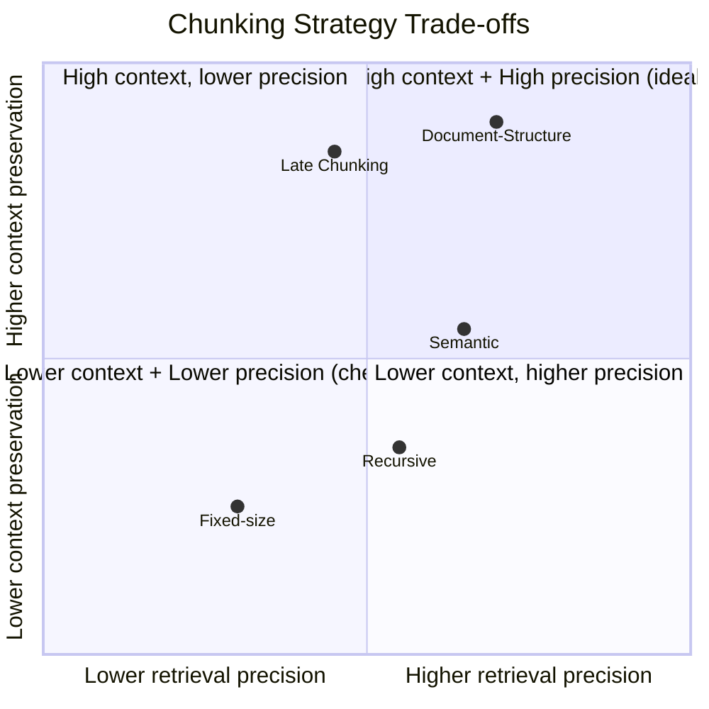
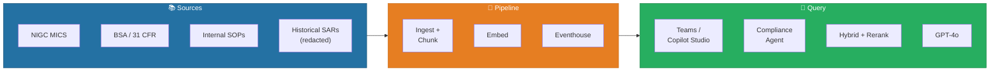

# 🔎 RAG Patterns Deep Dive — Production Retrieval-Augmented Generation on Fabric

<div align="center" markdown>

**Beyond Demo-Grade RAG — Chunking, Embedding, Hybrid Retrieval, Reranking, and Evaluation**


</div>

---

**Last Updated:** `2026-04-27` | **Version:** 1.0.0 | **Wave 2 Feature:** 2.6

---

!!! note "Third-party references — publicly sourced, good-faith comparison"
    This page references non-Microsoft products and services. That information is drawn from each vendor's **publicly available documentation** and is offered for honest, good-faith comparison only. This is a personal project written from a Microsoft Fabric and Azure perspective; it does **not** claim expertise in, or authority over, any third-party product, and nothing here is an official statement by, or endorsed by, those vendors. Capabilities, pricing, and features change often — always verify against the vendor's current official documentation. Where a third-party offering is the stronger choice, we say so plainly.

---

## 🎯 Overview

Retrieval-Augmented Generation (RAG) grounds an LLM's response in a curated corpus of your own documents. Instead of relying solely on the model's parametric knowledge, RAG **retrieves** relevant passages from a vector store at query time and **augments** the prompt with that context, letting the model **generate** an answer that cites real sources. RAG is the dominant pattern for enterprise AI assistants because it produces fewer hallucinations, supports citations, respects access control, and stays current as documents change — all without retraining the model.

This document goes beyond the basic "embed your PDFs, run cosine similarity, stuff into a prompt" tutorials. It covers the full production stack: chunking strategies that preserve meaning, hybrid retrieval that beats pure vector search, reranking that fixes the top-K, generation strategies for long contexts, and evaluation harnesses (Ragas, MRR, nDCG) that turn RAG from a demo into a measurable system.

### When to Use RAG

| Scenario | Use RAG | Use Fine-Tuning | Use Plain Prompting |
|----------|---------|-----------------|---------------------|
| **Knowledge changes frequently** (policies, prices, regulations) | ✅ Yes | ❌ No (retraining needed each change) | ❌ Stale |
| **Need citations and provenance** | ✅ Yes (chunk IDs are first-class) | ⚠️ Hard (knowledge baked in) | ❌ No source |
| **Per-tenant or per-user data isolation** | ✅ Yes (filter at retrieval time) | ❌ One model per tenant — expensive | ❌ Not isolated |
| **Teach the model a new style or format** | ❌ No | ✅ Yes | ⚠️ Limited |
| **Specialized vocabulary, domain jargon** | ⚠️ Partial (helps with facts) | ✅ Yes (helps with idiom) | ❌ Often wrong |
| **Compliance: must answer only from approved corpus** | ✅ Yes (closed-book mode) | ⚠️ Hard to constrain | ❌ Open-ended |
| **Fast iteration on knowledge base** | ✅ Yes (re-index, no retrain) | ❌ Slow (retrain cycle) | ❌ Hard-coded |
| **Cost per query at scale** | ⚠️ Moderate (retrieval + LLM) | ⚠️ Low inference, high training | ✅ Lowest |

> 📝 **Rule of thumb:** If the answer should change when a document changes, use RAG. If you need to teach the model *how* to write rather than *what* to know, fine-tune. Most enterprise assistants want both — RAG for facts, light fine-tuning for tone.

### Key Building Blocks

| Component | Role | Common Choices |
|-----------|------|----------------|
| **Chunker** | Splits documents into retrievable units | Recursive, semantic, document-structure |
| **Embedder** | Maps text → dense vector | text-embedding-3-small/large, BGE, E5 |
| **Vector Store** | Persists vectors with metadata, supports ANN search | Eventhouse Vector16, AI Search, pgvector |
| **Retriever** | Returns candidate chunks for a query | Cosine, BM25, hybrid (RRF) |
| **Reranker** | Reorders top-N candidates by true relevance | Cross-encoder, Cohere Rerank, LLM-judge |
| **Generator** | Produces final answer from retrieved context | GPT-4o, GPT-4o-mini, Claude Sonnet |
| **Evaluator** | Measures retrieval and generation quality | Ragas, MRR, nDCG, LLM-as-judge |

---

## 🏗️ Reference Architecture

### End-to-End RAG Pipeline

```mermaid
flowchart LR
    subgraph Ingest["📥 Ingestion"]
        DOC["📄 Documents<br/>PDF, DOCX, HTML, MD"]
        PARSE["🔧 Parser<br/>Extract Text + Structure"]
        CHUNK["✂️ Chunker<br/>Split into Passages"]
    end

    subgraph Index["🧬 Indexing"]
        EMB["🤖 Embedder<br/>text-embedding-3-large"]
        BRZ[("🥉 Bronze<br/>Raw Chunks")]
        SLV[("🥈 Silver<br/>Embedded Chunks")]
        EH[("⚡ Eventhouse<br/>Vector16 + BM25")]
    end

    subgraph Query["🔍 Query Path"]
        Q["❓ User Query"]
        QE["🤖 Query Embedder"]
        VEC["📐 Vector Search<br/>Cosine"]
        BM["🔤 BM25 Search<br/>Keyword"]
        RRF["⚗️ RRF Fusion"]
        RR["🏆 Cross-Encoder<br/>Reranker"]
    end

    subgraph Generate["✨ Generation"]
        CTX["📑 Context<br/>Top-K Chunks"]
        LLM["🧠 LLM<br/>GPT-4o"]
        ANS["💬 Answer<br/>+ Citations"]
    end

    subgraph Observe["📈 Observability"]
        LOG["📝 Query Log"]
        EVAL["📏 Ragas<br/>Evaluator"]
    end

    DOC --> PARSE --> CHUNK --> BRZ
    BRZ --> EMB --> SLV --> EH

    Q --> QE --> VEC
    Q --> BM
    EH --> VEC
    EH --> BM
    VEC --> RRF
    BM --> RRF
    RRF --> RR --> CTX --> LLM --> ANS

    ANS --> LOG --> EVAL

    style Ingest fill:#2471A3,stroke:#1A5276,color:#fff
    style Index fill:#E67E22,stroke:#CA6F1E,color:#fff
    style Query fill:#6C3483,stroke:#4A235A,color:#fff
    style Generate fill:#27AE60,stroke:#1E8449,color:#fff
    style Observe fill:#7B241C,stroke:#641E16,color:#fff
```



### Why Hybrid Retrieval?

Pure vector search misses **lexical matches** — exact identifiers, codes, acronyms, and rare terms. Pure BM25 misses **semantic matches** — paraphrases, synonyms, and conceptual overlap. Production RAG fuses both via **Reciprocal Rank Fusion (RRF)**, which consistently outperforms either alone in benchmarks (BEIR, MS MARCO, MTEB).

| Query Type | Vector Wins | BM25 Wins | Hybrid Wins |
|------------|-------------|-----------|-------------|
| "How do I file a CTR?" | ✅ Semantic intent | ⚠️ Match "CTR" only | ✅ Best |
| "31 CFR 1010.311" | ❌ Vague | ✅ Exact code | ✅ Best |
| "Patron deposited 9500 cash" | ⚠️ OK | ✅ Exact amount | ✅ Best |
| "What is structuring?" | ✅ Definition | ⚠️ Limited | ✅ Best |

### Eventhouse as the Primary Store

Eventhouse with Vector16 encoding is our default vector store on Fabric because it co-locates structured filters (date, doc type, tenant) with vector similarity in a single KQL query, avoiding the cross-system joins that arise when a standalone, external vector database sits alongside the analytics store. Dedicated vector databases remain a strong choice in many architectures — pick the store that best fits your stack. See [Eventhouse Vector Database](eventhouse-vector-database.md) for the storage primitives.

---

## ✂️ Chunking Strategies

Chunking determines what the retriever can find. Too large → diluted embeddings, irrelevant context floods the prompt. Too small → lost coreference and context. The right strategy depends on document structure and query patterns.

### Strategy Comparison

| Strategy | How It Works | Pros | Cons | Best For |
|----------|--------------|------|------|----------|
| **Fixed-Size (chars)** | Slice every N characters | Simple, fast | Breaks sentences, hurts retrieval | Quick prototypes only |
| **Fixed-Size (tokens)** | Slice every N tokens with overlap | Predictable embedding cost | Still cuts mid-thought | Uniform content, transcripts |
| **Recursive Splitting** | Split by ¶ → sentence → word until ≤ N tokens | Respects structure, simple | Can still split semantic units | General-purpose default |
| **Semantic Chunking** | Split where adjacent sentence embeddings diverge | Preserves topical coherence | 5-10× slower at ingest | High-value corpora, long docs |
| **Document-Structure** | Split by headers (H1/H2/H3), tables, sections | Mirrors author intent | Requires structured input | Markdown, DOCX, HTML |
| **Sliding Window** | Overlapping windows (e.g., 512 tokens, 64 overlap) | Reduces boundary loss | Higher storage (1.1-1.3×) | Q&A over narrative text |
| **Late Chunking** | Embed full doc, then pool over spans | Each chunk has full-doc context | Requires long-context embedder | Legal, scientific, contracts |
| **Parent-Child** | Embed small child chunks, return larger parent | Precise retrieval, rich context | Two-tier index complexity | Compliance, runbooks |

### Concrete Sizes — What Works in Practice

| Content Type | Chunk Size | Overlap | Strategy |
|--------------|-----------|---------|----------|
| Policy / regulation | 400-600 tokens | 50-100 | Document-structure → recursive |
| Runbook / SOP | 200-400 tokens | 50 | Document-structure (per step) |
| Q&A pairs / FAQs | 150-300 tokens | 0 | One Q+A per chunk |
| Long narrative (legal, scientific) | 600-1000 tokens | 100-150 | Late chunking or semantic |
| Code / API docs | 250-500 tokens | 0 | Function/class boundaries |
| Transcripts | 300-500 tokens | 50 | Time-windowed |
| Tables | Per-row or per-table | 0 | Serialize to text + metadata |

### Trade-Off Triangle



### Recursive Splitting — Reference Implementation

```python
# Databricks notebook source
# COMMAND ----------
# MAGIC %md
# MAGIC ## Recursive Chunking with Token-Aware Boundaries

# COMMAND ----------

import tiktoken
from typing import List

ENC = tiktoken.encoding_for_model("text-embedding-3-large")

def recursive_chunk(
    text: str,
    max_tokens: int = 500,
    overlap_tokens: int = 50,
    separators: List[str] = None
) -> List[str]:
    """
    Recursively split text on a hierarchy of separators until each chunk
    is under max_tokens. Adds overlap to reduce boundary loss.
    """
    if separators is None:
        separators = ["\n\n", "\n", ". ", " ", ""]

    def _count(t: str) -> int:
        return len(ENC.encode(t))

    if _count(text) <= max_tokens:
        return [text]

    # Try each separator until we get small-enough pieces
    for sep in separators:
        if sep == "":
            # Last resort: hard split at token boundary
            tokens = ENC.encode(text)
            return [
                ENC.decode(tokens[i:i + max_tokens])
                for i in range(0, len(tokens), max_tokens - overlap_tokens)
            ]
        parts = text.split(sep)
        if len(parts) > 1:
            # Greedily pack parts into chunks under max_tokens
            chunks, current = [], ""
            for part in parts:
                candidate = current + (sep if current else "") + part
                if _count(candidate) <= max_tokens:
                    current = candidate
                else:
                    if current:
                        chunks.append(current)
                    if _count(part) > max_tokens:
                        # Recurse on oversized part
                        chunks.extend(
                            recursive_chunk(part, max_tokens, overlap_tokens, separators)
                        )
                        current = ""
                    else:
                        current = part
            if current:
                chunks.append(current)
            # Add overlap by prepending tail of previous chunk
            return _add_overlap(chunks, overlap_tokens)
    return [text]

def _add_overlap(chunks: List[str], overlap_tokens: int) -> List[str]:
    if overlap_tokens <= 0 or len(chunks) <= 1:
        return chunks
    result = [chunks[0]]
    for prev, curr in zip(chunks[:-1], chunks[1:]):
        prev_tokens = ENC.encode(prev)
        tail = ENC.decode(prev_tokens[-overlap_tokens:])
        result.append(tail + " " + curr)
    return result
```

> 💡 **Tip:** Always include the **document title** and **section heading** at the top of each chunk before embedding. This single change typically lifts recall@10 by 3-7% because the embedder gets contextual signal it would otherwise miss.

---

## 🧬 Embedding Models

The embedding model determines retrieval ceiling. Choose carefully — switching models means re-embedding the entire corpus.

### Model Comparison (April 2026)

| Model | Provider | Dimensions | Max Tokens | Cost / 1M Tokens | MTEB Score | Notes |
|-------|----------|-----------|-----------|------------------|-----------|-------|
| `text-embedding-3-small` | Azure OpenAI | 1536 | 8191 | $0.02 | 62.3 | Default for most use cases |
| `text-embedding-3-large` | Azure OpenAI | 3072 | 8191 | $0.13 | 64.6 | Highest accuracy, supports dim reduction |
| `text-embedding-ada-002` | Azure OpenAI | 1536 | 8191 | $0.10 | 60.9 | Legacy — avoid for new work |
| `BGE-large-en-v1.5` | BAAI (open-source) | 1024 | 512 | self-host | 64.2 | Excellent for English, free |
| `E5-mistral-7b-instruct` | Open-source | 4096 | 32768 | self-host (GPU) | 66.6 | Top accuracy, expensive to host |
| `bge-m3` | BAAI (open-source) | 1024 | 8192 | self-host | 65.1 | Multilingual + multi-vector |
| `multilingual-e5-large` | Open-source | 1024 | 512 | self-host | 64.4 | 100+ languages |
| `Cohere embed-english-v3.0` | Cohere | 1024 | 512 | $0.10 | 64.5 | Good with `int8` quantization |

### Selecting the Right Model

| Constraint | Recommended Model |
|------------|-------------------|
| Lowest cost, English-only, good-enough accuracy | `text-embedding-3-small` |
| Highest accuracy, latency-tolerant | `text-embedding-3-large` (3072 dims) |
| FedRAMP / data residency boundary | Self-hosted `BGE-large` on Azure VM in compliant region |
| Multilingual (>2 languages) | `bge-m3` or `multilingual-e5-large` |
| Long documents (>8K tokens per chunk) | `bge-m3` or `E5-mistral-7b` |
| Storage-constrained | `text-embedding-3-large` with `dimensions=512` reduction |

### Dimensionality vs Quality vs Cost

OpenAI's `text-embedding-3-*` models support **Matryoshka representation learning** — you can truncate the vector to a smaller dimension and lose minimal accuracy:

| Dimensions | Storage / 1M vectors (Vector16) | MTEB Drop vs Full | Use Case |
|-----------|-------------------------------|-------------------|----------|
| 3072 (full large) | ~5.9 GB | baseline | Highest precision |
| 1536 | ~2.9 GB | -0.3% | Default |
| 1024 | ~2.0 GB | -0.7% | Budget-conscious |
| 512 | ~1.0 GB | -1.5% | Very large corpora |
| 256 | ~0.5 GB | -3.2% | Diminishing returns |

```python
# Truncate at embedding time
response = client.embeddings.create(
    input=text,
    model="text-embedding-3-large",
    dimensions=1024  # Matryoshka truncation
)
```

### Multilingual Considerations

| Issue | Mitigation |
|-------|-----------|
| Cross-lingual retrieval drift | Use `bge-m3` or `multilingual-e5-large` |
| Mixed-language documents | Detect language per chunk, store `language` metadata |
| Translation in pipeline | Embed in **source** language, translate post-retrieval |
| Code-mixed text (e.g., English + Spanish) | Multilingual model — never English-only |

### Update Cadence — Re-Embedding

You **must** re-embed when:
- Switching models (any → any) — embeddings live in different vector spaces
- Same family but different version (e.g., `ada-002` → `3-small`)
- Changing dimensions (even via truncation)
- Major chunking strategy change

You **don't** need to re-embed when:
- Adding new documents (just embed those)
- Updating metadata (filters, tags)
- Tuning retrieval weights

> ⚠️ **Plan your model selection like a database schema migration.** Re-embedding 10M chunks at $0.02/1M tokens × ~500 tokens/chunk = ~$100, which is cheap — but the runtime is hours and you must coordinate dual-index cutover.

---

## 💾 Storing Embeddings in Eventhouse

See [Eventhouse Vector Database](eventhouse-vector-database.md) for setup primitives. Here we cover the **production schema** and **hybrid index** patterns.

### Production Schema

```kql
.create table rag_chunks (
    chunk_id: string,             // UUID per chunk
    document_id: string,          // Parent document
    document_title: string,
    document_uri: string,         // Source URL or OneLake path
    chunk_index: int,             // Position in document
    chunk_text: string,           // The text content
    token_count: int,
    section_path: string,         // Breadcrumb: "Doc > H1 > H2"
    doc_type: string,             // policy, runbook, faq, regulation
    tenant_id: string,            // For multi-tenant isolation
    sensitivity_label: string,    // public, internal, confidential, restricted
    language: string,             // ISO 639-1
    created_at: datetime,
    updated_at: datetime,
    embedding_model: string,      // For migration tracking
    embedding: dynamic            // Vector16-encoded
)

// Vector16 encoding cuts storage 50%
.alter column rag_chunks.embedding policy encoding type = 'Vector16'

// Hot cache recent + frequently retrieved
.alter table rag_chunks policy caching hot = 90d
```

### Hybrid Index — Vector + BM25

KQL has native vector similarity (`series_cosine_similarity`) and full-text search (`has`, `contains_cs`, `matches regex`). For BM25-like ranking, use the `search` operator with relevance scoring:

```kql
// Pure full-text search with relevance scoring
let user_query = "structuring transactions to avoid CTR";
rag_chunks
| where doc_type in ("regulation", "policy")
| where chunk_text has_any (split(user_query, " "))
| extend bm25_score = matches_regex(chunk_text, user_query)  // simplified
| top 50 by bm25_score desc
```

### Hybrid Search via Reciprocal Rank Fusion (RRF)

RRF combines rankings from independent retrievers without needing comparable scores. The formula: `RRF(d) = Σ 1 / (k + rank_i(d))`, typically with `k = 60`.

```kql
// Hybrid retrieval with RRF
let user_query = "what triggers a CTR for cash transactions";
let query_vec = toscalar(
    evaluate ai_embed_text(
        user_query,
        'https://your-aoai.openai.azure.com',
        'text-embedding-3-large'
    ) | project embedding
);
let k = 60;
let top_n = 50;
// Vector ranking
let vec_results = rag_chunks
    | where tenant_id == 'casino-prod'
    | where sensitivity_label in ('public', 'internal')
    | extend sim = series_cosine_similarity(embedding, query_vec)
    | top top_n by sim desc
    | extend vec_rank = row_number()
    | project chunk_id, vec_rank;
// Keyword ranking — split query, score by term hits
let bm25_results = rag_chunks
    | where tenant_id == 'casino-prod'
    | where sensitivity_label in ('public', 'internal')
    | extend kw_score =
        countof(chunk_text, "CTR", "regex") * 3.0 +
        countof(chunk_text, "cash", "regex") * 1.5 +
        countof(chunk_text, "transaction", "regex") * 1.5 +
        countof(chunk_text, "trigger", "regex") * 1.0
    | where kw_score > 0
    | top top_n by kw_score desc
    | extend kw_rank = row_number()
    | project chunk_id, kw_rank;
// RRF fusion
vec_results
| join kind=fullouter bm25_results on chunk_id
| extend chunk_id = coalesce(chunk_id, chunk_id1)
| extend rrf_score =
    iff(isnotnull(vec_rank), 1.0 / (k + vec_rank), 0.0) +
    iff(isnotnull(kw_rank),  1.0 / (k + kw_rank),  0.0)
| top 20 by rrf_score desc
| join kind=inner rag_chunks on chunk_id
| project chunk_id, chunk_text, document_title, section_path,
          rrf_score, vec_rank, kw_rank
```

### Index Configuration Tips

| Knob | Recommendation | Why |
|------|---------------|-----|
| `Vector16` encoding | Always on | 50% storage, <0.3% accuracy loss |
| Hot cache window | 30-90 days for active corpora | Sub-second similarity at scale |
| Partition by `tenant_id` | If multi-tenant | Engine prunes other tenants |
| Partition by `doc_type` | If queries filter on type | Skips irrelevant rows |
| `chunk_text` extent | Default | Already inverted-indexed |
| Materialized view for top-K | If repeating queries | Pre-compute frequent answers |

---

## 🔍 Retrieval Patterns

Beyond plain vector search, several patterns dramatically improve recall and precision.

### Pattern Comparison

| Pattern | Latency | Cost | Recall@10 Lift | Implementation |
|---------|---------|------|----------------|----------------|
| Pure vector | ~50ms | 1× | baseline | `series_cosine_similarity` |
| BM25 only | ~30ms | 0.5× | -5% to +5% (varies) | KQL keyword matching |
| Hybrid (RRF) | ~80ms | 1.5× | **+8 to +15%** | Both + fusion |
| Multi-query | ~150ms + LLM | 3-5× | +5 to +10% | LLM expands to N queries |
| HyDE | ~120ms + LLM | 2× | +3 to +8% | LLM generates hypothetical doc |
| Self-query | ~100ms + LLM | 2× | +10% (filter precision) | LLM extracts metadata filters |
| Parent-child | ~80ms | 1× | +5 to +12% | Embed children, return parents |

### Pure Vector Retrieval

```kql
let query_vec = toscalar(
    evaluate ai_embed_text('your question',
        'https://your-aoai.openai.azure.com',
        'text-embedding-3-large') | project embedding
);
rag_chunks
| where tenant_id == 'casino-prod'
| extend sim = series_cosine_similarity(embedding, query_vec)
| where sim > 0.55           // similarity floor
| top 10 by sim desc
```

### Multi-Query Retrieval (Query Expansion)

The LLM rephrases the user query into N variants. Each variant is embedded and retrieved; results are deduplicated and merged. This catches paraphrases the original wording missed.

```python
EXPANSION_PROMPT = """Generate 4 alternative phrasings of this question that would
match the same answer in a knowledge base. Return ONLY the questions, one per line.

Question: {query}

Alternatives:"""

def multi_query_retrieve(query: str, top_k: int = 10) -> list[dict]:
    # Step 1: Generate variants
    variants = chat_complete(EXPANSION_PROMPT.format(query=query)).split("\n")
    variants = [v.strip() for v in variants if v.strip()][:4]
    all_queries = [query] + variants

    # Step 2: Retrieve for each
    seen_ids, results = set(), []
    for q in all_queries:
        for hit in vector_search(q, top_k=top_k):
            if hit["chunk_id"] not in seen_ids:
                seen_ids.add(hit["chunk_id"])
                results.append(hit)

    # Step 3: Rerank merged set
    return rerank(query, results)[:top_k]
```

### HyDE — Hypothetical Document Embedding

Counter-intuitive but effective: ask the LLM to **write a fake answer** to the query, embed *that*, and search. The hypothetical answer often shares more vocabulary with real documents than the query does.

```python
HYDE_PROMPT = """Write a concise paragraph (3-5 sentences) that would appear in
a regulatory document and directly answer the following question. Do not say
'I don't know' — write a plausible passage even if you must guess details.

Question: {query}

Passage:"""

def hyde_retrieve(query: str, top_k: int = 10) -> list[dict]:
    fake_passage = chat_complete(HYDE_PROMPT.format(query=query))
    return vector_search(fake_passage, top_k=top_k)
```

> ⚠️ **HyDE caveat:** It can hallucinate domain-specific terminology that misleads retrieval. Ablate before adopting — measure recall@10 with and without on a held-out eval set.

### Self-Query — LLM Extracts Filters

For queries like *"SAR filings from Q1 2026 about structuring"*, an LLM extracts structured filters (`doc_type=SAR`, `filing_date >= 2026-01-01`, semantic_query="structuring") so the retriever can pre-filter:

```python
SELF_QUERY_PROMPT = """Extract structured filters from this question. Return JSON:
{{"semantic_query": str, "filters": {{"doc_type": str|null, "date_from": str|null,
"date_to": str|null, "tags": list[str]}}}}

Schema fields: doc_type ∈ {{"CTR","SAR","W2G","policy","regulation"}};
date format YYYY-MM-DD; tags free-form.

Question: {query}
JSON:"""
```

Then build the KQL `where` clause from the parsed filters.

### Parent-Child Retrieval

Embed **small chunks** (200 tokens) for retrieval precision, but return the **parent chunk** (1000 tokens) for generation context. Avoids the precision-vs-context dilemma entirely.

```kql
// Two tables: rag_chunks_small (embedded), rag_chunks_parent (text only)
rag_chunks_small
| extend sim = series_cosine_similarity(embedding, query_vec)
| top 10 by sim desc
| join kind=inner (rag_chunks_parent) on parent_id
| project parent_text, sim, parent_id
| distinct parent_text, sim, parent_id  // dedupe parents
```

---

## 🏆 Reranking

Initial retrieval is fast but coarse. A reranker re-scores the top-N (typically N=20-50) with a more expensive model and produces the top-K (typically K=3-10) that goes into the LLM prompt.

### Reranker Comparison

| Approach | Latency / 50 docs | Cost | Quality (NDCG@10) | When to Use |
|----------|-------------------|------|------------------|-------------|
| **Cross-encoder (BGE-Reranker-v2)** | ~200-400ms | self-host | +12-18% | Default for production |
| **Cohere Rerank 3** | ~150ms | $1.00 / 1K queries | +15-20% | Hosted, no GPU ops |
| **Voyage rerank-2** | ~180ms | $0.05 / 1M tokens | +14-18% | Cost-sensitive, hosted |
| **LLM-as-reranker (GPT-4o-mini)** | ~800-1500ms | ~$0.0015 / query | +20-25% | High-stakes, low-volume |
| **No rerank (pure RRF)** | ~80ms | 0 | baseline | Latency-critical paths |

### Cross-Encoder Reranking

A cross-encoder takes `(query, candidate)` as a pair and outputs a relevance score. Slower than bi-encoder retrieval but far more accurate because it sees both sides simultaneously.

```python
from sentence_transformers import CrossEncoder

# Load once at app start
reranker = CrossEncoder("BAAI/bge-reranker-v2-m3", max_length=512)

def rerank(query: str, candidates: list[dict], top_k: int = 5) -> list[dict]:
    pairs = [(query, c["chunk_text"]) for c in candidates]
    scores = reranker.predict(pairs, batch_size=32)
    for c, s in zip(candidates, scores):
        c["rerank_score"] = float(s)
    return sorted(candidates, key=lambda x: -x["rerank_score"])[:top_k]
```

### Cohere Rerank API

```python
import cohere

co = cohere.Client(api_key=os.environ["COHERE_API_KEY"])

def cohere_rerank(query: str, candidates: list[dict], top_k: int = 5) -> list[dict]:
    docs = [c["chunk_text"] for c in candidates]
    resp = co.rerank(
        model="rerank-3.5",
        query=query,
        documents=docs,
        top_n=top_k,
        return_documents=False
    )
    return [
        {**candidates[r.index], "rerank_score": r.relevance_score}
        for r in resp.results
    ]
```

### LLM-as-Reranker

For the highest-quality reranking on small candidate sets (10-20 docs), use an LLM directly:

```python
LLM_RERANK_PROMPT = """Rate each passage's relevance to the query on a 0-10 scale.
Return ONLY a JSON array of integers, one per passage, in order.

Query: {query}

Passages:
{passages}

Scores (JSON array):"""
```

> 💡 **LLM rerankers are slow but powerful for compliance Q&A** where 5 wrong answers a day from a faster reranker is unacceptable.

### Score Fusion — Reciprocal Rank Fusion

When combining multiple retrievers (vector, BM25, possibly multiple rerankers), RRF is the default fusion method:

```python
def rrf_fuse(rankings: list[list[str]], k: int = 60) -> list[str]:
    """Each ranking is an ordered list of chunk_ids. Returns merged ranking."""
    scores = {}
    for ranking in rankings:
        for rank, chunk_id in enumerate(ranking, start=1):
            scores[chunk_id] = scores.get(chunk_id, 0) + 1.0 / (k + rank)
    return [cid for cid, _ in sorted(scores.items(), key=lambda x: -x[1])]
```

### Cost vs Quality Trade-Off

| Latency Budget (P95) | Recommendation |
|----------------------|----------------|
| < 500ms | RRF only, no reranker |
| 500ms - 1.5s | RRF + cross-encoder (BGE-reranker-v2) |
| 1.5s - 3s | RRF + Cohere/Voyage |
| > 3s | RRF + LLM-as-reranker (GPT-4o-mini) |

---

## 🪡 Generation Strategies

How you stuff retrieved context into the LLM prompt matters as much as what you retrieve.

### Strategy Comparison

| Strategy | Latency | Cost | Faithfulness | When to Use |
|----------|---------|------|--------------|-------------|
| **Stuffing** | 1× | 1× | High | Top-K fits in context window (default) |
| **Map-Reduce** | N× LLM calls | N× | Medium | Many chunks, need parallelism |
| **Refine** | Sequential N calls | N× | High | Iterative summarization |
| **Tree summarization** | log(N) levels | log(N)× | Medium-High | Very large corpora |
| **Citation-first** | 1× + parsing | 1× | Highest | Compliance, legal |

### Stuffing (Default)

Concatenate all retrieved chunks into the prompt with clear separators and citation markers.

```python
STUFF_TEMPLATE = """You are a compliance analyst assistant. Answer the question using
ONLY the passages below. Cite each claim with the passage id like [P3]. If the
passages do not contain the answer, say "I don't have that information."

Passages:
{passages}

Question: {question}

Answer (with citations):"""

def build_stuffed_prompt(query: str, chunks: list[dict]) -> str:
    passages = "\n\n".join(
        f"[P{i+1}] (source: {c['document_title']} > {c['section_path']})\n{c['chunk_text']}"
        for i, c in enumerate(chunks)
    )
    return STUFF_TEMPLATE.format(passages=passages, question=query)
```

### Map-Reduce

For 50+ chunks where stuffing exceeds the context window:

1. **Map:** For each chunk, ask the LLM to extract relevant facts.
2. **Reduce:** Combine extracted facts into a final answer.

```python
MAP_PROMPT = """Extract any facts from this passage that help answer the question.
Return only the facts, one per line. If none, return 'NONE'.

Question: {question}
Passage: {passage}

Facts:"""

REDUCE_PROMPT = """Synthesize a final answer using these extracted facts. Cite
sources by [P#].

Question: {question}
Facts:
{facts}

Answer:"""
```

### Refine

Iterative — pass current answer + next chunk + ask LLM to refine. Best for evolving summaries (e.g., "summarize all SAR filings on Player X").

### Tree Summarization

Group chunks into batches of B, summarize each batch, then summarize the summaries recursively. `O(log_B(N))` levels for N chunks.

### Citation Tracking — Always On for Compliance

```python
import re

CITATION_RE = re.compile(r"\[P(\d+)\]")

def extract_citations(answer: str, chunks: list[dict]) -> list[dict]:
    """Map [P#] markers in answer to chunk metadata."""
    cited_idxs = {int(m.group(1)) - 1 for m in CITATION_RE.finditer(answer)}
    return [
        {
            "marker": f"P{i+1}",
            "chunk_id": chunks[i]["chunk_id"],
            "document_title": chunks[i]["document_title"],
            "document_uri": chunks[i]["document_uri"],
            "section_path": chunks[i]["section_path"]
        }
        for i in cited_idxs if i < len(chunks)
    ]
```

> 💡 **For regulated domains, render citations as clickable links to the source document and require the LLM to cite at least once per claim — strip the answer if no citations are present.**

---

## 📏 Evaluation Metrics

You cannot improve what you don't measure. RAG evaluation has two layers: **retrieval** and **generation**.

### Retrieval Metrics

| Metric | Formula | Range | What It Measures |
|--------|---------|-------|------------------|
| **Recall@K** | \|relevant ∩ retrieved@K\| / \|relevant\| | 0-1 | Did we find the right docs in top-K? |
| **Precision@K** | \|relevant ∩ retrieved@K\| / K | 0-1 | Are top-K all relevant? |
| **MRR** | mean(1 / rank of first relevant) | 0-1 | How fast does relevant appear? |
| **nDCG@K** | DCG@K / IDCG@K | 0-1 | Position-weighted relevance |
| **Hit Rate@K** | fraction of queries with ≥1 relevant in top-K | 0-1 | Coverage |

### Production Thresholds (Retrieval)

| Metric | Acceptable | Good | Excellent |
|--------|-----------|------|-----------|
| Recall@10 | > 0.70 | > 0.85 | > 0.93 |
| MRR | > 0.55 | > 0.70 | > 0.82 |
| nDCG@10 | > 0.60 | > 0.75 | > 0.85 |
| Hit Rate@5 | > 0.85 | > 0.92 | > 0.97 |

### Generation Metrics — Ragas Framework

[Ragas](https://docs.ragas.io) is the standard open-source evaluation framework for RAG. Key metrics:

| Metric | What It Measures | How |
|--------|------------------|-----|
| **Faithfulness** | Are claims in the answer supported by retrieved context? | LLM-judge: extract claims → verify each |
| **Answer Relevance** | Does the answer address the question? | Generate questions from answer, compare to original |
| **Context Precision** | Are retrieved chunks ranked by relevance? | LLM-judge per chunk vs ground-truth answer |
| **Context Recall** | Did retrieval cover everything in the ground-truth answer? | LLM-judge: is each ground-truth fact present? |
| **Answer Correctness** | Semantic + factual match to ground truth | Composite of similarity + factual overlap |

### Production Thresholds (Generation)

| Metric | Acceptable | Good | Excellent |
|--------|-----------|------|-----------|
| Faithfulness | > 0.80 | > 0.90 | > 0.96 |
| Answer Relevance | > 0.75 | > 0.85 | > 0.92 |
| Context Precision | > 0.70 | > 0.82 | > 0.90 |
| Context Recall | > 0.75 | > 0.85 | > 0.92 |

### Ragas — Reference Implementation

```python
from ragas import evaluate
from ragas.metrics import (
    faithfulness, answer_relevancy,
    context_precision, context_recall
)
from datasets import Dataset

eval_data = Dataset.from_dict({
    "question":    [r["query"]              for r in eval_set],
    "answer":      [r["generated_answer"]   for r in eval_set],
    "contexts":    [r["retrieved_chunks"]   for r in eval_set],
    "ground_truth":[r["expected_answer"]    for r in eval_set],
})

scores = evaluate(
    eval_data,
    metrics=[faithfulness, answer_relevancy, context_precision, context_recall]
)

print(scores)
# {'faithfulness': 0.92, 'answer_relevancy': 0.88,
#  'context_precision': 0.84, 'context_recall': 0.86}
```

### End-to-End Evaluation

| Method | Cost | Reliability |
|--------|------|-------------|
| **Human evaluation** | High ($$$) | Gold standard |
| **LLM-as-judge** | Moderate | 0.7-0.85 correlation with humans |
| **Automated benchmarks** (Ragas, ARES) | Low | Best for regression detection |

> ⚠️ **Build an eval set on day 1.** 50-100 high-quality (question, ideal-answer, source-chunks) tuples curated by domain experts is enough to detect regressions and run A/B comparisons. Without it, every "improvement" is a guess.

---

## ⚙️ Implementation in Fabric

A reference three-notebook + pipeline pattern, fully runnable on Fabric F64.

### Eventhouse Setup

```kql
.create database db_rag
.create table db_rag.rag_chunks (
    chunk_id: string, document_id: string, document_title: string,
    document_uri: string, chunk_index: int, chunk_text: string,
    token_count: int, section_path: string, doc_type: string,
    tenant_id: string, sensitivity_label: string, language: string,
    created_at: datetime, updated_at: datetime,
    embedding_model: string, embedding: dynamic
)
.alter column db_rag.rag_chunks.embedding policy encoding type = 'Vector16'
.alter table db_rag.rag_chunks policy caching hot = 90d

.create table db_rag.rag_query_log (
    query_id: string, query_text: string, retrieved_ids: dynamic,
    rerank_scores: dynamic, generated_answer: string,
    latency_ms: int, total_tokens: int, cost_usd: real,
    user_id: string, ts: datetime
)
```

### Notebook 1 — Ingestion + Chunking → Bronze

```python
# Notebook: 18_bronze_rag_chunking.py
# COMMAND ----------
# MAGIC %md
# MAGIC ## Bronze: Document Ingestion + Chunking
# MAGIC Reads documents from OneLake, parses, chunks, writes Delta Bronze table.

# COMMAND ----------

import uuid
from pyspark.sql import Row
from pyspark.sql.types import (StructType, StructField, StringType,
                               IntegerType, TimestampType)
from datetime import datetime
import notebookutils as mssparkutils

BRONZE_PATH = "abfss://<workspace>@onelake.dfs.fabric.microsoft.com/lh_bronze.Lakehouse/Tables/bronze_rag_chunks"
SOURCE_DIR  = "abfss://<workspace>@onelake.dfs.fabric.microsoft.com/lh_bronze.Lakehouse/Files/rag_corpus"

# COMMAND ----------

# Load chunker (defined in shared utils)
from rag_utils.chunker import recursive_chunk
from rag_utils.parser  import parse_document  # PDF/DOCX/MD/HTML

def process_document(file_path: str, doc_type: str, tenant_id: str) -> list[Row]:
    title, sections = parse_document(file_path)
    rows = []
    for sec_path, sec_text in sections:
        for idx, chunk_text in enumerate(
            recursive_chunk(sec_text, max_tokens=500, overlap_tokens=50)
        ):
            rows.append(Row(
                chunk_id=str(uuid.uuid4()),
                document_id=file_path.split("/")[-1],
                document_title=title,
                document_uri=file_path,
                chunk_index=idx,
                chunk_text=f"{title}\n{sec_path}\n\n{chunk_text}",  # contextual prefix
                token_count=len(chunk_text.split()) * 4 // 3,       # rough
                section_path=sec_path,
                doc_type=doc_type,
                tenant_id=tenant_id,
                sensitivity_label="internal",
                language="en",
                created_at=datetime.utcnow(),
                updated_at=datetime.utcnow(),
                embedding_model=None,
                embedding=None
            ))
    return rows

# COMMAND ----------

files = mssparkutils.fs.ls(SOURCE_DIR)
all_rows = []
for f in files:
    all_rows.extend(process_document(f.path, doc_type="policy", tenant_id="casino-prod"))

df = spark.createDataFrame(all_rows)
df.write.format("delta").mode("append").save(BRONZE_PATH)
print(f"Wrote {df.count()} chunks to Bronze")
```

### Notebook 2 — Embedding → Silver → Eventhouse

```python
# Notebook: 18_silver_rag_embed.py
# COMMAND ----------
# MAGIC %md
# MAGIC ## Silver: Embed Bronze Chunks → Eventhouse Vector Table

# COMMAND ----------

from openai import AzureOpenAI
from azure.identity import DefaultAzureCredential, get_bearer_token_provider

AOAI_ENDPOINT   = "https://your-aoai.openai.azure.com"
AOAI_DEPLOYMENT = "text-embedding-3-large"
EMBED_DIMS      = 1024  # Matryoshka truncation

token_provider = get_bearer_token_provider(
    DefaultAzureCredential(), "https://cognitiveservices.azure.com/.default"
)
client = AzureOpenAI(
    azure_endpoint=AOAI_ENDPOINT,
    azure_ad_token_provider=token_provider,
    api_version="2024-10-21"
)

def embed_batch(texts: list[str]) -> list[list[float]]:
    resp = client.embeddings.create(
        input=texts, model=AOAI_DEPLOYMENT, dimensions=EMBED_DIMS
    )
    return [d.embedding for d in resp.data]

# COMMAND ----------

bronze = spark.read.format("delta").load(BRONZE_PATH).filter("embedding IS NULL")
print(f"To embed: {bronze.count()}")

# Process in batches of 100 (AOAI rate-limit friendly)
BATCH = 100
rows = bronze.collect()
embedded = []
for i in range(0, len(rows), BATCH):
    batch = rows[i:i+BATCH]
    vectors = embed_batch([r.chunk_text for r in batch])
    for r, v in zip(batch, vectors):
        d = r.asDict()
        d["embedding"] = v
        d["embedding_model"] = f"{AOAI_DEPLOYMENT}-{EMBED_DIMS}d"
        d["updated_at"] = datetime.utcnow()
        embedded.append(d)

# COMMAND ----------

# Write to Eventhouse via Kusto SDK
from azure.kusto.data import KustoConnectionStringBuilder
from azure.kusto.ingest import QueuedIngestClient, IngestionProperties, DataFormat

KUSTO_URI    = "https://<eventhouse>.kusto.fabric.microsoft.com"
KUSTO_DB     = "db_rag"
KUSTO_TABLE  = "rag_chunks"

kcsb = KustoConnectionStringBuilder.with_az_cli_authentication(KUSTO_URI)
ingest = QueuedIngestClient(kcsb)
props  = IngestionProperties(database=KUSTO_DB, table=KUSTO_TABLE,
                             data_format=DataFormat.JSON)

import json, tempfile
with tempfile.NamedTemporaryFile(suffix=".json", delete=False, mode="w") as fh:
    for r in embedded:
        fh.write(json.dumps(r, default=str) + "\n")
    fh.flush()
    ingest.ingest_from_file(fh.name, ingestion_properties=props)

print(f"Ingested {len(embedded)} chunks into Eventhouse")
```

### Notebook 3 — Query → Retrieve → Rerank → Generate → Log

```python
# Notebook: 18_gold_rag_query.py
# COMMAND ----------
# MAGIC %md
# MAGIC ## Gold: End-to-End RAG Query with Hybrid Retrieval, Reranking, Logging

# COMMAND ----------

import time, uuid, json
from azure.kusto.data import KustoClient
from sentence_transformers import CrossEncoder

reranker = CrossEncoder("BAAI/bge-reranker-v2-m3", max_length=512)
kusto    = KustoClient(kcsb)
chat     = AzureOpenAI(azure_endpoint=AOAI_ENDPOINT,
                      azure_ad_token_provider=token_provider,
                      api_version="2024-10-21")
CHAT_DEPLOYMENT = "gpt-4o"

# COMMAND ----------

HYBRID_KQL = """
let user_query = '{q}';
let query_vec = toscalar(
    evaluate ai_embed_text(user_query, '{ep}', '{m}') | project embedding
);
let k = 60; let top_n = 50;
let vec_r = rag_chunks
    | where tenant_id == '{tenant}'
    | extend sim = series_cosine_similarity(embedding, query_vec)
    | top top_n by sim desc
    | extend vec_rank = row_number()
    | project chunk_id, vec_rank;
let bm_r = rag_chunks
    | where tenant_id == '{tenant}'
    | where chunk_text has_any (split(user_query, ' '))
    | extend kw_score = countof(chunk_text, user_query, 'normal')
    | top top_n by kw_score desc
    | extend kw_rank = row_number()
    | project chunk_id, kw_rank;
vec_r
| join kind=fullouter bm_r on chunk_id
| extend chunk_id = coalesce(chunk_id, chunk_id1)
| extend rrf = iff(isnotnull(vec_rank), 1.0/(k+vec_rank), 0.0)
              + iff(isnotnull(kw_rank),  1.0/(k+kw_rank),  0.0)
| top 30 by rrf desc
| join kind=inner rag_chunks on chunk_id
| project chunk_id, chunk_text, document_title, section_path,
          document_uri, rrf
"""

def hybrid_retrieve(query: str, tenant: str = "casino-prod") -> list[dict]:
    kql = HYBRID_KQL.format(
        q=query.replace("'", "''"),
        ep=AOAI_ENDPOINT, m="text-embedding-3-large", tenant=tenant
    )
    resp = kusto.execute(KUSTO_DB, kql)
    return [r.to_dict() for r in resp.primary_results[0]]

def rerank(query: str, candidates: list[dict], top_k: int = 5) -> list[dict]:
    pairs  = [(query, c["chunk_text"]) for c in candidates]
    scores = reranker.predict(pairs, batch_size=32)
    for c, s in zip(candidates, scores):
        c["rerank_score"] = float(s)
    return sorted(candidates, key=lambda x: -x["rerank_score"])[:top_k]

# COMMAND ----------

ANSWER_PROMPT = """You are a casino compliance analyst. Answer ONLY from the passages
below. Cite each claim as [P#]. If passages don't cover the question, say
"I don't have that information."

Passages:
{passages}

Question: {q}

Answer (cite as [P#]):"""

def generate(query: str, chunks: list[dict]) -> dict:
    passages = "\n\n".join(
        f"[P{i+1}] ({c['document_title']} > {c['section_path']})\n{c['chunk_text']}"
        for i, c in enumerate(chunks)
    )
    resp = chat.chat.completions.create(
        model=CHAT_DEPLOYMENT,
        messages=[{"role": "user",
                   "content": ANSWER_PROMPT.format(passages=passages, q=query)}],
        temperature=0.1,
        max_tokens=600
    )
    return {
        "answer": resp.choices[0].message.content,
        "tokens_in":  resp.usage.prompt_tokens,
        "tokens_out": resp.usage.completion_tokens
    }

# COMMAND ----------

def rag(query: str, tenant: str = "casino-prod", user_id: str = "anonymous") -> dict:
    qid = str(uuid.uuid4())
    t0  = time.time()
    candidates = hybrid_retrieve(query, tenant)
    t1  = time.time()
    top = rerank(query, candidates, top_k=5)
    t2  = time.time()
    out = generate(query, top)
    t3  = time.time()

    log_row = {
        "query_id": qid, "query_text": query,
        "retrieved_ids": [c["chunk_id"] for c in top],
        "rerank_scores": [c["rerank_score"] for c in top],
        "generated_answer": out["answer"],
        "latency_ms": int((t3 - t0) * 1000),
        "total_tokens": out["tokens_in"] + out["tokens_out"],
        "cost_usd": (out["tokens_in"]/1e6)*2.50 + (out["tokens_out"]/1e6)*10.00,
        "user_id": user_id,
        "ts": datetime.utcnow().isoformat()
    }
    # Async log to Eventhouse rag_query_log
    log_to_kusto(log_row)
    return {**out, **log_row,
            "retrieve_ms": int((t1-t0)*1000),
            "rerank_ms":   int((t2-t1)*1000),
            "generate_ms": int((t3-t2)*1000)}

# COMMAND ----------

result = rag("What triggers a CTR for cash transactions over $10,000?")
print(result["answer"])
```

### Pipeline Orchestration

| Stage | Schedule | Notebook | Output |
|-------|----------|----------|--------|
| Document ingest | Hourly (or on-event) | `18_bronze_rag_chunking` | Delta Bronze |
| Embed new chunks | Every 30 min | `18_silver_rag_embed` | Eventhouse |
| Eval regression | Nightly | `18_gold_rag_eval` | Ragas scores → Power BI |
| Online query | On-demand | `18_gold_rag_query` (or REST) | User-facing |

Wire via Fabric Data Pipeline with notebook activities and Eventhouse activity for KQL setup. See [fabric-cicd Deployment](../best-practices/fabric-cicd-deployment.md) for promoting across dev/test/prod.

---

## 🛡️ Production Concerns

### Latency Budgets

| Stage | Budget (P95) | Optimization |
|-------|--------------|--------------|
| Query embedding | 80ms | Cache common queries |
| Hybrid retrieval | 150ms | Hot cache, partition pruning |
| Reranking (BGE-v2) | 300ms | GPU instance, batch=32 |
| LLM generation | 1500ms | Stream tokens to user |
| **Total E2E P95** | **< 2.5s** | |

### Caching Strategy

| Cache | What | Hit Rate Target | Storage |
|-------|------|-----------------|---------|
| **Query embedding cache** | `query_text → vector` | > 30% | Redis or in-memory LRU |
| **Answer cache** | `query_text → (answer, citations)` | 10-25% | Eventhouse query_results_cache |
| **Document cache** | `chunk_id → text` | > 80% | Eventhouse hot cache |
| **Negative cache** | "I don't know" results | 5-10% | Short TTL (1h) |

### Cost Management

Track per-query cost: **embed + retrieve + rerank + generate**. For GPT-4o at $2.50/1M input, $10/1M output and average 4K input + 400 output tokens, generation alone is ~$0.014/query. At 10K queries/day = $140/day = $51K/year.

Levers:
- Use `gpt-4o-mini` for routine queries; reserve `gpt-4o` for hard ones (router pattern)
- Smaller embeddings (1024 dims vs 3072) — 50% storage savings
- Aggressive answer caching (semantic cache via embedding similarity)
- Truncate context to top-5 chunks unless evidence shows top-10 helps

> See [LLM Cost Tracking](../best-practices/llm-cost-tracking.md) for detailed FinOps patterns.

### Privacy and PII

| Risk | Mitigation |
|------|-----------|
| PII in retrieved chunks leaks to LLM | Pre-redact at chunking time (Presidio, regex) |
| Embedded PII inferable from vectors | Salt and hash identifiers before chunking |
| Cross-tenant data bleed | Hard-filter by `tenant_id` in every KQL query — RLS as defense-in-depth |
| Audit failures | Log every (query, retrieved_ids, user_id) to Eventhouse for 7 years |
| Data residency (FedRAMP) | Self-host embedder; AOAI in compliant region; no cross-border transit |

### Hallucination Detection

Even faithful prompts can produce hallucinations. Defenses:

1. **Citation enforcement** — strip answers without `[P#]` markers
2. **Faithfulness check** — Ragas faithfulness < 0.85 → flag for review
3. **Claim verification** — extract claims, verify each against retrieved chunks via NLI model
4. **Refusal training** — system prompt: "If passages don't answer the question, say 'I don't have that information.'"
5. **Confidence threshold** — if top-1 rerank score < 0.4, refuse to answer

```python
def detect_hallucination(answer: str, chunks: list[dict]) -> dict:
    has_citations = bool(re.search(r"\[P\d+\]", answer))
    refuses_when_uncertain = "I don't have that information" in answer
    # Optional: run Ragas faithfulness on (answer, chunks)
    return {
        "has_citations": has_citations,
        "appears_to_refuse": refuses_when_uncertain,
        "warning": (not has_citations and not refuses_when_uncertain)
    }
```

---

## 🎰 Casino Implementation

### Use Case 1 — Compliance Q&A Bot

A Data Agent grounded by RAG over: NIGC MICS, BSA/AML regulations, internal SOPs, prior CTR/SAR narratives, training materials.

| Corpus | Chunks | Update Cadence |
|--------|--------|----------------|
| NIGC MICS Title 25 CFR Part 543 | ~800 | Annual + erratum |
| BSA / 31 CFR Part 1010 + 1021 | ~600 | Annual |
| Internal compliance SOPs | ~1200 | Quarterly |
| Historical SAR narratives (last 3 years, redacted) | ~5000 | Daily append |
| W-2G threshold guidance (IRS Pub 515, 3079) | ~300 | Annual |

Sample queries the agent must handle:
- "When does a slot machine jackpot trigger W-2G?"
- "How is structuring defined under 31 USC 5324?"
- "Has any patron been flagged for similar behavior to John Doe's last filing?"
- "What are the SAR filing deadlines after detection?"

Eval set: 150 expert-curated (question, ideal-answer, source-citations) tuples maintained by the BSA Officer. Nightly Ragas regression.

### Use Case 2 — Operations Runbook Chat

RAG over `runbooks/` directory: incident response, escalation paths, vendor SLAs, surveillance procedures. Floor managers query via Teams.

| Latency target | < 3s P95 |
| Answer-with-citation rate | > 95% |
| Faithfulness (Ragas) | > 0.92 |
| Refusal rate (out-of-scope) | > 0.85 (correctly refuses non-runbook questions) |



---

## 🏛️ Federal Implementation

### USDA — Crop Guidance Q&A

RAG over USDA Farm Service Agency handbooks, RMA crop insurance bulletins, NRCS conservation practice standards. Producers query via web portal.

| Corpus | Source | Volume |
|--------|--------|--------|
| FSA Handbooks (1-FLP, 2-FLP, etc.) | fsa.usda.gov | ~50,000 chunks |
| RMA crop insurance handbooks | rma.usda.gov | ~30,000 chunks |
| NRCS practice standards | nrcs.usda.gov | ~12,000 chunks |
| Title 7 CFR | ecfr.gov | ~20,000 chunks |

Sample query: *"What's the prevented planting payment factor for soybeans in Iowa for 2026?"* — agent must combine RMA actuarial documents and current bulletins, cite handbook section.

### DOJ — Case Law Retrieval

RAG over DOJ-released opinions, OLC memoranda, public US Attorney's Manual / Justice Manual sections, and SAR-related civil case summaries. Used by AUSAs for prior-art research.

| Concern | Mitigation |
|---------|-----------|
| Privileged content | Tag at ingest; filter at retrieval by clearance level |
| Citation accuracy | Always include exact case citation `[V###, F.### (Cir. Year)]` |
| FedRAMP boundary | Self-hosted BGE-large embedder; AOAI in Gov region; air-gapped option |
| Hallucination on legal facts | LLM-as-judge faithfulness check; require manual review for filings |

### Cross-Agency Eval Benchmark

| Agency | Corpus Size | Recall@10 | Faithfulness | E2E P95 |
|--------|-------------|-----------|--------------|---------|
| Casino Compliance | 8K chunks | 0.91 | 0.94 | 1.8s |
| USDA Producer Q&A | 110K chunks | 0.86 | 0.91 | 2.4s |
| DOJ Case Law | 250K chunks | 0.83 | 0.93 | 3.1s |
| EPA Regulations | 65K chunks | 0.88 | 0.92 | 2.0s |
| NOAA Severe Wx Guidance | 18K chunks | 0.92 | 0.95 | 1.6s |

---

## 🚫 Anti-Patterns

| Anti-Pattern | Why It Fails | Fix |
|--------------|-------------|-----|
| **Embedding entire documents as one chunk** | Diluted vector, no precise retrieval, LLM context overflow | Chunk to 200-600 tokens with structure |
| **No reranker** | Top-K from bi-encoder is noisy; precision plateaus | Add cross-encoder rerank — cheapest 10%+ quality lift |
| **Pure vector, no BM25** | Misses exact codes, IDs, acronyms | Hybrid retrieval with RRF |
| **No eval set** | Can't tell if changes improve or regress | 50-100 expert-curated tuples on day 1 |
| **Same model for embed and chat** | Wasted: chat models aren't trained for retrieval | Use dedicated embedding model |
| **Ignoring citations** | Compliance failure; users can't verify | Enforce `[P#]` markers, strip answers without them |
| **No re-embedding plan when changing models** | Mixed-model index returns garbage | Treat embeddings as schema; plan migrations |
| **Stuffing top-50 into context "to be safe"** | LLM gets lost-in-the-middle, costs explode, latency tanks | Top-3 to top-5 reranked chunks is usually optimal |

---

## 📋 Production Checklist

### Pre-Launch

- [ ] Eval set of ≥ 50 (question, answer, citations) tuples curated by SME
- [ ] Recall@10 > 0.85 on eval set
- [ ] Ragas faithfulness > 0.90 on eval set
- [ ] Hybrid retrieval (vector + BM25) with RRF
- [ ] Cross-encoder reranker in pipeline
- [ ] Citation extraction implemented and enforced
- [ ] PII redaction at chunk time (Presidio or domain regex)
- [ ] Per-tenant `tenant_id` filtering in every query (defense-in-depth + RLS)
- [ ] Sensitivity-label filtering (`public`/`internal`/`confidential`/`restricted`)
- [ ] Refusal prompt: "say 'I don't have that information' when uncertain"
- [ ] Hallucination detector: strip uncited answers
- [ ] Query log table in Eventhouse with 7-year retention
- [ ] Cost tracking per query (embed + retrieve + rerank + generate)
- [ ] Latency P95 < 3s on representative load
- [ ] Embedding model + version captured per chunk for migration safety
- [ ] Re-embed runbook documented

### Operational

- [ ] Nightly Ragas regression on eval set (alert if any metric drops > 5%)
- [ ] Weekly review of refused / low-confidence queries (corpus gap analysis)
- [ ] Monthly cost review vs budget
- [ ] Quarterly eval set expansion with newly-discovered failure modes
- [ ] Model version pinned; upgrade path tested before swap
- [ ] Drift monitoring on query distribution (sudden topic shifts)
- [ ] Feedback loop: users can flag bad answers; flags trigger curation
- [ ] Disaster recovery: re-embed time SLO documented (typical: hours)
- [ ] Privacy review: PII never sent to non-compliant LLM
- [ ] Audit log integrity verified weekly (query, user, chunks, answer)

---

## 📚 References

### Microsoft Learn

| Resource | URL |
|----------|-----|
| RAG with Azure AI Search | https://learn.microsoft.com/azure/search/retrieval-augmented-generation-overview |
| Eventhouse Vector Database | https://learn.microsoft.com/fabric/real-time-intelligence/vector-database |
| AI Embed Text Plugin (KQL) | https://learn.microsoft.com/kusto/query/ai-embed-text-plugin |
| AI Chat Completion Plugin (KQL) | https://learn.microsoft.com/kusto/query/ai-chat-completion-plugin |
| series_cosine_similarity() | https://learn.microsoft.com/kusto/query/series-cosine-similarity-function |
| Azure OpenAI Embeddings | https://learn.microsoft.com/azure/ai-services/openai/concepts/models#embeddings |
| Fabric Data Agents | https://learn.microsoft.com/fabric/data-science/concept-data-agent |

### Frameworks and Tooling

| Resource | URL |
|----------|-----|
| Ragas — RAG Evaluation Framework | https://docs.ragas.io |
| LangChain Retrievers | https://python.langchain.com/docs/concepts/retrievers/ |
| LlamaIndex RAG Patterns | https://docs.llamaindex.ai/en/stable/optimizing/production_rag/ |
| sentence-transformers (BGE) | https://www.sbert.net/ |
| Cohere Rerank | https://docs.cohere.com/docs/rerank-overview |
| Presidio (PII redaction) | https://microsoft.github.io/presidio/ |

### Foundational Papers

| Paper | URL |
|-------|-----|
| Retrieval-Augmented Generation for Knowledge-Intensive NLP (Lewis et al., 2020) | https://arxiv.org/abs/2005.11401 |
| Reciprocal Rank Fusion (Cormack et al., 2009) | https://plg.uwaterloo.ca/~gvcormac/cormacksigir09-rrf.pdf |
| Dense Passage Retrieval (Karpukhin et al., 2020) | https://arxiv.org/abs/2004.04906 |
| HyDE: Hypothetical Document Embeddings (Gao et al., 2022) | https://arxiv.org/abs/2212.10496 |
| Lost in the Middle (Liu et al., 2023) | https://arxiv.org/abs/2307.03172 |
| Late Chunking (Günther et al., 2024) | https://arxiv.org/abs/2409.04701 |
| BGE-Reranker (Xiao et al., 2024) | https://arxiv.org/abs/2402.03216 |
| MTEB Benchmark | https://huggingface.co/spaces/mteb/leaderboard |

---

## 🔗 Related Documents

### Wave 2 — ML/AI Cluster

- [MLOps for Fabric Production](../best-practices/mlops-fabric-production.md) — Wave 2 anchor doc
- [Model Monitoring & Drift Detection](../best-practices/model-monitoring-drift-detection.md) — Apply to RAG retrieval drift
- [Feature Store on OneLake](../best-practices/feature-store-onelake.md) — Reusable embeddings as features
- [Responsible AI Framework](../best-practices/responsible-ai-framework.md) — Bias, fairness, safety for RAG outputs
- [LLM Cost Tracking](../best-practices/llm-cost-tracking.md) — Per-query cost attribution
- [Prompt Engineering for Fabric](prompt-engineering-fabric.md) — Generation prompts and templates
- [Eval Harness for LLMs](eval-harness-llm.md) — Beyond Ragas: golden sets, A/B harness

### Adjacent Features

- [Eventhouse Vector Database](eventhouse-vector-database.md) — Storage primitives
- [Data Agents](data-agents.md) — Primary consumer of RAG
- [AI Copilot Configuration](ai-copilot-configuration.md) — Tenant-level AOAI setup
- [Fabric IQ](fabric-iq.md) — Ontology + RAG composition
- [AutoML & ML Model Endpoints](automl-model-endpoints.md) — Style anchor for feature docs

### Infrastructure

- [fabric-cicd Deployment](../best-practices/fabric-cicd-deployment.md) — Promote RAG pipelines
- [Workspace Monitoring](workspace-monitoring.md) — Telemetry for query log
- [OneLake Security](onelake-security.md) — Per-chunk sensitivity labels

---

> 📝 **Document Metadata**
> - **Author:** Documentation Team
> - **Reviewers:** Data Science, AI/ML, Compliance, Federal Programs
> - **Classification:** Internal
> - **Phase:** 14 Wave 2 — Feature 2.6
> - **Next Review:** 2026-07-27
