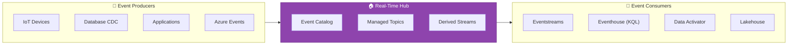
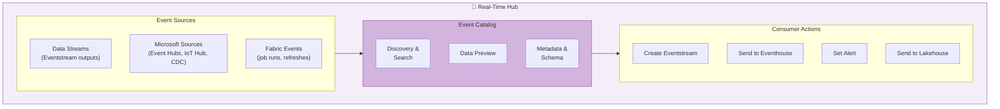
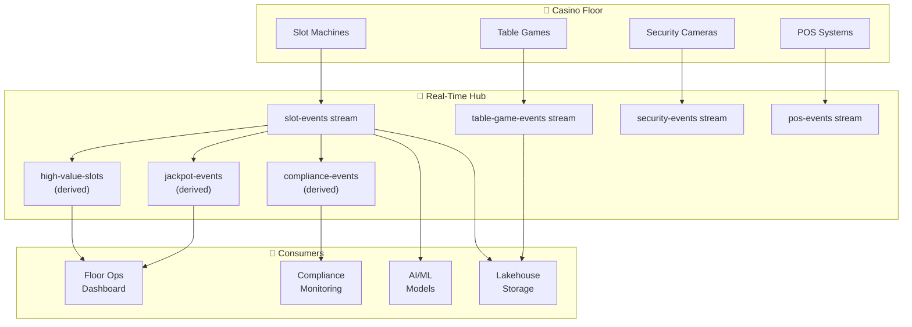

# 📡 Real-Time Hub — Event Discovery and Sharing

<div align="center" markdown>

**Centralized Event Catalog for Microsoft Fabric**


</div>

---

**Last Updated:** `2026-04-21` | **Version:** 1.0.0

---

## 🎯 Overview

Real-Time Hub is a **centralized event catalog** in Microsoft Fabric that makes all streaming data discoverable, shareable, and consumable across the organization. Instead of creating point-to-point Eventstream connections, teams publish events to the Real-Time Hub where other teams can browse, subscribe, and build derived streams.

Think of Real-Time Hub as a "marketplace" for streaming data — just as OneLake Catalog indexes batch data, Real-Time Hub indexes real-time event sources.

### Where Real-Time Hub Fits



### Key Capabilities

| Capability | Description |
|-----------|-------------|
| **Event Catalog** | Browse all available event sources across the tenant |
| **Data Streams** | Eventstream-managed streams available for consumption |
| **Microsoft Sources** | Azure Event Hubs, IoT Hub, Azure SQL DB CDC, Cosmos DB CDC |
| **Fabric Events** | Workspace item events (job completion, refresh, pipeline runs) |
| **External Events** | Google Cloud Pub/Sub, Amazon Kinesis, Confluent Kafka |
| **Derived Streams** | Create filtered/transformed views of existing streams |
| **Cross-Workspace** | Share streams across workspaces and capacities |
| **Set Alert** | Connect to Data Activator directly from the Hub |
| **Preview** | View live event data before subscribing |

---

## 🏗️ Architecture

### Component Architecture



### Three Event Categories

| Category | Source | Examples | Latency |
|----------|--------|----------|---------|
| **Data Streams** | Eventstream outputs | Slot events, weather readings, IoT telemetry | Sub-second |
| **Microsoft Sources** | Azure services | Event Hubs, IoT Hub, SQL DB CDC, Cosmos DB CDC | Seconds |
| **Fabric Events** | Fabric internal | Pipeline completed, Notebook failed, Refresh finished | Seconds |

---

## ⚙️ Event Sources

### Data Streams (Eventstream Outputs)

Any Eventstream output is automatically available in the Real-Time Hub:

```
Eventstream: casino-slot-events
  Input: Azure Event Hub (casino-events-hub)
  Output 1: Eventhouse (slot_analytics)     → appears in Real-Time Hub
  Output 2: Lakehouse (lh_bronze)           → appears in Real-Time Hub
```

### Microsoft Sources

Connect directly from the Hub:

| Source | Event Type | Use Case |
|--------|-----------|----------|
| **Azure Event Hubs** | Custom events | Application telemetry, IoT |
| **Azure IoT Hub** | Device telemetry | Sensor data, equipment monitoring |
| **Azure SQL Database** | CDC events | Transaction changes |
| **Azure Cosmos DB** | Change feed | Document updates |
| **Azure Blob Storage** | Blob events | File arrival triggers |

### Fabric Events

Monitor Fabric platform activity:

| Event | Trigger | Use Case |
|-------|---------|----------|
| **Pipeline Run Completed** | Pipeline finishes (success/fail) | Trigger downstream processing |
| **Notebook Run Completed** | Notebook execution ends | Alert on failures |
| **Dataset Refresh Completed** | Semantic model refresh | Validate data freshness |
| **Lakehouse Table Updated** | Delta table modified | Trigger incremental processing |

### Connecting a Source

1. Open **Real-Time Hub** from the left nav
2. Click **+ Get events**
3. Select source type (Event Hub, IoT Hub, etc.)
4. Configure connection:
   ```
   Source: Azure Event Hub
   Event Hub namespace: casino-events.servicebus.windows.net
   Event Hub name: slot-events
   Consumer group: $Default
   Authentication: Shared Access Key
   ```
5. Preview data to verify schema
6. Choose destination: Create Eventstream, Send to Eventhouse, or Set Alert

---

## 🔄 Streams and Topics

### Derived Streams

Create filtered views of existing streams for specific consumers:

```
Parent stream: casino-slot-events (all machines, all casinos)

Derived stream 1: casino-a-high-value
  Filter: casino_id = "CASINO-A" AND coin_in > 1000

Derived stream 2: jackpot-events
  Filter: event_type = "JACKPOT"

Derived stream 3: compliance-monitoring
  Filter: amount >= 3000
```

### Stream Sharing

Share streams across workspaces:

```
Real-Time Hub → Stream → Share
  Share with:
    ☑ casino-floor-ops-workspace (Read)
    ☑ casino-compliance-workspace (Read)
    ☑ casino-analytics-workspace (Read)
```

---

## 🎰 Casino Implementation

### Casino Floor Event Topology



### Available Streams in Hub

| Stream | Source | Schema | Consumers |
|--------|--------|--------|-----------|
| `casino-slot-events` | Event Hub | machine_id, event_type, coin_in, coin_out, timestamp | All teams |
| `casino-table-events` | Event Hub | table_id, game_type, bet, payout, timestamp | Analytics |
| `casino-security-alerts` | IoT Hub | camera_id, alert_type, confidence, timestamp | Security |
| `jackpot-events` | Derived | machine_id, amount, player_id | VIP Services |
| `compliance-cash-events` | Derived | player_id, amount, transaction_type | Compliance |
| `fabric-pipeline-events` | Fabric Events | pipeline_name, status, duration | DataOps |

---

## 🏛️ Federal Implementation

### Multi-Agency Event Hub

| Agency | Stream | Source | Refresh |
|--------|--------|--------|---------|
| **NOAA** | `noaa-weather-observations` | Event Hub (MADIS feed) | Real-time |
| **NOAA** | `noaa-severe-alerts` | Derived (severity ≥ Warning) | Real-time |
| **EPA** | `epa-continuous-monitoring` | IoT Hub (CEMS sensors) | Real-time |
| **EPA** | `epa-aqi-exceedance` | Derived (AQI > 100) | Real-time |
| **DOI** | `usgs-earthquake-events` | Event Hub (USGS feed) | Real-time |
| **DOI** | `usgs-significant-quakes` | Derived (magnitude ≥ 4.0) | Real-time |
| **USDA** | `usda-market-prices` | Event Hub | Every 5 min |
| **DOT/FAA** | `faa-flight-delays` | Event Hub (SWIM feed) | Real-time |

### Cross-Agency Data Sharing

```
Real-Time Hub enables agencies to share event streams:

NOAA severe-weather-alerts → shared with:
  - DOT/FAA (flight impact assessment)
  - USDA (crop impact monitoring)
  - EPA (air quality correlation)
  - DOI (natural disaster response)
```

---

## ⚠️ Limitations

| Limitation | Details | Workaround |
|-----------|---------|-----------|
| **Preview Status** | Some features in public preview | Use GA features for production |
| **Derived Stream Limits** | Limited transform operations in derived streams | Use full Eventstream for complex transforms |
| **Cross-Tenant** | Cannot share streams across tenants | Use Event Hub as intermediary |
| **Retention** | Event data retention depends on the source (Event Hub: 1-90 days) | Archive to Lakehouse for long-term |
| **Schema Registry** | No centralized schema registry | Document schemas in OneLake Catalog |

---

## 📚 References

| Resource | URL |
|----------|-----|
| Real-Time Hub Overview | https://learn.microsoft.com/fabric/real-time-hub/real-time-hub-overview |
| Get Events | https://learn.microsoft.com/fabric/real-time-hub/get-started-real-time-hub |
| Fabric Events | https://learn.microsoft.com/fabric/real-time-hub/explore-fabric-events |
| Microsoft Sources | https://learn.microsoft.com/fabric/real-time-hub/supported-sources |

---

## 📊 Capacity Events in Real-Time Hub (Preview)

Announced at FabCon Atlanta March 2026, **Capacity Events** bring real-time visibility into Fabric capacity usage directly into the Real-Time Hub. This enables proactive workload management by surfacing:

- **Throttling Events**: Alerts when capacity throttling begins or ends
- **Usage Spikes**: Real-time CU consumption exceeding configurable thresholds
- **Performance Degradation**: Latency increases across workloads detected automatically
- **Capacity Utilization**: Continuous percentage utilization stream updated every 30 seconds

### How It Works

Capacity events appear as a new **system event source** in the Real-Time Hub. Once enabled:

1. Navigate to **Real-Time Hub** → **System Events** → **Capacity Events**
2. Select the target Fabric capacity
3. Configure event filters (throttling, utilization thresholds, latency)
4. Route events to an Eventstream, KQL Database, or Data Activator reflex
5. Build dashboards or automated responses on the event stream

### Casino Use Case

Casino gaming floors generate unpredictable compute spikes during peak hours (Friday/Saturday nights, major sporting events). Capacity events enable:

- Real-time alerts when slot telemetry ingestion causes throttling
- Automated scaling triggers via Data Activator (e.g., pause low-priority refreshes)
- Historical analysis of capacity patterns for F64 right-sizing decisions
- Correlation of CU spikes with specific workloads (e.g., CTR batch processing)

### Federal Use Case

Federal agencies with shared Fabric tenants (e.g., USDA + NOAA sharing capacity) can monitor per-agency consumption and prevent one agency's batch jobs from throttling another's real-time dashboards. Capacity events provide the telemetry foundation for chargeback models and fair-use enforcement across organizational boundaries.

---

## 🔗 Related Documents

- [Real-Time Intelligence](real-time-intelligence.md) — Eventstreams and Eventhouse for analytics
- [Data Activator](data-activator.md) — Alerting triggered from Real-Time Hub events
- [Data Sharing & Federation](../best-practices/data-sharing-federation.md) — Cross-workspace sharing
- [Architecture](../ARCHITECTURE.md) — System architecture

---

> 📝 **Document Metadata**
> - **Author**: Documentation Team
> - **Reviewers**: Real-Time Intelligence, Platform
> - **Classification**: Internal
> - **Next Review**: 2026-07-21
