[Home](../index.md) > [Docs](../) > [Features](./) > Real-Time Intelligence

# ⚡ Real-Time Intelligence (RTI) Comprehensive Guide

<div align="center">

**Streaming Analytics at Scale with Microsoft Fabric**


</div>

---

**Last Updated:** `2026-03-12` | **Version:** 1.0.0

---

## 📑 Table of Contents

- [🎯 Overview](#-overview)
- [🏗️ RTI Components](#️-rti-components)
- [📐 Architecture Patterns](#-architecture-patterns)
- [📥 Eventstream Setup](#-eventstream-setup)
- [🏠 Eventhouse Configuration](#-eventhouse-configuration)
- [🔍 KQL Query Patterns](#-kql-query-patterns)
- [📊 Real-Time Dashboards](#-real-time-dashboards)
- [🔔 Data Activator](#-data-activator)
- [🏛️ Domain Use Cases](#️-domain-use-cases)
- [⚡ Performance Tuning](#-performance-tuning)
- [💰 Cost Management](#-cost-management)
- [📚 References](#-references)

---

## 🎯 Overview

Real-Time Intelligence (RTI) in Microsoft Fabric provides a complete streaming analytics platform that enables organizations to ingest, process, analyze, and act on data in motion. RTI brings together four key components -- Eventstreams, Eventhouse, Real-Time Dashboards, and Data Activator -- into a unified experience within the Fabric workspace.

### Why RTI Matters

| Challenge | RTI Solution |
|-----------|-------------|
| Delayed insights from batch processing | Sub-second ingestion with continuous processing |
| Multiple disconnected streaming tools | Unified platform within Fabric workspace |
| Complex stream processing code | No-code/low-code transformations in Eventstreams |
| Static dashboards refreshed hourly | Auto-refreshing dashboards with live KQL queries |
| Manual alert configuration | Data Activator triggers actions automatically |
| Hot/warm/cold data management | Integrated caching policies in Eventhouse |

### RTI in the Fabric Ecosystem

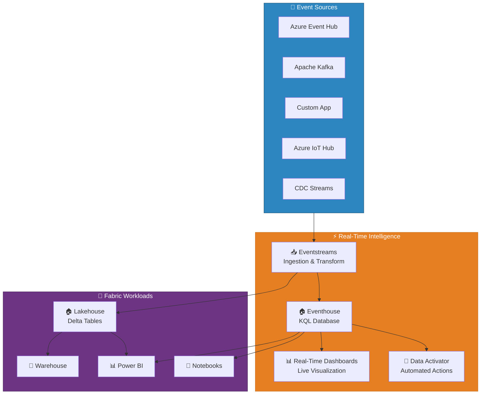

---

## 🏗️ RTI Components

### Component Overview

| Component | Purpose | Key Capabilities |
|-----------|---------|-----------------|
| **Eventstreams** | Event ingestion and in-flight transformation | Source connectors, no-code transforms, multi-destination routing |
| **Eventhouse** | High-performance analytical store (KQL DB) | Time-series optimization, hot cache, materialized views, update policies |
| **Real-Time Dashboards** | Live visualization of streaming data | Auto-refresh tiles, KQL-driven visuals, parameters, drill-through |
| **Data Activator** | Automated actions triggered by data conditions | Threshold alerts, pattern detection, Power Automate integration |

### Component Interaction

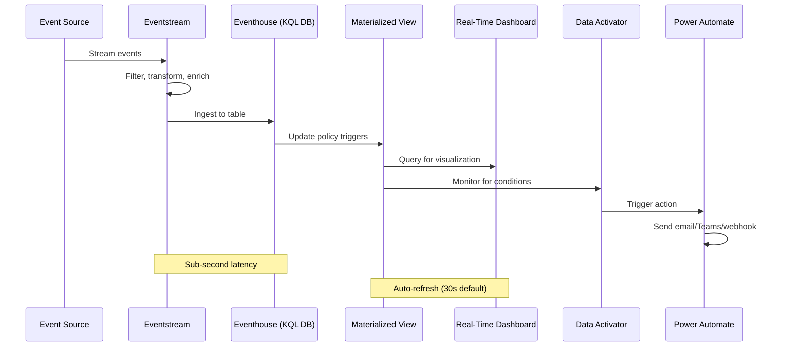

---

## 📐 Architecture Patterns

### Pattern 1: Hot Path Only (Eventhouse)

Best for operational monitoring where only recent data matters. All events flow through Eventstream directly to Eventhouse for real-time querying.

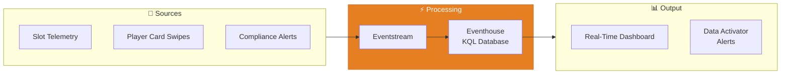

**When to Use:**
- Casino floor monitoring (last 24-72 hours)
- Live weather observation feeds
- Real-time AQI monitoring
- Flight delay tracking

**Retention Configuration:**
```kql
// Set hot cache to 3 days, total retention to 30 days
.alter table SlotTelemetry policy caching
    hot = 3d

.alter table SlotTelemetry policy retention
    softdelete = 30d
    recoverability = enabled
```

### Pattern 2: Warm Path (Lakehouse Delta)

Best for batch analytics where streaming data needs to be combined with historical data in the medallion architecture.

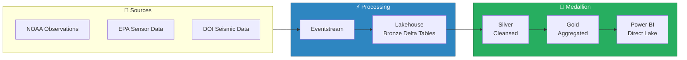

**When to Use:**
- Historical trend analysis on streaming data
- Data that feeds into medallion architecture
- Batch ML model training on recent events
- Compliance reporting (requires full history)

### Pattern 3: Lambda (Hot + Warm Hybrid)

The recommended pattern for most production workloads. Eventstream splits events to both Eventhouse (hot) and Lakehouse (warm), providing real-time dashboards alongside historical batch analytics.

```mermaid
flowchart TB
    subgraph Sources["📡 Event Sources"]
        S1["Slot Machine<br/>Telemetry"]
        S2["Player Card<br/>Events"]
        S3["Compliance<br/>Triggers"]
    end

    subgraph Ingestion["📥 Eventstream"]
        ES["Eventstream<br/>Filter + Enrich"]
    end

    subgraph HotPath["🔴 Hot Path (Real-Time)"]
        EH["Eventhouse"]
        RTD["Real-Time<br/>Dashboard"]
        DA["Data Activator<br/>Alerts"]
    end

    subgraph WarmPath["🔵 Warm Path (Batch)"]
        LH["Lakehouse<br/>Bronze"]
        SV["Silver<br/>Cleansed"]
        GD["Gold<br/>Aggregated"]
        PBI["Power BI<br/>Direct Lake"]
    end

    Sources --> ES
    ES -->|"Real-time copy"| EH
    ES -->|"Batch landing"| LH
    EH --> RTD
    EH --> DA
    LH --> SV --> GD --> PBI

    style HotPath fill:#E74C3C,stroke:#C0392B,color:#fff
    style WarmPath fill:#2E86C1,stroke:#1A5276,color:#fff
    style Ingestion fill:#E67E22,stroke:#CA6F1E,color:#fff
```

**When to Use:**
- Casino floor operations (real-time alerts + historical reporting)
- NOAA storm tracking (live radar + climate trend analysis)
- EPA monitoring (real-time AQI + compliance reporting)
- DOT/FAA (live flight tracking + delay pattern analysis)

> 💡 **Tip**: The Lambda pattern is the default recommendation for this project. It provides the best balance of real-time responsiveness and historical depth.

### Pattern 4: Kappa (Stream-Only)

All processing happens on the stream. Suitable when there is no need for a separate batch layer and all analytics can be derived from the event stream.

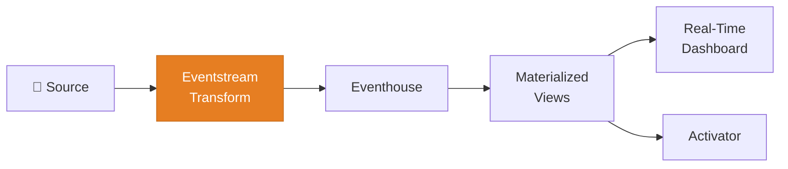

**When to Use:**
- IoT sensor monitoring where only recent data matters
- Real-time anomaly detection without historical context
- Simple event counting and aggregation

---

## 📥 Eventstream Setup

### Source Connectors

| Source Type | Connector | Auth Method | Use Case |
|------------|-----------|-------------|----------|
| **Azure Event Hub** | Native | Connection string / Managed Identity | Primary for Azure-native sources |
| **Apache Kafka** | Kafka protocol | SASL/SSL | Third-party streaming platforms |
| **Custom App** | REST API / SDK | API key / OAuth | Application-level event producers |
| **Azure IoT Hub** | Native | Device connection string | IoT device telemetry |
| **Sample Data** | Built-in | None | Development and testing |
| **Azure Blob Storage** | Native | Account key / MI | File-based event replay |
| **CDC (Fabric Mirroring)** | Database CDC | Connection config | Change data capture from databases |

### Creating an Eventstream

#### Step 1: Create the Eventstream Item

```
Workspace → + New → Eventstream
  Name: es-slot-telemetry
  Description: Real-time slot machine telemetry events from casino floor
```

#### Step 2: Add a Source

For Azure Event Hub source:

```json
{
    "source_type": "AzureEventHub",
    "connection": {
        "event_hub_namespace": "eh-casino-telemetry",
        "event_hub_name": "slot-events",
        "consumer_group": "$Default",
        "authentication": "managed_identity"
    },
    "serialization": {
        "type": "JSON",
        "encoding": "UTF-8"
    }
}
```

For a Custom App source (used by data generators):

```python
# Python data generator sending to Eventstream custom app endpoint
from azure.eventhub import EventHubProducerClient, EventData
import json

connection_str = "Endpoint=sb://es-slot-telemetry.servicebus.windows.net/..."
producer = EventHubProducerClient.from_connection_string(connection_str)

event = EventData(json.dumps({
    "machine_id": "SL-4421",
    "event_type": "spin",
    "denomination": 0.25,
    "wager": 2.50,
    "payout": 0.00,
    "timestamp": "2026-03-12T14:30:00Z",
    "floor_location": "Floor 2, Section A3"
}))

batch = producer.create_batch()
batch.add(event)
producer.send_batch(batch)
```

### Eventstream Transformations

Eventstreams support no-code in-flight transformations:

| Transform | Description | Example |
|-----------|-------------|---------|
| **Filter** | Remove events that don't match criteria | Filter out "heartbeat" events, keep only "spin" and "error" |
| **Manage Fields** | Select, rename, or remove fields | Remove raw_payload, rename ts to timestamp |
| **Aggregate** | Windowed aggregations (tumbling, hopping, session) | Count spins per machine per 5-minute window |
| **Group By** | Group events by key columns | Group by machine_id and floor_location |
| **Union** | Combine multiple streams | Merge slot and table game events |
| **Expand** | Flatten nested JSON arrays | Expand multi-line transaction details |
| **Join** | Join two streams on a key | Enrich telemetry with machine master data |

#### Tumbling Window Aggregation Example

```
Eventstream Canvas:
  [Source: Event Hub]
    → [Filter: event_type IN ('spin', 'jackpot', 'error')]
    → [Aggregate: Tumbling Window 5min]
        GroupBy: machine_id, floor_location
        Aggregations:
          - COUNT(*) AS event_count
          - SUM(wager) AS total_wager
          - SUM(payout) AS total_payout
          - COUNT(CASE WHEN event_type='error' THEN 1 END) AS error_count
    → [Destination: Eventhouse table "SlotTelemetry5min"]
    → [Destination: Lakehouse table "bronze_slot_telemetry"]
```

### Multi-Destination Routing

A single Eventstream can route events to multiple destinations simultaneously:

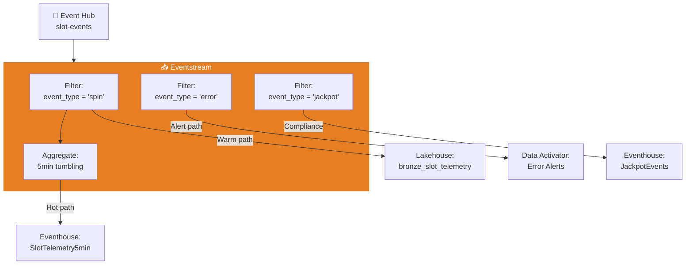

---

## 🏠 Eventhouse Configuration

### Database Creation

An Eventhouse contains one or more KQL databases. Each database is an independent container for tables, functions, materialized views, and policies.

```
Workspace → + New → Eventhouse
  Name: evh-casino-operations
  Description: Real-time analytics for casino floor operations

  Databases:
  ├── db-slot-telemetry      (Slot machine events and aggregations)
  ├── db-compliance-alerts    (CTR, SAR, W-2G real-time monitoring)
  └── db-player-tracking      (Player card swipe and session events)
```

### Table Schemas and Ingestion Mappings

#### Table Creation

```kql
// Create the raw telemetry ingestion table
.create table SlotTelemetryRaw (
    MachineId: string,
    EventType: string,
    Denomination: real,
    Wager: real,
    Payout: real,
    Timestamp: datetime,
    FloorLocation: string,
    GameTitle: string,
    SessionId: string,
    ErrorCode: string,
    RawPayload: dynamic
)

// Create the 5-minute aggregation table
.create table SlotTelemetry5min (
    MachineId: string,
    FloorLocation: string,
    WindowStart: datetime,
    WindowEnd: datetime,
    SpinCount: long,
    TotalWager: real,
    TotalPayout: real,
    HoldAmount: real,
    HoldPct: real,
    ErrorCount: long,
    JackpotCount: long
)
```

#### Ingestion Mapping

```kql
// JSON ingestion mapping for Event Hub data
.create table SlotTelemetryRaw ingestion json mapping 'SlotTelemetryMapping'
    '[{"column":"MachineId","path":"$.machine_id","datatype":"string"},'
    '{"column":"EventType","path":"$.event_type","datatype":"string"},'
    '{"column":"Denomination","path":"$.denomination","datatype":"real"},'
    '{"column":"Wager","path":"$.wager","datatype":"real"},'
    '{"column":"Payout","path":"$.payout","datatype":"real"},'
    '{"column":"Timestamp","path":"$.timestamp","datatype":"datetime"},'
    '{"column":"FloorLocation","path":"$.floor_location","datatype":"string"},'
    '{"column":"GameTitle","path":"$.game_title","datatype":"string"},'
    '{"column":"SessionId","path":"$.session_id","datatype":"string"},'
    '{"column":"ErrorCode","path":"$.error_code","datatype":"string"},'
    '{"column":"RawPayload","path":"$","datatype":"dynamic"}]'
```

### Retention and Caching Policies

Eventhouse uses a two-tier storage model:

| Tier | Storage | Performance | Cost |
|------|---------|-------------|------|
| **Hot Cache** | SSD (in-memory) | Sub-second query response | Higher CU consumption |
| **Cold Storage** | OneLake (Azure Blob) | Seconds to minutes query response | Lower cost, included in capacity |

```kql
// Configure hot cache: keep last 7 days in fast storage
.alter table SlotTelemetryRaw policy caching
    hot = 7d

// Configure total retention: keep 90 days, allow recovery
.alter table SlotTelemetryRaw policy retention
    softdelete = 90d
    recoverability = enabled

// For compliance tables, keep longer
.alter table ComplianceAlerts policy caching
    hot = 30d

.alter table ComplianceAlerts policy retention
    softdelete = 7y
    recoverability = enabled
```

> ⚠️ **Warning**: Compliance data (CTR, SAR, W-2G) must be retained per regulatory requirements. NIGC MICS requires 5-year minimum retention for gaming records. Configure retention policies accordingly.

### Materialized Views

Materialized views pre-compute aggregations for faster dashboard queries:

```kql
// Hourly slot performance materialized view
.create materialized-view with (backfill=true)
    SlotPerformanceHourly on table SlotTelemetryRaw
{
    SlotTelemetryRaw
    | where EventType == "spin"
    | summarize
        SpinCount = count(),
        TotalWager = sum(Wager),
        TotalPayout = sum(Payout),
        HoldAmount = sum(Wager) - sum(Payout),
        AvgWager = avg(Wager)
        by MachineId, FloorLocation, bin(Timestamp, 1h)
}

// Daily compliance summary materialized view
.create materialized-view with (backfill=true)
    ComplianceDailySummary on table ComplianceAlerts
{
    ComplianceAlerts
    | summarize
        CTRCount = countif(AlertType == "CTR"),
        SARCount = countif(AlertType == "SAR"),
        W2GCount = countif(AlertType == "W2G"),
        TotalAlerts = count()
        by bin(Timestamp, 1d)
}
```

### Update Policies

Update policies automatically transform data as it arrives, creating derived tables from raw ingestion:

```kql
// Create derived table for error analysis
.create table SlotErrors (
    MachineId: string,
    ErrorCode: string,
    ErrorTimestamp: datetime,
    FloorLocation: string,
    GameTitle: string,
    TimeSinceLastError: timespan
)

// Update policy: extract errors from raw telemetry on ingestion
.alter table SlotErrors policy update
@'[{"IsEnabled": true, "Source": "SlotTelemetryRaw", "Query": "SlotTelemetryRaw | where EventType == \"error\" | project MachineId, ErrorCode, ErrorTimestamp=Timestamp, FloorLocation, GameTitle, TimeSinceLastError=timespan(null)", "IsTransactional": true}]'
```

---

## 🔍 KQL Query Patterns

### Time-Series Analysis

```kql
// Slot revenue time-series with 1-hour bins over the last 7 days
SlotTelemetryRaw
| where Timestamp > ago(7d) and EventType == "spin"
| summarize
    Revenue = sum(Wager) - sum(Payout),
    SpinCount = count()
    by bin(Timestamp, 1h)
| render timechart
    with (title="Hourly Slot Revenue", xtitle="Time", ytitle="Revenue ($)")
```

```kql
// Seasonal decomposition of daily revenue
let daily_revenue = SlotTelemetryRaw
| where EventType == "spin"
| summarize Revenue = sum(Wager) - sum(Payout) by bin(Timestamp, 1d)
| project Timestamp, Revenue;
daily_revenue
| make-series Revenue = sum(Revenue) on Timestamp step 1d
| extend (anomalies, score, baseline) = series_decompose_anomalies(Revenue)
| render anomalychart
    with (title="Revenue Anomaly Detection", anomalycolumns=anomalies)
```

### Anomaly Detection

```kql
// Detect anomalous error rates per machine using series_decompose_anomalies()
let error_rates = SlotTelemetryRaw
| where Timestamp > ago(7d)
| summarize
    TotalEvents = count(),
    Errors = countif(EventType == "error")
    by MachineId, bin(Timestamp, 1h)
| extend ErrorRate = round(todouble(Errors) / TotalEvents * 100, 2);
error_rates
| make-series ErrorRate = avg(ErrorRate) on Timestamp step 1h by MachineId
| extend (anomalies, score, baseline) = series_decompose_anomalies(ErrorRate, 1.5)
| mv-expand Timestamp to typeof(datetime),
            ErrorRate to typeof(double),
            anomalies to typeof(int),
            score to typeof(double),
            baseline to typeof(double)
| where anomalies != 0
| project MachineId, Timestamp, ErrorRate, anomalies, score
| order by score desc
```

### Geospatial Queries

```kql
// Find all earthquake events within 100km of a given point (DOI use case)
let center_lat = 47.6062;  // Seattle
let center_lon = -122.3321;
let radius_km = 100;
EarthquakeEvents
| where Timestamp > ago(30d)
| where geo_distance_point_to_point(Longitude, Latitude, center_lon, center_lat) < radius_km * 1000
| project EventId, Magnitude, Depth, Latitude, Longitude,
          Distance_km = round(geo_distance_point_to_point(Longitude, Latitude, center_lon, center_lat) / 1000, 1),
          Timestamp
| order by Magnitude desc
```

```kql
// Check if facilities are within EPA monitoring zones using geo_point_in_polygon()
let monitoring_zone = dynamic({
    "type": "Polygon",
    "coordinates": [[[-122.5, 47.4], [-122.5, 47.8], [-122.1, 47.8], [-122.1, 47.4], [-122.5, 47.4]]]
});
EPAFacilities
| where geo_point_in_polygon(Longitude, Latitude, monitoring_zone)
| summarize FacilityCount = count(), TotalReleases = sum(ReleaseAmount) by ChemicalName
| order by TotalReleases desc
```

### Pattern Matching with Scan Operator

```kql
// Detect structuring patterns: multiple transactions just below CTR threshold
// Pattern: 3+ transactions of $8,000-$9,999 from same player within 24 hours
PlayerTransactions
| where Timestamp > ago(24h)
| where Amount between (8000.0 .. 9999.99)
| order by PlayerId asc, Timestamp asc
| partition by PlayerId
    (
        scan with_match_id = mid
            declare (step1: bool = false, step2: bool = false, step3: bool = false)
            with
            (
                step step1: true;
                step step2: step1 == true and Timestamp - step1.Timestamp < 24h;
                step step3: step2 == true and Timestamp - step1.Timestamp < 24h;
            )
        | where step3 == true
    )
| summarize
    TransactionCount = count(),
    TotalAmount = sum(Amount),
    TimeSpan = max(Timestamp) - min(Timestamp)
    by PlayerId, mid
| where TransactionCount >= 3
| order by TotalAmount desc
```

### Advanced Aggregation Patterns

```kql
// Moving average of slot performance (7-day window)
SlotPerformanceHourly
| where Timestamp > ago(30d)
| summarize DailyRevenue = sum(HoldAmount) by bin(Timestamp, 1d)
| order by Timestamp asc
| extend MovingAvg7d = series_fir(pack_array(DailyRevenue), repeat(1, 7), true, false)
| project Timestamp, DailyRevenue, MovingAvg7d

// Percentile analysis of player session durations
PlayerSessions
| where Timestamp > ago(30d)
| summarize
    p50 = percentile(SessionDuration, 50),
    p75 = percentile(SessionDuration, 75),
    p90 = percentile(SessionDuration, 90),
    p99 = percentile(SessionDuration, 99),
    AvgDuration = avg(SessionDuration)
    by bin(Timestamp, 1d)
| render timechart
```

---

## 📊 Real-Time Dashboards

### Dashboard Architecture

Real-Time Dashboards in Fabric are purpose-built for live KQL-powered visualizations. Unlike Power BI reports that query semantic models, RTI dashboards query Eventhouse (KQL databases) directly.

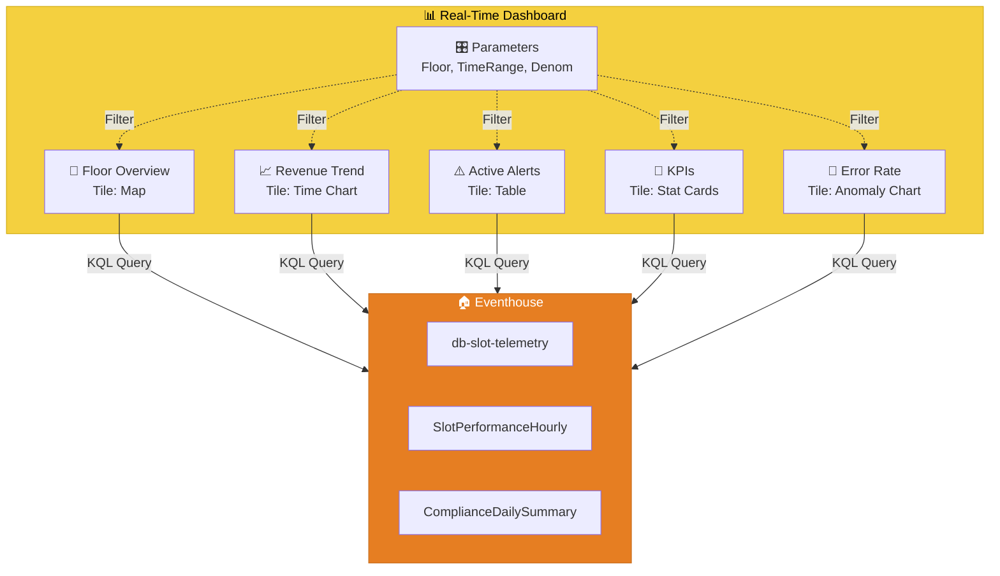

### Tile Types and Configuration

| Tile Type | Best For | Refresh Rate | KQL Output |
|-----------|----------|-------------|------------|
| **Time Chart** | Trends over time | 30s | `render timechart` |
| **Bar Chart** | Comparisons across categories | 30s | `render barchart` |
| **Pie Chart** | Proportions and distributions | 60s | `render piechart` |
| **Stat Card** | Single KPI values | 10s | Single row, single column |
| **Table** | Detailed records | 30s | Tabular output |
| **Map** | Geospatial data | 60s | Requires lat/long columns |
| **Anomaly Chart** | Outlier detection | 60s | `render anomalychart` |
| **Multi-Stat** | Multiple KPIs in one tile | 30s | Single row, multiple columns |

### Auto-Refresh Settings

```
Dashboard Settings → Auto Refresh
  ├── Minimum refresh interval: 10 seconds
  ├── Default refresh interval: 30 seconds
  ├── Maximum data age: configurable per tile
  └── Pause auto-refresh when tab is inactive: recommended
```

> 💡 **Tip**: Set critical alert tiles (compliance, errors) to 10-second refresh and informational tiles (trends, summaries) to 60-second refresh to balance performance with freshness.

### Parameter-Driven Dashboards

Parameters allow users to filter dashboard data interactively:

```kql
// Define parameter usage in tile query
// Parameter: FloorLocation (dropdown, multi-select)
// Parameter: TimeRange (time range picker)
// Parameter: MinWager (free text, decimal)

SlotPerformanceHourly
| where FloorLocation in ({FloorLocation})
| where Timestamp between ({TimeRange})
| where TotalWager >= {MinWager}
| summarize
    TotalRevenue = sum(HoldAmount),
    AvgHoldPct = avg(HoldAmount / TotalWager) * 100,
    TotalSpins = sum(SpinCount)
    by MachineId, FloorLocation
| order by TotalRevenue desc
```

### Casino Floor Dashboard Layout

```
┌──────────────────────────────────────────────────────────┐
│  🎰 Casino Floor Operations - Real-Time Dashboard        │
│  Parameters: [Floor: All ▼] [Time: Last 4h ▼] [Denom ▼]│
├──────────────┬──────────────┬──────────────┬─────────────┤
│  Revenue     │  Machines    │  Active      │  Alerts     │
│  $1.2M       │  1,247       │  Players     │  3 Active   │
│  ↑ 4.2%      │  Online      │  892         │  ⚠ CTR: 1   │
├──────────────┴──────────────┴──────────────┴─────────────┤
│  📈 Hourly Revenue Trend (Time Chart)                    │
│  ════════════════════════════════════════════════════     │
│  [Line chart showing last 24h with anomaly markers]      │
├──────────────────────────────┬────────────────────────────┤
│  🗺️ Floor Heat Map           │  ⚠️ Active Compliance Alerts│
│  [Color-coded by revenue]    │  [Table: CTR, SAR, W-2G]   │
│  [Click machine for detail]  │  [Sorted by severity]      │
├──────────────────────────────┴────────────────────────────┤
│  🔄 Machine Error Rate (Anomaly Chart)                   │
│  [Last 7 days with anomaly detection bands]              │
└──────────────────────────────────────────────────────────┘
```

---

## 🔔 Data Activator

Data Activator (formerly Reflex) monitors streaming data for conditions and automatically triggers actions when thresholds are met.

### Alert Configuration

| Alert Type | Condition | Action |
|-----------|-----------|--------|
| **CTR Threshold** | Transaction amount >= $10,000 | Email compliance team + log to audit table |
| **SAR Pattern** | 3+ transactions $8K-$9.9K from same player in 24h | Alert compliance officer + flag in system |
| **Machine Error Spike** | Error rate > 10% for 15+ minutes | Email floor tech + page on-call engineer |
| **Revenue Anomaly** | Hourly revenue deviates >3 sigma from baseline | Alert floor manager |
| **Jackpot Event** | Payout > $1,200 (W-2G threshold) | Notify cage operations + auto-generate W-2G |

### Setting Up Data Activator

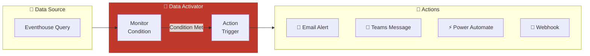

### Example: CTR Compliance Alert

```json
{
    "activator_name": "CTR Threshold Alert",
    "source": {
        "type": "eventhouse",
        "database": "db-compliance-alerts",
        "query": "PlayerTransactions | where Amount >= 10000 | where Timestamp > ago(5m)"
    },
    "condition": {
        "type": "row_count",
        "operator": "greater_than",
        "value": 0
    },
    "actions": [
        {
            "type": "email",
            "recipients": ["compliance-team@casino.com"],
            "subject": "CTR Alert: Transaction >= $10,000",
            "body": "Player {PlayerId} - Transaction of ${Amount} at {Timestamp}"
        },
        {
            "type": "power_automate",
            "flow_id": "ctr-processing-flow",
            "parameters": {
                "player_id": "{PlayerId}",
                "amount": "{Amount}",
                "timestamp": "{Timestamp}"
            }
        }
    ]
}
```

---

## 🏛️ Domain Use Cases

### 🎰 Casino: Slot Telemetry and Compliance

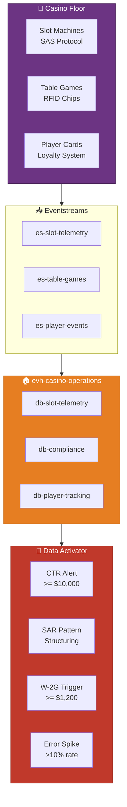

**Key Real-Time Queries:**

```kql
// Live floor utilization by section
SlotTelemetryRaw
| where Timestamp > ago(15m)
| where EventType == "spin"
| summarize ActiveMachines = dcount(MachineId) by FloorLocation
| join kind=leftouter (
    MachineInventory | summarize TotalMachines = count() by FloorLocation
) on FloorLocation
| extend UtilizationPct = round(todouble(ActiveMachines) / TotalMachines * 100, 1)
| order by UtilizationPct desc
```

### 🌀 NOAA: Live Weather and Storm Tracking

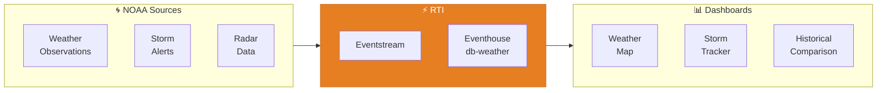

**Key Real-Time Queries:**

```kql
// Track active severe weather alerts by state
NOAAAlerts
| where Timestamp > ago(1h) and Status == "Active"
| where Severity in ("Extreme", "Severe")
| summarize AlertCount = count(), AlertTypes = make_set(EventType) by State, Severity
| order by Severity asc, AlertCount desc

// Detect temperature anomalies at observation stations
let station_history = NOAAObservations
| where Timestamp between (ago(365d) .. ago(1d))
| summarize AvgTemp = avg(Temperature), StdTemp = stdev(Temperature) by StationId, bin(Timestamp, 1d);
NOAAObservations
| where Timestamp > ago(1h)
| join kind=inner station_history on StationId
| extend ZScore = (Temperature - AvgTemp) / StdTemp
| where abs(ZScore) > 3
| project StationId, Temperature, AvgTemp, ZScore, Timestamp
```

### 🌊 EPA: Real-Time AQI Monitoring

**Key Real-Time Queries:**

```kql
// Real-time Air Quality Index across monitoring stations
EPASensorData
| where Timestamp > ago(1h)
| where Pollutant == "PM2.5"
| summarize AvgConcentration = avg(Concentration) by StationId, City, State
| extend AQI_Category = case(
    AvgConcentration <= 12, "Good",
    AvgConcentration <= 35.4, "Moderate",
    AvgConcentration <= 55.4, "Unhealthy for Sensitive Groups",
    AvgConcentration <= 150.4, "Unhealthy",
    AvgConcentration <= 250.4, "Very Unhealthy",
    "Hazardous")
| extend AQI_Color = case(
    AQI_Category == "Good", "Green",
    AQI_Category == "Moderate", "Yellow",
    AQI_Category == "Unhealthy for Sensitive Groups", "Orange",
    AQI_Category == "Unhealthy", "Red",
    AQI_Category == "Very Unhealthy", "Purple",
    "Maroon")
| order by AvgConcentration desc
```

### 🏔️ DOI: Earthquake Event Streaming

**Key Real-Time Queries:**

```kql
// Real-time earthquake monitoring with cascading event detection
EarthquakeEvents
| where Timestamp > ago(24h)
| order by Timestamp desc
| extend
    TimeSincePrevious = prev(Timestamp) - Timestamp,
    DistanceFromPrevious = geo_distance_point_to_point(
        Longitude, Latitude,
        prev(Longitude), prev(Latitude)) / 1000
| where Magnitude >= 3.0
| project Timestamp, Magnitude, Depth, Latitude, Longitude,
          Region, TimeSincePrevious, DistanceFromPrevious
```

### ✈️ DOT/FAA: Flight Delay Tracking

**Key Real-Time Queries:**

```kql
// Real-time flight delay status by airport
FlightEvents
| where Timestamp > ago(2h)
| where EventType == "departure" or EventType == "arrival"
| extend DelayMinutes = datetime_diff('minute', ActualTime, ScheduledTime)
| summarize
    TotalFlights = count(),
    DelayedFlights = countif(DelayMinutes > 15),
    AvgDelay = avg(DelayMinutes),
    MaxDelay = max(DelayMinutes)
    by Airport, EventType
| extend OnTimePct = round(todouble(TotalFlights - DelayedFlights) / TotalFlights * 100, 1)
| order by AvgDelay desc
```

---

## ⚡ Performance Tuning

### Ingestion Throughput

| Factor | Recommendation | Impact |
|--------|---------------|--------|
| **Batch Size** | 1,000-10,000 events per batch | Larger batches = higher throughput, more latency |
| **Batch Interval** | 10-30 seconds for near-real-time | Shorter interval = lower latency, more overhead |
| **Compression** | Enable gzip for Event Hub payloads | 60-80% reduction in network traffic |
| **Partitioning** | Partition by high-cardinality key (machine_id) | Enables parallel ingestion |
| **Ingestion Mapping** | Pre-define JSON mappings | Eliminates runtime schema inference |

### Query Optimization

| Technique | Description | Example |
|-----------|-------------|---------|
| **Filter Early** | Push time and category filters to the top of query | `where Timestamp > ago(1h)` first |
| **Use Materialized Views** | Pre-aggregate common patterns | `SlotPerformanceHourly` instead of raw table |
| **Limit Columns** | Project only needed columns | `project MachineId, Revenue` not `*` |
| **Avoid Cross-Joins** | Use lookup instead of join for small tables | `lookup MachineInfo on MachineId` |
| **Partition Hints** | Use shuffle hint for large aggregations | `summarize hint.shufflekey=MachineId` |
| **Stored Functions** | Encapsulate complex logic in functions | `.create function GetFloorRevenue(...)` |

### Cache Sizing Guidelines

| Workload | Hot Cache Size | Rationale |
|----------|---------------|-----------|
| Casino Floor Monitoring | 3-7 days | Operational dashboards focus on current week |
| Compliance Alerts | 30 days | Regulatory review typically covers last 30 days |
| NOAA Observations | 7-14 days | Weather trends and storm tracking |
| EPA Sensor Data | 7 days | AQI monitoring focuses on recent trends |
| DOI Earthquake Events | 30 days | Aftershock monitoring requires extended window |
| DOT/FAA Flight Data | 3 days | Delay analysis focuses on recent patterns |

```kql
// Monitor cache utilization
.show database db-slot-telemetry extents
| summarize
    HotExtents = countif(MaxCreatedOn > ago(7d)),
    ColdExtents = countif(MaxCreatedOn <= ago(7d)),
    HotSizeGB = sumif(OriginalSize, MaxCreatedOn > ago(7d)) / 1GB,
    ColdSizeGB = sumif(OriginalSize, MaxCreatedOn <= ago(7d)) / 1GB
```

---

## 💰 Cost Management

### Understanding RTI Cost Drivers

| Cost Driver | Description | Optimization |
|------------|-------------|-------------|
| **Ingestion CU** | Compute for parsing and storing events | Batch events, use efficient serialization |
| **Query CU** | Compute for executing KQL queries | Optimize queries, use materialized views |
| **Cache Storage** | Hot SSD storage for fast queries | Right-size cache duration per table |
| **Dashboard Refresh** | Each tile refresh consumes query CU | Increase refresh interval for non-critical tiles |
| **Data Activator** | Monitoring queries run continuously | Simplify conditions, extend check intervals |

### Cost Optimization Strategies

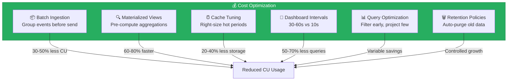

### Monitoring CU Consumption

```kql
// Monitor capacity usage for RTI workloads
.show capacity usage
| where StartTime > ago(7d)
| summarize
    IngestionCU = sumif(CU, WorkloadType == "Ingestion"),
    QueryCU = sumif(CU, WorkloadType == "Query"),
    MaterializedViewCU = sumif(CU, WorkloadType == "MaterializedView")
    by bin(StartTime, 1h)
| render timechart
    with (title="RTI CU Consumption by Workload Type")
```

### Cost Estimation by Domain

| Domain | Events/Day | Hot Cache | Est. Monthly CU |
|--------|-----------|-----------|-----------------|
| Casino Slot Telemetry | 5M | 7 days | 15-20% of F64 |
| Casino Compliance | 50K | 30 days | 2-5% of F64 |
| NOAA Observations | 2M | 14 days | 8-12% of F64 |
| EPA Sensor Data | 500K | 7 days | 3-5% of F64 |
| DOI Earthquake Events | 100K | 30 days | 1-2% of F64 |
| DOT/FAA Flight Data | 1M | 3 days | 5-8% of F64 |

> 📝 **Note**: Percentages are approximate for an F64 capacity. Actual consumption depends on query complexity, dashboard refresh rates, and data volumes. Monitor with the capacity metrics app.

---

## 📚 References

| Resource | URL |
|----------|-----|
| Real-Time Intelligence Overview | https://learn.microsoft.com/fabric/real-time-intelligence/overview |
| Eventstream Documentation | https://learn.microsoft.com/fabric/real-time-intelligence/event-streams/overview |
| Eventhouse Documentation | https://learn.microsoft.com/fabric/real-time-intelligence/eventhouse |
| KQL Reference | https://learn.microsoft.com/kusto/query/ |
| Real-Time Dashboards | https://learn.microsoft.com/fabric/real-time-intelligence/dashboard-real-time-create |
| Data Activator | https://learn.microsoft.com/fabric/real-time-intelligence/data-activator/data-activator-introduction |
| Materialized Views | https://learn.microsoft.com/kusto/management/materialized-views/materialized-view-overview |
| Caching Policy | https://learn.microsoft.com/kusto/management/cache-policy |

---

## 🔗 Related Documents

- [Fabric IQ](fabric-iq.md) -- Natural language querying for RTI data
- [AI Copilot Configuration](ai-copilot-configuration.md) -- KQL Copilot for Eventhouse
- [Data Mesh Enterprise Patterns](data-mesh-enterprise-patterns.md) -- Cross-domain RTI architecture
- [Architecture](../ARCHITECTURE.md) -- System architecture overview
- [Migration & RTI Research](../MIGRATION_AND_RTI_RESEARCH.md) -- Migration paths and RTI research notes

---

> 📝 **Document Metadata**
> - **Author**: Documentation Team
> - **Reviewers**: Data Engineering, Streaming Team, Compliance
> - **Classification**: Internal
> - **Next Review**: 2026-06-12
