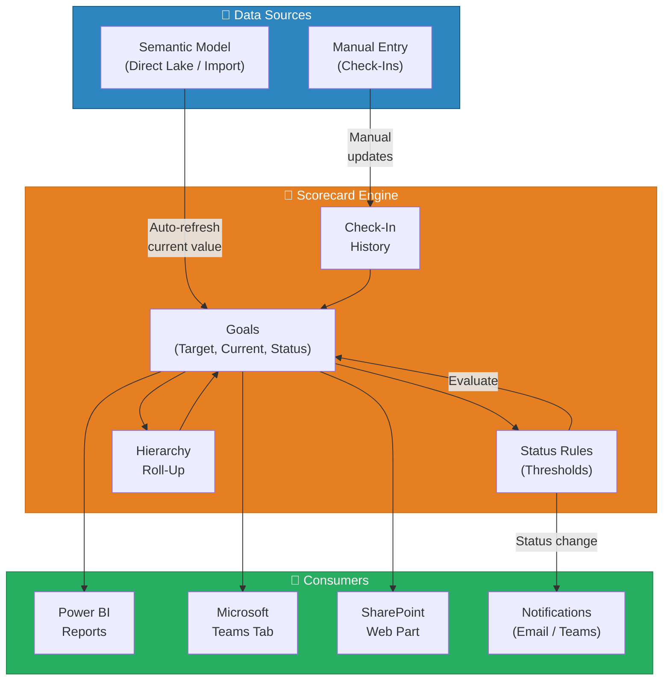
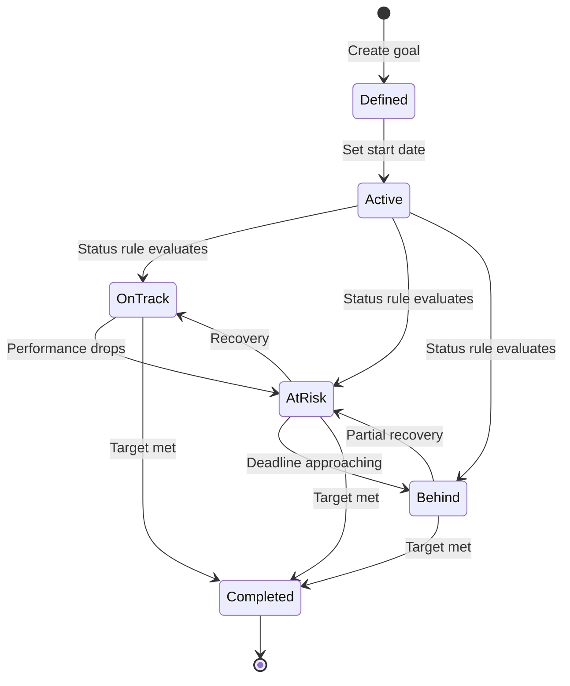
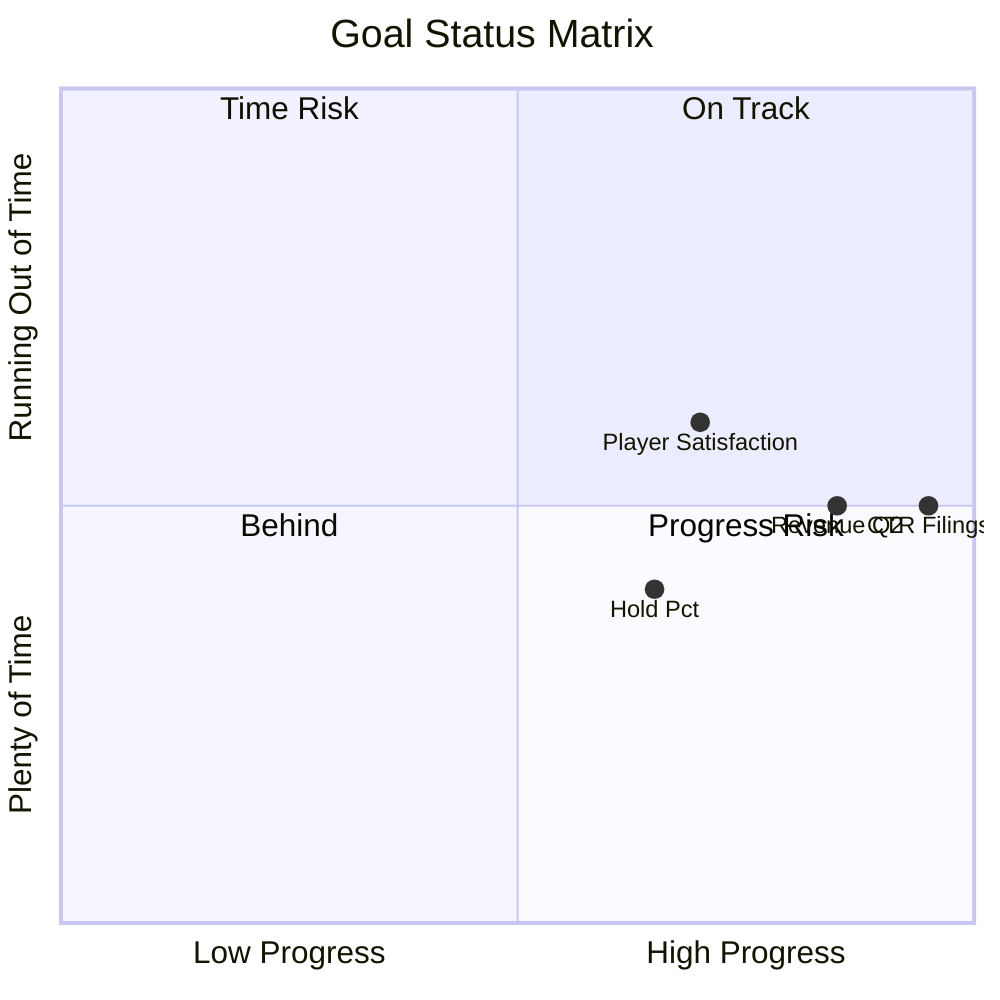
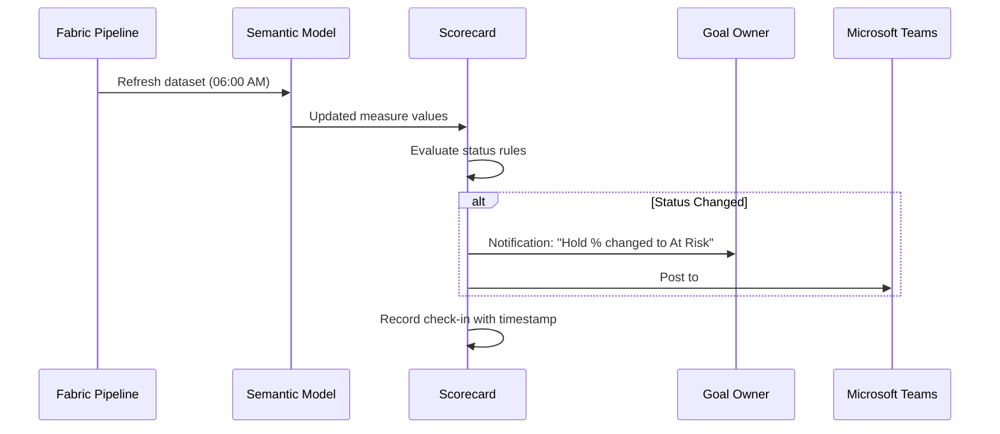
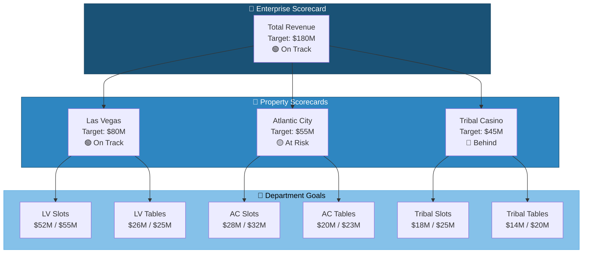
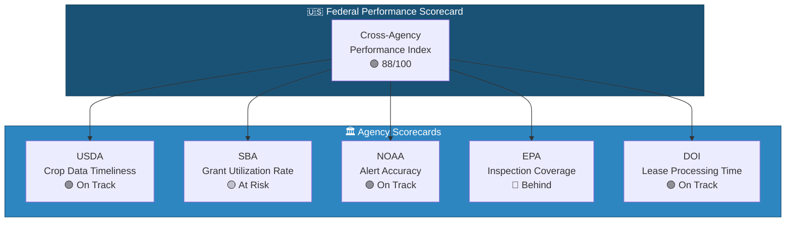

# 🎯 Scorecards & Metrics - KPI Goal Tracking

<div align="center" markdown>

**Track Organizational Goals with Automated Status, Check-Ins, and Hierarchical Scorecards**


</div>

---

**Last Updated:** `2026-04-21` | **Version:** 1.0.0

---

## 🎯 Overview

Scorecards and Metrics in Power BI / Microsoft Fabric provide a structured, goal-tracking layer on top of your semantic models. They transform raw measures into organizational objectives with targets, owners, timelines, and automated status indicators. Instead of interpreting a number on a dashboard, stakeholders see whether they are **on track**, **at risk**, or **behind** — with context on who is responsible and what actions are needed.

### Why Scorecards Matter

Dashboards show what happened. Scorecards show whether what happened **is good enough**. They bridge the gap between data and accountability.

### Key Capabilities

| Capability | Description |
|-----------|-------------|
| **Goal Tracking** | Define numeric targets with start/current/target values and deadlines |
| **Status Rules** | Automated on-track / at-risk / behind classification based on configurable thresholds |
| **Check-Ins** | Manual or automated periodic updates with notes and evidence |
| **Connected Goals** | Link child goals to parent goals; roll-up status across hierarchies |
| **Dataset Connection** | Pull current values directly from Power BI semantic model measures |
| **Notifications** | Alert goal owners when status changes or check-ins are due |
| **Embedding** | Embed scorecards in Power BI reports, Teams tabs, and SharePoint |

### Scorecards vs Dashboards

| Aspect | Dashboard | Scorecard |
|--------|-----------|-----------|
| **Focus** | What is the current value? | Are we meeting our target? |
| **Owner** | No explicit ownership | Every goal has an assigned owner |
| **Timeline** | Point-in-time or trend | Explicit start date → target date |
| **Status** | Inferred by the viewer | System-calculated (on-track/at-risk/behind) |
| **Accountability** | Passive display | Active check-ins with notes |
| **Hierarchy** | Flat or drill-down visuals | Nested goals with roll-up logic |

---

## 🏗️ Architecture

### Scorecard Data Flow



### Goal Lifecycle



---

## ⚙️ Creating Scorecards

### Scorecard Structure

```
Scorecard: Q2 2026 Casino Operations
├── Goal: Monthly Revenue Target
│   ├── Current: $42.3M
│   ├── Target: $45.0M
│   ├── Status: At Risk (94%)
│   ├── Owner: VP Operations
│   ├── Connected Measure: [Total Revenue] from Semantic Model
│   └── Due: 2026-06-30
├── Goal: Hold Percentage Target
│   ├── Current: 8.2%
│   ├── Target: 8.5%
│   ├── Status: Behind (96.5%)
│   ├── Owner: Floor Operations Director
│   └── Due: 2026-06-30
├── Goal: Compliance Filing Completeness
│   ├── Current: 100%
│   ├── Target: 100%
│   ├── Status: On Track (100%)
│   ├── Owner: BSA Compliance Officer
│   └── Due: Ongoing
└── Goal: Player Satisfaction Score
    ├── Current: 4.2
    ├── Target: 4.5
    ├── Status: At Risk (93.3%)
    ├── Owner: Guest Experience Director
    └── Due: 2026-06-30
```

### Connecting Goals to Semantic Model Measures

Goals can pull their current value automatically from a Power BI semantic model measure:

| Goal | Connected Measure | Dataset | Refresh Frequency |
|------|------------------|---------|-------------------|
| Monthly Revenue | `[Total Revenue]` | Casino Operations Model | Daily |
| Hold % | `[Hold %]` | Casino Operations Model | Daily |
| CTR Filing Count | `[CTR Filing Count]` | Compliance Model | Daily |
| Player Satisfaction | `[Avg Survey Score]` | Guest Experience Model | Weekly |

---

## 📏 Status Rules and Scoring

### Built-In Status Rules

| Status | Icon | Default Rule | Meaning |
|--------|------|-------------|---------|
| **On Track** | 🟢 | Current ≥ 90% of target | Proceeding as planned |
| **At Risk** | 🟡 | Current between 70-89% of target | May not meet target without intervention |
| **Behind** | 🔴 | Current < 70% of target | Unlikely to meet target; action required |
| **Not Started** | ⚪ | No current value recorded | Goal defined but not yet active |
| **Completed** | ✅ | Current ≥ 100% of target | Goal achieved |

### Custom Status Rules

Custom rules allow domain-specific thresholds:

```
Goal: Hold Percentage Target
├── On Track:  current_hold >= 8.3%  (within 0.2% of target)
├── At Risk:   current_hold >= 7.8%  (within 0.7% of target)
├── Behind:    current_hold < 7.8%   (more than 0.7% below target)
└── Target:    8.5%
```

```
Goal: Compliance Filing Completeness
├── On Track:  filed / required == 100%
├── At Risk:   filed / required >= 95%
├── Behind:    filed / required < 95%
└── Note: Compliance has zero tolerance — At Risk triggers immediate review
```

### Time-Weighted Status

For goals with deadlines, status considers both progress and remaining time:



---

## 🔄 Automated Check-Ins

### Check-In Sources

| Source | How It Works | Frequency |
|--------|-------------|-----------|
| **Dataset Refresh** | Current value pulled from semantic model measure on refresh | Matches dataset refresh schedule |
| **Manual Entry** | Goal owner enters value and notes via Scorecard UI | On-demand or scheduled |
| **Power Automate** | Flow triggers check-in via API when external event occurs | Event-driven |
| **REST API** | Programmatic check-in from pipelines or notebooks | As needed |

### Automated Check-In Flow



### Check-In History Example

| Date | Value | Status | Note | Updated By |
|------|-------|--------|------|-----------|
| 2026-04-21 | $42.3M | 🟡 At Risk | Below target pace; weekend promotion planned | Auto (dataset) |
| 2026-04-14 | $39.1M | 🟡 At Risk | Slow week due to maintenance downtime | VP Operations |
| 2026-04-07 | $28.5M | 🟢 On Track | Strong opening week for Q2 | Auto (dataset) |
| 2026-04-01 | $0 | ⚪ Not Started | Q2 begins | System |

---

## 🔗 Connected Goals and Hierarchies

### Hierarchical Scorecard Structure



### Roll-Up Logic

| Roll-Up Method | Description | Best For |
|---------------|-------------|----------|
| **Weighted Average** | Parent status = weighted average of children based on target amounts | Revenue, financial goals |
| **Worst Case** | Parent takes the worst status among children | Compliance, safety goals |
| **Average** | Simple average of child statuses | Balanced scorecards |
| **Custom** | Business-defined formula | Complex multi-factor goals |

---

## 🎰 Casino Implementation

### Monthly Hold% Targets by Property

```
Scorecard: FY2026 Hold Percentage Targets
├── Enterprise Hold%: Target 8.5%
│   ├── Las Vegas Properties
│   │   ├── Slot Hold%: Current 8.8% | Target 8.5% | 🟢 On Track
│   │   └── Table Hold%: Current 15.2% | Target 15.0% | 🟢 On Track
│   ├── Atlantic City Properties
│   │   ├── Slot Hold%: Current 8.1% | Target 8.5% | 🟡 At Risk
│   │   └── Table Hold%: Current 14.3% | Target 15.0% | 🟡 At Risk
│   └── Tribal Properties
│       ├── Slot Hold%: Current 7.4% | Target 8.5% | 🔴 Behind
│       └── Table Hold%: Current 13.8% | Target 15.0% | 🔴 Behind
```

### Coin-In Goals per Property

Coin-in (total amount wagered) is the primary volume metric for slot operations:

| Property | Monthly Target | Current | % of Target | Status |
|----------|---------------|---------|-------------|--------|
| Las Vegas Main | $120M | $98M | 81.7% | 🟢 On Track (pace) |
| Atlantic City | $85M | $58M | 68.2% | 🟡 At Risk |
| Tribal Resort | $45M | $24M | 53.3% | 🔴 Behind |
| Reno Property | $30M | $23M | 76.7% | 🟢 On Track (pace) |

### Compliance Filing Completeness

Zero-tolerance scorecard for regulatory filings:

```
Scorecard: Compliance Filing Completeness (April 2026)
├── CTR Filings: 47/47 filed | 100% | 🟢 On Track
├── SAR Filings: 12/12 filed | 100% | 🟢 On Track
├── W-2G Filings: 2,341/2,341 filed | 100% | 🟢 On Track
├── Title 31 Training: 98% complete | Target 100% | 🟡 At Risk
│   └── Note: 3 new hires pending training completion by 4/30
└── Audit Readiness Score: 94/100 | Target 95 | 🟡 At Risk
    └── Note: Documentation gap in cage count procedures
```

---

## 🏛️ Federal Agency Implementation

### Agency Performance Metrics (Cross-Agency)



### Grant Utilization Rate (SBA)

| Program | Allocated | Disbursed | Utilization | Target | Status |
|---------|-----------|-----------|-------------|--------|--------|
| 7(a) Loans | $28.6B | $24.1B | 84.3% | 90% | 🟡 At Risk |
| 504 Loans | $7.5B | $6.9B | 92.0% | 90% | 🟢 On Track |
| Microloans | $85M | $71M | 83.5% | 85% | 🟡 At Risk |
| SBIR Grants | $3.2B | $2.8B | 87.5% | 90% | 🟡 At Risk |
| Disaster Loans | $2.1B | $1.9B | 90.5% | 85% | 🟢 On Track |

### SLA Tracking (NOAA Weather Services)

| SLA Metric | Target | Current | Status |
|-----------|--------|---------|--------|
| Storm alert issuance within 15 min of detection | 98% | 99.2% | 🟢 On Track |
| Forecast accuracy (24-hour) | 85% | 87.3% | 🟢 On Track |
| Data publication latency (hourly obs) | < 30 min | 22 min avg | 🟢 On Track |
| API uptime | 99.9% | 99.7% | 🟡 At Risk |
| Station reporting completeness | 95% | 91.2% | 🔴 Behind |

### EPA Inspection Coverage

Goals tracking the percentage of regulated facilities inspected within the required cycle:

```
Scorecard: EPA Inspection Coverage FY2026
├── TRI Facilities: 72% inspected | Target 85% by Q4 | 🔴 Behind
│   └── Note: Staff shortages in Region 4; contractor augmentation approved
├── Clean Water Act: 88% inspected | Target 90% | 🟡 At Risk
├── Clean Air Act: 91% inspected | Target 90% | 🟢 On Track
└── RCRA Hazardous Waste: 79% inspected | Target 85% | 🟡 At Risk
```

---

## 🔐 Security

### Access Control

| Level | Who Can View | Who Can Edit |
|-------|-------------|-------------|
| **Scorecard** | Workspace viewers and above | Workspace contributors and above |
| **Goals** | Inherits from scorecard | Goal owner + scorecard editors |
| **Check-Ins** | Same as goal viewers | Goal owner only (or delegates) |
| **Connected Measures** | Subject to semantic model RLS | N/A (read-only connection) |

### Security Best Practices

| Practice | Description |
|----------|-------------|
| **RLS on connected datasets** | Ensure semantic model measures respect RLS so scorecards show filtered results |
| **Separate compliance scorecards** | Keep compliance goals in a restricted workspace with limited membership |
| **Audit check-in history** | Monitor who updates goals and when for accountability |
| **Workspace isolation** | Use separate workspaces for property-level vs enterprise-level scorecards |

---

## ⚠️ Limitations

| Limitation | Details | Workaround |
|-----------|---------|-----------|
| **No custom calculated metrics** | Cannot define formulas within the scorecard itself | Pre-compute in the semantic model; connect goal to the computed measure |
| **Limited roll-up logic** | Built-in roll-ups are simple (average, worst); no weighted custom formulas | Use a Power BI measure for weighted roll-up; connect parent goal to that measure |
| **Manual check-in friction** | No mobile app for check-ins; must use web UI or API | Use Power Automate flows triggered from Forms or Teams for mobile-friendly entry |
| **No conditional formatting** | Status colors are fixed (green/yellow/red) | Embed scorecards in Power BI reports where conditional formatting is available |
| **50 goals per scorecard** | Maximum of 50 goals in a single scorecard | Create linked scorecards (property-level → enterprise roll-up) |
| **No historical trend charts** | Scorecard UI does not show check-in history as a trend chart | Build a companion Power BI report page that visualizes check-in history from the API |
| **Dataset refresh dependency** | Automated check-ins only update when the connected dataset refreshes | Align dataset refresh schedules with scorecard check-in cadence |
| **Notification limits** | Notifications are per-goal; no digest or summary notification | Use Power Automate to aggregate status changes into a daily digest |

---

## 📚 References

| Resource | URL |
|----------|-----|
| Metrics in Power BI | https://learn.microsoft.com/power-bi/create-reports/service-goals-introduction |
| Create Scorecards | https://learn.microsoft.com/power-bi/create-reports/service-goals-create |
| Connected Goals | https://learn.microsoft.com/power-bi/create-reports/service-goals-create-connected |
| Automated Status Rules | https://learn.microsoft.com/power-bi/create-reports/service-goals-status-rules |
| Check-Ins and Notes | https://learn.microsoft.com/power-bi/create-reports/service-goals-check-in |
| Scorecards REST API | https://learn.microsoft.com/rest/api/power-bi/scorecards |

---

## 🔗 Related Documents

- [Direct Lake](direct-lake.md) -- Semantic model connectivity powering goal current values
- [Paginated Reports](paginated-reports.md) -- Print-ready compliance reports complementing scorecards
- [Composite Models](composite-models.md) -- Mixing storage modes for scorecard data sources
- [Fabric IQ](fabric-iq.md) -- Natural language queries about goal status
- [Workspace Monitoring](workspace-monitoring.md) -- Capacity and usage monitoring alongside KPIs
- [Architecture](../ARCHITECTURE.md) -- System architecture overview
- [Security](../SECURITY.md) -- Security and compliance framework

---

> 📝 **Document Metadata**
> - **Author**: Documentation Team
> - **Reviewers**: Data Engineering, BI Team, Operations
> - **Classification**: Internal
> - **Next Review**: 2026-07-21
