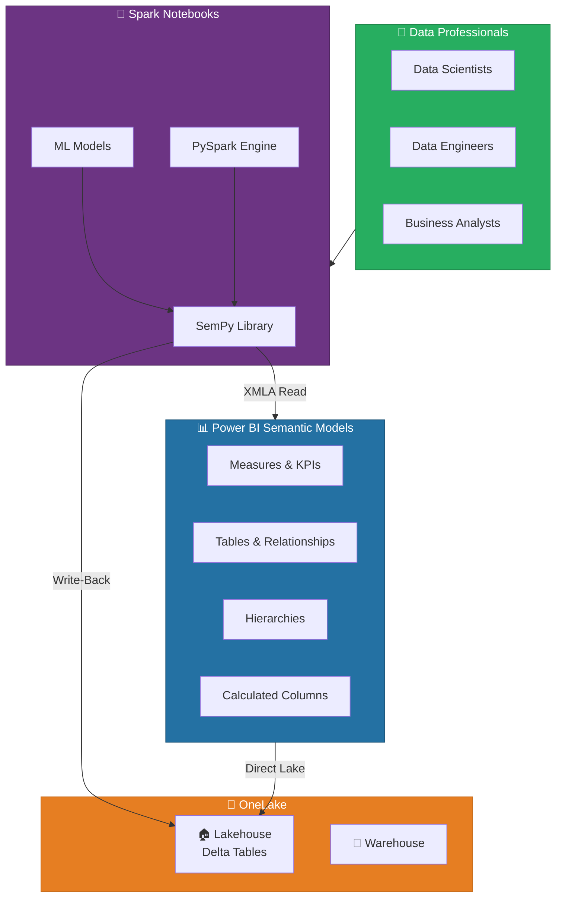
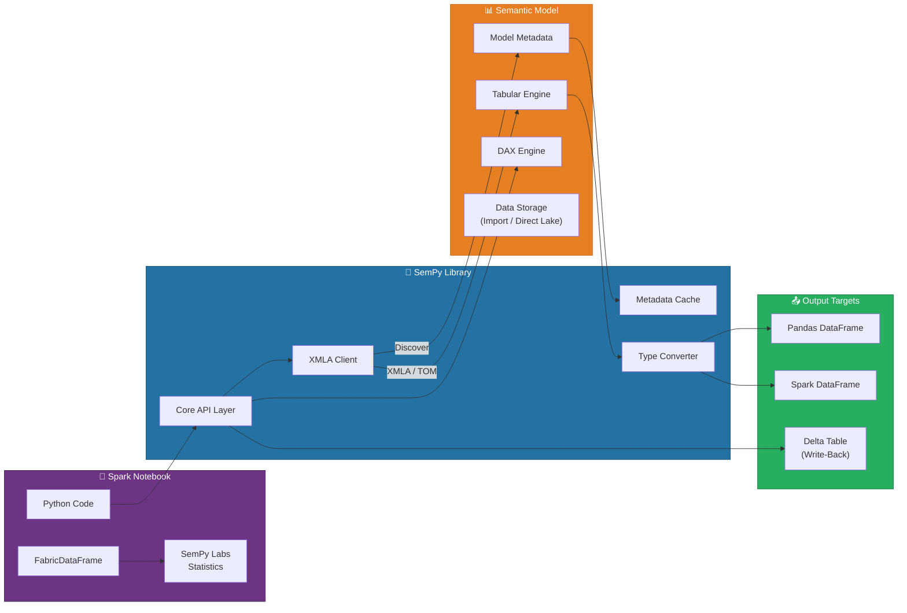
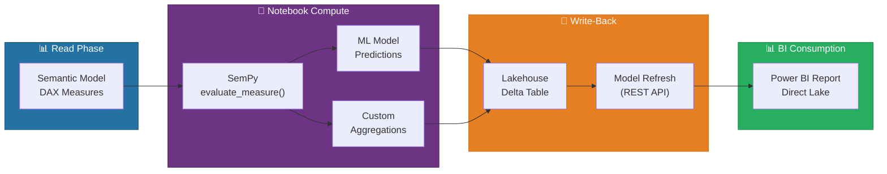

# 🔗 Semantic Link - Bridge Spark Notebooks and Power BI

<div align="center" markdown>

**Unlock Power BI Semantic Models from PySpark Notebooks with SemPy**


</div>

---

**Last Updated:** `2026-04-13` | **Version:** 1.0.0

---

## 🎯 Overview

Semantic Link is Microsoft Fabric's integration layer that bridges PySpark notebooks and Power BI semantic models, enabling data scientists and engineers to programmatically interact with curated business logic defined in Power BI. Built on the **SemPy** (Semantic Link Python) library, which reached **General Availability in February 2026**, Semantic Link lets you evaluate DAX measures, read model tables, discover relationships, and run statistical analyses -- all from within a Fabric notebook using familiar Python and Spark APIs.

Rather than duplicating business logic in notebooks, Semantic Link lets you reuse the measures, hierarchies, and relationships already defined in Power BI semantic models. This eliminates the common disconnect between BI definitions and data science workflows, where analysts maintain one set of KPIs in Power BI and data scientists re-implement them in Python.

### Key Capabilities

| Capability | Description |
|-----------|-------------|
| **FabricDataFrame** | A Pandas DataFrame subclass enriched with semantic model metadata (types, hierarchies, annotations) |
| **DAX Evaluation** | Execute any DAX expression against a published semantic model and receive results as a DataFrame |
| **Table Reading** | Read entire tables from semantic models into Spark or Pandas DataFrames for analysis |
| **Model Discovery** | List datasets, tables, measures, columns, and hierarchies programmatically |
| **Statistical Analysis** | Detect relationships, find outliers, compute correlations, and suggest data quality improvements |
| **Write-Back** | Write notebook results back to Lakehouse Delta tables and trigger semantic model refresh |
| **Cross-Model Queries** | Evaluate measures across multiple semantic models for unified analytics |

### Why Semantic Link Matters

| Challenge | Semantic Link Solution |
|-----------|----------------------|
| KPI definitions duplicated in notebooks and Power BI | Evaluate DAX measures directly -- single source of truth |
| Manual data export from Power BI for analysis | Read tables programmatically into Spark DataFrames |
| No statistical tooling on semantic models | SemPy Labs provides correlation, outlier, and relationship detection |
| Disconnected notebook insights from BI | Write-back pattern pushes results to Lakehouse and refreshes models |
| Hard to discover available datasets | `list_datasets()` and `list_tables()` for workspace-wide discovery |

### Where Semantic Link Fits



---

## 🏗️ Architecture

Semantic Link operates as a Python client library that communicates with Power BI semantic models through the **XMLA endpoint** -- the same protocol used by Analysis Services tools. Under the hood, SemPy translates Python API calls into XMLA requests, executes DAX or MDX queries against the in-memory Tabular model engine, and returns results as Pandas or Spark DataFrames.

### Component Architecture



### Data Flow: Read Path

1. **Notebook code** calls `sempy.fabric.evaluate_measure()` or `read_table()` with a dataset name and DAX/table reference
2. **SemPy** resolves the dataset within the current workspace (or a specified workspace) and caches the model metadata
3. **XMLA Client** sends the DAX query to the semantic model's **Tabular engine** via the workspace XMLA endpoint
4. **Tabular engine** evaluates the query against in-memory data (Import mode) or pushes it to OneLake (Direct Lake mode)
5. **Type converter** maps Analysis Services data types to Pandas/NumPy types and constructs a FabricDataFrame
6. **FabricDataFrame** is returned to the notebook with semantic annotations (column descriptions, format strings, hierarchies)

### Data Flow: Write-Back Path

1. **Notebook computes** results using SemPy data + ML models + custom logic
2. **Results are written** to a Lakehouse Delta table using standard Spark write operations
3. **Semantic model refresh** is triggered programmatically via the Fabric REST API or scheduled refresh
4. **Power BI reports** automatically reflect the new data through Direct Lake connectivity

### Authentication and Security

Semantic Link inherits the calling user's Fabric identity for all operations:

| Aspect | Details |
|--------|---------|
| **Authentication** | Automatic via notebook user identity (Entra ID) |
| **Authorization** | Requires at least **Read** permission on the target semantic model |
| **XMLA Endpoint** | Uses the workspace XMLA read/write endpoint (enabled by default on Premium/Fabric capacities) |
| **Row-Level Security** | DAX evaluations respect RLS roles defined in the semantic model |
| **Write-Back** | Requires **Contributor** role on the target Lakehouse for Delta writes |
| **Cross-Workspace** | Supported -- specify workspace name or ID in API calls |

> 💡 **Tip**: Semantic Link respects Row-Level Security (RLS) defined in the semantic model. When a data scientist evaluates a measure, they see only the data their identity is authorized to access. This makes it safe to share notebooks across teams without exposing restricted data.

---

## ⚙️ Core API

The SemPy library is pre-installed in Fabric Spark runtimes (Runtime 1.3+). No additional installation is required.

### Installation and Import

```python
# SemPy is pre-installed in Fabric notebooks -- no pip install needed
import sempy.fabric as fabric

# For statistical functions (SemPy Labs)
from sempy import labs as sempy_labs

# For FabricDataFrame utilities
from sempy.fabric import FabricDataFrame
```

### list_datasets() -- Discover Available Models

List all semantic models (datasets) in the current workspace or a specified workspace.

```python
# List datasets in current workspace
datasets = fabric.list_datasets()
print(datasets[["Dataset Name", "Dataset Id", "Configured By"]])

# List datasets in a specific workspace
datasets = fabric.list_datasets(workspace="Sales Analytics Workspace")
```

**Returns:** DataFrame with columns `Dataset Name`, `Dataset Id`, `Configured By`, `Is Refreshable`, `Is Effective Identity Required`, etc.

### list_tables() -- Explore Model Tables

```python
# List all tables in a semantic model
tables = fabric.list_tables(dataset="Casino Floor Analytics")
print(tables[["Table Name", "Is Hidden", "Description"]])
```

### list_measures() -- Discover Measures

```python
# List all DAX measures in a model
measures = fabric.list_measures(dataset="Casino Floor Analytics")
print(measures[["Measure Name", "Table Name", "Expression", "Description"]])
```

### read_table() -- Read Tables into DataFrames

Read a complete table from a semantic model into a Pandas DataFrame. Supports column selection and row limits.

```python
# Read entire table
df_slots = fabric.read_table(
    dataset="Casino Floor Analytics",
    table="DimSlotMachine"
)

# Read with column selection
df_slots = fabric.read_table(
    dataset="Casino Floor Analytics",
    table="DimSlotMachine",
    columns=["MachineId", "MachineName", "Zone", "Denomination"]
)

# Read from another workspace
df_remote = fabric.read_table(
    dataset="Corporate Finance",
    table="DimAccount",
    workspace="Finance Workspace"
)
```

### evaluate_measure() -- Execute DAX Measures

Evaluate one or more DAX measures with optional groupby columns and filters. This is the primary method for reusing Power BI business logic in notebooks.

```python
# Evaluate a single measure grouped by dimension
result = fabric.evaluate_measure(
    dataset="Casino Floor Analytics",
    measure="Total Coin In",
    group_by_columns=["DimSlotMachine[Zone]", "DimDate[MonthName]"],
    filters={
        "DimDate[Year]": [2026],
        "DimSlotMachine[Denomination]": ["$0.25", "$1.00"]
    }
)
print(result)
```

```python
# Evaluate multiple measures
result = fabric.evaluate_measure(
    dataset="Casino Floor Analytics",
    measure=["Total Coin In", "Total Coin Out", "Net Win", "Hold Percentage"],
    group_by_columns=["DimSlotMachine[Zone]"]
)
```

### evaluate_dax() -- Run Arbitrary DAX

Execute any DAX query against a semantic model. More flexible than `evaluate_measure()` but requires DAX knowledge.

```python
# Run a custom DAX query
dax_query = """
EVALUATE
SUMMARIZECOLUMNS(
    DimSlotMachine[Zone],
    DimDate[MonthName],
    "Revenue", [Net Win],
    "AvgHold", AVERAGE(FactSlotActivity[HoldPercentage]),
    "MachineCount", DISTINCTCOUNT(FactSlotActivity[MachineId])
)
ORDER BY [Revenue] DESC
"""

result = fabric.evaluate_dax(
    dataset="Casino Floor Analytics",
    dax_string=dax_query
)
```

```python
# Time intelligence query
dax_query = """
EVALUATE
ADDCOLUMNS(
    VALUES(DimDate[MonthName]),
    "Current Month Revenue", [Net Win],
    "Prior Month Revenue", CALCULATE([Net Win], DATEADD(DimDate[Date], -1, MONTH)),
    "MoM Growth %", DIVIDE(
        [Net Win] - CALCULATE([Net Win], DATEADD(DimDate[Date], -1, MONTH)),
        CALCULATE([Net Win], DATEADD(DimDate[Date], -1, MONTH))
    )
)
"""

growth = fabric.evaluate_dax(
    dataset="Casino Floor Analytics",
    dax_string=dax_query
)
```

### FabricDataFrame -- Semantically Enriched DataFrame

FabricDataFrame extends Pandas DataFrame with metadata from the semantic model, including column descriptions, format strings, and relationship info.

```python
# Read a table as FabricDataFrame
fdf = FabricDataFrame(
    fabric.read_table(dataset="Casino Floor Analytics", table="FactSlotActivity")
)

# Access semantic metadata
print(fdf.semantic_annotations)

# Auto-inferred column types (currency, percentage, date, etc.)
print(fdf.column_data_types)
```

---

## 🧪 Statistical Functions

SemPy Labs provides statistical analysis functions that operate on FabricDataFrames and semantic models. These functions leverage the semantic metadata to produce more meaningful statistical results.

### find_relationships() -- Detect Table Relationships

Discover potential join relationships between tables based on column names, data types, and value overlap.

```python
from sempy import labs as sempy_labs

# Detect relationships between Lakehouse tables
relationships = sempy_labs.find_relationships(
    tables={
        "slot_activity": df_slot_activity,
        "machines": df_machines,
        "zones": df_zones
    },
    coverage_threshold=0.8,
    similarity_threshold=0.7
)

print(relationships[["From Table", "From Column", "To Table", "To Column", "Confidence"]])
```

**Output example:**

| From Table | From Column | To Table | To Column | Confidence |
|-----------|-------------|----------|-----------|------------|
| slot_activity | machine_id | machines | machine_id | 0.99 |
| machines | zone_id | zones | zone_id | 0.97 |
| slot_activity | date_key | dates | date_key | 0.95 |

### suggest_relationships() -- AI-Powered Relationship Suggestions

Goes beyond column-name matching to suggest relationships using semantic similarity and value distribution analysis.

```python
# Get AI-suggested relationships for a semantic model
suggestions = sempy_labs.suggest_relationships(
    dataset="Casino Floor Analytics",
    include_many_to_many=True
)

for _, row in suggestions.iterrows():
    print(f"{row['From Table']}.{row['From Column']} -> "
          f"{row['To Table']}.{row['To Column']} "
          f"(Confidence: {row['Confidence']:.2f})")
```

### detect_outliers() -- Statistical Outlier Detection

Identify outlier values in numeric columns using IQR, Z-score, or isolation forest methods.

```python
# Detect outliers in slot machine revenue data
outliers = sempy_labs.detect_outliers(
    data=df_slot_activity,
    column="coin_in",
    method="iqr",         # Options: "iqr", "zscore", "isolation_forest"
    threshold=1.5          # IQR multiplier (default 1.5)
)

print(f"Found {outliers['is_outlier'].sum()} outlier transactions")
print(outliers[outliers["is_outlier"]][["machine_id", "coin_in", "timestamp"]])
```

```python
# Multi-column outlier detection with Z-score
outliers = sempy_labs.detect_outliers(
    data=df_slot_activity,
    column=["coin_in", "coin_out", "session_duration_minutes"],
    method="zscore",
    threshold=3.0
)
```

### compute_correlation() -- Correlation Analysis

Compute pairwise correlations with semantic-aware column selection.

```python
# Correlation matrix for slot performance metrics
corr_matrix = sempy_labs.compute_correlation(
    data=df_slot_performance,
    columns=["coin_in", "coin_out", "hold_pct", "games_played",
             "avg_bet", "session_duration_minutes", "error_count"],
    method="pearson"  # Options: "pearson", "spearman", "kendall"
)

print(corr_matrix)
```

### list_relationship_violations() -- Data Quality Checks

Identify orphan records that violate expected referential integrity.

```python
# Find slot activity records with no matching machine
violations = sempy_labs.list_relationship_violations(
    left_table=df_slot_activity,
    left_column="machine_id",
    right_table=df_machines,
    right_column="machine_id"
)

print(f"Found {len(violations)} orphan activity records")
```

---

## 🔄 Write-Back Patterns

Semantic Link supports a translytical workflow where notebook computations are written back to OneLake and surfaced in Power BI. The write-back capability reached **General Availability in March 2026**, enabling production-grade scenarios.

### Pattern 1: Compute KPIs in Notebook, Surface in Power BI



### Write-Back Implementation

```python
import sempy.fabric as fabric
from pyspark.sql import SparkSession

spark = SparkSession.builder.getOrCreate()

# Step 1: Read measures from semantic model
revenue_by_zone = fabric.evaluate_measure(
    dataset="Casino Floor Analytics",
    measure=["Net Win", "Hold Percentage", "Games Played"],
    group_by_columns=["DimSlotMachine[Zone]", "DimDate[Date]"]
)

# Step 2: Compute ML predictions (e.g., next-day revenue forecast)
from sklearn.linear_model import LinearRegression
import pandas as pd

# ... (ML model training and prediction logic)
revenue_by_zone["predicted_next_day_revenue"] = model.predict(features)

# Step 3: Write results to Lakehouse Delta table
df_spark = spark.createDataFrame(revenue_by_zone)
df_spark.write.format("delta") \
    .mode("overwrite") \
    .option("overwriteSchema", "true") \
    .save("Tables/gold_revenue_predictions")

# Step 4: Trigger semantic model refresh via REST API
import requests

fabric.refresh_dataset(
    dataset="Casino Floor Analytics",
    workspace="Casino Analytics"
)
print("Write-back complete. Semantic model refresh triggered.")
```

### Pattern 2: Data Quality Feedback Loop

```python
# Detect quality issues in semantic model data
measures = fabric.evaluate_measure(
    dataset="Casino Floor Analytics",
    measure="Total Coin In",
    group_by_columns=["DimSlotMachine[MachineId]", "DimDate[Date]"]
)

# Flag machines with suspiciously high revenue (potential meter error)
outliers = sempy_labs.detect_outliers(
    data=measures,
    column="Total Coin In",
    method="zscore",
    threshold=4.0
)

# Write quality alerts to Lakehouse for dashboard display
alerts = outliers[outliers["is_outlier"]].copy()
alerts["alert_type"] = "revenue_anomaly"
alerts["alert_timestamp"] = pd.Timestamp.now()
alerts["severity"] = "high"

df_alerts = spark.createDataFrame(alerts)
df_alerts.write.format("delta") \
    .mode("append") \
    .save("Tables/gold_data_quality_alerts")
```

### Pattern 3: Cross-Model Aggregation

```python
# Pull data from multiple semantic models and combine
casino_rev = fabric.evaluate_measure(
    dataset="Casino Floor Analytics",
    measure="Net Win",
    group_by_columns=["DimDate[Date]"]
)

hotel_rev = fabric.evaluate_measure(
    dataset="Hotel Operations",
    measure="Room Revenue",
    group_by_columns=["DimDate[Date]"]
)

fb_rev = fabric.evaluate_measure(
    dataset="Food & Beverage",
    measure="Total F&B Revenue",
    group_by_columns=["DimDate[Date]"]
)

# Merge into unified property-level view
import pandas as pd
property_revenue = casino_rev.merge(hotel_rev, on="DimDate[Date]", how="outer") \
                              .merge(fb_rev, on="DimDate[Date]", how="outer")
property_revenue["Total Property Revenue"] = (
    property_revenue["Net Win"].fillna(0) +
    property_revenue["Room Revenue"].fillna(0) +
    property_revenue["Total F&B Revenue"].fillna(0)
)

# Write to Lakehouse
df_prop = spark.createDataFrame(property_revenue)
df_prop.write.format("delta") \
    .mode("overwrite") \
    .save("Tables/gold_property_revenue_unified")
```

---

## 🎰 Casino Implementation

### Slot Performance Analysis with DAX Measures

Evaluate production DAX measures directly in notebooks to perform statistical analysis that goes beyond what Power BI visuals can offer.

```python
import sempy.fabric as fabric
from sempy import labs as sempy_labs
import pandas as pd

# Evaluate slot KPIs by zone and denomination
slot_kpis = fabric.evaluate_measure(
    dataset="Casino Floor Analytics",
    measure=[
        "Total Coin In",
        "Total Coin Out",
        "Net Win",
        "Hold Percentage",
        "Theoretical Hold",
        "Games Played",
        "Avg Bet Size"
    ],
    group_by_columns=[
        "DimSlotMachine[Zone]",
        "DimSlotMachine[Denomination]",
        "DimSlotMachine[GameTitle]"
    ],
    filters={
        "DimDate[Year]": [2026],
        "DimDate[Quarter]": ["Q1"]
    }
)

print(f"Retrieved {len(slot_kpis)} rows of KPI data")
print(slot_kpis.head(10))
```

### Hold Percentage Variance Analysis

```python
# Compare actual vs theoretical hold by game title
hold_analysis = slot_kpis.copy()
hold_analysis["Hold Variance"] = (
    hold_analysis["Hold Percentage"] - hold_analysis["Theoretical Hold"]
)
hold_analysis["Variance Pct"] = (
    hold_analysis["Hold Variance"] / hold_analysis["Theoretical Hold"] * 100
)

# Flag machines with hold variance exceeding NIGC MICS thresholds
# Regulatory requirement: investigate variance > 3% from theoretical
flagged = hold_analysis[abs(hold_analysis["Variance Pct"]) > 3.0]
print(f"\n⚠️ {len(flagged)} game titles exceed 3% hold variance threshold:")
print(flagged[["DimSlotMachine[GameTitle]", "Hold Percentage",
               "Theoretical Hold", "Variance Pct"]].sort_values("Variance Pct"))
```

### Anomaly Detection on Player Spending

```python
# Read player activity data
player_activity = fabric.evaluate_dax(
    dataset="Casino Floor Analytics",
    dax_string="""
    EVALUATE
    SUMMARIZECOLUMNS(
        DimPlayer[PlayerId],
        DimPlayer[TierLevel],
        DimDate[Date],
        "DailySpend", [Total Coin In],
        "SessionCount", [Session Count],
        "AvgSessionDuration", [Avg Session Duration Minutes]
    )
    """
)

# Detect spending outliers (potential SAR structuring patterns)
outliers = sempy_labs.detect_outliers(
    data=player_activity,
    column="DailySpend",
    method="isolation_forest"
)

# Flag transactions in SAR structuring range ($8,000 - $9,999)
sar_suspects = outliers[
    (outliers["DailySpend"] >= 8000) &
    (outliers["DailySpend"] < 10000) &
    (outliers["is_outlier"])
]

print(f"\n🔍 {len(sar_suspects)} players with outlier spending in SAR range:")
print(sar_suspects[["DimPlayer[PlayerId]", "DimPlayer[TierLevel]",
                     "DimDate[Date]", "DailySpend"]])

# Write SAR alerts for compliance team review
sar_suspects["alert_type"] = "sar_structuring_suspect"
sar_suspects["review_status"] = "pending"
df_sar = spark.createDataFrame(sar_suspects)
df_sar.write.format("delta").mode("append").save("Tables/gold_sar_alerts")
```

### CTR Threshold Monitoring

```python
# Evaluate CTR-triggering transactions using DAX measures
ctr_candidates = fabric.evaluate_dax(
    dataset="Casino Floor Analytics",
    dax_string="""
    EVALUATE
    FILTER(
        SUMMARIZECOLUMNS(
            DimPlayer[PlayerId],
            DimPlayer[FullName],
            DimDate[Date],
            "DailyCashIn", [Total Cash In],
            "DailyCashOut", [Total Cash Out],
            "TotalCashActivity", [Total Cash In] + [Total Cash Out]
        ),
        [TotalCashActivity] >= 10000
    )
    ORDER BY [TotalCashActivity] DESC
    """
)

print(f"📋 {len(ctr_candidates)} CTR-triggering transactions found")
```

### W-2G Jackpot Reporting

```python
# Identify W-2G reportable jackpots from semantic model
w2g_events = fabric.evaluate_dax(
    dataset="Casino Floor Analytics",
    dax_string="""
    EVALUATE
    FILTER(
        SUMMARIZECOLUMNS(
            FactJackpot[JackpotId],
            DimSlotMachine[GameTitle],
            DimSlotMachine[GameType],
            DimPlayer[PlayerId],
            DimDate[Date],
            "JackpotAmount", SUM(FactJackpot[Amount]),
            "WagerAmount", SUM(FactJackpot[WagerAmount])
        ),
        OR(
            [GameType] = "Slots" && [JackpotAmount] >= 1200,
            [GameType] = "Keno" && [JackpotAmount] >= 600,
            [GameType] = "Poker" && [JackpotAmount] >= 5000
        )
    )
    """
)

print(f"🎰 {len(w2g_events)} W-2G reportable events")
```

---

## 🏛️ Federal Agency Implementation

### 🌾 USDA: Cross-Agency Agricultural Analysis

Pull USDA production measures into Spark for cross-agency correlation analysis that combines agricultural production data with economic indicators from SBA.

```python
import sempy.fabric as fabric
from sempy import labs as sempy_labs

# Read USDA crop production measures
crop_production = fabric.evaluate_measure(
    dataset="USDA Agricultural Analytics",
    measure=[
        "Total Production Volume",
        "Yield Per Acre",
        "Planted Acreage",
        "Harvested Acreage",
        "Production Value USD"
    ],
    group_by_columns=[
        "DimCommodity[CommodityName]",
        "DimState[StateName]",
        "DimDate[Year]"
    ],
    filters={
        "DimDate[Year]": [2024, 2025, 2026]
    }
)

# Read SBA loan data for agricultural businesses
ag_loans = fabric.evaluate_measure(
    dataset="SBA Loan Analytics",
    measure=[
        "Total Loan Amount",
        "Approval Count",
        "Default Rate"
    ],
    group_by_columns=[
        "DimIndustry[NAICSCode]",
        "DimState[StateName]",
        "DimDate[Year]"
    ],
    filters={
        "DimIndustry[Sector]": ["Agriculture"],
        "DimDate[Year]": [2024, 2025, 2026]
    }
)

# Merge for cross-agency correlation
import pandas as pd
cross_agency = crop_production.merge(
    ag_loans,
    left_on=["DimState[StateName]", "DimDate[Year]"],
    right_on=["DimState[StateName]", "DimDate[Year]"],
    how="inner"
)

# Compute correlation between crop production and agricultural lending
corr = sempy_labs.compute_correlation(
    data=cross_agency,
    columns=["Production Value USD", "Total Loan Amount",
             "Yield Per Acre", "Default Rate"],
    method="spearman"
)

print("🌾 Cross-Agency Correlation (USDA Production vs SBA Lending):")
print(corr)
```

### 🌀 NOAA: Weather Impact on Agricultural Production

```python
# Read NOAA weather observations
weather = fabric.evaluate_measure(
    dataset="NOAA Weather Analytics",
    measure=[
        "Avg Temperature",
        "Total Precipitation",
        "Heating Degree Days",
        "Cooling Degree Days"
    ],
    group_by_columns=[
        "DimStation[State]",
        "DimDate[Year]",
        "DimDate[Quarter]"
    ]
)

# Correlate weather patterns with USDA crop yields
weather_crop = weather.merge(
    crop_production,
    left_on=["DimStation[State]", "DimDate[Year]"],
    right_on=["DimState[StateName]", "DimDate[Year]"],
    how="inner"
)

corr_weather = sempy_labs.compute_correlation(
    data=weather_crop,
    columns=["Avg Temperature", "Total Precipitation",
             "Yield Per Acre", "Production Value USD"],
    method="pearson"
)
print("🌀 Weather-Crop Correlation:")
print(corr_weather)
```

### ✈️ DOT: Transportation Safety Trending

```python
# DOT safety trending analysis using semantic model measures
safety_trends = fabric.evaluate_measure(
    dataset="DOT Safety Analytics",
    measure=[
        "Total Incidents",
        "Fatality Count",
        "Injury Count",
        "Incident Rate Per 100K VMT",
        "YoY Change Pct"
    ],
    group_by_columns=[
        "DimMode[TransportMode]",
        "DimDate[Year]",
        "DimDate[Quarter]"
    ]
)

# Detect trend anomalies (sudden safety deterioration)
for mode in safety_trends["DimMode[TransportMode]"].unique():
    mode_data = safety_trends[
        safety_trends["DimMode[TransportMode]"] == mode
    ].sort_values("DimDate[Year]")

    outliers = sempy_labs.detect_outliers(
        data=mode_data,
        column="Incident Rate Per 100K VMT",
        method="zscore",
        threshold=2.5
    )

    anomalies = outliers[outliers["is_outlier"]]
    if len(anomalies) > 0:
        print(f"\n⚠️ {mode}: {len(anomalies)} anomalous periods detected")
        print(anomalies[["DimDate[Year]", "DimDate[Quarter]",
                         "Incident Rate Per 100K VMT"]])
```

### 🌊 EPA: Environmental Compliance Dashboarding

```python
# Read EPA compliance measures
compliance = fabric.evaluate_measure(
    dataset="EPA Environmental Analytics",
    measure=[
        "Facilities In Compliance",
        "Facilities In Violation",
        "Compliance Rate Pct",
        "Enforcement Actions",
        "Penalty Amount USD"
    ],
    group_by_columns=[
        "DimRegion[EPARegion]",
        "DimProgram[ProgramName]",
        "DimDate[FiscalYear]"
    ]
)

# Write compliance summary to Lakehouse for executive dashboard
df_compliance = spark.createDataFrame(compliance)
df_compliance.write.format("delta") \
    .mode("overwrite") \
    .save("Tables/gold_epa_compliance_summary")

# Trigger model refresh
fabric.refresh_dataset(dataset="EPA Environmental Analytics")
print("✅ EPA compliance summary written and model refreshed")
```

### 🏔️ DOI: Park Visitation Forecasting

```python
# Read DOI visitation measures
visitation = fabric.evaluate_measure(
    dataset="DOI Parks Analytics",
    measure=[
        "Total Visitors",
        "Recreational Visitors",
        "Overnight Stays",
        "Revenue Per Visitor"
    ],
    group_by_columns=[
        "DimPark[ParkName]",
        "DimPark[ParkType]",
        "DimDate[Year]",
        "DimDate[Month]"
    ]
)

# Detect relationship between park features and visitation
park_features = fabric.read_table(
    dataset="DOI Parks Analytics",
    table="DimPark"
)

# Find hidden relationships
relationships = sempy_labs.find_relationships(
    tables={
        "visitation": visitation,
        "park_features": park_features
    },
    coverage_threshold=0.7
)
print("🏔️ Discovered relationships:")
print(relationships)
```

---

## ⚠️ Limitations

### Current Limitations

| Limitation | Details | Workaround |
|-----------|---------|------------|
| **Large model timeout** | DAX queries on very large semantic models (>10 GB Import) may time out at 5 minutes | Break queries into smaller date ranges or filter by partition |
| **Write-back requires Contributor** | Writing results to Lakehouse requires Contributor role on the Lakehouse item | Request role assignment from workspace admin |
| **No DirectQuery live connection** | Semantic Link requires Import or Direct Lake mode; DirectQuery passthrough is not supported | Convert model to Direct Lake or Import mode |
| **FabricDataFrame memory** | Large table reads load into driver memory (Pandas) which can cause OOM | Use `read_table()` with column selection, or convert to Spark DataFrame early |
| **RLS evaluation context** | Measures evaluated under RLS show only the calling user's data; no service principal bypass | Use a service account with appropriate RLS role for batch jobs |
| **Refresh API rate limits** | Semantic model refresh API is limited to 48 refreshes per day (Enhanced Refresh) | Batch write-back operations and consolidate refreshes |
| **SemPy Labs preview** | Some statistical functions (e.g., `suggest_relationships`) remain in preview and may change | Pin the `sempy` library version in production notebooks |
| **Cross-workspace latency** | Evaluating measures in a remote workspace adds ~2-5 seconds of overhead per call | Cache results locally when making multiple calls to the same remote model |
| **No streaming evaluation** | Cannot evaluate DAX against real-time streaming data in Eventhouse | Use KQL for real-time queries; use SemPy for batch/periodic analysis |

### What is Not Supported

| Capability | Alternative |
|-----------|-------------|
| Writing directly to semantic model tables | Write to Lakehouse Delta, use Direct Lake |
| Modifying DAX measures programmatically | Use TMDL / Tabular Editor / ALM Toolkit |
| Real-time DAX evaluation on streaming data | Use Eventhouse + KQL for real-time analytics |
| Creating semantic models from notebooks | Use Power BI Desktop or Fabric web authoring |
| Executing Power Query (M) from notebooks | Use Data Factory pipelines or Dataflows Gen2 |

> ⚠️ **Warning**: Do not use Semantic Link for high-frequency automated queries (sub-second intervals). The XMLA endpoint is designed for analytical workloads, not transactional polling. For real-time monitoring, use Eventhouse with KQL queries and Real-Time Dashboards.

---

## 📚 References

| Resource | URL |
|----------|-----|
| Semantic Link Overview | https://learn.microsoft.com/fabric/data-science/semantic-link-overview |
| SemPy Python API Reference | https://learn.microsoft.com/python/api/sempy/sempy.fabric |
| Semantic Link GA Announcement | https://learn.microsoft.com/fabric/data-science/semantic-link-overview#general-availability |
| FabricDataFrame Documentation | https://learn.microsoft.com/fabric/data-science/tutorial-power-bi-dependencies |
| evaluate_measure() Reference | https://learn.microsoft.com/python/api/sempy/sempy.fabric#evaluate-measure |
| evaluate_dax() Reference | https://learn.microsoft.com/python/api/sempy/sempy.fabric#evaluate-dax |
| SemPy Labs Statistical Functions | https://learn.microsoft.com/fabric/data-science/sempy-labs |
| Power BI XMLA Endpoint | https://learn.microsoft.com/power-bi/enterprise/service-premium-connect-tools |
| Direct Lake Mode | https://learn.microsoft.com/fabric/get-started/direct-lake-overview |
| Semantic Model Refresh API | https://learn.microsoft.com/rest/api/fabric/core/items |

---

## 🔗 Related Documents

- [Fabric IQ](fabric-iq.md) -- Natural language querying that leverages semantic models
- [Materialized Lake Views](materialized-lake-views.md) -- Precomputed views that complement Semantic Link write-back
- [Data Agents](data-agents.md) -- AI agents that can use Semantic Link for data access
- [AI Copilot Configuration](ai-copilot-configuration.md) -- Copilot features powered by semantic model metadata
- [Data Mesh Enterprise Patterns](data-mesh-enterprise-patterns.md) -- Cross-domain semantic model governance
- [Architecture](../ARCHITECTURE.md) -- System architecture overview

---

> 📝 **Document Metadata**
> - **Author**: Documentation Team
> - **Reviewers**: Data Science, BI Engineering, Compliance
> - **Classification**: Internal
> - **Next Review**: 2026-07-13
