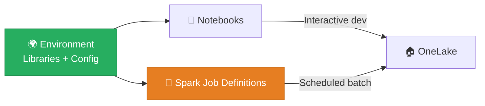

# ⚙️ Spark Environments & Job Definitions

<div align="center" markdown>

**Production-Grade Library Management and Batch Job Execution**


</div>

---

**Last Updated:** `2026-04-21` | **Version:** 1.0.0

---

## 🎯 Overview

**Fabric Environments** and **Spark Job Definitions** are two complementary features for production Spark workloads:

- **Environments** manage the runtime context — Python/R/Jar libraries, Spark configuration, and resource allocation — shared across multiple notebooks and jobs.
- **Spark Job Definitions** run PySpark scripts as headless batch jobs — no notebook UI, just scheduled execution with parameters, monitoring, and retry logic.

Together, they solve the gap between ad-hoc notebook development and production-grade batch processing.



---

## 🌍 Environments

### What Is an Environment?

An Environment is a workspace item that bundles:

| Component | Description |
|-----------|-------------|
| **Public Libraries** | PyPI packages (`pip install` equivalent) |
| **Custom Libraries** | `.whl`, `.jar`, `.tar.gz` files uploaded from local or ADLS |
| **Spark Properties** | Key-value Spark configuration (e.g., `spark.sql.shuffle.partitions`) |
| **Resources** | Shared files (config, data, models) available at runtime |

### Creating an Environment

1. Open workspace → **+ New** → **Environment**
2. Name it (e.g., `env-casino-analytics`)
3. Add libraries and configuration
4. Click **Publish** to compile the environment (takes 2-5 minutes)

### Attaching to a Notebook

```
Notebook → Settings → Environment
  ☑ Use workspace default environment
     — or —
  ☑ Select specific environment: env-casino-analytics
```

When a notebook uses an environment, all specified libraries are pre-installed when the Spark session starts.

---

## 📦 Library Management

### Public Libraries (PyPI)

Add packages from PyPI:

```yaml
# Environment → Public Libraries → + Add from PyPI
great-expectations==0.18.8
delta-spark==3.1.0
geopy==2.4.1
h3==3.7.7
shapely==2.0.3
```

### Custom Libraries

Upload private or custom packages:

```
Environment → Custom Libraries → Upload
  casino_utils-1.0.0-py3-none-any.whl    (Python wheel)
  federal_validators-2.1.0.tar.gz          (Python source)
  custom-udf-1.0.jar                       (Java/Scala JAR)
```

### Library Conflict Resolution

| Priority | Source | Overrides |
|----------|--------|-----------|
| 1 (highest) | Custom library (.whl upload) | All others |
| 2 | Public library (PyPI) | Built-in |
| 3 (lowest) | Built-in Spark libraries | — |

> ⚠️ **Warning**: After changing libraries, you must **Publish** the environment. Existing Spark sessions won't pick up changes until restarted.

### Environment YAML Export

Export environment configuration for version control:

```yaml
# env-casino-analytics.yml
name: env-casino-analytics
dependencies:
  - great-expectations==0.18.8
  - geopy==2.4.1
  - h3==3.7.7
  - shapely==2.0.3
custom_libraries:
  - casino_utils-1.0.0-py3-none-any.whl
spark_properties:
  spark.sql.shuffle.partitions: "200"
  spark.sql.adaptive.enabled: "true"
  spark.sql.adaptive.coalescePartitions.enabled: "true"
  spark.databricks.delta.optimizeWrite.enabled: "true"
```

---

## ⚙️ Spark Configuration

### Common Spark Properties

| Property | Default | Recommended | Purpose |
|----------|---------|-------------|---------|
| `spark.sql.shuffle.partitions` | 200 | Match to data volume | Controls parallelism in shuffle operations |
| `spark.sql.adaptive.enabled` | true | true | Adaptive query execution |
| `spark.sql.adaptive.coalescePartitions.enabled` | true | true | Reduces small partitions |
| `spark.databricks.delta.optimizeWrite.enabled` | true | true | V-Order optimization |
| `spark.databricks.delta.autoCompact.enabled` | true | true | Auto-compact small files |
| `spark.sql.parquet.datetimeRebaseModeInRead` | EXCEPTION | CORRECTED | Date handling for legacy data |
| `spark.driver.memory` | 4g | 8g-16g for large transforms | Driver memory |
| `spark.executor.memory` | 4g | 8g-16g for large transforms | Executor memory |

### Casino-Specific Configuration

```properties
# Compliance: Deterministic hashing for PII
spark.sql.legacy.allowHashOnMapType=true

# Performance: Optimize for slot telemetry volume
spark.sql.shuffle.partitions=400
spark.sql.files.maxPartitionBytes=134217728

# Delta: Enable change data feed for CDC downstream
spark.databricks.delta.properties.defaults.enableChangeDataFeed=true
```

---

## 🏃 Spark Job Definitions

### What Is a Spark Job Definition?

A Spark Job Definition (SJD) runs a PySpark `.py` script as a batch job — no notebook UI, no interactive cells. It's the Fabric equivalent of submitting a Spark job in Databricks Jobs or Synapse Spark pools.

### When to Use SJD vs. Notebook

| Aspect | Spark Job Definition | Notebook |
|--------|---------------------|----------|
| **Execution** | Headless batch | Interactive + scheduled |
| **UI** | Monitoring only | Editor + output display |
| **Parameters** | Command-line args | Widget parameters |
| **Use Case** | Production ETL jobs | Development + ad-hoc |
| **Monitoring** | Spark UI + logs | Cell output + Spark UI |
| **Testing** | Unit tests via pytest locally | Interactive validation |

### Creating a Spark Job Definition

1. Open workspace → **+ New** → **Spark Job Definition**
2. Upload or reference a `.py` file from OneLake
3. Set the language: **PySpark (Python)** or **Spark (Scala/Java)**
4. Configure:
   - **Main file**: path to your `.py` script
   - **Command-line arguments**: `--date 2026-04-21 --layer bronze`
   - **Reference files**: additional `.py` modules
   - **Lakehouse reference**: attach default Lakehouse
   - **Environment**: select `env-casino-analytics`
5. **Run** or **Schedule**

### Example: Production Bronze Ingestion Job

```python
# bronze_slot_ingestion.py — Spark Job Definition script
import argparse
from pyspark.sql import SparkSession
from pyspark.sql.functions import col, current_timestamp, lit

def main():
    parser = argparse.ArgumentParser()
    parser.add_argument("--date", required=True, help="Processing date YYYY-MM-DD")
    parser.add_argument("--source", default="SlotManagement", help="Source database")
    args = parser.parse_args()

    spark = SparkSession.builder.getOrCreate()

    # Read from source
    df = (spark.read.format("jdbc")
        .option("url", f"jdbc:sqlserver://casino-sql.database.windows.net;database={args.source}")
        .option("dbtable", f"(SELECT * FROM dbo.SlotEvents WHERE CAST(event_ts AS DATE) = '{args.date}') AS q")
        .load()
    )

    # Rename and add metadata
    df_bronze = (df
        .withColumnRenamed("MACHINE_ID", "machine_id")
        .withColumnRenamed("EVENT_TS", "event_timestamp")
        .withColumn("_ingestion_timestamp", current_timestamp())
        .withColumn("_source_system", lit(args.source))
    )

    # Write to Lakehouse
    df_bronze.write.format("delta").mode("append") \
        .saveAsTable("lh_bronze.dbo.bronze_slot_telemetry")

    print(f"Loaded {df_bronze.count()} rows for {args.date}")

if __name__ == "__main__":
    main()
```

### Scheduling

```
Spark Job Definition → Settings → Schedule
  Frequency: Daily
  Time: 02:00 AM UTC
  Command args: --date {{yesterday}} --source SlotManagement
```

---

## 🎰 Casino Implementation

### Environment Setup

```yaml
# env-casino-analytics
Public Libraries:
  - great-expectations==0.18.8
  - geopy==2.4.1

Spark Properties:
  spark.sql.shuffle.partitions: 400
  spark.databricks.delta.optimizeWrite.enabled: true
  spark.databricks.delta.autoCompact.enabled: true
  spark.databricks.delta.properties.defaults.enableChangeDataFeed: true

Attached to:
  - All Bronze notebooks (01-17)
  - All Silver notebooks (01-16)
  - All Gold notebooks (01-18)
  - Spark Job Definitions (production batch)
```

### Production Job Schedule

| Job | Script | Schedule | Args |
|-----|--------|----------|------|
| `sjd-bronze-slots` | `bronze_slot_ingestion.py` | Daily 2 AM | `--date {{yesterday}}` |
| `sjd-silver-cleanse` | `silver_slot_cleanse.py` | Daily 3 AM | `--date {{yesterday}}` |
| `sjd-gold-kpis` | `gold_daily_kpis.py` | Daily 4 AM | `--date {{yesterday}}` |
| `sjd-compliance-scan` | `compliance_daily_scan.py` | Daily 5 AM | `--date {{yesterday}}` |

---

## 🏛️ Federal Implementation

### Per-Agency Environments

| Environment | Libraries | Spark Config |
|-------------|-----------|-------------|
| `env-usda-analytics` | `usda-nass-api`, `geopandas` | Default shuffle: 100 |
| `env-noaa-analytics` | `meteostat`, `netCDF4` | Memory: 16g (large weather datasets) |
| `env-epa-analytics` | `aqi-calculator`, `shapely` | Default |
| `env-doi-analytics` | `h3`, `obspy`, `geopandas` | Default |
| `env-sba-analytics` | `scikit-learn`, `xgboost` | Default |

---

## ⚠️ Limitations

| Limitation | Details | Workaround |
|-----------|---------|-----------|
| **Publish Time** | Environment publish takes 2-5 minutes | Plan library changes ahead |
| **No Conda** | Only pip/PyPI packages supported | Use wheels for conda-only packages |
| **Library Size** | Max 500 MB per custom library upload | Split large packages |
| **No Live Reload** | Spark session must restart to pick up env changes | Restart session after publish |
| **SJD Monitoring** | Less detailed than notebook cell output | Use structured logging to Delta table |
| **Git Support** | Environment YAML not yet in Git integration | Export manually for version control |

---

## 📚 References

| Resource | URL |
|----------|-----|
| Environments Overview | https://learn.microsoft.com/fabric/data-engineering/create-and-use-environment |
| Library Management | https://learn.microsoft.com/fabric/data-engineering/environment-manage-library |
| Spark Job Definitions | https://learn.microsoft.com/fabric/data-engineering/create-spark-job-definition |
| Spark Configuration | https://learn.microsoft.com/fabric/data-engineering/spark-compute-configuration |

---

## 🔗 Related Documents

- [Spark Runtime Migration](../best-practices/spark-runtime-migration.md) — Migrating between Spark runtime versions
- [Performance Best Practices](../best-practices/performance-parallelism.md) — Spark tuning
- [Fabric CI/CD Deployment](../best-practices/fabric-cicd-deployment.md) — Deploy environments via CI/CD
- [Architecture](../ARCHITECTURE.md) — System architecture overview

---

> 📝 **Document Metadata**
> - **Author**: Documentation Team
> - **Reviewers**: Data Engineering, Platform
> - **Classification**: Internal
> - **Next Review**: 2026-07-21
