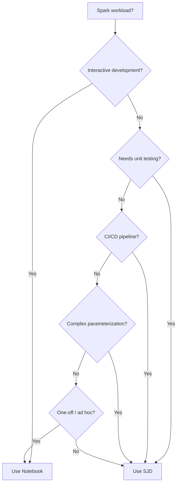

# 🔥 Spark Job Definitions - Production-Grade Spark in Fabric

<div align="center" markdown>

**Headless Spark Execution for Batch Pipelines and Scheduled Workloads**


</div>

---

**Last Updated:** `2026-04-27` | **Version:** 1.0.0

---

## Overview

Spark Job Definitions (SJDs) are Fabric's mechanism for running headless, production-grade Spark applications. Unlike notebooks (which are designed for interactive development with cell-by-cell execution), SJDs package your Spark code as a standalone application with a `main()` entry point, command-line arguments, and deterministic execution behavior.

SJDs are the preferred execution model when you move from development to production: they are testable, parameterizable, version-controlled, and integrate cleanly with CI/CD pipelines.

### Key Differences from Notebooks

| Aspect | Spark Job Definition | Notebook |
|--------|---------------------|----------|
| **Execution model** | `main()` entry point, headless | Cell-by-cell, interactive |
| **Parameterization** | Command-line arguments (`argparse`) | Widget parameters or `mssparkutils` |
| **Testing** | Standard unit test frameworks | Harder to test in isolation |
| **Development** | IDE (VS Code, IntelliJ) | Fabric notebook editor |
| **Debugging** | Log-based, Spark UI post-hoc | Inline cell output |
| **CI/CD** | First-class (file-based) | Supported but more complex |
| **Startup overhead** | Same Spark session startup | Same Spark session startup |
| **Libraries** | Environment + reference files | Environment + inline `%pip` |
| **Best for** | Production pipelines | Exploration and development |

---

## SJD vs Notebooks Decision Matrix



### Detailed Decision Criteria

| Criterion | Choose SJD | Choose Notebook |
|-----------|-----------|-----------------|
| **Frequency** | Scheduled daily/hourly | Ad hoc or monthly |
| **Testing** | Need deterministic tests | Quick visual validation |
| **Team size** | Multiple engineers, code review | Individual analyst |
| **Complexity** | >200 lines, multiple modules | <200 lines, single script |
| **Debugging** | Log analysis acceptable | Need cell-by-cell execution |
| **Visualization** | Not needed during execution | Charts/plots essential |
| **Deployment** | Automated CI/CD | Manual Fabric UI |

---

## Language Support

| Language | File Extension | Spark Version | Notes |
|----------|---------------|---------------|-------|
| **Python** | `.py` | PySpark 3.5+ | Most common, richest library ecosystem |
| **Scala** | `.jar` (compiled) | Spark 3.5+ | Best performance for complex transforms |
| **Java** | `.jar` (compiled) | Spark 3.5+ | Enterprise integrations |
| **R** | `.R` | SparkR 3.5+ | Statistical workloads |

### Python SJD Example

```python
"""
bronze_slot_telemetry_sjd.py
Production SJD for ingesting slot telemetry data into the bronze layer.
"""
import argparse
import logging
import sys
from datetime import datetime, timedelta

from pyspark.sql import SparkSession
from pyspark.sql import functions as F
from pyspark.sql.types import StructType, StructField, StringType, DoubleType, TimestampType

# Configure logging
logging.basicConfig(
    level=logging.INFO,
    format="%(asctime)s [%(levelname)s] %(name)s: %(message)s"
)
logger = logging.getLogger("bronze_slot_telemetry")


def parse_args(args=None):
    """Parse command-line arguments."""
    parser = argparse.ArgumentParser(description="Bronze slot telemetry ingestion")
    parser.add_argument("--date", required=True, help="Processing date (YYYY-MM-DD)")
    parser.add_argument("--env", default="dev", choices=["dev", "staging", "prod"])
    parser.add_argument("--source-path", required=True, help="Source data path in OneLake")
    parser.add_argument("--target-table", default="slot_telemetry", help="Target Delta table")
    parser.add_argument("--max-records", type=int, default=0, help="Limit records (0=unlimited)")
    parser.add_argument("--dry-run", action="store_true", help="Validate without writing")
    return parser.parse_args(args)


def define_schema():
    """Define the expected source schema."""
    return StructType([
        StructField("machine_id", StringType(), False),
        StructField("casino_id", StringType(), False),
        StructField("event_timestamp", TimestampType(), False),
        StructField("event_type", StringType(), False),
        StructField("bet_amount", DoubleType(), True),
        StructField("win_amount", DoubleType(), True),
        StructField("player_id", StringType(), True),
        StructField("denomination", DoubleType(), True),
        StructField("zone_id", StringType(), True),
    ])


def validate_data(df, date_str):
    """Run quality checks on ingested data."""
    total = df.count()
    nulls = df.filter(F.col("machine_id").isNull() | F.col("event_timestamp").isNull()).count()
    
    if total == 0:
        raise ValueError(f"No records found for date {date_str}")
    
    null_rate = nulls / total
    if null_rate > 0.05:
        raise ValueError(f"Null rate {null_rate:.1%} exceeds 5% threshold")
    
    logger.info(f"Validation passed: {total} records, {null_rate:.1%} null rate")
    return total


def ingest(spark, args):
    """Main ingestion logic."""
    logger.info(f"Starting bronze ingestion for {args.date} in {args.env}")
    
    schema = define_schema()
    
    # Read source data with schema enforcement
    df = (
        spark.read
        .schema(schema)
        .format("parquet")
        .load(f"{args.source_path}/date={args.date}")
    )
    
    if args.max_records > 0:
        df = df.limit(args.max_records)
    
    # Add metadata columns
    df = df.withColumns({
        "_ingestion_timestamp": F.current_timestamp(),
        "_source_file": F.input_file_name(),
        "_processing_date": F.lit(args.date),
        "_environment": F.lit(args.env),
    })
    
    # Validate
    record_count = validate_data(df, args.date)
    
    if args.dry_run:
        logger.info(f"DRY RUN: Would write {record_count} records to {args.target_table}")
        df.show(5)
        return
    
    # Write to Delta table (bronze: append-only)
    target_path = f"abfss://bronze@onelake.dfs.fabric.microsoft.com/lh_bronze.Lakehouse/Tables/{args.target_table}"
    
    (
        df.write
        .format("delta")
        .mode("append")
        .partitionBy("_processing_date")
        .save(target_path)
    )
    
    logger.info(f"Successfully wrote {record_count} records to {args.target_table}")


def main():
    args = parse_args()
    
    spark = (
        SparkSession.builder
        .appName(f"bronze-slot-telemetry-{args.env}-{args.date}")
        .getOrCreate()
    )
    
    try:
        ingest(spark, args)
    except Exception as e:
        logger.error(f"Ingestion failed: {e}", exc_info=True)
        sys.exit(1)
    finally:
        spark.stop()


if __name__ == "__main__":
    main()
```

### Scala SJD Example

```scala
// BronzeSlotTelemetry.scala
package com.contoso.casino.bronze

import org.apache.spark.sql.{SparkSession, DataFrame}
import org.apache.spark.sql.functions._
import org.apache.spark.sql.types._

object BronzeSlotTelemetry {
  
  def main(args: Array[String]): Unit = {
    val config = parseArgs(args)
    
    val spark = SparkSession.builder()
      .appName(s"bronze-slot-telemetry-${config.env}-${config.date}")
      .getOrCreate()
    
    try {
      val df = ingest(spark, config)
      val count = validate(df, config.date)
      
      if (!config.dryRun) {
        write(df, config)
        println(s"Successfully wrote $count records")
      } else {
        println(s"DRY RUN: Would write $count records")
        df.show(5)
      }
    } finally {
      spark.stop()
    }
  }
  
  case class Config(date: String, env: String, sourcePath: String, 
                    targetTable: String, dryRun: Boolean)
  
  def parseArgs(args: Array[String]): Config = {
    // Simple argument parsing
    val argsMap = args.sliding(2, 2).collect {
      case Array(k, v) => k.stripPrefix("--") -> v
    }.toMap
    
    Config(
      date = argsMap("date"),
      env = argsMap.getOrElse("env", "dev"),
      sourcePath = argsMap("source-path"),
      targetTable = argsMap.getOrElse("target-table", "slot_telemetry"),
      dryRun = argsMap.contains("dry-run")
    )
  }
  
  def ingest(spark: SparkSession, config: Config): DataFrame = {
    spark.read
      .schema(schema)
      .parquet(s"${config.sourcePath}/date=${config.date}")
      .withColumn("_ingestion_timestamp", current_timestamp())
      .withColumn("_processing_date", lit(config.date))
      .withColumn("_environment", lit(config.env))
  }
  
  def validate(df: DataFrame, date: String): Long = {
    val count = df.count()
    require(count > 0, s"No records for date $date")
    count
  }
  
  def write(df: DataFrame, config: Config): Unit = {
    val targetPath = s"abfss://bronze@onelake.dfs.fabric.microsoft.com/lh_bronze.Lakehouse/Tables/${config.targetTable}"
    df.write.format("delta").mode("append").partitionBy("_processing_date").save(targetPath)
  }
  
  val schema: StructType = StructType(Seq(
    StructField("machine_id", StringType, nullable = false),
    StructField("casino_id", StringType, nullable = false),
    StructField("event_timestamp", TimestampType, nullable = false),
    StructField("event_type", StringType, nullable = false),
    StructField("bet_amount", DoubleType, nullable = true),
    StructField("win_amount", DoubleType, nullable = true),
    StructField("player_id", StringType, nullable = true)
  ))
}
```

---

## Anatomy of an SJD

### File Structure

```
spark-job-definition/
├── main.py                    # Main definition file (entry point)
├── reference_files/
│   ├── utils.py               # Shared utilities
│   ├── schemas.py             # Schema definitions
│   ├── validators.py          # Data quality functions
│   └── config.json            # Static configuration
└── environment.yml            # Library dependencies
```

### Main Definition File

The main definition file is the entry point. It must:
- Be a self-contained Python script (`.py`) or compiled JAR
- Accept command-line arguments for parameterization
- Handle its own logging and error reporting
- Exit with a non-zero code on failure

### Reference Files

Reference files are additional files uploaded alongside the main definition:
- Python modules for code organization
- Configuration files (JSON, YAML)
- Lookup tables (small CSVs)
- Certificate files for external connections

```python
# In main.py, reference files are available on the Spark driver
import json
import os

# Reference files are placed in the working directory
with open("config.json") as f:
    config = json.load(f)

# Import reference Python modules
from utils import setup_logging
from schemas import SLOT_SCHEMA
from validators import validate_bronze
```

---

## Parameterization

### Command-Line Arguments (Recommended)

```python
import argparse

def parse_args():
    parser = argparse.ArgumentParser()
    parser.add_argument("--date", required=True)
    parser.add_argument("--env", default="dev")
    parser.add_argument("--table", required=True)
    parser.add_argument("--parallelism", type=int, default=4)
    parser.add_argument("--dry-run", action="store_true")
    return parser.parse_args()
```

### Spark Configuration

```python
# Read Spark conf values set at SJD or environment level
env = spark.conf.get("spark.fabric.env", "dev")
workspace = spark.conf.get("spark.fabric.workspace.id")
```

### Pipeline Integration

When an SJD is invoked from a Fabric Pipeline, arguments are passed via the pipeline activity configuration:

```json
{
    "type": "SparkJobDefinition",
    "typeProperties": {
        "sparkJobDefinition": "bronze-slot-telemetry-sjd",
        "commandLineArguments": [
            "--date", "@pipeline().parameters.processing_date",
            "--env", "@pipeline().parameters.environment",
            "--source-path", "@variables('bronze_source_path')"
        ]
    }
}
```

---

## Environment and Library Management

### Environment YAML

```yaml
# environment.yml
name: casino-bronze-env
channels:
  - defaults
  - conda-forge
dependencies:
  - python=3.11
  - pip:
    - delta-spark==3.1.0
    - great-expectations==0.18.0
    - pydantic==2.5.0
    - requests==2.31.0
```

### Shared Environments

Create a Fabric Environment item and attach it to multiple SJDs:

1. **Workspace** > **+ New** > **Environment**
2. Upload `environment.yml` or configure libraries in UI
3. In the SJD settings, select the shared environment

### Custom Wheel Files

```bash
# Build your shared library
cd casino_utils/
python -m build --wheel

# Upload the .whl to the SJD reference files or Fabric Environment
# Then in your SJD:
from casino_utils.validators import validate_ctr
from casino_utils.schemas import BRONZE_SCHEMA
```

---

## Error Handling and Retry

### In-Code Error Handling

```python
import sys
import logging
from tenacity import retry, stop_after_attempt, wait_exponential

logger = logging.getLogger(__name__)

@retry(
    stop=stop_after_attempt(3),
    wait=wait_exponential(multiplier=1, min=4, max=60),
    reraise=True
)
def read_source_data(spark, path, schema):
    """Read source data with retry for transient failures."""
    try:
        return spark.read.schema(schema).parquet(path)
    except Exception as e:
        logger.warning(f"Read attempt failed: {e}")
        raise

def main():
    args = parse_args()
    spark = SparkSession.builder.getOrCreate()
    
    try:
        df = read_source_data(spark, args.source_path, SCHEMA)
        process(df, args)
    except FileNotFoundError:
        logger.error(f"Source path not found: {args.source_path}")
        sys.exit(2)  # Distinct exit code for missing data
    except ValueError as e:
        logger.error(f"Data validation failed: {e}")
        sys.exit(3)  # Distinct exit code for quality failure
    except Exception as e:
        logger.error(f"Unexpected error: {e}", exc_info=True)
        sys.exit(1)
    finally:
        spark.stop()
```

### Pipeline-Level Retry

```json
{
    "type": "SparkJobDefinition",
    "policy": {
        "retry": 2,
        "retryIntervalInSeconds": 300,
        "timeout": "02:00:00"
    }
}
```

---

## Performance Considerations

### SJD vs Notebook Overhead

| Phase | SJD | Notebook |
|-------|-----|----------|
| **Session startup** | ~30-60s (same Spark pool) | ~30-60s (same Spark pool) |
| **Code load** | Milliseconds (single file) | Seconds (cell parsing + magic resolution) |
| **Execution** | Direct `main()` call | Sequential cell execution |
| **Shutdown** | Immediate after `main()` returns | Session may linger |
| **Net overhead** | Slightly less | Slightly more |

### Optimization Tips

```python
# 1. Partition reads to avoid full scans
df = spark.read.format("delta").load(path).filter(F.col("date") == target_date)

# 2. Use broadcast for small lookup tables
zones = spark.read.format("delta").load(zone_path)
df = df.join(F.broadcast(zones), "zone_id", "left")

# 3. Repartition before wide transformations
df = df.repartition(args.parallelism, "casino_id")

# 4. Cache intermediate results used multiple times
validated = df.filter(F.col("_valid") == True).cache()
write_silver(validated)
write_quality_report(validated)
validated.unpersist()

# 5. Use adaptive query execution (enabled by default in Fabric)
spark.conf.set("spark.sql.adaptive.enabled", "true")
```

---

## CI/CD Integration

### fabric-cicd Deployment

```python
# fabric-cicd-deploy.py (SJD deployment)
from fabric_cicd import FabricClient

client = FabricClient(workspace_id="your-workspace-id")

# Deploy SJD from local files
client.deploy_item(
    item_type="SparkJobDefinition",
    display_name="bronze-slot-telemetry-sjd",
    definition_path="spark-jobs/bronze_slot_telemetry/",
    environment_name="casino-bronze-env"
)
```

### Git Integration

SJDs stored in Git follow this structure:

```
.platform/
  SparkJobDefinition/
    bronze-slot-telemetry-sjd/
      SparkJobDefinitionV1.json
      main.py
      reference_files/
        utils.py
        schemas.py
```

### Unit Testing

```python
# tests/test_bronze_slot_telemetry.py
import pytest
from pyspark.sql import SparkSession
from bronze_slot_telemetry_sjd import parse_args, define_schema, validate_data, ingest

@pytest.fixture(scope="session")
def spark():
    return SparkSession.builder.master("local[2]").getOrCreate()

def test_parse_args():
    args = parse_args(["--date", "2026-01-01", "--env", "dev", "--source-path", "/data"])
    assert args.date == "2026-01-01"
    assert args.env == "dev"
    assert args.dry_run is False

def test_schema():
    schema = define_schema()
    field_names = [f.name for f in schema.fields]
    assert "machine_id" in field_names
    assert "event_timestamp" in field_names

def test_validate_data_empty(spark):
    df = spark.createDataFrame([], define_schema())
    with pytest.raises(ValueError, match="No records found"):
        validate_data(df, "2026-01-01")

def test_validate_data_high_nulls(spark):
    from pyspark.sql import Row
    # Create data with >5% null machine_id
    rows = [Row(machine_id=None, casino_id="C1", event_timestamp=None,
                event_type="spin", bet_amount=1.0, win_amount=0.0,
                player_id="P1", denomination=0.25, zone_id="Z1")]
    df = spark.createDataFrame(rows, define_schema())
    with pytest.raises(ValueError, match="Null rate"):
        validate_data(df, "2026-01-01")
```

---

## Casino Implementation

The casino POC uses SJDs for all production-scheduled medallion workloads:

| SJD Name | Purpose | Schedule |
|----------|---------|----------|
| `bronze-slot-telemetry-sjd` | Ingest slot machine events | Every 15 min |
| `bronze-table-games-sjd` | Ingest table game results | Hourly |
| `silver-slot-cleansed-sjd` | Cleanse and deduplicate slots | Every 30 min |
| `gold-compliance-sjd` | CTR/SAR/W-2G flagging | Daily 6 AM |
| `gold-revenue-sjd` | Revenue KPI aggregation | Daily 7 AM |

---

## Federal Agency Implementation

| SJD Name | Agency | Purpose |
|----------|--------|---------|
| `bronze-usda-ingest-sjd` | USDA | NASS crop production data |
| `bronze-sba-ingest-sjd` | SBA | Loan program data |
| `bronze-noaa-ingest-sjd` | NOAA | Weather observations |
| `bronze-epa-ingest-sjd` | EPA | Air quality monitoring |
| `bronze-doi-ingest-sjd` | DOI | Land management data |
| `bronze-doj-ingest-sjd` | DOJ | Case management data |

---

## Limitations

| Limitation | Details | Workaround |
|------------|---------|------------|
| **No interactive debugging** | Cannot set breakpoints or inspect mid-execution | Use notebooks for development, SJD for production |
| **No visualization** | No charts or plots during execution | Write results to tables, visualize in Power BI |
| **Reference file size** | Max 200 MB per reference file | Use OneLake for large reference data |
| **Single main file** | Only one entry point | Import modules from reference files |
| **No notebook %run** | Cannot chain to notebooks | Use Airflow or Pipeline for orchestration |
| **Startup time** | Same 30-60s Spark session startup | Use high-concurrency sessions for parallelism |

---

## References

- [Spark Job Definition overview](https://learn.microsoft.com/en-us/fabric/data-engineering/spark-job-definition)
- [Create a Spark Job Definition](https://learn.microsoft.com/en-us/fabric/data-engineering/create-spark-job-definition)
- [Fabric Environments](https://learn.microsoft.com/en-us/fabric/data-engineering/environment-manage-library)
- [fabric-cicd for SJD deployment](https://learn.microsoft.com/en-us/fabric/cicd/fabric-cicd-overview)
- [Spark performance tuning in Fabric](https://learn.microsoft.com/en-us/fabric/data-engineering/spark-performance-tuning)
