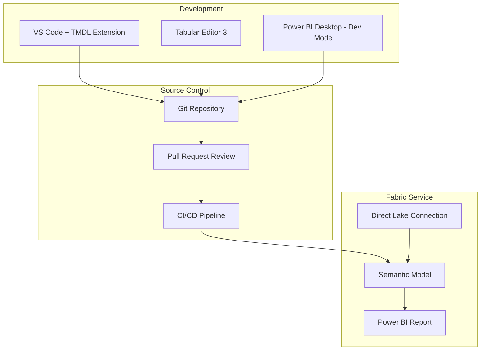
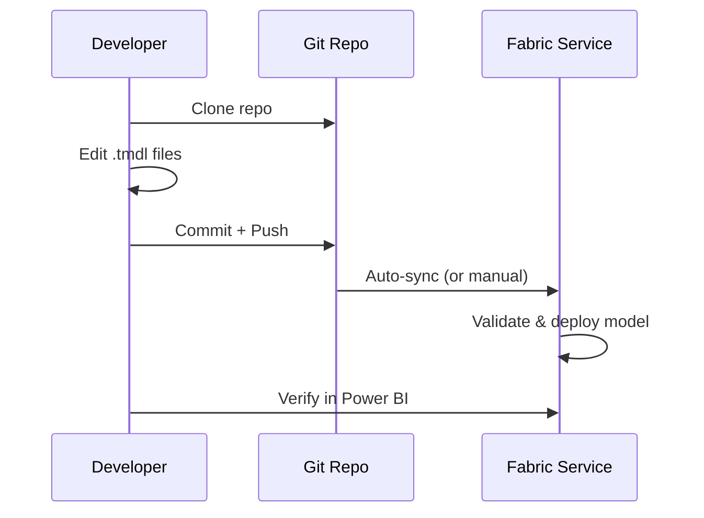
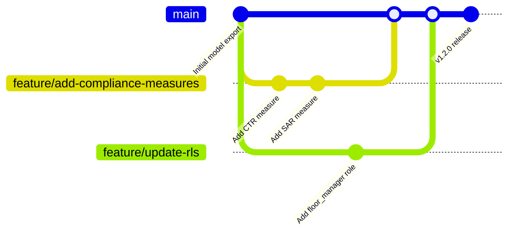
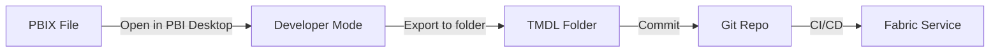

# 🛠️ TMDL & Power BI Developer Mode - Source-Controlled Semantic Models

<div align="center" markdown>

**Version Control, CI/CD, and Collaborative Editing for Power BI Semantic Models**


</div>

---

**Last Updated:** `2026-04-27` | **Version:** 1.0.0

---

## Overview

TMDL (Tabular Model Definition Language) is a human-readable, file-based format for defining Power BI and Analysis Services semantic models. It replaces the monolithic PBIX/BIM approach with a folder of small, focused `.tmdl` files -- one per table, measure group, relationship, or role -- enabling true source control, pull request reviews, and CI/CD pipelines.

Power BI Developer Mode is the Fabric-side feature that enables editing semantic models in TMDL format directly from VS Code, Tabular Editor, or any text editor, with changes synced through Git.

### Why TMDL Matters

| Problem with PBIX | How TMDL Solves It |
|--------------------|--------------------|
| Binary format, cannot diff | Text-based, standard Git diffs |
| Single file, merge conflicts | Per-object files, parallel edits |
| No code review possible | Standard PR workflows |
| Manual deployment | CI/CD pipelines with validation |
| No version history for model logic | Full Git history per measure/table |
| Tight coupling of model + report | Separation of model definition from visuals |

---

## Architecture



---

## TMDL File Structure

### Folder Layout

```
semantic-model/
├── model.tmdl                    # Model-level properties
├── tables/
│   ├── slot_telemetry.tmdl       # Table definition + columns
│   ├── table_game_results.tmdl
│   ├── player_profiles.tmdl
│   ├── calendar.tmdl             # Date dimension
│   └── _measures/
│       ├── slot_kpis.tmdl        # Measure group: slot KPIs
│       ├── compliance.tmdl       # Measure group: compliance
│       └── revenue.tmdl          # Measure group: revenue
├── relationships/
│   └── relationships.tmdl        # All model relationships
├── roles/
│   ├── casino_admin.tmdl         # RLS role
│   ├── floor_manager.tmdl
│   └── compliance_officer.tmdl
├── perspectives/
│   └── executive_view.tmdl
├── cultures/
│   └── en-US.tmdl                # Translations
└── expressions/
    └── shared_expressions.tmdl   # M expressions for parameters
```

### Model File

```tmdl
// model.tmdl
model Model
    culture: en-US
    defaultPowerBIDataSourceVersion: powerBI_V3
    discourageImplicitMeasures: true
    
    annotation PBI_QueryOrder = ["slot_telemetry","table_game_results","player_profiles","calendar"]
```

### Table Definition

```tmdl
// tables/slot_telemetry.tmdl
table slot_telemetry
    lineageTag: a1b2c3d4-e5f6-7890-abcd-ef1234567890

    partition slot_telemetry = entity
        mode: directLake
        source
            entityName: slot_telemetry
            schemaName: dbo
            expressionSource: DatabaseQuery

    column machine_id
        dataType: string
        lineageTag: 11111111-2222-3333-4444-555555555555
        summarizeBy: none
        sourceColumn: machine_id

    column casino_id
        dataType: string
        lineageTag: 22222222-3333-4444-5555-666666666666
        summarizeBy: none
        sourceColumn: casino_id

    column event_timestamp
        dataType: dateTime
        lineageTag: 33333333-4444-5555-6666-777777777777
        formatString: General Date
        summarizeBy: none
        sourceColumn: event_timestamp

    column bet_amount
        dataType: double
        lineageTag: 44444444-5555-6666-7777-888888888888
        formatString: \$#,0.00;(\$#,0.00);\$#,0.00
        summarizeBy: sum
        sourceColumn: bet_amount

    column win_amount
        dataType: double
        lineageTag: 55555555-6666-7777-8888-999999999999
        formatString: \$#,0.00;(\$#,0.00);\$#,0.00
        summarizeBy: sum
        sourceColumn: win_amount

    column player_id
        dataType: string
        lineageTag: 66666666-7777-8888-9999-aaaaaaaaaaaa
        summarizeBy: none
        sourceColumn: player_id

    column zone_id
        dataType: string
        lineageTag: 77777777-8888-9999-aaaa-bbbbbbbbbbbb
        summarizeBy: none
        sourceColumn: zone_id
```

### Measure Group

```tmdl
// tables/_measures/slot_kpis.tmdl
table slot_kpis
    lineageTag: measure-group-slot-kpis
    isHidden: true

    measure 'Total Handle' =
        SUM(slot_telemetry[bet_amount])
        formatString: \$#,0.00
        displayFolder: Core Metrics
        lineageTag: m-total-handle

    measure 'Total Payout' =
        SUM(slot_telemetry[win_amount])
        formatString: \$#,0.00
        displayFolder: Core Metrics
        lineageTag: m-total-payout

    measure 'Hold %' =
        VAR TotalHandle = [Total Handle]
        VAR TotalPayout = [Total Payout]
        RETURN
            IF(
                TotalHandle > 0,
                DIVIDE(TotalHandle - TotalPayout, TotalHandle),
                BLANK()
            )
        formatString: 0.00%
        displayFolder: Core Metrics
        lineageTag: m-hold-pct

    measure 'Avg Bet' =
        AVERAGE(slot_telemetry[bet_amount])
        formatString: \$#,0.00
        displayFolder: Core Metrics
        lineageTag: m-avg-bet

    measure 'Spin Count' =
        COUNTROWS(slot_telemetry)
        formatString: #,0
        displayFolder: Core Metrics
        lineageTag: m-spin-count

    measure 'Revenue per Machine' =
        DIVIDE(
            [Total Handle] - [Total Payout],
            DISTINCTCOUNT(slot_telemetry[machine_id])
        )
        formatString: \$#,0.00
        displayFolder: Machine Analytics
        lineageTag: m-rev-per-machine
```

### Relationships

```tmdl
// relationships/relationships.tmdl
relationship slot_to_calendar
    fromColumn: slot_telemetry.event_timestamp
    toColumn: calendar.Date
    crossFilteringBehavior: singleDirection

relationship slot_to_player
    fromColumn: slot_telemetry.player_id
    toColumn: player_profiles.player_id
    crossFilteringBehavior: singleDirection
    isActive: true

relationship games_to_calendar
    fromColumn: table_game_results.game_timestamp
    toColumn: calendar.Date
    crossFilteringBehavior: singleDirection
```

### RLS Role

```tmdl
// roles/floor_manager.tmdl
role floor_manager
    modelPermission: read

    tablePermission slot_telemetry
        filterExpression: slot_telemetry[zone_id] IN CALCULATETABLE(VALUES(zone_assignments[zone_id]), zone_assignments[user_email] = USERPRINCIPALNAME())

    tablePermission table_game_results
        filterExpression: table_game_results[zone_id] IN CALCULATETABLE(VALUES(zone_assignments[zone_id]), zone_assignments[user_email] = USERPRINCIPALNAME())
```

---

## Power BI Developer Mode

### Enabling Developer Mode

1. In Fabric workspace, select the semantic model
2. Click **Settings** > **Developer Mode**
3. Connect to a Git repository (GitHub or Azure DevOps)
4. Select the folder for TMDL files
5. Choose sync direction (Git → Service or Service → Git)

### Working in Developer Mode



### VS Code Setup

1. Install the **TMDL** extension for VS Code
2. Clone your semantic model repository
3. Open the TMDL folder
4. Edit files with syntax highlighting, IntelliSense, and validation

```json
// .vscode/settings.json
{
    "files.associations": {
        "*.tmdl": "tmdl"
    },
    "editor.formatOnSave": true,
    "tmdl.validation.enabled": true
}
```

---

## Source Control Integration

### Git Workflow



### Pull Request Review

TMDL enables meaningful code review for semantic models. A typical PR diff:

```diff
// tables/_measures/compliance.tmdl
+ measure 'CTR Transaction Count' =
+     CALCULATE(
+         COUNTROWS(financial_transactions),
+         financial_transactions[amount] >= 10000
+     )
+     formatString: #,0
+     displayFolder: Compliance
+     lineageTag: m-ctr-count

+ measure 'SAR Suspect Count' =
+     CALCULATE(
+         COUNTROWS(financial_transactions),
+         financial_transactions[amount] >= 8000,
+         financial_transactions[amount] < 10000
+     )
+     formatString: #,0
+     displayFolder: Compliance
+     lineageTag: m-sar-suspect
```

### Branching Strategy

| Branch | Purpose | Deploys To |
|--------|---------|------------|
| `main` | Production model | Production workspace |
| `staging` | Pre-release validation | Staging workspace |
| `feature/*` | New measures, tables, RLS | Dev workspace (manual sync) |
| `hotfix/*` | Urgent fixes | Fast-track to production |

---

## Editing TMDL

### Tabular Editor 3

Tabular Editor 3 provides the richest TMDL editing experience:

1. Open TMDL folder as a "Folder" source
2. Visual model diagram + text editing
3. Best Practice Analyzer (BPA) rules
4. DAX formatter and syntax checker
5. Deploy to Fabric service or save to folder

### Best Practice Analyzer Rules

```json
// BPA-rules.json
[
    {
        "Name": "Measures must have format strings",
        "Category": "Formatting",
        "Expression": "Model.AllMeasures.Where(m => string.IsNullOrEmpty(m.FormatString))",
        "Severity": 2
    },
    {
        "Name": "Columns should not have SummarizeBy auto",
        "Category": "Performance",
        "Expression": "Model.AllColumns.Where(c => c.SummarizeBy == SummarizeBy.Default && c.DataType == DataType.Decimal)",
        "Severity": 1
    },
    {
        "Name": "All measures must have a display folder",
        "Category": "Organization",
        "Expression": "Model.AllMeasures.Where(m => string.IsNullOrEmpty(m.DisplayFolder))",
        "Severity": 1
    }
]
```

---

## CI/CD for Semantic Models

### GitHub Actions Pipeline

```yaml
# .github/workflows/deploy-semantic-model.yml
name: Deploy Semantic Model
on:
  push:
    branches: [main]
    paths: ['semantic-model/**']

jobs:
  validate:
    runs-on: ubuntu-latest
    steps:
      - uses: actions/checkout@v4
      
      - name: Install Tabular Editor CLI
        run: |
          dotnet tool install -g TabularEditor.TmdlTools
      
      - name: Validate TMDL
        run: |
          tmdl-tools validate semantic-model/
      
      - name: Run Best Practice Analyzer
        run: |
          tmdl-tools analyze semantic-model/ --rules BPA-rules.json --severity 2
  
  deploy-staging:
    needs: validate
    runs-on: ubuntu-latest
    environment: staging
    steps:
      - uses: actions/checkout@v4
      
      - name: Deploy to Staging
        run: |
          tmdl-tools deploy semantic-model/ \
            --workspace "${{ secrets.STAGING_WORKSPACE_ID }}" \
            --dataset "Casino-Analytics-Model" \
            --tenant "${{ secrets.TENANT_ID }}" \
            --client-id "${{ secrets.APP_CLIENT_ID }}" \
            --client-secret "${{ secrets.APP_CLIENT_SECRET }}"
      
      - name: Run DAX query tests
        run: |
          python tests/test_dax_queries.py \
            --workspace "${{ secrets.STAGING_WORKSPACE_ID }}" \
            --dataset "Casino-Analytics-Model"
  
  deploy-production:
    needs: deploy-staging
    runs-on: ubuntu-latest
    environment: production
    steps:
      - uses: actions/checkout@v4
      
      - name: Deploy to Production
        run: |
          tmdl-tools deploy semantic-model/ \
            --workspace "${{ secrets.PROD_WORKSPACE_ID }}" \
            --dataset "Casino-Analytics-Model" \
            --tenant "${{ secrets.TENANT_ID }}" \
            --client-id "${{ secrets.APP_CLIENT_ID }}" \
            --client-secret "${{ secrets.APP_CLIENT_SECRET }}"
```

### DAX Query Tests

```python
# tests/test_dax_queries.py
"""Validate semantic model measures return expected results after deployment."""
import requests
import pytest

def execute_dax(workspace_id, dataset, query, token):
    """Execute a DAX query against a deployed semantic model."""
    url = f"https://api.fabric.microsoft.com/v1/workspaces/{workspace_id}/semanticModels/{dataset}/executeQueries"
    response = requests.post(url, headers={"Authorization": f"Bearer {token}"}, json={
        "queries": [{"query": query}],
        "serializerSettings": {"includeNulls": True}
    })
    return response.json()

def test_total_handle_returns_value():
    result = execute_dax(WORKSPACE, DATASET, "EVALUATE {[Total Handle]}", TOKEN)
    assert result["results"][0]["tables"][0]["rows"][0]["[Value]"] > 0

def test_hold_pct_in_range():
    result = execute_dax(WORKSPACE, DATASET, "EVALUATE {[Hold %]}", TOKEN)
    hold = result["results"][0]["tables"][0]["rows"][0]["[Value]"]
    assert 0 < hold < 1, f"Hold % should be between 0 and 1, got {hold}"

def test_ctr_count_non_negative():
    result = execute_dax(WORKSPACE, DATASET, "EVALUATE {[CTR Transaction Count]}", TOKEN)
    count = result["results"][0]["tables"][0]["rows"][0]["[Value]"]
    assert count >= 0
```

---

## DAX Patterns in TMDL

### Time Intelligence

```tmdl
measure 'Revenue YTD' =
    TOTALYTD([Total Handle] - [Total Payout], calendar[Date])
    formatString: \$#,0.00
    displayFolder: Time Intelligence
    lineageTag: m-revenue-ytd

measure 'Revenue MoM %' =
    VAR CurrentMonth = [Total Handle] - [Total Payout]
    VAR PriorMonth =
        CALCULATE(
            [Total Handle] - [Total Payout],
            DATEADD(calendar[Date], -1, MONTH)
        )
    RETURN
        DIVIDE(CurrentMonth - PriorMonth, PriorMonth)
    formatString: 0.0%
    displayFolder: Time Intelligence
    lineageTag: m-revenue-mom
```

### Dynamic Measures

```tmdl
measure 'Selected KPI' =
    SWITCH(
        SELECTEDVALUE(kpi_selector[KPI]),
        "Handle", [Total Handle],
        "Payout", [Total Payout],
        "Hold %", [Hold %],
        "Spins", [Spin Count],
        BLANK()
    )
    displayFolder: Dynamic
    lineageTag: m-selected-kpi
```

---

## Migration from Legacy Formats

### PBIX to TMDL



### Using Tabular Editor for Migration

1. Open PBIX in Tabular Editor 3
2. **File** > **Save to Folder** > Select TMDL format
3. Review generated files for accuracy
4. Commit to Git
5. Enable Developer Mode on the Fabric semantic model
6. Sync from Git

---

## Format Comparison

| Feature | TMDL | PBIX | BIM (JSON) | XMLA |
|---------|------|------|------------|------|
| **Human-readable** | Excellent | No (binary) | Fair (verbose JSON) | Poor (XML) |
| **Git-friendly** | Excellent | No | Fair | Poor |
| **Per-object files** | Yes | No | No (single file) | No |
| **Merge conflicts** | Rare | Impossible to resolve | Common (JSON ordering) | Common |
| **Code review** | Natural | Impossible | Possible but noisy | Possible but noisy |
| **CI/CD** | First-class | Difficult | Supported | Supported |
| **Editor support** | VS Code, TE3, any text editor | PBI Desktop only | TE3, VS Code | SSMS, TE3 |
| **Report included** | No (model only) | Yes (model + report) | No | No |
| **Round-trip fidelity** | Full | Full | Full | Partial |
| **Fabric native** | Yes (Developer Mode) | Yes (upload) | Yes (XMLA endpoint) | Yes |

---

## Casino Implementation

The casino POC semantic model is fully defined in TMDL with the following structure:

| TMDL File | Contents |
|-----------|----------|
| `tables/slot_telemetry.tmdl` | Slot machine events (Direct Lake) |
| `tables/table_game_results.tmdl` | Table game data (Direct Lake) |
| `tables/player_profiles.tmdl` | Player dimension (Direct Lake) |
| `tables/calendar.tmdl` | Date dimension (calculated) |
| `tables/_measures/slot_kpis.tmdl` | Handle, payout, hold %, spins |
| `tables/_measures/compliance.tmdl` | CTR, SAR, W-2G measures |
| `tables/_measures/revenue.tmdl` | Revenue, profit, time intelligence |
| `roles/floor_manager.tmdl` | Zone-based RLS |
| `roles/compliance_officer.tmdl` | Full compliance data access |

---

## Federal Agency Implementation

| TMDL Component | Federal Application |
|----------------|---------------------|
| `tables/usda_crop_production.tmdl` | USDA NASS crop data |
| `tables/noaa_weather_observations.tmdl` | NOAA weather stations |
| `tables/epa_air_quality.tmdl` | EPA AQI readings |
| `tables/_measures/cross_agency.tmdl` | Cross-agency analytics |
| `roles/agency_analyst.tmdl` | Per-agency RLS |

---

## Limitations

| Limitation | Details | Workaround |
|------------|---------|------------|
| **Reports not in TMDL** | TMDL covers model only, not report visuals | Use PBIP (Power BI Project) for reports |
| **Lineage tags required** | Every object needs a unique GUID | Auto-generate with Tabular Editor |
| **No calculated tables in Direct Lake** | Direct Lake does not support calc tables | Use Lakehouse views instead |
| **Learning curve** | TMDL syntax is new to most teams | Start with Tabular Editor visual + TMDL preview |
| **Limited M expression support** | Complex Power Query stays in report layer | Keep model simple, do transforms in Spark |
| **Tool maturity** | VS Code extension still evolving | Use Tabular Editor 3 as primary tool |

---

## References

- [TMDL overview](https://learn.microsoft.com/en-us/analysis-services/tmdl/tmdl-overview)
- [Power BI Developer Mode](https://learn.microsoft.com/en-us/power-bi/developer/projects/projects-overview)
- [Tabular Editor 3](https://docs.tabulareditor.com/)
- [Semantic model Git integration](https://learn.microsoft.com/en-us/fabric/cicd/git-integration/intro-to-git-integration)
- [TMDL language reference](https://learn.microsoft.com/en-us/analysis-services/tmdl/tmdl-reference)
- [Best Practice Analyzer](https://docs.tabulareditor.com/te3/best-practice-analyzer.html)
