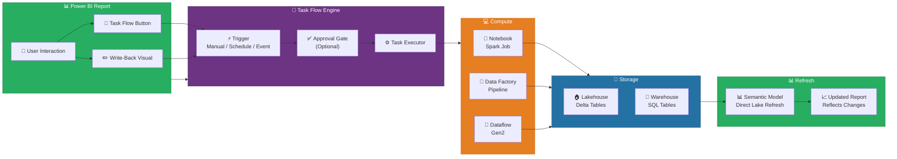
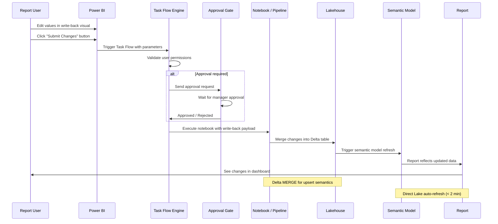
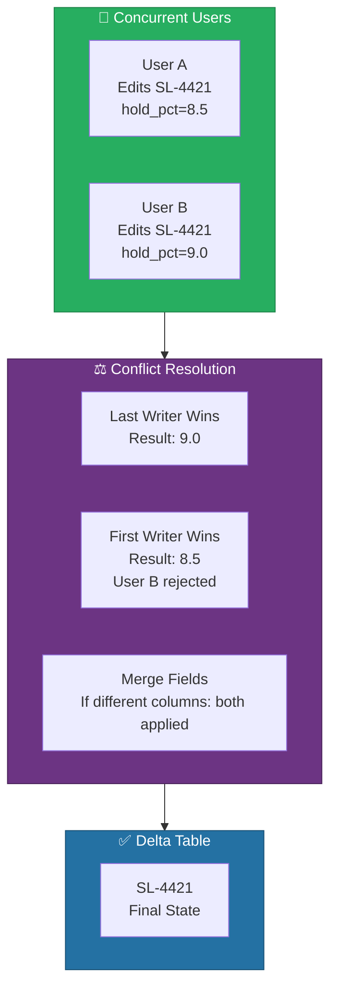
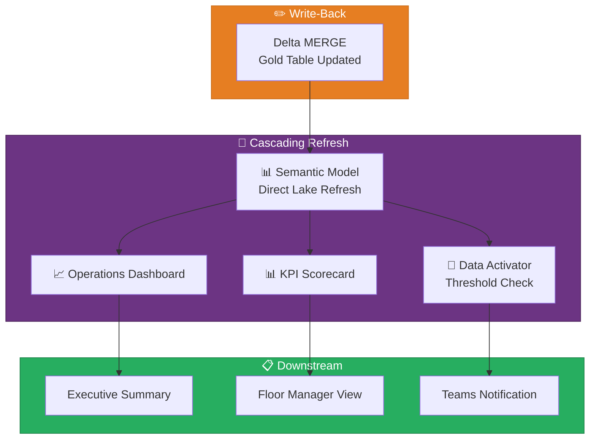
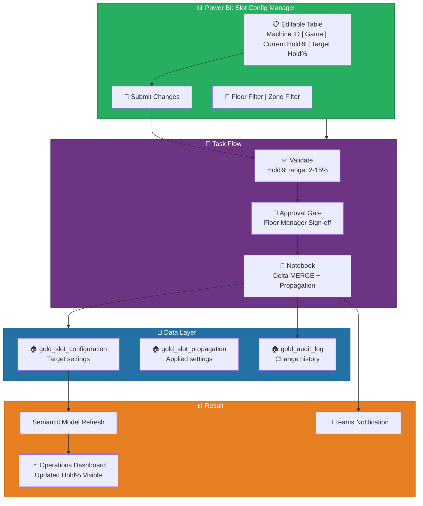
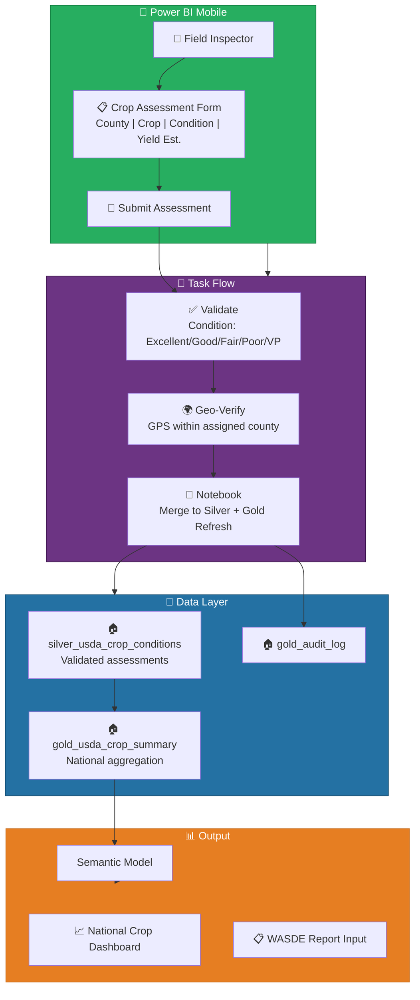

[Home](../index.md) > [Docs](../) > [Features](./) > Translytical Task Flows

# 🔄 Translytical Task Flows - Visual Orchestration and Write-Back from Power BI

<div align="center" markdown>

**Bridge the Gap Between Analytics and Action with Task Flows**


</div>

---

**Last Updated:** `2026-04-13` | **Version:** 1.0.0

---

## 📑 Table of Contents

- [🎯 Overview](#-overview)
- [🏗️ Architecture Overview](#️-architecture-overview)
- [⚙️ Task Flow Types](#️-task-flow-types)
- [🔄 Write-Back Patterns](#-write-back-patterns)
- [🎰 Casino Implementation](#-casino-implementation)
- [🏛️ Federal Agency Implementation](#️-federal-agency-implementation)
- [🔐 Security and Governance](#-security-and-governance)
- [⚠️ Limitations](#️-limitations)
- [📚 References](#-references)

---

## 🎯 Overview

Task Flows in Microsoft Fabric (GA March 2026) enable visual orchestration of data tasks triggered directly from Power BI reports. Rather than treating analytics as a read-only activity, Task Flows close the loop between insight and action by allowing business users to write data back from reports, trigger notebook executions, kick off pipeline refreshes, and initiate approval-gated workflows -- all without leaving the Power BI experience.

Write-back is the defining translytical capability: users edit values in a Power BI visual, and those edits flow through a Task Flow into the Lakehouse as Delta table operations. The Lakehouse then cascades downstream refreshes so that dashboards, KPIs, and operational reports reflect the changes within minutes.

### Key Capabilities

| Capability | Description |
|-----------|-------------|
| **Visual Orchestration** | Drag-and-drop canvas for chaining data tasks: notebooks, pipelines, dataflows, semantic model refreshes |
| **Write-Back** | Users edit cell values in Power BI tables/matrices; changes persist to Delta tables in the Lakehouse |
| **Trigger Types** | Manual (button click), scheduled (cron), event-driven (data arrival), or approval-gated |
| **Cascading Refresh** | After write-back, automatically refresh downstream semantic models and reports |
| **Approval Gates** | Insert human approval steps before critical data modifications execute |
| **Audit Logging** | Every Task Flow execution and write-back operation is logged with user identity and timestamp |
| **Parameterization** | Pass slicer values, selected rows, or user inputs as parameters to downstream tasks |

### Task Flows vs Data Factory Pipelines

| Aspect | Data Factory Pipeline | Task Flow |
|--------|----------------------|-----------|
| **Primary user** | Data engineers | Business analysts, report consumers |
| **Trigger source** | Schedule, event, API | Power BI report interaction |
| **Authoring** | Data Factory canvas | Task Flow designer (Power BI integrated) |
| **Write-back** | Not supported | Native write-back from visuals |
| **Approval gates** | Not built-in (external orchestration) | Native approval steps |
| **Best for** | ETL/ELT orchestration | Report-driven operational workflows |
| **Complexity** | Complex multi-step data engineering | Lightweight task chaining |

> 📝 **Note**: Task Flows complement Data Factory pipelines -- they do not replace them. Use Data Factory for scheduled ETL/ELT workloads and Task Flows for interactive, report-driven operational tasks. The two can interoperate: a Task Flow can trigger a Data Factory pipeline as one of its steps.

---

## 🏗️ Architecture Overview

Task Flows operate as a lightweight orchestration layer between Power BI reports and Fabric compute/storage services. When a user interacts with a Task Flow trigger in a report, the Task Flow engine executes the defined steps in sequence, routing data through notebooks, pipelines, and dataflows before refreshing the downstream semantic model.

### End-to-End Architecture



### Data Flow Sequence



### Component Details

| Component | Role | Key Details |
|-----------|------|-------------|
| **Task Flow Trigger** | Initiates the flow from a Power BI report interaction | Button click, write-back submission, schedule, or data event |
| **Approval Gate** | Optional human-in-the-loop approval step | Sends notification via Teams/email; blocks until approved/rejected |
| **Task Executor** | Runs the configured compute step | Supports notebooks, pipelines, dataflows, stored procedures |
| **Write-Back Adapter** | Captures edits from Power BI visuals | Serializes changed rows with column names, old values, new values |
| **Delta Merge Operator** | Applies write-back changes to Lakehouse tables | Uses Delta MERGE (upsert) with conflict resolution |
| **Semantic Model Refresh** | Refreshes the Direct Lake model after data changes | Triggered automatically after successful write-back |
| **Audit Logger** | Records every execution with full context | User identity, timestamp, parameters, changed values, outcome |

---

## ⚙️ Task Flow Types

### Type 1: Write-Back Task Flow

Users edit values directly in a Power BI table/matrix visual and submit changes. The Task Flow writes the edits to a Delta table and refreshes the report.

```
Trigger: User clicks "Submit" in write-back visual
  → Validate changed rows (schema, permissions)
  → [Optional] Approval gate
  → Execute notebook: Delta MERGE into target table
  → Refresh semantic model
  → Report updates with new values
```

### Type 2: Scheduled Refresh Task Flow

Automate recurring data preparation tasks triggered on a schedule with optional conditional logic.

```
Trigger: Cron schedule (e.g., daily at 06:00 UTC)
  → Execute dataflow: Refresh staging tables
  → Execute notebook: Run Silver-to-Gold transformations
  → Refresh semantic model
  → Send completion notification
```

### Type 3: Event-Triggered Task Flow

React to data events such as new file arrival in OneLake or a threshold breach detected by Data Activator.

```
Trigger: New file in OneLake path /bronze/daily_feed/
  → Execute pipeline: Ingest and validate new file
  → Execute notebook: Bronze-to-Silver transformation
  → Execute notebook: Silver-to-Gold aggregation
  → Refresh semantic model
  → Alert users via Teams
```

### Type 4: Approval-Gated Task Flow

Critical data modifications require manager approval before execution.

```
Trigger: User submits budget adjustment in Power BI
  → Validate proposed changes against business rules
  → Send approval request to manager (Teams notification)
  → [Wait for approval]
  → If approved: Execute write-back to budget table
  → Refresh semantic model
  → If rejected: Notify submitter with rejection reason
```

### Task Flow Comparison

| Type | Trigger | Approval | Compute | Latency | Use Case |
|------|---------|----------|---------|---------|----------|
| **Write-Back** | User action (button) | Optional | Notebook (MERGE) | 30s-2min | Operational edits |
| **Scheduled** | Cron expression | No | Pipeline + Notebook | Minutes | Recurring refresh |
| **Event-Triggered** | OneLake / Activator event | Optional | Pipeline + Notebook | 1-5min | Reactive processing |
| **Approval-Gated** | User action + approval | Required | Notebook (MERGE) | Minutes to hours | Governed modifications |

---

## 🔄 Write-Back Patterns

### Pattern 1: Direct Cell Edit

Users directly modify values in a Power BI table or matrix visual. The write-back adapter captures changed cells and sends them to the Task Flow.

#### Write-Back Configuration

```json
{
    "task_flow_name": "casino-hold-pct-adjustment",
    "trigger": {
        "type": "write_back",
        "visual_id": "tbl_slot_config",
        "editable_columns": ["target_hold_pct", "status", "notes"],
        "read_only_columns": ["machine_id", "game_title", "current_hold_pct"],
        "submit_button_label": "Submit Configuration Changes"
    },
    "validation": {
        "rules": [
            {
                "column": "target_hold_pct",
                "type": "range",
                "min": 2.0,
                "max": 15.0,
                "message": "Hold percentage must be between 2% and 15%"
            },
            {
                "column": "status",
                "type": "enum",
                "values": ["active", "maintenance", "disabled"],
                "message": "Status must be active, maintenance, or disabled"
            }
        ]
    },
    "approval": {
        "required": true,
        "approvers": ["floor-managers@casino.com"],
        "timeout_hours": 24,
        "auto_reject_on_timeout": true
    },
    "execution": {
        "type": "notebook",
        "notebook_path": "notebooks/gold/write_back_slot_config.py",
        "target_table": "lh_gold.gold_slot_configuration",
        "merge_key": "machine_id",
        "conflict_resolution": "last_writer_wins"
    },
    "post_execution": {
        "refresh_semantic_model": "sm_casino_operations",
        "notification": {
            "teams_channel": "casino-ops",
            "message_template": "{user} updated {row_count} slot machine configurations"
        }
    }
}
```

### Pattern 2: Delta MERGE for Write-Back

The notebook executed by the Task Flow receives the write-back payload and applies it using Delta MERGE:

```python
# Databricks notebook source
# COMMAND ----------
# MAGIC %md
# MAGIC ## Write-Back: Slot Configuration Update
# MAGIC Apply user edits from Power BI to the Gold configuration table.

# COMMAND ----------

from pyspark.sql import SparkSession
from pyspark.sql.functions import col, lit, current_timestamp
from delta.tables import DeltaTable

spark = SparkSession.builder.getOrCreate()

# Task Flow passes the write-back payload as a widget parameter
import json
write_back_payload = json.loads(dbutils.widgets.get("write_back_payload"))

# Payload structure:
# {
#     "user": "john.smith@casino.com",
#     "timestamp": "2026-04-13T14:30:00Z",
#     "changes": [
#         {"machine_id": "SL-4421", "target_hold_pct": 8.5, "status": "active", "notes": "Adjusted for weekend"},
#         {"machine_id": "SL-4422", "target_hold_pct": 6.2, "status": "maintenance", "notes": "Pending repair"}
#     ]
# }

# COMMAND ----------

# Convert changes to DataFrame
changes_df = spark.createDataFrame(write_back_payload["changes"])
changes_df = changes_df.withColumn("updated_by", lit(write_back_payload["user"]))
changes_df = changes_df.withColumn("updated_at", current_timestamp())

# COMMAND ----------

# Apply MERGE to Gold table
target = DeltaTable.forName(spark, "lh_gold.gold_slot_configuration")

target.alias("target").merge(
    changes_df.alias("source"),
    "target.machine_id = source.machine_id"
).whenMatchedUpdate(
    set={
        "target_hold_pct": "source.target_hold_pct",
        "status": "source.status",
        "notes": "source.notes",
        "updated_by": "source.updated_by",
        "updated_at": "source.updated_at"
    }
).execute()

# COMMAND ----------

# Log the audit trail
audit_df = spark.createDataFrame([{
    "operation": "write_back",
    "source": "task_flow:casino-hold-pct-adjustment",
    "user": write_back_payload["user"],
    "timestamp": write_back_payload["timestamp"],
    "row_count": len(write_back_payload["changes"]),
    "table": "lh_gold.gold_slot_configuration",
    "details": json.dumps(write_back_payload["changes"])
}])

audit_df.write.format("delta").mode("append").saveAsTable("lh_gold.gold_audit_log")

print(f"Write-back complete: {len(write_back_payload['changes'])} rows updated by {write_back_payload['user']}")
```

### Concurrency and Conflict Resolution

When multiple users submit write-back changes simultaneously, the Task Flow engine handles conflicts based on the configured resolution strategy:

| Strategy | Behavior | Best For |
|----------|----------|----------|
| **Last Writer Wins** | Latest submission overwrites previous | Non-critical configuration changes |
| **First Writer Wins** | First submission locks the row; subsequent rejected | Financial data, compliance settings |
| **Merge Fields** | Non-overlapping field changes are both applied | Multi-field forms with independent columns |
| **Queue** | Changes are serialized in submission order | High-contention tables |
| **Reject on Conflict** | Second submission fails with conflict error | Safety-critical values |



### Cascading Refresh Flow

After write-back completes, the Task Flow triggers a cascading refresh to ensure all downstream consumers reflect the changes:



---

## 🎰 Casino Implementation

### Use Case: Floor Manager Hold% Adjustment

Floor managers adjust target hold percentages for slot machines using a Power BI form, triggering a Task Flow that updates the configuration table, runs a Spark job to propagate settings, and refreshes the operations dashboard.

#### End-to-End Flow



#### Configuration

```python
# Databricks notebook source
# COMMAND ----------
# MAGIC %md
# MAGIC ## Casino Hold% Adjustment Task Flow
# MAGIC Propagate hold% configuration changes to downstream systems.

# COMMAND ----------

from pyspark.sql import SparkSession
from pyspark.sql.functions import col, lit, current_timestamp, when
from delta.tables import DeltaTable
import json

spark = SparkSession.builder.getOrCreate()

# Receive write-back payload from Task Flow
payload = json.loads(dbutils.widgets.get("write_back_payload"))

# COMMAND ----------
# MAGIC %md
# MAGIC ### Step 1: Apply Configuration Changes

# COMMAND ----------

changes_df = spark.createDataFrame(payload["changes"])
changes_df = (changes_df
    .withColumn("updated_by", lit(payload["user"]))
    .withColumn("updated_at", current_timestamp())
    .withColumn("approval_status", lit("approved"))
    .withColumn("effective_date", current_timestamp())
)

# Merge into configuration table
config_table = DeltaTable.forName(spark, "lh_gold.gold_slot_configuration")

config_table.alias("t").merge(
    changes_df.alias("s"),
    "t.machine_id = s.machine_id"
).whenMatchedUpdate(
    set={
        "target_hold_pct": "s.target_hold_pct",
        "status": "s.status",
        "notes": "s.notes",
        "updated_by": "s.updated_by",
        "updated_at": "s.updated_at",
        "approval_status": "s.approval_status",
        "effective_date": "s.effective_date"
    }
).execute()

# COMMAND ----------
# MAGIC %md
# MAGIC ### Step 2: Propagate to Operational Systems

# COMMAND ----------

# Generate propagation records for the gaming system interface
propagation_df = (
    spark.read.table("lh_gold.gold_slot_configuration")
    .filter(col("machine_id").isin([c["machine_id"] for c in payload["changes"]]))
    .select(
        "machine_id", "target_hold_pct", "status",
        "effective_date", "updated_by"
    )
    .withColumn("propagation_status", lit("pending"))
    .withColumn("propagation_timestamp", current_timestamp())
)

propagation_df.write.format("delta").mode("append").saveAsTable("lh_gold.gold_slot_propagation")

# COMMAND ----------
# MAGIC %md
# MAGIC ### Step 3: Audit Trail

# COMMAND ----------

audit_records = [{
    "operation": "hold_pct_adjustment",
    "user": payload["user"],
    "timestamp": payload["timestamp"],
    "row_count": len(payload["changes"]),
    "table": "lh_gold.gold_slot_configuration",
    "changes_summary": json.dumps([
        {"machine_id": c["machine_id"], "new_hold_pct": c["target_hold_pct"]}
        for c in payload["changes"]
    ])
}]

spark.createDataFrame(audit_records).write.format("delta").mode("append").saveAsTable("lh_gold.gold_audit_log")

print(f"Hold% adjustment complete: {len(payload['changes'])} machines updated")
```

#### Compliance Notes

| Regulation | Requirement | Task Flow Enforcement |
|------------|-------------|----------------------|
| NIGC MICS 543.20 | Gaming machine configuration changes must be documented | Full audit trail in `gold_audit_log` |
| State Gaming Commission | Hold% changes require supervisor approval | Approval gate with floor manager sign-off |
| Internal Control | Segregation of duties for configuration changes | Submitter != Approver enforced by gate |
| BSA/AML | Unusual hold% patterns may indicate manipulation | Drift detection on configuration change frequency |

---

## 🏛️ Federal Agency Implementation

### 🌾 USDA: Field Inspector Crop Data Update

USDA field inspectors use Power BI Mobile to update crop condition assessments during field visits. Changes flow through a Task Flow into the Silver layer, trigger Gold aggregation, and refresh national dashboards.

#### End-to-End Flow



#### Write-Back Notebook

```python
# Databricks notebook source
# COMMAND ----------
# MAGIC %md
# MAGIC ## USDA Crop Condition Write-Back
# MAGIC Apply field inspector assessments from Power BI Mobile to the Silver layer.

# COMMAND ----------

from pyspark.sql import SparkSession
from pyspark.sql.functions import col, lit, current_timestamp, to_date
from delta.tables import DeltaTable
import json

spark = SparkSession.builder.getOrCreate()

payload = json.loads(dbutils.widgets.get("write_back_payload"))

# COMMAND ----------
# MAGIC %md
# MAGIC ### Validate and Apply Crop Assessments

# COMMAND ----------

# Valid condition ratings per USDA NASS standards
VALID_CONDITIONS = ["Excellent", "Good", "Fair", "Poor", "Very Poor"]

assessments = []
for record in payload["changes"]:
    if record["crop_condition"] not in VALID_CONDITIONS:
        raise ValueError(f"Invalid condition: {record['crop_condition']}. Must be one of {VALID_CONDITIONS}")
    assessments.append(record)

assessment_df = spark.createDataFrame(assessments)
assessment_df = (assessment_df
    .withColumn("inspector_id", lit(payload["user"]))
    .withColumn("assessment_timestamp", current_timestamp())
    .withColumn("assessment_date", to_date(current_timestamp()))
    .withColumn("data_source", lit("field_inspection"))
)

# COMMAND ----------

# Merge into Silver layer
silver_table = DeltaTable.forName(spark, "lh_silver.silver_usda_crop_conditions")

silver_table.alias("t").merge(
    assessment_df.alias("s"),
    "t.state_code = s.state_code AND t.county_code = s.county_code AND t.crop_type = s.crop_type AND t.assessment_date = s.assessment_date"
).whenMatchedUpdate(
    set={
        "crop_condition": "s.crop_condition",
        "yield_estimate_bu_acre": "s.yield_estimate_bu_acre",
        "moisture_pct": "s.moisture_pct",
        "inspector_id": "s.inspector_id",
        "assessment_timestamp": "s.assessment_timestamp",
        "data_source": "s.data_source"
    }
).whenNotMatchedInsertAll().execute()

# COMMAND ----------
# MAGIC %md
# MAGIC ### Refresh Gold Aggregation

# COMMAND ----------

# Recalculate national crop summary
national_summary = spark.sql("""
    SELECT
        crop_type,
        assessment_date,
        COUNT(*) AS county_count,
        SUM(CASE WHEN crop_condition = 'Excellent' THEN 1 ELSE 0 END) AS excellent_count,
        SUM(CASE WHEN crop_condition = 'Good' THEN 1 ELSE 0 END) AS good_count,
        SUM(CASE WHEN crop_condition = 'Fair' THEN 1 ELSE 0 END) AS fair_count,
        SUM(CASE WHEN crop_condition = 'Poor' THEN 1 ELSE 0 END) AS poor_count,
        SUM(CASE WHEN crop_condition = 'Very Poor' THEN 1 ELSE 0 END) AS very_poor_count,
        AVG(yield_estimate_bu_acre) AS avg_yield_estimate,
        ROUND(
            (SUM(CASE WHEN crop_condition IN ('Excellent', 'Good') THEN 1 ELSE 0 END) * 100.0) / COUNT(*),
            1
        ) AS good_excellent_pct
    FROM lh_silver.silver_usda_crop_conditions
    WHERE assessment_date >= DATEADD(DAY, -7, CURRENT_DATE())
    GROUP BY crop_type, assessment_date
""")

national_summary.write.format("delta").mode("overwrite").saveAsTable("lh_gold.gold_usda_crop_summary")

print(f"Crop assessment write-back complete: {len(payload['changes'])} counties updated")
```

#### Additional Federal Use Cases

| Agency | Task Flow Use Case | Trigger | Write-Back Target | Approval Required |
|--------|-------------------|---------|-------------------|-------------------|
| **USDA** | Field inspector crop assessment | Mobile form submit | `silver_usda_crop_conditions` | No (trusted inspectors) |
| **USDA** | Commodity price correction | Desktop table edit | `gold_usda_commodity_prices` | Yes (supervisor) |
| **NOAA** | Station calibration update | Desktop form | `silver_noaa_station_metadata` | Yes (regional manager) |
| **EPA** | Compliance status override | Desktop table edit | `gold_epa_compliance_status` | Yes (regional administrator) |
| **EPA** | Sample result correction | Desktop form | `silver_epa_water_samples` | Yes (lab supervisor) |
| **DOI** | Trail status update | Mobile form | `silver_doi_trail_conditions` | No (ranger) |
| **DOI** | Visitor capacity adjustment | Desktop table edit | `gold_doi_park_capacity` | Yes (superintendent) |
| **SBA** | Loan application status update | Desktop form | `silver_sba_loan_applications` | Yes (loan officer supervisor) |

### NOAA Station Metadata Task Flow

```python
# Databricks notebook source
# COMMAND ----------
# MAGIC %md
# MAGIC ## NOAA Station Calibration Write-Back
# MAGIC Update weather station metadata after field calibration.

# COMMAND ----------

from pyspark.sql import SparkSession
from pyspark.sql.functions import col, lit, current_timestamp
from delta.tables import DeltaTable
import json

spark = SparkSession.builder.getOrCreate()
payload = json.loads(dbutils.widgets.get("write_back_payload"))

# COMMAND ----------

calibration_df = spark.createDataFrame(payload["changes"])
calibration_df = (calibration_df
    .withColumn("calibrated_by", lit(payload["user"]))
    .withColumn("calibration_date", current_timestamp())
    .withColumn("calibration_source", lit("field_inspection"))
)

# Merge calibration data
station_meta = DeltaTable.forName(spark, "lh_silver.silver_noaa_station_metadata")

station_meta.alias("t").merge(
    calibration_df.alias("s"),
    "t.station_id = s.station_id"
).whenMatchedUpdate(
    set={
        "elevation_m": "s.elevation_m",
        "sensor_type": "s.sensor_type",
        "last_calibration_date": "s.calibration_date",
        "calibrated_by": "s.calibrated_by",
        "calibration_notes": "s.calibration_notes",
        "operational_status": "s.operational_status"
    }
).execute()

print(f"Station calibration write-back complete: {len(payload['changes'])} stations updated")
```

---

## 🔐 Security and Governance

### Write-Back Permissions Model

Task Flow write-back operations are governed by a layered permission model that ensures only authorized users can modify data:

| Layer | Control | Description |
|-------|---------|-------------|
| **Workspace Role** | Admin / Member / Contributor | Must have at least Contributor to trigger Task Flows |
| **Task Flow ACL** | Per-flow user/group assignment | Explicitly grant which users can trigger each Task Flow |
| **Visual Permissions** | Column-level editability | Only designated columns in the write-back visual are editable |
| **Validation Rules** | Business rule enforcement | Range checks, enum validation, mandatory fields |
| **Approval Gate** | Human-in-the-loop authorization | Manager must approve before write executes |
| **RLS Passthrough** | Row-level security on source data | Users only see/edit rows they have access to via RLS |
| **Lakehouse ACL** | OneLake table permissions | Write permissions on the target Delta table required |

### Audit Trail Schema

Every Task Flow execution generates an audit record:

```json
{
    "audit_id": "aud-2026-04-13-001",
    "task_flow_name": "casino-hold-pct-adjustment",
    "trigger_type": "write_back",
    "triggered_by": "john.smith@casino.com",
    "triggered_at": "2026-04-13T14:30:00Z",
    "approval": {
        "required": true,
        "approver": "jane.manager@casino.com",
        "approved_at": "2026-04-13T14:35:00Z",
        "decision": "approved"
    },
    "execution": {
        "notebook": "notebooks/gold/write_back_slot_config.py",
        "status": "succeeded",
        "duration_seconds": 12,
        "rows_affected": 3
    },
    "changes": [
        {
            "machine_id": "SL-4421",
            "column": "target_hold_pct",
            "old_value": "7.5",
            "new_value": "8.5"
        }
    ],
    "post_execution": {
        "semantic_model_refresh": "succeeded",
        "notification_sent": true
    }
}
```

### Security Best Practices

| Practice | Description |
|----------|-------------|
| **Principle of least privilege** | Grant write-back access only to users who need it; default to read-only |
| **Approval gates for financial data** | Always require approval for changes to revenue, budget, or compliance tables |
| **RLS passthrough** | Ensure Row-Level Security filters apply to write-back visuals so users can only edit their own scope |
| **Audit retention** | Retain audit logs for at least 7 years for compliance (NIGC MICS, FISMA, SDWA) |
| **Change velocity monitoring** | Alert on unusual patterns: > 50 changes/hour from a single user |
| **Segregation of duties** | Enforce that submitter and approver are different users |
| **Column-level restrictions** | Never make primary keys, audit columns, or computed fields editable |

> ⚠️ **Warning**: Write-back modifies production Gold layer data. Misconfigured permissions or missing validation rules can lead to data integrity issues. Always test Task Flows in a non-production workspace before deploying to production.

---

## ⚠️ Limitations

### Write-Back Limitations

| Limitation | Details | Workaround |
|-----------|---------|------------|
| **Max rows per write-back** | 500 rows per submission | Paginate large edits or use batch notebooks |
| **Supported column types** | String, integer, decimal, date, boolean | Complex types (arrays, structs) not supported |
| **Visual types** | Table and Matrix visuals only | Cannot write back from charts, cards, or maps |
| **Concurrent submissions** | Max 5 concurrent write-back operations per workspace | Queue submissions or increase capacity |
| **Latency** | 30 seconds to 2 minutes end-to-end (write + refresh) | Use Direct Lake for fastest refresh; inform users of expected delay |
| **Offline support** | Write-back requires active network connection | No offline queue; changes are lost if submission fails |
| **Undo** | No built-in undo; rely on Delta time travel | Provide a "revert" Task Flow using `RESTORE TABLE` |

### Task Flow Limitations

| Limitation | Details | Expected Resolution |
|-----------|---------|---------------------|
| **Max steps per flow** | 10 sequential steps | Chain multiple Task Flows for complex workflows |
| **Conditional branching** | Limited to approval gate (approve/reject) | Use notebook logic for complex conditions |
| **Error handling** | Retry once; then fail with notification | Add custom retry logic in notebooks |
| **Cross-workspace** | Task Flows cannot span workspaces | Use Data Factory pipelines for cross-workspace orchestration |
| **Versioning** | No built-in version history for Task Flow definitions | Export JSON definitions to Git |
| **API access** | No REST API for Task Flow management (Preview) | Expected at GA |
| **Power BI Embedded** | Write-back not supported in embedded scenarios | Use Power BI service (app.powerbi.com) |
| **Dataverse** | Cannot write back to Dataverse directly | Write to Lakehouse then sync via Dataflow Gen2 |

### What is Not Supported

| Capability | Alternative |
|-----------|-------------|
| Complex ETL orchestration | Data Factory pipelines |
| Cross-workspace data modification | Data Factory + Lakehouse shortcuts |
| Real-time streaming write-back | Eventstream + custom app |
| Bulk data import (> 500 rows) | Dataflow Gen2 or notebook upload |
| Write-back to Warehouse SQL tables | Write to Lakehouse, then sync |
| Write-back in Power BI Desktop | Power BI service only (app.powerbi.com) |

> 📝 **Note**: Task Flows reached GA in March 2026, but write-back capabilities continue to expand. Check the Fabric release notes for the latest supported visual types, column types, and capacity limits. Some limitations listed here may be resolved in subsequent monthly releases.

---

## 📚 References

| Resource | URL |
|----------|-----|
| Task Flows Overview | https://learn.microsoft.com/fabric/data-factory/task-flows-overview |
| Write-Back in Power BI | https://learn.microsoft.com/power-bi/transform-model/write-back |
| Delta Lake MERGE | https://docs.delta.io/latest/delta-update.html |
| Direct Lake Mode | https://learn.microsoft.com/fabric/get-started/direct-lake-overview |
| Power BI Semantic Models | https://learn.microsoft.com/power-bi/connect-data/service-datasets-understand |
| Data Activator | https://learn.microsoft.com/fabric/real-time-intelligence/data-activator/data-activator-introduction |
| Fabric Capacity Planning | https://learn.microsoft.com/fabric/enterprise/licenses |
| NIGC MICS (Gaming Compliance) | https://www.nigc.gov/compliance/minimum-internal-control-standards |
| USDA NASS Crop Conditions | https://www.nass.usda.gov/Publications/Todays_Reports/reports/crop0526.pdf |

---

## 🔗 Related Documents

- [Fabric IQ](fabric-iq.md) -- Natural language querying that works alongside Task Flow-modified data
- [Real-Time Intelligence](real-time-intelligence.md) -- Event-triggered Task Flows from RTI alerts
- [Data Agents](data-agents.md) -- AI agents that can invoke Task Flows programmatically
- [Data Mesh Enterprise Patterns](data-mesh-enterprise-patterns.md) -- Cross-domain write-back governance
- [Digital Twin Builder](digital-twin-builder.md) -- Write-back for twin configuration updates
- [Architecture](../ARCHITECTURE.md) -- System architecture overview

---

> 📝 **Document Metadata**
> - **Author**: Documentation Team
> - **Reviewers**: Power BI, Data Engineering, Compliance, Federal Programs
> - **Classification**: Internal
> - **Next Review**: 2026-07-13
