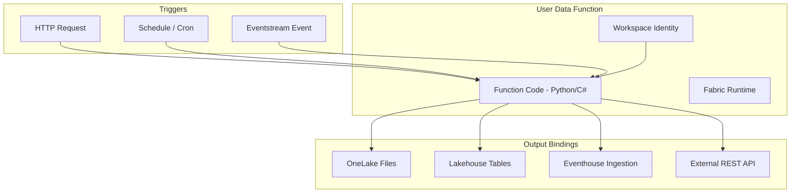
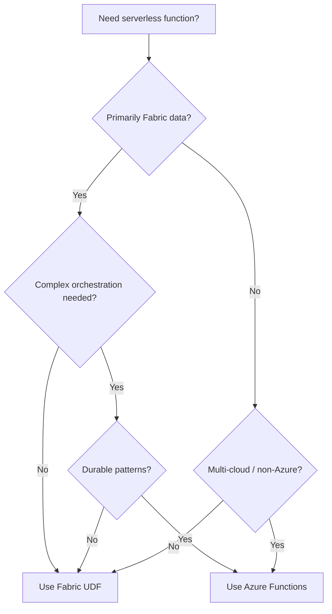

# ⚡ User Data Functions - Serverless Compute in Fabric

<div align="center" markdown>

**Lightweight Functions for API Endpoints, Event Handlers, and Data Transforms**


</div>

---

**Last Updated:** `2026-04-27` | **Version:** 1.0.0

---

## Overview

User Data Functions (UDFs) bring serverless compute natively into the Microsoft Fabric platform. They allow you to write lightweight Python or C# functions that execute within the Fabric security and governance boundary -- no need to provision Azure Functions, manage App Service Plans, or configure networking between Fabric and external compute.

UDFs are ideal for scenarios where a full Spark notebook is overkill: serving a simple REST endpoint, responding to Eventstream events, running a scheduled data quality check, or transforming a small batch of records.

### Key Capabilities

| Capability | Description |
|------------|-------------|
| **Languages** | Python 3.11+, C# (.NET 8) |
| **Triggers** | HTTP, Schedule (cron), Event-driven (Eventstream) |
| **Bindings** | OneLake (read/write), Eventhouse (ingest), Lakehouse (SQL endpoint), REST (outbound) |
| **Identity** | Workspace Identity, user delegated, managed identity |
| **Scaling** | Auto-scale 0-N instances within capacity CU budget |
| **Governance** | Full Fabric RBAC, audit logs, Purview lineage |

---

## Architecture



### Execution Model

1. A trigger fires (HTTP request, cron tick, or event arrival)
2. Fabric allocates compute from the workspace's capacity (CU budget)
3. The function runs in an isolated container with the specified runtime
4. Input/output bindings handle data movement automatically
5. Logs stream to the Fabric monitoring pipeline

---

## Use Cases

### Data Engineering

| Use Case | Description | Why UDF vs Notebook |
|----------|-------------|---------------------|
| **Webhook receiver** | Accept external data pushes via HTTP | Sub-second cold start vs 30s+ Spark startup |
| **Small file processor** | Process individual CSVs < 100 MB | No Spark overhead for small files |
| **Data quality gate** | Validate a batch before pipeline continues | Lightweight check, not a full Spark job |
| **Metadata updater** | Update catalog tags after processing | API call, no data processing |

### Real-Time

| Use Case | Description |
|----------|-------------|
| **Event enrichment** | Enrich Eventstream events with lookup data |
| **Alert evaluation** | Evaluate business rules against streaming events |
| **IoT command** | Respond to sensor readings with control commands |

### API Layer

| Use Case | Description |
|----------|-------------|
| **Custom REST endpoint** | Expose Lakehouse data via a lightweight API |
| **Data gateway** | Proxy requests to OneLake with auth |
| **Aggregation service** | Pre-compute summaries on demand |

---

## Creating Functions

### Python UDF

```python
# function_app.py
import json
import logging
from datetime import datetime

import fabric.functions as fn

app = fn.FabricFunctionsApp()

@app.route("health", methods=["GET"])
def health_check(req: fn.HttpRequest) -> fn.HttpResponse:
    """Simple health check endpoint."""
    return fn.HttpResponse(
        json.dumps({"status": "healthy", "timestamp": datetime.utcnow().isoformat()}),
        status_code=200,
        mimetype="application/json"
    )

@app.route("validate-transaction", methods=["POST"])
def validate_transaction(req: fn.HttpRequest) -> fn.HttpResponse:
    """Validate a casino transaction against compliance thresholds."""
    try:
        body = req.get_json()
        amount = body.get("amount", 0)
        transaction_type = body.get("type", "unknown")
        
        result = {
            "transaction_id": body.get("id"),
            "amount": amount,
            "ctr_flag": amount >= 10000,
            "sar_flag": 8000 <= amount < 10000,
            "w2g_flag": False,
            "validated_at": datetime.utcnow().isoformat()
        }
        
        # W-2G threshold depends on game type
        if transaction_type == "slot_jackpot" and amount >= 1200:
            result["w2g_flag"] = True
        elif transaction_type == "keno" and amount >= 600:
            result["w2g_flag"] = True
        elif transaction_type == "poker" and amount >= 5000:
            result["w2g_flag"] = True
        
        return fn.HttpResponse(
            json.dumps(result),
            status_code=200,
            mimetype="application/json"
        )
    except Exception as e:
        logging.error(f"Validation error: {e}")
        return fn.HttpResponse(
            json.dumps({"error": str(e)}),
            status_code=400,
            mimetype="application/json"
        )

@app.schedule("daily-quality-check", cron="0 6 * * *")
def daily_quality_check(timer: fn.TimerRequest) -> None:
    """Run daily data quality checks on bronze tables."""
    from fabric.onelake import OneLakeClient
    
    client = OneLakeClient()
    # Check row counts, null rates, freshness
    tables = ["slot_telemetry", "table_game_results", "player_tracking"]
    
    for table in tables:
        path = f"lh_bronze.Lakehouse/Tables/{table}"
        stats = client.get_table_stats(path)
        
        if stats["last_modified_hours_ago"] > 24:
            logging.warning(f"STALE DATA: {table} not updated in {stats['last_modified_hours_ago']}h")
        if stats["null_rate"] > 0.05:
            logging.warning(f"HIGH NULL RATE: {table} at {stats['null_rate']:.1%}")
        
        logging.info(f"Quality check passed: {table} ({stats['row_count']} rows)")
```

### C# UDF

```csharp
// FabricFunction.cs
using Microsoft.Fabric.Functions;
using System.Text.Json;

namespace CasinoPOC.Functions;

public class ComplianceFunction
{
    [FabricFunction("check-ctr")]
    [HttpTrigger("POST", Route = "compliance/ctr")]
    public async Task<HttpResponseData> CheckCTR(
        HttpRequestData req,
        FunctionContext context)
    {
        var logger = context.GetLogger("ComplianceFunction");
        var body = await JsonSerializer.DeserializeAsync<TransactionRequest>(req.Body);
        
        var response = req.CreateResponse(System.Net.HttpStatusCode.OK);
        var result = new CTRResult
        {
            TransactionId = body.Id,
            RequiresCTR = body.Amount >= 10000m,
            Amount = body.Amount,
            EvaluatedAt = DateTime.UtcNow
        };
        
        if (result.RequiresCTR)
        {
            logger.LogInformation($"CTR required for transaction {body.Id}: ${body.Amount:N2}");
        }
        
        await response.WriteAsJsonAsync(result);
        return response;
    }
}

public record TransactionRequest(string Id, decimal Amount, string Type);
public record CTRResult(string TransactionId, bool RequiresCTR, decimal Amount, DateTime EvaluatedAt);
```

### Via REST API

```python
import requests

base_url = "https://api.fabric.microsoft.com/v1"
workspace_id = "your-workspace-id"

# Create a User Data Function
payload = {
    "displayName": "casino-compliance-udf",
    "description": "Transaction compliance validation endpoints",
    "definition": {
        "parts": [
            {
                "path": "function_app.py",
                "payloadType": "InlineBase64",
                "payload": "<base64-encoded-python-code>"
            },
            {
                "path": "requirements.txt",
                "payloadType": "InlineBase64",
                "payload": "<base64-encoded-requirements>"
            }
        ]
    }
}

response = requests.post(
    f"{base_url}/workspaces/{workspace_id}/userDataFunctions",
    headers={"Authorization": f"Bearer {token}", "Content-Type": "application/json"},
    json=payload
)
```

---

## Triggers and Bindings

### Trigger Types

| Trigger | Invocation | Latency | Use For |
|---------|-----------|---------|---------|
| **HTTP** | REST call to function URL | ~100-500ms (warm), ~2-5s (cold) | APIs, webhooks, on-demand |
| **Schedule** | Cron expression | N/A (scheduled) | Periodic jobs, quality checks |
| **Eventstream** | Event arrival in stream | ~200-800ms | Real-time processing |

### Input Bindings

```python
# Read from OneLake
@app.route("get-player/{player_id}", methods=["GET"])
@app.input_binding(type="onelake", path="lh_silver.Lakehouse/Tables/player_profiles")
def get_player(req: fn.HttpRequest, onelake_data) -> fn.HttpResponse:
    player_id = req.route_params.get("player_id")
    # onelake_data is a DataFrame-like object filtered by binding config
    player = onelake_data.filter(f"player_id = '{player_id}'").first()
    return fn.HttpResponse(json.dumps(player), mimetype="application/json")
```

### Output Bindings

```python
# Write to Eventhouse
@app.eventstream_trigger("process-slot-event", stream="slot-telemetry-stream")
@app.output_binding(type="eventhouse", database="casino_rt", table="enriched_events")
def enrich_slot_event(event: fn.EventstreamEvent, eventhouse_out) -> None:
    enriched = {
        "original_event": event.body,
        "enriched_at": datetime.utcnow().isoformat(),
        "machine_zone": lookup_zone(event.body["machine_id"]),
        "player_tier": lookup_tier(event.body.get("player_id"))
    }
    eventhouse_out.write(enriched)
```

---

## Integration with Fabric Services

### OneLake

```python
from fabric.onelake import OneLakeClient

client = OneLakeClient()

# Read a Delta table
df = client.read_table("lh_bronze.Lakehouse/Tables/slot_telemetry")

# Write a file
client.write_file(
    "lh_bronze.Lakehouse/Files/webhooks/incoming.json",
    content=json.dumps(payload)
)
```

### Eventhouse (KQL)

```python
from fabric.eventhouse import EventhouseClient

kql_client = EventhouseClient(database="casino_rt")

# Execute a KQL query
results = kql_client.query("""
    slot_events
    | where ingestion_time() > ago(5m)
    | summarize AvgBet = avg(bet_amount) by machine_id
    | top 10 by AvgBet desc
""")
```

### Lakehouse SQL Endpoint

```python
from fabric.sqlendpoint import SqlClient

sql = SqlClient(lakehouse="lh_gold")
result = sql.query("SELECT TOP 10 * FROM gold_slot_performance ORDER BY total_revenue DESC")
```

---

## Authentication and Identity

| Auth Method | When to Use | Configuration |
|-------------|-------------|---------------|
| **Workspace Identity** | Function → Fabric services | Automatic (default) |
| **User delegation** | HTTP trigger, pass-through user context | OAuth token forwarding |
| **Managed Identity** | Function → external Azure services | Configure in function settings |
| **API key** | External callers → function | Generate in function settings |

### Securing HTTP Endpoints

```python
@app.route("admin/purge", methods=["DELETE"], auth_level="admin")
def purge_stale_data(req: fn.HttpRequest) -> fn.HttpResponse:
    """Only Fabric admins can call this endpoint."""
    # auth_level options: anonymous, function, admin
    # "admin" requires Fabric Admin role
    pass
```

---

## Performance and Scaling

### Cold Start Optimization

| Factor | Impact | Mitigation |
|--------|--------|------------|
| **Runtime** | Python: ~2-5s, C#: ~1-3s | Use C# for latency-critical paths |
| **Dependencies** | Each MB adds ~100ms | Minimize packages, use lazy imports |
| **Package size** | >50 MB significantly slower | Use Fabric built-in libraries |
| **Always-on** | Eliminates cold start | Reserve minimum instances (costs CU) |

### Scaling Behavior

```
Requests/sec    Instances     CU Cost
1-10            1             Minimal
10-50           2-5           Moderate
50-200          5-20          Significant
200+            20+           Evaluate capacity
```

### Timeout Limits

| Trigger Type | Default Timeout | Maximum |
|-------------|----------------|---------|
| HTTP | 30 seconds | 230 seconds |
| Schedule | 5 minutes | 10 minutes |
| Eventstream | 30 seconds | 60 seconds |

---

## Comparison: UDFs vs Azure Functions

| Dimension | Fabric UDFs | Azure Functions |
|-----------|-------------|-----------------|
| **Deployment** | Within Fabric workspace | Separate Azure resource |
| **Networking** | Automatic Fabric connectivity | VNet integration needed |
| **Identity** | Workspace Identity (automatic) | Managed Identity (manual) |
| **OneLake access** | Native binding | SDK + configuration |
| **Scaling** | CU-based (shared with other Fabric items) | Dedicated consumption plan |
| **Languages** | Python, C# | Python, C#, JS, Java, PowerShell, Go |
| **Durable functions** | Not supported | Supported |
| **Cost model** | Included in Fabric capacity CU | Pay-per-execution |
| **Cold start** | 2-5s | 1-10s (consumption plan) |
| **Governance** | Fabric RBAC + Purview | Azure RBAC + separate governance |

### Decision Matrix



---

## Casino Implementation

### Real-Time Compliance Validation

```python
@app.eventstream_trigger("compliance-check", stream="financial-transactions")
@app.output_binding(type="eventhouse", database="casino_rt", table="compliance_flags")
def compliance_check(event: fn.EventstreamEvent, compliance_out) -> None:
    """Real-time compliance flagging for casino transactions."""
    txn = event.body
    
    flags = {
        "transaction_id": txn["id"],
        "timestamp": datetime.utcnow().isoformat(),
        "amount": txn["amount"],
        "ctr_flag": txn["amount"] >= 10000,
        "sar_structuring_flag": False,
        "w2g_flag": False
    }
    
    # SAR structuring detection: multiple transactions just under CTR
    # (In production, this would query recent history from Eventhouse)
    if 8000 <= txn["amount"] < 10000:
        flags["sar_structuring_flag"] = True
    
    # W-2G by game type
    thresholds = {"slot": 1200, "keno": 600, "table": 600, "poker": 5000}
    game_type = txn.get("game_type", "unknown")
    if txn["amount"] >= thresholds.get(game_type, 99999):
        flags["w2g_flag"] = True
    
    compliance_out.write(flags)
```

---

## Federal Agency Implementation

### USDA Data Webhook Receiver

```python
@app.route("webhook/usda-crop-report", methods=["POST"], auth_level="function")
@app.output_binding(type="onelake", path="lh_bronze.Lakehouse/Files/webhooks/usda/")
def receive_usda_report(req: fn.HttpRequest, onelake_out) -> fn.HttpResponse:
    """Receive USDA crop report webhook and store in OneLake."""
    payload = req.get_json()
    
    filename = f"crop_report_{datetime.utcnow().strftime('%Y%m%d_%H%M%S')}.json"
    onelake_out.write(filename, json.dumps(payload))
    
    logging.info(f"Received USDA crop report: {len(payload.get('data', []))} records")
    
    return fn.HttpResponse(
        json.dumps({"status": "received", "filename": filename}),
        status_code=202,
        mimetype="application/json"
    )
```

---

## Limitations

| Limitation | Details | Workaround |
|------------|---------|------------|
| **Languages** | Python and C# only | Use Azure Functions for JS/Java/Go |
| **No durable patterns** | No fan-out/fan-in, chaining, or human interaction | Use Fabric Pipelines or Azure Durable Functions |
| **Memory limit** | 1.5 GB per instance | Use Spark notebooks for large datasets |
| **Shared CU** | Consumes from workspace capacity | Monitor via FUAM, set CU guardrails |
| **No VNet injection** | Cannot join custom VNets | Use Azure Functions for VNet-isolated scenarios |
| **Package restrictions** | No native C extensions in Python (some ML libs) | Use Fabric Environments for heavy ML |
| **No local emulator** | Cannot run locally for development | Use unit tests + staging workspace |

---

## References

- [User Data Functions overview](https://learn.microsoft.com/en-us/fabric/data-engineering/user-data-functions-overview)
- [Create a User Data Function](https://learn.microsoft.com/en-us/fabric/data-engineering/create-user-data-functions)
- [Function triggers and bindings](https://learn.microsoft.com/en-us/fabric/data-engineering/user-data-functions-triggers)
- [Workspace Identity for functions](https://learn.microsoft.com/en-us/fabric/security/workspace-identity)
- [Azure Functions comparison](https://learn.microsoft.com/en-us/azure/azure-functions/functions-overview)
