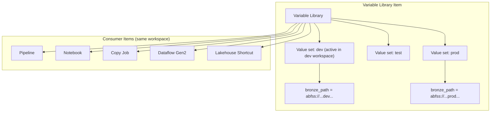

# 🔧 Variable Libraries - Parameterized Pipelines & Environments

<div align="center" markdown>

**Centralized Configuration Management Across Fabric Workspaces**


</div>

---

**Last Updated:** `2026-09-07` | **Version:** 2.0.0

> ⚠️ **Version 2.0.0 corrects significant inaccuracies in v1.0.0.** The previous version described a "Secret" variable type with Azure Key Vault binding that is **not part of the official variable library specification**, and omitted **value sets** — the actual GA mechanism for environment-specific configuration. This version aligns with the [official Microsoft Learn documentation](https://learn.microsoft.com/fabric/cicd/variable-library/variable-library-overview).

---

## Overview

A **variable library** is a Fabric workspace item that defines a set of variables other workspace items — pipelines, notebooks, copy jobs, dataflows, lakehouse shortcuts — read at runtime. Instead of hardcoding connection strings, thresholds, file paths, or environment flags into individual items, you externalize them into a variable library so the **same item definition works in every environment**.

### Key Capabilities

| Capability | Description |
|------------|-------------|
| **Centralized config** | Single item holding configuration values shared across workspace items |
| **Value sets** | Alternative sets of values per environment (dev/test/prod); one value set is **active** per library in each workspace |
| **Reference types** | **Connection reference** and **Item reference** variables with UI item pickers — remove environment-specific IDs from item definitions |
| **Standard types** | String, Number, Integer, DateTime, GUID, Boolean |
| **CI/CD native** | Managed as code — Git integration, deployment pipelines, and REST APIs |
| **fabric-cicd support** | `fabric-cicd` deploys variable libraries **first** (before dependent items) and can **activate a value set** matching the target environment name |

### Variable Types

| Type | Use |
|------|-----|
| **String, Number, Integer, DateTime, GUID, Boolean** | Standard configuration values |
| **Connection reference** | Parameterize connections for ETL items (pipelines, lakehouse shortcuts) — the UI shows a connection picker |
| **Item reference** | Parameterize dependencies on other Fabric items (e.g., a notebook writing to a lakehouse in another workspace) — the UI shows an item picker |

---

## Architecture



### How Resolution Works

1. Each workspace holds the **same variable library definition**, but the **active value set differs** per workspace
2. A consumer item references a variable (e.g., in a pipeline, via **Library variables** in the pipeline editor)
3. At runtime, the item reads the value from the **active value set** of the variable library in its workspace
4. Promoting items across dev/test/prod workspaces requires **no item changes** — only the active value set differs

---

## Creating and Using Variable Libraries

### Via the Fabric Portal

1. In your workspace, select **New item → Variable library**
2. Add variables with a name, type, and default value
3. Add **value sets** (e.g., `dev`, `test`, `prod`) with environment-specific values
4. Set the **active value set** for this library in the workspace
5. In a consumer item (e.g., a pipeline), select **Library variables** and reference the variable

### In Pipelines

Declare library variables in the pipeline editor (**Library variables → New**), mapping a pipeline variable to a library variable:

| Name | Library | Variable name | Type |
|------|---------|---------------|------|
| `SourceLH` | WS Variables | `Source_LH` | String |
| `DestinationLH` | WS Variables | `Destination_LH` | String |
| `SourceTableName` | WS Variables | `SourceTable_Name` | String |

Then reference them in activities via dynamic content.

### In Dataflow Gen2

Variable libraries integrate with Dataflow Gen2 (preview, September 2025) — reference variables directly in the dataflow for dynamic behavior across environments. See [Variable libraries in Dataflow Gen2](https://learn.microsoft.com/fabric/data-factory/dataflow-gen2-variable-library-integration).

### In Notebooks

Notebooks read variable library values through the notebook's variable library binding. Avoid hardcoding environment-specific settings:

```python
# BAD — hardcoded, environment-specific
database_server = '<server-name>.database.windows.net'
database_name = 'ProductSalesDev'

# GOOD — read from the variable library bound to the notebook
# (variable names resolve from the active value set of the workspace)
```

---

## CI/CD and Environment Promotion

### With Deployment Pipelines

Each stage's workspace has the same variable library but a different active value set. After a one-time setup of the active value set per stage, the correct values are used automatically in each stage.

### With fabric-cicd

`fabric-cicd` handles variable libraries specially:

1. It **always deploys the variable library first**, before any items that depend on it
2. It can **activate a specific value set** — the value set name must match the target environment name passed to the deployment (e.g., deploy with environment `test` activates the value set named `test`)

```bash
pip install fabric-cicd
```

```python
from fabric_cicd import deploy_with_config

deploy_with_config(
    token_credential=credential,      # service principal via env vars
    config_file_path="deploy.yml",    # defines test/prod target workspaces
    environment="prod",               # activates the 'prod' value set
)
```

### Guidance

- **Prefer variable libraries over deployment rules** for parameterization — they're the strategic Fabric capability for environment-specific configuration
- When an item type doesn't support variable libraries, fall back to direct item-definition edits in Git or via the Fabric REST API

---

## Secrets: What Variable Libraries Do NOT Do

Variable libraries have **no native "Secret" type and no Azure Key Vault binding**. Do not store credentials in variable library values.

For secrets in Fabric:

| Approach | Mechanism |
|----------|-----------|
| **Notebook access to Key Vault** | `mssparkutils.credentials.getSecret("https://<vault>.vault.azure.net/", "<secret-name>")` — requires the workspace identity or caller to have `Get` on the secret |
| **Pipeline connections** | Store credentials in the Fabric **connection** object (not the variable library); use a **connection reference** variable to point at the right connection per environment |
| **PII salt (this repo)** | `FABRIC_POC_HASH_SALT` env var — never hardcode, never place in a variable library |

---

## Comparison Matrix

| Feature | Variable Libraries | Pipeline Parameters | Spark Config | Deployment Rules |
|---------|-------------------|--------------------|--------------|------------------|
| **Scope** | Workspace-wide, cross-item | Single pipeline | Spark session | Per deployment stage |
| **Environment mechanism** | Value sets (active per library per workspace) | Param files per env | Environment YAML | Rules per stage |
| **Reference types** | Connection + Item references | No | No | No |
| **Git integration** | Yes (item definition) | Pipeline JSON | environment.yml | No |
| **fabric-cicd** | Deployed first + value-set activation | Via item definitions | Via item definitions | Not supported |
| **Best for** | Shared, environment-specific config | Pipeline-specific params | Spark tuning | Legacy PBI parameterization |

---

## Casino Implementation

The following JSON is a **conceptual configuration sketch, not an importable Fabric item definition**. Create the variables and value sets in the portal, or use the [official multi-file definition format](https://learn.microsoft.com/rest/api/fabric/articles/item-management/definitions/variable-library-definition): `variables.json`, `settings.json`, and separate `valueSets/*.json` files. Item references require identifiers rather than the display names used in this sketch.

```json
{
  "displayName": "casino-config",
  "variables": {
    "casino_id":          { "type": "String",  "note": "Property identifier" },
    "ctr_threshold":      { "type": "Integer", "note": "CTR filing threshold — fixed at 10000 across all envs" },
    "sar_lower_bound":    { "type": "Integer", "note": "SAR pattern lower bound (8000)" },
    "sar_upper_bound":    { "type": "Integer", "note": "SAR pattern upper bound (9900)" },
    "w2g_slot_threshold": { "type": "Integer", "note": "W-2G slots threshold (1200)" },
    "w2g_keno_threshold": { "type": "Integer", "note": "W-2G keno threshold (600)" },
    "w2g_poker_threshold":{ "type": "Integer", "note": "W-2G poker threshold (5000)" },
    "bronze_lakehouse":   { "type": "ItemReference", "note": "Bronze lakehouse for this environment" },
    "source_connection":  { "type": "ConnectionReference", "note": "Source system connection for this environment" }
  },
  "valueSets": {
    "dev":  { "bronze_lakehouse": "lh_bronze_dev",  "source_connection": "conn-dev" },
    "prod": { "bronze_lakehouse": "lh_bronze_prod", "source_connection": "conn-prod" }
  }
}
```

> Compliance thresholds (CTR $10,000; SAR $8,000–$9,900; W-2G $1,200/$600/$5,000) are **constants, not environment-specific** — define them once in the default value set and don't override per environment. The PII hash salt comes from `FABRIC_POC_HASH_SALT`, never from a variable library.

---

## Limitations

| Limitation | Details | Workaround |
|------------|---------|------------|
| **Workspace-scoped** | Libraries live in one workspace; consumers must be in the same workspace | Use item reference variables for cross-workspace dependencies; sync definitions via Git/fabric-cicd |
| **No secret type** | No Key Vault binding | Use connection objects + `mssparkutils.credentials.getSecret` |
| **Item support varies** | Not every item type reads variable libraries | Check the [supported items](https://learn.microsoft.com/fabric/cicd/git-integration/intro-to-git-integration#supported-items) matrix; fall back to item-definition edits |
| **Active value set is per library per workspace** | Each library has one active set at a time; different libraries can select different sets | Configure each library's active set for the target environment |

---

## References

- [What is a variable library?](https://learn.microsoft.com/fabric/cicd/variable-library/variable-library-overview)
- [Variable types](https://learn.microsoft.com/fabric/cicd/variable-library/variable-types)
- [Value sets](https://learn.microsoft.com/fabric/cicd/variable-library/value-sets)
- [Item reference variable type](https://learn.microsoft.com/fabric/cicd/variable-library/item-reference-variable-type)
- [Variable library integration with pipelines](https://learn.microsoft.com/fabric/data-factory/variable-library-integration-with-data-pipelines)
- [Variable libraries in Dataflow Gen2](https://learn.microsoft.com/fabric/data-factory/dataflow-gen2-variable-library-integration)
- [Tutorial: Use variable libraries](https://learn.microsoft.com/fabric/cicd/variable-library/tutorial-variable-library)
- [Fabric CI/CD concepts and best practices](https://learn.microsoft.com/fabric/fundamentals/understand-best-practices-fabric-cicd)

---

## 🔗 Related Documents

- [Git Integration](git-integration.md) — Source control for variable library definitions
- [Deployment Pipelines](deployment-pipelines.md) — Stage-based promotion with value sets
- [Fabric CI/CD Deployment](../best-practices/fabric-cicd-deployment.md) — fabric-cicd automation
- [Notebook Resources & Environments](notebook-resources-environments.md) — Complementary dependency management

---

> 📝 **Document Metadata**
> - **Author**: Documentation Team
> - **Reviewers**: Platform Engineering, DevOps
> - **Classification**: Internal
> - **Next Review**: 2026-12-07
