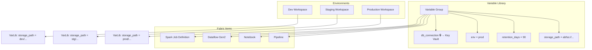
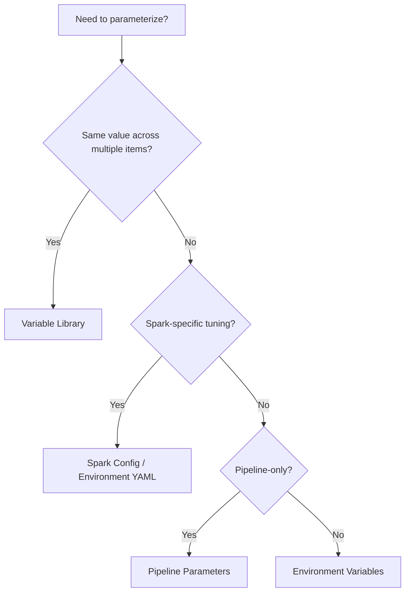

# 🔧 Variable Libraries - Parameterized Pipelines & Environments

<div align="center" markdown>

**Centralized Configuration Management Across Fabric Workspaces**


</div>

---

**Last Updated:** `2026-04-27` | **Version:** 1.0.0

---

## Overview

Variable Libraries in Microsoft Fabric provide a centralized mechanism for managing configuration values across pipelines, notebooks, dataflows, and Spark Job Definitions. Rather than hard-coding connection strings, thresholds, file paths, or environment flags into individual items, Variable Libraries let you define named groups of key-value pairs that are resolved at runtime.

This is essential for enterprises that promote artifacts from development through staging to production -- the same pipeline definition works in every environment because environment-specific values (storage paths, database endpoints, retention days) are externalized into Variable Libraries.

### Key Capabilities

| Capability | Description |
|------------|-------------|
| **Centralized config** | Single pane of glass for all configuration values in a workspace |
| **Environment promotion** | Same artifact, different config per environment |
| **Secret binding** | Reference Azure Key Vault secrets without embedding credentials |
| **Type safety** | String, integer, boolean, and secret types |
| **REST API management** | Full CRUD via Fabric REST API for CI/CD automation |
| **Scope inheritance** | Workspace-level defaults, item-level overrides |

---

## Architecture



### How Variable Resolution Works

1. A pipeline or notebook references a variable by name (e.g., `@variables('storage_path')`)
2. At runtime, Fabric resolves the variable from the Variable Library attached to the current workspace
3. Secret variables trigger an authenticated call to Azure Key Vault
4. The resolved value is injected into the activity or cell execution context

---

## Creating Variable Libraries

### Via the Fabric Portal

1. Navigate to your workspace
2. Select **+ New** > **Variable Library**
3. Provide a name (e.g., `casino-config-dev`)
4. Add variables with Name, Type, and Value
5. For secrets, select Type = **Secret** and configure Key Vault binding

### Via REST API

```python
import requests

base_url = "https://api.fabric.microsoft.com/v1"
workspace_id = "your-workspace-id"
token = "your-bearer-token"

headers = {
    "Authorization": f"Bearer {token}",
    "Content-Type": "application/json"
}

# Create a Variable Library
payload = {
    "displayName": "casino-config-dev",
    "description": "Casino POC configuration for development environment",
    "definition": {
        "parts": [
            {
                "path": "variableLibrary.json",
                "payload": {
                    "variables": {
                        "storage_account": {
                            "type": "String",
                            "value": "fabricpocdev"
                        },
                        "bronze_path": {
                            "type": "String",
                            "value": "abfss://bronze@onelake.dfs.fabric.microsoft.com/lh_bronze.Lakehouse/Tables"
                        },
                        "retention_days": {
                            "type": "Int",
                            "value": 90
                        },
                        "enable_pii_masking": {
                            "type": "Bool",
                            "value": True
                        },
                        "ctr_threshold": {
                            "type": "Int",
                            "value": 10000
                        },
                        "db_connection_string": {
                            "type": "Secret",
                            "keyVaultUrl": "https://kv-fabric-poc-dev.vault.azure.net/",
                            "secretName": "sql-connection-string"
                        }
                    }
                }
            }
        ]
    }
}

response = requests.post(
    f"{base_url}/workspaces/{workspace_id}/variableLibraries",
    headers=headers,
    json=payload
)
print(response.status_code, response.json())
```

### Updating Variables

```python
# Update a specific variable value
library_id = "your-library-id"

update_payload = {
    "variables": {
        "retention_days": {
            "type": "Int",
            "value": 365  # Production: longer retention
        }
    }
}

response = requests.patch(
    f"{base_url}/workspaces/{workspace_id}/variableLibraries/{library_id}",
    headers=headers,
    json=update_payload
)
```

---

## Environment-Specific Values

The core value of Variable Libraries is environment promotion. The same pipeline YAML or notebook travels unchanged from dev to prod; only the Variable Library differs per workspace.

### Recommended Pattern

| Variable | Dev | Staging | Production |
|----------|-----|---------|------------|
| `env` | `dev` | `staging` | `prod` |
| `bronze_path` | `abfss://bronze@dev-onelake/...` | `abfss://bronze@stg-onelake/...` | `abfss://bronze@prd-onelake/...` |
| `retention_days` | `30` | `90` | `365` |
| `enable_pii_masking` | `false` | `true` | `true` |
| `ctr_threshold` | `10000` | `10000` | `10000` |
| `log_level` | `DEBUG` | `INFO` | `WARNING` |
| `max_parallelism` | `2` | `4` | `8` |
| `db_connection` | KV-dev secret | KV-stg secret | KV-prd secret |

### CI/CD Promotion Script

```python
"""
Promote Variable Library values across environments.
Used in GitHub Actions or Azure DevOps pipelines.
"""
import json
import sys

def promote_variables(source_env: str, target_env: str, overrides: dict):
    """Read source env config, apply target overrides, push to target workspace."""
    
    with open(f"config/variables-{source_env}.json") as f:
        variables = json.load(f)
    
    # Apply environment-specific overrides
    for key, value in overrides.items():
        if key in variables:
            variables[key]["value"] = value
    
    # Update target workspace Variable Library via REST API
    update_variable_library(
        workspace_id=WORKSPACE_IDS[target_env],
        library_id=LIBRARY_IDS[target_env],
        variables=variables
    )
    print(f"Promoted {len(variables)} variables from {source_env} to {target_env}")

# Usage: python promote.py staging prod
if __name__ == "__main__":
    OVERRIDES = {
        "prod": {
            "retention_days": 365,
            "log_level": "WARNING",
            "max_parallelism": 8
        }
    }
    promote_variables(sys.argv[1], sys.argv[2], OVERRIDES.get(sys.argv[2], {}))
```

---

## Secrets and Key Vault Integration

Variable Libraries integrate natively with Azure Key Vault for sensitive values.

### Configuration

```json
{
    "db_connection_string": {
        "type": "Secret",
        "keyVaultUrl": "https://kv-fabric-poc-prod.vault.azure.net/",
        "secretName": "casino-db-connection",
        "secretVersion": "a1b2c3d4e5f6"
    },
    "api_key": {
        "type": "Secret",
        "keyVaultUrl": "https://kv-fabric-poc-prod.vault.azure.net/",
        "secretName": "external-api-key"
    }
}
```

### Requirements

1. **Key Vault Access Policy**: The Fabric workspace identity (or the Entra app registration used by the pipeline) must have `Get` permission on secrets
2. **Network Access**: If Key Vault uses private endpoints, ensure Fabric's managed VNet can reach it
3. **Secret Rotation**: Use Key Vault versioning; update the `secretVersion` in the Variable Library or omit it to always get the latest

### Reading Secrets in Notebooks

```python
# In a Fabric notebook, secret variables are resolved automatically
# when accessed through the Variable Library binding

# Option 1: Via mssparkutils (recommended)
db_conn = mssparkutils.credentials.getSecret(
    "https://kv-fabric-poc-prod.vault.azure.net/",
    "casino-db-connection"
)

# Option 2: Via pipeline parameter passthrough
# Pipeline passes secret variable as a notebook parameter
db_conn = dbutils.widgets.get("db_connection_string")  # Already resolved
```

---

## Using Variables in Fabric Items

### In Pipelines

```json
{
    "name": "Copy Bronze Data",
    "type": "Copy",
    "inputs": [],
    "outputs": [],
    "typeProperties": {
        "source": {
            "type": "DelimitedTextSource",
            "storeSettings": {
                "type": "AzureBlobFSReadSettings",
                "filePath": "@variables('bronze_path')"
            }
        },
        "sink": {
            "type": "LakehouseTableSink",
            "tableName": "slot_telemetry"
        }
    }
}
```

### In Notebooks (PySpark)

```python
# Read variable library values passed as notebook parameters
env = spark.conf.get("spark.fabric.variable.env", "dev")
bronze_path = spark.conf.get("spark.fabric.variable.bronze_path")
retention_days = int(spark.conf.get("spark.fabric.variable.retention_days", "90"))
ctr_threshold = int(spark.conf.get("spark.fabric.variable.ctr_threshold", "10000"))

print(f"Environment: {env}")
print(f"Bronze path: {bronze_path}")
print(f"Retention: {retention_days} days")

# Use in transformations
from pyspark.sql import functions as F
from datetime import datetime, timedelta

cutoff_date = datetime.now() - timedelta(days=retention_days)

df = spark.read.format("delta").load(bronze_path)
df_filtered = df.filter(F.col("event_timestamp") >= cutoff_date)

# Compliance check using variable threshold
df_ctr = df_filtered.filter(F.col("transaction_amount") >= ctr_threshold)
print(f"CTR candidates: {df_ctr.count()}")
```

### In Dataflow Gen2

Reference variables using the `@variables('name')` expression syntax in source/sink configurations and transformation steps.

### In Spark Job Definitions

```python
# main.py for Spark Job Definition
import argparse
from pyspark.sql import SparkSession

def main():
    parser = argparse.ArgumentParser()
    parser.add_argument("--env", required=True)
    parser.add_argument("--bronze-path", required=True)
    parser.add_argument("--retention-days", type=int, default=90)
    args = parser.parse_args()

    spark = SparkSession.builder.appName(f"bronze-ingest-{args.env}").getOrCreate()
    
    df = spark.read.format("delta").load(args.bronze_path)
    print(f"Loaded {df.count()} records from {args.bronze_path}")
    
    spark.stop()

if __name__ == "__main__":
    main()
```

---

## Comparison Matrix

| Feature | Variable Libraries | Pipeline Parameters | Spark Config | Environment Variables |
|---------|-------------------|--------------------|--------------|-----------------------|
| **Scope** | Workspace-wide | Single pipeline | Spark session | OS / container level |
| **Secret support** | Key Vault binding | Expression only | No | Manual injection |
| **Type safety** | String, Int, Bool, Secret | String, Int, Bool, Array | String only | String only |
| **Promotion** | Per-workspace | Per-pipeline param file | Per-environment YAML | Per-deployment |
| **REST API** | Full CRUD | Pipeline API | Spark API | Not applicable |
| **Git integration** | Variable Library JSON | Pipeline JSON | environment.yml | .env files (risky) |
| **Access control** | Workspace RBAC | Pipeline RBAC | Workspace RBAC | OS-level |
| **Best for** | Cross-item config | Pipeline-specific params | Spark tuning | System-level config |

### Decision Guide



---

## Best Practices

### Naming Conventions

| Pattern | Example | When to Use |
|---------|---------|-------------|
| `domain_setting` | `casino_ctr_threshold` | Domain-specific business rules |
| `layer_path` | `bronze_storage_path` | Medallion layer paths |
| `infra_setting` | `infra_max_parallelism` | Infrastructure tuning |
| `secret_name` | `secret_db_connection` | Prefix secrets for visibility |

### Versioning Strategy

1. **Store Variable Library definitions in Git** alongside pipeline and notebook code
2. **Use environment-specific JSON files**: `config/variables-dev.json`, `config/variables-prod.json`
3. **Never commit secret values** -- only Key Vault references
4. **Tag releases** so you can roll back variable configurations alongside code

### Access Control

| Role | Create Libraries | Edit Values | Read Values | Manage Secrets |
|------|-----------------|-------------|-------------|----------------|
| Workspace Admin | Yes | Yes | Yes | Yes |
| Member | No | Yes | Yes | No |
| Contributor | No | No | Yes | No |
| Viewer | No | No | No | No |

### Governance Recommendations

- **Audit variable changes** using the Fabric Activity Log
- **Limit secret access** to the minimum number of workspace members
- **Rotate Key Vault secrets** on a defined schedule (90 days recommended)
- **Document every variable** with a description explaining its purpose and valid values
- **Use consistent naming** across all environments to simplify promotion scripts

---

## Casino Implementation

### Casino POC Variable Library

```json
{
    "displayName": "casino-config",
    "variables": {
        "casino_id": { "type": "String", "value": "RESORT-001" },
        "ctr_threshold": { "type": "Int", "value": 10000 },
        "sar_lower_bound": { "type": "Int", "value": 8000 },
        "sar_upper_bound": { "type": "Int", "value": 9999 },
        "w2g_slot_threshold": { "type": "Int", "value": 1200 },
        "w2g_keno_threshold": { "type": "Int", "value": 600 },
        "w2g_poker_threshold": { "type": "Int", "value": 5000 },
        "pii_hash_salt": {
            "type": "Secret",
            "keyVaultUrl": "https://kv-casino-poc.vault.azure.net/",
            "secretName": "pii-hash-salt"
        },
        "bronze_path": { "type": "String", "value": "abfss://bronze@onelake.dfs.fabric.microsoft.com/lh_bronze.Lakehouse/Tables" },
        "retention_days": { "type": "Int", "value": 365 },
        "enable_realtime": { "type": "Bool", "value": true }
    }
}
```

---

## Federal Agency Implementation

### USDA Variable Library

```json
{
    "displayName": "usda-config",
    "variables": {
        "agency_code": { "type": "String", "value": "USDA" },
        "api_base_url": { "type": "String", "value": "https://quickstats.nass.usda.gov/api" },
        "api_key": {
            "type": "Secret",
            "keyVaultUrl": "https://kv-federal-poc.vault.azure.net/",
            "secretName": "usda-api-key"
        },
        "bronze_path": { "type": "String", "value": "abfss://bronze@onelake.dfs.fabric.microsoft.com/lh_bronze.Lakehouse/Tables/usda" },
        "data_retention_years": { "type": "Int", "value": 7 },
        "pii_masking_enabled": { "type": "Bool", "value": true }
    }
}
```

---

## Limitations

| Limitation | Details | Workaround |
|------------|---------|------------|
| **Max variables per library** | 100 variables per library | Split into multiple libraries by domain |
| **Value size** | 4 KB per variable value | Store large configs as OneLake files |
| **No cross-workspace references** | Libraries are workspace-scoped | Use CI/CD to sync across workspaces |
| **Secret latency** | Key Vault calls add ~200ms per secret | Cache in session if safe to do so |
| **No nested objects** | Flat key-value only | Use JSON strings for structured values |
| **Audit granularity** | Change tracking at library level, not per variable | Use Git history for variable-level tracking |

---

## References

- [Microsoft Fabric Variable Libraries documentation](https://learn.microsoft.com/en-us/fabric/data-factory/variable-library-overview)
- [Azure Key Vault integration with Fabric](https://learn.microsoft.com/en-us/fabric/security/key-vault-integration)
- [Pipeline parameterization patterns](https://learn.microsoft.com/en-us/fabric/data-factory/pipeline-parameters)
- [Fabric REST API reference](https://learn.microsoft.com/en-us/rest/api/fabric/)
- [Environment promotion best practices](https://learn.microsoft.com/en-us/fabric/cicd/deployment-pipelines-overview)
