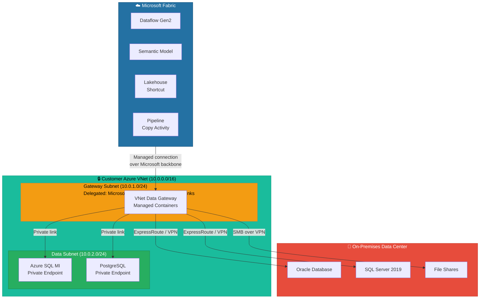
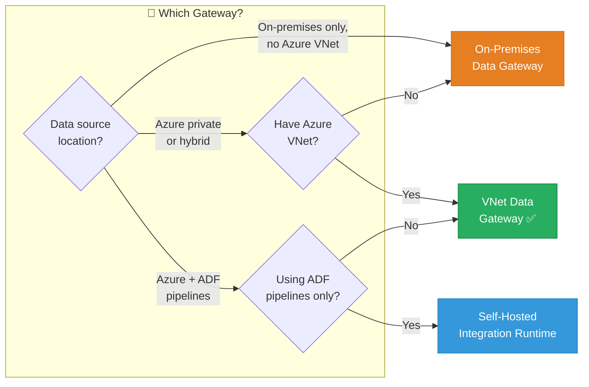
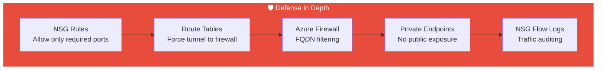
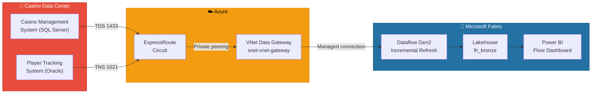
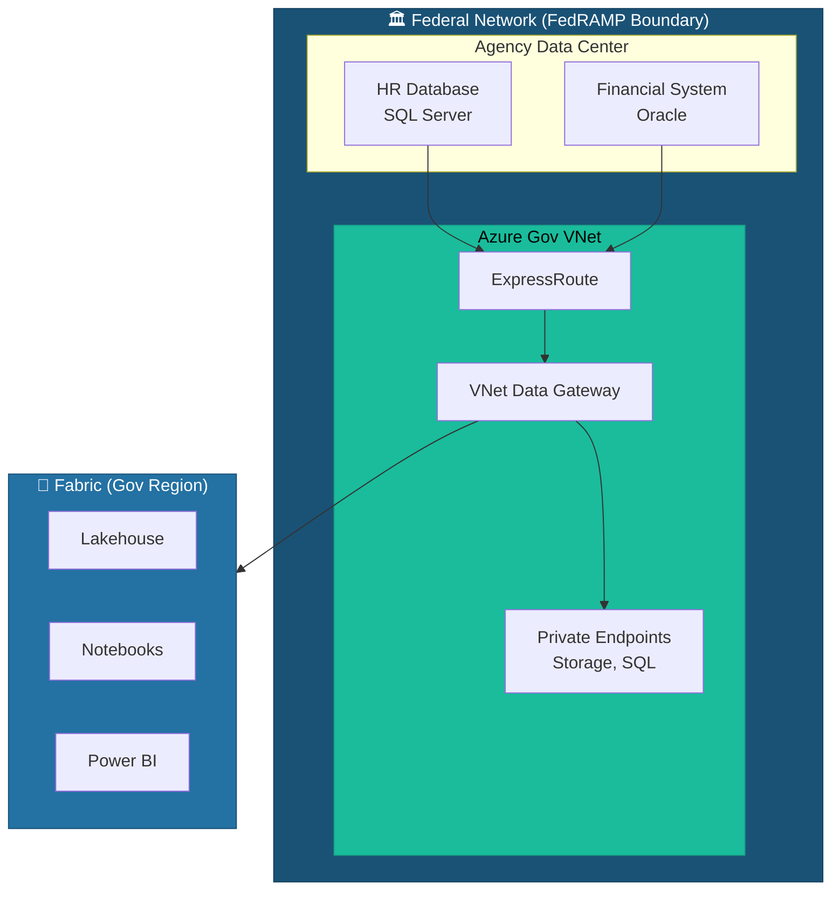

[Home](../index.md) > [Docs](../) > [Features](./) > VNet Data Gateway

# 🔒 VNet Data Gateway - Secure Connectivity from Your Virtual Network

<div align="center" markdown>

**Access On-Premises and Private Data Sources Securely Through Your Azure VNet**


</div>

---

**Last Updated:** `2026-04-21` | **Version:** 1.0.0

---

## 📑 Table of Contents

- [🎯 Overview](#-overview)
- [🏗️ Architecture](#️-architecture)
- [⚙️ Setup & Requirements](#️-setup--requirements)
- [🔀 Gateway Comparison](#-gateway-comparison)
- [🔌 Supported Data Sources](#-supported-data-sources)
- [🔐 Security & Network Configuration](#-security--network-configuration)
- [📊 Performance & Scaling](#-performance--scaling)
- [🎰 Casino Implementation](#-casino-implementation)
- [🏛️ Federal Agency Implementation](#️-federal-agency-implementation)
- [⚠️ Limitations](#️-limitations)
- [📚 References](#-references)
- [🔗 Related Documents](#-related-documents)

---

## 🎯 Overview

The VNet Data Gateway is a Microsoft-managed gateway that runs inside a customer's Azure Virtual Network (VNet), enabling Fabric to securely connect to data sources that are not publicly accessible. Unlike the traditional on-premises data gateway — which requires installing and maintaining software on a dedicated VM — the VNet Data Gateway is a fully managed Azure resource that inherits the network security posture of your VNet.

This means data never leaves the customer's network boundary when transiting between private data sources and Fabric. The gateway containers are injected into a delegated subnet within the customer's VNet, giving them access to any resource reachable from that subnet — including on-premises networks connected via ExpressRoute or VPN, private endpoint-protected Azure services, and VNet-peered resources.

### Key Capabilities

| Capability | Description |
|-----------|-------------|
| **Managed Infrastructure** | No VMs to patch, no gateway software to update — Microsoft manages the compute |
| **VNet Integration** | Runs inside your subnet with your NSG rules and route tables |
| **On-Premises Access** | Reaches on-premises data via ExpressRoute, S2S VPN, or VNet peering |
| **Private Endpoints** | Connects to Azure PaaS services over private endpoints |
| **Auto-Scaling** | Scales gateway containers automatically based on load |
| **No Public Exposure** | Data sources never need a public IP or firewall exception |

---

## 🏗️ Architecture



### How It Works

1. **Subnet Delegation**: You delegate a subnet to `Microsoft.PowerPlatform/vnetaccesslinks`. This allows Microsoft to inject managed gateway containers.
2. **Gateway Registration**: In the Fabric portal (or via API), you create a VNet Data Gateway and associate it with the delegated subnet.
3. **Connection Binding**: Data connections in Fabric (Dataflows, Pipelines, Semantic Models) reference the VNet Gateway instead of an on-premises gateway.
4. **Traffic Flow**: When a query executes, Fabric routes the request through the Microsoft backbone to the gateway containers in your subnet. The containers connect to data sources using your VNet's routing and NSG rules.

---

## ⚙️ Setup & Requirements

### Prerequisites

| Requirement | Details |
|-------------|---------|
| **Azure Subscription** | Same tenant as Fabric |
| **VNet** | Existing VNet in a [supported region](https://learn.microsoft.com/data-integration/vnet/overview#supported-azure-regions) |
| **Subnet** | Dedicated subnet with at least /28 CIDR (16 IPs); /26 recommended for production |
| **Subnet Delegation** | Delegated to `Microsoft.PowerPlatform/vnetaccesslinks` |
| **Fabric License** | F64 or higher (VNet gateway requires Premium/Fabric capacity) |
| **Permissions** | Network Contributor on the VNet; Fabric Admin or Gateway Admin |
| **Resource Provider** | `Microsoft.PowerPlatform` registered in the subscription |

### Step-by-Step Setup

#### 1. Prepare the Subnet

```bicep
// VNet with delegated subnet for VNet Data Gateway
resource vnet 'Microsoft.Network/virtualNetworks@2023-09-01' = {
  name: 'vnet-fabric-${environment}'
  location: location
  properties: {
    addressSpace: {
      addressPrefixes: ['10.0.0.0/16']
    }
    subnets: [
      {
        name: 'snet-vnet-gateway'
        properties: {
          addressPrefix: '10.0.1.0/26'
          delegations: [
            {
              name: 'delegation-powerplatform'
              properties: {
                serviceName: 'Microsoft.PowerPlatform/vnetaccesslinks'
              }
            }
          ]
          networkSecurityGroup: {
            id: nsgVnetGateway.id
          }
        }
      }
      {
        name: 'snet-data'
        properties: {
          addressPrefix: '10.0.2.0/24'
        }
      }
    ]
  }
}
```

#### 2. Configure NSG Rules

```bicep
resource nsgVnetGateway 'Microsoft.Network/networkSecurityGroups@2023-09-01' = {
  name: 'nsg-vnet-gateway'
  location: location
  properties: {
    securityRules: [
      {
        name: 'AllowOutboundToDataSources'
        properties: {
          priority: 100
          direction: 'Outbound'
          access: 'Allow'
          protocol: 'Tcp'
          sourceAddressPrefix: '10.0.1.0/26'
          sourcePortRange: '*'
          destinationAddressPrefix: '10.0.2.0/24'
          destinationPortRanges: ['1433', '5432', '1521']
        }
      }
      {
        name: 'AllowOutboundHTTPS'
        properties: {
          priority: 110
          direction: 'Outbound'
          access: 'Allow'
          protocol: 'Tcp'
          sourceAddressPrefix: '10.0.1.0/26'
          sourcePortRange: '*'
          destinationAddressPrefix: 'AzureCloud'
          destinationPortRange: '443'
        }
      }
      {
        name: 'DenyAllOtherOutbound'
        properties: {
          priority: 4096
          direction: 'Outbound'
          access: 'Deny'
          protocol: '*'
          sourceAddressPrefix: '*'
          sourcePortRange: '*'
          destinationAddressPrefix: '*'
          destinationPortRange: '*'
        }
      }
    ]
  }
}
```

#### 3. Register the Gateway in Fabric

Navigate to **Settings > Manage connections and gateways > Virtual network data gateways > + New** and select the subscription, VNet, and delegated subnet.

Alternatively via PowerShell:

```powershell
# Register VNet Data Gateway
$params = @{
    Name              = "vnetgw-fabric-prod"
    SubscriptionId    = $subscriptionId
    ResourceGroupName = $rgName
    VNetName          = "vnet-fabric-prod"
    SubnetName        = "snet-vnet-gateway"
    Region            = "eastus2"
}
New-VirtualNetworkDataGateway @params
```

---

## 🔀 Gateway Comparison

| Feature | On-Premises Gateway | VNet Data Gateway | SHIR (ADF) |
|---------|-------------------|------------------|------------|
| **Management** | Customer-managed VM | Microsoft-managed | Customer-managed VM |
| **Install Required** | Yes (Windows service) | No | Yes (Windows/Linux) |
| **Auto Updates** | Optional | Automatic | Automatic |
| **Scaling** | Manual (add nodes) | Automatic | Manual |
| **Network** | Outbound HTTPS only | Runs inside VNet | Runs on customer VM |
| **On-Premises Access** | Direct (runs on-prem) | Via ExpressRoute/VPN | Direct (runs on-prem) |
| **High Availability** | Gateway cluster (2+ nodes) | Built-in | HA cluster |
| **Fabric Support** | Dataflows, Semantic Models, Pipelines | Dataflows, Semantic Models, Pipelines | Pipelines only |
| **Cost** | VM compute cost | Included in Fabric capacity | VM compute cost |
| **Patching** | Customer responsibility | Microsoft-managed | Auto-update |
| **Private Endpoints** | N/A | Full support | Full support |
| **Ideal For** | On-prem only, no Azure VNet | Hybrid cloud, Azure PaaS private | ADF-centric pipelines |



---

## 🔌 Supported Data Sources

| Data Source | Protocol | Port | Auth Methods |
|------------|----------|------|-------------|
| **SQL Server** | TDS | 1433 | SQL Auth, Windows Auth, Entra ID |
| **Azure SQL Database** | TDS | 1433 | SQL Auth, Entra ID, MSI |
| **Azure SQL MI** | TDS | 1433/3342 | SQL Auth, Entra ID |
| **Oracle** | TNS | 1521 | Oracle Auth |
| **PostgreSQL** | libpq | 5432 | Password, Entra ID |
| **MySQL** | MySQL Protocol | 3306 | Password |
| **SAP HANA** | SQLDBC | 30015 | Password |
| **Dataverse** | HTTPS | 443 | Entra ID |
| **SharePoint** | HTTPS | 443 | Entra ID |
| **File System** | SMB | 445 | Windows Auth |

---

## 🔐 Security & Network Configuration

### Network Security Best Practices



| Control | Configuration | Purpose |
|---------|--------------|---------|
| **NSG Inbound** | Deny all (no inbound needed) | Gateway only makes outbound connections |
| **NSG Outbound** | Allow TCP 443 to AzureCloud; allow data source ports to data subnet | Minimal egress |
| **Route Table** | UDR to Azure Firewall for outbound inspection | Traffic auditing |
| **Private DNS** | Link private DNS zones to gateway VNet | Resolve private endpoints |
| **Service Endpoints** | Optional for Azure Storage, SQL | Simplify PaaS connectivity |

### Credential Management

All data source credentials are stored in Azure Key Vault or Fabric's managed credential store. Credentials never transit through the public internet.

```python
# Connection using Fabric managed connection
connection_config = {
    "gateway_id": "vnetgw-fabric-prod",
    "datasource_type": "Sql",
    "server": "sql-casino-prod.database.windows.net",
    "database": "CasinoOps",
    "auth_type": "ServicePrincipal",
    "credential_reference": "kv-fabric/sp-sql-reader"
}
```

---

## 📊 Performance & Scaling

### Scaling Behavior

The VNet Data Gateway automatically scales containers within the delegated subnet based on concurrent query load.

| Metric | Details |
|--------|---------|
| **Minimum Containers** | 1 (always-on) |
| **Maximum Containers** | Limited by subnet IP space and capacity SKU |
| **Scale-Up Trigger** | Queue depth > threshold |
| **Scale-Down** | Idle containers removed after 10 minutes |
| **Cold Start** | ~30 seconds for first container |

### Subnet Sizing Guide

| Workload | Concurrent Queries | Recommended Subnet | Usable IPs |
|----------|--------------------|---------------------|------------|
| **Dev/Test** | 1-5 | /28 | 11 |
| **Small Production** | 5-20 | /27 | 27 |
| **Medium Production** | 20-50 | /26 | 59 |
| **Large Production** | 50+ | /25 | 123 |

> 📝 Azure reserves 5 IPs per subnet. Subnet size directly limits max concurrent gateway containers.

---

## 🎰 Casino Implementation

### Secure Access to On-Premises SQL Server

Casino operators running SQL Server on-premises for their casino management system (CMS) can use the VNet Data Gateway to securely pull slot telemetry, player tracking, and compliance data into Fabric without exposing the CMS to the internet.



### Casino Connection Configuration

```python
# Dataflow Gen2 connection to on-premises CMS via VNet Gateway
casino_connection = {
    "gateway": "vnetgw-casino-prod",
    "source": {
        "type": "SqlServer",
        "server": "10.100.5.20",  # On-premises CMS SQL Server (private IP)
        "database": "CasinoMgmt",
        "auth": "Windows",
        "domain": "CASINO\\\\svc-fabric-reader"
    },
    "tables": [
        "dbo.SlotMachineEvents",
        "dbo.PlayerSessions",
        "dbo.ComplianceTransactions",
        "dbo.CageTransactions"
    ]
}
```

### Compliance Data Access

For CTR and SAR reporting, the VNet gateway ensures that sensitive financial transaction data traverses only the private ExpressRoute circuit — never the public internet:

| Data Flow | Path | Encryption |
|-----------|------|-----------|
| Slot telemetry | CMS → ExpressRoute → VNet GW → Fabric | TLS 1.2 + ExpressRoute MACSec |
| Player PII | PTS → ExpressRoute → VNet GW → Fabric | TLS 1.2 + ExpressRoute MACSec |
| CTR transactions | CMS → ExpressRoute → VNet GW → Fabric | TLS 1.2 + ExpressRoute MACSec |
| Dashboard queries | Fabric → VNet GW → ExpressRoute → CMS | TLS 1.2 (Direct Query) |

---

## 🏛️ Federal Agency Implementation

### FedRAMP-Compliant Data Access

Federal agencies operating in Azure Government or Azure Commercial with FedRAMP requirements can use VNet Data Gateways to ensure all data access paths remain within controlled network boundaries.



### NIST 800-53 Alignment

| NIST Control | Control Family | VNet Gateway Implementation |
|-------------|---------------|---------------------------|
| **AC-4** | Information Flow Enforcement | NSG rules restrict traffic to approved destinations only |
| **SC-7** | Boundary Protection | Gateway operates inside agency VNet boundary |
| **SC-8** | Transmission Confidentiality | TLS 1.2 + ExpressRoute MACSec encryption |
| **SC-28** | Protection of Information at Rest | Data at rest encrypted via OneLake (CMK supported) |
| **AU-2** | Audit Events | NSG Flow Logs capture all gateway traffic |
| **CA-3** | System Interconnections | Gateway documents the ISA between Fabric and agency systems |

### EPA: Water Quality Sensor Data via Private Endpoints

```python
# EPA Cosmos DB accessed via private endpoint through VNet Gateway
epa_connection = {
    "gateway": "vnetgw-epa-prod",
    "source": {
        "type": "CosmosDb",
        "endpoint": "https://cosmos-epa-sensors.documents.azure.us",  # Private endpoint resolved
        "database": "WaterQuality",
        "auth": "ManagedIdentity"
    },
    "containers": [
        "sensor-readings",
        "compliance-alerts",
        "station-metadata"
    ]
}
```

---

## ⚠️ Limitations

| Limitation | Description | Workaround |
|-----------|-------------|------------|
| **Region Support** | Not available in all Azure regions | Check [supported regions](https://learn.microsoft.com/data-integration/vnet/overview#supported-azure-regions) |
| **Fabric Capacity** | Requires F64 or higher (Premium/Fabric capacity) | Use on-premises gateway for lower SKUs |
| **Subnet Delegation** | Subnet cannot be shared with other delegated services | Dedicate a subnet for the gateway |
| **No Inbound** | Cannot serve as a reverse proxy or inbound gateway | Use API Management for inbound scenarios |
| **Cold Start** | First query after idle may take ~30 seconds | Keep gateway warm with scheduled refresh |
| **IPv6** | IPv6 not supported on delegated subnet | Use IPv4 addressing only |
| **Custom DNS** | Must configure DNS forwarders for on-prem resolution | Set up Azure Private DNS Resolver |
| **Direct Lake** | VNet Gateway not used for Direct Lake (reads from OneLake directly) | Direct Lake bypasses gateway by design |
| **Managed VNet** | Separate from Fabric's Managed VNet feature | VNet Gateway is for customer-managed VNets |

---

## 📚 References

| Resource | URL |
|----------|-----|
| VNet Data Gateway Overview | https://learn.microsoft.com/data-integration/vnet/overview |
| Create a VNet Data Gateway | https://learn.microsoft.com/data-integration/vnet/create-data-gateways |
| VNet Gateway Architecture | https://learn.microsoft.com/data-integration/vnet/data-gateway-architecture |
| Supported Data Sources | https://learn.microsoft.com/data-integration/vnet/supported-data-sources |
| Network Requirements | https://learn.microsoft.com/data-integration/vnet/data-gateway-power-platform-prerequisites |
| On-Premises Gateway Comparison | https://learn.microsoft.com/data-integration/gateway/service-gateway-onprem |
| ExpressRoute Documentation | https://learn.microsoft.com/azure/expressroute/expressroute-introduction |
| Subnet Delegation | https://learn.microsoft.com/azure/virtual-network/subnet-delegation-overview |
| NSG Flow Logs | https://learn.microsoft.com/azure/network-watcher/nsg-flow-logs-overview |
| Managed VNet for Fabric | https://learn.microsoft.com/fabric/security/security-managed-vnets-fabric-overview |

---

## 🔗 Related Documents

- [Network Security](../best-practices/network-security.md) — Private endpoints and firewall configuration
- [OneLake Security](onelake-security.md) — Managed VNet and Workspace Identity
- [Outbound Access Protection](../best-practices/outbound-access-protection.md) — Control outbound traffic from Fabric
- [Mirroring](mirroring.md) — Mirroring may require VNet Gateway for private sources
- [Identity & RBAC Patterns](../best-practices/identity-rbac-patterns.md) — Service principal auth for gateway connections
- [Customer-Managed Keys](../best-practices/customer-managed-keys.md) — Encryption for data at rest
- [Disaster Recovery & BCDR](../best-practices/disaster-recovery-bcdr.md) — Gateway HA and failover
- [Architecture](../ARCHITECTURE.md) — System architecture overview

---

> 📝 **Document Metadata**
> - **Author**: Documentation Team
> - **Reviewers**: Network Engineering, Security, Platform Engineering, Compliance
> - **Classification**: Internal
> - **Next Review**: 2026-07-21
