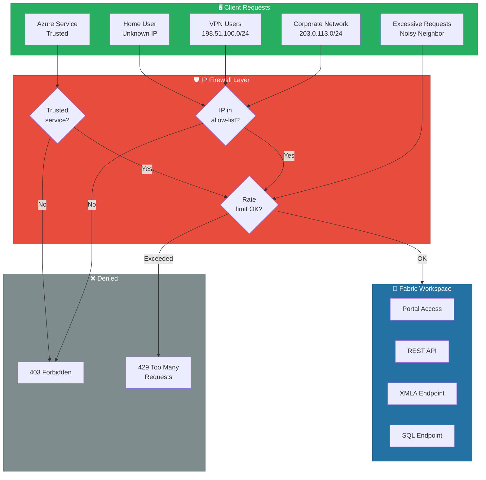
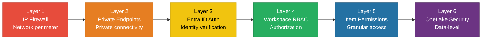
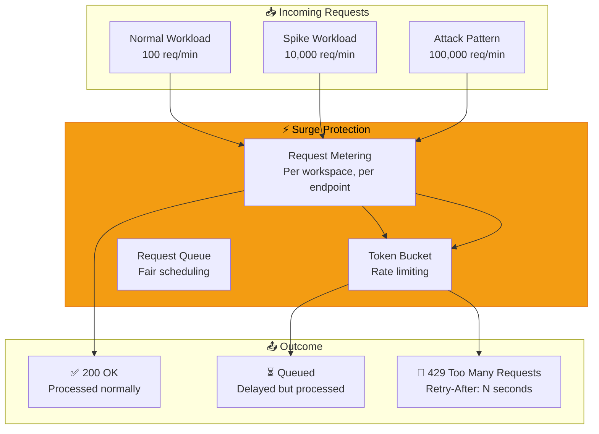

# 🛡️ Workspace IP Firewall & Surge Protection

<div align="center" markdown>

**IP-Based Access Control and Throttling Protection for Fabric Workspaces**


</div>

---

**Last Updated:** `2026-04-21` | **Version:** 1.0.0

---

## 🎯 Overview

Workspace IP Firewall restricts access to a Fabric workspace based on the source IP address of incoming requests. Only clients originating from explicitly allowed IP ranges can access workspace resources — including the Fabric portal, REST APIs, XMLA endpoints, and Lakehouse SQL endpoints. Requests from all other IPs are denied at the network layer before reaching any workspace resources.

Surge Protection complements IP Firewall by defending workspaces against "noisy neighbor" scenarios on shared Fabric capacities. It throttles excessive request rates from individual tenants or workspaces, ensuring fair resource distribution and preventing capacity starvation.

Together, these features form the outermost perimeter of Fabric's defense-in-depth model.

### Key Capabilities

| Capability | Description |
|-----------|-------------|
| **IP Allow-List** | Define up to 200 IP rules per workspace (IPv4 CIDR ranges) |
| **Trusted Services** | Allow Azure services to bypass IP rules for automated pipelines |
| **Service Tags** | Reference Azure service tag ranges instead of static IPs |
| **Surge Protection** | Rate limiting and throttling to prevent noisy neighbor impact |
| **Audit Logging** | All blocked and allowed requests logged to Azure Monitor |
| **Private Endpoint Compat** | IP firewall works alongside private endpoint connectivity |

---

## 🏗️ Architecture



### Defense-in-Depth Layers



---

## ⚙️ IP Firewall Configuration

### Configure via Fabric Portal

Navigate to **Workspace Settings > Network Security > IP Firewall Rules**.

### Configure via REST API

```python
import requests

def configure_ip_firewall(headers, workspace_id, rules):
    """Configure IP firewall rules for a Fabric workspace."""
    payload = {
        "ipFirewallRules": rules,
        "defaultAction": "Deny"  # Deny all IPs not in rules
    }

    response = requests.put(
        f"https://api.fabric.microsoft.com/v1/workspaces/{workspace_id}/ipFirewallRules",
        headers=headers,
        json=payload
    )
    response.raise_for_status()
    return response.json()

# Example: Allow corporate network and VPN
rules = [
    {
        "ruleName": "CorporateHQ",
        "startIPAddress": "203.0.113.0",
        "endIPAddress": "203.0.113.255"
    },
    {
        "ruleName": "VPNPool",
        "startIPAddress": "198.51.100.0",
        "endIPAddress": "198.51.100.255"
    },
    {
        "ruleName": "AzureDevOpsAgents",
        "startIPAddress": "10.1.0.0",
        "endIPAddress": "10.1.0.255"
    }
]

configure_ip_firewall(headers, workspace_id, rules)
```

### Rule Format

| Field | Type | Description | Example |
|-------|------|-------------|---------|
| `ruleName` | string | Descriptive name (unique per workspace) | `CorporateHQ` |
| `startIPAddress` | string | Start of IPv4 range | `203.0.113.0` |
| `endIPAddress` | string | End of IPv4 range | `203.0.113.255` |

### Rule Evaluation Order

1. Check if request originates from a **private endpoint** → Allow (bypasses IP rules)
2. Check if request is from a **trusted Azure service** and bypass is enabled → Allow
3. Match source IP against **IP firewall rules** → Allow if matched
4. **Default action** → Deny (403 Forbidden)

---

## 🔄 Trusted Service Bypass

Certain Azure services need to access Fabric workspaces for automated workflows (pipelines, Dataflows, scheduled refreshes). The trusted service bypass allows these services through the IP firewall without adding their IPs explicitly.

### Trusted Services

| Service | Use Case | Bypass Required |
|---------|----------|-----------------|
| **Azure Data Factory** | Pipeline orchestration, Copy Activity | Yes |
| **Azure Synapse Analytics** | Cross-workspace queries | Yes |
| **Power BI Service** | Scheduled refresh, subscriptions | Automatic |
| **Fabric Runtime** | Spark jobs, notebook execution | Automatic |
| **Azure Purview** | Governance scanning, lineage | Yes |
| **Azure DevOps** | CI/CD deployment pipelines | Add agent IPs instead |

### Enable Trusted Service Bypass

```python
def enable_trusted_service_bypass(headers, workspace_id):
    """Allow trusted Azure services to bypass IP firewall rules."""
    payload = {
        "trustedServiceBypass": True
    }

    response = requests.patch(
        f"https://api.fabric.microsoft.com/v1/workspaces/{workspace_id}/ipFirewallRules/settings",
        headers=headers,
        json=payload
    )
    response.raise_for_status()
```

> ⚠️ **Security Note**: Trusted service bypass should only be enabled when automated Azure services need workspace access. For maximum security, disable bypass and use managed private endpoints instead.

---

## 🏷️ Azure Service Tags

Instead of maintaining static IP ranges that change as Azure services scale, you can reference Azure service tags in your IP rules. Service tags represent groups of IP prefixes managed by Microsoft.

### Common Service Tags for Fabric

| Service Tag | Description | Use Case |
|------------|-------------|----------|
| `AzureCloud` | All Azure public IPs | Allow any Azure-hosted service |
| `AzureCloud.EastUS2` | Azure IPs in East US 2 | Region-scoped access |
| `AzureDevOps` | Azure DevOps hosted agents | CI/CD pipelines |
| `PowerBI` | Power BI service IPs | Scheduled refresh |
| `DataFactory` | ADF/Synapse pipeline IPs | Pipeline orchestration |
| `LogicApps` | Logic Apps outbound IPs | Automation workflows |

### Download and Apply Service Tag IPs

```python
import json
import requests as req

def get_service_tag_ips(tag_name, region=None):
    """Download Azure service tag IPs and convert to firewall rules."""
    # Download from Microsoft
    url = "https://www.microsoft.com/en-us/download/details.aspx?id=56519"
    # In practice, use the Azure Management API:
    # GET https://management.azure.com/subscriptions/{sub}/providers/
    #     Microsoft.Network/locations/{region}/serviceTags?api-version=2023-09-01

    # Parse and filter for the requested tag
    tag_key = f"{tag_name}.{region}" if region else tag_name
    # Returns list of CIDR ranges
    return ["20.42.0.0/16", "20.43.0.0/16"]  # Example output
```

---

## ⚡ Surge Protection

Surge Protection defends Fabric workspaces against excessive request volumes that could degrade performance for other tenants sharing the same capacity infrastructure.

### How Surge Protection Works



### Surge Protection Thresholds

| Endpoint Type | Rate Limit | Burst Allowance | Retry-After |
|--------------|-----------|-----------------|-------------|
| **REST API** | 200 requests/min | 50 burst | 30-60 seconds |
| **XMLA** | 100 concurrent | 20 burst | 60 seconds |
| **SQL Endpoint** | 500 queries/min | 100 burst | 15-30 seconds |
| **OneLake API** | 1,000 requests/min | 200 burst | 10-30 seconds |
| **Portal** | 300 requests/min | 50 burst | 30 seconds |

### Handling 429 Responses

```python
import time

def fabric_api_call_with_surge_handling(method, url, headers, json=None):
    """Handle Fabric API calls with surge protection retry logic."""
    max_retries = 5
    for attempt in range(max_retries):
        response = requests.request(method, url, headers=headers, json=json)

        if response.status_code == 429:
            retry_after = int(response.headers.get("Retry-After", 30))
            print(f"Surge protection triggered. Retrying in {retry_after}s "
                  f"(attempt {attempt + 1}/{max_retries})")
            time.sleep(retry_after)
            continue

        return response

    raise Exception("Max retries exceeded due to surge protection throttling")
```

### Monitoring Surge Events

```kql
// Query surge protection events in workspace monitoring
FabricEvents
| where TimeGenerated > ago(24h)
| where EventType == "SurgeProtection"
| summarize
    ThrottledRequests = countif(Action == "Throttled"),
    QueuedRequests = countif(Action == "Queued"),
    AllowedRequests = countif(Action == "Allowed")
    by bin(TimeGenerated, 15m), WorkspaceName
| render timechart
```

---

## 🔗 Integration with Private Endpoints

IP Firewall and Private Endpoints are complementary, not mutually exclusive. Private endpoint traffic bypasses IP firewall rules by design — it arrives over the Microsoft backbone, not the public internet.

### Combined Architecture

| Access Path | IP Firewall | Private Endpoint | Result |
|------------|-------------|-----------------|--------|
| Corporate office → Public endpoint | ✅ Checked | N/A | Allowed if IP in rules |
| Azure VM → Private endpoint | Bypassed | ✅ Resolved | Allowed (private path) |
| Home user → Public endpoint | ✅ Checked | N/A | Denied if IP not in rules |
| ADF Pipeline → Managed VNet PE | Bypassed | ✅ Resolved | Allowed |
| Unknown IP → Public endpoint | ✅ Checked | N/A | Denied |

> 💡 **Best Practice**: For maximum security, combine IP firewall (for portal/API access from known networks) with private endpoints (for Azure service connectivity). Disable public access entirely if all users connect via VPN with forced tunneling.

---

## 🎰 Casino Implementation

### Restrict Portal Access to Corporate Network

Casino operators typically have a headquarters network and property networks connected via MPLS or SD-WAN. IP firewall ensures only these networks can access Fabric workspaces containing sensitive gaming and compliance data.

```python
# Casino IP firewall configuration
casino_ip_rules = [
    {
        "ruleName": "CasinoHQ_LasVegas",
        "startIPAddress": "203.0.113.0",
        "endIPAddress": "203.0.113.63"
    },
    {
        "ruleName": "Property_Bellagio",
        "startIPAddress": "198.51.100.0",
        "endIPAddress": "198.51.100.31"
    },
    {
        "ruleName": "Property_MGMGrand",
        "startIPAddress": "198.51.100.32",
        "endIPAddress": "198.51.100.63"
    },
    {
        "ruleName": "Property_Borgata",
        "startIPAddress": "198.51.100.64",
        "endIPAddress": "198.51.100.95"
    },
    {
        "ruleName": "VPN_RemoteAnalysts",
        "startIPAddress": "192.0.2.0",
        "endIPAddress": "192.0.2.255"
    },
    {
        "ruleName": "CICD_AzureDevOps",
        "startIPAddress": "10.1.0.0",
        "endIPAddress": "10.1.0.255"
    }
]

# Apply to compliance workspace
configure_ip_firewall(headers, compliance_workspace_id, casino_ip_rules)
```

### Compliance Justification

| NIGC MICS Requirement | IP Firewall Implementation |
|-----------------------|---------------------------|
| **Logical access controls** | Only authorized network ranges can reach workspace |
| **Audit trail of access** | All blocked/allowed requests logged to Azure Monitor |
| **Separation of duties** | Different IP rules per workspace (gaming ops vs. compliance) |
| **Unauthorized access prevention** | Default deny blocks all unlisted IPs |

---

## 🏛️ Federal Agency Implementation

### NIST 800-53 Access Control Compliance

Federal agencies must implement IP-based access controls as part of the NIST 800-53 AC (Access Control) family. Workspace IP Firewall directly satisfies several controls.

| NIST Control | Control Name | IP Firewall Implementation |
|-------------|-------------|---------------------------|
| **AC-3** | Access Enforcement | Default deny; only approved IP ranges access workspace |
| **AC-4** | Information Flow Enforcement | IP rules control which networks can access which workspaces |
| **AC-17** | Remote Access | VPN IP ranges required for remote analyst access |
| **AC-20** | Use of External Information Systems | Block all external IPs; only agency networks allowed |
| **AU-3** | Content of Audit Records | Blocked request logs include source IP, timestamp, action |
| **SC-5** | Denial of Service Protection | Surge protection prevents resource exhaustion |
| **SC-7** | Boundary Protection | IP firewall acts as workspace-level network boundary |

### Multi-Agency Workspace Isolation

```python
# Each agency gets its own IP rules — no cross-agency access
agency_rules = {
    "usda": [
        {"ruleName": "USDA_DC_Office", "startIPAddress": "100.64.1.0", "endIPAddress": "100.64.1.255"},
        {"ruleName": "USDA_KC_Office", "startIPAddress": "100.64.2.0", "endIPAddress": "100.64.2.255"},
    ],
    "epa": [
        {"ruleName": "EPA_DC_HQ", "startIPAddress": "100.64.10.0", "endIPAddress": "100.64.10.255"},
        {"ruleName": "EPA_RTP_Lab", "startIPAddress": "100.64.11.0", "endIPAddress": "100.64.11.255"},
    ],
    "noaa": [
        {"ruleName": "NOAA_SilverSpring", "startIPAddress": "100.64.20.0", "endIPAddress": "100.64.20.255"},
        {"ruleName": "NOAA_Boulder", "startIPAddress": "100.64.21.0", "endIPAddress": "100.64.21.255"},
    ],
}

# Apply per-agency isolation
for agency, rules in agency_rules.items():
    ws_id = agency_workspace_ids[agency]
    configure_ip_firewall(headers, ws_id, rules)
    enable_trusted_service_bypass(headers, ws_id)  # Allow Purview scanning
```

### FedRAMP Continuous Monitoring

```kql
// Federal continuous monitoring - blocked access attempts
FabricFirewallEvents
| where TimeGenerated > ago(24h)
| where Action == "Deny"
| summarize
    BlockedAttempts = count(),
    UniqueSourceIPs = dcount(SourceIP),
    TargetWorkspaces = make_set(WorkspaceName)
    by bin(TimeGenerated, 1h)
| where BlockedAttempts > 100  // Alert threshold
| render timechart
```

```kql
// Identify potential brute-force or scanning attempts
FabricFirewallEvents
| where TimeGenerated > ago(1h)
| where Action == "Deny"
| summarize AttemptCount = count() by SourceIP, WorkspaceName
| where AttemptCount > 50
| order by AttemptCount desc
```

---

## ⚠️ Limitations

| Limitation | Description | Workaround |
|-----------|-------------|------------|
| **IPv4 Only** | IPv6 addresses not supported in firewall rules | Use IPv4; IPv6 requests are denied by default |
| **200 Rule Limit** | Maximum 200 IP rules per workspace | Aggregate CIDRs; use service tags for Azure services |
| **No FQDN Rules** | Cannot allow by domain name, only IP ranges | Resolve FQDNs to IPs and update periodically |
| **Portal Latency** | Rule changes may take 5-15 minutes to propagate | Plan changes in advance; test in dev workspace |
| **No Geo-Blocking** | Cannot block by country or region | Map country IP ranges to deny rules externally |
| **Shared Capacity** | Surge protection limits are per-capacity, not configurable | Use dedicated capacity for predictable performance |
| **Workspace-Level** | Rules are per-workspace, not per-item | Use OneLake Security for item-level access control |
| **Diagnostics** | Firewall logs require Azure Monitor integration | Configure diagnostic settings before enabling rules |

---

## 📚 References

| Resource | URL |
|----------|-----|
| Fabric IP Firewall | https://learn.microsoft.com/fabric/security/security-ip-firewall |
| Configure IP Firewall Rules | https://learn.microsoft.com/fabric/security/security-ip-firewall-configure |
| Trusted Service Bypass | https://learn.microsoft.com/fabric/security/security-trusted-workspace-access |
| Private Endpoints for Fabric | https://learn.microsoft.com/fabric/security/security-private-links-overview |
| Azure Service Tags | https://learn.microsoft.com/azure/virtual-network/service-tags-overview |
| NIST 800-53 Controls | https://csrc.nist.gov/publications/detail/sp/800-53/rev-5/final |
| Fabric Security Overview | https://learn.microsoft.com/fabric/security/security-overview |
| Managed VNets | https://learn.microsoft.com/fabric/security/security-managed-vnets-fabric-overview |
| Azure Monitor for Fabric | https://learn.microsoft.com/fabric/admin/monitoring-hub |
| Throttling Guidance | https://learn.microsoft.com/fabric/admin/throttling |

---

## 🔗 Related Documents

- [Network Security](../best-practices/network-security.md) — Comprehensive network security patterns
- [Outbound Access Protection](../best-practices/outbound-access-protection.md) — Control outbound traffic from Fabric
- [VNet Data Gateway](vnet-data-gateway.md) — Secure data access from customer VNets
- [OneLake Security](onelake-security.md) — Data-level security and Workspace Identity
- [Identity & RBAC Patterns](../best-practices/identity-rbac-patterns.md) — Role-based access control
- [Workspace Monitoring](workspace-monitoring.md) — Monitor workspace access and usage
- [Fabric REST APIs](fabric-rest-apis.md) — API-level firewall rule management
- [Customer-Managed Keys](../best-practices/customer-managed-keys.md) — Encryption at rest
- [Architecture](../ARCHITECTURE.md) — System architecture overview

---

> 📝 **Document Metadata**
> - **Author**: Documentation Team
> - **Reviewers**: Security Engineering, Network Engineering, Compliance, Platform Engineering
> - **Classification**: Internal
> - **Next Review**: 2026-07-21
