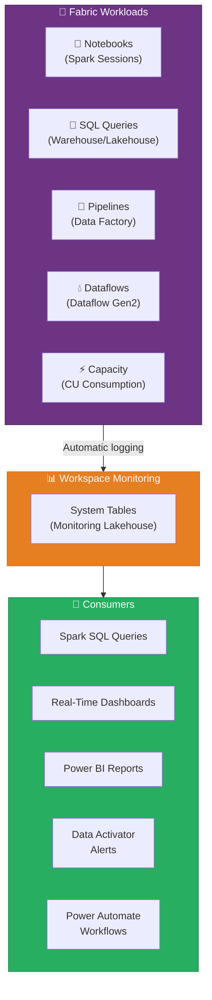
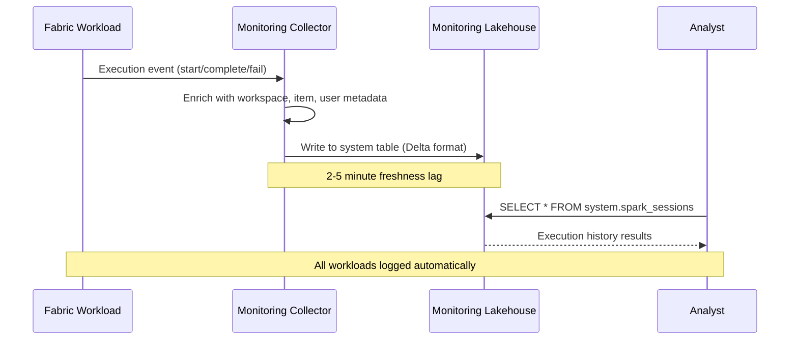
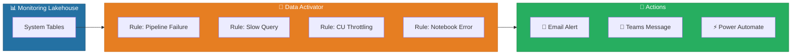
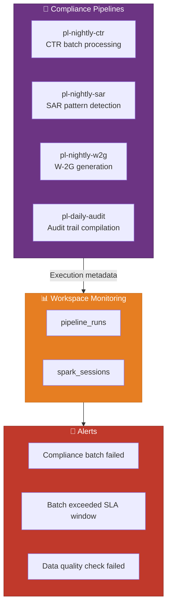
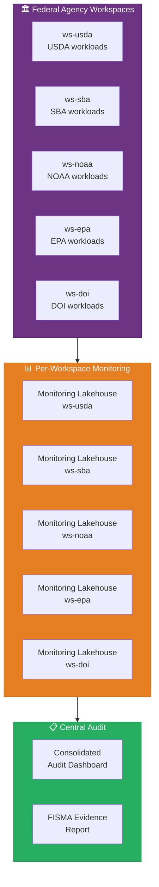

[Home](../index.md) > [Docs](../) > [Features](./) > Workspace Monitoring

# 📊 Workspace Monitoring - Observability for Fabric Workloads

<div align="center" markdown>

**Queryable System Tables for Spark, SQL, Pipeline, and Dataflow Activity**


</div>

---

**Last Updated:** `2026-04-13` | **Version:** 1.0.0

---

## 📑 Table of Contents

- [🎯 Overview](#-overview)
- [🏗️ Architecture](#️-architecture)
- [⚙️ Available System Tables](#️-available-system-tables)
- [📊 Querying Patterns](#-querying-patterns)
- [🔔 Alerting and Automation](#-alerting-and-automation)
- [🎰 Casino Implementation](#-casino-implementation)
- [🏛️ Federal Agency Implementation](#️-federal-agency-implementation)
- [📐 Dashboard Templates](#-dashboard-templates)
- [⚡ Performance and Retention](#-performance-and-retention)
- [⚠️ Limitations](#️-limitations)
- [📚 References](#-references)

---

## 🎯 Overview

Workspace Monitoring is a Fabric workspace item (Preview) that provides **queryable system tables** containing operational metadata about every workload execution within a workspace. Rather than navigating scattered monitoring UIs for Spark, SQL, pipelines, and dataflows, Workspace Monitoring consolidates execution history, performance metrics, resource consumption, and failure details into a single Lakehouse that you can query with Spark SQL, KQL, or any SQL-compatible tool.

Think of it as an observability layer purpose-built for Microsoft Fabric -- comparable to `sys.dm_exec_query_stats` in SQL Server, but covering the full spectrum of Fabric workloads (Spark notebooks, SQL queries, Data Factory pipelines, Dataflow Gen2 activities, and capacity utilization) in one place.

### Key Capabilities

| Capability | Description |
|-----------|-------------|
| **Unified Execution History** | Track every Spark session, SQL query, pipeline run, and dataflow activity in one location |
| **Performance Metrics** | Duration, resource consumption (CU seconds), rows processed, bytes scanned |
| **Failure Analysis** | Error messages, stack traces, and failure root cause for debugging failed executions |
| **Capacity Monitoring** | Track compute unit (CU) consumption by workload type and time period |
| **Cross-Workload Correlation** | Join system tables to trace end-to-end data pipeline execution |
| **Self-Service Querying** | Use standard Spark SQL to query system tables -- no admin portal access required |
| **Automated Alerting** | Combine with Data Activator or Power Automate for threshold-based alerts |

### How Workspace Monitoring Fits in the Fabric Ecosystem



### Workspace Monitoring vs. Other Monitoring Approaches

| Approach | Scope | Query Method | Granularity | Latency |
|----------|-------|-------------|-------------|---------|
| **Workspace Monitoring** | Full workspace workload history | Spark SQL, KQL | Per-session, per-query, per-run | Minutes (near real-time) |
| **Admin Monitoring Portal** | Tenant-level capacity overview | Web UI only | Per-capacity | Minutes |
| **Fabric Capacity Metrics App** | Capacity consumption analytics | Power BI report | Per-hour, per-day | Hours |
| **Azure Monitor Integration** | Infrastructure and platform events | KQL (Log Analytics) | Per-event | Minutes |
| **Custom Notebook Logging** | Application-level telemetry | Custom implementation | Developer-defined | Real-time |

---

## 🏗️ Architecture

Workspace Monitoring operates by automatically capturing execution metadata from all Fabric workloads within a workspace and writing it to system tables in a dedicated Monitoring Lakehouse.

### Component Architecture

```mermaid
flowchart LR
    subgraph Sources["🔷 Workload Engines"]
        SP["Spark Engine<br/>notebook sessions"]
        SQ["SQL Engine<br/>warehouse queries"]
        PL["Pipeline Engine<br/>orchestration runs"]
        DF["Dataflow Engine<br/>dataflow activities"]
        CAP["Capacity Manager<br/>CU allocation"]
    end

    subgraph Collector["📡 Monitoring Collector"]
        EVT["Event Capture"]
        ENR["Metadata Enrichment"]
        BUF["Write Buffer"]
    end

    subgraph Storage["📊 Monitoring Lakehouse"]
        T1["spark_sessions"]
        T2["sql_queries"]
        T3["pipeline_runs"]
        T4["dataflow_activities"]
        T5["capacity_metrics"]
    end

    subgraph Output["📈 Analytics"]
        QRY["Spark SQL Queries"]
        DSH["Monitoring Dashboard"]
        ALR["Alert Rules"]
    end

    Sources --> Collector --> Storage --> Output

    style Sources fill:#6C3483,stroke:#4A235A,color:#fff
    style Collector fill:#E67E22,stroke:#CA6F1E,color:#fff
    style Storage fill:#2471A3,stroke:#1A5276,color:#fff
    style Output fill:#27AE60,stroke:#1E8449,color:#fff
```



### Data Flow



### Enabling Workspace Monitoring

```
Workspace Settings → Monitoring (Preview)
  ├── Enable Workspace Monitoring → On
  ├── Monitoring Lakehouse → Auto-created (or select existing)
  ├── Retention Period → 30 days (default, configurable to 90 days)
  └── System Tables → Auto-provisioned
```

> 📝 **Note**: Enabling Workspace Monitoring creates a dedicated Monitoring Lakehouse in the workspace. This Lakehouse consumes OneLake storage and capacity CU for the system table writes. The overhead is typically less than 1% of total workspace CU consumption.

---

## ⚙️ Available System Tables

Workspace Monitoring provisions five system tables in the Monitoring Lakehouse. Each table captures a different workload type with its specific execution metadata.

### System Table Summary

| Table | Workload | Key Metrics | Granularity |
|-------|----------|-------------|-------------|
| `spark_sessions` | Notebook and Spark Job executions | Duration, CU consumption, row/byte counts, status | Per Spark session |
| `sql_queries` | Warehouse and Lakehouse SQL queries | Duration, rows scanned, bytes processed, query text | Per SQL statement |
| `pipeline_runs` | Data Factory pipeline executions | Duration, activity count, status, error messages | Per pipeline run |
| `dataflow_activities` | Dataflow Gen2 refresh operations | Duration, rows processed, partition count, status | Per dataflow refresh |
| `capacity_metrics` | Workspace-level compute consumption | CU seconds by workload type, throttling events | Per 30-second interval |

### Table Schemas

#### `spark_sessions`

Captures every Spark session initiated by notebooks, Spark Job Definitions, or Lakehouse scheduled jobs.

| Column | Type | Description |
|--------|------|-------------|
| `session_id` | string | Unique Spark session identifier |
| `workspace_id` | string | Workspace GUID |
| `workspace_name` | string | Workspace display name |
| `item_id` | string | Notebook or Spark Job item GUID |
| `item_name` | string | Item display name (notebook name) |
| `user_id` | string | Entra ID of the user who initiated the session |
| `user_email` | string | Email of the initiating user |
| `start_time` | timestamp | Session start timestamp (UTC) |
| `end_time` | timestamp | Session end timestamp (UTC) |
| `duration_seconds` | long | Total session duration in seconds |
| `status` | string | Session status: `Succeeded`, `Failed`, `Cancelled`, `Running` |
| `error_message` | string | Error details if status = Failed |
| `spark_pool` | string | Starter pool or custom pool name |
| `executor_count` | int | Number of Spark executors allocated |
| `cu_seconds` | decimal | Total compute unit seconds consumed |
| `rows_read` | long | Total rows read across all stages |
| `rows_written` | long | Total rows written across all stages |
| `bytes_read` | long | Total bytes read from storage |
| `bytes_written` | long | Total bytes written to storage |
| `shuffle_bytes` | long | Total bytes shuffled between executors |
| `trigger_type` | string | `Interactive`, `Scheduled`, `Pipeline`, `API` |

#### `sql_queries`

Captures every SQL query executed against Warehouse or Lakehouse SQL analytics endpoints.

| Column | Type | Description |
|--------|------|-------------|
| `query_id` | string | Unique query execution identifier |
| `workspace_id` | string | Workspace GUID |
| `item_id` | string | Warehouse or Lakehouse item GUID |
| `item_name` | string | Warehouse or Lakehouse name |
| `item_type` | string | `Warehouse` or `Lakehouse` |
| `user_id` | string | Entra ID of the user who executed the query |
| `user_email` | string | Email of the executing user |
| `query_text` | string | Full SQL query text (up to 64 KB) |
| `query_hash` | string | Hash of the query text for deduplication |
| `start_time` | timestamp | Query start timestamp (UTC) |
| `end_time` | timestamp | Query end timestamp (UTC) |
| `duration_ms` | long | Query duration in milliseconds |
| `status` | string | `Succeeded`, `Failed`, `Cancelled` |
| `error_message` | string | Error details if status = Failed |
| `rows_returned` | long | Number of rows in the result set |
| `rows_scanned` | long | Total rows scanned from storage |
| `bytes_scanned` | long | Total bytes scanned from storage |
| `cu_seconds` | decimal | Compute unit seconds consumed |
| `source` | string | `SSMS`, `Notebook`, `PowerBI`, `ThirdParty`, `FabricPortal` |

#### `pipeline_runs`

Captures every Data Factory pipeline execution, including scheduled, triggered, and manual runs.

| Column | Type | Description |
|--------|------|-------------|
| `run_id` | string | Unique pipeline run identifier |
| `workspace_id` | string | Workspace GUID |
| `pipeline_id` | string | Pipeline item GUID |
| `pipeline_name` | string | Pipeline display name |
| `start_time` | timestamp | Pipeline run start timestamp (UTC) |
| `end_time` | timestamp | Pipeline run end timestamp (UTC) |
| `duration_seconds` | long | Total pipeline duration in seconds |
| `status` | string | `Succeeded`, `Failed`, `Cancelled`, `InProgress` |
| `error_message` | string | Error details for failed activities |
| `activity_count` | int | Total number of activities in the pipeline |
| `activities_succeeded` | int | Count of activities that succeeded |
| `activities_failed` | int | Count of activities that failed |
| `trigger_type` | string | `Scheduled`, `Manual`, `Tumbling`, `Event` |
| `trigger_name` | string | Name of the trigger (for scheduled/event runs) |
| `parameters` | string | JSON string of pipeline parameters |
| `cu_seconds` | decimal | Total CU seconds consumed by all activities |

#### `dataflow_activities`

Captures Dataflow Gen2 refresh operations.

| Column | Type | Description |
|--------|------|-------------|
| `activity_id` | string | Unique dataflow activity identifier |
| `workspace_id` | string | Workspace GUID |
| `dataflow_id` | string | Dataflow item GUID |
| `dataflow_name` | string | Dataflow display name |
| `start_time` | timestamp | Refresh start timestamp (UTC) |
| `end_time` | timestamp | Refresh end timestamp (UTC) |
| `duration_seconds` | long | Total refresh duration in seconds |
| `status` | string | `Succeeded`, `Failed`, `Cancelled` |
| `error_message` | string | Error details if status = Failed |
| `rows_processed` | long | Total rows processed during refresh |
| `partition_count` | int | Number of partitions refreshed |
| `refresh_type` | string | `Full`, `Incremental` |
| `cu_seconds` | decimal | Compute unit seconds consumed |

#### `capacity_metrics`

Provides 30-second interval snapshots of capacity utilization across the workspace.

| Column | Type | Description |
|--------|------|-------------|
| `timestamp` | timestamp | Metric collection timestamp (UTC) |
| `workspace_id` | string | Workspace GUID |
| `workload_type` | string | `Spark`, `SQL`, `Pipeline`, `Dataflow`, `Other` |
| `cu_allocated` | decimal | CU allocated for the workload at this interval |
| `cu_consumed` | decimal | CU actually consumed at this interval |
| `cu_throttled` | decimal | CU requested but throttled due to capacity limits |
| `active_sessions` | int | Number of active sessions/queries for this workload |
| `queued_requests` | int | Number of requests waiting for capacity |
| `throttle_event` | boolean | Whether a throttle event occurred in this interval |

---

## 📊 Querying Patterns

### Basic Monitoring Queries

#### Spark Session History

```sql
-- Last 24 hours of Spark notebook executions
SELECT
    item_name AS notebook,
    user_email,
    start_time,
    duration_seconds,
    status,
    cu_seconds,
    rows_written,
    ROUND(bytes_written / 1048576.0, 2) AS mb_written
FROM system.spark_sessions
WHERE start_time >= DATEADD(HOUR, -24, CURRENT_TIMESTAMP)
ORDER BY start_time DESC;
```

#### Slow Query Detection

```sql
-- SQL queries exceeding 60 seconds in the last 7 days
SELECT
    item_name AS data_source,
    user_email,
    SUBSTRING(query_text, 1, 200) AS query_preview,
    duration_ms / 1000.0 AS duration_seconds,
    rows_scanned,
    ROUND(bytes_scanned / 1073741824.0, 2) AS gb_scanned,
    cu_seconds
FROM system.sql_queries
WHERE start_time >= DATEADD(DAY, -7, CURRENT_TIMESTAMP)
  AND duration_ms > 60000
  AND status = 'Succeeded'
ORDER BY duration_ms DESC;
```

#### Pipeline Failure Trends

```sql
-- Daily pipeline failure rate over the last 30 days
SELECT
    CAST(start_time AS DATE) AS run_date,
    COUNT(*) AS total_runs,
    SUM(CASE WHEN status = 'Succeeded' THEN 1 ELSE 0 END) AS succeeded,
    SUM(CASE WHEN status = 'Failed' THEN 1 ELSE 0 END) AS failed,
    ROUND(
        SUM(CASE WHEN status = 'Failed' THEN 1.0 ELSE 0 END) /
        COUNT(*) * 100, 2
    ) AS failure_rate_pct
FROM system.pipeline_runs
WHERE start_time >= DATEADD(DAY, -30, CURRENT_TIMESTAMP)
GROUP BY CAST(start_time AS DATE)
ORDER BY run_date DESC;
```

### Advanced Analysis Patterns

#### Capacity Consumption by Workload

```sql
-- Hourly CU consumption breakdown by workload type (last 7 days)
SELECT
    DATE_TRUNC('hour', timestamp) AS hour,
    workload_type,
    ROUND(SUM(cu_consumed), 2) AS total_cu,
    MAX(active_sessions) AS peak_sessions,
    SUM(CASE WHEN throttle_event THEN 1 ELSE 0 END) AS throttle_count
FROM system.capacity_metrics
WHERE timestamp >= DATEADD(DAY, -7, CURRENT_TIMESTAMP)
GROUP BY DATE_TRUNC('hour', timestamp), workload_type
ORDER BY hour DESC, total_cu DESC;
```

#### Top CU Consumers

```sql
-- Top 10 notebooks by total CU consumption this month
SELECT
    item_name AS notebook,
    user_email,
    COUNT(*) AS run_count,
    ROUND(SUM(cu_seconds), 2) AS total_cu_seconds,
    ROUND(AVG(cu_seconds), 2) AS avg_cu_per_run,
    ROUND(AVG(duration_seconds), 0) AS avg_duration_sec
FROM system.spark_sessions
WHERE start_time >= DATE_TRUNC('month', CURRENT_TIMESTAMP)
  AND status = 'Succeeded'
GROUP BY item_name, user_email
ORDER BY total_cu_seconds DESC
LIMIT 10;
```

#### End-to-End Pipeline Tracing

```sql
-- Correlate pipeline runs with the Spark sessions they triggered
SELECT
    pr.pipeline_name,
    pr.run_id,
    pr.start_time AS pipeline_start,
    pr.duration_seconds AS pipeline_duration,
    ss.item_name AS notebook_triggered,
    ss.start_time AS notebook_start,
    ss.duration_seconds AS notebook_duration,
    ss.status AS notebook_status,
    ss.cu_seconds AS notebook_cu
FROM system.pipeline_runs pr
LEFT JOIN system.spark_sessions ss
    ON ss.trigger_type = 'Pipeline'
    AND ss.start_time BETWEEN pr.start_time AND pr.end_time
    AND ss.workspace_id = pr.workspace_id
WHERE pr.start_time >= DATEADD(DAY, -7, CURRENT_TIMESTAMP)
ORDER BY pr.start_time DESC;
```

#### Query Pattern Analysis

```sql
-- Identify the most frequently executed query patterns
SELECT
    query_hash,
    SUBSTRING(MIN(query_text), 1, 150) AS query_pattern,
    COUNT(*) AS execution_count,
    ROUND(AVG(duration_ms), 0) AS avg_duration_ms,
    ROUND(AVG(rows_scanned), 0) AS avg_rows_scanned,
    ROUND(SUM(cu_seconds), 2) AS total_cu_seconds,
    MIN(source) AS primary_source
FROM system.sql_queries
WHERE start_time >= DATEADD(DAY, -7, CURRENT_TIMESTAMP)
  AND status = 'Succeeded'
GROUP BY query_hash
HAVING COUNT(*) >= 5
ORDER BY total_cu_seconds DESC;
```

### KQL Querying (via Eventhouse Shortcut)

If you create an Eventhouse shortcut to the Monitoring Lakehouse, you can use KQL for more advanced time-series analysis:

```kql
// Spark session duration anomaly detection
spark_sessions
| where start_time > ago(30d)
| where status == "Succeeded"
| summarize AvgDuration = avg(duration_seconds), StdDuration = stdev(duration_seconds) by item_name
| join kind=inner (
    spark_sessions
    | where start_time > ago(1d)
    | where status == "Succeeded"
) on item_name
| extend ZScore = (duration_seconds - AvgDuration) / StdDuration
| where abs(ZScore) > 3
| project item_name, start_time, duration_seconds, AvgDuration, ZScore
| order by abs(ZScore) desc
```

---

## 🔔 Alerting and Automation

### Data Activator Integration

Combine Workspace Monitoring with Data Activator to create automated alerts for operational issues:



### Alert Rule Examples

| Alert | System Table | Condition | Action |
|-------|-------------|-----------|--------|
| Pipeline Failure | `pipeline_runs` | `status = 'Failed'` | Email data engineering team |
| Slow Query | `sql_queries` | `duration_ms > 300000` (5 min) | Teams notification to DBA |
| CU Throttling | `capacity_metrics` | `throttle_event = true` for 3+ consecutive intervals | Alert capacity admin |
| Notebook Error | `spark_sessions` | `status = 'Failed' AND item_name LIKE '%compliance%'` | Page on-call compliance engineer |
| Capacity Spike | `capacity_metrics` | `cu_consumed > 0.8 * cu_allocated` for 30+ minutes | Email workspace admin |

### Power Automate Webhook Pattern

```json
{
    "trigger": "data_activator",
    "rule": "pipeline_failure",
    "flow_actions": [
        {
            "action": "teams_post",
            "channel": "#data-engineering-alerts",
            "message": "🔴 Pipeline '{pipeline_name}' FAILED\nRun ID: {run_id}\nError: {error_message}\nDuration: {duration_seconds}s\nWorkspace: {workspace_name}"
        },
        {
            "action": "create_devops_work_item",
            "title": "Pipeline failure: {pipeline_name}",
            "description": "Automated work item from Workspace Monitoring alert",
            "priority": 2
        }
    ]
}
```

---

## 🎰 Casino Implementation

Casino gaming workloads have strict execution requirements -- compliance batch processing must complete within regulatory windows, and failures during peak hours require immediate attention.

### Compliance Batch Monitoring

The casino domain runs nightly compliance batch notebooks that process CTR filings, SAR detections, and W-2G calculations. Workspace Monitoring tracks these critical executions.



#### Compliance SLA Monitoring

```sql
-- Check if nightly compliance pipelines completed within SLA
-- SLA: All compliance pipelines must complete before 6:00 AM local time
SELECT
    pipeline_name,
    start_time,
    end_time,
    duration_seconds,
    status,
    CASE
        WHEN end_time > CAST(CAST(start_time AS DATE) AS TIMESTAMP) + INTERVAL '6' HOUR
        THEN 'SLA BREACH'
        ELSE 'WITHIN SLA'
    END AS sla_status,
    error_message
FROM system.pipeline_runs
WHERE pipeline_name LIKE 'pl-nightly-%'
  AND start_time >= DATEADD(DAY, -7, CURRENT_TIMESTAMP)
ORDER BY start_time DESC;
```

#### Peak Hour Error Detection

```sql
-- Notebooks that failed during casino peak hours (6 PM - 2 AM)
SELECT
    item_name AS notebook,
    user_email,
    start_time,
    status,
    error_message,
    CASE
        WHEN HOUR(start_time) >= 18 OR HOUR(start_time) < 2
        THEN 'PEAK HOURS'
        ELSE 'OFF-PEAK'
    END AS period
FROM system.spark_sessions
WHERE status = 'Failed'
  AND start_time >= DATEADD(DAY, -1, CURRENT_TIMESTAMP)
  AND (HOUR(start_time) >= 18 OR HOUR(start_time) < 2)
ORDER BY start_time DESC;
```

#### Slot Performance Notebook Tracking

```sql
-- Track execution history of the slot performance Gold notebook
SELECT
    start_time,
    duration_seconds,
    cu_seconds,
    rows_written,
    status,
    ROUND(bytes_written / 1048576.0, 2) AS mb_written
FROM system.spark_sessions
WHERE item_name = '01_gold_slot_performance'
  AND start_time >= DATEADD(DAY, -30, CURRENT_TIMESTAMP)
ORDER BY start_time DESC;
```

### Cost Attribution by Gaming Domain

```sql
-- Monthly CU consumption breakdown for casino workloads
SELECT
    CASE
        WHEN item_name LIKE '%slot%' THEN 'Slot Analytics'
        WHEN item_name LIKE '%player%' THEN 'Player Analytics'
        WHEN item_name LIKE '%compliance%' OR item_name LIKE '%ctr%' OR item_name LIKE '%sar%' THEN 'Compliance'
        WHEN item_name LIKE '%gold%' THEN 'Gold Layer'
        WHEN item_name LIKE '%silver%' THEN 'Silver Layer'
        WHEN item_name LIKE '%bronze%' THEN 'Bronze Layer'
        ELSE 'Other'
    END AS domain,
    COUNT(*) AS execution_count,
    ROUND(SUM(cu_seconds), 2) AS total_cu_seconds,
    ROUND(AVG(duration_seconds), 0) AS avg_duration,
    SUM(CASE WHEN status = 'Failed' THEN 1 ELSE 0 END) AS failures
FROM system.spark_sessions
WHERE start_time >= DATE_TRUNC('month', CURRENT_TIMESTAMP)
GROUP BY
    CASE
        WHEN item_name LIKE '%slot%' THEN 'Slot Analytics'
        WHEN item_name LIKE '%player%' THEN 'Player Analytics'
        WHEN item_name LIKE '%compliance%' OR item_name LIKE '%ctr%' OR item_name LIKE '%sar%' THEN 'Compliance'
        WHEN item_name LIKE '%gold%' THEN 'Gold Layer'
        WHEN item_name LIKE '%silver%' THEN 'Silver Layer'
        WHEN item_name LIKE '%bronze%' THEN 'Bronze Layer'
        ELSE 'Other'
    END
ORDER BY total_cu_seconds DESC;
```

---

## 🏛️ Federal Agency Implementation

Federal agencies require comprehensive audit trails for FISMA compliance, capacity dashboards per agency workspace, and execution monitoring that supports continuous Authority to Operate (ATO) evidence collection.

### FISMA Execution Audit

Federal information systems must maintain audit records of all data processing activities. Workspace Monitoring system tables serve as a primary evidence source for FISMA audit requirements.



#### FISMA Audit Report

```sql
-- FISMA-aligned execution audit report
-- Requirement: Log all data access and processing activities
SELECT
    'SPARK' AS workload_type,
    item_name AS resource,
    user_email AS principal,
    start_time AS event_time,
    status AS outcome,
    CONCAT('Duration: ', duration_seconds, 's, CU: ', ROUND(cu_seconds, 2)) AS details
FROM system.spark_sessions
WHERE start_time >= DATEADD(DAY, -30, CURRENT_TIMESTAMP)

UNION ALL

SELECT
    'SQL' AS workload_type,
    item_name AS resource,
    user_email AS principal,
    start_time AS event_time,
    status AS outcome,
    CONCAT('Rows scanned: ', rows_scanned, ', Duration: ', duration_ms, 'ms') AS details
FROM system.sql_queries
WHERE start_time >= DATEADD(DAY, -30, CURRENT_TIMESTAMP)

UNION ALL

SELECT
    'PIPELINE' AS workload_type,
    pipeline_name AS resource,
    'system' AS principal,
    start_time AS event_time,
    status AS outcome,
    CONCAT('Activities: ', activity_count, ', Duration: ', duration_seconds, 's') AS details
FROM system.pipeline_runs
WHERE start_time >= DATEADD(DAY, -30, CURRENT_TIMESTAMP)

ORDER BY event_time DESC;
```

### Capacity Dashboard Per Agency

```sql
-- Agency workspace capacity utilization summary
SELECT
    workload_type,
    DATE_TRUNC('day', timestamp) AS day,
    ROUND(SUM(cu_consumed), 2) AS daily_cu_consumed,
    ROUND(AVG(cu_consumed), 4) AS avg_cu_per_interval,
    MAX(active_sessions) AS peak_active_sessions,
    SUM(CASE WHEN throttle_event THEN 1 ELSE 0 END) AS throttle_events
FROM system.capacity_metrics
WHERE timestamp >= DATEADD(DAY, -30, CURRENT_TIMESTAMP)
GROUP BY workload_type, DATE_TRUNC('day', timestamp)
ORDER BY day DESC, daily_cu_consumed DESC;
```

### Federal Data Pipeline Health

```sql
-- Health check for federal agency bronze/silver/gold pipelines
SELECT
    pipeline_name,
    COUNT(*) AS total_runs,
    SUM(CASE WHEN status = 'Succeeded' THEN 1 ELSE 0 END) AS succeeded,
    SUM(CASE WHEN status = 'Failed' THEN 1 ELSE 0 END) AS failed,
    ROUND(
        SUM(CASE WHEN status = 'Succeeded' THEN 1.0 ELSE 0 END) / COUNT(*) * 100, 2
    ) AS success_rate_pct,
    ROUND(AVG(duration_seconds), 0) AS avg_duration_sec,
    MAX(end_time) AS last_run
FROM system.pipeline_runs
WHERE start_time >= DATEADD(DAY, -30, CURRENT_TIMESTAMP)
GROUP BY pipeline_name
ORDER BY success_rate_pct ASC;
```

### Cross-Agency Comparison

If each agency workspace has Monitoring enabled, an authorized admin can create shortcuts across workspaces to build a consolidated view:

```sql
-- Compare notebook execution patterns across agency workspaces
-- (requires shortcuts from each workspace's monitoring lakehouse)
SELECT
    'USDA' AS agency,
    COUNT(*) AS notebook_runs,
    ROUND(SUM(cu_seconds), 2) AS total_cu,
    SUM(CASE WHEN status = 'Failed' THEN 1 ELSE 0 END) AS failures
FROM usda_monitoring.spark_sessions
WHERE start_time >= DATE_TRUNC('month', CURRENT_TIMESTAMP)

UNION ALL

SELECT 'EPA', COUNT(*), ROUND(SUM(cu_seconds), 2),
    SUM(CASE WHEN status = 'Failed' THEN 1 ELSE 0 END)
FROM epa_monitoring.spark_sessions
WHERE start_time >= DATE_TRUNC('month', CURRENT_TIMESTAMP)

UNION ALL

SELECT 'NOAA', COUNT(*), ROUND(SUM(cu_seconds), 2),
    SUM(CASE WHEN status = 'Failed' THEN 1 ELSE 0 END)
FROM noaa_monitoring.spark_sessions
WHERE start_time >= DATE_TRUNC('month', CURRENT_TIMESTAMP)

ORDER BY total_cu DESC;
```

---

## 📐 Dashboard Templates

### Operations Dashboard Layout

```
┌──────────────────────────────────────────────────────────────┐
│  📊 Workspace Monitoring - Operations Dashboard              │
│  Filters: [Time Range ▼] [Workload Type ▼] [Status ▼]       │
├────────────────┬────────────────┬───────────────┬────────────┤
│  Total Runs    │  Success Rate  │  Avg Duration │  CU Used   │
│  1,247         │  96.3%         │  4.2 min      │  15,230 CU │
│  ↑ 12% vs LW  │  ↓ 0.5%       │  ↓ 8%         │  ↑ 5%      │
├────────────────┴────────────────┴───────────────┴────────────┤
│  📈 CU Consumption by Workload Type (Stacked Area Chart)     │
│  [Spark | SQL | Pipeline | Dataflow over last 7 days]        │
├──────────────────────────────┬────────────────────────────────┤
│  🔴 Recent Failures          │  🐢 Slowest Executions         │
│  [Table: name, time, error]  │  [Table: name, duration, CU]   │
│  [Sorted by most recent]     │  [Sorted by duration DESC]     │
├──────────────────────────────┴────────────────────────────────┤
│  📊 Daily Execution Volume (Bar Chart)                        │
│  [Stacked: Succeeded | Failed | Cancelled over 30 days]      │
└──────────────────────────────────────────────────────────────┘
```

### Compliance Operations Dashboard (Casino)

```
┌──────────────────────────────────────────────────────────────┐
│  🎰 Compliance Pipeline Monitoring                            │
│  Filters: [Date Range ▼] [Pipeline ▼]                        │
├────────────────┬────────────────┬───────────────┬────────────┤
│  CTR Pipeline  │  SAR Pipeline  │  W-2G Pipeline│  Audit     │
│  ✅ Last: 2h   │  ✅ Last: 3h   │  ✅ Last: 1h  │  ✅ Last: 4h│
│  Avg: 45 min   │  Avg: 1.2 hr   │  Avg: 20 min  │  Avg: 35 min│
├────────────────┴────────────────┴───────────────┴────────────┤
│  📈 Compliance Pipeline Duration Trend (7 days)               │
│  [Line chart showing execution time per pipeline]             │
├──────────────────────────────┬────────────────────────────────┤
│  ⚠️ SLA Breaches (Last 30d)  │  🔴 Pipeline Failures          │
│  [Table: pipeline, date,     │  [Table: pipeline, time,       │
│   actual vs SLA]             │   error, impact]               │
└──────────────────────────────┴────────────────────────────────┘
```

---

## ⚡ Performance and Retention

### Retention Configuration

| Setting | Default | Maximum | Recommendation |
|---------|---------|---------|----------------|
| **System table retention** | 30 days | 90 days | 30 days for operational monitoring; archive to separate Lakehouse for longer retention |
| **Query text retention** | 30 days | 90 days | Store query text for debugging; be aware of storage impact for high-volume workloads |
| **Capacity metrics retention** | 30 days | 90 days | 90 days recommended for trend analysis and capacity planning |
| **Freshness lag** | 2-5 minutes | N/A | System tables are near-real-time, not live; expect 2-5 minute delay |

### Storage Impact

| Workspace Profile | Events/Day | Storage/Month | CU Overhead |
|------------------|-----------|---------------|-------------|
| **Small** (< 50 executions/day) | 50 | < 100 MB | < 0.1% |
| **Medium** (50-500 executions/day) | 250 | 500 MB - 2 GB | 0.1-0.5% |
| **Large** (500-5000 executions/day) | 2,500 | 2-10 GB | 0.5-1.0% |
| **Very Large** (5000+ executions/day) | 10,000+ | 10-50 GB | 1.0-2.0% |

### Long-Term Archival

For FISMA compliance and audit requirements exceeding the 90-day system table retention:

```python
# Archive monitoring data to a long-term retention Lakehouse
# Run as a scheduled notebook monthly
from pyspark.sql import SparkSession

spark = SparkSession.builder.getOrCreate()

# Read current month's data from monitoring system tables
current_month = spark.sql("""
    SELECT *, current_timestamp() AS archived_at
    FROM system.spark_sessions
    WHERE start_time >= DATE_TRUNC('month', DATEADD(MONTH, -1, CURRENT_TIMESTAMP))
      AND start_time < DATE_TRUNC('month', CURRENT_TIMESTAMP)
""")

# Write to long-term archive Lakehouse
current_month.write \
    .format("delta") \
    .mode("append") \
    .partitionBy("status") \
    .save("Tables/archive_spark_sessions")
```

> 💡 **Tip**: For federal workloads requiring 7-year retention (per NARA records schedules), implement a monthly archival pipeline that copies system table data to a dedicated retention Lakehouse with appropriate sensitivity labels and Purview governance.

---

## ⚠️ Limitations

### Current Limitations (Preview)

| Limitation | Details | Workaround |
|-----------|---------|-----------|
| **Preview Status** | Feature is in Public Preview; schema may change before GA | Avoid building production-critical alerting during preview |
| **Freshness Lag** | System tables have 2-5 minute delay | Use real-time dashboards with Data Activator for sub-minute alerting |
| **Single Workspace Scope** | Each Monitoring Lakehouse covers one workspace only | Use shortcuts to consolidate across workspaces |
| **No Cross-Workspace Joins** | Cannot natively join system tables across workspaces | Create shortcuts in a central workspace for cross-workspace analysis |
| **Query Text Truncation** | `query_text` column is truncated at 64 KB | Sufficient for most queries; very large dynamic SQL may be truncated |
| **Dataflow V1 Not Covered** | Only Dataflow Gen2 is captured; legacy Dataflow V1 is excluded | Migrate to Dataflow Gen2 for monitoring coverage |
| **No Event-Level Granularity** | Pipeline monitoring is per-run, not per-activity | Use Data Factory monitoring API for per-activity detail |
| **Storage Consumption** | System tables consume OneLake storage and CU for writes | Monitor overhead via `capacity_metrics` table; adjust retention if needed |
| **Read-Only** | Cannot modify or delete system table records | By design -- ensures audit integrity |

### Supported vs. Unsupported Workloads

| Workload | Supported | Notes |
|----------|-----------|-------|
| Spark Notebooks | ✅ | Full session metadata and resource consumption |
| Spark Job Definitions | ✅ | Same schema as notebook sessions |
| SQL Warehouse Queries | ✅ | Query text, duration, rows, CU |
| Lakehouse SQL Endpoint | ✅ | Same schema as warehouse queries |
| Data Factory Pipelines | ✅ | Pipeline-level (not activity-level) |
| Dataflow Gen2 | ✅ | Refresh-level metadata |
| Dataflow V1 | ❌ | Legacy workload not supported |
| Power BI Report Renders | ❌ | Use Power BI activity log instead |
| Eventstream Processing | ❌ | Use RTI monitoring in Eventhouse |
| Data Activator | ❌ | Use Activator's built-in history |

---

## 📚 References

| Resource | URL |
|----------|-----|
| Workspace Monitoring Overview | https://learn.microsoft.com/fabric/admin/monitoring-workspace |
| Fabric Capacity Metrics | https://learn.microsoft.com/fabric/enterprise/metrics-app |
| System Tables Reference | https://learn.microsoft.com/fabric/admin/monitoring-workspace-system-tables |
| Data Activator Alerts | https://learn.microsoft.com/fabric/real-time-intelligence/data-activator/data-activator-introduction |
| FISMA Compliance Requirements | https://www.cisa.gov/topics/cyber-threats-and-advisories/federal-information-security-modernization-act |
| Fabric CU Consumption | https://learn.microsoft.com/fabric/enterprise/fabric-operations |

---

## 🔗 Related Documents

- [Real-Time Intelligence](real-time-intelligence.md) -- RTI-specific monitoring via Eventhouse
- [Fabric IQ](fabric-iq.md) -- Natural language queries against monitoring data
- [Data Governance Deep Dive](../best-practices/data-governance-deep-dive.md) -- Governance and audit trail architecture
- [SQL Audit Logs Compliance](../best-practices/sql-audit-logs-compliance.md) -- SQL-level audit logging
- [Performance Best Practices](../best-practices/performance-best-practices.md) -- Optimizing workload performance
- [Architecture](../ARCHITECTURE.md) -- System architecture overview

---

> 📝 **Document Metadata**
> - **Author**: Documentation Team
> - **Reviewers**: Data Engineering, Platform Operations, Security, Compliance
> - **Classification**: Internal
> - **Next Review**: 2026-07-13
