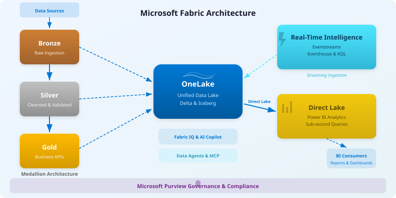

# Supercharge Microsoft Fabric

**Transform your operations with enterprise-grade analytics powered by Microsoft Fabric**

*Real-time insights · Medallion Architecture · Regulatory Compliance · Direct Lake BI*

[Quick Start](PREREQUISITES.md){ .md-button .md-button--primary }
[Tutorials](tutorials/index.md){ .md-button }

---

## Architecture at a Glance

---

## Three Core Paradigms

This POC is built on three paradigms that define how data flows from source to insight inside Microsoft Fabric.

**OneLake** is the unified storage layer. Every workspace writes Delta and Iceberg tables to a single lake — no data movement, no copy sprawl.

**Medallion Architecture** (Bronze → Silver → Gold) organizes that data by quality tier. Bronze captures raw ingestion, Silver cleanses and validates, Gold produces business-ready KPIs and star schemas.

**Direct Lake** connects Power BI semantic models straight to Gold-layer Delta tables in OneLake — sub-second queries without import or DirectQuery overhead.

Together they give you a single pipeline from raw events to executive dashboards, with governance enforced by Microsoft Purview at every layer.

---

## Start Here

-   :material-rocket-launch:{ .lg .middle } __Quick Start__

    ---

    Prerequisites, Azure setup, one-click Bicep deployment

    [:octicons-arrow-right-24: Get started](PREREQUISITES.md)

-   :material-school:{ .lg .middle } __Tutorials__

    ---

    37+ hands-on modules from Bronze ingestion to AI/ML

    [:octicons-arrow-right-24: Browse tutorials](tutorials/index.md)

-   :material-domain:{ .lg .middle } __Architecture__

    ---

    System design, component overview, data flow diagrams

    [:octicons-arrow-right-24: View architecture](ARCHITECTURE.md)

-   :material-calendar-check:{ .lg .middle } __3-Day POC Agenda__

    ---

    Workshop materials: Foundation → Transformation → BI & Governance

    [:octicons-arrow-right-24: View agenda](poc-agenda/README.md)

---

## Choose Your Path

-   :material-database-cog:{ .lg .middle } __Data Engineers__

    ---

    PySpark notebooks, pipelines, ETL, medallion implementation

    [:octicons-arrow-right-24: Bronze layer tutorial](tutorials/01-bronze-layer/README.md)

-   :material-chart-areaspline:{ .lg .middle } __BI Developers__

    ---

    Direct Lake, Power BI semantic models, DAX measures

    [:octicons-arrow-right-24: Direct Lake tutorial](tutorials/05-direct-lake-powerbi/README.md)

-   :material-shield-lock:{ .lg .middle } __Security & Compliance__

    ---

    Purview governance, MICS, CTR/SAR, regulatory reporting

    [:octicons-arrow-right-24: Governance tutorial](tutorials/07-governance-purview/README.md)

-   :material-lightning-bolt:{ .lg .middle } __Real-Time Analytics__

    ---

    Eventstreams, Eventhouse, KQL for streaming workloads

    [:octicons-arrow-right-24: Real-time tutorial](tutorials/04-real-time-analytics/README.md)

---

## Feature Documentation

-   :material-brain:{ .lg .middle } __Fabric IQ__

    ---

    Natural language data exploration with Ontology & Plan layers

    [:octicons-arrow-right-24: Fabric IQ](features/fabric-iq.md)

-   :material-lightning-bolt:{ .lg .middle } __Real-Time Intelligence__

    ---

    Eventstreams, Eventhouse, KQL, Business Events, Maps

    [:octicons-arrow-right-24: RTI](features/real-time-intelligence.md)

-   :material-robot:{ .lg .middle } __AI Copilot__

    ---

    Copilot Studio integration and governance configuration

    [:octicons-arrow-right-24: Copilot](features/ai-copilot-configuration.md)

-   :material-lan:{ .lg .middle } __Data Mesh__

    ---

    Enterprise data mesh patterns with Fabric domains

    [:octicons-arrow-right-24: Data Mesh](features/data-mesh-enterprise-patterns.md)

[:octicons-arrow-right-24: View all features](features/fabric-iq.md){ .md-button }

---

## Compliance & Governance

This POC addresses casino/gaming regulations (NIGC MICS, Title 31/BSA, IRS Gaming) and supports **8 federal agency domains** — USDA, SBA, NOAA, EPA, DOI, DOT/FAA, Tribal Healthcare, and DOJ.

| Framework | Coverage |
|:----------|:---------|
| **NIGC MICS** | Minimum Internal Control Standards |
| **Title 31/BSA** | Anti-money laundering, CTR/SAR |
| **IRS Gaming** | W-2G, 1042-S reporting |
| **State Gaming Commissions** | Jurisdiction-specific requirements |

[:octicons-arrow-right-24: Security documentation](SECURITY.md){ .md-button }

---

## Quick Links

-   :fontawesome-brands-github:{ .lg .middle } __GitHub Repository__

    ---

    Source code, issues, and releases

    [:octicons-arrow-right-24: Open on GitHub](https://github.com/fgarofalo56/Suppercharge_Microsoft_Fabric)

-   :material-file-document-multiple:{ .lg .middle } __Documentation__

    ---

    Full documentation index and guides

    [:octicons-arrow-right-24: Browse docs](index.md)

-   :material-cog:{ .lg .middle } __Infrastructure__

    ---

    Bicep IaC modules for Azure deployment

    [:octicons-arrow-right-24: View infra](https://github.com/fgarofalo56/Suppercharge_Microsoft_Fabric/tree/main/infra)

-   :material-currency-usd:{ .lg .middle } __Cost Estimation__

    ---

    F64 capacity breakdown — ~$10,310/month

    [:octicons-arrow-right-24: Cost details](COST_ESTIMATION.md)

---

**License:** MIT | **Maintained by:** Microsoft Fabric POC Team

[:material-github: View on GitHub](https://github.com/fgarofalo56/Suppercharge_Microsoft_Fabric){ .md-button }

