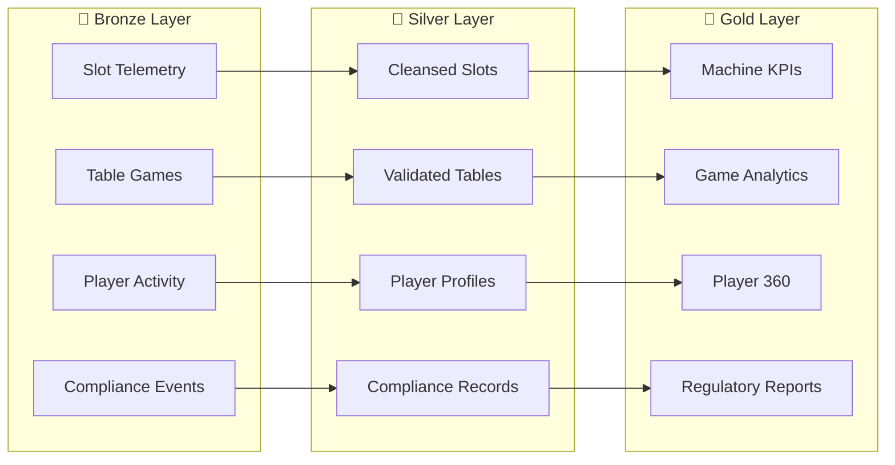

# 🎰 Supercharge Microsoft Fabric

<div class="hero" markdown>

**Transform your casino operations with enterprise-grade analytics powered by Microsoft Fabric**

*Real-time insights • Medallion Architecture • Regulatory Compliance • Direct Lake BI*

[🚀 Quick Start](PREREQUISITES.md){ .md-button .md-button--primary }
[📖 Tutorials](tutorials/README.md){ .md-button }

</div>

---

## 🎯 Overview

This repository provides a **complete, production-ready proof-of-concept** environment for Microsoft Fabric, covering the casino/gaming industry and **7 federal agency domains** (USDA, SBA, NOAA, EPA, DOI, DOT/FAA, Tribal Healthcare).

<div class="grid" markdown>

<div class="card" markdown>

### 🏛️ Medallion Architecture

Bronze/Silver/Gold Lakehouse pattern with Delta Lake tables

</div>

<div class="card" markdown>

### ⚡ Real-Time Intelligence

Casino floor monitoring with Eventstreams and Eventhouse

</div>

<div class="card" markdown>

### 📊 Direct Lake

Sub-second Power BI analytics with semantic models

</div>

<div class="card" markdown>

### 🔐 Data Governance

Microsoft Purview integration for compliance

</div>

</div>

---

## 👥 Target Audience

| Role | Focus Areas |
|:-----|:------------|
| 🏗️ **Data Architects** | System design, medallion pattern, scalability |
| 💻 **Data Engineers** | PySpark notebooks, pipelines, ETL |
| 📊 **BI Developers** | Direct Lake, Power BI, DAX |
| 🔐 **Security/Compliance** | Purview, MICS, regulatory reporting |
| 💼 **Solution Architects** | End-to-end integration, infrastructure |

---

## 🚀 Quick Start

### Prerequisites

- Azure subscription with Fabric capacity (F64 or trial)
- Azure CLI and Bicep tools
- Power BI Desktop

### One-Click Deployment

```bash
# Clone the repository
git clone https://github.com/fgarofalo56/Suppercharge_Microsoft_Fabric.git
cd Suppercharge_Microsoft_Fabric

# Deploy infrastructure
az deployment sub create \
  --location eastus2 \
  --template-file infra/main.bicep \
  --parameters infra/environments/dev/dev.bicepparam
```

[➡️ Full Deployment Guide](DEPLOYMENT.md){ .md-button }

---

## 📂 Documentation Structure

| Section | Description |
|:--------|:------------|
| [📖 Getting Started](PREREQUISITES.md) | Prerequisites, setup, and configuration |
| [🏗️ Architecture](ARCHITECTURE.md) | System design and component overview |
| [📚 Tutorials](tutorials/README.md) | 37 hands-on learning modules |
| [📅 POC Agenda](poc-agenda/README.md) | 3-day workshop materials |
| [📊 Reference](GLOSSARY.md) | FAQ, glossary, and standards |
| [🛠️ Infrastructure](https://github.com/fgarofalo56/Suppercharge_Microsoft_Fabric/tree/main/infra) | Bicep IaC modules |
| [🏢 Best Practices](BEST_PRACTICES.md) | Workspace organization, folder structures, environments |
| [🌐 Networking](NETWORKING.md) | Private endpoints, ExpressRoute, VPN, gateways |
| [🔄 Disaster Recovery](DISASTER_RECOVERY.md) | Multi-region architecture, RTO/RPO, failover procedures |
| [📋 Data Dictionary](data-dictionary/README.md) | Complete schema documentation for all layers |
| [📕 Runbooks](runbooks/README.md) | Operational procedures and incident response |
| [📜 Compliance Templates](compliance-templates/README.md) | CTR, SAR, W-2G, MICS reporting templates |

---

## 🔧 Feature Documentation (New Fabric Experience)

| Feature | Description | Status |
|:--------|:------------|:-------|
| [Fabric IQ](features/fabric-iq.md) | Natural language data exploration with Ontology & Plan layers | GA |
| [Real-Time Intelligence](features/real-time-intelligence.md) | Eventstreams, Eventhouse, KQL, Business Events, Maps | GA |
| [AI Copilot](features/ai-copilot-configuration.md) | Copilot Studio integration and governance | GA |
| [Data Mesh](features/data-mesh-enterprise-patterns.md) | Enterprise data mesh patterns with Fabric domains | GA |
| [Digital Twin Builder](features/digital-twin-builder.md) | IoT digital twin modeling and simulation | Preview |
| [Data Agents](features/data-agents.md) | Autonomous AI agents for data workflows | Preview |
| [OneLake Security](features/onelake-security.md) | Workspace identity, managed VNet, trusted access | GA |
| [OneLake Iceberg Interop](features/onelake-iceberg-interop.md) | Apache Iceberg read/write for cross-platform analytics | GA |
| [dbt Integration](features/dbt-fabric-integration.md) | dbt Core/Cloud with Fabric SQL & Spark | GA |
| [Materialized Lake Views](features/materialized-lake-views.md) | Pre-computed views for Direct Lake performance | Preview |
| [Eventhouse Vector Database](features/eventhouse-vector-database.md) | Vector search in KQL for AI/RAG workloads | GA |
| [Graph in Fabric](features/graph-in-fabric.md) | Entity relationship modeling and graph analytics | GA |
| [Maps in Fabric](features/maps-in-fabric.md) | Native geospatial visualization in RTI dashboards | GA |
| [Database Hub](features/database-hub.md) | Unified database management across edge/cloud/Fabric | Early Access |
| [Mirroring](features/mirroring.md) | Near-real-time DB replication (Oracle, SAP, BigQuery, MySQL) | GA |
| [Direct Lake](features/direct-lake.md) | Power BI reads Delta directly from OneLake | GA |
| [Fabric SQL Database](features/fabric-sql-database.md) | OLTP workload with auto-replication to OneLake | GA |
| [API for GraphQL](features/api-for-graphql.md) | GraphQL API layer over Fabric data items | GA |
| [Semantic Link](features/semantic-link.md) | SemPy library bridging notebooks and semantic models | GA |
| [OneLake Catalog](features/onelake-catalog.md) | Unified data discovery and governance hub | GA |
| [AutoML & Model Endpoints](features/automl-model-endpoints.md) | Automated ML training and REST model deployment | GA/Preview |
| [Translytical Task Flows](features/translytical-task-flows.md) | Write-back from Power BI reports to Lakehouse | GA |
| [Fabric MCP](features/fabric-mcp.md) | Model Context Protocol for AI agent interaction | Preview |
| [Workspace Monitoring](features/workspace-monitoring.md) | Queryable system tables for activity tracking | GA |
| [Copy Job CDC](features/copy-job-cdc.md) | Low-code continuous ingestion with change data capture | GA |

---

## 🛠️ Developer Resources

| Resource | Description |
|:---------|:------------|
| [📓 Notebooks](https://github.com/fgarofalo56/Suppercharge_Microsoft_Fabric/tree/main/notebooks) | Ready-to-import Fabric notebooks (Bronze, Silver, Gold, ML) |
| [📊 Power BI Assets](https://github.com/fgarofalo56/Suppercharge_Microsoft_Fabric/tree/main/powerbi) | DAX measures and TMDL semantic models |

---

## 📊 3-Day POC Agenda

| Day | Focus | Topics |
|:---:|:------|:-------|
| 1️⃣ | **Foundation** | Medallion architecture, Bronze layer, ingestion patterns |
| 2️⃣ | **Transformation** | Silver/Gold layers, real-time analytics, Eventstreams |
| 3️⃣ | **BI & Governance** | Direct Lake, Power BI, Purview, database mirroring |

[📅 View Full Agenda](poc-agenda/README.md){ .md-button }

---

## 🎰 Casino/Gaming Data Domains



---

## 📜 Compliance Frameworks

This POC addresses key gaming industry regulations:

| Framework | Coverage |
|:----------|:---------|
| **NIGC MICS** | Minimum Internal Control Standards |
| **Title 31/BSA** | Anti-money laundering, CTR/SAR |
| **IRS Gaming** | W-2G, 1042-S reporting |
| **State Gaming Commissions** | Jurisdiction-specific requirements |

[🛡️ Security Documentation](SECURITY.md){ .md-button }

---

## 📚 Tutorials

| # | Tutorial | Duration |
|:-:|:---------|:--------:|
| 00 | [Environment Setup](tutorials/00-environment-setup/README.md) | ~1 hour |
| 01 | [Bronze Layer](tutorials/01-bronze-layer/README.md) | ~2 hours |
| 02 | [Silver Layer](tutorials/02-silver-layer/README.md) | ~2 hours |
| 03 | [Gold Layer](tutorials/03-gold-layer/README.md) | ~2 hours |
| 04 | [Real-Time Analytics](tutorials/04-real-time-analytics/README.md) | ~2 hours |
| 05 | [Direct Lake & Power BI](tutorials/05-direct-lake-powerbi/README.md) | ~2 hours |
| 06 | [Data Pipelines](tutorials/06-data-pipelines/README.md) | ~2 hours |
| 07 | [Governance & Purview](tutorials/07-governance-purview/README.md) | ~2 hours |
| 08 | [Database Mirroring](tutorials/08-database-mirroring/README.md) | ~2 hours |
| 09 | [Advanced AI/ML](tutorials/09-advanced-ai-ml/README.md) | ~3 hours |
| 10 | [Teradata Migration](tutorials/10-teradata-migration/README.md) | ~2 hours |
| 11 | [SAS Connectivity](tutorials/11-sas-connectivity/README.md) | ~2 hours |
| 12 | [CI/CD & DevOps](tutorials/12-cicd-devops/README.md) | ~2 hours |
| 13 | [Migration Planning](tutorials/13-migration-planning/README.md) | ~2 hours |
| 14 | [Security & Networking](tutorials/14-security-networking/README.md) | ~2.5 hours |
| 15 | [Cost Optimization](tutorials/15-cost-optimization/README.md) | ~2 hours |
| 16 | [Performance Tuning](tutorials/16-performance-tuning/README.md) | ~2.5 hours |
| 17 | [Monitoring & Alerting](tutorials/17-monitoring-alerting/README.md) | ~2 hours |
| 18 | [Data Sharing](tutorials/18-data-sharing/README.md) | ~1.5 hours |
| 19 | [Copilot & AI](tutorials/19-copilot-ai/README.md) | ~1.5 hours |
| 20 | [Workspace Best Practices](tutorials/20-workspace-best-practices/README.md) | ~2.5 hours |
| 21 | [GeoAnalytics & ArcGIS](tutorials/21-geoanalytics-arcgis/README.md) | ~3.5 hours |
| 22 | [Networking Connectivity](tutorials/22-networking-connectivity/README.md) | ~3.5 hours |
| 23 | [SHIR & Data Gateways](tutorials/23-shir-data-gateways/README.md) | ~2.5 hours |

---

## 💰 Cost Estimation

| Component | Monthly Cost (F64) |
|:----------|-------------------:|
| Fabric Capacity (F64) | ~$8,500 |
| ADLS Gen2 Storage | ~$500 |
| Microsoft Purview | ~$800 |
| Log Analytics | ~$300 |
| Key Vault | ~$10 |
| Networking | ~$200 |
| **Total Estimate** | **~$10,310/month** |

[💰 Detailed Cost Analysis](COST_ESTIMATION.md){ .md-button }

---

## 🔗 Quick Links

<div class="grid" markdown>

<div class="card" markdown>

### [:fontawesome-brands-github: GitHub Repository](https://github.com/fgarofalo56/Suppercharge_Microsoft_Fabric)

Source code and issues

</div>

<div class="card" markdown>

### [:material-file-document: Documentation](index.md)

Complete documentation index

</div>

<div class="card" markdown>

### [:material-school: Tutorials](tutorials/README.md)

Hands-on learning path

</div>

<div class="card" markdown>

### [:material-cog: Infrastructure](https://github.com/fgarofalo56/Suppercharge_Microsoft_Fabric/tree/main/infra)

Bicep IaC modules

</div>

</div>

---

<div align="center" markdown>

**License:** MIT | **Maintained by:** Microsoft Fabric POC Team

[:material-github: View on GitHub](https://github.com/fgarofalo56/Suppercharge_Microsoft_Fabric){ .md-button }

</div>
