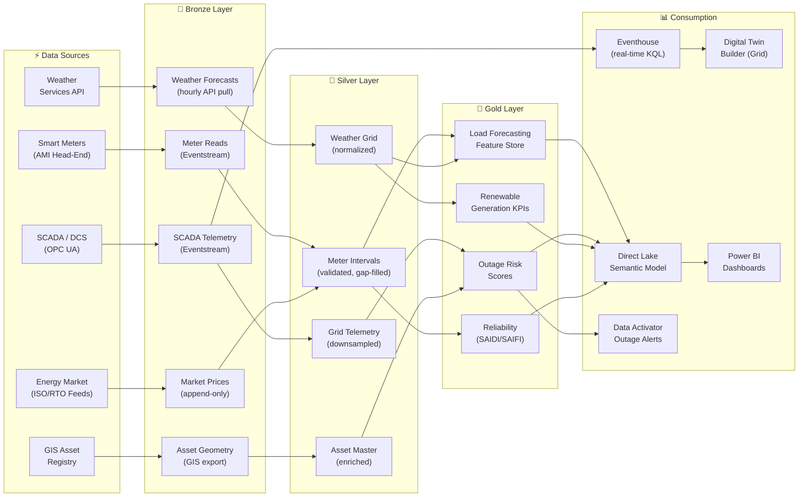

[Home](../index.md) > [Docs](../) > [Industries](./) > Energy & Utilities

{ .hero-banner }

# ⚡ Energy & Utilities — Smart Grid Analytics & Renewable Forecasting

**Grid-scale analytics, outage prediction, and NERC CIP compliance on Microsoft Fabric**

---

**Last Updated:** `2026-05-05` | **Version:** 1.0.0

---

> *"The modern grid generates terabytes of AMI, SCADA, and weather data daily — the utilities that turn that data into real-time decisions will lead the energy transition."*

---

## 📑 Table of Contents

- [Scenario Overview](#-scenario-overview)
- [Regulatory Landscape](#-regulatory-landscape)
- [Data Flow Architecture](#-data-flow-architecture)
- [Why Fabric for Energy and Utilities](#-why-fabric-for-energy-and-utilities)
- [Getting Started](#-getting-started)
- [References](#-references)

---

## 🎯 Scenario Overview

| Scenario | Fabric Pattern | Latency Target | Key Features |
|----------|---------------|----------------|--------------|
| Smart meter (AMI) analytics | Eventstream → Eventhouse + Lakehouse Bronze | < 15 sec | [RTI](../features/real-time-intelligence.md), [Medallion Architecture](../best-practices/medallion-architecture-deep-dive.md) |
| Outage prediction & restoration | Gold feature store + AutoML classification model | 15-min intervals | [AutoML](../features/automl-model-endpoints.md), [Data Activator](../best-practices/alerting-data-activator.md) |
| Renewable generation forecasting | Lakehouse Gold + AutoML time-series model | Hourly | [AutoML](../features/automl-model-endpoints.md), [Semantic Link](../features/semantic-link.md) |
| Grid digital twin | Digital Twin Builder with SCADA binding | < 5 sec | [Digital Twin Builder](../features/digital-twin-builder.md), [RTI](../features/real-time-intelligence.md) |
| Regulatory compliance reporting | Warehouse star schema + Direct Lake | Monthly/Quarterly | [Warehouse Setup](../best-practices/08_WAREHOUSE_SETUP.md), [Direct Lake](../features/direct-lake.md) |
| Vegetation management (wildfire risk) | Lakehouse Gold with geospatial + weather overlays | Daily | [Maps in Fabric](../features/maps-in-fabric.md), [Medallion Architecture](../best-practices/medallion-architecture-deep-dive.md) |

---

## 📋 Regulatory Landscape

| Framework | Applicability | Fabric Controls |
|-----------|--------------|-----------------|
| **NERC CIP** (Critical Infrastructure Protection) | Bulk electric system cyber assets and electronic security perimeters | [Network Security](../best-practices/network-security.md) managed private endpoints, [Outbound Access Protection](../best-practices/outbound-access-protection.md), [RBAC](../best-practices/identity-rbac-patterns.md) |
| **FERC Order 2222** | Distributed energy resource aggregation and market participation | Lakehouse Gold aggregation layer for DER portfolio analytics |
| **EPA Clean Air Act / GHGRP** | Greenhouse gas reporting for fossil generation | [SQL Audit Logs](../best-practices/sql-audit-logs-compliance.md) for emissions data lineage, [Data Governance](../best-practices/data-governance-deep-dive.md) |
| **DOE Cybersecurity Capability Maturity Model (C2M2)** | Cybersecurity practices for energy subsector | [Zero Trust Blueprint](../best-practices/security/zero-trust-blueprint.md), [Monitoring](../best-practices/monitoring-observability.md) |
| **State PUC Reliability Standards** | SAIDI/SAIFI/CAIDI performance metrics | Gold-layer reliability KPIs with Direct Lake dashboards |

---

## 🏗️ Data Flow Architecture

---

## 💡 Why Fabric for Energy and Utilities

**Scale to billions of meter reads without custom infrastructure.** AMI head-end systems generate 96+ interval reads per meter per day. Eventstreams ingest this volume directly into Eventhouse for real-time analytics and Lakehouse Bronze for historical analysis — no Hadoop clusters or custom Kafka consumers required.

**Grid digital twin built on the analytics platform.** Digital Twin Builder models substations, feeders, and distributed energy resources with real-time SCADA binding, enabling operators to visualize grid state in Eventhouse KQL dashboards alongside historical trends.

**Outage prediction with built-in ML.** AutoML trains classification models on weather, vegetation, asset age, and historical outage data, scoring feeder-level risk every 15 minutes and triggering Data Activator alerts for proactive crew dispatch.

**NERC CIP compliance without bolt-on tools.** Managed private endpoints, customer-managed keys, identity-based RBAC, and SQL audit logs provide the access control, encryption, and audit evidence that NERC CIP standards require — all native to Fabric.

**Renewable forecasting at Direct Lake speed.** Wind and solar generation predictions run through AutoML time-series models and surface in Direct Lake Power BI dashboards, giving dispatchers sub-second access to generation-vs-load balance metrics.

---

## 🚀 Getting Started

1. **Ingest AMI and SCADA data** — Configure [Eventstreams](../features/real-time-intelligence.md) to pull meter reads and SCADA telemetry into Eventhouse and Lakehouse Bronze.
2. **Build the medallion Lakehouse** — Follow [Medallion Deep Dive](../best-practices/medallion-architecture-deep-dive.md) for meter, asset, weather, and market data.
3. **Apply NERC CIP controls** — Enable [Network Security](../best-practices/network-security.md) private endpoints, [CMK](../best-practices/customer-managed-keys.md), and [RBAC](../best-practices/identity-rbac-patterns.md) aligned to CIP-004/005/007.
4. **Model the grid** — Use [Digital Twin Builder](../features/digital-twin-builder.md) to create substation and feeder entities with live SCADA binding.
5. **Deploy outage prediction** — Train classification models via [AutoML](../features/automl-model-endpoints.md) and wire [Data Activator](../best-practices/alerting-data-activator.md) for proactive alerts.
6. **Build reliability dashboards** — Create SAIDI/SAIFI/CAIDI reports with [Direct Lake](../features/direct-lake.md) over Gold reliability tables.

---

## 📚 References

| Resource | Link |
|----------|------|
| Real-Time Intelligence | [RTI Guide](../features/real-time-intelligence.md) |
| Digital Twin Builder | [DTB Guide](../features/digital-twin-builder.md) |
| Direct Lake connectivity | [Direct Lake Guide](../features/direct-lake.md) |
| AutoML Model Endpoints | [AutoML Guide](../features/automl-model-endpoints.md) |
| Network Security | [Network Security](../best-practices/network-security.md) |
| Maps in Fabric | [Maps Guide](../features/maps-in-fabric.md) |
| Capacity Planning | [Capacity Guide](../best-practices/capacity-planning-cost-optimization.md) |
| BCDR | [Disaster Recovery](../best-practices/disaster-recovery-bcdr.md) |
