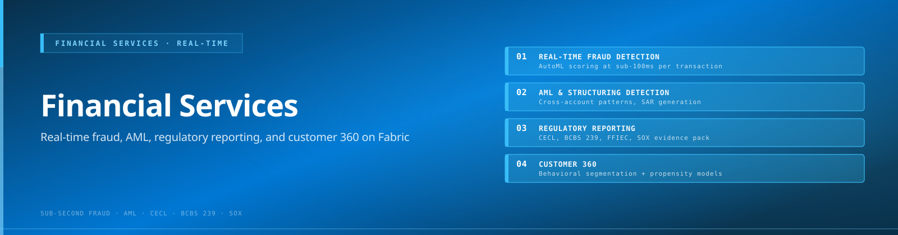
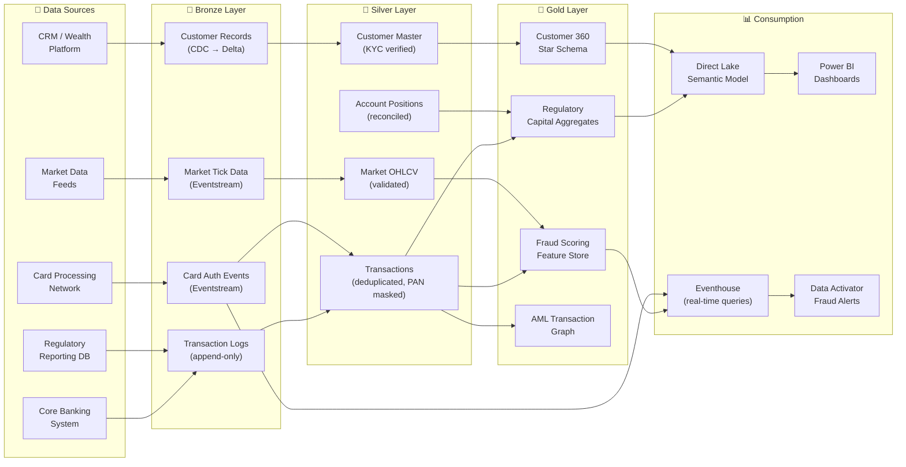

[Home](../index.md) > [Docs](../) > [Industries](./) > Financial Services

{ .hero-banner }

# 🏦 Financial Services — Fraud Detection & Risk Analytics

**Real-time transaction intelligence and regulatory reporting on Microsoft Fabric**

---

**Last Updated:** `2026-05-05` | **Version:** 1.0.0

---

> *"Financial institutions process billions of transactions daily — detecting the fraudulent ones in real time is not optional, it is existential."*

---

## 📑 Table of Contents

- [Scenario Overview](#-scenario-overview)
- [Regulatory Landscape](#-regulatory-landscape)
- [Data Flow Architecture](#-data-flow-architecture)
- [Why Fabric for Financial Services](#-why-fabric-for-financial-services)
- [Getting Started](#-getting-started)
- [References](#-references)

---

## 🎯 Scenario Overview

| Scenario | Fabric Pattern | Latency Target | Key Features |
|----------|---------------|----------------|--------------|
| Real-time fraud detection | Eventstream → Eventhouse anomaly detection → Data Activator | < 2 sec | [RTI](../features/real-time-intelligence.md), [Alerting](../best-practices/alerting-data-activator.md) |
| Anti-money laundering (AML) | Lakehouse medallion with transaction graph analysis | Daily batch | [Medallion Architecture](../best-practices/medallion-architecture-deep-dive.md), [Graph in Fabric](../features/graph-in-fabric.md) |
| Regulatory capital reporting (Basel III/IV) | Warehouse star schema + Direct Lake | Monthly/Quarterly | [Warehouse Setup](../best-practices/08_WAREHOUSE_SETUP.md), [Direct Lake](../features/direct-lake.md) |
| Credit risk scoring | Gold layer + AutoML model endpoint | Hourly scoring | [AutoML](../features/automl-model-endpoints.md), [MLOps](../best-practices/mlops-fabric-production.md) |
| Market data analytics | Eventstream from exchange feeds → Eventhouse | < 1 sec | [RTI](../features/real-time-intelligence.md), [Eventhouse Vector DB](../features/eventhouse-vector-database.md) |
| Customer 360 for wealth management | Lakehouse Gold + Semantic Link | Near-real-time | [Semantic Link](../features/semantic-link.md), [Data Sharing](../best-practices/data-sharing-federation.md) |

---

## 📋 Regulatory Landscape

| Framework | Applicability | Fabric Controls |
|-----------|--------------|-----------------|
| **PCI-DSS** (Payment Card Industry Data Security Standard) | Card-present/card-not-present transaction data | [OneLake Security](../features/onelake-security.md) column-level masking for PAN, [CMK](../best-practices/customer-managed-keys.md), [Network Security](../best-practices/network-security.md) managed private endpoints |
| **SOX** (Sarbanes-Oxley Act) | Public company financial reporting controls | [SQL Audit Logs](../best-practices/sql-audit-logs-compliance.md), [Audit Trail Immutability](../best-practices/security/audit-trail-immutability.md), Delta Lake time-travel |
| **BSA / AML** (Bank Secrecy Act) | CTR filing ($10K+), SAR filing for suspicious patterns | Lakehouse Silver structuring-detection logic, [Monitoring](../best-practices/monitoring-observability.md) |
| **GDPR / CCPA** | Customer PII for EU/California residents | [GDPR Right to Deletion](../best-practices/security/gdpr-right-to-deletion.md), [CCPA Privacy Rights](../best-practices/security/ccpa-privacy-rights.md) |
| **Basel III / IV** | Regulatory capital, liquidity, and leverage ratios | Warehouse aggregation layer with auditable lineage via [Data Governance](../best-practices/data-governance-deep-dive.md) |
| **DORA** (Digital Operational Resilience Act) | EU financial entity ICT risk management | [BCDR](../best-practices/disaster-recovery-bcdr.md), [Observability](../best-practices/monitoring-observability.md), [Outbound Access Protection](../best-practices/outbound-access-protection.md) |

---

## 🏗️ Data Flow Architecture

---

## 💡 Why Fabric for Financial Services

**Sub-second fraud detection without separate streaming infrastructure.** Card authorization events flow through Eventstreams directly into Eventhouse, where KQL anomaly detection functions identify suspicious patterns and Data Activator blocks transactions — all within Fabric, no external Kafka or Flink clusters needed.

**Auditable, immutable data lineage.** Delta Lake's transaction log and time-travel capabilities provide the versioned, tamper-evident data history that SOX and Basel auditors require. Combined with SQL Audit Logs, every data access is traceable.

**Single platform for batch and real-time.** Financial institutions typically run nightly risk calculations alongside real-time fraud monitoring. Fabric unifies both in one workspace — Lakehouse for batch, Eventhouse for streaming — reading from the same OneLake storage.

**PCI-DSS controls built in.** Column-level security masks PANs and CVVs, customer-managed keys provide BYOK encryption, and managed private endpoints ensure card data never traverses public networks.

**Regulatory reporting without data movement.** Direct Lake semantic models over Warehouse star schemas give risk and compliance teams self-service access to regulatory capital, liquidity, and leverage dashboards without exporting data to external BI tools.

---

## 🚀 Getting Started

1. **Set up the medallion architecture** — Follow [Tutorial 01: Bronze Ingestion](../tutorials/index.md) and [Medallion Deep Dive](../best-practices/medallion-architecture-deep-dive.md) to establish Bronze/Silver/Gold layers.
2. **Stream transaction events** — Configure [Eventstreams](../features/real-time-intelligence.md) to ingest card authorization events from Event Hub into Eventhouse.
3. **Apply PCI-DSS controls** — Enable [OneLake Security](../features/onelake-security.md) CLS for PAN masking, [CMK](../best-practices/customer-managed-keys.md), and [Network Security](../best-practices/network-security.md) private endpoints.
4. **Build fraud detection** — Use Eventhouse KQL anomaly detection on the transaction stream and wire [Data Activator](../best-practices/alerting-data-activator.md) alerts.
5. **Create regulatory reports** — Build [Warehouse](../best-practices/08_WAREHOUSE_SETUP.md) aggregation tables and connect [Direct Lake](../features/direct-lake.md) for Basel/SOX dashboards.
6. **Deploy credit risk models** — Train and deploy scoring models via [AutoML](../features/automl-model-endpoints.md) on Gold-layer feature tables.

---

## 📚 References

| Resource | Link |
|----------|------|
| Real-Time Intelligence | [RTI Guide](../features/real-time-intelligence.md) |
| Direct Lake connectivity | [Direct Lake Guide](../features/direct-lake.md) |
| Data Governance | [Governance Deep Dive](../best-practices/data-governance-deep-dive.md) |
| Network Security | [Network Security](../best-practices/network-security.md) |
| Customer-Managed Keys | [CMK Guide](../best-practices/customer-managed-keys.md) |
| SQL Audit Logs | [Audit Logs Guide](../best-practices/sql-audit-logs-compliance.md) |
| BCDR | [Disaster Recovery](../best-practices/disaster-recovery-bcdr.md) |
| Graph in Fabric | [Graph Guide](../features/graph-in-fabric.md) |
