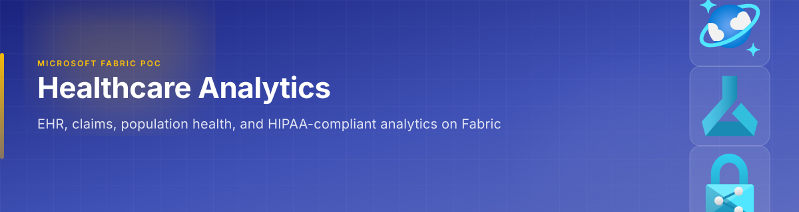
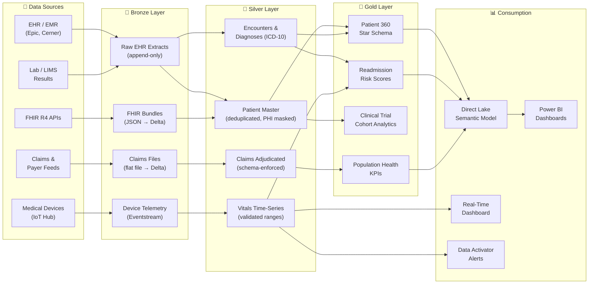

[Home](../index.md) > [Docs](../) > [Industries](./) > Healthcare

{ .hero-banner }

# 🏥 Healthcare — Patient Analytics & Clinical Intelligence

**Unified clinical, operational, and research analytics on Microsoft Fabric**

---

**Last Updated:** `2026-05-05` | **Version:** 1.0.0

---

> *"The healthcare industry generates roughly 30% of the world's data volume, yet most clinical insights still arrive too late to change patient outcomes."*

---

## 📑 Table of Contents

- [Scenario Overview](#-scenario-overview)
- [Regulatory Landscape](#-regulatory-landscape)
- [Data Flow Architecture](#-data-flow-architecture)
- [Why Fabric for Healthcare](#-why-fabric-for-healthcare)
- [Getting Started](#-getting-started)
- [References](#-references)

---

## 🎯 Scenario Overview

| Scenario | Fabric Pattern | Latency Target | Key Features |
|----------|---------------|----------------|--------------|
| Patient 360 analytics | Lakehouse medallion + Direct Lake semantic model | < 15 min (near-real-time refresh) | [Direct Lake](../features/direct-lake.md), [Semantic Link](../features/semantic-link.md) |
| Clinical trial data integration | Lakehouse Bronze/Silver with FHIR R4 schema mapping | Daily batch | [Medallion Architecture](../best-practices/medallion-architecture-deep-dive.md), [Data Governance](../best-practices/data-governance-deep-dive.md) |
| Real-time patient vitals monitoring | Eventstream → Eventhouse → Data Activator alerts | < 5 sec | [RTI](../features/real-time-intelligence.md), [Alerting](../best-practices/alerting-data-activator.md) |
| Readmission risk prediction | Lakehouse Gold + AutoML model endpoint | Hourly scoring | [AutoML](../features/automl-model-endpoints.md), [MLOps](../best-practices/mlops-fabric-production.md) |
| Medical device telemetry | Eventstream → Eventhouse with Digital Twin Builder | < 2 sec | [Digital Twin Builder](../features/digital-twin-builder.md), [RTI](../features/real-time-intelligence.md) |
| Population health dashboards | Warehouse star schema + Direct Lake | Daily | [Warehouse Setup](../best-practices/08_WAREHOUSE_SETUP.md), [Direct Lake](../features/direct-lake.md) |

---

## 📋 Regulatory Landscape

| Framework | Applicability | Fabric Controls |
|-----------|--------------|-----------------|
| **HIPAA** (Health Insurance Portability and Accountability Act) | All entities handling PHI — providers, payers, clearinghouses, and business associates | [OneLake Security](../features/onelake-security.md) row/column-level security, [CMK](../best-practices/customer-managed-keys.md) encryption at rest, [SQL Audit Logs](../best-practices/sql-audit-logs-compliance.md) for access tracking |
| **HITECH** (Health Information Technology for Economic and Clinical Health) | Extends HIPAA breach notification and enforcement | [Monitoring & Observability](../best-practices/monitoring-observability.md) for breach detection, [Data Activator](../best-practices/alerting-data-activator.md) for anomalous access alerts |
| **21 CFR Part 11** (FDA Electronic Records) | Clinical trial data, pharmaceutical manufacturing records | [Audit Trail Immutability](../best-practices/security/audit-trail-immutability.md), Delta Lake time-travel for version history |
| **GDPR / State Privacy Laws** | Patient data for EU residents or applicable US states | [GDPR Right to Deletion](../best-practices/security/gdpr-right-to-deletion.md), [CCPA Privacy Rights](../best-practices/security/ccpa-privacy-rights.md) |
| **HL7 FHIR R4** | Interoperability standard for clinical data exchange | Lakehouse schema mapping in Silver layer with FHIR resource normalization |

---

## 🏗️ Data Flow Architecture

---

## 💡 Why Fabric for Healthcare

**Unified platform for diverse clinical data.** Healthcare organizations typically operate dozens of siloed systems — EHR, lab, pharmacy, claims, devices. Fabric's OneLake eliminates data copies by providing a single storage layer that Lakehouse, Warehouse, and Eventhouse all read from, reducing data sprawl and governance risk.

**Built-in compliance primitives.** Row-level security, column-level security, sensitivity labels, customer-managed keys, and SQL audit logs map directly to HIPAA technical safeguards — without bolting on third-party tools.

**Real-time clinical alerting without custom code.** Medical device telemetry flows through Eventstreams into Eventhouse, where Data Activator can trigger alerts on abnormal vitals — no Kafka clusters or custom stream processing required.

**Direct Lake for clinical dashboards.** Clinicians and administrators need sub-second dashboard performance. Direct Lake reads Parquet files directly from OneLake into Power BI, eliminating import refresh windows and keeping PHI in a single governed location.

**Predictive analytics at scale.** AutoML model endpoints can score readmission risk, sepsis probability, or length-of-stay predictions on Gold-layer data without moving data to a separate ML platform.

---

## 🚀 Getting Started

1. **Stand up the medallion architecture** — Follow [Tutorial 01: Bronze Ingestion](../tutorials/index.md) and [Medallion Deep Dive](../best-practices/medallion-architecture-deep-dive.md) to create `lh_bronze`, `lh_silver`, `lh_gold` Lakehouses.
2. **Map FHIR resources to Silver schemas** — Normalize FHIR R4 Bundles (Patient, Encounter, Observation, Condition) into Silver Delta tables with schema enforcement.
3. **Apply security controls** — Configure [OneLake Security](../features/onelake-security.md) RLS/CLS, enable [Customer-Managed Keys](../best-practices/customer-managed-keys.md), and turn on [SQL Audit Logs](../best-practices/sql-audit-logs-compliance.md).
4. **Stream device telemetry** — Set up [Eventstreams](../features/real-time-intelligence.md) from IoT Hub to Eventhouse for real-time vitals monitoring.
5. **Build Direct Lake reports** — Create a semantic model over Gold tables and connect [Direct Lake](../features/direct-lake.md) to Power BI for Patient 360 dashboards.
6. **Deploy predictive models** — Use [AutoML](../features/automl-model-endpoints.md) to train and deploy a readmission risk model on the Gold layer.

---

## 📚 References

| Resource | Link |
|----------|------|
| Direct Lake connectivity | [Direct Lake Guide](../features/direct-lake.md) |
| Real-Time Intelligence | [RTI Guide](../features/real-time-intelligence.md) |
| Digital Twin Builder | [DTB Guide](../features/digital-twin-builder.md) |
| Data Governance | [Governance Deep Dive](../best-practices/data-governance-deep-dive.md) |
| Network Security | [Network Security](../best-practices/network-security.md) |
| RBAC Patterns | [Identity & RBAC](../best-practices/identity-rbac-patterns.md) |
| Testing Strategies | [Testing Guide](../best-practices/testing-strategies.md) |
| BCDR | [Disaster Recovery](../best-practices/disaster-recovery-bcdr.md) |
