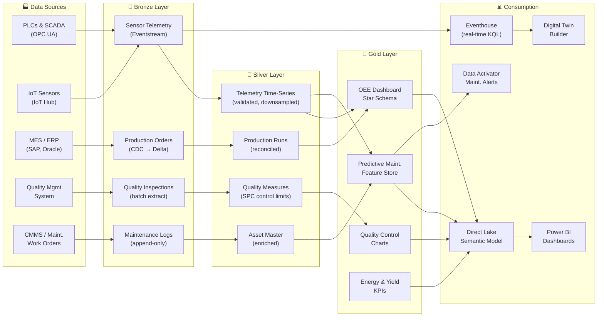

[Home](../index.md) > [Docs](../) > [Industries](./) > Manufacturing

# ⚙️ Manufacturing — IoT Telemetry & Predictive Maintenance

**Unified OT/IT analytics with Digital Twin Builder on Microsoft Fabric**

---

**Last Updated:** `2026-05-05` | **Version:** 1.0.0

---

> *"Unplanned downtime costs industrial manufacturers an estimated $50 billion per year — predictive maintenance powered by streaming telemetry can cut that figure in half."*

---

## 📑 Table of Contents

- [Scenario Overview](#-scenario-overview)
- [Regulatory Landscape](#-regulatory-landscape)
- [Data Flow Architecture](#-data-flow-architecture)
- [Why Fabric for Manufacturing](#-why-fabric-for-manufacturing)
- [Getting Started](#-getting-started)
- [References](#-references)

---

## 🎯 Scenario Overview

| Scenario | Fabric Pattern | Latency Target | Key Features |
|----------|---------------|----------------|--------------|
| IoT telemetry ingestion | Eventstream → Eventhouse with hot/warm/cold caching | < 2 sec | [RTI](../features/real-time-intelligence.md), [Eventhouse Vector DB](../features/eventhouse-vector-database.md) |
| Predictive maintenance | Gold feature store + AutoML anomaly model | Hourly scoring | [AutoML](../features/automl-model-endpoints.md), [MLOps](../best-practices/mlops-fabric-production.md) |
| Digital twin of production line | Digital Twin Builder with real-time sensor binding | < 5 sec | [Digital Twin Builder](../features/digital-twin-builder.md), [RTI](../features/real-time-intelligence.md) |
| Quality analytics (SPC/SQC) | Lakehouse Gold + Direct Lake control charts | Near-real-time | [Direct Lake](../features/direct-lake.md), [Medallion Architecture](../best-practices/medallion-architecture-deep-dive.md) |
| Supply chain & MES integration | Lakehouse Bronze → Silver with Mirroring from ERP | Hourly | [Mirroring](../features/mirroring.md), [Warehouse Setup](../best-practices/08_WAREHOUSE_SETUP.md) |
| Energy consumption optimization | Eventstream from smart meters → Eventhouse KQL | < 10 sec | [RTI](../features/real-time-intelligence.md), [Data Activator](../best-practices/alerting-data-activator.md) |

---

## 📋 Regulatory Landscape

| Framework | Applicability | Fabric Controls |
|-----------|--------------|-----------------|
| **ISO 9001 / IATF 16949** | Quality management systems for manufacturing | Delta Lake time-travel for production batch traceability, [Audit Trail](../best-practices/security/audit-trail-immutability.md) |
| **FDA 21 CFR Part 820** | Medical device and pharmaceutical manufacturing | [SQL Audit Logs](../best-practices/sql-audit-logs-compliance.md), validated data pipeline with [Testing Strategies](../best-practices/testing-strategies.md) |
| **IEC 62443** | Industrial automation and control system security | [Network Security](../best-practices/network-security.md) managed private endpoints, [Outbound Access Protection](../best-practices/outbound-access-protection.md) |
| **OSHA recordkeeping** | Workplace safety incident tracking | Lakehouse Gold safety KPIs, [Monitoring](../best-practices/monitoring-observability.md) |
| **EU Machinery Regulation 2023/1230** | CE marking, digital instructions, and risk assessment | Auditable lineage via [Data Governance](../best-practices/data-governance-deep-dive.md) |

---

## 🏗️ Data Flow Architecture

---

## 💡 Why Fabric for Manufacturing

**Digital Twin Builder is native to Fabric.** Unlike standalone digital twin platforms that require separate infrastructure and data pipelines, Digital Twin Builder models production assets directly on top of Eventhouse — every property update is KQL-queryable, visualizable, and actionable through Data Activator without data movement.

**OT and IT data converge in OneLake.** PLC telemetry, MES production orders, CMMS work orders, and quality inspection records all land in a single governed data lake. No more reconciling siloed OT historians with ERP extracts.

**Predictive maintenance without a data science team.** AutoML model endpoints train anomaly detection and remaining-useful-life models on telemetry feature stores, scoring hourly and triggering proactive maintenance work orders through Data Activator.

**SPC and quality analytics at Direct Lake speed.** Control charts, Cpk/Ppk calculations, and defect Pareto dashboards run at sub-second speed via Direct Lake, giving quality engineers live visibility into production line performance.

**Secure OT/IT boundary.** Managed private endpoints and Outbound Access Protection ensure that factory-floor data ingested through IoT Hub never traverses public networks — critical for IEC 62443 compliance.

---

## 🚀 Getting Started

1. **Ingest IoT telemetry** — Configure [Eventstreams](../features/real-time-intelligence.md) to pull sensor data from Azure IoT Hub into Eventhouse for real-time KQL analysis.
2. **Build the medallion Lakehouse** — Follow [Medallion Deep Dive](../best-practices/medallion-architecture-deep-dive.md) for production, quality, and maintenance data.
3. **Create digital twins** — Use [Digital Twin Builder](../features/digital-twin-builder.md) to model production lines, binding live telemetry to entity properties.
4. **Deploy predictive maintenance** — Build Gold-layer feature tables and train anomaly models via [AutoML](../features/automl-model-endpoints.md).
5. **Set up quality dashboards** — Create SPC control chart reports with [Direct Lake](../features/direct-lake.md) semantic models over Gold quality tables.
6. **Wire maintenance alerts** — Configure [Data Activator](../best-practices/alerting-data-activator.md) to open work orders when predictive scores exceed thresholds.

---

## 📚 References

| Resource | Link |
|----------|------|
| Digital Twin Builder | [DTB Guide](../features/digital-twin-builder.md) |
| Real-Time Intelligence | [RTI Guide](../features/real-time-intelligence.md) |
| Direct Lake connectivity | [Direct Lake Guide](../features/direct-lake.md) |
| AutoML Model Endpoints | [AutoML Guide](../features/automl-model-endpoints.md) |
| Mirroring | [Mirroring Guide](../features/mirroring.md) |
| Network Security | [Network Security](../best-practices/network-security.md) |
| Testing Strategies | [Testing Guide](../best-practices/testing-strategies.md) |
| Outbound Access Protection | [OAP Guide](../best-practices/outbound-access-protection.md) |
