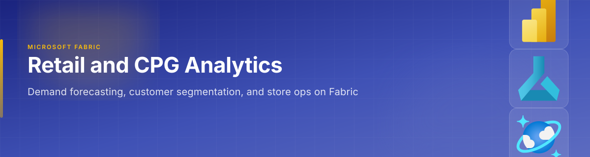
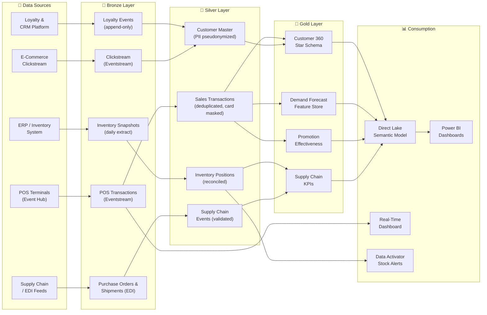

[Home](../index.md) > [Docs](../) > [Industries](./) > Retail & CPG

{ .hero-banner }

# 🛒 Retail & CPG — Demand Forecasting & Customer 360

**End-to-end retail analytics from point-of-sale to supply chain on Microsoft Fabric**

---

**Last Updated:** `2026-05-05` | **Version:** 1.0.0

---

> *"Retailers that act on data in minutes instead of days convert 23% more shoppers and waste 18% less inventory."*

---

## 📑 Table of Contents

- [Scenario Overview](#-scenario-overview)
- [Regulatory Landscape](#-regulatory-landscape)
- [Data Flow Architecture](#-data-flow-architecture)
- [Why Fabric for Retail and CPG](#-why-fabric-for-retail-and-cpg)
- [Getting Started](#-getting-started)
- [References](#-references)

---

## 🎯 Scenario Overview

| Scenario | Fabric Pattern | Latency Target | Key Features |
|----------|---------------|----------------|--------------|
| Point-of-sale streaming analytics | Eventstream → Eventhouse → Real-Time Dashboard | < 5 sec | [RTI](../features/real-time-intelligence.md), [Alerting](../best-practices/alerting-data-activator.md) |
| Demand forecasting | Lakehouse Gold + AutoML time-series model | Daily/Weekly | [AutoML](../features/automl-model-endpoints.md), [Semantic Link](../features/semantic-link.md) |
| Customer 360 | Lakehouse medallion + Direct Lake semantic model | Near-real-time | [Direct Lake](../features/direct-lake.md), [Data Sharing](../best-practices/data-sharing-federation.md) |
| Supply chain visibility | Lakehouse Silver + Warehouse star schema | Hourly | [Warehouse Setup](../best-practices/08_WAREHOUSE_SETUP.md), [Mirroring](../features/mirroring.md) |
| Promotion effectiveness analysis | Gold aggregation + Direct Lake | Daily | [Medallion Architecture](../best-practices/medallion-architecture-deep-dive.md), [Power BI](../best-practices/power-bi-best-practices.md) |
| Shrinkage and loss prevention | Eventstream from loss-prevention sensors → Eventhouse | < 10 sec | [RTI](../features/real-time-intelligence.md), [Data Activator](../best-practices/alerting-data-activator.md) |

---

## 📋 Regulatory Landscape

| Framework | Applicability | Fabric Controls |
|-----------|--------------|-----------------|
| **PCI-DSS** | Card payment data from POS terminals | [OneLake Security](../features/onelake-security.md) column-level masking, [CMK](../best-practices/customer-managed-keys.md), [Network Security](../best-practices/network-security.md) |
| **GDPR** | EU customer loyalty and purchase data | [GDPR Right to Deletion](../best-practices/security/gdpr-right-to-deletion.md), sensitivity labels via [Data Governance](../best-practices/data-governance-deep-dive.md) |
| **CCPA / CPRA** | California consumer purchase and loyalty data | [CCPA Privacy Rights](../best-practices/security/ccpa-privacy-rights.md), data subject access request workflows |
| **FDA 21 CFR Part 117** (CPG) | Food safety traceability for CPG manufacturers | Delta Lake time-travel for lot/batch traceability, [Audit Trail](../best-practices/security/audit-trail-immutability.md) |
| **FTC Act Section 5** | Consumer protection in marketing analytics | [RBAC](../best-practices/identity-rbac-patterns.md) for marketing data access controls |

---

## 🏗️ Data Flow Architecture

---

## 💡 Why Fabric for Retail and CPG

**POS streaming and batch analytics on one platform.** Point-of-sale events flow through Eventstreams for real-time dashboards while the same data lands in Lakehouse Bronze for daily aggregation — no duplicate pipelines, no data reconciliation issues.

**Demand forecasting without a separate ML platform.** AutoML model endpoints train time-series forecasting models directly on Gold-layer sales data, producing daily or weekly demand predictions that feed inventory planning dashboards via Direct Lake.

**Customer 360 without a CDP.** By unifying POS, loyalty, e-commerce, and CRM data in the Lakehouse medallion pattern, retailers build a governed Customer 360 without purchasing a separate customer data platform. Sensitivity labels and pseudonymization protect PII.

**Supply chain visibility across partners.** Fabric's data sharing and Mirroring capabilities let retailers share filtered views of inventory and shipment data with CPG suppliers — enabling collaborative planning without raw data exposure.

**Sub-second dashboards for store operations.** Direct Lake semantic models give district and store managers Power BI dashboards that perform at import-mode speed while reading live from OneLake, eliminating overnight refresh windows.

---

## 🚀 Getting Started

1. **Build the medallion Lakehouse** — Follow [Medallion Deep Dive](../best-practices/medallion-architecture-deep-dive.md) to set up Bronze/Silver/Gold layers for POS and inventory data.
2. **Stream POS transactions** — Configure [Eventstreams](../features/real-time-intelligence.md) to ingest POS events from Event Hub for real-time sales dashboards.
3. **Apply PCI and privacy controls** — Enable [OneLake Security](../features/onelake-security.md) CLS for card masking and configure [GDPR deletion](../best-practices/security/gdpr-right-to-deletion.md) workflows for loyalty data.
4. **Build Customer 360** — Create a Gold-layer star schema joining POS, loyalty, and clickstream data, then connect [Direct Lake](../features/direct-lake.md) for unified customer analytics.
5. **Deploy demand forecasting** — Use [AutoML](../features/automl-model-endpoints.md) to train a time-series model on sales history and publish predictions to the Gold layer.
6. **Enable supply chain sharing** — Use [Data Sharing](../best-practices/data-sharing-federation.md) to provide filtered inventory views to CPG partners.

---

## 📚 References

| Resource | Link |
|----------|------|
| Real-Time Intelligence | [RTI Guide](../features/real-time-intelligence.md) |
| Direct Lake connectivity | [Direct Lake Guide](../features/direct-lake.md) |
| Mirroring | [Mirroring Guide](../features/mirroring.md) |
| AutoML Model Endpoints | [AutoML Guide](../features/automl-model-endpoints.md) |
| Data Sharing & Federation | [Sharing Guide](../best-practices/data-sharing-federation.md) |
| Power BI Best Practices | [Power BI Guide](../best-practices/power-bi-best-practices.md) |
| Medallion Architecture | [Medallion Deep Dive](../best-practices/medallion-architecture-deep-dive.md) |
| Data Governance | [Governance Deep Dive](../best-practices/data-governance-deep-dive.md) |
