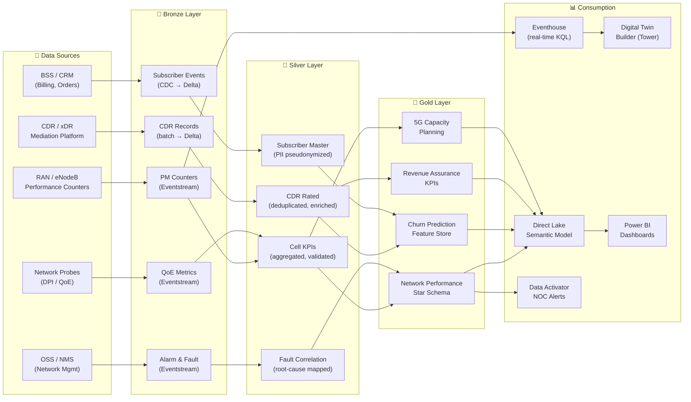

# 📡 Telecommunications — Network Performance & Churn Prediction

**CDR analytics, 5G capacity planning, and subscriber intelligence on Microsoft Fabric**

---

**Last Updated:** `2026-05-05` | **Version:** 1.0.0

---

> *"Telecom operators sit on petabytes of network and subscriber data — the ones that analyze it in real time will win on experience, not just coverage."*

---

## 🎯 Scenario Overview

| Scenario | Fabric Pattern | Latency Target | Key Features |
|----------|---------------|----------------|--------------|
| Network performance monitoring | Eventstream → Eventhouse KQL + Real-Time Dashboard | < 5 sec | [RTI](../features/real-time-intelligence.md), [Alerting](../best-practices/alerting-data-activator.md) |
| Churn prediction | Gold feature store + AutoML classification | Daily scoring | [AutoML](../features/automl-model-endpoints.md), [Semantic Link](../features/semantic-link.md) |
| CDR analytics (billing, fraud) | Lakehouse medallion + Warehouse aggregation | Hourly | [Medallion Architecture](../best-practices/medallion-architecture-deep-dive.md), [Warehouse Setup](../best-practices/08_WAREHOUSE_SETUP.md) |
| 5G capacity planning | Lakehouse Gold + AutoML time-series forecasting | Daily | [AutoML](../features/automl-model-endpoints.md), [Maps in Fabric](../features/maps-in-fabric.md) |
| Customer 360 for telco | Lakehouse Gold + Direct Lake semantic model | Near-real-time | [Direct Lake](../features/direct-lake.md), [Data Sharing](../best-practices/data-sharing-federation.md) |
| Cell tower digital twin | Digital Twin Builder with RAN telemetry | < 10 sec | [Digital Twin Builder](../features/digital-twin-builder.md), [RTI](../features/real-time-intelligence.md) |

---

## 📋 Regulatory Landscape

| Framework | Applicability | Fabric Controls |
|-----------|--------------|-----------------|
| **GDPR / ePrivacy Directive** | Subscriber PII and location data in EU markets | [GDPR Right to Deletion](../best-practices/security/gdpr-right-to-deletion.md), [Data Governance](../best-practices/data-governance-deep-dive.md) sensitivity labels |
| **CCPA / CPRA** | California subscriber data | [CCPA Privacy Rights](../best-practices/security/ccpa-privacy-rights.md), data subject access request workflows |
| **CALEA** (Communications Assistance for Law Enforcement Act) | Lawful intercept data segregation | [RBAC](../best-practices/identity-rbac-patterns.md) strict role separation, [OneLake Security](../features/onelake-security.md) |
| **FCC Open Internet / Net Neutrality** | Traffic management transparency | [SQL Audit Logs](../best-practices/sql-audit-logs-compliance.md) for traffic analytics access, [Monitoring](../best-practices/monitoring-observability.md) |
| **PCI-DSS** | Subscriber billing and payment card data | [OneLake Security](../features/onelake-security.md) CLS for card masking, [CMK](../best-practices/customer-managed-keys.md), [Network Security](../best-practices/network-security.md) |
| **SOC 2 Type II** | Third-party assurance for managed services | [SOC 2 Readiness](../best-practices/security/soc2-type2-readiness.md), [Audit Trail](../best-practices/security/audit-trail-immutability.md) |

---

## 🏗️ Data Flow Architecture

---

## 💡 Why Fabric for Telecommunications

**Petabyte-scale CDR analytics without a Hadoop cluster.** Call detail records are among the largest datasets in any industry. Fabric's Lakehouse with Delta Lake handles billions of CDR rows with V-Order optimization, while Warehouse provides SQL-based aggregation for billing and revenue assurance — all on OneLake.

**Real-time NOC visibility.** RAN performance counters and network alarms flow through Eventstreams into Eventhouse, where KQL dashboards and Data Activator alerts give the Network Operations Center sub-5-second visibility into degradation, handover failures, and capacity exhaustion.

**Churn prediction with built-in ML.** AutoML trains classification models on subscriber behavior, CDR patterns, and network experience features, scoring daily and feeding retention campaigns through the same Direct Lake dashboards that marketing uses.

**5G capacity planning with geospatial context.** Gold-layer traffic forecasts combined with Maps in Fabric let RF engineers visualize demand hotspots and plan small-cell deployments — no external GIS tooling required.

**Cell tower digital twins.** Digital Twin Builder models tower sites with live RAN telemetry binding, enabling operators to monitor antenna tilt, power levels, and throughput per sector in a unified Eventhouse experience.

**Subscriber privacy by design.** Pseudonymized subscriber identifiers in the Silver layer, RBAC-controlled access, and GDPR deletion workflows ensure compliance with ePrivacy and CCPA requirements without sacrificing analytical depth.

---

## 🚀 Getting Started

1. **Ingest network telemetry** — Configure [Eventstreams](../features/real-time-intelligence.md) to pull RAN counters and alarm feeds into Eventhouse for real-time NOC dashboards.
2. **Build the medallion Lakehouse** — Follow [Medallion Deep Dive](../best-practices/medallion-architecture-deep-dive.md) for CDR, subscriber, and network data.
3. **Apply privacy controls** — Enable [OneLake Security](../features/onelake-security.md) CLS for PII, configure [GDPR deletion](../best-practices/security/gdpr-right-to-deletion.md) workflows, and set up [RBAC](../best-practices/identity-rbac-patterns.md) for CALEA data segregation.
4. **Build churn prediction** — Create Gold-layer feature tables and train classification models via [AutoML](../features/automl-model-endpoints.md).
5. **Model cell towers** — Use [Digital Twin Builder](../features/digital-twin-builder.md) to create tower entities with live RAN telemetry binding.
6. **Create NOC and executive dashboards** — Connect [Direct Lake](../features/direct-lake.md) semantic models to Power BI for network performance, revenue assurance, and capacity planning reports.

---

## 📚 References

| Resource | Link |
|----------|------|
| Real-Time Intelligence | [RTI Guide](../features/real-time-intelligence.md) |
| Digital Twin Builder | [DTB Guide](../features/digital-twin-builder.md) |
| Direct Lake connectivity | [Direct Lake Guide](../features/direct-lake.md) |
| AutoML Model Endpoints | [AutoML Guide](../features/automl-model-endpoints.md) |
| Maps in Fabric | [Maps Guide](../features/maps-in-fabric.md) |
| Data Governance | [Governance Deep Dive](../best-practices/data-governance-deep-dive.md) |
| Network Security | [Network Security](../best-practices/network-security.md) |
| SOC 2 Readiness | [SOC 2 Guide](../best-practices/security/soc2-type2-readiness.md) |
