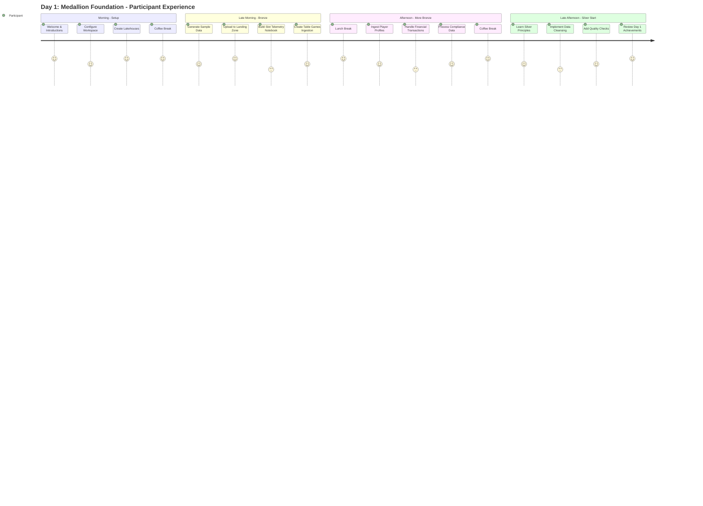

[Home](../index.md) > [POC Agenda](./) > Day 1: Medallion Foundation

# 📅 Day 1: Medallion Foundation

> **Last Updated**: 2026-04-15 | **Version**: 2.0
> **Status**: ✅ Final | **Maintainer**: Documentation Team

<div align="center" markdown>


</div>

---

> 🏠 Home > 📆 POC Agenda > 🏗️ Day 1

---

**Date:** `[INSERT DATE]`
**Duration:** 8 hours (9:00 AM - 5:00 PM)
**Focus:** Environment setup and Bronze layer implementation
**Audience:** Data Architects (4 participants)

---

## 📊 Day 1 Progress Tracker

```
Day 1 Progress: ░░░░░░░░░░ 0% Complete
────────────────────────────────────────────
🌅 Morning Session 1:   ░░░░░░░░░░  Environment Setup
🌅 Morning Session 2:   ░░░░░░░░░░  Bronze Layer Part 1
☀️ Afternoon Session 3: ░░░░░░░░░░  Bronze Layer Part 2
☀️ Afternoon Session 4: ░░░░░░░░░░  Silver Layer Start
```

---

## 📋 Materials Checklist

Before starting, ensure the following are ready:

### Environment
- [ ] Azure account with Fabric access confirmed
- [ ] F64 capacity available
- [ ] All participants have workspace access

### Data & Code
- [ ] Sample data generated and staged
- [ ] Notebooks ready for distribution
- [ ] Data generation scripts tested

### Logistics
- [ ] Projector/display working
- [ ] All participants present
- [ ] WiFi credentials shared

---

## 🗓️ Daily Schedule At-a-Glance

| Time | Duration | Session | Type |
|:----:|:--------:|---------|:----:|
| 9:00-10:30 | 1.5 hr | 🌅 Environment Setup | 👥 Hands-on |
| 10:30-10:45 | 15 min | ☕ Break | - |
| 10:45-12:30 | 1.75 hr | 🌅 Bronze Layer Part 1 | 👥 Hands-on |
| 12:30-13:30 | 1 hr | 🍽️ Lunch | - |
| 13:30-15:00 | 1.5 hr | ☀️ Bronze Layer Part 2 | 👥 Hands-on |
| 15:00-15:15 | 15 min | ☕ Break | - |
| 15:15-16:45 | 1.5 hr | ☀️ Silver Layer Start | 👥 Hands-on |
| 16:45-17:00 | 15 min | 💬 Day 1 Wrap-up | Discussion |

---

### Day 1 Participant Journey



**Color Key:**
- 😄 5 = Excellent experience
- 🙂 4 = Good experience  
- 😐 3 = Challenging but achievable

---

## 🌅 Morning Session 1: Environment Setup (9:00 - 10:30)

### 🎯 Session Objectives

| Objective | Duration | Status |
|-----------|:--------:|:------:|
| Create Fabric workspace with proper capacity settings | 30 min | ⬜ |
| Configure Lakehouse architecture for Bronze/Silver/Gold layers | 30 min | ⬜ |
| Generate and stage sample casino data | 30 min | ⬜ |

---

### 📝 Activity 1.1: Workspace Configuration (30 min)

<table>
<tr>
<td width="60%">

**Steps:**

```
1. Navigate to app.fabric.microsoft.com
2. Create workspace: casino-fabric-poc
3. Configure capacity: F64
4. Enable workspace features:
   - Lakehouse
   - Data Engineering
   - Data Science
   - Real-Time Intelligence
```

</td>
<td width="40%">

**Validation Checkpoint:**

- [ ] Workspace created and accessible
- [ ] F64 capacity assigned
- [ ] All workload types available

</td>
</tr>
</table>

---

### 📝 Activity 1.2: Lakehouse Creation (30 min)

Create three Lakehouses for medallion architecture:


*Source: [Microsoft Fabric Lakehouse Overview](https://learn.microsoft.com/en-us/fabric/data-engineering/lakehouse-overview)*

| Lakehouse | Purpose | Schema | Status |
|-----------|---------|--------|:------:|
| `lh_bronze` | Raw data ingestion | Append-only, schema-on-read | ⬜ |
| `lh_silver` | Cleansed/validated | Schema enforced, partitioned | ⬜ |
| `lh_gold` | Business-ready | Star schema, optimized | ⬜ |

**Steps:**

1. In workspace, click **+ New** > **Lakehouse**
2. Create `lh_bronze` first
3. Repeat for `lh_silver` and `lh_gold`
4. Verify SQL endpoints are created

---

### 📝 Activity 1.3: Generate Sample Data (30 min)

Use the data generators to create realistic casino data:

```bash
# Navigate to data_generation folder
cd data_generation

# Install dependencies
pip install -r requirements.txt

# Generate 30 days of slot machine data (500K records)
python generate.py slot_machine --records 500000 --days 30 --output ../sample-data/

# Generate player profiles (10K records)
python generate.py player --records 10000 --output ../sample-data/

# Generate compliance data with CTR/SAR patterns
python generate.py compliance --records 5000 --days 30 --output ../sample-data/
```

**Data Files Created:**

| File | Description | Status |
|------|-------------|:------:|
| `slot_telemetry_YYYYMMDD.parquet` | Slot machine events | ⬜ |
| `player_profiles.parquet` | Player demographics | ⬜ |
| `table_games_YYYYMMDD.parquet` | Table game data | ⬜ |
| `financial_transactions_YYYYMMDD.parquet` | Cage operations | ⬜ |
| `compliance_events.parquet` | Regulatory filings | ⬜ |

---

## 🌅 Morning Session 2: Bronze Layer Part 1 (10:45 - 12:30)

### 🎯 Session Objectives

| Objective | Duration | Status |
|-----------|:--------:|:------:|
| Understand Bronze layer principles | 15 min | ⬜ |
| Upload sample data to landing zone | 15 min | ⬜ |
| Implement slot telemetry ingestion | 45 min | ⬜ |
| Implement table games ingestion | 45 min | ⬜ |

---

### 📝 Activity 2.1: Bronze Layer Principles (15 min)

> 💡 **Key Concepts**

The Bronze layer is the foundation of the Medallion architecture, serving as the raw data landing zone.


*Source: [Microsoft Fabric Lakehouse Overview](https://learn.microsoft.com/en-us/fabric/data-engineering/lakehouse-overview)*

```
Bronze Layer Rules:
├── Store data exactly as received (raw)
├── Append-only (no updates/deletes)
├── Preserve source metadata
├── Add ingestion timestamp
└── Minimal transformation (only structural)
```

**Table Naming Convention:**
- Pattern: `bronze_{source}_{entity}`
- Example: `bronze_sas_slot_telemetry`

---

### 📝 Activity 2.2: Upload Sample Data (15 min)

1. Open `lh_bronze` Lakehouse
2. Click **Get data** > **Upload files**
3. Navigate to `sample-data/` folder
4. Upload all generated Parquet files to `Files/landing/`

**Target Folder Structure:**

```
lh_bronze/
├── Files/
│   └── landing/
│       ├── slot_telemetry/
│       ├── player_profiles/
│       ├── table_games/
│       ├── financial/
│       └── compliance/
└── Tables/
```

---

### 📝 Activity 2.3: Bronze Notebook - Slot Telemetry (45 min)

Create notebook `01_bronze_slot_telemetry`:

```python
# Cell 1: Configuration
from pyspark.sql.functions import *
from pyspark.sql.types import *
from datetime import datetime

# Batch tracking
batch_id = datetime.now().strftime("%Y%m%d_%H%M%S")
source_path = "Files/landing/slot_telemetry/"

# Cell 2: Read raw data
df_raw = spark.read.parquet(f"abfss://{source_path}")

print(f"Records loaded: {df_raw.count()}")
print(f"Columns: {df_raw.columns}")

# Cell 3: Add Bronze metadata
df_bronze = df_raw \
    .withColumn("_ingestion_timestamp", current_timestamp()) \
    .withColumn("_batch_id", lit(batch_id)) \
    .withColumn("_source_file", input_file_name())

# Cell 4: Write to Bronze table
df_bronze.write \
    .format("delta") \
    .mode("append") \
    .option("mergeSchema", "true") \
    .saveAsTable("bronze_slot_telemetry")

# Cell 5: Validate
spark.sql("SELECT COUNT(*) as total FROM bronze_slot_telemetry").show()
```

---

### 📝 Activity 2.4: Bronze Notebook - Table Games (45 min)

Create notebook `02_bronze_table_games`:

```python
# Similar pattern for table games data
# Focus on RFID tracking and dealer transactions

df_raw = spark.read.parquet("Files/landing/table_games/")

df_bronze = df_raw \
    .withColumn("_ingestion_timestamp", current_timestamp()) \
    .withColumn("_batch_id", lit(batch_id)) \
    .withColumn("_source_file", input_file_name())

df_bronze.write \
    .format("delta") \
    .mode("append") \
    .saveAsTable("bronze_table_games")
```

> 👥 **Hands-On Exercise (30 min):**
> Participants implement table games notebook independently, then review together.

---

## ☀️ Afternoon Session 3: Bronze Layer Part 2 (13:30 - 15:00)

### 🎯 Session Objectives

| Objective | Duration | Status |
|-----------|:--------:|:------:|
| Implement player profile ingestion | 30 min | ⬜ |
| Implement financial transaction ingestion | 30 min | ⬜ |
| Implement compliance data ingestion | 30 min | ⬜ |

---

### 📝 Activity 3.1: Player Profile Ingestion (30 min)

Create notebook `03_bronze_player_profile`:

```python
# Player data with PII considerations
df_players = spark.read.parquet("Files/landing/player_profiles/")

# Hash SSN immediately at Bronze layer (compliance)
df_bronze = df_players \
    .withColumn("ssn_hash", sha2(col("ssn"), 256)) \
    .drop("ssn") \
    .withColumn("_ingestion_timestamp", current_timestamp()) \
    .withColumn("_batch_id", lit(batch_id))

df_bronze.write \
    .format("delta") \
    .mode("overwrite")  # Full refresh for dimension
    .saveAsTable("bronze_player_profile")
```

> ⚠️ **Important:** SSN is hashed at ingestion for compliance. Original values are never stored.

---

### 📝 Activity 3.2: Financial Transaction Ingestion (30 min)

Create notebook `04_bronze_financial_txn`:

```python
# Cage operations and financial transactions
df_financial = spark.read.parquet("Files/landing/financial/")

# Add CTR flag for amounts >= $10,000
df_bronze = df_financial \
    .withColumn("ctr_required", col("amount") >= 10000) \
    .withColumn("_ingestion_timestamp", current_timestamp()) \
    .withColumn("_batch_id", lit(batch_id))

df_bronze.write \
    .format("delta") \
    .mode("append") \
    .partitionBy("transaction_date") \
    .saveAsTable("bronze_financial_txn")
```

> 💰 **CTR Threshold:** $10,000 triggers Currency Transaction Report requirements

---

### 📝 Activity 3.3: Compliance Data Ingestion (30 min)

Create notebook `05_bronze_compliance`:

```python
# CTR, SAR, W-2G filings
df_compliance = spark.read.parquet("Files/landing/compliance/")

df_bronze = df_compliance \
    .withColumn("_ingestion_timestamp", current_timestamp()) \
    .withColumn("_batch_id", lit(batch_id)) \
    .withColumn("_regulatory_category",
        when(col("filing_type") == "CTR", "FinCEN")
        .when(col("filing_type") == "SAR", "FinCEN")
        .when(col("filing_type") == "W2G", "IRS")
        .otherwise("Other"))

df_bronze.write \
    .format("delta") \
    .mode("append") \
    .saveAsTable("bronze_compliance")
```

---

## ☀️ Afternoon Session 4: Silver Layer Introduction (15:15 - 17:00)

### 🎯 Session Objectives

| Objective | Duration | Status |
|-----------|:--------:|:------:|
| Understand Silver layer principles | 20 min | ⬜ |
| Begin slot data cleansing | 50 min | ⬜ |
| Implement data quality checks | 30 min | ⬜ |

---

### 📝 Activity 4.1: Silver Layer Principles (20 min)

> 💡 **Key Concepts**

```
Silver Layer Rules:
├── Schema enforcement (strongly typed)
├── Data quality validation
├── Deduplication
├── Standardization (dates, codes, formats)
├── Business rule validation
└── Audit trail (track changes)
```

**Transformation Patterns:**

| Pattern | Description |
|---------|-------------|
| NULL handling | Replace with defaults or flag |
| Date standardization | Convert to consistent format |
| Code mapping | Map machine types, zones |
| Outlier flagging | Identify anomalous values |

---

### 📝 Activity 4.2: Silver Notebook - Slot Cleansing (50 min)

Create notebook `01_silver_slot_cleansed`:

```python
# Read from Bronze
df_bronze = spark.table("lh_bronze.bronze_slot_telemetry")

# Define expected schema
schema_silver = StructType([
    StructField("machine_id", StringType(), False),
    StructField("event_type", StringType(), False),
    StructField("event_timestamp", TimestampType(), False),
    StructField("coin_in", DecimalType(18, 2), True),
    StructField("coin_out", DecimalType(18, 2), True),
    StructField("games_played", IntegerType(), True),
    StructField("jackpot_amount", DecimalType(18, 2), True),
    StructField("zone", StringType(), True),
    StructField("denomination", DecimalType(5, 2), True)
])

# Data quality rules
df_cleaned = df_bronze \
    .filter(col("machine_id").isNotNull()) \
    .filter(col("event_timestamp").isNotNull()) \
    .withColumn("coin_in",
        when(col("coin_in") < 0, 0).otherwise(col("coin_in"))) \
    .withColumn("coin_out",
        when(col("coin_out") < 0, 0).otherwise(col("coin_out"))) \
    .dropDuplicates(["machine_id", "event_timestamp", "event_type"])

# Add quality score
df_silver = df_cleaned \
    .withColumn("_dq_score",
        (when(col("coin_in").isNotNull(), 1).otherwise(0) +
         when(col("zone").isNotNull(), 1).otherwise(0) +
         when(col("denomination").isNotNull(), 1).otherwise(0)) / 3 * 100)

# Write to Silver
df_silver.write \
    .format("delta") \
    .mode("overwrite") \
    .partitionBy("event_date") \
    .saveAsTable("lh_silver.silver_slot_cleansed")
```

---

### 📝 Activity 4.3: Data Quality Dashboard (30 min)

Create validation queries:

```sql
-- Quality metrics
SELECT
    COUNT(*) as total_records,
    COUNT(CASE WHEN _dq_score = 100 THEN 1 END) as perfect_quality,
    AVG(_dq_score) as avg_quality_score,
    COUNT(DISTINCT machine_id) as unique_machines
FROM lh_silver.silver_slot_cleansed;

-- Quality by zone
SELECT
    zone,
    COUNT(*) as records,
    AVG(_dq_score) as avg_quality
FROM lh_silver.silver_slot_cleansed
GROUP BY zone
ORDER BY avg_quality DESC;
```

---

## ✅ Day 1 Validation Checklist

### Environment

| Checkpoint | Criteria | Status |
|------------|----------|:------:|
| Workspace | `casino-fabric-poc` created | ⬜ |
| Capacity | F64 assigned | ⬜ |
| Lakehouses | Three created (bronze, silver, gold) | ⬜ |

### Bronze Layer

| Table | Target | Status |
|-------|--------|:------:|
| `bronze_slot_telemetry` | 500K+ records | ⬜ |
| `bronze_table_games` | Populated | ⬜ |
| `bronze_player_profile` | 10K records | ⬜ |
| `bronze_financial_txn` | Populated | ⬜ |
| `bronze_compliance` | Populated | ⬜ |

### Silver Layer (Started)

| Table | Criteria | Status |
|-------|----------|:------:|
| `silver_slot_cleansed` | Cleansed data | ⬜ |
| Data quality scores | Calculated | ⬜ |
| Deduplication | Verified | ⬜ |

---

## 📚 Homework / Preparation for Day 2

### Required Reading

1. **Review Silver Layer Tutorial** (Tutorial 02)

### Exploration Tasks

2. **Explore Data:**
   - Run ad-hoc queries on Bronze tables
   - Identify data quality issues
   - Note any questions about transformation logic

### Background Reading

3. **Read About:**
   - SCD Type 2 patterns for player data
   - Delta Lake MERGE operations
   - Data quality frameworks (Great Expectations)

---

## 📘 Instructor Notes

### Common Issues & Solutions

<table>
<tr>
<th>Issue</th>
<th>Solution</th>
</tr>
<tr>
<td>

**Capacity Not Available**

</td>
<td>

- Verify F64 is assigned to workspace
- Check Azure portal for capacity status

</td>
</tr>
<tr>
<td>

**File Upload Failures**

</td>
<td>

- Check file sizes (< 5GB per file recommended)
- Verify Parquet format is valid

</td>
</tr>
<tr>
<td>

**Notebook Timeouts**

</td>
<td>

- Increase Spark session timeout
- Use smaller data samples for testing

</td>
</tr>
</table>

### Key Discussion Points

- Why Bronze layer should be immutable
- Trade-offs between schema-on-read vs schema-on-write
- PII handling strategies at ingestion
- CTR threshold implications ($10K)

---

## 🔗 Quick Links

| Resource | Link |
|----------|------|
| Tutorial 00 | [Environment Setup](../tutorials/00-environment-setup/README.md) |
| Tutorial 01 | [Bronze Layer](../tutorials/01-bronze-layer/README.md) |
| Tutorial 02 | [Silver Layer](../tutorials/02-silver-layer/README.md) |

---

---

## 📖 Related Documents

| Document | Description |
|:---------|:-----------|
| [POC Overview](./README.md) | 3-day workshop overview |
| [Day 2: Transformations & Real-Time](./day2-transformations-realtime.md) | Next day's session guide |
| [Instructor Guide](./instructor-guide/README.md) | Facilitator notes for Day 1 |
| [Demo Runbook](./DEMO_RUNBOOK.md) | Live demo presenter guide |

---

<div align="center" markdown>

**Day 1 Complete!**

```
Day 1: ██████████ 100% Complete
Overall POC: ███░░░░░░░ 33% Complete
```

---

[⬆️ Back to Top](#-day-1-medallion-foundation) | [📚 POC Agenda](./) | [🏠 Home](../index.md)

</div>
