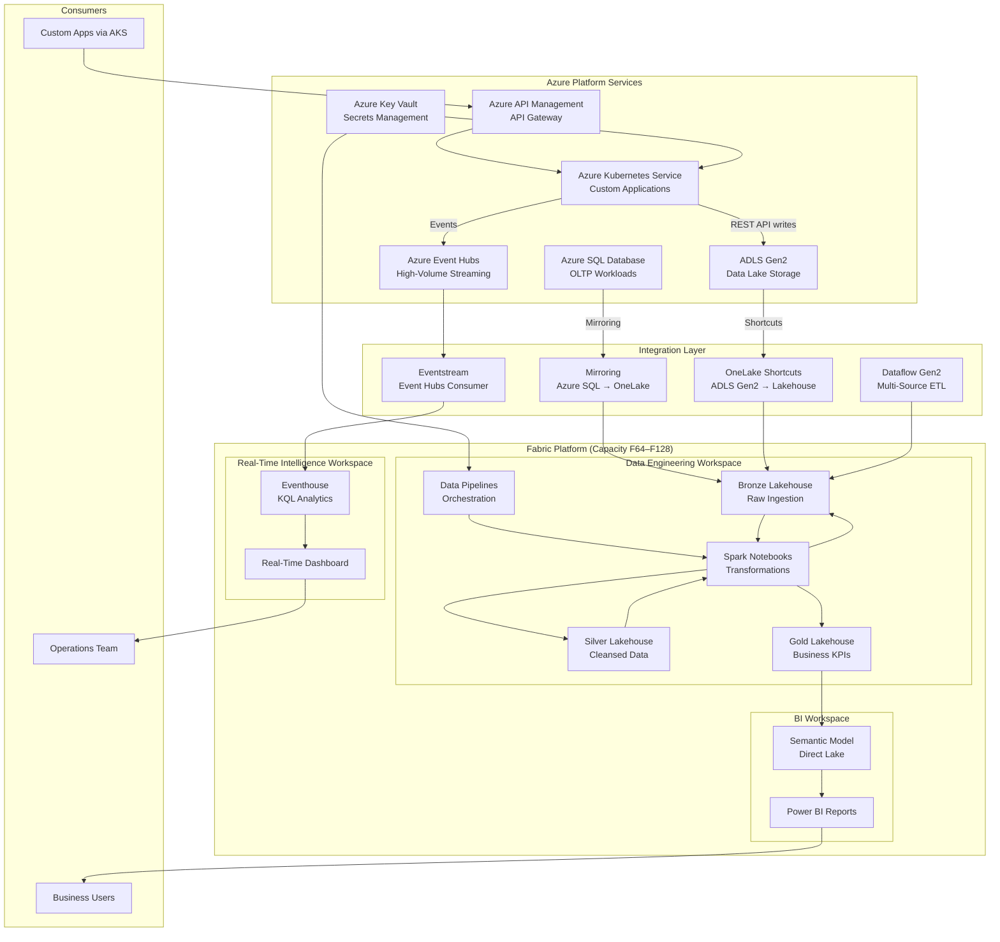

[Home](../index.md) > [Docs](../) > [Reference Architectures](index.md) > Hybrid Cloud

# ☁️ Hybrid Cloud Reference Architecture


<div align="center" markdown>

**Fabric for Analytics + Azure Services for OLTP, Custom Apps, and High-Volume Streaming**


</div>

---

**Last Updated:** `2026-05-05` | **Version:** 1.0.0

---

## 📑 Table of Contents

- [🎯 Architecture Overview](#-architecture-overview)
- [🏗️ Architecture Diagram](#️-architecture-diagram)
- [📦 Component Table](#-component-table)
- [📏 Capacity Sizing Guidance](#-capacity-sizing-guidance)
- [🔒 Network Architecture](#-network-architecture)
- [💰 Cost Estimation Framework](#-cost-estimation-framework)
- [🚀 Deploy This Architecture](#-deploy-this-architecture)
- [⚖️ Tradeoffs and Limitations](#️-tradeoffs-and-limitations)
- [📚 References](#-references)

---

## 🎯 Architecture Overview

This architecture combines Microsoft Fabric's analytics strengths (lakehouse, Direct Lake BI, data engineering) with Azure services that cover what Fabric doesn't natively provide: Azure SQL Database for transactional OLTP workloads, Azure Kubernetes Service for custom applications and microservices, and Azure Event Hubs for high-volume streaming ingestion exceeding Fabric Eventstream limits. Integration between Azure services and Fabric uses three patterns — Mirroring (real-time replication from Azure SQL to OneLake), Shortcuts (zero-copy access to ADLS Gen2 data), and Dataflow Gen2 (ETL from diverse sources into lakehouses). This hybrid approach lets organizations keep workloads on the best-fit platform while maintaining a unified analytics layer in Fabric.

---

## 🏗️ Architecture Diagram



---

## 📦 Component Table

| Component | Service / Fabric Item | Purpose | Sizing Notes |
|:----------|:---------------------|:--------|:-------------|
| **Azure SQL Database** | Azure SQL DB (General Purpose / Business Critical) | OLTP transactional workloads, application backends | vCore-based; size to transaction volume |
| **Azure Kubernetes Service** | AKS | Custom applications, microservices, ML model serving | Node pool sizing based on app requirements |
| **Azure Event Hubs** | Event Hubs (Standard / Premium) | High-volume event ingestion (>1M events/sec) | TU/PU based on peak throughput |
| **ADLS Gen2** | Storage Account | Landing zone for batch data, AKS application output | Hot/Cool tiering based on access patterns |
| **Mirroring** | Fabric Mirroring | Near-real-time replication from Azure SQL to OneLake | Automatic; minimal capacity overhead |
| **OneLake Shortcuts** | Shortcut | Zero-copy access to ADLS Gen2 data from lakehouses | No data movement; reads at query time |
| **Dataflow Gen2** | Dataflow | Low-code ETL from 150+ connectors into lakehouses | CU consumption scales with data volume |
| **Eventstream** | Eventstream | Route Event Hubs data into Eventhouse and lakehouses | Consumer group per destination |
| **Bronze Lakehouse** | Lakehouse | Raw ingestion from all integration patterns | Partitioned by source and date |
| **Silver Lakehouse** | Lakehouse | Cleansed, joined, schema-enforced data | Combines OLTP + streaming + batch |
| **Gold Lakehouse** | Lakehouse | Business aggregations and KPIs | Optimized for Direct Lake queries |
| **Eventhouse** | Eventhouse | KQL-based analytics on streaming data | Auto-scales within capacity |
| **Semantic Model** | Semantic Model | Direct Lake model for Power BI | One per Gold lakehouse |
| **Power BI Reports** | Report | Interactive dashboards for business users | Render CUs shared with compute |
| **API Management** | APIM | Unified API gateway for AKS microservices | Consumption or Standard tier |
| **Key Vault** | Key Vault | Secrets and connection strings for all services | One vault per environment |

---

## 📏 Capacity Sizing Guidance

### Fabric Capacity

| Workload Profile | Data Volume | Concurrent Users | Recommended SKU | Monthly Cost (est.) |
|:-----------------|:------------|:-----------------|:-----------------|:-------------------|
| Light analytics + BI only | < 2 TB | 10–20 | **F32** | $2,100 |
| Moderate analytics + streaming | 2–10 TB | 20–40 | **F64** | $4,200 |
| Heavy multi-source analytics | 10–50 TB | 40–100 | **F128** | $8,400 |

### Azure Services (Complementary)

| Service | Sizing Guidance | Monthly Cost (est.) |
|:--------|:----------------|:-------------------|
| Azure SQL DB (GP, 8 vCores) | Size to OLTP transaction volume | $1,200–$2,400 |
| AKS (3-node Standard_D4s_v5) | Size to application workload | $400–$1,200 |
| Event Hubs (Standard, 10 TU) | Size to peak event throughput | $700–$1,500 |
| ADLS Gen2 (10 TB hot) | Size to landing zone volume | $210 |
| API Management (Standard) | Size to API call volume | $700 |
| Key Vault | Minimal | $5 |

---

## 🔒 Network Architecture

Hybrid deployments require unified networking across Azure services and Fabric:

| Layer | Implementation | Notes |
|:------|:---------------|:------|
| **Virtual Network** | Hub-spoke VNet topology | Central hub with peered spokes per service |
| **Fabric Private Endpoint** | Private Link to Fabric capacity | Eliminates public Fabric access |
| **Azure SQL Private Endpoint** | Private Link to SQL Database | Required for Mirroring over private network |
| **AKS VNet Integration** | AKS deployed into spoke VNet | Pod-level network policies |
| **Event Hubs Private Endpoint** | Private Link for event ingestion | Producers and consumers use private IPs |
| **ADLS Firewall** | VNet-restricted access + Private Endpoint | Shortcuts use Fabric managed identity |
| **VNet Data Gateway** | For on-premises source connectivity | Replaces SHIR for Fabric workloads |
| **Managed VNet** | Enabled for Fabric Spark workloads | Outbound control via approved endpoints |
| **DNS** | Azure Private DNS Zones | Centralized resolution for all private endpoints |

```
┌─────────────────────────────────────────────┐
│                Hub VNet                      │
│  ┌──────────┐  ┌──────────┐  ┌───────────┐ │
│  │ Firewall │  │ DNS Zone │  │ VNet GW   │ │
│  └──────────┘  └──────────┘  └───────────┘ │
└────────┬──────────┬──────────────┬──────────┘
         │          │              │
   ┌─────┴───┐ ┌───┴────┐  ┌─────┴──────┐
   │AKS Spoke│ │SQL Spoke│  │Fabric Spoke│
   │  + EH   │ │  + KV   │  │   + ADLS   │
   └─────────┘ └────────┘  └────────────┘
```

---

## 💰 Cost Estimation Framework

| Cost Component | Estimation Method | Typical Range |
|:---------------|:------------------|:-------------|
| **Fabric Capacity** | SKU × hours running | $2,100–$8,400/mo |
| **OneLake Storage** | $0.023/GB/month | $50–$500/mo |
| **Azure SQL Database** | vCore pricing | $1,200–$4,800/mo |
| **AKS** | Node pools × VM pricing | $400–$3,000/mo |
| **Event Hubs** | Throughput units × hours | $700–$2,000/mo |
| **ADLS Gen2** | Storage + transactions | $100–$500/mo |
| **Private Endpoints** | ~$7.30/endpoint/mo + processing | $50–$150/mo |
| **API Management** | Tier-based | $0–$700/mo |
| **Total Estimate** | | **$5,000–$20,000/mo** |

**Cost optimization strategies:**

1. **Mirroring over ETL** — Eliminates pipeline CU cost for SQL-to-Fabric data movement
2. **Shortcuts over copy** — Zero-copy reads from ADLS avoid data duplication costs
3. **Event Hubs auto-inflate** — Scale throughput units dynamically with demand
4. **AKS spot nodes** — Use spot instances for non-critical batch processing (save 60–90%)
5. **Reserved instances** — Apply to SQL DB and AKS for predictable workloads (save 30–40%)
6. **Pause Fabric capacity** — During hours when only Azure services are active

---

## 🚀 Deploy This Architecture

### Infrastructure as Code

| Resource | Bicep Module | Description |
|:---------|:-------------|:------------|
| Fabric Capacity | [`infra/modules/fabric/fabric-capacity.bicep`](https://github.com/fgarofalo56/Suppercharge_Microsoft_Fabric/blob/main/infra/modules/fabric/fabric-capacity.bicep) | Analytics capacity |
| Eventhouse | [`infra/modules/fabric/fabric-eventhouse.bicep`](https://github.com/fgarofalo56/Suppercharge_Microsoft_Fabric/blob/main/infra/modules/fabric/fabric-eventhouse.bicep) | Real-time analytics engine |
| Eventstream | [`infra/modules/fabric/fabric-eventstream.bicep`](https://github.com/fgarofalo56/Suppercharge_Microsoft_Fabric/blob/main/infra/modules/fabric/fabric-eventstream.bicep) | Event routing |
| Storage Account | [`infra/modules/storage/storage-account.bicep`](https://github.com/fgarofalo56/Suppercharge_Microsoft_Fabric/blob/main/infra/modules/storage/storage-account.bicep) | ADLS Gen2 landing zone |
| VNet | [`infra/modules/networking/vnet.bicep`](https://github.com/fgarofalo56/Suppercharge_Microsoft_Fabric/blob/main/infra/modules/networking/vnet.bicep) | Hub-spoke network |
| Private Endpoints | [`infra/modules/networking/private-endpoint.bicep`](https://github.com/fgarofalo56/Suppercharge_Microsoft_Fabric/blob/main/infra/modules/networking/private-endpoint.bicep) | Private Link for all services |
| Security / Workspace Identity | [`infra/modules/security/workspace-identity.bicep`](https://github.com/fgarofalo56/Suppercharge_Microsoft_Fabric/blob/main/infra/modules/security/workspace-identity.bicep) | Managed identity for cross-service auth |
| Alerts & Budgets | [`infra/modules/monitoring/alerts-and-budgets.bicep`](https://github.com/fgarofalo56/Suppercharge_Microsoft_Fabric/blob/main/infra/modules/monitoring/alerts-and-budgets.bicep) | Cost and performance alerts |

### Step-by-Step Tutorials

| Step | Tutorial | What You'll Build |
|:-----|:---------|:-----------------|
| 1 | [Environment Setup](../tutorials/00-environment-setup/README.md) | Provision Fabric + Azure services |
| 2 | [Bronze Layer](../tutorials/01-bronze-layer/README.md) | Ingest via Mirroring + Shortcuts + Dataflow |
| 3 | [Database Mirroring](../tutorials/08-database-mirroring/README.md) | Set up Azure SQL → OneLake mirroring |
| 4 | [Real-Time Analytics](../tutorials/04-real-time-analytics/README.md) | Event Hubs → Eventstream → Eventhouse |
| 5 | [Multi-Source Streaming](../tutorials/26-multi-source-streaming/README.md) | Multiple streaming sources into Fabric |
| 6 | [Direct Lake Power BI](../tutorials/05-direct-lake-powerbi/README.md) | Unified BI over hybrid data |
| 7 | [Security & Networking](../tutorials/14-security-networking/README.md) | Private endpoints and VNet setup |
| 8 | [SHIR & Data Gateways](../tutorials/23-shir-data-gateways/README.md) | On-premises connectivity |
| 9 | [Networking Connectivity](../tutorials/22-networking-connectivity/README.md) | Hub-spoke network architecture |

### Key Feature Documentation

| Feature | Documentation |
|:--------|:-------------|
| Mirroring | [Mirroring Feature Doc](../features/mirroring.md) |
| OneLake Shortcuts | [Shortcuts to S3, GCS, Dataverse](../features/onelake-shortcuts-s3-gcs-dataverse.md) |
| Dataflow Gen2 | [Dataflow Gen2 Feature Doc](../features/dataflow-gen2.md) |
| Iceberg Interoperability | [Iceberg Interop](../features/onelake-iceberg-interop.md) |
| VNet Data Gateway | [VNet Data Gateway](../features/vnet-data-gateway.md) |

---

## ⚖️ Tradeoffs and Limitations

| Tradeoff | Impact | Mitigation |
|:---------|:-------|:-----------|
| **Operational complexity** | Managing Azure services + Fabric requires broader skill set | Standardize with IaC; use managed services where possible |
| **Mirroring latency** | Near-real-time (~seconds) but not sub-second for OLTP changes | Acceptable for analytics; use Event Hubs for true real-time needs |
| **Shortcut read performance** | Reads from ADLS may be slower than native OneLake tables | Use shortcuts for cold/reference data; copy hot data into lakehouses |
| **Cost tracking complexity** | Costs spread across Fabric + multiple Azure services | Use Azure Cost Management with resource group tagging |
| **Network complexity** | Private endpoints per service increase DNS and routing complexity | Use centralized Azure Private DNS Zones and hub-spoke topology |
| **Vendor lock-in balance** | More Azure services = deeper Azure dependency | Shortcuts and Iceberg format provide some portability |
| **Event Hubs vs Eventstream** | Two streaming platforms to manage | Use Event Hubs for ingestion at scale; Eventstream for Fabric routing |

---

## 📚 References

| Resource | Link |
|:---------|:-----|
| Mirroring Feature Doc | [Mirroring](../features/mirroring.md) |
| OneLake Shortcuts | [Shortcuts](../features/onelake-shortcuts-s3-gcs-dataverse.md) |
| Dataflow Gen2 | [Dataflow Gen2](../features/dataflow-gen2.md) |
| Iceberg Interoperability | [Iceberg](../features/onelake-iceberg-interop.md) |
| Network Security | [Network Security](../best-practices/network-security.md) |
| Capacity Planning | [Capacity Planning](../best-practices/capacity-planning-cost-optimization.md) |
| VNet Data Gateway | [VNet Data Gateway](../features/vnet-data-gateway.md) |
| Microsoft Fabric Documentation | [learn.microsoft.com/fabric](https://learn.microsoft.com/en-us/fabric/) |
