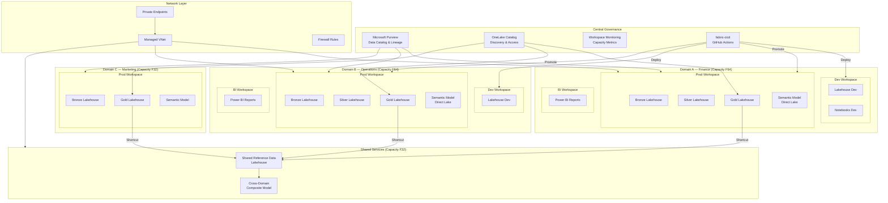

# 🏛️ Large Enterprise Multi-Domain Reference Architecture

**Data Mesh, Multi-Capacity, Purview Governance, CI/CD Pipelines**

---

**Last Updated:** `2026-05-05` | **Version:** 1.0.0

---

## 🎯 Architecture Overview

This architecture serves large organizations (50+ data practitioners) with multiple business domains that each own their data products. It follows Data Mesh principles: each domain (e.g., Finance, Operations, Marketing) gets its own Fabric capacity and set of workspaces with autonomous data engineering teams, while a central governance hub powered by Microsoft Purview enforces data quality, lineage, and compliance policies across all domains. CI/CD is automated through fabric-cicd, promoting Fabric items across Dev → Test → Prod stages via GitHub Actions. Network isolation through private endpoints and managed VNets ensures enterprise-grade security.

---

## 🏗️ Architecture Diagram

---

## 📦 Component Table

| Component | Fabric Item | Purpose | Sizing Notes |
|:----------|:------------|:--------|:-------------|
| **Domain Capacity** | Fabric Capacity (F32–F128) | Isolated compute per business domain | Size based on domain's data volume and user count |
| **Dev Workspace** | Workspace | Development and testing per domain | Runs on shared dev capacity or domain capacity |
| **Prod Workspace** | Workspace | Production data assets per domain | Runs on domain's dedicated capacity |
| **BI Workspace** | Workspace | Power BI reports and dashboards per domain | Separates BI consumers from data engineering |
| **Medallion Lakehouses** | Lakehouse (×3) | Bronze/Silver/Gold per domain | Each domain owns its medallion pipeline |
| **Semantic Model** | Semantic Model | Direct Lake model per Gold lakehouse | Domain-specific business metrics |
| **Shared Reference Data** | Lakehouse | Cross-domain reference tables (customers, products, geography) | Exposed via OneLake shortcuts |
| **Composite Model** | Semantic Model | Cross-domain analytics combining multiple Gold lakehouses | Uses DirectQuery to domain semantic models |
| **Microsoft Purview** | External Service | Central data catalog, lineage, sensitivity labels, glossary | Scans all domain lakehouses |
| **OneLake Catalog** | Catalog | Self-service data discovery across domains | Endorsement and certification workflow |
| **fabric-cicd** | GitHub Actions | Automated deployment of Fabric items across stages | One pipeline per domain |
| **Workspace Monitoring** | Monitoring | CU utilization, job history, throttling alerts per capacity | Central dashboard for platform team |
| **Private Endpoints** | Network | Private connectivity to Fabric capacity | One per capacity |
| **Managed VNet** | Network | Outbound control for Spark workloads | Blocks unauthorized egress |

---

## 📏 Capacity Sizing Guidance

### Per-Domain Capacity

| Domain Profile | Data Volume | Users | Recommended SKU | Monthly Cost (est.) |
|:---------------|:------------|:------|:-----------------|:-------------------|
| Small domain (Marketing, HR) | < 1 TB | 5–10 | **F16–F32** | $1,050–$2,100 |
| Medium domain (Finance, Sales) | 1–10 TB | 10–30 | **F64** | $4,200 |
| Large domain (Operations, IoT) | 10–50 TB | 20–50 | **F128–F256** | $8,400–$16,800 |
| Shared services | < 2 TB | Platform team | **F32** | $2,100 |

### Total Capacity Planning Example (4 Domains)

| Component | SKU | Monthly Cost |
|:----------|:----|:-------------|
| Finance (F64) | F64 | $4,200 |
| Operations (F64) | F64 | $4,200 |
| Marketing (F32) | F32 | $2,100 |
| Shared Services (F32) | F32 | $2,100 |
| **Total Compute** | | **$12,600** |
| OneLake Storage (30 TB) | — | $690 |
| Purview | — | $0 (included) |
| **Grand Total** | | **~$13,300/mo** |

**Key sizing principles:**

- Give each domain its own capacity to prevent noisy-neighbor effects
- Small domains can share a capacity if workload profiles are compatible
- Use [Workspace Monitoring](../features/workspace-monitoring.md) to right-size after 30 days of production data
- Apply 1-year reservations to stable domains (saves ~40%)

---

## 🔒 Network Architecture

Enterprise deployments require defense-in-depth network isolation:

| Layer | Implementation | Notes |
|:------|:---------------|:------|
| **Fabric Private Endpoints** | One per capacity, connected to corporate VNet | Blocks public access to Fabric APIs |
| **Managed VNet** | Enabled per workspace for Spark outbound control | Whitelist approved destinations only |
| **VNet Data Gateway** | For on-premises source connectivity | Replaces self-hosted integration runtime |
| **Workspace IP Firewall** | Restrict workspace access to corporate IP ranges | Additional layer beyond Entra Conditional Access |
| **Entra Conditional Access** | MFA, compliant device, location-based policies | Baseline for all access |
| **Sensitivity Labels** | Auto-applied based on data classification | Propagate from source through lineage |
| **Outbound Access Protection** | Block Spark workloads from reaching unauthorized endpoints | See [OAP doc](../best-practices/outbound-access-protection.md) |
| **Customer-Managed Keys** | Encrypt OneLake data with your own keys | Required for some regulatory frameworks |

See [Network Security Best Practices](../best-practices/network-security.md) for detailed implementation guidance.

---

## 💰 Cost Estimation Framework

| Cost Component | Estimation Method | Typical Range (4 Domains) |
|:---------------|:------------------|:--------------------------|
| **Fabric Capacities** | Sum of domain SKUs × hours/month | $10,000–$25,000/mo |
| **OneLake Storage** | Total data × $0.023/GB/mo | $250–$1,500/mo |
| **Purview** | Free tier for catalog; Premium for advanced governance | $0–$2,000/mo |
| **Private Endpoints** | ~$7.30/endpoint/month + data processing | $50–$200/mo |
| **VNet Data Gateways** | Included in capacity CUs | $0 (CU-based) |
| **Power BI Premium Per User** | $20/user/month (or included in F capacity) | $0–$2,000/mo |
| **fabric-cicd / GitHub** | GitHub Actions minutes | $0–$100/mo |
| **Total Estimate** | | **$12,000–$32,000/mo** |

**Cost optimization strategies:**

1. **Capacity reservations** — 1-year commitments save ~40% on stable workloads
2. **Pause dev/test capacities** — Only run during business hours (saves 60%)
3. **Consolidate small domains** — Share capacity between low-utilization domains
4. **Monitor and right-size** — Use Workspace Monitoring to identify over-provisioned capacities
5. **OneLake tiering** — Archive cold data to reduce storage costs

---

## 🚀 Deploy This Architecture

### Infrastructure as Code

| Resource | Bicep Module | Description |
|:---------|:-------------|:------------|
| Fabric Capacities | [`infra/modules/fabric/fabric-capacity.bicep`](https://github.com/fgarofalo56/Suppercharge_Microsoft_Fabric/blob/main/infra/modules/fabric/fabric-capacity.bicep) | Deploy one capacity per domain |
| Purview Account | [`infra/modules/governance/purview.bicep`](https://github.com/fgarofalo56/Suppercharge_Microsoft_Fabric/blob/main/infra/modules/governance/purview.bicep) | Central governance hub |
| VNet | [`infra/modules/networking/vnet.bicep`](https://github.com/fgarofalo56/Suppercharge_Microsoft_Fabric/blob/main/infra/modules/networking/vnet.bicep) | Corporate network integration |
| Private Endpoints | [`infra/modules/networking/private-endpoint.bicep`](https://github.com/fgarofalo56/Suppercharge_Microsoft_Fabric/blob/main/infra/modules/networking/private-endpoint.bicep) | Private connectivity per capacity |
| Alerts & Budgets | [`infra/modules/monitoring/alerts-and-budgets.bicep`](https://github.com/fgarofalo56/Suppercharge_Microsoft_Fabric/blob/main/infra/modules/monitoring/alerts-and-budgets.bicep) | CU alerts, cost budgets |
| Log Analytics | [`infra/modules/monitoring/log-analytics-workspace.bicep`](https://github.com/fgarofalo56/Suppercharge_Microsoft_Fabric/blob/main/infra/modules/monitoring/log-analytics-workspace.bicep) | Centralized monitoring |

### Step-by-Step Tutorials

| Step | Tutorial | What You'll Build |
|:-----|:---------|:-----------------|
| 1 | [Environment Setup](../tutorials/00-environment-setup/README.md) | Provision capacities and domain workspaces |
| 2 | [Bronze Layer](../tutorials/01-bronze-layer/README.md) | Domain-specific ingestion pipelines |
| 3 | [Silver Layer](../tutorials/02-silver-layer/README.md) | Cleansing and validation per domain |
| 4 | [Gold Layer](../tutorials/03-gold-layer/README.md) | Domain-specific KPIs and star schemas |
| 5 | [Direct Lake Power BI](../tutorials/05-direct-lake-powerbi/README.md) | Domain BI with Direct Lake |
| 6 | [Governance & Purview](../tutorials/07-governance-purview/README.md) | Central governance policies |
| 7 | [CI/CD & DevOps](../tutorials/12-cicd-devops/README.md) | fabric-cicd pipelines per domain |
| 8 | [Security & Networking](../tutorials/14-security-networking/README.md) | Private endpoints and VNet setup |
| 9 | [Workspace Best Practices](../tutorials/20-workspace-best-practices/README.md) | Multi-domain workspace design |
| 10 | [Data Sharing](../tutorials/18-data-sharing/README.md) | Cross-domain data products |

### Key Feature Documentation

| Feature | Documentation |
|:--------|:-------------|
| Data Mesh Patterns | [Data Mesh Enterprise Patterns](../features/data-mesh-enterprise-patterns.md) |
| OneLake Catalog | [OneLake Catalog](../features/onelake-catalog.md) |
| fabric-cicd | [fabric-cicd Deployment](../best-practices/fabric-cicd-deployment.md) |
| Workspace Monitoring | [Workspace Monitoring](../features/workspace-monitoring.md) |
| Multi-Tenant Architecture | [Multi-Tenant Patterns](../best-practices/multi-tenant-workspace-architecture.md) |

---

## ⚖️ Tradeoffs and Limitations

| Tradeoff | Impact | Mitigation |
|:---------|:-------|:-----------|
| **Cost at scale** | Multiple capacities significantly increase monthly spend | Right-size with monitoring; use reservations; consolidate small domains |
| **Operational complexity** | Managing 10+ workspaces across 4+ domains requires a dedicated platform team | Use fabric-cicd for automation; standardize workspace templates |
| **Cross-domain queries** | OneLake shortcuts enable cross-domain reads but composite models add latency | Cache cross-domain aggregates in a shared Gold lakehouse |
| **Purview sync lag** | Lineage and classification scans are near-real-time, not instant | Acceptable for governance; not suitable for runtime authorization |
| **Workspace proliferation** | Each domain × 3 stages = many workspaces to manage | Naming conventions, tagging, and automation are essential |
| **Data Mesh maturity** | Requires organizational buy-in; data ownership shifts to domains | Start with 2–3 domains; expand as teams mature |
| **Private endpoint complexity** | Each capacity needs its own endpoint; DNS configuration is non-trivial | Use Azure Private DNS Zones with centralized management |

---

## 📚 References

| Resource | Link |
|:---------|:-----|
| Data Mesh Enterprise Patterns | [Feature Doc](../features/data-mesh-enterprise-patterns.md) |
| Multi-Tenant Workspace Architecture | [Best Practice](../best-practices/multi-tenant-workspace-architecture.md) |
| fabric-cicd Deployment | [Best Practice](../best-practices/fabric-cicd-deployment.md) |
| Identity & RBAC Patterns | [Best Practice](../best-practices/identity-rbac-patterns.md) |
| Network Security | [Best Practice](../best-practices/network-security.md) |
| Capacity Planning & Cost Optimization | [Best Practice](../best-practices/capacity-planning-cost-optimization.md) |
| OneLake Catalog | [Feature Doc](../features/onelake-catalog.md) |
| Microsoft Fabric Documentation | [learn.microsoft.com/fabric](https://learn.microsoft.com/en-us/fabric/) |
