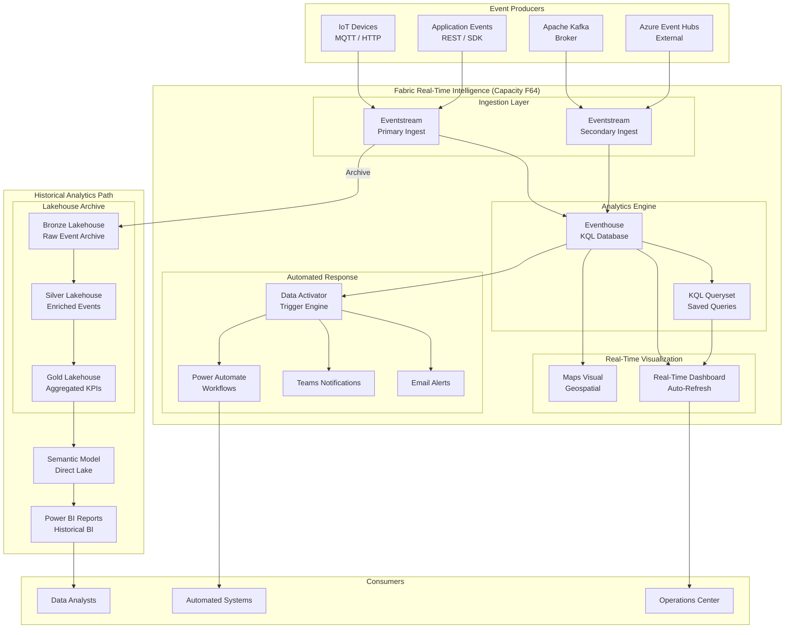

# ⚡ Real-Time Analytics Reference Architecture

**Eventstream → Eventhouse → Real-Time Dashboard + Data Activator Alerts**

---

**Last Updated:** `2026-05-05` | **Version:** 1.0.0

---

## 🎯 Architecture Overview

This architecture is purpose-built for workloads that require sub-second data ingestion, real-time analytics, and automated alerting — such as IoT sensor monitoring, casino floor telemetry, financial tick data, and operational dashboards. Events flow from producers (devices, applications, brokers) through Fabric Eventstreams into an Eventhouse powered by KQL (Kusto Query Language) for high-performance time-series analytics. Real-Time Dashboards provide live visualizations with auto-refresh, while Data Activator monitors data streams for conditions that trigger automated alerts (email, Teams, Power Automate). A parallel lakehouse path archives streaming data into the medallion architecture for historical analytics and batch BI.

---

## 🏗️ Architecture Diagram

---

## 📦 Component Table

| Component | Fabric Item | Purpose | Sizing Notes |
|:----------|:------------|:--------|:-------------|
| **Eventstream (Primary)** | Eventstream | Ingest events from IoT devices and applications | One per source type; supports JSON, Avro, Parquet |
| **Eventstream (Secondary)** | Eventstream | Ingest from Kafka and external Event Hubs | Consumer group isolation per destination |
| **Eventhouse** | Eventhouse | KQL database for real-time time-series analytics | Auto-scales within capacity; supports hot/warm cache |
| **KQL Database** | KQL Database | Tables, materialized views, functions within Eventhouse | Partition by time; set retention policies |
| **KQL Queryset** | KQL Queryset | Saved analytical queries and dashboards data sources | Reusable across dashboards |
| **Real-Time Dashboard** | RT Dashboard | Live visualizations with auto-refresh (30s–5min intervals) | Lightweight; renders from KQL queries |
| **Maps Visual** | RT Dashboard tile | Geospatial visualization of events on maps | Requires lat/long fields in events |
| **Data Activator** | Reflex | Monitor streams for conditions and trigger alerts | Rules evaluated on incoming events |
| **Bronze Lakehouse** | Lakehouse | Archive raw streaming events for historical analysis | Eventstream output to Delta tables |
| **Silver Lakehouse** | Lakehouse | Enriched and deduplicated event data | Scheduled Spark jobs for batch processing |
| **Gold Lakehouse** | Lakehouse | Pre-aggregated KPIs for historical BI | Hourly/daily rollups |
| **Semantic Model** | Semantic Model | Direct Lake model for historical Power BI reports | Covers Gold lakehouse tables |
| **Power BI Reports** | Report | Historical trend analysis and deep-dive analytics | Batch-refreshed; complement real-time dashboards |

---

## 📏 Capacity Sizing Guidance

### By Ingestion Volume

| Events/Second | Daily Volume | Hot Cache | Recommended SKU | Monthly Cost (est.) |
|:-------------|:-------------|:----------|:-----------------|:-------------------|
| < 1,000 | ~5 GB | 7 days | **F32** | $2,100 |
| 1,000–10,000 | 5–50 GB | 7 days | **F64** | $4,200 |
| 10,000–100,000 | 50–500 GB | 3 days | **F128** | $8,400 |
| 100,000–1M | 500 GB–5 TB | 1 day | **F256** | $16,800 |
| > 1M | > 5 TB/day | 1 day | **F512+** or Event Hubs + F256 | $33,600+ |

### By Use Case

| Use Case | Typical Volume | Recommended SKU |
|:---------|:---------------|:----------------|
| Casino floor telemetry (500 slots) | ~2,000 events/sec | **F64** |
| IoT sensor monitoring (1,000 sensors at 1Hz) | ~1,000 events/sec | **F32–F64** |
| Financial tick data (100 instruments) | ~5,000 events/sec | **F64–F128** |
| Operational monitoring (log aggregation) | ~10,000 events/sec | **F128** |
| High-volume gaming/ad-tech | > 100,000 events/sec | **F256+** (or Azure Event Hubs + Fabric) |

**Key sizing considerations:**

- **Hot cache** determines query performance — more cache = faster queries on recent data
- **Retention** controls total storage — archive to lakehouse for data beyond retention period
- Eventhouse scales within capacity; if CU pressure is high, split workloads across capacities
- For volumes exceeding 1M events/sec, use Azure Event Hubs as a buffer (see [Hybrid Cloud](hybrid-cloud.md))

---

## 🔒 Network Architecture

| Layer | Implementation | Notes |
|:------|:---------------|:------|
| **Event Producers** | TLS 1.2 for all connections; Entra-based or SAS token auth | Rotate SAS tokens; prefer managed identity |
| **Eventstream Endpoints** | Public or private depending on producer location | Use private endpoints for internal producers |
| **Eventhouse Access** | Workspace roles + KQL database permissions | Row-level security available via KQL functions |
| **Real-Time Dashboard Sharing** | Workspace viewer role or embed in Power BI | No anonymous access |
| **Data Activator** | Service principal for Power Automate connectors | Least-privilege for automated actions |
| **Lakehouse Archive** | Same security as Fabric workspaces | Sensitivity labels propagate from Eventhouse |
| **Network Isolation** | Private endpoints + Managed VNet for production | Public endpoint acceptable for dev/test |

---

## 💰 Cost Estimation Framework

| Cost Component | Estimation Method | Typical Range |
|:---------------|:------------------|:-------------|
| **Fabric Capacity** | SKU × hours running | $2,100–$16,800/mo |
| **OneLake Storage (Eventhouse)** | Event volume × retention × compression ratio | $50–$500/mo |
| **OneLake Storage (Lakehouse archive)** | Archived volume × $0.023/GB/mo | $25–$250/mo |
| **Event Hubs** (if used as buffer) | Throughput units × hours | $0–$1,500/mo |
| **Data Activator** | Included in Fabric capacity CUs | $0 (CU-based) |
| **Power Automate** | Per-flow licensing if triggered by Data Activator | $0–$300/mo |
| **Total Estimate** | | **$2,500–$19,000/mo** |

**Cost optimization strategies:**

1. **Right-size hot cache** — Reduce cache duration for data queried infrequently (saves Eventhouse CUs)
2. **Archive to lakehouse** — Move data beyond retention window to cheaper OneLake storage
3. **Materialized views** — Pre-aggregate common queries to reduce CU per query
4. **Pause capacity** — If streaming is only active during business hours, pause overnight
5. **Batch hybrid** — Use Eventhouse for real-time window (last 7 days); use lakehouse for historical
6. **Event batching** — Batch small events at the producer to reduce per-event overhead

---

## 🚀 Deploy This Architecture

### Infrastructure as Code

| Resource | Bicep Module | Description |
|:---------|:-------------|:------------|
| Fabric Capacity | [`infra/modules/fabric/fabric-capacity.bicep`](https://github.com/fgarofalo56/Suppercharge_Microsoft_Fabric/blob/main/infra/modules/fabric/fabric-capacity.bicep) | Compute for RTI workloads |
| Eventhouse | [`infra/modules/fabric/fabric-eventhouse.bicep`](https://github.com/fgarofalo56/Suppercharge_Microsoft_Fabric/blob/main/infra/modules/fabric/fabric-eventhouse.bicep) | KQL analytics engine |
| Eventstream | [`infra/modules/fabric/fabric-eventstream.bicep`](https://github.com/fgarofalo56/Suppercharge_Microsoft_Fabric/blob/main/infra/modules/fabric/fabric-eventstream.bicep) | Event ingestion routing |
| Alerts & Budgets | [`infra/modules/monitoring/alerts-and-budgets.bicep`](https://github.com/fgarofalo56/Suppercharge_Microsoft_Fabric/blob/main/infra/modules/monitoring/alerts-and-budgets.bicep) | CU alerts and cost monitoring |
| Action Groups | [`infra/modules/monitoring/action-groups.bicep`](https://github.com/fgarofalo56/Suppercharge_Microsoft_Fabric/blob/main/infra/modules/monitoring/action-groups.bicep) | Alert notification routing |

### Step-by-Step Tutorials

| Step | Tutorial | What You'll Build |
|:-----|:---------|:-----------------|
| 1 | [Environment Setup](../tutorials/00-environment-setup/README.md) | Provision capacity and workspaces |
| 2 | [Real-Time Analytics](../tutorials/04-real-time-analytics/README.md) | Eventstream → Eventhouse → Dashboard |
| 3 | [Multi-Source Streaming](../tutorials/26-multi-source-streaming/README.md) | Ingest from multiple event sources |
| 4 | [Bronze Layer](../tutorials/01-bronze-layer/README.md) | Archive streaming data to lakehouse |
| 5 | [Silver Layer](../tutorials/02-silver-layer/README.md) | Enrich and deduplicate event data |
| 6 | [Gold Layer](../tutorials/03-gold-layer/README.md) | Build aggregated KPIs |
| 7 | [Direct Lake Power BI](../tutorials/05-direct-lake-powerbi/README.md) | Historical BI over archived events |
| 8 | [Monitoring & Alerting](../tutorials/17-monitoring-alerting/README.md) | Operational monitoring and alerts |

### Key Feature Documentation

| Feature | Documentation |
|:--------|:-------------|
| Real-Time Intelligence | [RTI Feature Doc](../features/real-time-intelligence.md) |
| Data Activator | [Data Activator Feature Doc](../features/data-activator.md) |
| Real-Time Hub | [Real-Time Hub](../features/real-time-hub.md) |
| Eventhouse Vector Database | [Vector DB in Eventhouse](../features/eventhouse-vector-database.md) |
| Maps in Fabric | [Maps Visual](../features/maps-in-fabric.md) |
| Workspace Monitoring | [Monitoring Feature Doc](../features/workspace-monitoring.md) |

### Casino Floor Example

This reference architecture directly maps to the casino floor monitoring scenario in this POC:

| Casino Component | RTI Component | Data Flow |
|:-----------------|:-------------|:----------|
| Slot machine telemetry | Eventstream | 500 machines × 4 events/sec → Eventhouse |
| Table game events | Eventstream | Dealer actions, bets, outcomes |
| Player tracking | Eventhouse KQL | Real-time loyalty and session analytics |
| Floor heatmap | Real-Time Dashboard + Maps | Geospatial visualization of activity |
| CTR threshold alerts | Data Activator | Trigger when transaction sum exceeds $10,000 |
| SAR pattern detection | KQL materialized view | Detect structuring patterns ($8K–$9.9K) |

See notebooks:
- [`notebooks/bronze/01_bronze_slot_telemetry.py`](https://github.com/fgarofalo56/Suppercharge_Microsoft_Fabric/blob/main/notebooks/bronze/01_bronze_slot_telemetry.py) — Real-time slot ingestion
- [`notebooks/gold/01_gold_slot_performance.py`](https://github.com/fgarofalo56/Suppercharge_Microsoft_Fabric/blob/main/notebooks/gold/01_gold_slot_performance.py) — Slot KPI aggregations

---

## ⚖️ Tradeoffs and Limitations

| Tradeoff | Impact | Mitigation |
|:---------|:-------|:-----------|
| **Eventhouse ingestion limits** | Single Eventstream limited to ~1M events/sec; beyond requires Event Hubs buffer | Use [Hybrid Cloud](hybrid-cloud.md) architecture for extreme volumes |
| **KQL learning curve** | KQL is powerful but different from SQL; team needs ramp-up time | Leverage KQL Queryset templates; SQL-to-KQL migration guide available |
| **Real-Time Dashboard limitations** | Fewer visual types than Power BI; no paginated reports | Use RT Dashboard for live ops; Power BI for deep analysis |
| **Data Activator maturity** | Currently supports email, Teams, Power Automate; limited custom actions | Extend via Power Automate for complex workflows |
| **Dual-path complexity** | Maintaining both Eventhouse (real-time) and lakehouse (batch) paths | Clearly separate concerns: Eventhouse for last 7 days, lakehouse for history |
| **Hot cache cost** | Longer cache retention increases capacity requirements | Balance cache duration with query patterns; archive cold data |
| **Event ordering** | Eventstream provides at-least-once delivery; ordering not guaranteed within partition | Design for idempotent processing; deduplicate in Silver layer |
| **Retention limits** | Eventhouse retention governed by capacity and policy | Set appropriate retention; archive to lakehouse before data expires |

---

## 📚 References

| Resource | Link |
|:---------|:-----|
| Real-Time Intelligence | [Feature Doc](../features/real-time-intelligence.md) |
| Data Activator | [Feature Doc](../features/data-activator.md) |
| Real-Time Hub | [Feature Doc](../features/real-time-hub.md) |
| Eventhouse Vector Database | [Feature Doc](../features/eventhouse-vector-database.md) |
| Capacity Planning | [Best Practice](../best-practices/capacity-planning-cost-optimization.md) |
| Network Security | [Best Practice](../best-practices/network-security.md) |
| Monitoring & Observability | [Best Practice](../best-practices/monitoring-observability.md) |
| Microsoft Fabric RTI Documentation | [learn.microsoft.com/fabric/real-time-intelligence](https://learn.microsoft.com/en-us/fabric/real-time-intelligence/) |
