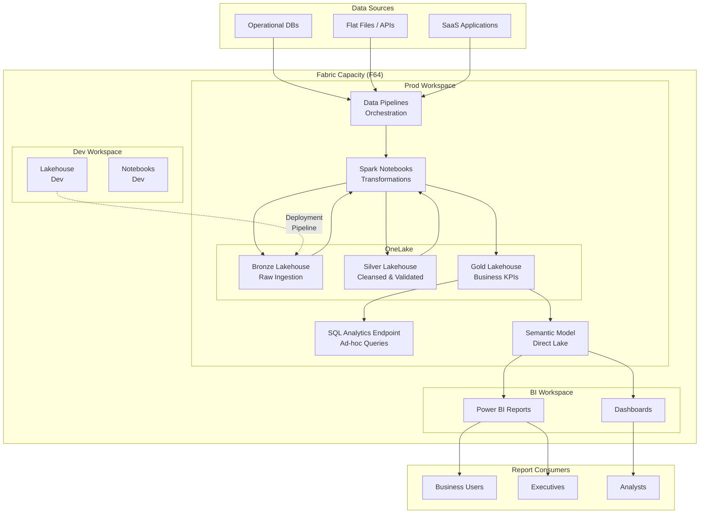

# 🏢 Small-Medium Enterprise Reference Architecture


<div align="center" markdown>

**Single Capacity, Medallion Lakehouse, Direct Lake Power BI**


</div>

---

**Last Updated:** `2026-05-05` | **Version:** 1.0.0

---

## 🎯 Architecture Overview

This architecture is designed for small-to-medium teams (5–20 data practitioners) running their first production Fabric deployment. A single Fabric capacity hosts 2–3 workspaces following a Dev/Test/Prod promotion model. Data flows through a medallion lakehouse (Bronze → Silver → Gold) within a single OneLake instance, and Power BI reports connect via Direct Lake for sub-second analytics without data duplication. Governance is handled at the workspace level using Fabric's built-in RBAC, sensitivity labels, and optional Purview integration.

---

## 🏗️ Architecture Diagram



---

## 📦 Component Table

| Component | Fabric Item | Purpose | Sizing Notes |
|:----------|:------------|:--------|:-------------|
| **Bronze Lakehouse** | Lakehouse | Raw data ingestion, append-only Delta tables | Size grows with source volume; partition by date |
| **Silver Lakehouse** | Lakehouse | Cleansed, deduplicated, schema-enforced data | ~60–80% of Bronze size after filtering |
| **Gold Lakehouse** | Lakehouse | Business aggregations, star schema, KPIs | ~10–30% of Silver size; optimized for queries |
| **Data Pipelines** | Pipeline | Orchestrate ingestion and transformation jobs | Schedule based on freshness requirements |
| **Spark Notebooks** | Notebook | PySpark transformations between medallion layers | Concurrency limited by capacity CUs |
| **SQL Analytics Endpoint** | SQL Endpoint | Ad-hoc SQL queries against lakehouse tables | Auto-generated; no separate provisioning |
| **Semantic Model** | Semantic Model | Direct Lake model for Power BI consumption | One model per Gold lakehouse |
| **Power BI Reports** | Report | Interactive dashboards and paginated reports | Render CUs shared with compute workloads |
| **Dev Lakehouse** | Lakehouse | Development and testing environment | Use sample data; smaller scale |
| **Deployment Pipeline** | Deployment Pipeline | Promote items from Dev → Prod | Built-in Fabric deployment pipelines |

---

## 📏 Capacity Sizing Guidance

| Data Volume | Concurrent Users | Recommended SKU | Monthly Cost (est.) |
|:------------|:-----------------|:-----------------|:-------------------|
| < 500 GB | 5–10 | **F16** | ~$1,050 |
| 500 GB – 2 TB | 10–20 | **F32** | ~$2,100 |
| 2–5 TB | 15–25 | **F64** | ~$4,200 |
| 5–10 TB | 20–30 | **F128** | ~$8,400 |

**Sizing considerations:**

- **Spark workloads** consume the most CUs — schedule heavy transforms during off-peak hours
- **Direct Lake** is far more CU-efficient than Import or DirectQuery for BI
- **Pause capacity** during non-business hours to reduce cost by 40–60%
- Start with F32 and monitor utilization via [Workspace Monitoring](../features/workspace-monitoring.md) before scaling

---

## 🔒 Network Architecture

For small-medium deployments, a simplified network posture balances security with operational simplicity:

| Layer | Approach | Notes |
|:------|:---------|:------|
| **Authentication** | Microsoft Entra ID (SSO) | All users authenticate via organizational Entra tenant |
| **Authorization** | Workspace roles (Admin/Member/Contributor/Viewer) | Map to Entra security groups |
| **Data Access** | Item-level permissions + Row-Level Security (RLS) | RLS defined in semantic model |
| **Network** | Public endpoint with Entra Conditional Access | No VNet required at this scale |
| **Data at Rest** | Microsoft-managed encryption (default) | Customer-managed keys optional |
| **Sensitivity Labels** | Microsoft Purview Information Protection labels | Apply to lakehouses and reports |

**When to add network isolation:** If compliance requirements mandate private connectivity (HIPAA, FedRAMP), add private endpoints and a VNet data gateway. See [Network Security](../best-practices/network-security.md).

---

## 💰 Cost Estimation Framework

| Cost Component | Estimation Method | Typical Range |
|:---------------|:------------------|:-------------|
| **Fabric Capacity** | SKU × hours running per month | $1,050–$8,400/mo |
| **OneLake Storage** | $0.023/GB/month (hot tier) | $12–$115/mo for 0.5–5 TB |
| **Egress** | Typically minimal for internal BI | < $50/mo |
| **Purview** (optional) | Free tier covers basic governance | $0 (basic) |
| **Power BI Pro Licenses** | $10/user/month for report consumers | $50–$200/mo |
| **Total Estimate** | | **$1,200–$9,000/mo** |

**Cost optimization strategies:**

1. **Pause/Resume** — Pause capacity during nights and weekends (saves 40–60%)
2. **Reservations** — 1-year commitment saves ~40% on capacity
3. **Smoothing** — Fabric's 24-hour CU smoothing lets you burst without immediate throttling
4. **Direct Lake** — Eliminates Import refresh CU cost entirely

---

## 🚀 Deploy This Architecture

### Infrastructure as Code

| Resource | Bicep Module | Description |
|:---------|:-------------|:------------|
| Fabric Capacity | [`infra/modules/fabric/fabric-capacity.bicep`](https://github.com/fgarofalo56/Supercharge_Microsoft_Fabric/blob/main/infra/modules/fabric/fabric-capacity.bicep) | Deploy F16–F128 capacity |
| Storage Account | [`infra/modules/storage/storage-account.bicep`](https://github.com/fgarofalo56/Supercharge_Microsoft_Fabric/blob/main/infra/modules/storage/storage-account.bicep) | Landing zone for file ingestion |
| Log Analytics | [`infra/modules/monitoring/log-analytics-workspace.bicep`](https://github.com/fgarofalo56/Supercharge_Microsoft_Fabric/blob/main/infra/modules/monitoring/log-analytics-workspace.bicep) | Monitoring and diagnostics |
| Alerts & Budgets | [`infra/modules/monitoring/alerts-and-budgets.bicep`](https://github.com/fgarofalo56/Supercharge_Microsoft_Fabric/blob/main/infra/modules/monitoring/alerts-and-budgets.bicep) | Cost alerts and CU budget |

### Step-by-Step Tutorials

| Step | Tutorial | What You'll Build |
|:-----|:---------|:-----------------|
| 1 | [Environment Setup](../tutorials/00-environment-setup/README.md) | Provision capacity, create workspaces |
| 2 | [Bronze Layer](../tutorials/01-bronze-layer/README.md) | Ingest raw data into Bronze lakehouse |
| 3 | [Silver Layer](../tutorials/02-silver-layer/README.md) | Cleanse and validate data |
| 4 | [Gold Layer](../tutorials/03-gold-layer/README.md) | Build business KPIs and star schema |
| 5 | [Direct Lake Power BI](../tutorials/05-direct-lake-powerbi/README.md) | Connect Power BI via Direct Lake |
| 6 | [Data Pipelines](../tutorials/06-data-pipelines/README.md) | Orchestrate end-to-end data flow |
| 7 | [Governance](../tutorials/07-governance-purview/README.md) | Set up Purview and sensitivity labels |
| 8 | [CI/CD](../tutorials/12-cicd-devops/README.md) | Implement deployment pipelines |

### Deployment Commands

```bash
# Deploy the capacity and supporting resources
az deployment sub create --location eastus2 \
  --template-file infra/main.bicep \
  --parameters infra/environments/dev/dev.bicepparam

# Validate before deploying
az deployment sub what-if --location eastus2 \
  --template-file infra/main.bicep \
  --parameters infra/environments/dev/dev.bicepparam
```

---

## ⚖️ Tradeoffs and Limitations

| Tradeoff | Impact | Mitigation |
|:---------|:-------|:-----------|
| **Single capacity** | All workloads share CUs; heavy Spark jobs can impact BI query performance | Schedule transforms off-peak; monitor CU utilization |
| **No network isolation** | Data traverses public endpoints (encrypted in transit) | Add private endpoints if compliance requires it |
| **Limited blast radius** | A misconfigured pipeline can affect the entire capacity | Use Dev workspace for testing; deploy via pipelines |
| **Governance ceiling** | Workspace-level RBAC may be insufficient for complex data domains | Upgrade to [Large Enterprise Multi-Domain](large-enterprise-multi-domain.md) architecture |
| **Single region** | No built-in cross-region failover | Acceptable for non-critical workloads; see [BCDR](../best-practices/disaster-recovery-bcdr.md) for DR options |
| **Team scaling** | Beyond ~25 users, contention for capacity and workspace sprawl become issues | Plan migration path to multi-capacity architecture |

---

## 📚 References

| Resource | Link |
|:---------|:-----|
| Microsoft Fabric Documentation | [learn.microsoft.com/fabric](https://learn.microsoft.com/en-us/fabric/) |
| Capacity Planning Guide | [Capacity Planning & Cost Optimization](../best-practices/capacity-planning-cost-optimization.md) |
| Direct Lake Documentation | [Direct Lake Feature Doc](../features/direct-lake.md) |
| Medallion Architecture | [Medallion Deep Dive](../best-practices/medallion-architecture-deep-dive.md) |
| Identity & RBAC | [RBAC Patterns](../best-practices/identity-rbac-patterns.md) |
| Workspace Monitoring | [Monitoring Feature Doc](../features/workspace-monitoring.md) |
