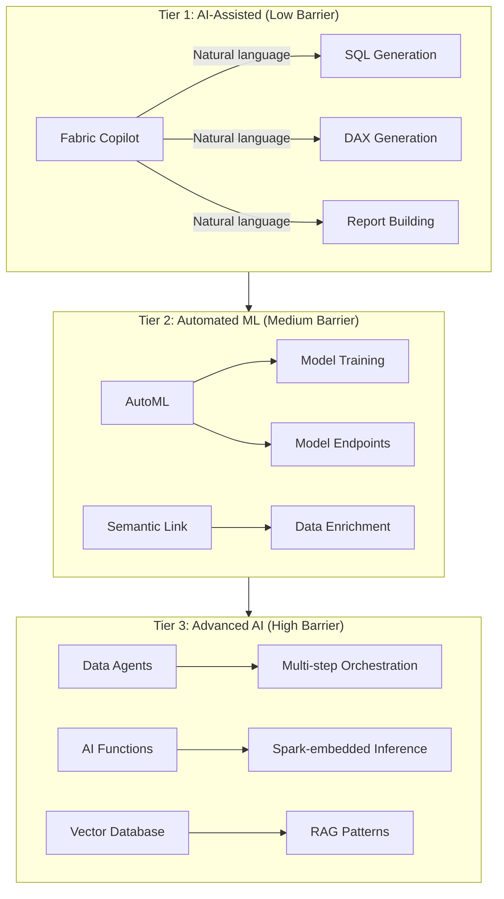
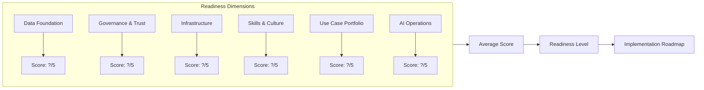

# AI Readiness Assessment for Microsoft Fabric

> A structured framework for evaluating an organization's readiness to adopt Fabric AI capabilities — Copilot, AutoML, Semantic Link, Data Agents, and AI Functions — with a maturity model, assessment questionnaire, and implementation roadmap.

!!! info "Third-party references — publicly sourced, good-faith comparison"
    This page references non-Microsoft products and services. That information is drawn from each vendor's **publicly available documentation** and is offered for honest, good-faith comparison only. This is a personal project written from a Microsoft Fabric and Azure perspective; it does **not** claim expertise in, or authority over, any third-party product, and nothing here is an official statement by, or endorsed by, those vendors. Capabilities, pricing, and features change often — always verify against the vendor's current official documentation. Where a third-party offering is the stronger choice, we say so plainly.

## Executive Summary

Microsoft Fabric's AI capabilities span a broad spectrum, from no-code Copilot assistance to advanced Data Agents that autonomously orchestrate multi-step analytics workflows. However, organizations cannot simply "turn on AI" — successful adoption requires foundational maturity in data quality, governance, infrastructure, skills, and organizational culture. This assessment framework helps enterprise leaders evaluate where they stand today and chart a realistic path to AI-powered analytics.

The framework operates on five maturity levels (Aware, Exploring, Operationalizing, Scaling, Transforming) across six readiness dimensions (Data Foundation, Governance and Trust, Infrastructure, Skills and Culture, Use Case Portfolio, AI Operations). Each dimension includes specific assessment criteria, scoring guidance, and recommended actions for advancement.

## AI Capability Landscape in Fabric

Before assessing readiness, it is essential to understand what Fabric's AI capabilities actually offer and what they require from the organization.

### Capability Tiers

**Tier 1 — AI-Assisted (Low Barrier):** Fabric Copilot provides natural language interfaces for SQL generation, DAX authoring, notebook code completion, and Power BI report building. Requirements: valid Fabric capacity, Microsoft 365 Copilot licensing, well-documented semantic models with descriptions and relationships. No custom model training required.

**Tier 2 — Automated ML (Medium Barrier):** AutoML enables no-code model training for classification, regression, and forecasting directly within Fabric notebooks. Semantic Link connects Power BI semantic models with Spark notebooks for bidirectional enrichment. Requirements: clean, labeled training data in OneLake; defined business metrics; basic understanding of ML concepts; F64+ capacity for training workloads.

**Tier 3 — Advanced AI (High Barrier):** Data Agents autonomously execute multi-step analytics workflows using natural language instructions. AI Functions embed pre-trained models (sentiment analysis, translation, entity extraction) directly into Spark transformations. Vector Database in Eventhouse enables retrieval-augmented generation (RAG) patterns with KQL. Requirements: mature data platform, established governance, skilled ML engineers, clear AI use cases with measurable business value, Azure OpenAI or model endpoint configuration.

## Maturity Model

The AI Readiness Maturity Model defines five levels that an organization progresses through on its journey from initial awareness to transformative AI adoption. Each level builds on the previous one — skipping levels creates fragile implementations that fail under production conditions.

### Level 1 — Aware

The organization recognizes that AI capabilities exist in Fabric but has not yet experimented with them. Data infrastructure may be nascent (raw files in ADLS, no medallion architecture). Governance is informal or absent. Analytics is primarily manual (Excel, ad-hoc SQL). There is no dedicated data science function.

**Characteristics:**
- Data stored in unstructured formats without schema enforcement
- No centralized data catalog or lineage tracking
- Analytics driven by individual analysts with local tools
- AI/ML perceived as aspirational rather than actionable
- No defined AI use cases or success metrics

**Actions to advance:**
- Establish a medallion architecture with Bronze/Silver/Gold layers
- Deploy Microsoft Purview for data cataloging
- Identify 2-3 candidate AI use cases with clear business value
- Train core team on Fabric fundamentals (Lakehouse, notebooks, pipelines)

### Level 2 — Exploring

The organization has a working Fabric deployment with medallion architecture and is actively experimenting with Tier 1 AI capabilities (Copilot). A small team of data practitioners has explored Copilot for SQL/DAX generation. Data quality is improving but inconsistent. Governance policies exist on paper but enforcement is manual.

**Characteristics:**
- Medallion architecture implemented for at least one domain
- Copilot enabled and used for ad-hoc query assistance
- 1-3 data practitioners experimenting with AI features
- Data quality issues are known but not systematically addressed
- No production AI/ML models deployed
- Governance relies on manual review rather than automated policy

**Actions to advance:**
- Implement automated data quality checks at Silver layer (Great Expectations or similar)
- Add column descriptions and relationships to all semantic models (required for effective Copilot)
- Define AI use case portfolio with business sponsors
- Pilot one AutoML project end-to-end (training through deployment)
- Establish data stewardship roles within business domains

### Level 3 — Operationalizing

The organization has deployed its first production AI/ML models and is operationalizing AI workflows. Data quality is systematically measured and enforced. Governance is automated for core datasets. Copilot usage is widespread. The first AutoML models are in production, delivering measurable business value. A data science team or function exists, even if small.

**Characteristics:**
- 1-3 production ML models deployed via AutoML or custom training
- Systematic data quality monitoring with alerting
- Purview governance policies enforced automatically
- Semantic models fully documented with descriptions, relationships, and measures
- Copilot adopted by 50%+ of analytics users
- First measurable ROI from AI initiatives
- Defined model monitoring and retraining cadence

**Actions to advance:**
- Implement Semantic Link for bidirectional model-to-BI enrichment
- Build feature store patterns for reusable ML features
- Establish MLOps practices (model versioning, A/B testing, drift detection)
- Expand AI use case portfolio across 3+ business domains
- Begin evaluating Data Agents for workflow automation

### Level 4 — Scaling

AI capabilities are deployed across multiple business domains with standardized MLOps practices. Data Agents are automating routine analytics workflows. AI Functions are embedded in production Spark transformations. The organization has a Center of Excellence (CoE) or AI platform team that provides shared infrastructure, governance, and best practices.

**Characteristics:**
- 10+ production ML models across multiple domains
- Data Agents handling routine analytics tasks
- AI Functions embedded in production data pipelines
- Formal MLOps practices: model registry, versioning, monitoring, retraining automation
- Center of Excellence providing shared AI infrastructure
- Cross-domain feature store with governed sharing
- Measured business impact across multiple KPIs

**Actions to advance:**
- Implement RAG patterns using Eventhouse Vector Database for domain-specific AI assistants
- Build self-service AI capabilities for business users (no-code model training, guided agent creation)
- Integrate AI outputs into operational systems (not just analytics)
- Develop AI governance framework (bias detection, explainability, compliance)
- Evaluate custom foundation model fine-tuning for domain-specific tasks

### Level 5 — Transforming

AI is a core capability that transforms how the organization operates, competes, and creates value. AI-driven insights flow directly into operational decisions. Custom AI agents handle complex multi-step workflows autonomously. The organization contributes to the AI ecosystem (shared models, published research, community participation).

**Characteristics:**
- AI embedded in operational decision-making, not just analytics
- Custom-trained domain models deployed alongside pre-trained services
- Self-service AI capabilities available to business users across all domains
- AI governance framework with bias detection, explainability, and compliance auditing
- Continuous experimentation culture with rapid AI use case prototyping
- Organization recognized as an AI leader in its industry

## Assessment Questionnaire

Score each dimension on a 1-5 scale corresponding to the maturity levels above. Average scores across dimensions to determine overall readiness level.

### Dimension 1: Data Foundation

| # | Assessment Question | Score (1-5) |
|---|-------------------|-------------|
| 1.1 | Is data organized in a medallion architecture (Bronze/Silver/Gold) with schema enforcement? | |
| 1.2 | Are automated data quality checks running at each layer with alerting on failures? | |
| 1.3 | Is data cataloged with business descriptions, data types, and sensitivity classifications? | |
| 1.4 | Are historical datasets available with sufficient volume for ML training (thousands+ rows per target)? | |
| 1.5 | Is data freshness measured and SLAs defined for key datasets? | |
| 1.6 | Are feature engineering patterns standardized and reusable across use cases? | |

**Scoring guide:** Score 1 if data is in raw files with no schema. Score 3 if medallion architecture exists for core domains with basic quality checks. Score 5 if all production datasets are quality-validated, cataloged, and available for ML training with feature store patterns.

### Dimension 2: Governance and Trust

| # | Assessment Question | Score (1-5) |
|---|-------------------|-------------|
| 2.1 | Are data access policies automated (not manual spreadsheet-based tracking)? | |
| 2.2 | Is data lineage tracked end-to-end from source to dashboard? | |
| 2.3 | Are sensitivity labels applied to datasets containing PII, PHI, or financial data? | |
| 2.4 | Is there a defined process for approving AI model deployment to production? | |
| 2.5 | Are AI model outputs monitored for bias, drift, and accuracy degradation? | |
| 2.6 | Does a responsible AI framework exist with documented principles and review processes? | |

**Scoring guide:** Score 1 if governance is informal with no tooling. Score 3 if Purview is deployed with basic policies. Score 5 if governance is fully automated with sensitivity labels, lineage, model approval workflows, and responsible AI reviews.

### Dimension 3: Infrastructure

| # | Assessment Question | Score (1-5) |
|---|-------------------|-------------|
| 3.1 | Is Fabric capacity (F64+) provisioned with auto-scale or burst capabilities? | |
| 3.2 | Are development, staging, and production workspaces separated with CI/CD? | |
| 3.3 | Is network security configured (private endpoints, managed VNet, outbound access protection)? | |
| 3.4 | Are monitoring dashboards tracking CU utilization, query performance, and pipeline health? | |
| 3.5 | Is disaster recovery configured with documented RTO/RPO targets? | |
| 3.6 | Are Azure OpenAI or model endpoints provisioned and accessible from Fabric? | |

**Scoring guide:** Score 1 if running on trial capacity with no environment separation. Score 3 if F64 with dev/prod separation and basic monitoring. Score 5 if multi-capacity with auto-scale, full CI/CD, network isolation, DR, and Azure OpenAI endpoints configured.

### Dimension 4: Skills and Culture

| # | Assessment Question | Score (1-5) |
|---|-------------------|-------------|
| 4.1 | Do data engineers understand medallion architecture, Delta Lake, and Spark? | |
| 4.2 | Are BI developers proficient with semantic models, DAX, and Copilot? | |
| 4.3 | Does the team include members with ML/AI experience (model training, evaluation, deployment)? | |
| 4.4 | Is there a culture of experimentation where teams can prototype AI use cases? | |
| 4.5 | Are business stakeholders engaged as AI use case sponsors with defined success metrics? | |
| 4.6 | Is there a learning budget and time allocation for AI skill development? | |

**Scoring guide:** Score 1 if the team has no Fabric or AI experience. Score 3 if core data engineering and BI skills exist with 1-2 ML-skilled members. Score 5 if a cross-functional AI team exists with business sponsorship, experimentation culture, and continuous learning.

### Dimension 5: Use Case Portfolio

| # | Assessment Question | Score (1-5) |
|---|-------------------|-------------|
| 5.1 | Are AI use cases identified with clear business value and measurable KPIs? | |
| 5.2 | Is there a prioritized backlog of AI initiatives ranked by value/feasibility? | |
| 5.3 | Has at least one AI use case been deployed to production with measured results? | |
| 5.4 | Are use cases mapped to specific Fabric AI capabilities (Copilot, AutoML, Agents, etc.)? | |
| 5.5 | Is there a process for evaluating new AI use cases (idea → feasibility → pilot → production)? | |
| 5.6 | Are AI use cases aligned with organizational strategic priorities? | |

**Scoring guide:** Score 1 if no use cases are defined. Score 3 if 3-5 use cases are identified with business sponsors. Score 5 if a portfolio of 10+ use cases exists across domains with measured production results and a continuous intake process.

### Dimension 6: AI Operations (AIOps)

| # | Assessment Question | Score (1-5) |
|---|-------------------|-------------|
| 6.1 | Is model training automated with version control and reproducibility? | |
| 6.2 | Are production models monitored for accuracy, latency, and data drift? | |
| 6.3 | Is there an automated retraining pipeline triggered by performance degradation? | |
| 6.4 | Are AI costs tracked and attributed to business domains or use cases? | |
| 6.5 | Is there a rollback procedure for reverting to previous model versions? | |
| 6.6 | Are AI system SLAs defined and measured (availability, response time, accuracy)? | |

**Scoring guide:** Score 1 if no MLOps practices exist. Score 3 if basic model versioning and manual monitoring are in place. Score 5 if fully automated MLOps with drift detection, auto-retraining, cost attribution, and SLA monitoring.

## Scoring and Interpretation

### Overall Readiness Score

Calculate the average score across all six dimensions to determine overall readiness level:

| Average Score | Readiness Level | Recommended Starting Point |
|--------------|----------------|---------------------------|
| 1.0 - 1.5 | Level 1 — Aware | Start with data foundation (medallion architecture, Purview) before any AI |
| 1.5 - 2.5 | Level 2 — Exploring | Enable Copilot, pilot AutoML on one clean dataset |
| 2.5 - 3.5 | Level 3 — Operationalizing | Deploy production ML models, implement Semantic Link, begin Data Agents evaluation |
| 3.5 - 4.5 | Level 4 — Scaling | Scale AI across domains, implement RAG patterns, build self-service AI |
| 4.5 - 5.0 | Level 5 — Transforming | Custom model training, operational AI integration, industry leadership |

### Readiness Radar

Visualize your scores across dimensions to identify strengths and gaps. Dimensions with the lowest scores are your blockers — address them before advancing to higher AI capability tiers.

## Implementation Roadmap

Based on assessment results, follow the roadmap corresponding to your current readiness level.

### From Level 1 to Level 2 (3-6 months)

**Focus: Build the data foundation.**

| Month | Actions |
|-------|---------|
| 1-2 | Deploy Fabric capacity (F64), create dev/prod workspaces, implement Bronze layer for 2-3 source systems |
| 2-3 | Implement Silver layer with schema enforcement and basic data quality checks |
| 3-4 | Deploy Purview, begin cataloging datasets with descriptions and sensitivity labels |
| 4-5 | Implement Gold layer with business KPIs, deploy first Power BI semantic model with Copilot |
| 5-6 | Enable Copilot for BI team, identify 3 candidate AI use cases, complete team training on Fabric fundamentals |

### From Level 2 to Level 3 (6-9 months)

**Focus: Operationalize first AI models.**

| Month | Actions |
|-------|---------|
| 1-3 | Implement Great Expectations data quality suites for Silver layer, enrich semantic models with full descriptions |
| 3-5 | Pilot AutoML for top-priority use case (classification or forecasting), deploy to production endpoint |
| 5-7 | Implement Semantic Link for bidirectional model-to-BI integration |
| 7-8 | Establish basic MLOps (model versioning, manual monitoring, retraining schedule) |
| 8-9 | Measure and report ROI from first production AI model, expand to second use case |

### From Level 3 to Level 4 (9-12 months)

**Focus: Scale AI across domains.**

| Month | Actions |
|-------|---------|
| 1-3 | Build feature store patterns, standardize model training pipelines across domains |
| 3-5 | Implement Data Agents for routine analytics automation |
| 5-7 | Embed AI Functions in production Spark transformations (sentiment, entity extraction) |
| 7-9 | Establish Center of Excellence with shared AI infrastructure and governance |
| 9-12 | Deploy 10+ models, implement automated drift detection and retraining |

### From Level 4 to Level 5 (12-18 months)

**Focus: Transform with AI.**

| Month | Actions |
|-------|---------|
| 1-4 | Implement RAG patterns using Eventhouse Vector Database for domain-specific AI assistants |
| 4-8 | Build self-service AI platform for business users |
| 8-12 | Integrate AI outputs into operational decision systems |
| 12-15 | Develop responsible AI governance framework with bias detection and explainability |
| 15-18 | Evaluate custom foundation model fine-tuning for domain-specific tasks |

## Common Anti-Patterns

Avoid these common mistakes when pursuing AI readiness:

**Skipping the data foundation.** Organizations that jump to AI model training before establishing clean, governed data invariably produce models that fail in production. Low-quality input data produces low-quality predictions regardless of algorithm sophistication. Always build the medallion architecture and data quality framework first.

**Over-investing in infrastructure before validating use cases.** Provisioning GPU clusters and Azure OpenAI endpoints before identifying concrete use cases with business sponsors leads to expensive idle infrastructure. Start with Fabric's built-in capabilities (Copilot, AutoML) which require no additional infrastructure and validate business value before scaling.

**Treating AI as an IT project rather than a business initiative.** AI use cases succeed when business stakeholders own the problem definition, success metrics, and adoption. IT provides the platform and engineering; the business provides the domain expertise and change management. Without business sponsorship, even technically excellent models fail to deliver value.

**Ignoring governance until production.** Retrofitting data governance, model approval workflows, and responsible AI practices after models are in production is significantly harder and riskier than building them in from the start. Establish governance frameworks alongside your first production model, not after your tenth.

**Pursuing too many use cases simultaneously.** Organizations that spread thin across 10+ AI initiatives without deep investment in any single one rarely achieve production deployment. Focus on 2-3 high-value use cases, prove ROI, and then expand with the credibility and operational patterns established by early wins.

## Related Documentation

- [AutoML Model Endpoints](../features/automl-model-endpoints.md) — No-code ML training in Fabric
- [Fabric Copilot & AI](../features/fabric-iq.md) — Copilot capabilities and configuration
- [Data Agents](../features/data-agents.md) — Autonomous analytics agents
- [Semantic Link](../features/semantic-link.md) — BI-to-Spark bidirectional integration
- [AI Functions Compliance](https://github.com/fgarofalo56/Suppercharge_Microsoft_Fabric/blob/main/notebooks/gold/17_gold_ai_functions_compliance.py) — Embedding AI in Spark transformations
- [Eventhouse Vector Database](../features/eventhouse-vector-database.md) — RAG patterns with KQL
- [Testing Strategies](../best-practices/testing-strategies.md) — Including ML model validation
