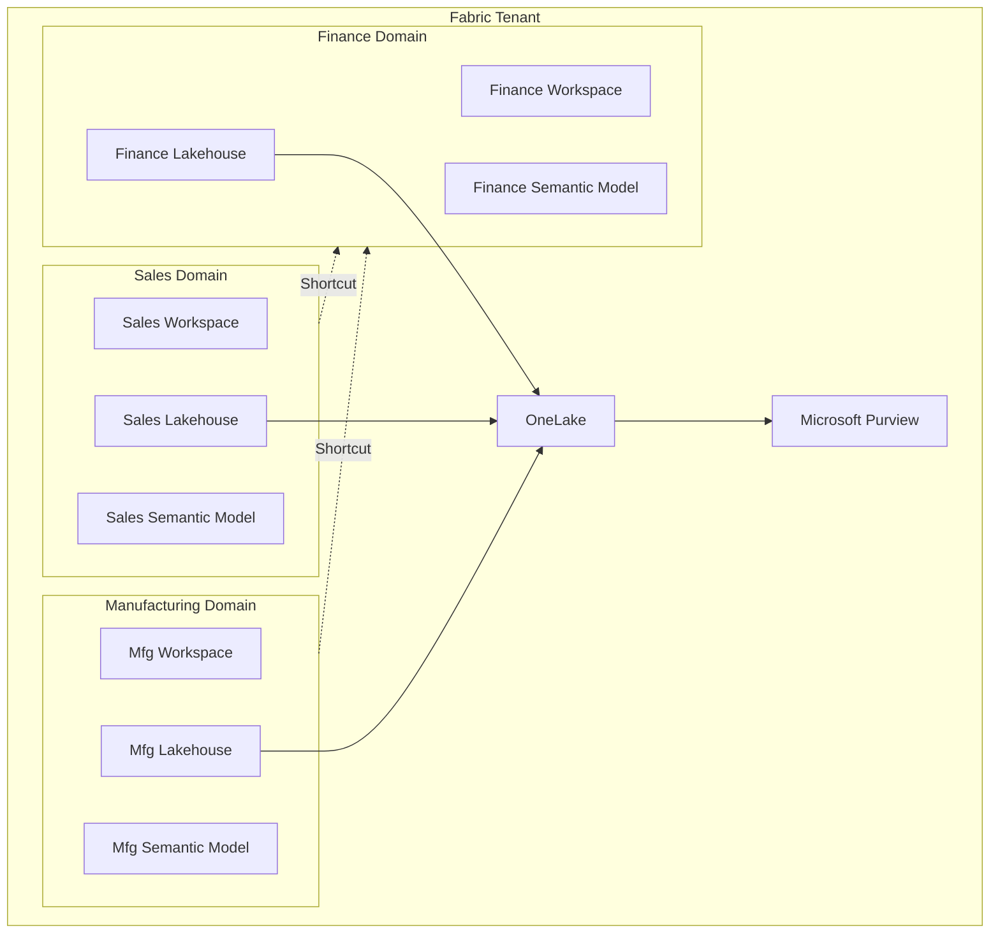

# Data Mesh Maturity Model on Microsoft Fabric

> How to implement Data Mesh principles using Fabric constructs — workspaces as domains, OneLake as federated storage, Purview as the governance plane, and data products delivered via lakehouses and semantic models. Includes maturity levels, assessment criteria, and a migration path from centralized to mesh.

## Executive Summary

Data Mesh is an organizational and architectural paradigm that treats data as a product, owned and operated by the business domains that produce it, rather than centrally managed by a monolithic data team. The four pillars of Data Mesh — domain-oriented ownership, data as a product, self-serve data infrastructure, and federated computational governance — map naturally onto Microsoft Fabric's architecture, but successful implementation requires deliberate organizational change alongside technical configuration.

This paper provides a maturity model for organizations adopting Data Mesh principles on Fabric, a detailed mapping of Mesh concepts to Fabric constructs, assessment criteria for each maturity level, and a migration path from centralized analytics architectures to a federated mesh. The framework is practical rather than dogmatic — recognizing that most enterprises will adopt a hybrid approach with centralized infrastructure and federated ownership, rather than a pure mesh from day one.

## Data Mesh Principles Mapped to Fabric

Each Data Mesh principle has a direct implementation path in Microsoft Fabric. Understanding these mappings is the foundation for the maturity model.

### Principle 1: Domain-Oriented Ownership

In Data Mesh, data is owned by the business domain that produces it. The sales team owns sales data; the manufacturing team owns production telemetry; the finance team owns financial reporting datasets.

**Fabric implementation:** Each domain gets its own Fabric workspace (or set of workspaces for dev/test/prod environments). The workspace is the boundary of ownership — the domain team controls what data products are created, how they are transformed, and when they are refreshed. Workspace roles (Admin, Member, Contributor, Viewer) map to domain team members.

**Key Fabric features:**
- Workspaces provide the organizational boundary for domain ownership
- Workspace Identity enables domain-level service principal authentication
- Workspace tags enable metadata-driven management and discovery across domains
- OneLake shortcuts enable cross-domain data access without duplication

### Principle 2: Data as a Product

Data Mesh treats datasets as products with defined quality standards, SLAs, discoverability, and documentation — just like software products. Domain teams are responsible for ensuring their data products meet consumer expectations.

**Fabric implementation:** A data product in Fabric is typically a Gold-layer Lakehouse table or a Power BI semantic model that is published, documented, and governed for consumption by other domains. Data products are discoverable via OneLake Catalog and governed via Purview sensitivity labels and access policies.

**Data product attributes and Fabric implementations:**

| Attribute | Description | Fabric Implementation |
|-----------|-------------|----------------------|
| Discoverable | Consumers can find the product without asking the producer | OneLake Catalog with descriptions, tags, endorsement badges |
| Addressable | Consumers can access the product via a stable, documented interface | OneLake shortcuts (stable paths), semantic model connection strings |
| Trustworthy | Quality is measured, monitored, and SLA-bound | Great Expectations suites, data quality KPIs in Gold dashboards |
| Self-describing | Schema, lineage, and business context are embedded | Purview data catalog, semantic model descriptions, Lakehouse schema annotations |
| Interoperable | Products follow shared standards for schema, format, and semantics | Delta Parquet format, shared date/entity dimension conventions, Lakehouse schemas |
| Secure | Access is governed by policy, not ad-hoc permissions | Purview access policies, OneLake Security (table/column level), sensitivity labels |

### Principle 3: Self-Serve Data Infrastructure

Data Mesh requires a platform that enables domain teams to create, deploy, and operate data products without deep infrastructure expertise. The platform team provides the tools; domain teams use them.

**Fabric implementation:** Fabric is inherently a self-serve platform — domain teams can create lakehouses, notebooks, pipelines, and semantic models within their workspaces without provisioning infrastructure. The platform team manages capacity allocation, network security, governance policies, and CI/CD templates.

**Platform team responsibilities:**
- Provision and manage Fabric capacities (sizing, scaling, cost allocation)
- Configure tenant-level security (conditional access, network isolation, CMK)
- Maintain Purview governance hub (sensitivity labels, classification rules, access policies)
- Provide CI/CD templates and deployment pipelines (fabric-cicd)
- Define shared conventions (naming standards, medallion architecture templates, schema standards)
- Monitor platform health (CU utilization, throttling, capacity alerts)

**Domain team responsibilities:**
- Create and maintain domain-specific lakehouses, notebooks, and pipelines
- Define and publish data products (Gold tables, semantic models)
- Enforce data quality standards for their products
- Document data products in OneLake Catalog
- Manage domain-level access and permissions
- Respond to consumer feedback and data quality incidents

### Principle 4: Federated Computational Governance

Governance in Data Mesh is federated — global policies are set centrally, but enforcement and domain-specific policies are managed by each domain. This avoids both the bottleneck of centralized governance and the chaos of ungoverned domain autonomy.

**Fabric implementation:**

| Governance Layer | Scope | Fabric Implementation |
|-----------------|-------|----------------------|
| Global policies | Tenant-wide | Purview sensitivity labels, default domain policies, CMK, network security |
| Domain policies | Per workspace | Workspace roles, domain-specific Purview policies, data quality SLAs |
| Product policies | Per data product | Column-level security, row-level security, endorsement badges, access requests |
| Audit and compliance | Cross-domain | Purview audit logs, SQL audit logs, workspace monitoring |

## Maturity Model

The Data Mesh Maturity Model defines five levels that reflect an organization's progress from centralized analytics to a fully federated data mesh. Most enterprises will stabilize at Level 3 or Level 4 — achieving Level 5 requires significant organizational transformation beyond technology changes.

### Level 1 — Centralized Monolith

All data is managed by a central data team. Business domains submit requests to the data team for new datasets, reports, and integrations. The central team owns the entire data lifecycle from ingestion to BI. There is a single shared workspace (or a small number of workspaces organized by layer rather than domain).

**Characteristics:**
- Single data team manages all data assets
- Workspaces organized by layer (bronze-ws, silver-ws, gold-ws) not by domain
- Business teams consume reports but do not own or manage data
- All ETL/ELT pipelines maintained centrally
- Governance is centralized but often informal (no Purview, no sensitivity labels)
- Data quality is the central team's responsibility
- Change requests go through a shared backlog with multi-week lead times

**Assessment criteria:**

| Criterion | Level 1 Indicator |
|-----------|-------------------|
| Workspace structure | Organized by layer, not domain |
| Data ownership | Central team owns everything |
| Time to new data product | Weeks to months (backlog-dependent) |
| Governance | Informal or centralized without tooling |
| Domain team autonomy | None — consumers only |
| Data product catalog | Nonexistent |

### Level 2 — Domain-Aware Centralized

The central data team has begun organizing data by business domain, but ownership remains centralized. Workspaces may be partially restructured by domain. Some domain teams have "embedded" analysts who work closely with the central team. Data quality awareness is growing, but enforcement remains inconsistent.

**Characteristics:**
- Workspaces partially restructured by domain (sales-ws, manufacturing-ws)
- Central team still manages pipelines and infrastructure
- Embedded domain analysts contribute to data modeling
- Purview deployed for discovery, but governance policies are nascent
- Data products are identified but not formally defined or published
- Some domains have begun defining data quality expectations

**Assessment criteria:**

| Criterion | Level 2 Indicator |
|-----------|-------------------|
| Workspace structure | Partially domain-aligned |
| Data ownership | Central team with domain input |
| Time to new data product | Weeks (partially streamlined) |
| Governance | Purview deployed, policies forming |
| Domain team autonomy | Advisory role |
| Data product catalog | Informal (spreadsheets, wiki) |

### Level 3 — Federated Ownership

Domain teams own their data products. Each domain has its own workspace with dedicated team members who create and maintain lakehouses, notebooks, and semantic models. The platform team provides shared infrastructure, governance policies, and CI/CD templates. Cross-domain data access uses OneLake shortcuts. Data products are published in OneLake Catalog with descriptions and endorsement badges.

**Characteristics:**
- Each domain has dedicated Fabric workspaces
- Domain teams own and operate their data pipelines
- Platform team manages capacity, security, and governance framework
- OneLake Catalog used for data product discovery
- Purview sensitivity labels and access policies enforced
- Data quality SLAs defined for published data products
- Cross-domain access via shortcuts with governed permissions
- CI/CD pipelines (fabric-cicd) deployed per domain
- Time to new data product: days, not weeks

**Assessment criteria:**

| Criterion | Level 3 Indicator |
|-----------|-------------------|
| Workspace structure | Domain-aligned with dev/prod separation |
| Data ownership | Domain teams own their products |
| Time to new data product | Days (domain autonomy) |
| Governance | Federated — global + domain policies |
| Domain team autonomy | Full ownership with platform guardrails |
| Data product catalog | OneLake Catalog with descriptions |

### Level 4 — Productized Mesh

Data products are formally defined, measured, and continuously improved. Each data product has an owner, a quality SLA, usage metrics, and a consumer feedback loop. Cross-domain data products (shared dimensions, reference data) are managed by a dedicated governance function. Self-serve data infrastructure is mature — domain teams can provision new data products using platform templates without platform team intervention.

**Characteristics:**
- Formal data product definitions with owner, SLA, quality metrics
- Usage analytics tracked per data product (who consumes what, how often)
- Consumer feedback loops (data product satisfaction surveys, issue tracking)
- Cross-domain shared dimensions managed by governance function
- Platform templates enable self-serve data product creation
- Automated data quality monitoring with alerting to domain owners
- Data contracts between producer and consumer domains
- Cost allocation per domain workspace

**Assessment criteria:**

| Criterion | Level 4 Indicator |
|-----------|-------------------|
| Workspace structure | Domain workspaces with self-serve provisioning |
| Data ownership | Domain-owned with formal product definitions |
| Time to new data product | Hours (template-driven) |
| Governance | Automated with data contracts |
| Domain team autonomy | Full self-serve with platform templates |
| Data product catalog | Rich catalog with usage metrics and SLAs |

### Level 5 — Transformative Mesh

Data Mesh is embedded in organizational culture. Data products are treated as first-class business assets with budgets, roadmaps, and product managers. The platform is fully self-serve with automated compliance. Data flows seamlessly across domains via well-governed interfaces. The organization's data mesh enables new business models, partnerships, and revenue streams built on data products.

**Characteristics:**
- Data products have dedicated product managers and roadmaps
- Data product revenue or cost-recovery models in place
- External data sharing via governed marketplace patterns
- AI/ML models consumed and produced as data products
- Platform fully self-serve with automated compliance
- Data mesh enables new business capabilities and partnerships
- Continuous improvement driven by product metrics and consumer feedback

## Migration Path: Centralized to Mesh

The following migration plan guides organizations from a Level 1 centralized monolith to a Level 3 federated mesh. The journey to Level 4 and 5 is organization-specific and depends on business context.

### Phase 1: Foundation (Months 1-3)

**Goal:** Establish platform infrastructure and identify pilot domains.

| Action | Details |
|--------|---------|
| Select 2 pilot domains | Choose domains with engaged business stakeholders, clean source data, and well-understood analytics requirements |
| Create domain workspaces | One workspace per domain per environment (dev, prod) |
| Deploy Purview | Configure data catalog, sensitivity labels, and basic access policies |
| Define naming conventions | Workspace naming (`{domain}-{env}`), lakehouse naming (`lh_{layer}`), table naming (`{layer}_{domain}_{entity}`) |
| Create platform templates | Lakehouse structure, notebook templates, pipeline patterns, CI/CD configuration |
| Identify initial data products | 2-3 data products per pilot domain |

### Phase 2: Pilot Domains (Months 3-6)

**Goal:** Migrate pilot domains from centralized to domain ownership.

| Action | Details |
|--------|---------|
| Transfer pipeline ownership | Move existing ETL/ELT for pilot domains from central team to domain teams |
| Implement medallion per domain | Bronze → Silver → Gold within each domain workspace |
| Create OneLake shortcuts | Enable cross-domain access for shared reference data |
| Publish data products | Register in OneLake Catalog with descriptions, endorsement badges |
| Define quality SLAs | Set data freshness, completeness, and accuracy targets per data product |
| Train domain teams | Fabric fundamentals, data product ownership, governance responsibilities |
| Establish feedback loops | Consumer satisfaction measurement, issue tracking per data product |

### Phase 3: Scale (Months 6-12)

**Goal:** Expand mesh to all domains, standardize governance.

| Action | Details |
|--------|---------|
| Onboard remaining domains | Apply patterns from pilot to all business domains |
| Implement data contracts | Define producer-consumer agreements for critical data products |
| Automate governance | Purview policies applied automatically to new workspaces and data products |
| Deploy monitoring | Data quality dashboards, CU utilization per domain, product usage analytics |
| Establish governance council | Cross-domain forum for shared standards, dispute resolution, policy updates |
| Implement cost allocation | Attribute Fabric capacity costs to domain workspaces |

### Phase 4: Optimize (Months 12-18)

**Goal:** Mature the mesh with self-serve and advanced capabilities.

```mermaid
flowchart LR
    subgraph Phase1["Phase 1: Foundation"]
        P1A[Platform Setup]
        P1B[Pilot Selection]
        P1C[Purview Deploy]
    end

    subgraph Phase2["Phase 2: Pilot"]
        P2A[Domain Migration]
        P2B[Data Products]
        P2C[Quality SLAs]
    end

    subgraph Phase3["Phase 3: Scale"]
        P3A[All Domains]
        P3B[Data Contracts]
        P3C[Governance Council]
    end

    subgraph Phase4["Phase 4: Optimize"]
        P4A[Self-Serve]
        P4B[Advanced Features]
        P4C[Continuous Improvement]
    end

    Phase1 --> Phase2 --> Phase3 --> Phase4
```

## Organizational Considerations

Data Mesh is at least as much an organizational change as it is a technical one. Technology alone does not create a mesh — you must also address ownership structures, incentive models, and cultural norms.

### Team Structure

The shift from centralized to mesh requires rethinking team structures. In a centralized model, there is one data team that does everything. In a mesh, there are three types of teams:

**Domain data teams** own and operate data products for their business domain. These teams typically include a data engineer (pipelines, data quality), a data analyst (semantic models, reports), and a domain expert (business rules, quality validation). Domain data teams report to domain leadership (e.g., VP of Sales), not to a central data organization.

**Platform team** provides and maintains the shared Fabric infrastructure. This team manages capacity, security, governance configuration, CI/CD templates, and platform monitoring. The platform team serves domain teams as an internal product team — their "customers" are the domain data teams, and their success is measured by domain team satisfaction and self-serve adoption rates.

**Governance council** is a cross-domain forum that sets global standards, resolves conflicts, and evolves governance policies. Membership includes representatives from each domain and the platform team. The council owns shared conventions (naming, schema standards, quality thresholds) and adjudicates cross-domain data product disputes.

### Change Management

The most common failure mode for Data Mesh adoption is insufficient change management. Technical infrastructure can be deployed in months, but shifting ownership models and cultural norms takes years. Key change management actions include executive sponsorship at the C-suite level (not just CIO — the business must sponsor the shift to domain ownership), clear articulation of what changes for each role (domain leaders gain ownership and accountability, central data team evolves into platform team), gradual transition with pilot domains proving the model before full rollout, and success metrics that demonstrate value to both technology and business stakeholders.

### Incentive Alignment

Domain teams will not invest in data product quality unless their incentive structures reward it. Traditional incentive models focus on domain-specific KPIs (revenue, production output, customer satisfaction) without any data product metrics. Effective mesh incentive models include data product quality metrics in domain team performance reviews, recognize domain teams that publish well-consumed data products, allocate data product costs to domain budgets (creating accountability for efficiency), and track data product satisfaction scores from consumer domains.

## Anti-Patterns to Avoid

**Mesh in name only.** Renaming workspaces from "bronze-ws" to "sales-ws" without transferring actual ownership to domain teams. If the central data team still manages all pipelines, you have a renamed monolith, not a mesh.

**Ungoverned chaos.** Giving domain teams full autonomy without shared conventions, quality standards, or governance policies. This produces incompatible data products, duplicated entities, and inconsistent definitions.

**Over-engineering the platform.** Building a sophisticated self-serve platform before validating that domain teams want self-serve. Start with simple templates and manual onboarding; automate based on observed patterns.

**Ignoring shared domains.** Some data (customer master, product catalog, reference data) doesn't belong to any single business domain. Failing to assign clear ownership for shared domains creates gaps and conflicts.

**Big-bang migration.** Attempting to migrate all domains simultaneously overwhelms the organization. The recommended approach is to pilot with 2 domains, learn, and then scale domain by domain.

**Treating mesh as permanent.** Organizational structures evolve. Some domains may be too small to sustain their own data team and should share resources. The mesh should be pragmatic, not dogmatic — adjust the model to fit the organization, not the other way around.

## Fabric-Specific Implementation Patterns

### Pattern 1: Domain Workspace Topology

Each domain gets a workspace set: `{domain}-dev`, `{domain}-prod`. Within each workspace, a standard Lakehouse structure is provisioned via platform templates.

The standard structure includes `lh_bronze` for raw ingestion from domain source systems, `lh_silver` for cleansed and validated domain data, and `lh_gold` for published data products consumed by other domains and BI. Lakehouse schemas (available in Fabric GA) organize tables within each lakehouse by subdomain or entity group.

### Pattern 2: Cross-Domain Data Access

When domain B needs data from domain A, the preferred pattern is OneLake shortcuts rather than data duplication. Domain A publishes a Gold table as a data product. Domain B creates a shortcut in its own lakehouse pointing to domain A's Gold table. Data stays in domain A's OneLake storage. Purview access policies control who can create shortcuts to what. No data movement, no duplication, no freshness lag.

For scenarios requiring transformation of source domain data, domain B creates a pipeline that reads from domain A's shortcut and writes to domain B's Silver or Gold layer. The shortcut source and the transforming pipeline are clearly separated, maintaining lineage.

### Pattern 3: Shared Dimension Management

Shared dimensions (date, geography, customer, product) are managed by a dedicated "shared-data" workspace owned by the governance council or platform team. Domain workspaces create shortcuts to shared dimensions. Changes to shared dimensions follow a formal change management process (governance council approval, backward compatibility assessment, consumer notification).

### Pattern 4: Data Product Endorsement

Fabric supports endorsement badges (Promoted, Certified) on semantic models and lakehouses. Use a two-tier endorsement model: "Promoted" is applied by the domain team when a data product is ready for consumption. "Certified" is applied by the governance council after formal quality assessment. Consumers can filter OneLake Catalog by endorsement level to find trusted data products.

## Assessment Checklist

Use this checklist to assess your current maturity level and identify gaps.

| # | Assessment Item | Level 1 | Level 2 | Level 3 | Level 4 | Level 5 |
|---|----------------|---------|---------|---------|---------|---------|
| 1 | Workspace organization | By layer | Partially by domain | Fully by domain | Self-serve provisioning | Automated lifecycle |
| 2 | Data ownership | Central team | Central with domain input | Domain teams | Domain teams with product managers | Revenue-generating products |
| 3 | Data product catalog | None | Informal | OneLake Catalog | Catalog with metrics | Marketplace |
| 4 | Quality enforcement | Ad-hoc | Manual checks | Automated monitoring | SLA-bound with contracts | Continuous improvement |
| 5 | Cross-domain access | Copy/export | Shared database | OneLake shortcuts | Governed shortcuts with contracts | Self-serve with audit |
| 6 | Governance model | Informal | Centralized | Federated | Automated | Self-healing |
| 7 | Platform team | None | Informal | Established | Product-oriented | Platform-as-a-product |
| 8 | Domain team skills | None | Basic | Proficient | Self-sufficient | Innovating |
| 9 | Cost model | Unattributed | Partially attributed | Domain-attributed | Product-attributed | Value-based |
| 10 | Time to new data product | Months | Weeks | Days | Hours | Minutes |

## Related Documentation

- [Data Mesh](../features/data-mesh-enterprise-patterns.md) — Fabric's Data Mesh capabilities
- [OneLake Security](../features/onelake-security.md) — Table and column-level security
- [OneLake Catalog](../features/onelake-catalog.md) — Data product discovery
- [Multi-Tenant Workspace Architecture](../best-practices/multi-tenant-workspace-architecture.md) — Workspace topology patterns
- [Data Sharing & Federation](../best-practices/data-sharing-federation.md) — Cross-domain access patterns
- [Identity & RBAC Patterns](../best-practices/identity-rbac-patterns.md) — Workspace role management
- [Workspace Topology Decision Tree](../decisions/workspace-topology.md) — Interactive architecture decision guide
- [Large Enterprise Multi-Domain Architecture](../reference-architecture/large-enterprise-multi-domain.md) — Reference architecture for mesh deployments
