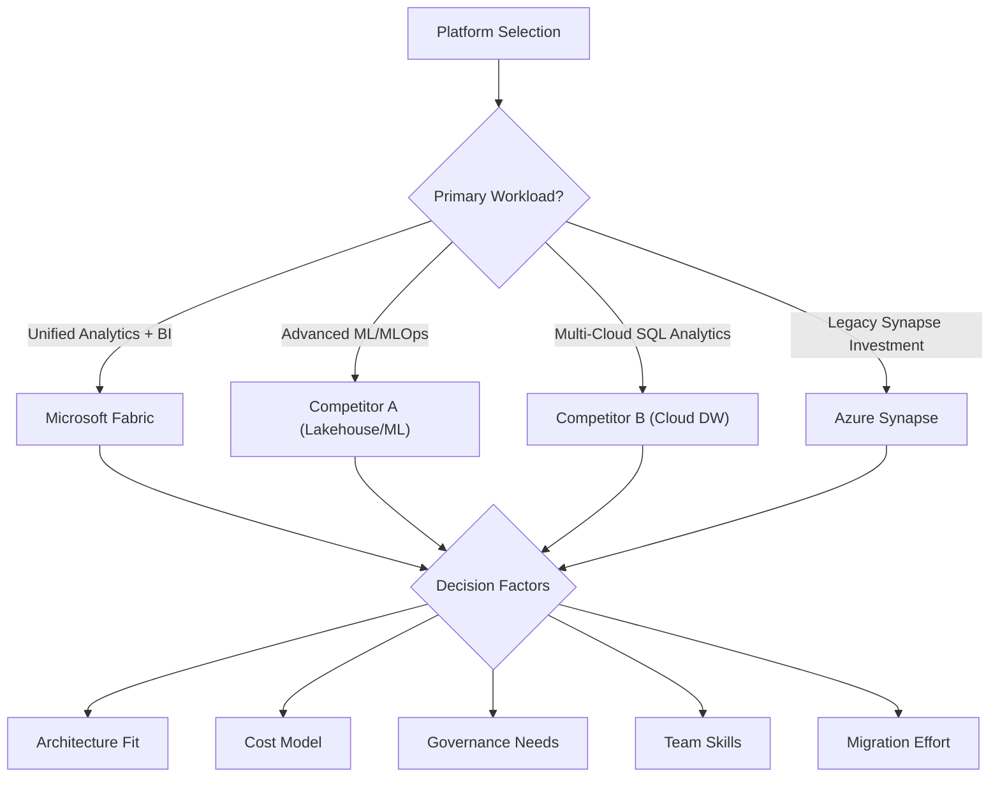
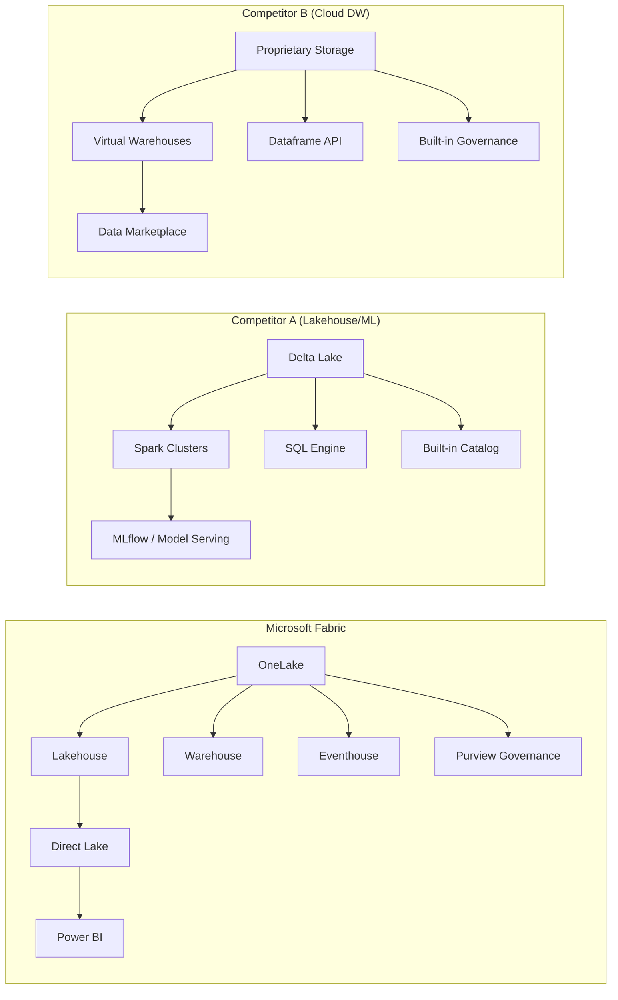

# Enterprise Data Platform Comparison 2026

> Microsoft Fabric compared against leading competitor platforms and Azure Synapse Analytics — a structured comparison to guide platform selection for enterprise analytics, data engineering, and AI workloads.

!!! info "Third-party references — publicly sourced, good-faith comparison"
    This page references non-Microsoft products and services. That information is drawn from each vendor's **publicly available documentation** and is offered for honest, good-faith comparison only. This is a personal project written from a Microsoft Fabric and Azure perspective; it does **not** claim expertise in, or authority over, any third-party product, and nothing here is an official statement by, or endorsed by, those vendors. Capabilities, pricing, and features change often — always verify against the vendor's current official documentation. Where a third-party offering is the stronger choice, we say so plainly.

!!! abstract "Competitor legend"
    To compare distinct non-Microsoft platforms without naming them, this page uses neutral labels:

    - **Competitor A (lakehouse / ML platform)** — a Spark- and MLOps-oriented lakehouse platform available across multiple clouds.
    - **Competitor B (multi-cloud cloud data warehouse)** — a SaaS, separation-of-storage-and-compute data warehouse available across multiple clouds.

    These labels are not mapped back to specific vendor names. Microsoft, Azure, and open-source names (Microsoft Fabric, OneLake, Power BI, Purview, Azure Synapse, SQL Server, Spark, Delta Lake, Apache Iceberg, Parquet, Kafka, etc.) are kept as-is.

## Executive Summary

Organizations evaluating enterprise data platforms in 2026 face a market with several dominant contenders: Microsoft Fabric, two leading competitor platforms (referred to here as Competitor A and Competitor B), and Azure Synapse Analytics. Each platform has matured significantly, but they approach the problem from fundamentally different architectural philosophies. Fabric unifies compute, storage, governance, and BI into a single SaaS experience anchored on OneLake. Per publicly available documentation, Competitor A (a lakehouse / ML platform) emphasizes open-source Spark engineering and MLOps, while Competitor B (a multi-cloud cloud data warehouse) emphasizes multi-cloud data sharing and governed SQL analytics. Synapse Analytics, while still supported, has been largely superseded by Fabric for new deployments in the Microsoft ecosystem.

This paper provides a structured comparison across ten dimensions — architecture, compute, storage, governance, BI integration, AI/ML capabilities, real-time analytics, cost model, ecosystem maturity, and migration complexity — to help enterprise architects and CDOs make informed platform decisions.

## Comparison Framework

The following framework evaluates each platform across dimensions that matter most to enterprise buyers. Scores are directional assessments, not absolute rankings, and reflect the state of each platform as of early 2026.

## 1. Architecture Philosophy

Each platform reflects a distinct architectural vision that shapes every downstream decision — from how data is stored to how governance is enforced.

### Microsoft Fabric

Fabric is a unified SaaS analytics platform built on OneLake, a single-copy data lake that underpins all workloads. Every Fabric item — Lakehouse, Warehouse, Eventhouse, Notebook, Pipeline, Semantic Model — reads from and writes to OneLake in Delta Parquet format. This eliminates data duplication across analytics layers and ensures that governance policies (via Microsoft Purview) apply uniformly. The platform uses a shared capacity model where a single Fabric capacity (measured in Capacity Units, or CUs) powers all workloads, with automatic workload balancing and burst/smoothing behavior.

The architectural bet is on convergence: rather than best-of-breed tools stitched together via ETL, Fabric provides a "good enough at everything, excellent at integration" experience. This is most compelling for organizations that are already invested in the Microsoft ecosystem (Azure, Power BI, Microsoft 365, Purview) and want to reduce operational complexity.

### Competitor A (Lakehouse / ML Platform)

Per publicly available documentation, Competitor A is built on Apache Spark and a lakehouse architecture, combining the flexibility of data lakes with the reliability of data warehouses. The platform centers on its own catalog for governance, Delta Lake for ACID transactions, and a vectorized SQL engine for warehouse-style queries. It runs on all three major public clouds and offers deep integration with open-source data engineering and ML tools (Spark, MLflow, feature store, and model serving).

The architectural emphasis is on openness and performance: the platform gives engineering teams substantial control over compute configuration, cluster sizing, and runtime behavior, at the cost of higher operational complexity. Organizations with strong data engineering teams and advanced ML/AI workloads often find this flexibility worth the overhead — and for engineering-heavy, deep-ML use cases this is frequently the stronger choice.

### Competitor B (Multi-Cloud Cloud Data Warehouse)

Per publicly available documentation, Competitor B is a cloud-native data warehouse built on a separation-of-storage-and-compute architecture. Each workload runs in its own virtual warehouse (compute cluster), and data is stored in a proprietary columnar format. Its documented differentiators are zero-management compute scaling, cross-cloud data sharing via a built-in marketplace, and a developer experience for Python/Java/Scala workloads. The platform has expanded into streaming, ML, and application development capabilities.

The architectural emphasis is on simplicity and portability: the platform abstracts away most infrastructure management and provides a frictionless multi-cloud experience. Organizations that need governed SQL analytics across multiple clouds without single-cloud lock-in often gravitate toward this kind of offering, and for that requirement it is frequently the stronger choice.

### Azure Synapse Analytics

Synapse Analytics was Microsoft's pre-Fabric attempt to unify SQL pools, Spark pools, and pipeline orchestration in a single Azure service. While still supported and receiving security updates, Synapse has been de-emphasized in favor of Fabric for new workloads. Existing Synapse investments can be migrated to Fabric via workspace migration tools, and the Synapse SQL engine now powers Fabric's Warehouse experience.

The architectural bet was on Azure-native integration, but the multi-service model created friction around data movement, governance, and billing that Fabric's unified architecture resolves.

## 2. Feature Matrix

The non-Microsoft columns reflect each vendor's publicly available documentation; verify against current vendor docs.

| Capability | Fabric | Competitor A (Lakehouse/ML) | Competitor B (Cloud DW) | Synapse |
|-----------|--------|------------|-----------|---------|
| **Unified storage** | OneLake (Delta Parquet) | Delta Lake (open) | Proprietary columnar | ADLS Gen2 + SQL pools |
| **SQL analytics** | Warehouse (T-SQL) | ANSI SQL engine | ANSI SQL engine | Dedicated/Serverless SQL |
| **Spark processing** | Spark via Notebooks | Optimized Spark + vectorized engine | Spark-like dataframe API | Spark pools |
| **Real-time ingestion** | Eventstream + Eventhouse | Declarative pipelines + Structured Streaming | Native streaming ingestion | Event Hubs integration |
| **BI integration** | Direct Lake (native) | Partner BI via JDBC/ODBC | Partner BI via JDBC/ODBC | Power BI via DirectQuery |
| **Governance** | Purview (built-in) | Built-in catalog | Built-in governance suite | Purview (add-on) |
| **AI/ML** | AutoML, Copilot, Data Agents, AI Functions | MLflow, feature store, model serving | Built-in LLM and ML services | Azure ML integration |
| **Data sharing** | Shortcuts, Mirroring | Open sharing protocol | Built-in data marketplace | Linked services |
| **Multi-cloud** | Azure only | Multi-cloud | Multi-cloud | Azure only |
| **CI/CD** | fabric-cicd, Git integration | Asset bundles, Git repos | Migration tooling, Terraform | ARM/Bicep, Synapse Git |
| **Cost model** | Capacity Units (CU) — shared pool | Per-cluster compute-unit billing | Per-warehouse credit billing | DWU + vCore — per-pool billing |
| **Iceberg support** | Read via shortcuts + mirroring | Read/write via open table interop | Native Iceberg tables | Limited |
| **Digital twin** | Digital Twin Builder (preview) | Partner solutions | Not available | Not available |
| **Copilot/AI assist** | Fabric Copilot (native) | Built-in assistant | Built-in AI services | Limited |

## 3. Total Cost of Ownership Analysis

TCO comparisons between platforms are notoriously difficult because pricing models differ fundamentally. The following framework normalizes cost into categories that apply across all four platforms.

### Cost Categories

**Compute costs** represent the largest portion of TCO for all platforms. Fabric uses a shared CU pool where all workloads draw from the same capacity, which can lead to efficient utilization but also contention. Per publicly available documentation, Competitor A bills per compute-unit per cluster, giving precise cost attribution but requiring active cluster management; Competitor B bills per credit per virtual warehouse, with automatic suspend/resume reducing idle costs. Synapse bills per DWU for dedicated pools and per query for serverless.

**Storage costs** are relatively similar across platforms when using cloud-native object storage. Fabric's OneLake eliminates duplication costs by storing data once. Per publicly available documentation, Competitor B's proprietary storage carries a small premium; Competitor A and Synapse use open formats on cloud storage.

**Governance and security costs** are often hidden. Fabric includes Purview integration at no additional cost. Per publicly available documentation, the competitor platforms include their respective governance suites within their premium/enterprise tiers. Synapse requires separate Purview licensing.

**Operational costs** — the human effort to manage, monitor, and troubleshoot the platform — vary significantly. Fabric and Competitor B minimize operational overhead through SaaS automation. Competitor A requires more engineering effort for cluster management, job scheduling, and cost optimization. Synapse sits in between.

### Normalized TCO Comparison (Illustrative)

Competitor figures are illustrative estimates derived from publicly available pricing documentation, not the author's expert assessment; verify against current vendor pricing.

| Cost Component | Fabric (F64) | Competitor A (Premium tier) | Competitor B (Enterprise tier) | Synapse (Dedicated) |
|---------------|-------------|---------------------|----------------------|-------------------|
| Compute (annual) | ~$105K (F64 PAYG) | ~$120-180K (varies by cluster) | ~$100-160K (varies by warehouse) | ~$90-150K (varies by DWU) |
| Storage (10 TB) | ~$2.4K (ADLS rates) | ~$2.4K (cloud object storage rates) | ~$4.6K (proprietary storage) | ~$2.4K (ADLS rates) |
| Governance | Included (Purview) | Included (built-in catalog) | Included (built-in governance) | +$12-24K (Purview) |
| BI tooling | Included (Power BI) | +$12-120K (partner BI / Power BI) | +$12-120K (partner BI / Power BI) | +$12-120K (Power BI Pro/Premium) |
| Ops FTE (partial) | 0.25-0.5 FTE | 0.5-1.0 FTE | 0.25-0.5 FTE | 0.5-0.75 FTE |
| **Estimated 3-yr TCO** | **$350-450K** | **$500-700K** | **$400-600K** | **$400-550K** |

These estimates are illustrative for a mid-size analytics workload (50 users, 10 TB, moderate Spark, daily BI refresh). Actual costs vary significantly by workload profile, negotiated pricing, and operational maturity.

### When Fabric Wins on Cost

Fabric's cost advantage is strongest when an organization already has Microsoft 365 E5 licensing (which includes Power BI Pro), uses Azure as its primary cloud, and can consolidate multiple analytics workloads onto a single Fabric capacity. The shared CU pool means that interactive BI queries, batch Spark jobs, and real-time streaming all draw from the same budget, avoiding the per-service billing silos that inflate costs on other platforms.

### When Fabric Loses on Cost

Fabric's cost advantage diminishes for organizations that run heavy, sustained Spark workloads (where Competitor A's vectorized engine is documented to deliver strong price/performance), need multi-cloud deployment (where Competitor B's portability avoids cloud lock-in premiums), or have existing investments in a competitor platform that would require costly migration to abandon. In those scenarios the referenced competitor offering may well be the stronger choice.

## 4. Maturity Assessment

Platform maturity spans technical capability, ecosystem breadth, community size, and enterprise adoption. The following assessment uses a five-level maturity model.

Competitor maturity ratings are this project's directional reading of publicly available information, offered in good faith; they are not an authoritative or expert ranking of any third-party product.

| Dimension | Fabric | Competitor A (Lakehouse/ML) | Competitor B (Cloud DW) | Synapse |
|-----------|--------|------------|-----------|---------|
| SQL analytics | Level 4 (Mature) | Level 4 (Mature) | Level 5 (Leader) | Level 4 (Mature) |
| Spark/data engineering | Level 3 (Established) | Level 5 (Leader) | Level 3 (Established) | Level 3 (Established) |
| Real-time streaming | Level 3 (Established) | Level 4 (Mature) | Level 2 (Developing) | Level 2 (Developing) |
| BI integration | Level 5 (Leader) | Level 2 (Developing) | Level 3 (Established) | Level 3 (Established) |
| AI/ML | Level 3 (Established) | Level 5 (Leader) | Level 3 (Established) | Level 2 (Developing) |
| Governance | Level 4 (Mature) | Level 4 (Mature) | Level 4 (Mature) | Level 3 (Established) |
| Multi-cloud | Level 1 (Azure only) | Level 5 (Leader) | Level 5 (Leader) | Level 1 (Azure only) |
| Enterprise adoption | Level 3 (Growing fast) | Level 5 (Dominant) | Level 5 (Dominant) | Level 4 (Established) |
| Community/ecosystem | Level 3 (Growing) | Level 5 (Massive) | Level 4 (Large) | Level 3 (Stable) |
| Operational simplicity | Level 4 (SaaS) | Level 2 (Complex) | Level 5 (Simplest) | Level 2 (Complex) |

### Maturity Levels Defined

- **Level 1 — Nascent:** Capability exists but is early, limited, or requires significant workarounds.
- **Level 2 — Developing:** Functional for basic scenarios but missing enterprise features, community support, or partner integrations.
- **Level 3 — Established:** Production-ready for most enterprise scenarios with active development, growing community, and solid documentation.
- **Level 4 — Mature:** Feature-rich, well-documented, widely adopted, with strong partner ecosystem and proven at scale.
- **Level 5 — Leader:** Market-defining capability that sets the standard for the category, with dominant market share, deep ecosystem, and continuous innovation.

## 5. Migration Considerations

### Migrating to Fabric

Organizations migrating to Fabric typically come from one of four starting points:

**From Synapse Analytics:** The most straightforward migration path. Fabric's Warehouse uses the same T-SQL engine as Synapse dedicated pools. Pipelines migrate with minimal changes. Spark notebooks require replacing `%%configure` with Fabric's Spark session configuration. Microsoft provides workspace migration tooling. See the [migration patterns](../best-practices/migration-patterns.md) guide.

**From Competitor A (lakehouse / ML platform):** Per publicly available documentation, this requires rewriting Spark notebooks to replace platform-specific APIs (utility libraries, widgets, and catalog references) with Fabric equivalents (mssparkutils, Fabric notebook parameters, Purview). Delta Lake tables can be accessed via OneLake shortcuts without data movement. MLflow models need to be re-registered in Fabric's ML model registry.

**From Competitor B (multi-cloud cloud data warehouse):** Per publicly available documentation, this requires the most architectural change since the platform's proprietary storage format doesn't directly translate to Delta Parquet. Data must be exported and re-ingested. SQL stored procedures need rewriting from the platform's UDF dialect to Fabric's T-SQL or Spark equivalents. Native streaming-ingestion integrations need replacement with Fabric Eventstreams or Pipelines.

**From on-premises systems (SQL Server and other relational/MPP databases):** Fabric provides Mirroring for near-real-time replication from SQL Server and Azure SQL Database. For other sources, use Data Factory pipelines with on-premises data gateway. The [migration tutorial](../tutorials/10-teradata-migration/README.md) covers patterns for legacy MPP warehouse sources.

### Migration Risk Assessment

| Risk Factor | Low Risk | Medium Risk | High Risk |
|------------|----------|-------------|-----------|
| Data volume | < 1 TB | 1-50 TB | > 50 TB |
| Custom code | < 50 notebooks/queries | 50-200 | > 200 |
| Real-time integrations | None | 1-5 streams | > 5 streams |
| Governance policies | Basic RBAC | Column-level security | Row-level + dynamic masking |
| External dependencies | Cloud-native APIs | On-prem gateways | Mainframe/legacy systems |
| Team familiarity | Microsoft stack | Mixed cloud experience | No Microsoft experience |

## 6. Decision Guidance

### Choose Fabric When

- Your organization is already invested in the Microsoft ecosystem (Azure, Microsoft 365, Power BI)
- You want a single platform for data engineering, analytics, BI, and governance
- Operational simplicity is a priority over maximum configurability
- Power BI Direct Lake performance matters for your BI workload
- You need integrated real-time analytics with minimal infrastructure management
- Budget consolidation across analytics services is a goal

### Choose Competitor A (Lakehouse / ML Platform) When

- You have a strong data engineering team comfortable with Spark and cluster management
- Advanced ML/MLOps workloads (model training, feature stores, model serving) are central to your strategy
- You need multi-cloud deployment flexibility
- Open-source alignment and community-driven innovation are important
- You need maximum control over compute performance tuning
- Your organization has existing investments and expertise in that platform

### Choose Competitor B (Multi-Cloud Cloud Data Warehouse) When

- Multi-cloud data sharing across several public clouds is a hard requirement
- You need the simplest possible operational model for SQL analytics
- A data marketplace and governed data sharing are core to your strategy
- Your workload is predominantly SQL-based with modest Spark requirements
- You prioritize cross-cloud portability over deep ecosystem integration with any single cloud
- Your BI strategy is multi-vendor (not exclusively Power BI)

### Choose Synapse When

- You have significant existing Synapse investments that don't justify migration cost
- Your workloads are stable and don't require new Fabric capabilities
- You are planning a phased migration to Fabric and need to run both platforms in parallel
- Specific Synapse features (dedicated SQL pool partitioning, Synapse Link for Cosmos DB) are critical and don't yet have Fabric equivalents

## 7. Architecture Comparison

## 8. Real-Time Analytics Comparison

Real-time analytics has become a critical differentiator as organizations move from batch-only to streaming-first architectures. Each platform approaches real-time data differently.

**Fabric** provides a fully integrated real-time pipeline: Eventstream ingests data from Azure Event Hubs, Kafka, and custom sources; Eventhouse (powered by Azure Data Explorer / KQL engine) provides sub-second query performance on streaming data; Real-Time Dashboards render live visualizations; and Data Activator triggers automated actions based on conditions in the stream. The advantage is tight integration — from ingestion to alerting in a single platform. The limitation is that Eventstream throughput is bounded by the Fabric capacity SKU.

**Competitor A (lakehouse / ML platform)** offers, per publicly available documentation, Structured Streaming and declarative streaming pipelines for stream processing within the Spark ecosystem, with automatic data quality enforcement (expectations). The platform is well-suited to complex stream processing logic but typically relies on separate infrastructure for dashboarding (pushing to a partner BI tool) and alerting (through third-party monitoring).

**Competitor B (multi-cloud cloud data warehouse)** offers, per publicly available documentation, low-latency streaming ingestion and incrementally materialized tables. Its published streaming capabilities are oriented toward simplifying the transition from batch to near-real-time without requiring new skill sets, rather than toward complex event processing.

**Synapse** offers Event Hubs integration and Spark Structured Streaming via Spark pools, but lacks the integrated real-time dashboard and alerting capabilities that Fabric provides natively.

| Capability | Fabric | Competitor A (Lakehouse/ML) | Competitor B (Cloud DW) | Synapse |
|-----------|--------|------------|-----------|---------|
| Stream ingestion | Eventstream (native) | Structured Streaming | Native streaming ingestion | Event Hubs + Spark |
| Stream processing | Eventhouse (KQL) | Declarative streaming pipelines | Incrementally materialized tables | Spark pools |
| Sub-second query | Yes (KQL engine) | Yes (vectorized engine) | Limited | No |
| Real-time dashboards | Built-in | Partner BI tools | Partner BI tools | Partner BI tools |
| Automated alerts | Data Activator | Third-party | Third-party | Azure Monitor |
| Complex event processing | KQL time-series functions | Spark windowing | Limited | Spark windowing |

## 9. Ecosystem and Community

The surrounding ecosystem — community size, partner integrations, educational resources, and marketplace offerings — significantly impacts long-term platform viability and talent availability.

**Competitor A (lakehouse / ML platform)** has, per publicly available information, a large and active open-source community associated with its stewardship of projects such as Apache Spark, Delta Lake, and MLflow, plus a free community edition for learning. Partner integrations span many tools across data ingestion, BI, ML, and governance, and talent availability is strong, particularly among data engineers with Spark experience. For open-source-aligned, engineering-heavy organizations, this ecosystem is a genuine strength.

**Competitor B (multi-cloud cloud data warehouse)** has, per publicly available information, built a large commercial ecosystem around its data marketplace, native-app framework, and a broad partner network. Its community is heavily SQL-oriented, which makes it accessible to a broad talent pool, and its annual conference and active user groups drive engagement.

**Fabric** has a fast-growing community, driven by Microsoft's investment in Fabric Community forums, Microsoft Learn training paths, and the existing Power BI community (one of the largest BI communities globally). The Fabric-specific ecosystem is still maturing relative to the more established competitor platforms, particularly for third-party tool integrations. Talent availability is growing rapidly as existing Microsoft data professionals upskill to Fabric.

**Synapse** has a stable but declining community as Microsoft shifts investment to Fabric. Existing Synapse practitioners are migrating their skills to Fabric, and new entrants are choosing Fabric directly.

## 10. Conclusion

There is no universally "best" enterprise data platform — the right choice depends on your organization's existing investments, team skills, workload profile, multi-cloud requirements, and strategic priorities. Fabric offers compelling value for Microsoft-ecosystem organizations that want unified analytics with minimal operational overhead. Competitor A (lakehouse / ML platform) is frequently the stronger choice for engineering-heavy organizations with advanced ML requirements. Competitor B (multi-cloud cloud data warehouse) is frequently the stronger choice for multi-cloud SQL analytics with maximum simplicity. Synapse remains viable for existing investments but is not recommended for greenfield deployments.

The most pragmatic approach for many enterprises is a hybrid strategy: use Fabric for the integrated analytics-to-BI pipeline, supplement with a competitor platform for specialized workloads that benefit from its particular strengths, and connect them via open formats (Delta Lake, Iceberg) and standard protocols (JDBC/ODBC, open sharing protocols).

## Related Documentation

- [Direct Lake](../features/direct-lake.md) — Fabric's native Power BI connectivity mode
- [Mirroring](../features/mirroring.md) — Real-time database replication into OneLake
- [Migration Patterns](../best-practices/migration-patterns.md) — Enterprise migration strategies
- [Capacity Planning & Cost Optimization](../best-practices/capacity-planning-cost-optimization.md) — Fabric CU budgeting
- [Fabric vs Competitor vs Synapse Decision Tree](../decisions/fabric-databricks-synapse.md) — Interactive decision flowchart
