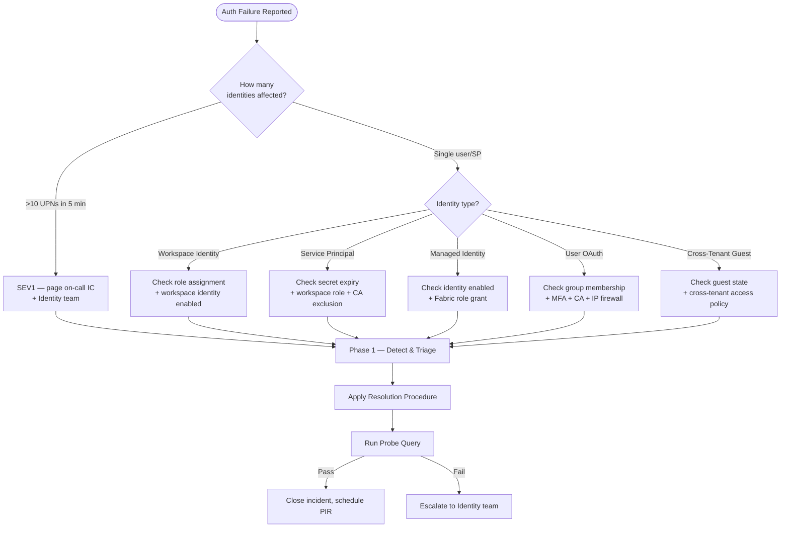

# 🔑 Authentication Failure Playbook

> **Last Updated**: 2026-04-27 | **Phase**: 14 (Wave 1) | **Anchor**: [incident-response-template.md](incident-response-template.md)
> **Audience**: On-call engineers, identity admins, platform SREs
> **Purpose**: Diagnose and resolve Fabric authentication failures across Workspace Identity, Service Principals, Managed Identities, OAuth users, and Conditional Access

<div align="center" markdown>


</div>

---

## Symptoms

| Symptom | Common Surface | Likely Identity Type |
|---------|----------------|----------------------|
| `HTTP 401 Unauthorized` from Fabric REST API | Pipeline activities, fabric-cicd deploys, Power BI refresh | SP secret expired, MI not granted, token expired |
| `HTTP 403 Forbidden` with `AuthorizationFailed` | Lakehouse query, OneLake shortcut, Key Vault read | Workspace Identity missing role, OneLake DAR misconfigured |
| `AADSTS50076` MFA challenge during non-interactive job | Scheduled pipelines, automated refresh | User principal used where SP/MI required |
| `AADSTS700016` / `AADSTS7000215` invalid client / invalid secret | CI/CD job, fabric-cicd-deploy.py | SP secret rotated, expired, or wrong client_id |
| `AADSTS50105` user does not have access to the application | Newly onboarded analyst, guest user | Conditional Access scope, group membership |
| `AADSTS53003` access blocked by Conditional Access | Sudden mass-failure across one location | CA policy change, IP firewall, country block |
| `AADSTS500011` resource principal not found in tenant | Cross-tenant guest, B2B collaboration | Guest user removed, tenant federation broken |
| `Token lifetime exceeded` / `expired_token` | Long-running Spark job, streaming consumer | OAuth refresh token expired |
| `Tenant IP firewall: client IP not allowed` | Remote employee, new VPN egress | Workspace IP firewall rules |
| Mass user lockout — many users 401 simultaneously | All consumers of a workspace | Tenant-level CA change, secret-rotation cascade, region outage |

> **Triage rule:** if >10 distinct UPNs fail within 5 minutes, classify SEV1 and check the [M365 Service Health Dashboard](https://admin.microsoft.com/AdminPortal/Home#/servicehealth) and [Entra ID status page](https://status.azure.com) before assuming a Fabric-side issue.

---

## Severity Classification

> See the master [Severity Matrix](incident-response-template.md#severity-matrix) for SLAs.

| Severity | Trigger | Examples |
|----------|---------|----------|
| **SEV1** | Sudden mass auth failure (>10 UPNs in 5 min); production pipeline halted; compliance reporting blocked; tenant-wide CA misconfiguration | CA policy rolled out tenant-wide blocks all SPs; Workspace Identity disabled in error; KV secret rotated without updating SP binding |
| **SEV2** | Single workspace down; primary CI/CD SPN broken; one production pipeline failing >30 min on auth | fabric-cicd SPN secret expired; Workspace Identity lost role assignment after RG redeploy; IP firewall block of CI runner range |
| **SEV3** | Single user 403; one guest user can't access; non-prod identity issue | Analyst lacks workspace Viewer role; guest user not refreshed since reseed; dev-environment SPN missing |
| **SEV4** | Documentation/UX issue; no production impact | Stale runbook link; non-blocking warning in sign-in logs |

---

## Identity-Type Triage Matrix

Use this matrix as your first move. The identity type drives every downstream step.

| Identity Type | Where Used | Typical Failure Modes | First Diagnostic |
|---------------|-----------|------------------------|-------------------|
| **Workspace Identity** (GA 2026) | Lakehouse → ADLS shortcut, notebook → Key Vault, OneLake DAR | Role assignment missing on target resource; identity disabled at workspace level | List role assignments on principalId from `infra/modules/security/workspace-identity.bicep` outputs |
| **Service Principal** (CI/CD) | fabric-cicd-deploy.py, GitHub Actions, ADO pipelines | Secret expired/rotated; client_id wrong; lost workspace Contributor role; CA policy excluded SP | Check Entra app registration → Certificates & secrets; check workspace role assignments |
| **System-Assigned Managed Identity** | Azure Function calling Fabric REST API | Function app MI not granted Fabric workspace access; resource lacks `system-assigned` enabled | `az resource show ... --query identity` |
| **User-Assigned Managed Identity** | Azure VM, Logic App, Container App | Role assignment missing on target Fabric workspace or downstream Azure resource | `az identity show` + `az role assignment list --assignee <principalId>` |
| **User OAuth (Entra ID)** | Power BI Desktop, Fabric portal, interactive notebook | Token expired; MFA challenge in headless context; CA blocks device | Refresh credentials; inspect token claims at jwt.ms |
| **Conditional Access** | All identities | Policy change blocks legitimate access; missing exclusion; geo-block | List CA policies via Graph API; check sign-in log `conditionalAccessStatus` |
| **IP Firewall** | Workspace, tenant | New VPN egress IP not allowlisted; firewall rules drift | Compare `api.ipify.org` to firewall ranges |
| **Cross-Tenant Guest (B2B)** | External auditors, partners (e.g., NIGC, regulators) | Guest user removed; cross-tenant access settings changed; consent revoked | Check guest user state in target tenant; verify cross-tenant access policy |

---

## Triage Decision Tree



---

## Diagnostic Steps

### 1. Pull Entra Sign-In Logs (KQL)

```kql
// Sign-ins for the failing identity in last 1 hour
SigninLogs
| where TimeGenerated > ago(1h)
| where UserPrincipalName == "spn-fabric-cicd-prod@contoso.onmicrosoft.com"
   or AppDisplayName has "Fabric"
| project TimeGenerated, UserPrincipalName, AppDisplayName, ResourceDisplayName,
          ResultType, ResultDescription, IPAddress, ConditionalAccessStatus
| order by TimeGenerated desc | take 100

// Mass-failure detection in last 15 min
SigninLogs
| where TimeGenerated > ago(15m) and ResultType != 0
| summarize Failures = count(), Sample = any(ResultDescription)
        by UserPrincipalName, AppDisplayName
| where Failures > 3 | order by Failures desc

// Service principal sign-ins (separate table)
AADServicePrincipalSignInLogs
| where TimeGenerated > ago(1h) and ResultType != 0
| project TimeGenerated, ServicePrincipalName, AppId, ResultType, ResultDescription, IPAddress
```

### 2. Inspect Token Claims

For interactive debugging, copy a token (never paste production tokens publicly) and decode at <https://jwt.ms>. Verify:

- `aud` (audience) matches `https://api.fabric.microsoft.com` or `https://analysis.windows.net/powerbi/api`
- `appid` matches expected Service Principal client_id
- `oid` (object id) matches expected principalId
- `roles` / `wids` contain expected app roles
- `exp` is in the future (not expired)
- `tid` (tenant id) is correct tenant

```bash
# Acquire and decode token via Azure CLI (dev only - never run in prod terminals)
az account get-access-token --resource https://api.fabric.microsoft.com \
  --query accessToken -o tsv \
  | cut -d. -f2 | base64 -d 2>/dev/null | jq .
```

### 3. Validate Workspace Identity Role Assignments

```bash
# Resolve the workspace identity principalId from Bicep outputs
PRINCIPAL_ID=$(az identity show \
  --name "id-fabric-ws-fabricpoc-prod" \
  --resource-group "rg-fabric-prod" \
  --query principalId -o tsv)

# List all role assignments for this identity
az role assignment list \
  --assignee "$PRINCIPAL_ID" \
  --all \
  --output table

# Verify expected scopes per workspace-identity.bicep:
#   - Key Vault Secrets User (4633458b-17de-408a-b874-0445c86b69e6)
#   - Storage Blob Data Contributor (ba92f5b4-2d11-453d-a403-e96b0029c9fe)
#   - Purview Data Curator (af8bf84c-4de3-462a-b576-41e6c7478f52) [optional]
```

### 4. Verify Conditional Access Policies via Graph API

```bash
# List enabled CA policies
az rest --method get \
  --url "https://graph.microsoft.com/v1.0/identity/conditionalAccess/policies" \
  --query "value[?state=='enabled'].{name:displayName, id:id}" -o table

# Inspect a specific policy
az rest --method get \
  --url "https://graph.microsoft.com/v1.0/identity/conditionalAccess/policies/${POLICY_ID}"

# Find CA-blocked sign-ins
az rest --method get \
  --url "https://graph.microsoft.com/v1.0/auditLogs/signIns?\$filter=conditionalAccessStatus eq 'failure'&\$top=20"
```

### 5. Check IP Firewall Rules for the Workspace

```bash
# Resolve current public egress IP
CURRENT_IP=$(curl -s https://api.ipify.org)
echo "Current public IP: $CURRENT_IP"

# List workspace firewall rules
az rest --method get \
  --url "https://api.fabric.microsoft.com/v1/workspaces/${WS_ID}/firewallRules" \
  --query "value[].{name:name, start:startIpAddress, end:endIpAddress}" \
  --output table

# Test reachability (should resolve and accept TLS)
nslookup api.fabric.microsoft.com
```

```powershell
# From Windows / SHIR machine
Test-NetConnection -ComputerName "api.fabric.microsoft.com" -Port 443
Test-NetConnection -ComputerName "login.microsoftonline.com" -Port 443
```

### 6. Check Recent Identity Changes (Audit Log)

```kql
// Recent SPN credential changes + CA policy edits in last 24h
AuditLogs
| where TimeGenerated > ago(24h)
| where OperationName has_any (
    "service principal credentials",
    "Certificates and secrets management",
    "conditional access"
)
| project TimeGenerated, OperationName, InitiatedBy, Result, TargetResources
| order by TimeGenerated desc
```

---

## Resolution Procedures

### A. Rotate Service Principal Secret + Update Key Vault Binding

```bash
# 1. Create new SP secret (use --append to retain old secret during rollout)
NEW_SECRET=$(az ad app credential reset --id "${SPN_CLIENT_ID}" --append \
  --years 1 --display-name "rotated-$(date +%Y%m%d)" --query password -o tsv)

# 2. Push to Key Vault (Key Vault retains version history)
az keyvault secret set --vault-name "kv-fabric-prod" \
  --name "fabric-spn-client-secret" --value "$NEW_SECRET"

# 3. Restart cached consumers (Function/Logic apps), then re-trigger failed run
az functionapp restart --name "func-fabric-orchestrator" --resource-group "rg-fabric-prod"
gh workflow run deploy-fabric.yml
```

> **Critical:** Do NOT delete the old secret until the new one is verified. Keep both active for 24h while cached consumers refresh.

### B. Re-Grant Workspace Identity Role Assignments

If the workspace identity lost a role assignment (common after RG redeploy), re-run the Bicep module or grant directly:

```bash
# Direct grants matching workspace-identity.bicep role IDs
az role assignment create --assignee "$PRINCIPAL_ID" --role "Key Vault Secrets User" \
  --scope "/subscriptions/${SUB}/resourceGroups/${RG}/providers/Microsoft.KeyVault/vaults/${KV_NAME}"

az role assignment create --assignee "$PRINCIPAL_ID" --role "Storage Blob Data Contributor" \
  --scope "/subscriptions/${SUB}/resourceGroups/${RG}/providers/Microsoft.Storage/storageAccounts/${STG_NAME}"

# Or re-deploy Bicep idempotently
az deployment group create --resource-group "$RG" \
  --template-file infra/modules/security/workspace-identity.bicep \
  --parameters projectPrefix=fabricpoc environment=prod \
      keyVaultId="/subscriptions/${SUB}/resourceGroups/${RG}/providers/Microsoft.KeyVault/vaults/${KV_NAME}" \
      storageAccountId="/subscriptions/${SUB}/resourceGroups/${RG}/providers/Microsoft.Storage/storageAccounts/${STG_NAME}"
```

### C. Refresh OAuth Tokens (REST API)

For long-running consumers that ran past token expiry:

```bash
# Client credentials flow (SP)
curl -X POST "https://login.microsoftonline.com/${TENANT_ID}/oauth2/v2.0/token" \
  -d "client_id=${CLIENT_ID}" -d "client_secret=${CLIENT_SECRET}" \
  -d "scope=https://api.fabric.microsoft.com/.default" -d "grant_type=client_credentials"

# Refresh token flow (delegated user)
curl -X POST "https://login.microsoftonline.com/${TENANT_ID}/oauth2/v2.0/token" \
  -d "client_id=${CLIENT_ID}" -d "refresh_token=${REFRESH_TOKEN}" \
  -d "grant_type=refresh_token" -d "scope=https://api.fabric.microsoft.com/.default"
```

In notebooks, prefer Workspace Identity (no refresh needed) or `mssparkutils.credentials.getToken()` which auto-refreshes.

### D. Update Conditional Access (with Approval)

> **CHANGE-CONTROL RULE:** Modifying CA policies requires approval from the Identity team Change Advisory Board (CAB). For SEV1, get verbal approval from on-call Identity lead and document in the incident channel; file a retroactive RFC within 24h.

```bash
# Add an exclusion for the impacted SP/group (preferred over disabling policy)
az rest --method patch \
  --url "https://graph.microsoft.com/v1.0/identity/conditionalAccess/policies/${POLICY_ID}" \
  --body '{
    "conditions": {
      "users": {
        "excludeServicePrincipals": ["'"${SPN_OBJECT_ID}"'"]
      }
    }
  }'
```

### E. Whitelist IP Range (Workspace IP Firewall)

```bash
# Add allowed IP range to the workspace
az rest --method post \
  --url "https://api.fabric.microsoft.com/v1/workspaces/${WS_ID}/firewallRules" \
  --body '{
    "name": "GHA-runner-egress-2026-04-27",
    "startIpAddress": "20.42.0.0",
    "endIpAddress": "20.42.0.255"
  }'
```

> Reference IP firewall pattern: see [network-security.md §IP Firewall](../best-practices/network-security.md#️-ip-firewall).

### F. Re-Grant Cross-Tenant Guest Access

```bash
# Re-invite the guest user (idempotent - re-issues invitation if accepted state lost)
az rest --method post \
  --url "https://graph.microsoft.com/v1.0/invitations" \
  --body '{
    "invitedUserEmailAddress": "auditor@partner-tenant.com",
    "inviteRedirectUrl": "https://app.fabric.microsoft.com",
    "sendInvitationMessage": true
  }'

# Add to the appropriate Fabric security group
az ad group member add \
  --group "sg-fabric-casino-prod-viewers" \
  --member-id "${GUEST_OBJECT_ID}"

# Verify cross-tenant access policy allows inbound from partner tenant
az rest --method get \
  --url "https://graph.microsoft.com/v1.0/policies/crossTenantAccessPolicy/partners/${PARTNER_TENANT_ID}"
```

---

## Verification

After applying any resolution, run a probe **as the failing identity** before declaring resolved.

### Probe 1 — Token + Workspace Read

```bash
TOKEN=$(curl -s -X POST "https://login.microsoftonline.com/${TENANT_ID}/oauth2/v2.0/token" \
  -d "client_id=${CLIENT_ID}" -d "client_secret=${NEW_SECRET}" \
  -d "scope=https://api.fabric.microsoft.com/.default" -d "grant_type=client_credentials" \
  | jq -r .access_token)

curl -s -o /dev/null -w "HTTP %{http_code}\n" \
  -H "Authorization: Bearer $TOKEN" \
  "https://api.fabric.microsoft.com/v1/workspaces/${WS_ID}"
```

### Probe 2 — Lakehouse Query (Workspace Identity scenarios)

```python
# Run inside the affected notebook as the workspace identity
spark.sql("SELECT COUNT(*) AS row_count FROM lh_bronze.bronze_slot_telemetry").show()
```

### Probe 3 — Pipeline Smoke Test

```bash
az rest --method post \
  --url "https://api.fabric.microsoft.com/v1/workspaces/${WS_ID}/items/${PIPELINE_ID}/jobs/instances?jobType=Pipeline"
```

### Verification Checklist

- [ ] Probes 1-3 all pass for the affected identity
- [ ] Sign-in logs show `ResultType == 0` for the identity since the fix
- [ ] No new 401/403 alerts firing; affected pipelines complete end-to-end
- [ ] Monitor for **2× the incident duration** before closing (per [Phase 3 verification](incident-response-template.md#33-verify-resolution))

---

## Rollback

If the fix made things worse, roll back **fast**.

| Change | Rollback Step |
|--------|---------------|
| New SP secret pushed to KV | `az keyvault secret set` to previous version (Key Vault keeps history): `az keyvault secret restore` or set value from `az keyvault secret list-versions` |
| CA policy modified | Revert via `az rest --method patch` with prior policy JSON (always snapshot policy before edit: `az rest --method get ... > backup-${POLICY_ID}-$(date +%s).json`) |
| IP firewall rule added | `az rest --method delete --url ".../firewallRules/${RULE_ID}"` |
| Role assignment added | `az role assignment delete --assignee ${PRINCIPAL_ID} --role ${ROLE} --scope ${SCOPE}` |
| Guest user re-invited | Remove from group: `az ad group member remove --group ${GROUP} --member-id ${GUEST_OBJECT_ID}` |
| Bicep redeploy of workspace-identity | Re-deploy from prior commit: `git checkout ${PRIOR_SHA} -- infra/modules/security/workspace-identity.bicep && az deployment group create ...` |

> **Always snapshot before changing identity config.** A 30-second `az rest --method get > backup.json` saves hours of recovery.

---

## Post-Incident Actions

| Action | Owner | Due |
|--------|-------|-----|
| File postmortem using [template](incident-response-template.md#blameless-postmortem-template) | Incident Commander | 48 hr (SEV1/2) |
| Set up secret-expiry alerts in Action Group (90/30/7-day warnings) | Platform Lead | 1 week |
| Automate SP rotation via Key Vault rotation policy or Azure Automation runbook | Identity Team | 30 days |
| Audit-log forensics: confirm no unauthorized access during outage window | Security | 5 business days |
| Update [identity-rbac-patterns.md](../best-practices/identity-rbac-patterns.md) if a new pattern emerged | Doc owner | 5 business days |
| If recurring class: promote action items to P0 (per [PIR rules](incident-response-template.md#42-postmortem-doc)) | IC | At PIR |
| Verify Workspace Identity preferred over SP for all in-Fabric workloads | Platform Lead | Quarterly review |

### Long-Term Hardening

- **Federated credentials over secrets** — replace SP client secrets with OIDC federation for GitHub Actions (`workflow_identity` setting); zero-secrets is the goal.
- **Workspace Identity first** — for any in-Fabric workload, always prefer Workspace Identity (`infra/modules/security/workspace-identity.bicep`) over SPs.
- **Conditional Access staging** — never roll out a new CA policy tenant-wide without a "report-only" pilot phase first.
- **Secret rotation cadence** — enforce 90-day max via tenant policy; alert at 30 days remaining.

---

## Escalation

| When | Escalate To | Channel |
|------|-------------|---------|
| Mass auth failure (>10 UPNs in 5 min) | Identity Team on-call + Incident Commander | Page (SEV1) |
| CA policy needs emergency change | Identity CAB lead | Phone bridge |
| Suspected credential compromise / unauthorized access | Security Operations Center (SOC) | SOC paging line + email security@ |
| Cross-tenant guest issue persists after re-invite | Partner tenant identity admin | Email coordinated by Comms Lead |
| Tenant-wide Entra outage | Microsoft Premier Support (Sev A ticket) | Support portal + reference Service Health incident ID |
| Workspace Identity not propagating roles after 30 min | Microsoft Fabric support (Sev A) | Support portal |
| HIPAA / SOX / NIGC compliance impact during outage | Compliance Officer | Phone + email per [comm tree](incident-response-template.md#external--stakeholder-communication) |

---

## Quick-Reference Commands

### Azure CLI — Create Service Principal + Role Assignment

```bash
# Create app registration + SP
APP=$(az ad app create --display-name "spn-fabric-cicd-prod" --query appId -o tsv)
az ad sp create --id "$APP"

# Add 1-year secret (capture immediately — shown only once)
SECRET=$(az ad app credential reset --id "$APP" --years 1 --query password -o tsv)

# Store in Key Vault
az keyvault secret set --vault-name "kv-fabric-prod" --name "fabric-spn-cicd-secret" --value "$SECRET"

# Grant Fabric workspace Contributor role (via Fabric REST)
PRINCIPAL_ID=$(az ad sp show --id "$APP" --query id -o tsv)
az rest --method post \
  --url "https://api.fabric.microsoft.com/v1/workspaces/${WS_ID}/roleAssignments" \
  --body "{\"principal\":{\"id\":\"${PRINCIPAL_ID}\",\"type\":\"ServicePrincipal\"},\"role\":\"Contributor\"}"
```

### Microsoft Graph KQL — Sign-In Investigation

```kql
// Last hour failures grouped by ResultType (error code)
SigninLogs
| where TimeGenerated > ago(1h)
| where ResultType != 0
| summarize Count = count(), Sample = any(ResultDescription) by ResultType
| order by Count desc
```

```kql
// CA-blocked sign-ins by location
SigninLogs
| where TimeGenerated > ago(24h)
| where ConditionalAccessStatus == "failure"
| summarize Failures = count() by Location, City = tostring(LocationDetails.city)
| order by Failures desc
```

### Bicep — Grant Workspace Identity Role (snippet)

```bicep
// See infra/modules/security/workspace-identity.bicep for the full module
resource grant 'Microsoft.Authorization/roleAssignments@2022-04-01' = {
  name: guid(targetResource.id, workspaceIdentity.id, roleId)
  scope: targetResource
  properties: {
    roleDefinitionId: subscriptionResourceId('Microsoft.Authorization/roleDefinitions', roleId)
    principalId: workspaceIdentity.properties.principalId
    principalType: 'ServicePrincipal'
  }
}
```

### PowerShell — IP Firewall Validation

```powershell
# Validate connectivity from the failing host
Test-NetConnection -ComputerName "api.fabric.microsoft.com" -Port 443
Test-NetConnection -ComputerName "login.microsoftonline.com" -Port 443
Test-NetConnection -ComputerName "onelake.dfs.fabric.microsoft.com" -Port 443

# Get current public egress IP (compare to firewall allowlist)
(Invoke-RestMethod "https://api.ipify.org?format=json").ip
```

### REST — Probe Token + Workspace Read

```bash
TOKEN=$(az account get-access-token --resource https://api.fabric.microsoft.com --query accessToken -o tsv)

curl -s -H "Authorization: Bearer $TOKEN" \
  "https://api.fabric.microsoft.com/v1/workspaces/${WS_ID}" | jq .
```

---

## Related Runbooks

| Runbook | When to Use |
|---------|-------------|
| [Incident Response Template](incident-response-template.md) | Anchor — severity matrix, comms tree, postmortem template |
| [Pipeline Failure Triage](pipeline-failure-triage.md) | If auth failure surfaced as pipeline activity error |
| [Capacity Throttling Response](capacity-throttling-response.md) | If 401/403 mistakenly tied to capacity issues |
| [Tenant Migration (Dev/Staging/Prod)](tenant-migration-dev-staging-prod.md) | If failure followed a recent tenant promotion |
| [Multi-Region Failover](multi-region-failover.md) | If region-wide Entra ID outage suspected |

## Related Best-Practice Docs

| Document | Description |
|----------|-------------|
| [Identity & RBAC Patterns](../best-practices/identity-rbac-patterns.md) | Workspace roles, RLS/CLS/OLS, service identity selection |
| [Network Security](../best-practices/network-security.md) | IP Firewall, Conditional Access integration, private endpoints |
| [OneLake Security](../features/onelake-security.md) | Data Access Roles, OneLake-level RLS/CLS |
| [Customer-Managed Keys](../best-practices/customer-managed-keys.md) | KV-bound encryption keys; auth-related failures when KV access lost |
| [SQL Audit Logs Compliance](../best-practices/sql-audit-logs-compliance.md) | Audit trail for compliance investigation post-incident |
| [fabric-cicd Deployment](../best-practices/fabric-cicd-deployment.md) | SP-based CI/CD patterns; secret management |

---

[⬆️ Back to Top](#-authentication-failure-playbook) | [📚 Runbooks Index](index.md) | [🏠 Home](../index.md)
