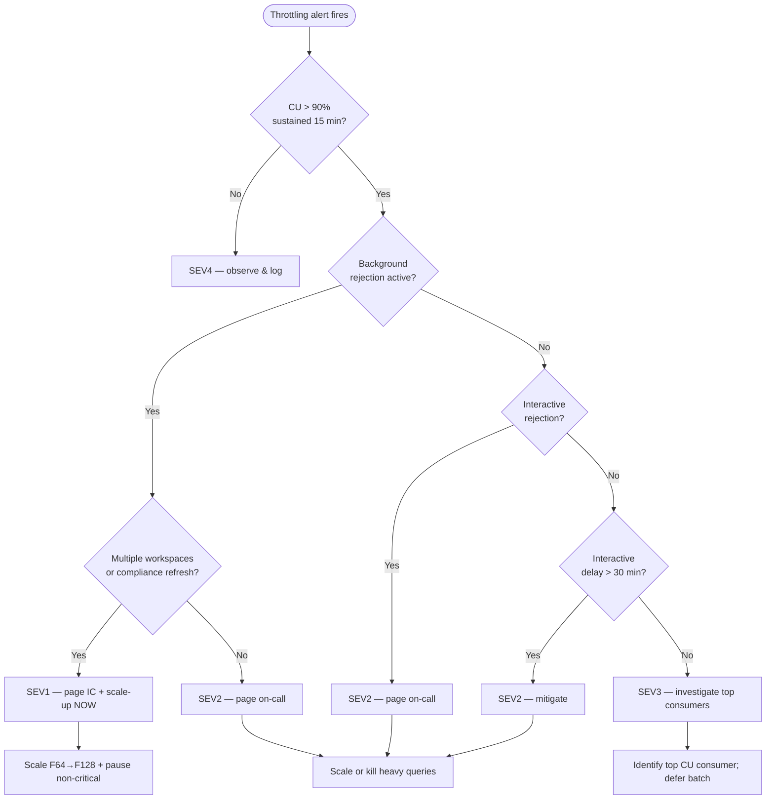

# 🚨 Capacity Throttling Response

> **Last Updated**: 2026-04-27 | **Phase**: 14 (Wave 1)
> **Audience**: On-call engineers, capacity admins, FinOps, SRE
> **Purpose**: Stop the bleeding when Fabric capacity throttling impacts production workloads — restore CU headroom, drain queued requests, and prevent recurrence.
> **Anchor**: This runbook follows the structure of [Incident Response Template](incident-response-template.md). Read that first if you are new to incident response.

<div align="center" markdown>


</div>

---

## 🔥 Symptoms

Capacity throttling occurs when sustained CU demand exceeds the SKU's allocated CU and Fabric's smoothing buffer is exhausted. Symptoms are graded by severity of throttle state.

| Indicator | Threshold | Where to Observe |
|-----------|-----------|------------------|
| **CU Utilization** | `> 90%` sustained for `≥ 15 min` | Capacity Metrics App → Utilization tab |
| **Smoothing Buffer Used** | `> 80%` of 24-hour smoothing window | Capacity Metrics App → Throttling tab |
| **Background Rejection** | Any background job rejected (refreshes, scheduled pipelines) | Throttling tab → "Background rejection" timeline |
| **Interactive Delay** | Interactive queries delayed `> 20 sec` | Throttling tab → "Interactive delay" timeline |
| **Interactive Rejection** | Power BI / SQL queries return `429 Too Many Requests` | Throttling tab → "Interactive rejection" |
| **Queued Requests** | `capacity_metrics.queued_requests > 0` for `≥ 5 min` | Workspace Monitoring → `system.capacity_metrics` |
| **Spark Session Wait** | New sessions take `> 60 sec` to start | Spark monitoring → session wait time |
| **Power BI Reports** | Report load `> 30 sec`, refreshes failing with `CapacityNotAvailable` | Power BI workspace → refresh history |
| **SQL Endpoint** | Queries fail with `Resource governance: too many requests` | Warehouse / SQL endpoint query history |
| **Eventhouse / KQL** | Ingestion lag growing, queries returning `LimitExceeded` | Real-Time Hub → ingestion metrics |

> **Fabric throttling vs. rejection** — Fabric uses a graduated response: first **interactive delay** (queries slowed), then **interactive rejection** (queries refused), then **background rejection** (refreshes refused). Background rejection means smoothing is fully exhausted.

---

## 🎯 Severity Classification

Map throttling impact to the [SEV matrix](incident-response-template.md#severity-matrix) from the anchor template.

| Severity | Throttling State | Customer Impact | Response SLA |
|----------|------------------|-----------------|--------------|
| **SEV1** | Background + interactive **rejection** active across multiple workspaces; SOX/compliance refreshes failing | Region-wide BI outage; pipelines failing; revenue-impacting reports stale | **5 min** page |
| **SEV2** | Sustained CU `> 95%` for `≥ 30 min`; interactive delay; one workspace down | Power BI users see slow reports; one prod pipeline failing | **15 min** page |
| **SEV3** | CU `90–95%` with intermittent throttling; degraded but workable | Slow queries, no outright failures; non-prod impact only | **2 hr** ack |
| **SEV4** | Brief CU spike `> 90%` self-resolving in `< 15 min` | None; investigate proactively | **24 hr** ack |

### Decision Tree



---

## 🔍 Diagnostic Steps

### 1. Confirm Throttle State (Capacity Metrics App)

```
Navigate to: app.powerbi.com → Apps → Microsoft Fabric Capacity Metrics
1. Select capacity (e.g., fabric-casino-prod)
2. Open "Utilization" page → check CU% timeline (last 24h)
3. Open "Throttling" page → look for orange/red bands:
   - Green band:  Interactive delay
   - Orange band: Interactive rejection
   - Red band:    Background rejection (CRITICAL)
4. Click "TimePoint" drill-through to see top items by CU at the spike
```

### 2. Pull Top CU Consumers (KQL — Workspace Monitoring)

```kql
// Top 10 CU consumers in the last hour, broken down by workload type
FabricCapacityMetrics
| where TimeGenerated > ago(1h)
| summarize TotalCU = sum(CUSeconds), PeakSessions = max(ActiveSessions)
    by ItemName, ItemType, WorkspaceName
| top 10 by TotalCU desc
```

```kql
// Throttle events per 5-min bucket — confirms smoothing exhaustion
FabricCapacityMetrics
| where TimeGenerated > ago(2h)
| summarize
    ThrottleEvents = countif(ThrottleEvent == true),
    QueuedRequests = max(QueuedRequests),
    CUConsumed = sum(CUConsumed),
    CUThrottled = sum(CUThrottled)
    by bin(TimeGenerated, 5m)
| order by TimeGenerated asc
```

### 3. Find Long-Running Queries (Workspace Monitoring `sql_queries`)

```sql
-- SQL queries currently exceeding 60s — candidates to kill
SELECT
    query_id,
    item_name        AS endpoint,
    user_email,
    SUBSTRING(query_text, 1, 200) AS query_preview,
    DATEDIFF(SECOND, start_time, CURRENT_TIMESTAMP) AS running_seconds,
    rows_scanned,
    cu_seconds
FROM system.sql_queries
WHERE status = 'Running'
  AND start_time < DATEADD(SECOND, -60, CURRENT_TIMESTAMP)
ORDER BY running_seconds DESC;
```

### 4. Find Heavy Spark Sessions

```sql
-- Active Spark sessions and CU consumption rate
SELECT
    item_name           AS notebook,
    user_email,
    start_time,
    DATEDIFF(SECOND, start_time, CURRENT_TIMESTAMP) AS running_seconds,
    executor_count,
    cu_seconds,
    ROUND(cu_seconds / NULLIF(DATEDIFF(SECOND, start_time, CURRENT_TIMESTAMP), 0), 2)
        AS cu_per_second
FROM system.spark_sessions
WHERE status = 'Running'
ORDER BY cu_seconds DESC;
```

### 5. Capacity Status via REST

```bash
# Get current SKU + state
az rest --method get \
  --url "https://management.azure.com/subscriptions/${SUB_ID}/resourceGroups/${RG}/providers/Microsoft.Fabric/capacities/${CAPACITY_NAME}?api-version=2023-11-01" \
  --query "{name:name, sku:sku.name, state:properties.state, region:location}"
```

### 6. Triage Checklist

- [ ] Confirm alert is real — Capacity Metrics App shows red/orange band
- [ ] Note time of first throttle event (becomes T0 for postmortem timeline)
- [ ] Identify dominant workload type (Spark / SQL / Pipeline / RTI / Power BI)
- [ ] Identify top 3 CU consumers by item
- [ ] Check [Microsoft Fabric Status Page](https://support.fabric.microsoft.com/support/) for region-level issues
- [ ] Snapshot Capacity Metrics App (screenshot) — postmortem evidence
- [ ] Open incident channel per [naming convention](incident-response-template.md#incident-channel-conventions)

---

## 🧭 Common Root Causes

| Root Cause | Indicator | Mitigation Pattern |
|------------|-----------|-------------------|
| **Runaway Spark notebook** | One notebook consumes `> 50%` of total CU; `cu_per_second` outlier | Cancel session; scale up SKU; review notebook for cartesian joins / missing partition filters |
| **Power BI mass refresh** | Spike at top of hour from scheduled refreshes; `RefreshSchedule` overlap | Stagger refresh times; convert imports to Direct Lake; raise SKU during refresh window |
| **Unindexed Warehouse query** | Single query `> 5 min`; `bytes_scanned > 100 GB`; no statistics | Kill query; ANALYZE TABLE; add result-set caching; rewrite with predicate pushdown |
| **Pipeline parallelism storm** | `pipeline_runs` shows N concurrent activities; queue depth growing | Reduce pipeline `maxConcurrency`; defer batch jobs; add staggered triggers |
| **Eventstream backlog** | Eventhouse ingestion lag growing; KQL queries throttled | Scale Eventhouse CU; pause non-critical eventstreams; check upstream Event Hub |
| **Smoothing exhaustion** | Sustained `> 100%` CU for `> 24 h` (smoothing window full) | Scale SKU one tier — burst credit is gone, only base capacity remains |
| **Unbounded Direct Lake fallback** | Power BI queries falling back to DirectQuery; high SQL CU | Refresh Direct Lake framing; check `DirectLakeOnly` flag; reload semantic model |
| **Noisy neighbor (shared capacity)** | Throttle on prod despite normal prod workload; dev workspace busy | Move dev to separate capacity; pause dev workspace temporarily |
| **Materialized view rebuild** | KQL ingestion CU spike; MV with broad partition scope | Pause MV refresh; rebuild during off-peak; narrow partition |
| **AutoML / Data Agent loop** | New unfamiliar item in top consumers; sustained Spark CU | Cancel job; gate AutoML in policy; isolate to separate capacity |

---

## 🔧 Resolution Procedures

> **Order of operations:** kill the bleeding (cancel the worst offender), then add headroom (scale up), then prevent reflood (defer batch). Do not scale up before identifying the offender — you may be funding a bug.

### 4.1 Cancel the Worst Offender

#### Kill a Long-Running Warehouse / SQL Endpoint Query

```sql
-- Step 1 — find the session_id (Warehouse)
SELECT session_id, login_name, start_time, command, status
FROM sys.dm_exec_sessions
WHERE status = 'running'
  AND DATEDIFF(SECOND, login_time, CURRENT_TIMESTAMP) > 60;

-- Step 2 — kill it
KILL 12345;   -- replace with session_id from above
```

For Lakehouse SQL endpoint (read-only), terminate via portal:

```
Navigate to: Workspace → Lakehouse → SQL analytics endpoint → Query insights
Select query → Cancel
```

#### Cancel a Spark Notebook Session

```python
# Inside a separate notebook, list and cancel sessions
import sempy.fabric as fabric

sessions = fabric.list_items(type="SparkApplication")
print(sessions[sessions["State"] == "Running"][["Name", "Id", "State"]])

# Cancel a specific session (Livy API)
import requests
from azure.identity import DefaultAzureCredential
token = DefaultAzureCredential().get_token("https://api.fabric.microsoft.com/.default").token

session_id = "<session-guid>"
workspace_id = "<workspace-guid>"
requests.delete(
    f"https://api.fabric.microsoft.com/v1/workspaces/{workspace_id}/spark/sessions/{session_id}",
    headers={"Authorization": f"Bearer {token}"},
).raise_for_status()
```

Or via the UI: `Workspace → Monitor → Spark applications → select → Cancel`.

#### Pause a Misbehaving Pipeline

```bash
# Disable a pipeline trigger to prevent re-runs while you investigate
az rest --method post \
  --url "https://api.fabric.microsoft.com/v1/workspaces/${WS_ID}/dataPipelines/${PIPELINE_ID}/jobs/instances/${RUN_ID}/cancel?jobType=Pipeline" \
  --headers "Content-Type=application/json"
```

### 4.2 Scale-Up via Azure REST / CLI (F64 → F128)

```bash
# Vertical scale — temporary mitigation. Billing prorates by minute.
SUB_ID="<subscription-id>"
RG="rg-fabric-prod"
CAPACITY_NAME="fabric-casino-prod"

az rest --method patch \
  --url "https://management.azure.com/subscriptions/${SUB_ID}/resourceGroups/${RG}/providers/Microsoft.Fabric/capacities/${CAPACITY_NAME}?api-version=2023-11-01" \
  --body '{"sku": {"name": "F128", "tier": "Fabric"}}'

# Verify scale-up completed (state should be "Active", sku.name "F128")
az rest --method get \
  --url "https://management.azure.com/subscriptions/${SUB_ID}/resourceGroups/${RG}/providers/Microsoft.Fabric/capacities/${CAPACITY_NAME}?api-version=2023-11-01" \
  --query "{sku:sku.name, state:properties.state}"
```

> **Scaling is online** — no workspace downtime. Active sessions continue. New CU is available within `~60 sec`. Cost doubles per tier.

| From | To | CU Δ | Approx. Hourly Cost Δ (PAYG, East US) |
|------|----|------|---------------------------------------|
| F64 | F128 | +64 | +$11.50/hr |
| F128 | F256 | +128 | +$23/hr |
| F256 | F512 | +256 | +$46/hr |

### 4.3 Pause Non-Critical Workspaces on Shared Capacity

If multiple workspaces share the throttled capacity, pause the lowest-priority workspace to free CU.

```python
# Pause a non-critical capacity (e.g., dev capacity sharing a tenant)
import requests
from azure.identity import DefaultAzureCredential

token = DefaultAzureCredential().get_token("https://management.azure.com/.default").token
sub_id, rg, cap = "<sub>", "rg-fabric-dev", "fabric-casino-dev"

requests.post(
    f"https://management.azure.com/subscriptions/{sub_id}/resourceGroups/{rg}"
    f"/providers/Microsoft.Fabric/capacities/{cap}/suspend?api-version=2023-11-01",
    headers={"Authorization": f"Bearer {token}"},
).raise_for_status()
```

> Note: this pauses the **capacity**, not a workspace. To shift workspaces off a busy capacity without pausing, reassign:
>
> ```bash
> az rest --method post \
>   --url "https://api.fabric.microsoft.com/v1/workspaces/${WS_ID}/assignToCapacity" \
>   --body '{"capacityId": "<low-priority-capacity-id>"}'
> ```

### 4.4 Defer Batch Jobs (Pipeline Pause)

```bash
# Disable a scheduled trigger via REST
az rest --method patch \
  --url "https://api.fabric.microsoft.com/v1/workspaces/${WS_ID}/dataPipelines/${PIPELINE_ID}" \
  --body '{"properties": {"enabled": false}}'

# Or pause via Power BI Admin REST (legacy datasets)
az rest --method post \
  --url "https://api.powerbi.com/v1.0/myorg/groups/${WS_ID}/datasets/${DS_ID}/refreshSchedule" \
  --body '{"value": {"enabled": false}}'
```

For ad-hoc deferral, set the pipeline's next-scheduled-run window to off-peak (e.g., shift 9 AM batch to 10 PM).

### 4.5 Burst & Smoothing Window Tactics

Fabric **smooths CU consumption over 24 hours** for background operations. If you have unused CU earlier in the day, brief bursts are absorbed without throttling. To recover smoothing capacity:

| Tactic | When to Use | How |
|--------|-------------|-----|
| **Idle window pause** | Throttle event resolved, but smoothing buffer still drained | Pause capacity for 1–2 hr to "reset" the 24h window — incoming work resumes with full burst credit |
| **Throttle deferral** | Smoothing nearly full, jobs still queueing | Defer all non-critical batch by 4–6 hr — gives smoothing window time to roll forward |
| **Workload move** | Single workload (e.g., RTI) saturating | Move workload to a sibling capacity with available headroom (assignToCapacity) |
| **Temp scale + defer** | Aggressive burst expected (month-end close) | Scale up 2 hr before peak, defer batch from peak hour, scale down 2 hr after |

### 4.6 Bulk-Kill Long-Running Queries (SEV1 only)

For SEV1 only, after notifying the workspace owner channel, iterate `sys.dm_exec_sessions` and `KILL` sessions running `> 5 min` (excluding your own). Use sparingly — kills may cause transaction rollback.

---

## ✅ Verification

After mitigation, confirm recovery before declaring resolved.

### Verification Checklist

- [ ] **CU Utilization** back below `70%` sustained for `≥ 15 min` (Capacity Metrics App → Utilization)
- [ ] **No active throttle bands** in Throttling page (no orange/red for `≥ 15 min`)
- [ ] **Smoothing buffer** recovering (target `< 50%` consumed within 1 hr)
- [ ] **Queued requests** = 0 in `system.capacity_metrics`
- [ ] **Power BI report load** time `< 5 sec` for sample reports (test 3 representative reports)
- [ ] **SQL endpoint** sample query `< 10 sec` for typical Gold table aggregation
- [ ] **Spark session** new session start time `< 30 sec`
- [ ] **Pipeline runs** scheduled batch completes within normal SLA
- [ ] **No new alerts** firing from Capacity / Throttling alert rules
- [ ] **Monitor for 2× incident duration** before declaring resolved (per [anchor template §3.3](incident-response-template.md#33-verify-resolution))

### Verification KQL

```kql
// Confirm throttle has cleared — last 30 min
FabricCapacityMetrics
| where TimeGenerated > ago(30m)
| summarize
    MaxCU = max(CUConsumed),
    AvgCU = avg(CUConsumed),
    ThrottleEvents = countif(ThrottleEvent == true),
    MaxQueued = max(QueuedRequests)
| extend Status = case(
    ThrottleEvents > 0,           "STILL THROTTLING",
    AvgCU > 80,                   "ELEVATED — keep watching",
    AvgCU < 70 and MaxQueued == 0,"RECOVERED",
    "MIXED")
```

---

## ⏪ Rollback (Scale-Down)

After a temporary scale-up (e.g., F64 → F128), scale back to baseline once load stabilizes — typically 4–8 hr after recovery.

### Pre-Rollback Verification

- [ ] CU has held below `60%` of **target SKU** for `≥ 4 hr`
- [ ] No throttle events in last `2 hr`
- [ ] No queued requests in last `1 hr`
- [ ] Postmortem root cause identified (otherwise leave scaled until fix lands)
- [ ] Stakeholder notified — scale-down window is the highest-risk moment for re-throttle

### Scale-Down Sequence

```bash
# 1. Cordon non-critical workloads (optional safety net)
#    Pause large batch jobs that could refire during/just-after scale-down

# 2. Patch SKU back to baseline
az rest --method patch \
  --url "https://management.azure.com/subscriptions/${SUB_ID}/resourceGroups/${RG}/providers/Microsoft.Fabric/capacities/${CAPACITY_NAME}?api-version=2023-11-01" \
  --body '{"sku": {"name": "F64", "tier": "Fabric"}}'

# 3. Wait 5 min and re-check throttle state
az rest --method get \
  --url "https://management.azure.com/subscriptions/${SUB_ID}/resourceGroups/${RG}/providers/Microsoft.Fabric/capacities/${CAPACITY_NAME}?api-version=2023-11-01" \
  --query "{sku:sku.name, state:properties.state}"

# 4. Resume any cordoned workloads
```

### If Scale-Down Triggers Re-Throttle

1. Immediately scale back up (`F64 → F128`).
2. Reclassify as **incident not resolved** — root cause remains.
3. Block scale-down until permanent fix (query optimization, SKU baseline change, workload separation) is deployed.

---

## 🧪 Post-Incident Actions

Within `48 hr` of resolution (SEV1/SEV2):

### FinOps Review

- [ ] Calculate **incident cost**: scale-up duration × delta-rate (e.g., 4 hr × $11.50 = $46)
- [ ] Calculate **recurring cost** if SKU baseline must rise to prevent recurrence
- [ ] Compare to cost of permanent fix (engineer time × hours)
- [ ] Recommend: hold at higher SKU, return to baseline + fix, or split workloads across capacities
- [ ] Update [Capacity Planning doc](../best-practices/capacity-planning-cost-optimization.md) if baseline changes

### Query Optimization Candidates

Pull last 7 days of CU consumption and rank candidates:

```sql
-- Top 20 queries by total CU last 7 days — prioritize for optimization
SELECT
    item_name           AS endpoint,
    query_hash,
    SUBSTRING(MAX(query_text), 1, 200)             AS sample_query,
    COUNT(*)                                       AS execution_count,
    ROUND(SUM(cu_seconds), 2)                      AS total_cu_seconds,
    ROUND(AVG(cu_seconds), 2)                      AS avg_cu_per_run,
    ROUND(AVG(bytes_scanned) / 1073741824.0, 2)    AS avg_gb_scanned
FROM system.sql_queries
WHERE start_time >= DATEADD(DAY, -7, CURRENT_TIMESTAMP)
  AND status = 'Succeeded'
GROUP BY item_name, query_hash
ORDER BY total_cu_seconds DESC
LIMIT 20;
```

For each top consumer:

- [ ] Verify predicate pushdown (filter pushed to storage)
- [ ] Confirm V-Order on target Delta tables
- [ ] Check for missing statistics (`ANALYZE TABLE`)
- [ ] Consider materialized view if pattern is repeated
- [ ] Convert imports to Direct Lake where applicable

### Autoscale Evaluation

- [ ] Decide: manual escalation (page) vs. programmatic auto-scale
- [ ] If auto-scale: define guardrails — max SKU ceiling, scale-cooldown, business-hour window
- [ ] Reference auto-scale pattern in [Capacity Planning doc §Strategy 1](../best-practices/capacity-planning-cost-optimization.md#strategy-1-auto-scale-capacity)

### Postmortem

- [ ] Schedule PIR within 48 hr (per [anchor template §4](incident-response-template.md#phase-4--post-incident-review-pir))
- [ ] Use [Blameless Postmortem Template](incident-response-template.md#blameless-postmortem-template)
- [ ] Publish to `docs/postmortems/{YYYY-MM-DD}-capacity-throttle.md`
- [ ] Track action items with owner + due date in Archon

---

## 📞 Escalation Path

| Time From Detection | Action | Owner |
|---------------------|--------|-------|
| **0 min** | Page on-call (PagerDuty) | Alert rule |
| **5 min** | On-call ack; open incident channel | On-call engineer |
| **15 min (SEV1/2)** | Engage Platform Lead | On-call |
| **30 min (SEV1)** | Engage Incident Commander; notify VP Eng | Platform Lead |
| **45 min (SEV1)** | Notify CTO/CDO; consider tenant-wide banner | VP Eng |
| **60 min (SEV1)** | Compliance Officer (if SOX/HIPAA refresh missed); Legal (if SLA breach) | Incident Commander |

External communications follow the [Stakeholder Update Template](incident-response-template.md#stakeholder-update-template).

---

## ⚡ Quick-Reference Commands

### Azure CLI — Capacity Lifecycle

```bash
# Show current SKU / state
az rest --method get \
  --url "https://management.azure.com/subscriptions/${SUB_ID}/resourceGroups/${RG}/providers/Microsoft.Fabric/capacities/${CAPACITY_NAME}?api-version=2023-11-01"

# Scale up
az rest --method patch \
  --url "https://management.azure.com/subscriptions/${SUB_ID}/resourceGroups/${RG}/providers/Microsoft.Fabric/capacities/${CAPACITY_NAME}?api-version=2023-11-01" \
  --body '{"sku": {"name": "F128", "tier": "Fabric"}}'

# Pause capacity
az rest --method post \
  --url "https://management.azure.com/subscriptions/${SUB_ID}/resourceGroups/${RG}/providers/Microsoft.Fabric/capacities/${CAPACITY_NAME}/suspend?api-version=2023-11-01"

# Resume capacity
az rest --method post \
  --url "https://management.azure.com/subscriptions/${SUB_ID}/resourceGroups/${RG}/providers/Microsoft.Fabric/capacities/${CAPACITY_NAME}/resume?api-version=2023-11-01"
```

### Power BI Admin REST — Workload Control

```bash
# List capacities and assigned workspaces
az rest --method get \
  --url "https://api.powerbi.com/v1.0/myorg/admin/capacities"

# Reassign workspace to different capacity
az rest --method post \
  --url "https://api.fabric.microsoft.com/v1/workspaces/${WS_ID}/assignToCapacity" \
  --body '{"capacityId": "<target-capacity-id>"}'

# Disable a dataset's scheduled refresh (defer batch)
az rest --method patch \
  --url "https://api.powerbi.com/v1.0/myorg/groups/${WS_ID}/datasets/${DS_ID}/refreshSchedule" \
  --body '{"value": {"enabled": false}}'
```

### KQL — Workspace Monitoring

```kql
// Throttle event timeline (5-min buckets)
FabricCapacityMetrics
| where TimeGenerated > ago(4h)
| summarize ThrottleCount = countif(ThrottleEvent == true),
            CU = sum(CUConsumed)
            by bin(TimeGenerated, 5m), WorkloadType
| render timechart
```

```kql
// Smoothing window utilization (last 24h)
FabricCapacityMetrics
| where TimeGenerated > ago(24h)
| summarize TotalCU = sum(CUConsumed) by bin(TimeGenerated, 1h)
| extend RollingCU24h = row_cumsum(TotalCU)
| project TimeGenerated, TotalCU, RollingCU24h
```

### Python — Cancel Spark Session

```python
import requests
from azure.identity import DefaultAzureCredential
token = DefaultAzureCredential().get_token("https://api.fabric.microsoft.com/.default").token
requests.delete(
    f"https://api.fabric.microsoft.com/v1/workspaces/{WS_ID}/spark/sessions/{SESS_ID}",
    headers={"Authorization": f"Bearer {token}"},
).raise_for_status()
```

---

## 🔗 Related Runbooks

| Runbook | When to Use |
|---------|-------------|
| [Incident Response Template](incident-response-template.md) | **Anchor** — severity matrix, comms tree, postmortem template |
| [Pipeline Failure Triage](pipeline-failure-triage.md) | Pipeline failed because of throttle-induced rejection |
| [Auth Failure Playbook](auth-failure-playbook.md) | Workspace Identity / SP failures (separate symptom) |
| [Multi-Region Failover](multi-region-failover.md) | Throttling caused by region-wide outage; failover to secondary |
| [Tenant Migration (Dev/Staging/Prod)](tenant-migration-dev-staging-prod.md) | Workspace reassignment between capacities |
| [Data Quality Incident](data-quality-incident.md) | Throttle masked a data quality breach upstream |

## 📚 Related Best-Practice Docs

| Document | Description |
|----------|-------------|
| [Capacity Planning & Cost Optimization](../best-practices/capacity-planning-cost-optimization.md) | SKU sizing, smoothing model, auto-scale, V-Order, predicate pushdown |
| [Workspace Monitoring](../features/workspace-monitoring.md) | `system.capacity_metrics`, `sql_queries`, `spark_sessions` schemas |
| [Monitoring & Observability](../best-practices/monitoring-observability.md) | Custom dashboards, alert wiring |
| [Alerting & Data Activator](../best-practices/alerting-data-activator.md) | Throttle alert rules, Action Group fan-out |
| [Error Handling & Monitoring](../best-practices/error-handling-monitoring.md) | Pipeline error architecture |
| [Performance Optimization](../best-practices/performance-parallelism.md) | Spark tuning, V-Order, Z-Order |
| [Disaster Recovery & BCDR](../best-practices/disaster-recovery-bcdr.md) | Capacity failover patterns |

---

[⬆️ Back to Top](#-capacity-throttling-response) | [📚 Runbooks Index](index.md) | [🏠 Home](../index.md)
