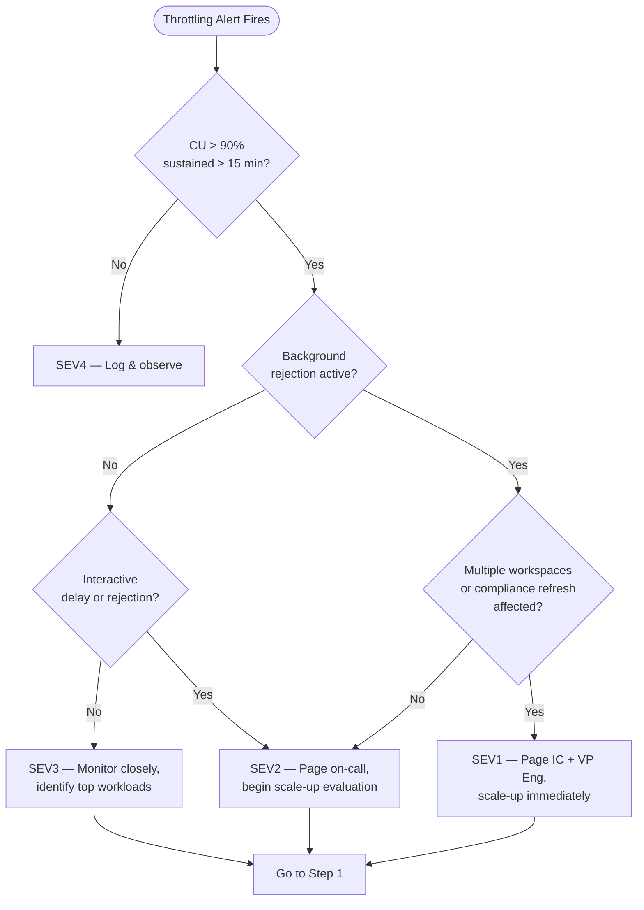

# 🔥 Capacity Throttling Runbook

> **Last Updated**: 2026-05-05 | **Version**: 1.0
> **Audience**: On-call engineers, capacity admins, FinOps, SRE
> **Purpose**: Detect throttling, perform root cause analysis, understand smoothing/rejection behavior, scale capacity, and optimize CU consumption.

<div align="center" markdown>


</div>

---

## Trigger Conditions

Use this runbook when any of the following conditions are observed:

| # | Condition | Detection Source |
|---|-----------|------------------|
| 1 | CU utilization `> 90%` sustained for `≥ 15 min` | Capacity Metrics App → Utilization tab |
| 2 | Background rejection active (scheduled refreshes, pipelines rejected) | Capacity Metrics App → Throttling tab |
| 3 | Interactive delay — Power BI / SQL queries delayed `> 20 sec` | Throttling tab → Interactive delay timeline |
| 4 | Interactive rejection — queries returning `429 Too Many Requests` | Throttling tab → Interactive rejection |
| 5 | Spark session start time `> 60 sec` | Spark monitoring → session wait time |
| 6 | Queued requests `> 0` for `≥ 5 min` | Workspace Monitoring → `system.capacity_metrics` |
| 7 | Eventhouse ingestion lag growing with `LimitExceeded` errors | Real-Time Hub → ingestion metrics |
| 8 | Data Activator / Azure Monitor alert for capacity threshold breach | Alert notification channel |

---

## Severity Classification

| Severity | Throttling State | Customer Impact | Response SLA |
|----------|------------------|-----------------|--------------|
| **SEV1** | Background + interactive **rejection** across multiple workspaces; compliance refreshes failing | Region-wide BI outage; revenue-impacting reports stale | **5 min** page |
| **SEV2** | Sustained CU `> 95%` for `≥ 30 min`; interactive delay; single workspace affected | Slow reports for end users; one prod pipeline failing | **15 min** page |
| **SEV3** | CU `90–95%` with intermittent throttling; degraded but workable | Slow queries, no outright failures; non-prod impact only | **2 hr** ack |
| **SEV4** | Brief CU spike `> 90%` self-resolving in `< 15 min` | None observed; investigate proactively | **24 hr** ack |

---

## Decision Flowchart



---

## Step-by-Step Procedure

### Phase 1 — Detect and Triage (0–15 min)

**Step 1.** Open the **Capacity Metrics App** in the Fabric Admin Portal and navigate to the **Utilization** tab. Record the current CU utilization percentage and the duration it has exceeded 90%.

**Step 2.** Navigate to the **Throttling** tab. Determine the current throttle state:
   - **Smoothing only** — CU debt is being amortized over the 24-hour window.
   - **Background rejection** — scheduled operations are being refused.
   - **Interactive delay** — ad-hoc queries are queued.
   - **Interactive rejection** — ad-hoc queries return `429`.

**Step 3.** Classify severity using the table above and the decision flowchart.

**Step 4.** If SEV1 or SEV2, open an incident channel and page the on-call engineer using the [escalation path](#escalation-path).

### Phase 2 — Identify Root Cause (15–45 min)

**Step 5.** Run the following KQL query in Workspace Monitoring to identify the top CU-consuming items over the last hour:

```kql
system_capacity_metrics
| where Timestamp > ago(1h)
| summarize TotalCU = sum(CUSeconds) by WorkspaceName, ItemName, ItemType
| order by TotalCU desc
| take 20
```

**Step 6.** Cross-reference the top consumers against expected workloads:
   - Is a scheduled refresh running outside its normal window?
   - Is a notebook running an unoptimized query?
   - Is an ad-hoc Power BI report scanning a large table without filters?
   - Is an Eventhouse ingestion burst consuming excess CU?

**Step 7.** Check for **runaway operations**:

```kql
system_spark_jobs
| where Timestamp > ago(2h)
| where Status == "Running"
| where DurationMinutes > 60
| project WorkspaceName, NotebookName, DurationMinutes, CUConsumed
| order by CUConsumed desc
```

**Step 8.** If a single workload is responsible for `> 50%` of CU consumption, proceed to Phase 3A (Kill / Reschedule). Otherwise proceed to Phase 3B (Scale-Up).

### Phase 3A — Mitigate by Workload Management

**Step 9.** Cancel the offending operation:
   - **Notebook/Spark job**: Navigate to **Workspace → Monitor → Running Jobs** → Cancel.
   - **Pipeline activity**: Navigate to **Data Factory → Monitor** → Cancel run.
   - **Power BI query**: Identify via SQL endpoint query history → Terminate session.

**Step 10.** If the workload is a scheduled refresh, reschedule it to an off-peak window:

```powershell
# Example: reschedule dataset refresh via REST API
$body = @{
    value = @{
        days   = @("Sunday")
        times  = @("02:00")
        enabled = $true
    }
} | ConvertTo-Json -Depth 3

Invoke-PowerBIRestMethod -Method Patch `
  -Url "groups/$workspaceId/datasets/$datasetId/refreshSchedule" `
  -Body $body
```

**Step 11.** Monitor CU utilization for 15 minutes. If utilization drops below 80%, proceed to Phase 4.

### Phase 3B — Mitigate by Scaling Capacity

**Step 12.** Scale the Fabric capacity to the next SKU tier:

```bash
az resource update \
  --resource-group rg-fabric-prod \
  --name fabric-casino-capacity \
  --resource-type "Microsoft.Fabric/capacities" \
  --set properties.administration.members="[]" sku.name="F128"
```

**Step 13.** Wait 2–5 minutes for the scale operation to complete. Verify via:

```bash
az resource show \
  --resource-group rg-fabric-prod \
  --name fabric-casino-capacity \
  --resource-type "Microsoft.Fabric/capacities" \
  --query "{sku: sku.name, state: properties.state}"
```

**Step 14.** Monitor the Capacity Metrics App. Confirm CU utilization drops below 80% and throttling state returns to **None**.

### Phase 4 — Verify and Close

**Step 15.** Verify all affected workloads have resumed:
   - Check pipeline runs in Data Factory Monitor.
   - Confirm Power BI report loads within normal latency.
   - Verify Eventhouse ingestion lag is clearing.

**Step 16.** If capacity was scaled up, schedule a follow-up to evaluate scale-down (see [CU Optimization Actions](#cu-optimization-actions)).

**Step 17.** Document the incident using the [Incident Response Template](incident-response-template.md) and proceed to the [Post-Incident Review Checklist](#post-incident-review-checklist).

---

## Smoothing and Rejection Behavior

Fabric uses a **24-hour CU smoothing window**. Burst workloads borrow from future capacity. When the debt exceeds the smoothing budget:

| Phase | Behavior | User Impact |
|-------|----------|-------------|
| **Normal** | CU consumed ≤ SKU allocation | None |
| **Smoothing** | CU debt accumulated but within 24h budget | None — Fabric amortizes automatically |
| **Background rejection** | Smoothing budget exhausted for background ops | Scheduled refreshes, pipelines, and dataflows are rejected |
| **Interactive delay** | Smoothing budget exhausted for interactive ops | Ad-hoc queries delayed 20–60 sec |
| **Interactive rejection** | Full capacity exhaustion | Queries return `429`; reports fail to load |

> **Key insight**: A brief spike that self-resolves is smoothing working as intended. Sustained utilization above 100% of SKU for hours depletes the buffer and triggers rejection.

---

## CU Optimization Actions

After resolving the immediate incident, apply these optimizations to prevent recurrence:

| # | Action | Expected CU Reduction |
|---|--------|-----------------------|
| 1 | Enable **V-Order** on large Delta tables to improve read efficiency | 10–30% on scan-heavy queries |
| 2 | Apply **OPTIMIZE** and **VACUUM** to compact small files | 15–25% on fragmented tables |
| 3 | Convert Power BI Import models to **Direct Lake** to eliminate refresh CU | Eliminates refresh CU entirely |
| 4 | Move dev/test workspaces to a separate capacity | Isolates non-prod CU from prod |
| 5 | Stagger scheduled refreshes across the hour instead of all at `:00` | Reduces peak burst by 40–60% |
| 6 | Set **Spark autoscale max nodes** to prevent runaway cluster growth | Caps per-job CU ceiling |
| 7 | Apply query folding in Dataflow Gen2 to push compute to source | Reduces Fabric CU by offloading |

---

## Escalation Path

| Time Elapsed | Action | Contact |
|--------------|--------|---------|
| **0 min** | On-call engineer begins triage | On-call rotation (PagerDuty / OpsGenie) |
| **15 min** | If SEV1/SEV2 unresolved, escalate to Platform Lead | Platform Lead (Teams / phone) |
| **30 min** | If SEV1 unresolved, escalate to VP Engineering and open Microsoft support case (Sev A) | VP Engineering + Microsoft Premier Support |
| **1 hr** | If customer impact persists, activate Incident Commander and begin executive communication | Incident Commander |
| **4 hr** | If unresolved, engage Microsoft Fabric product team via support escalation | Microsoft Unified Support |

---

## Post-Incident Review Checklist

- [ ] Root cause identified and documented
- [ ] Throttle state timeline captured from Capacity Metrics App
- [ ] Top CU consumers at time of incident listed
- [ ] Immediate mitigation action documented (scale-up, kill workload, reschedule)
- [ ] Capacity scaled back to original SKU (if scale-up was temporary)
- [ ] CU optimization actions evaluated and scheduled (see table above)
- [ ] Refresh schedules reviewed for staggering
- [ ] Alert thresholds validated — did alerts fire early enough?
- [ ] Runbook accuracy reviewed — any steps to add or update?
- [ ] Blameless postmortem completed within 48 hours using [Incident Response Template](incident-response-template.md)

---

## Related Documents

| Document | Description |
|----------|-------------|
| [Capacity Planning & Cost Optimization](../best-practices/capacity-planning-cost-optimization.md) | Sizing guidelines and cost governance |
| [Monitoring & Observability](../best-practices/monitoring-observability.md) | Dashboard setup and alerting architecture |
| [Workspace Monitoring](../features/workspace-monitoring.md) | Workspace Monitoring Lakehouse and KQL queries |
| [Incident Response Template](incident-response-template.md) | Master incident response structure |
| [Cost Spike Investigation](cost-spike-investigation.md) | CU consumption anomaly diagnosis |
| [FinOps & Cost Governance](../best-practices/finops-cost-governance.md) | FinOps framework for Fabric |

---

[⬆️ Back to Top](#-capacity-throttling-runbook) | [📋 Runbook Index](index.md) | [🏠 Home](../index.md)
