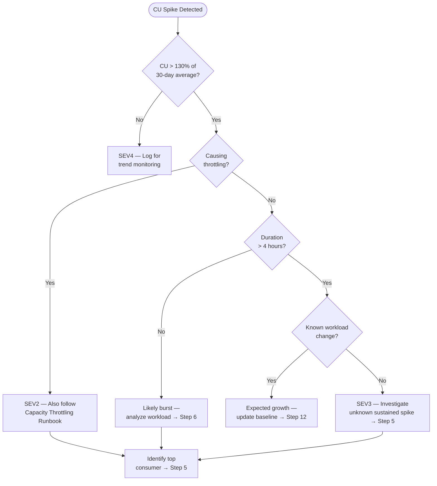

# 📈 Cost Spike Investigation Runbook

> **Last Updated**: 2026-05-05 | **Version**: 1.0
> **Audience**: FinOps, platform engineers, on-call SRE, capacity admins
> **Purpose**: Detect CU consumption anomalies, identify responsible workloads, distinguish burst vs sustained patterns, and take optimization actions to control Fabric costs.

<div align="center" markdown>


</div>

---

## Trigger Conditions

Use this runbook when any of the following conditions are observed:

| # | Condition | Detection Source |
|---|-----------|------------------|
| 1 | Daily CU consumption `> 130%` of the 30-day average | Capacity Metrics App → Utilization history |
| 2 | Azure Cost Management alert for Fabric resource cost spike | Azure Cost Management → Budget alert |
| 3 | CU consumption doubled or tripled day-over-day with no planned workload change | Workspace Monitoring → `system.capacity_metrics` |
| 4 | Unexpected Fabric SKU auto-scale event (if auto-scale is enabled) | Azure Activity Log → resource scale event |
| 5 | Monthly Fabric bill `> 120%` of budget forecast | FinOps dashboard / Azure Cost Analysis |
| 6 | Single workspace consuming `> 60%` of total capacity CU | Capacity Metrics App → per-workspace breakdown |
| 7 | Data Activator alert for CU consumption anomaly | Activator reflex notification |

---

## Severity Classification

| Severity | Condition | Example | Response SLA |
|----------|-----------|---------|--------------|
| **SEV2** | CU spike causing throttling on production workloads; immediate budget overage risk | 3x normal CU for 4+ hours; capacity throttling started; projected monthly overage >50% | **15 min** page |
| **SEV3** | Elevated CU consumption without throttling; budget variance detected | 1.5x normal CU for one day; no throttling; projected monthly overage 20–50% | **2 hr** ack |
| **SEV4** | Minor CU increase explained by known workload growth; informational | 10% increase aligned with new dataset onboarding | **24 hr** ack |

---

## Decision Flowchart



---

## Step-by-Step Procedure

### Phase 1 — Detect and Scope (0–30 min)

**Step 1.** Open the **Capacity Metrics App** and navigate to the **Utilization** tab. Record:
   - Current CU utilization percentage.
   - 7-day and 30-day average CU utilization.
   - The exact time window when the spike began.

**Step 2.** Calculate the spike magnitude:

```
Spike Ratio = Current Daily CU / 30-Day Average Daily CU
```

   - `1.0–1.3x` = Normal variance (SEV4)
   - `1.3–2.0x` = Moderate spike (SEV3)
   - `> 2.0x` = Major spike (SEV2 if throttling, SEV3 otherwise)

**Step 3.** Check whether the spike is causing throttling. If yes, also follow the [Capacity Throttling Runbook](capacity-throttling.md) in parallel.

**Step 4.** Classify severity and open an incident channel if SEV2.

### Phase 2 — Identify Root Cause (30–90 min)

**Step 5.** Query Workspace Monitoring to identify the top CU-consuming items during the spike window:

```kql
system_capacity_metrics
| where Timestamp between(datetime("2026-05-05T00:00") .. datetime("2026-05-05T23:59"))
| summarize TotalCU = sum(CUSeconds) by WorkspaceName, ItemName, ItemType
| order by TotalCU desc
| take 20
```

**Step 6.** For each top consumer, determine whether the CU increase is expected:

| Question | If Yes | If No |
|----------|--------|-------|
| Was a new dataset onboarded this week? | Expected growth — update baseline | Investigate further |
| Was a notebook or pipeline modified recently? | Check for regression (removed partition, full reload vs incremental) | Not the cause |
| Is this a scheduled job running longer than usual? | Check for data volume growth or source issues | Not the cause |
| Is an ad-hoc Power BI report scanning a large table? | Identify the report and user | Not the cause |
| Is an Eventhouse ingestion burst from a live event? | Expected burst — will self-resolve | Not the cause |

**Step 7.** Compare CU consumption by workload type to identify the category driving the spike:

```kql
system_capacity_metrics
| where Timestamp > ago(24h)
| summarize TotalCU = sum(CUSeconds) by ItemType
| order by TotalCU desc
```

Common CU-heavy workload types:

| Workload Type | Typical CU Pattern | Investigation Focus |
|---------------|-------------------|---------------------|
| Notebook / Spark | Large single jobs | Spark config, data volume, partition strategy |
| Pipeline (Copy) | Proportional to data volume | Source data growth, full vs incremental |
| Semantic Model Refresh | Proportional to model size | Import vs Direct Lake, incremental refresh |
| Dataflow Gen2 | Proportional to transformation complexity | Query folding, mashup optimization |
| SQL / Warehouse Query | Proportional to scan size | Query optimization, statistics, caching |
| Eventhouse Ingestion | Proportional to event volume | Event Hub throughput, batching |

**Step 8.** If a single notebook or pipeline is responsible, check for common CU waste patterns:

```python
# Check for Spark config issues
print(f"Shuffle partitions: {spark.conf.get('spark.sql.shuffle.partitions')}")
print(f"AQE enabled: {spark.conf.get('spark.sql.adaptive.enabled')}")
print(f"Executor memory: {spark.conf.get('spark.executor.memory')}")
print(f"Max executors: {spark.conf.get('spark.dynamicAllocation.maxExecutors', 'N/A')}")
```

### Phase 3 — Classify Spike Pattern

**Step 9.** Determine whether this is a **burst** or **sustained** spike using the [Burst vs Sustained Analysis](#burst-vs-sustained-analysis) section.

**Step 10.** For **burst** spikes (< 4 hours):
   - If caused by a known event (end-of-month processing, large data load), document and accept.
   - If caused by a runaway job, cancel it and optimize (see [Optimization Actions](#optimization-actions)).

**Step 11.** For **sustained** spikes (> 4 hours):
   - Identify structural changes (new workloads, data volume growth, missing optimizations).
   - Determine whether the current SKU is adequate for the new baseline.

### Phase 4 — Resolve and Optimize

**Step 12.** Apply relevant optimization actions from the [Optimization Actions](#optimization-actions) table.

**Step 13.** If the spike represents genuine growth, evaluate whether to:
   - **Scale up** the Fabric capacity to a higher SKU.
   - **Scale out** by distributing workloads across multiple capacities.
   - **Optimize** workloads to fit within the current SKU.

**Step 14.** Update the CU consumption baseline and alert thresholds:

```bash
# Update Azure Monitor alert threshold
az monitor metrics alert update \
  --name "fabric-cu-spike-alert" \
  --resource-group rg-fabric-prod \
  --condition "avg CUPercentage > 85" \
  --window-size 30m
```

**Step 15.** Document findings and proceed to the [Post-Incident Review Checklist](#post-incident-review-checklist).

---

## Burst vs Sustained Analysis

| Characteristic | Burst Spike | Sustained Spike |
|---------------|-------------|-----------------|
| **Duration** | < 4 hours | > 4 hours (often days) |
| **Shape** | Sharp rise and fall | Elevated plateau |
| **Cause** | Single large job, ad-hoc query, data backfill | New workload onboarded, data volume growth, missing optimization |
| **Smoothing impact** | Absorbed by 24-hour smoothing window | Exhausts smoothing, triggers throttling |
| **Resolution** | Cancel/reschedule job; accept if planned | Optimize workloads or scale capacity |
| **Budget impact** | Minimal (one-time) | Significant (ongoing) |

### How to Distinguish

```kql
// Plot hourly CU to see the shape
system_capacity_metrics
| where Timestamp > ago(7d)
| summarize HourlyCU = sum(CUSeconds) by bin(Timestamp, 1h)
| render timechart
```

- **Burst**: Single peak in the chart, returns to baseline within hours.
- **Sustained**: Elevated baseline visible across multiple days.

---

## Optimization Actions

| # | Action | Applicability | Expected CU Savings |
|---|--------|--------------|---------------------|
| 1 | Convert Import semantic models to **Direct Lake** | Models with large tables | Eliminates refresh CU |
| 2 | Enable **incremental refresh** on semantic models | Models refreshed daily | 60–90% refresh CU reduction |
| 3 | Apply **V-Order** on Delta tables | Large scan-heavy tables | 10–30% query CU reduction |
| 4 | Run **OPTIMIZE** + **VACUUM** on fragmented Delta tables | Tables with many small files | 15–25% read CU reduction |
| 5 | Enable **query folding** in Dataflow Gen2 | Dataflows against SQL/OData sources | Pushes compute to source |
| 6 | Cap **Spark autoscale max executors** | Notebooks with dynamic allocation | Prevents runaway CU |
| 7 | Stagger refresh schedules across the hour | Multiple refreshes at `:00` | Reduces peak CU burst |
| 8 | Move dev/test workspaces to separate (smaller) capacity | Mixed prod/dev on one capacity | Isolates non-prod CU |
| 9 | Replace full-reload pipelines with **incremental / CDC** | Pipelines doing full table copies | 70–95% pipeline CU reduction |
| 10 | Use **Lakehouse SQL endpoint** for light queries instead of Spark | Simple SELECT queries | 5–10x less CU per query |

---

## Escalation Path

| Time Elapsed | Action | Contact |
|--------------|--------|---------|
| **0 min** | On-call / FinOps analyst begins investigation | On-call rotation / FinOps team |
| **30 min** | If spike is causing throttling, escalate per [Capacity Throttling Runbook](capacity-throttling.md) | Platform Lead |
| **2 hr** | If root cause unclear, engage data engineering team lead | Data Engineering Lead |
| **4 hr** | If SKU change is needed, get budget approval from FinOps | FinOps Manager |
| **8 hr** | If sustained spike exceeds budget by >30%, escalate to VP Engineering | VP Engineering |
| **24 hr** | Monthly cost review with leadership if trend continues | CTO / CFO |

---

## Post-Incident Review Checklist

- [ ] Spike start time and end time documented
- [ ] Spike magnitude calculated (ratio to 30-day average)
- [ ] Spike classified as burst or sustained
- [ ] Top CU-consuming items identified with workspace and item names
- [ ] Root cause determined (new workload, regression, data growth, runaway job, ad-hoc query)
- [ ] Optimization actions applied (list which ones from the table above)
- [ ] CU consumption baseline updated
- [ ] Alert thresholds reviewed and adjusted if needed
- [ ] Budget forecast updated to reflect new baseline (if sustained)
- [ ] SKU right-sizing evaluation completed (if sustained)
- [ ] FinOps dashboard updated with spike annotation
- [ ] Runbook accuracy reviewed — any steps to add or update?
- [ ] Blameless postmortem completed within 48 hours (SEV2 only)

---

## Related Documents

| Document | Description |
|----------|-------------|
| [Capacity Planning & Cost Optimization](../best-practices/capacity-planning-cost-optimization.md) | SKU sizing and cost governance |
| [FinOps & Cost Governance](../best-practices/finops-cost-governance.md) | FinOps framework for Fabric |
| [Monitoring & Observability](../best-practices/monitoring-observability.md) | Dashboard setup and alerting |
| [Workspace Monitoring](../features/workspace-monitoring.md) | CU metrics and KQL queries |
| [Capacity Throttling](capacity-throttling.md) | When cost spike causes throttling |
| [Incident Response Template](incident-response-template.md) | Master incident response structure |

---

[⬆️ Back to Top](#-cost-spike-investigation-runbook) | [📋 Runbook Index](index.md) | [🏠 Home](../index.md)
