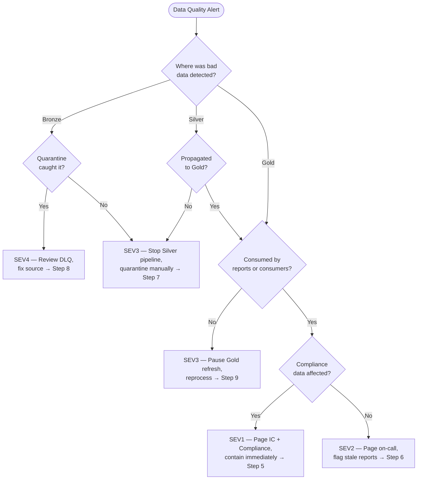

# 🧪 Data Quality Incident Runbook

> **Last Updated**: 2026-05-05 | **Version**: 2.0
> **Audience**: Data engineers, on-call SRE, data stewards, compliance officers
> **Purpose**: Detect data quality degradation, assess downstream impact, quarantine bad records, communicate with stakeholders, and remediate — without propagating bad data through the medallion architecture.

<div align="center" markdown>


</div>

---

## Trigger Conditions

Use this runbook when any of the following conditions are observed:

| # | Condition | Detection Source |
|---|-----------|------------------|
| 1 | Great Expectations checkpoint failed — one or more expectations did not pass | `great_expectations checkpoint run` exit code; webhook notification |
| 2 | Schema drift at Bronze ingest — new column, type change, or column removed | Bronze notebook log; `mergeSchema` warning; pipeline error |
| 3 | Null spike beyond threshold — null rate on a required column exceeds 5x historical baseline | GE `expect_column_values_to_not_be_null`; Workspace Monitoring KQL alert |
| 4 | Duplicate key violation — primary or business key has `count > 1` | GE `expect_column_values_to_be_unique`; Silver MERGE failure |
| 5 | Referential integrity broken — Silver fact rows reference non-existent dimension keys | Silver post-load join check; Gold FK validation |
| 6 | Business-rule violation — domain rule failed (e.g., `coin_out > coin_in × 100`, negative revenue) | GE custom expectation; KQL business-rule monitor |
| 7 | Downstream consumer reports incorrect data | Email, Teams, support ticket from analyst or executive |
| 8 | Anomaly detection — Data Activator or Workspace Monitoring flags a metric outside expected band | Activator reflex; KQL anomaly detector |

---

## Severity Classification

> **Rule of thumb**: Classify by the **furthest-downstream layer** the bad data has reached, not by the layer where it was detected. A null spike caught in Bronze is SEV4. The same null spike found in a Power BI exec report is SEV2.

| Severity | Definition | Example (Casino) | Response SLA |
|----------|------------|------------------|--------------|
| **SEV1** | Compliance-impacting bad data already consumed by audit reports / regulators | Wrong CTR threshold caused a $9,500 transaction to be filed as reportable; SAR pattern detection missed structuring | **5 min** page |
| **SEV2** | Bad data in Gold consumed by execs / customers / external reports | `gold.fact_daily_slot_performance` shows negative win/loss; Power BI exec dashboard shows wrong revenue | **15 min** page |
| **SEV3** | Bad data in Silver, not yet propagated to Gold | `silver_slot_cleansed` failed dedup; orphan FK in `silver_slot_session` | **2 hr** ack |
| **SEV4** | Bad data in Bronze, caught by quarantine before Silver runs | 12% of last batch's `slot_telemetry` rows had null `machine_id`, routed to DLQ | **4 hr** ack |

### Compliance Override

Any incident touching **CTR, SAR, W-2G, HIPAA PHI, FedRAMP audit logs, 42 CFR Part 2 SUD records, or PCI cardholder data** is automatically **SEV1 or SEV2** regardless of layer.

---

## Decision Flowchart



---

## Step-by-Step Procedure

### Phase 1 — Detect and Classify (0–15 min)

**Step 1.** Identify the quality issue type from the trigger condition. Collect:
   - Affected table(s) and column(s).
   - Number of bad records.
   - Time range of affected data.
   - Detection source (GE checkpoint, consumer report, anomaly alert).

**Step 2.** Determine the furthest-downstream layer the bad data has reached:

```python
# Check if bad data propagated to Silver
bad_keys = spark.sql("""
    SELECT DISTINCT machine_id FROM bronze_slot_telemetry
    WHERE machine_id IS NULL AND process_date = '2026-05-05'
""")

silver_impact = spark.sql("""
    SELECT COUNT(*) as affected FROM silver_slot_cleansed
    WHERE machine_id IS NULL AND process_date = '2026-05-05'
""").collect()[0]["affected"]

print(f"Silver impact: {silver_impact} rows")
```

**Step 3.** Classify severity using the table above. If SEV1 or SEV2, open an incident channel immediately.

**Step 4.** If compliance data is affected (CTR, SAR, W-2G, PHI), notify the Compliance Officer regardless of severity.

### Phase 2 — Contain (15–45 min)

**Step 5.** *SEV1 — Compliance data affected*:
   1. **Halt all downstream processing** — pause Silver and Gold pipelines that consume the affected table.
   2. Mark affected Power BI reports with a data quality banner or pause scheduled refreshes.
   3. Notify the Compliance Officer with affected record count and time range.
   4. Preserve the bad data for forensic analysis (do not delete).

**Step 6.** *SEV2 — Gold data consumed by reports*:
   1. Pause the semantic model refresh for affected datasets.
   2. Add a note to the Power BI report indicating data under investigation.
   3. Notify affected report consumers via Teams / email.

**Step 7.** *SEV3 — Bad data in Silver, not yet in Gold*:
   1. Pause Gold pipelines that consume the affected Silver table.
   2. Quarantine bad records (see [Quarantine Procedures](#quarantine-procedures)).
   3. Allow good records to continue flowing.

**Step 8.** *SEV4 — Caught in Bronze quarantine*:
   1. Review the dead-letter queue (DLQ) table for the affected batch.
   2. Determine root cause from source system.
   3. No immediate downstream action needed — quarantine worked as designed.

### Phase 3 — Diagnose (45–120 min)

**Step 9.** Investigate the root cause by issue type:

| Issue Type | Diagnostic Query | Common Root Cause |
|-----------|-----------------|-------------------|
| **Null spike** | `SELECT COUNT(*) FROM table WHERE col IS NULL AND process_date = 'X'` | Source system schema change; ETL bug; missing required field |
| **Duplicate keys** | `SELECT key, COUNT(*) FROM table GROUP BY key HAVING COUNT(*) > 1` | Idempotency failure; re-run without dedup; source sent duplicates |
| **Schema drift** | `DESCRIBE TABLE table` vs expected schema | Source added/renamed/removed column |
| **Referential integrity** | `SELECT f.* FROM fact f LEFT JOIN dim d ON f.key = d.key WHERE d.key IS NULL` | Dimension load ran after fact load; dimension record deleted |
| **Business rule violation** | GE custom expectation failure details | Data entry error; calculation bug; threshold change |
| **Anomaly** | `SELECT metric, process_date FROM table WHERE metric > threshold` | Source data change; seasonal pattern; real-world event |

**Step 10.** Determine the scope of impact:

```python
# Count affected records by date
impact = spark.sql("""
    SELECT process_date, COUNT(*) as bad_records
    FROM affected_table
    WHERE quality_flag = 'FAILED'
    GROUP BY process_date
    ORDER BY process_date
""")
impact.show()
```

### Phase 4 — Remediate

**Step 11.** Fix the root cause:
   - **Source-side fix**: Coordinate with the source system team to correct the data or schema.
   - **ETL fix**: Update the notebook or pipeline transformation logic.
   - **Validation fix**: Add or tighten Great Expectations rules to catch this earlier.

**Step 12.** Reprocess affected data:

```python
# Reprocess affected partitions through Silver
affected_dates = ["2026-05-04", "2026-05-05"]

for date in affected_dates:
    mssparkutils.notebook.run(
        "01_silver_slot_cleansing",
        timeout_seconds=3600,
        arguments={"process_date": date}
    )

# Then reprocess Gold
for date in affected_dates:
    mssparkutils.notebook.run(
        "01_gold_slot_performance",
        timeout_seconds=3600,
        arguments={"process_date": date}
    )
```

**Step 13.** Validate the reprocessed data:

```bash
great_expectations checkpoint run silver_checkpoint
great_expectations checkpoint run gold_checkpoint
```

### Phase 5 — Verify and Close

**Step 14.** Confirm downstream reports show correct data:
   - Refresh affected semantic models.
   - Verify Power BI report values match expected results.
   - Remove any data quality banners from reports.

**Step 15.** Notify stakeholders that the issue is resolved (see [Stakeholder Communication](#stakeholder-communication)).

**Step 16.** Document the incident and complete the [Post-Incident Review Checklist](#post-incident-review-checklist).

---

## Quarantine Procedures

### Bronze Quarantine (DLQ Pattern)

Route records that fail validation to a dead-letter queue table instead of blocking the pipeline:

```python
from pyspark.sql.functions import col, lit, current_timestamp

# Validate incoming batch
valid = df.filter(col("machine_id").isNotNull() & col("event_timestamp").isNotNull())
invalid = df.filter(col("machine_id").isNull() | col("event_timestamp").isNull())

# Write valid records to Bronze
valid.write.format("delta").mode("append").save("Tables/bronze_slot_telemetry")

# Write invalid records to DLQ with metadata
invalid.withColumn("_dlq_reason", lit("null_required_field")) \
       .withColumn("_dlq_timestamp", current_timestamp()) \
       .write.format("delta").mode("append") \
       .save("Tables/_dlq_slot_telemetry")
```

### Silver Quarantine

Tag records that fail business rules without removing them:

```python
df_silver = df_silver.withColumn(
    "quality_flag",
    when(col("coin_out") > col("coin_in") * 100, "SUSPECT")
    .when(col("revenue") < 0, "SUSPECT")
    .otherwise("PASS")
)

# Only promote PASS records to Gold
df_gold_ready = df_silver.filter(col("quality_flag") == "PASS")
```

---

## Stakeholder Communication

| Timing | Audience | Channel | Content |
|--------|----------|---------|---------|
| **Immediately** (SEV1/SEV2) | On-call team, IC | Incident bridge | Issue detected, containment in progress |
| **Within 30 min** | Report consumers | Teams / email | "Data under investigation — reports may show stale data" |
| **Within 1 hr** | Compliance (if applicable) | Compliance channel | Affected record count, time range, regulatory impact |
| **Upon resolution** | All stakeholders | Teams / email | "Issue resolved — data corrected as of [timestamp]" |
| **Within 48 hr** | Engineering team | Postmortem meeting | Root cause, timeline, prevention measures |

---

## Remediation Patterns

| Pattern | When to Use | Procedure |
|---------|-------------|-----------|
| **Reprocess from Bronze** | Silver or Gold data is wrong but Bronze is clean | Re-run Silver + Gold notebooks for affected dates |
| **Backfill from source** | Bronze data is also wrong | Re-ingest from source system, then reprocess Silver + Gold |
| **Manual correction** | Small number of records with known correct values | SQL UPDATE on affected rows with audit trail |
| **Delta time travel** | Need to revert to a known-good state | `RESTORE TABLE table TO VERSION AS OF <version>` |
| **Quarantine release** | DLQ records fixed and ready to promote | Move records from DLQ to Bronze, then process normally |

---

## Escalation Path

| Time Elapsed | Action | Contact |
|--------------|--------|---------|
| **0 min** | On-call engineer begins triage | On-call rotation |
| **5 min** | If SEV1 (compliance data), page Compliance Officer and IC | Compliance Officer + IC |
| **15 min** | If SEV2, page Data Platform Lead | Data Platform Lead |
| **1 hr** | If root cause is source-side, engage source system team | Source System Owner |
| **2 hr** | If reprocessing blocked, escalate to VP Engineering | VP Engineering |
| **4 hr** | If compliance reporting deadline at risk, notify Legal | Legal Counsel |

---

## Post-Incident Review Checklist

- [ ] Affected table(s), column(s), and record count documented
- [ ] Time range of bad data identified
- [ ] Furthest-downstream layer reached by bad data documented
- [ ] Root cause category identified (source change, ETL bug, schema drift, validation gap)
- [ ] Quarantine procedure executed (DLQ, tagging, pipeline pause)
- [ ] Data reprocessed and validated with Great Expectations
- [ ] Downstream reports refreshed and verified
- [ ] Stakeholders notified of resolution
- [ ] New or tightened GE expectations added to prevent recurrence
- [ ] Source system team notified (if source-side root cause)
- [ ] Monitoring alert created or tuned for this failure pattern
- [ ] Compliance impact assessed and documented (if applicable)
- [ ] Runbook accuracy reviewed — any steps to add or update?
- [ ] Blameless postmortem completed within 48 hours (SEV1/SEV2 only)

---

## Related Documents

| Document | Description |
|----------|-------------|
| [Testing Strategies](../best-practices/testing-strategies.md) | Great Expectations setup and test patterns |
| [Error Handling & Monitoring](../best-practices/error-handling-monitoring.md) | Pipeline error architecture |
| [Monitoring & Observability](../best-practices/monitoring-observability.md) | Dashboard and alert setup |
| [Medallion Architecture Deep Dive](../best-practices/medallion-architecture-deep-dive.md) | Bronze/Silver/Gold patterns |
| [Data Governance Deep Dive](../best-practices/data-governance-deep-dive.md) | Purview and governance patterns |
| [Incident Response Template](incident-response-template.md) | Master incident response structure |
| [Failed Refresh Triage](failed-refresh-triage.md) | When quality issue causes refresh failure |

---

[⬆️ Back to Top](#-data-quality-incident-runbook) | [📋 Runbook Index](index.md) | [🏠 Home](../index.md)
