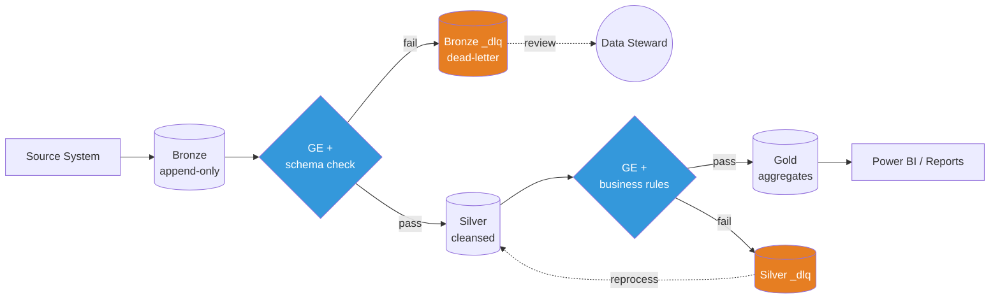
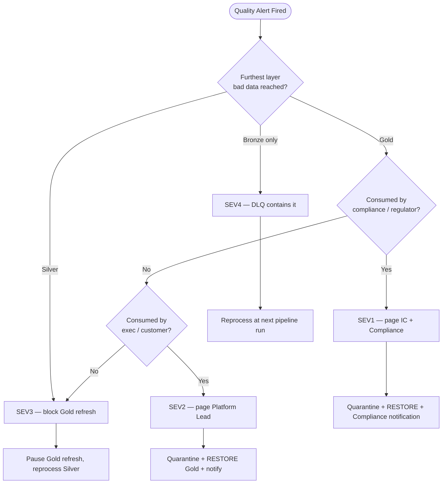
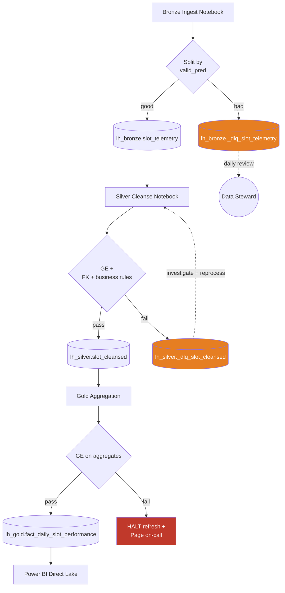

[Home](../index.md) > [Docs](..) > [Runbooks](README.md) > Data Quality Incident

# 🧪 Data Quality Incident Response

> **Last Updated**: 2026-04-27 | **Phase**: 14 (Wave 1) | **Anchor**: [Incident Response Template](incident-response-template.md)
> **Audience**: Data engineers, on-call SRE, data stewards, compliance officers
> **Purpose**: Respond to data quality breaches detected via Great Expectations failures, schema drift, downstream consumer reports, or anomaly detection — without propagating bad data through the medallion.

<div align="center" markdown>


</div>

---

## 📑 Table of Contents

1. [Symptoms](#symptoms)
2. [Severity Classification](#severity-classification)
3. [Quarantine-First Pattern](#quarantine-first-pattern)
4. [Diagnostic Steps](#diagnostic-steps)
5. [Investigation by Quality Issue Type](#investigation-by-quality-issue-type)
6. [Resolution Procedures](#resolution-procedures)
7. [Verification](#verification)
8. [Rollback](#rollback)
9. [Post-Incident Actions](#post-incident-actions)
10. [Escalation](#escalation)
11. [Quick-Reference Commands](#quick-reference-commands)
12. [Decision Trees](#decision-trees)
13. [Related Runbooks](#related-runbooks)

---

## Symptoms

A data quality incident is any condition where data does not meet contracted expectations. Triggers come from automated checks, downstream alerts, or human reports.

| # | Symptom | Detection Source | Typical Layer |
|---|---------|------------------|---------------|
| 1 | **GE checkpoint failed** — one or more expectations did not pass on the latest batch | `great_expectations checkpoint run` exit code; checkpoint webhook | Bronze, Silver, Gold |
| 2 | **Schema drift at Bronze ingest** — new column appeared, type changed, or column removed | Bronze ingestion notebook log; `mergeSchema` warning; pipeline activity error | Bronze |
| 3 | **Null spike beyond threshold** — null rate on a required column exceeds the historical baseline (e.g., 5×) | GE `expect_column_values_to_not_be_null`; Workspace Monitoring KQL alert | Bronze, Silver |
| 4 | **Duplicate key violation** — primary or business key has count > 1 | GE `expect_column_values_to_be_unique`; Silver MERGE failure; Gold dedup count delta | Silver, Gold |
| 5 | **Referential integrity broken** — Silver fact rows reference dimension keys that do not exist | Silver post-load join check; Gold star-schema FK validation | Silver, Gold |
| 6 | **Business-rule violation** — domain rule failed (e.g., `coin_out > coin_in × 100`, negative revenue, CTR < $10K wrongly flagged) | GE custom expectation; KQL business-rule monitor | Silver, Gold |
| 7 | **Downstream consumer reports incorrect data** — exec, analyst, regulator, or customer reports the report is wrong | Email, Teams, support ticket | Gold (usually) |
| 8 | **Anomaly detection** — Data Activator or Workspace Monitoring flags a metric outside expected band | Activator reflex; KQL anomaly detector | Any |

---

## Severity Classification

> **Rule of thumb:** classify by the **furthest-downstream layer** the bad data has reached, not by the layer where it was detected. A null spike caught in Bronze is SEV4. The same null spike found in a Power BI exec report is SEV2.

| Severity | Definition | Example (Casino) | Response SLA | Resolution SLA |
|----------|------------|------------------|--------------|----------------|
| **SEV1** | Compliance-impacting bad data already consumed by audit reports / regulators | Wrong CTR threshold caused a $9,500 transaction to be filed as reportable; SAR pattern detection missed structuring; W-2G amounts under-reported on filed tax forms | **5 min** page | **2 hr** |
| **SEV2** | Bad data in Gold consumed by execs / customers / external reports | `gold.fact_daily_slot_performance` shows negative win/loss for a casino floor; Power BI exec dashboard shows wrong revenue for yesterday | **15 min** page | **4 hr** |
| **SEV3** | Bad data in Silver, not yet propagated to Gold (no consumer impact yet) | `silver_slot_cleansed` failed dedup; orphan FK in `silver_slot_session` to `dim_machine` | **1 hr** ack | **24 hr** |
| **SEV4** | Bad data in Bronze, caught by quarantine before Silver runs | 12% of last batch's `slot_telemetry` rows had null `machine_id` and were routed to `_dlq_slot_telemetry` | **4 hr** ack | **5 business days** |

### Compliance Override

Any incident touching **CTR, SAR, W-2G, HIPAA PHI, FedRAMP audit logs, 42 CFR Part 2 SUD records, or PCI cardholder data** is automatically **SEV1 or SEV2** regardless of layer. See [Escalation](#escalation).

---

## Quarantine-First Pattern

> **Critical principle:** *Stop the bleeding by isolating bad records — do not block the pipeline for good records, and do not let bad records flow to the next layer.*



### Three Rules of Quarantine

1. **Continue good records.** Do not fail the entire batch when a subset is bad. Split the DataFrame.
2. **Move bad records to `*_dlq` (dead-letter) tables**, never to `/tmp` or local files. DLQ tables live in OneLake at `lh_bronze._dlq_<table>` and `lh_silver._dlq_<table>`.
3. **Tag every quarantined row** with `_quarantine_reason`, `_quarantine_timestamp`, `_source_batch_id`, and `_pipeline_run_id` so reprocessing is auditable.

### Reference Quarantine Snippet (PySpark)

```python
from pyspark.sql import functions as F

df = spark.table("lh_bronze.slot_telemetry_raw").where(F.col("ingest_date") == "2026-04-27")

# Validation predicate — keep aligned with GE suite
valid_pred = (
    F.col("machine_id").isNotNull() &
    F.col("event_timestamp").isNotNull() &
    (F.col("coin_in") >= 0) &
    (F.col("coin_out") >= 0) &
    (F.col("coin_out") <= F.col("coin_in") * 100)  # business rule guardrail
)

df_good = df.where(valid_pred)
df_bad  = (df.where(~valid_pred)
             .withColumn("_quarantine_reason", F.when(F.col("machine_id").isNull(), "null_machine_id")
                                                 .when(F.col("event_timestamp").isNull(), "null_timestamp")
                                                 .when(F.col("coin_in") < 0, "negative_coin_in")
                                                 .when(F.col("coin_out") < 0, "negative_coin_out")
                                                 .otherwise("business_rule_breach"))
             .withColumn("_quarantine_timestamp", F.current_timestamp())
             .withColumn("_pipeline_run_id", F.lit(mssparkutils.env.getJobId())))

df_good.write.format("delta").mode("append").saveAsTable("lh_bronze.slot_telemetry")
df_bad.write.format("delta").mode("append").saveAsTable("lh_bronze._dlq_slot_telemetry")
```

---

## Diagnostic Steps

### 1. Identify Affected Tables

```kql
// Workspace Monitoring — find tables with quality breaches in the last 24h
QualityMetrics_CL
| where TimeGenerated > ago(24h)
| where ExpectationsFailed_d > 0 or QualityScore_d < 0.95
| project TimeGenerated, TableName_s, ExpectationSuite_s,
          ExpectationsFailed_d, QualityScore_d, BatchId_g
| order by TimeGenerated desc
```

### 2. Identify Affected Partitions / Dates

```python
# Find the partition window where quality dropped
df_metrics = spark.sql("""
    SELECT ingest_date, COUNT(*) AS bad_rows
    FROM lh_bronze._dlq_slot_telemetry
    WHERE _quarantine_timestamp >= current_timestamp() - INTERVAL 24 HOURS
    GROUP BY ingest_date
    ORDER BY ingest_date
""")
df_metrics.show()
```

### 3. Identify Affected Source Records

```python
# Sample bad rows — copy a few to share in the incident channel
spark.table("lh_bronze._dlq_slot_telemetry") \
     .where("ingest_date = '2026-04-27'") \
     .select("machine_id", "event_timestamp", "coin_in", "coin_out",
             "_quarantine_reason", "_source_batch_id") \
     .limit(20).show(truncate=False)
```

### 4. Trace Through Medallion Layers

```python
# Is the bad data already in Silver? In Gold?
batch_ids = ["batch-20260427-0900", "batch-20260427-1000"]

for layer in ["lh_bronze.slot_telemetry", "lh_silver.slot_cleansed", "lh_gold.fact_daily_slot_performance"]:
    cnt = spark.sql(f"""
        SELECT COUNT(*) AS rows FROM {layer}
        WHERE _source_batch_id IN ({','.join(repr(b) for b in batch_ids)})
    """).collect()[0]["rows"]
    print(f"{layer}: {cnt} rows from affected batches")
```

### 5. Identify Downstream Consumers (Purview lineage)

```bash
# Use Purview Atlas API to walk lineage downstream from the affected table
az rest --method get \
  --url "https://${PURVIEW_ACCOUNT}.purview.azure.com/datamap/api/atlas/v2/lineage/${ASSET_GUID}?direction=OUTPUT&depth=5" \
  --resource "https://purview.azure.net" \
  --query "guidEntityMap"
```

Document every consumer (Power BI report, Data Agent, Data Activator reflex, downstream pipeline). They will need notification at the [Resolution](#resolution-procedures) step.

---

## Investigation by Quality Issue Type

### Null Spike

**Likely causes:**
- Source system schema change (column dropped or renamed at the producer)
- Schema mismatch — Bronze reader expects `machine_id`, source now sends `MachineId`
- Ingestion bug — null introduced by a transform that ran before the validate step
- Upstream data outage — partial batch delivered

**Investigation:**

```python
# Compare null rates today vs 7-day baseline
spark.sql("""
    WITH today AS (
      SELECT 'today' AS bucket,
             SUM(CASE WHEN machine_id IS NULL THEN 1 ELSE 0 END)/COUNT(*)::double AS null_rate
      FROM lh_bronze.slot_telemetry WHERE ingest_date = current_date()
    ),
    baseline AS (
      SELECT 'baseline_7d' AS bucket,
             SUM(CASE WHEN machine_id IS NULL THEN 1 ELSE 0 END)/COUNT(*)::double AS null_rate
      FROM lh_bronze.slot_telemetry
      WHERE ingest_date BETWEEN current_date() - INTERVAL 8 DAYS AND current_date() - INTERVAL 1 DAY
    )
    SELECT * FROM today UNION ALL SELECT * FROM baseline
""").show()
```

### Duplicate Keys

**Likely causes:**
- Source system retried a failed batch (no idempotency key)
- Late-arriving data — same `event_id` ingested in a subsequent batch
- Idempotency key not enforced in Silver MERGE

**Investigation:**

```python
# Find duplicate event_ids in Bronze
spark.sql("""
    SELECT event_id, COUNT(*) AS dupe_count, COLLECT_SET(_source_batch_id) AS batches
    FROM lh_bronze.slot_telemetry
    WHERE ingest_date = '2026-04-27'
    GROUP BY event_id
    HAVING COUNT(*) > 1
    ORDER BY dupe_count DESC
    LIMIT 20
""").show(truncate=False)
```

### Referential Integrity

**Likely causes:**
- Out-of-order arrival — fact arrived before its dimension row
- Lookup table stale — `dim_machine` not refreshed after a new floor cabinet was installed
- FK breach at the source

**Investigation:**

```python
# Find Silver fact rows with missing dimension parent
spark.sql("""
    SELECT s.machine_id, COUNT(*) AS orphan_facts
    FROM lh_silver.slot_cleansed s
    LEFT ANTI JOIN lh_silver.dim_machine d ON s.machine_id = d.machine_id
    GROUP BY s.machine_id
    ORDER BY orphan_facts DESC
""").show()
```

### Business-Rule Violation

**Likely causes:**
- Source bug — sensor sent negative coin_in
- Transformation bug — Silver code mis-mapped a column
- Edge case — a real but unanticipated scenario (jackpot creates apparent negative net win)

**Investigation:**

```python
# Casino business rule: net win/loss should be reasonable
spark.sql("""
    SELECT machine_id, event_timestamp, coin_in, coin_out, (coin_out - coin_in) AS net
    FROM lh_silver.slot_cleansed
    WHERE event_date = current_date()
      AND ((coin_out - coin_in) > coin_in * 50 OR coin_in < 0 OR coin_out < 0)
    ORDER BY net DESC
    LIMIT 50
""").show()
```

### Schema Drift

**Likely causes:**
- Producer changed schema without notice
- Schema-evolution policy mismatch — Bronze allowed merge, Silver rejected new column

**Investigation:**

```python
# Compare current schema to last-known-good
expected = spark.read.json("Files/contracts/slot_telemetry_v3.json").schema
actual = spark.table("lh_bronze.slot_telemetry").schema

added   = set(actual.fieldNames()) - set(expected.fieldNames())
removed = set(expected.fieldNames()) - set(actual.fieldNames())
print(f"Added columns: {added}")
print(f"Removed columns: {removed}")
```

---

## Resolution Procedures

### A. Quarantine Bad Records (DLQ pattern)

If quarantine has not yet happened (e.g., GE failed the whole batch and the pipeline halted), run the [reference quarantine snippet](#reference-quarantine-snippet-pyspark) and then resume downstream activities for the good subset only.

### B. Reprocess Affected Partitions

```python
# Reprocess Silver for a specific date range
affected_dates = ["2026-04-26", "2026-04-27"]

for d in affected_dates:
    mssparkutils.notebook.run(
        "01_silver_slot_cleansed",
        timeout_seconds=3600,
        arguments={"process_date": d, "reprocess": "true"}
    )
```

### C. Backfill from Known-Good Source

```python
# When source still has the original good data, re-ingest the affected window
mssparkutils.notebook.run(
    "01_bronze_slot_telemetry",
    timeout_seconds=7200,
    arguments={"start_date": "2026-04-26",
               "end_date":   "2026-04-27",
               "mode":       "backfill",
               "overwrite_partition": "true"}
)
```

### D. Delta RESTORE — Roll Back Gold to Pre-Corruption Version

```python
# 1. Inspect history to find the last clean version
spark.sql("DESCRIBE HISTORY lh_gold.fact_daily_slot_performance").show(20, False)

# 2. Restore to the last clean version (e.g., before the bad merge at version 145)
spark.sql("RESTORE TABLE lh_gold.fact_daily_slot_performance TO VERSION AS OF 144")

# 3. Or restore by timestamp
spark.sql("""
    RESTORE TABLE lh_gold.fact_daily_slot_performance
    TO TIMESTAMP AS OF '2026-04-27 05:00:00'
""")
```

### E. Notify Downstream Consumers (lineage-based)

For every asset returned by the Purview lineage walk in [Diagnostic Step 5](#5-identify-downstream-consumers-purview-lineage):

| Consumer Type | Notification Channel | Owner |
|---------------|----------------------|-------|
| Power BI report / dashboard | Email + Teams DM to report owner | Comms Lead |
| Data Agent / Copilot skill | Update agent grounding doc; pause if SEV1/2 | Technical Lead |
| Downstream pipeline | Pause schedule; queue reprocess | On-call engineer |
| External regulator / auditor | Formal letter via Compliance | Compliance Officer |
| Customer-facing API | Status page entry; email | Product + Comms |

### F. Update GE Rules (Change-Controlled Only)

If investigation determines the **rule was wrong** (false-positive expectation), do **not** silently relax it. Open a PR:

```bash
git checkout -b hotfix/incident-20260427-ge-rule-relaxation
# Edit validation/great_expectations/expectations/bronze_slot_telemetry_suite.json
# Add a meta.rationale field explaining why the rule changed
git commit -m "fix(ge): relax coin_out upper bound — confirmed legitimate jackpot pattern (INC-20260427)"
gh pr create --title "..." --reviewer @data-quality-team
```

Rule changes require **two reviewers**: a data engineer **and** a domain SME (compliance for CTR/SAR/W-2G).

---

## Verification

- [ ] **GE re-run passes.**
  ```bash
  cd validation/great_expectations
  python run_all_suites.py --suite bronze_slot_telemetry_suite --batch-date 2026-04-27
  ```
- [ ] **Row counts reconcile.** Bronze row count for the affected window matches the source system within ±0.1%.
- [ ] **Sample correctness checks.** Pull 20 random rows from Gold and verify against the source-of-truth (a casino host system query, regulator filing, etc.).
- [ ] **Power BI refresh succeeds** and exec dashboard tile values match the verified sample.
- [ ] **No DLQ growth** in the next two pipeline runs (proves the underlying cause is fixed, not just the symptom).
- [ ] **Watch period:** monitor for **2× the incident duration** (e.g., 4 hr if the incident was 2 hr) before declaring resolved.

---

## Rollback

If reprocessing makes things worse — for example, the corrected pipeline produces a new class of bad data, or the restore wiped out legitimate late-arriving rows:

### Step 1 — Delta Time-Travel Restore

```python
# Identify the last known-good version BEFORE the failed remediation
spark.sql("DESCRIBE HISTORY lh_silver.slot_cleansed").show(30, False)

# Roll back
spark.sql("RESTORE TABLE lh_silver.slot_cleansed TO VERSION AS OF 612")
```

### Step 2 — Restore Previous GE Expectation Suite

```bash
# Revert the suite file to the prior commit
git log --oneline validation/great_expectations/expectations/bronze_slot_telemetry_suite.json | head
git revert <commit-sha>
git push origin hotfix/incident-20260427-revert
```

### Step 3 — Repause Downstream

Re-pause downstream pipelines and Power BI refreshes until the next remediation attempt is verified.

---

## Post-Incident Actions

| Action | Owner | Timing |
|--------|-------|--------|
| Add or strengthen GE rule for the failure mode (e.g., add `expect_column_value_z_scores_to_be_less_than` for null-rate anomaly) | Data Engineer | Within 1 sprint |
| Add Workspace Monitoring alert on the quality dimension that failed (null rate, dupe rate, FK orphan count, business-rule violation count) | SRE | Within 1 week |
| Source system feedback loop — file ticket with the producer team referencing the schema or content issue | Technical Lead | Within 48 hr |
| Update data contract — bump version, communicate to consumers | Data Steward | Within 2 weeks |
| Postmortem with consumer reps (exec, analyst, compliance) — use the [blameless template](incident-response-template.md#blameless-postmortem-template) | Incident Commander | Within 48 hr |
| Add regression test in `validation/unit_tests/` that fails without the fix | Data Engineer | Same PR as fix |
| Update this runbook if a new failure mode was discovered | IC | Within 1 week |

---

## Escalation

| Trigger | Escalate To | Channel | Time |
|---------|-------------|---------|------|
| **SOX / financial-reporting impact** | CFO + VP Finance + Compliance Officer | Phone + email | Immediate |
| **HIPAA PHI exposure** (Tribal Healthcare) | HIPAA Privacy Officer + Legal | Phone | Immediate |
| **42 CFR Part 2 SUD record exposure** | Compliance Officer + Legal | Phone | Immediate |
| **PCI cardholder data** | Security Officer + Acquiring Bank Liaison | Phone | Immediate |
| **CTR / SAR / W-2G filing affected** | Casino Compliance Officer + AML team | Phone + email | Immediate |
| **Source system root cause** | Source system owner (named contact in data contract) | Email + ticket | Within 30 min |
| **Customer-visible report wrong** | Affected consumer team lead + Comms Lead | Teams DM + email | Within 30 min |
| **Multi-domain blast radius** (>3 downstream consumers) | Platform Lead + IC promotion to SEV1 | Phone bridge | Immediate |

See [incident-response-template.md § Communication Tree](incident-response-template.md#communication-tree) for the full internal escalation path.

---

## Quick-Reference Commands

### Great Expectations

```bash
# Run a single suite against the latest batch
cd validation/great_expectations
python run_all_suites.py --suite bronze_slot_telemetry_suite

# Run an entire checkpoint (all suites in scope)
python run_all_suites.py --checkpoint all_domains_checkpoint

# Validate a specific date partition
python validate_data.py --table lh_bronze.slot_telemetry --partition ingest_date=2026-04-27
```

### PySpark Data-Quality Probes

```python
# Null counts per column (parameterize for any table)
from pyspark.sql import functions as F
df = spark.table("lh_silver.slot_cleansed")
nulls = df.select([F.sum(F.col(c).isNull().cast("int")).alias(c) for c in df.columns])
nulls.show(truncate=False)

# Duplicate detection on business key
df.groupBy("event_id").count().filter("count > 1").show(20, False)

# Referential integrity check (Silver fact -> dim)
spark.sql("""
    SELECT COUNT(*) AS orphan_count
    FROM lh_silver.slot_cleansed s
    LEFT ANTI JOIN lh_silver.dim_machine d ON s.machine_id = d.machine_id
""").show()

# Business-rule violations
spark.sql("""
    SELECT COUNT(*) FROM lh_silver.slot_cleansed
    WHERE coin_in < 0 OR coin_out < 0 OR coin_out > coin_in * 100
""").show()
```

### Delta History + RESTORE

```python
# Show last 30 versions and what changed
spark.sql("DESCRIBE HISTORY lh_gold.fact_daily_slot_performance").show(30, False)

# Restore by version
spark.sql("RESTORE TABLE lh_gold.fact_daily_slot_performance TO VERSION AS OF 144")

# Restore by timestamp
spark.sql("RESTORE TABLE lh_gold.fact_daily_slot_performance TO TIMESTAMP AS OF '2026-04-27 05:00:00'")
```

### KQL — Quality Metrics (Workspace Monitoring)

```kql
// Quality score trend by table — last 7 days
QualityMetrics_CL
| where TimeGenerated > ago(7d)
| summarize avg_score = avg(QualityScore_d) by bin(TimeGenerated, 1h), TableName_s
| render timechart

// Top failing expectations in the last 24h
QualityMetrics_CL
| where TimeGenerated > ago(24h) and ExpectationsFailed_d > 0
| extend failed = parse_json(FailedExpectations_s)
| mv-expand failed
| summarize fail_count = count() by tostring(failed.expectation_type), TableName_s
| order by fail_count desc

// DLQ growth alert — quarantined rows per hour by reason
DLQMetrics_CL
| where TimeGenerated > ago(24h)
| summarize quarantined = sum(RowCount_d) by bin(TimeGenerated, 1h), QuarantineReason_s
| render columnchart
```

---

## Decision Trees

### Quality Issue Triage



### Medallion Quarantine Flow



---

## Related Runbooks

| Runbook | When to Use |
|---------|-------------|
| [Incident Response Template](incident-response-template.md) | Anchor template — open in parallel for any SEV1/2 |
| [Pipeline Failure Triage](pipeline-failure-triage.md) | If quality failure caused the pipeline activity to fail |
| [Capacity Throttling Response](capacity-throttling-response.md) | If reprocess workload threatens to throttle capacity |
| [Tenant Migration (Dev/Staging/Prod)](tenant-migration-dev-staging-prod.md) | If a bad GE rule needs hotfix promotion |
| [Multi-Region Failover](multi-region-failover.md) | If quality failure is region-specific |

## Related Best-Practice Docs

| Document | Description |
|----------|-------------|
| [Testing Strategies](../best-practices/testing-strategies.md) | Unit, integration, and data-quality test architecture (incl. GE) |
| [Medallion Architecture Deep Dive](../best-practices/medallion-architecture-deep-dive.md) | Quality enforcement points across Bronze/Silver/Gold |
| [Error Handling & Monitoring](../best-practices/error-handling-monitoring.md) | DLQ patterns, retry, idempotency |
| [Alerting & Data Activator](../best-practices/alerting-data-activator.md) | How quality alerts become pages |
| [Monitoring & Observability](../best-practices/monitoring-observability.md) | Workspace Monitoring + KQL for quality metrics |
| [Data Governance Deep Dive](../best-practices/data-governance-deep-dive.md) | Purview lineage walk for downstream notification |
| [Incremental Refresh & CDC](../best-practices/incremental-refresh-cdc.md) | Reprocess and backfill patterns |

---

[⬆️ Back to Top](#-data-quality-incident-response) | [📚 Runbooks Index](README.md) | [🏠 Home](../index.md)
